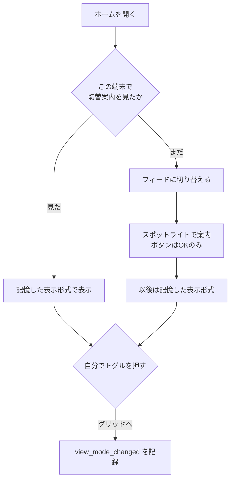
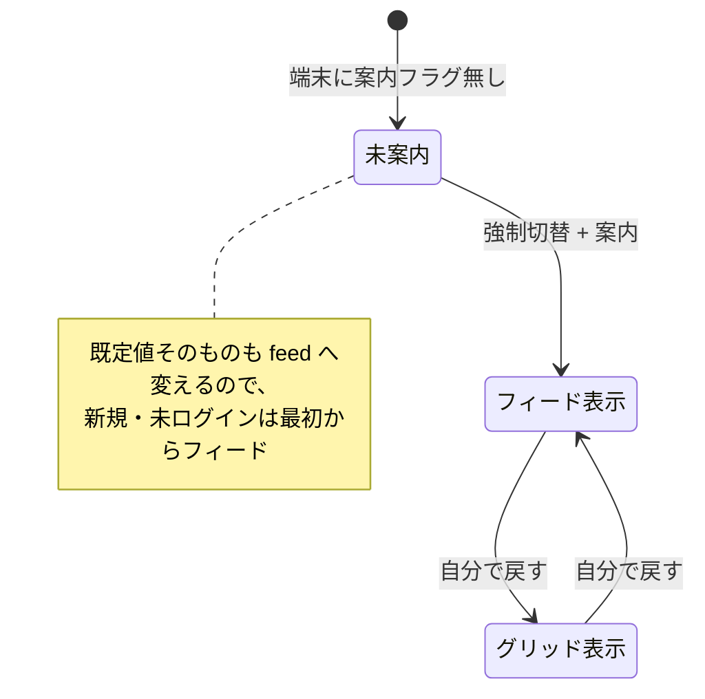
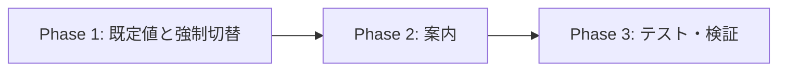

# ホームの既定表示をフィードへ切り替える 実装計画書

作成日: 2026-08-14
ステータス: 計画（設計はユーザーと合意済み）

## ゴール

ホームの既定表示を**グリッド → フィード**へ切り替える。あわせて
**スポットライト付きの案内**を1回だけ出し、戻したい人が戻せる場所を教える。

## なぜやるか

フィードは公開したが、**既定がグリッドのままではほとんど見られていない**。

実測（2026-08-10〜08-12）:

- ホームを見た **29人中、フィードに切り替えたのは4人（14%）**
- CTA タップ10回のうち **9回が1人に集中**

この状態では**フィードの良し悪しを判断すること自体ができない**。既定を変えて
母数を作る。

**前提だった「クリエイター還元の周知」は 2026-08-13 に完了**した
（お知らせ3本・投稿ボーナスの生成方法別化・付与モーダルでの告知）。
フィードの価値は「このプロンプトで生成 → 原作者に還元」の循環にあるため、
還元を知らない状態で見せても価値が半分しか伝わらない、というのが待った理由。

## スコープ外

- グリッド表示の削除（**残す**。戻せることが今回の設計の前提）
- フィードカードのデザイン変更
- 投稿ボーナス・還元額の見直し（8月末の別判断）

## 概要図

### 誰に何が起きるか

### 切替の状態

## ユーザーストーリー

### ① 初めて来た人／未ログインの人

ホームを開くと、いきなり**1列のフィード**が並ぶ。Before/After が大きく見え、
「このプロンプトで生成する」も見える。切替トグルがあることには気づかなくてよい。

### ② これまでグリッドで見ていた人（大多数）

いつもどおりホームを開くと、**表示がフィードに変わっている**。
同時に**トグルの位置が明るく浮かび上がり**、こう出る。

> **表示が新しくなりました**
> 作品が大きく見えるようになりました。
> 元の並びに戻したいときは、ここから切り替えられます。
> 　　　　　　　　　　　　　　　　　　　　　[ OK ]

OK を押すと消える。**次からは出ない。**

### ③ 戻したい人

案内で場所を知っているので、トグルを押してグリッドに戻す。
以後はグリッドのまま。**この操作は記録され、「何%が戻したか」の分母になる。**

### ④ 自分でグリッドを選んでいた4人

**一度だけ上書きされてフィードになる**。②と同じ案内が出るので、
戻したければ戻せる。黙って変わるのが最も不親切なので、案内は必ず出す。

### ⑤ 運営（効果を見る）

切替の前後で「他人のプロンプトの利用回数」を比べる。
あわせて「グリッドへ戻した人の割合」を許容ラインとして見る。

## EARS（要件定義）

- **REQ-01**: 表示形式の既定値を `feed` にする。未保存の端末はフィードで表示する。
- **REQ-02**: When **保存された表示形式がグリッド**で、まだ上書きしていないとき,
  the system shall **フィードへ切り替え**、案内を1回だけ出す。
  保存が無い端末（新規・未ログイン、一度もトグルを触っていない既存ユーザー）は
  既定でフィードになるため、**上書きも案内もしない**。
- **REQ-02b**: 強制切替の記録は案内の記録と**別に持つ**。案内は他のモーダルが
  開いていると出せず次回へ持ち越すため、同じフラグで判定すると
  出せなかった端末を毎回上書きしてしまう。
- **REQ-02c**: When 他のモーダルが開いているとき, the system shall 案内を出さず
  次回へ持ち越す（driver.js のオーバーレイが相手を覆い、操作できなくなるため）。
- **REQ-03**: 案内のボタンは **OK のみ**。「戻す」ボタンは置かない。
- **REQ-04**: 案内は**トグルの位置をスポットライト**で示す。
- **REQ-05**: OK を押したら以後は出さない（端末に記録する）。
- **REQ-06**: 自分でトグルを押した切替は従来どおり `view_mode_changed` に記録する。
  **強制切替は記録しない**（自発的な選好と混ざるため）。
- **REQ-07** (異常系): If localStorage が使えない, then the system shall
  既定（フィード）で表示し、案内は出さない（毎回出るのを避ける）。
- **REQ-08**: ホームを開いていない画面では案内を出さない。
- **REQ-09**: `prefers-reduced-motion` ではスポットライトのアニメーションを抑える。

## ADR（設計判断記録）

### ADR-001: 「戻す」ボタンを案内に置かない

- **Decision**: ボタンは **OK のみ**。戻す導線は**トグルの場所を教えるだけ**。
- **Reason**: 「OK / 戻す」を併置すると、押しやすさそのものが誘導になり、
  **何%が本当に戻したいのか**が測れなくなる。OK だけなら、本当に嫌な人が
  自分でトグルを探す。素直な選好が出る。
- **Consequence**: 戻す人の割合は低めに出る可能性がある。それでも
  「押しやすいから押した」よりは実態に近いと判断する。

### ADR-002: 既定値の変更と強制切替を**両方**行う

- **Context**: 既定値を変えるだけでは、**過去に一度でもトグルを押した端末**は
  保存値が優先されて変わらない。
- **Decision**: `DEFAULT_HOME_VIEW_MODE` を `feed` にし、**加えて**
  「案内をまだ見ていない端末」は保存値を上書きして1回だけフィードにする。
- **Reason**: 目的は「フィードを見た人の母数を作ること」。保存値のある端末を
  除外すると、まさに関心のある層（トグルを触った4人）が抜ける。
- **Consequence**: 自分でグリッドを選んだ人の設定を一度上書きする。
  だから案内は必須（ADR-003）。

### ADR-003: 案内フラグは表示形式とは別のキーに持つ

- **Decision**: `persta-ai:home-view-switch-notice-v1` を新設する。
- **Reason**: 表示形式のキーに混ぜると「保存済みか」と「案内済みか」が
  区別できない。別キーなら、将来もう一度案内したくなったとき
  `-v2` にするだけで再実行できる。
- **Consequence**: localStorage のキーが1つ増える。

### ADR-004: 強制切替は `view_mode_changed` に記録しない

- **Decision**: 運営都合の切替はイベントに残さない。
- **Reason**: このイベントは「ユーザーが自分で選んだ」ことの記録として
  効果測定に使う。強制切替を混ぜると、全員が1回 grid→feed した形になり、
  **戻した人の割合が算出できなくなる**。
- **Consequence**: 「何人が強制切替されたか」は別途 `home_viewed` の
  view_mode 別件数から読む。

### ADR-005: 成功基準を「率の比較」から「前後比較」へ移す

- **Context**: 既定を変えると**グリッド側の母数が消える**ため、
  現在の「表示形式別の到達率」は比較として成立しなくなる。
- **Decision**: 主指標を**週あたりの他人のプロンプト利用回数**
  （`prompt_usage_events`）の切替前後比較にする。
- **Reason**: 代理指標ではなく事業成果そのもの。フィードの狙いは
  「使ってもらえる作品を見つけやすくすること」なので、直接これを見る。
- **Consequence**: 基準値 = **累計14回・2人**（2026-08-14 時点。うち1回は
  リリース時の実機確認）。週次で追う。

### ADR-006: インプレッション数を表示形式の比較に使わない

- **Context**: 2026-08-13 の実測で、同一人物・同時間帯に
  **グリッド36件 vs フィード3件**（12倍）という差が出た。
- **Decision**: インプレッション数を「フィードが良いか悪いか」の判断に使わない。
- **Reason**: グリッドは1画面に何枚も入るため、同じスクロール量でも
  積み上がる件数が構造的に多い。**切替後にインプレッションが減っても劣化ではない。**
- **Consequence**: 切替後の数字を見た人が誤読しないよう、admin の
  インプレッションカードに注記を出すことも検討する（本PRではやらない）。

## 実装計画

### Phase 1: 既定値と強制切替
目的: フィードが既定で出る状態にする。
ビルド確認: `npm run build -- --webpack`

- [ ] `home-view-preference.ts`
  - `DEFAULT_HOME_VIEW_MODE` を `feed` へ
  - `shouldShowHomeViewSwitchNotice()` / `markHomeViewSwitchNoticeSeen()` を追加
    （キー: `persta-ai:home-view-switch-notice-v1`）
  - localStorage が使えない環境では**案内を出さない**（毎回出さないため）
- [ ] `PostList`: マウント時、案内が未表示なら保存値を無視して `feed` にし、
      保存もフィードへ更新する。**このとき `trackViewModeChanged` は呼ばない**（ADR-004）
- [ ] NEW バッジは役目を終えるので、既定切替と同時に出さないようにする
      （既定がフィードなら「新しい表示形式があります」の意味が無くなる）

### Phase 2: 案内（スポットライト）
目的: 変わったことと、戻せる場所を伝える。
ビルド確認: 同上

- [ ] `HomeViewToggle` にスポットライトの当たり先となる目印を付ける
- [ ] `features/posts/components/HomeViewSwitchNotice.tsx` を追加
  - `driver.js` を**動的 import**（`TutorialTourProvider` と同じ作法。初期バンドルに載せない）
  - 1ステップのみ・`showProgress: false`・**ボタンは OK だけ**
  - `popoverClass: "persta-tour-popover"`（既存のトーンに合わせる）
  - `prefersReducedMotion()` を尊重
  - 閉じたら `markHomeViewSwitchNoticeSeen()`
- [ ] 15ロケールの文言（見出し・本文・OK）

### Phase 3: テスト・検証
- [ ] `home-view-preference`: 既定がフィード / 案内フラグの読み書き /
      localStorage 不可時は案内を出さない
- [ ] `PostList`: 案内未表示なら保存値がグリッドでもフィードで描画する /
      **強制切替では `trackViewModeChanged` を呼ばない** /
      案内済みなら保存値を尊重する
- [ ] `npm run lint` / `typecheck` / `test` / `build -- --webpack`
- [ ] 実機: 既存端末（グリッド保存済み）で案内が1回だけ出る / OK 後に再訪して出ない /
      戻すとグリッドが維持される / 未ログインでフィードが既定

## 修正対象ファイル一覧

| ファイル | 操作 | 変更内容 |
|---|---|---|
| `features/posts/lib/home-view-preference.ts` | 修正 | 既定を feed へ・案内フラグ |
| `features/posts/components/PostList.tsx` | 修正 | 強制切替と案内の起動 |
| `features/posts/components/HomeViewToggle.tsx` | 修正 | スポットライトの目印 |
| `features/posts/components/HomeViewSwitchNotice.tsx` | 新規 | 案内本体 |
| `messages/*.ts` | 修正 | 15ロケールの文言 |

## 品質・テスト観点

- [ ] **案内が繰り返し出ない**（最も苦情になりやすい）
- [ ] **強制切替が計測を汚さない**（`view_mode_changed` に混ざらない）
- [ ] localStorage 不可でも壊れない
- [ ] ハイドレーション不一致を起こさない
      （初期描画は既定値、切替はマウント後。[[persta-home-feed-view]] で一度踏んでいる）
- [ ] `driver.js` を初期バンドルに載せない

## ロールバック方針

- `DEFAULT_HOME_VIEW_MODE` を `grid` に戻し、強制切替を無効化すれば元に戻る
- 端末に残る案内フラグは無害（再度案内したいときはキーを `-v2` にする）
- コード変更のみ。マイグレーションなし

## 未決（実装中にユーザーへ確認）

- 案内の文言（見出し・本文）
- 出すタイミング（リリース即日か、お知らせを挟むか）
