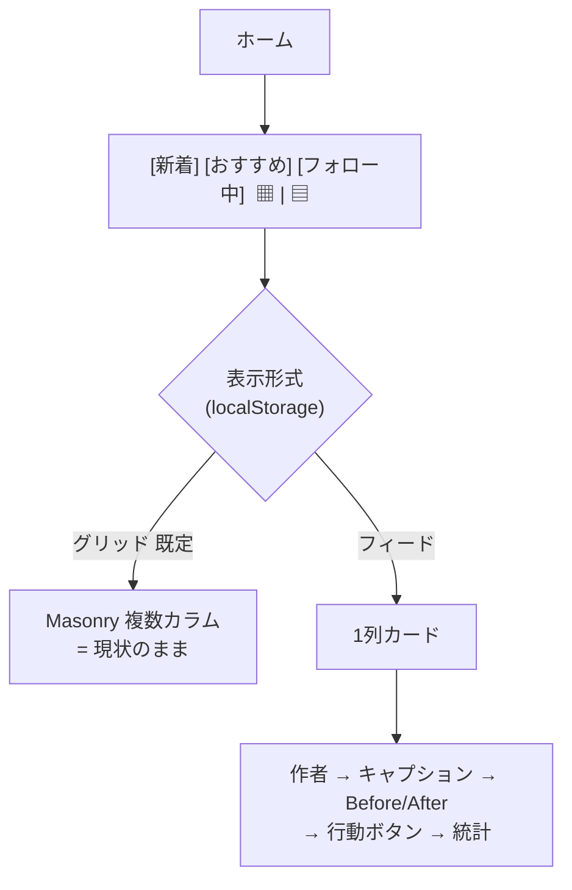
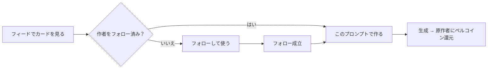
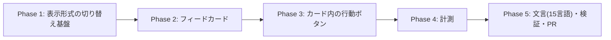

# ホームのフィード表示（1列）＋「このプロンプトで作る」導線 実装計画書

作成日: 2026-08-10
ステータス: 実装済み（Phase 1〜5 完了・マイグレーション適用待ち）

## 背景と目的

クリエイター還元（`/creator-rewards`）と付与の仕組みは稼働したが、**他人のプロンプトが実際に使われた回数は累計13回・2人**にとどまる。狙う循環は「生成 → 投稿 → 別のユーザーが利用」であり、その最初の詰まりは **「このプロンプトを使ってみたい」と思わせる場所が無いこと**。

現在のホームは `Masonry` の複数カラム表示（スマホ2列 / PC4列）で、After 画像のサムネイルのみが並ぶ。そのため：

- **Before/After が見えない** → 「うちの子がこう変わる」という価値が伝わらない
- **キャプション（作者の想い）が見えない**
- **作者が目立たない** → フォロワー限定でプロンプトを提供する設計なのに、フォローの動機が生まれない
- **「このプロンプトで作る」が投稿詳細に入らないと存在しない** → 使うまでが遠い

本計画は、既存のグリッド表示を残したまま**1列のフィード表示を追加**し、カード上で価値と行動導線を成立させる。

## 決定事項（ユーザーとの議論で確定 2026-08-10）

| 項目 | 決定 | 理由 |
|---|---|---|
| 表示の切り替え方 | **アイコントグル（▦ / ▤）**。タブ（新着/おすすめ/フォロー中）とは独立した「表示形式」の設定 | タブ＝何を見るか、トグル＝どう見るか。フィードを4つ目のタブにすると「おすすめをフィードで見る」ができなくなる |
| トグルの適用範囲 | **3タブ共通**。タブを移動しても維持し、次回訪問時も記憶する | 表示形式はユーザーの好みであり、コンテンツ選択とは別軸 |
| 初期表示 | **当面はグリッド**（従来どおり）。認知が広がったらフィードへ切り替える | 既存ユーザーの画面が突然変わる不利益を避ける |
| 新機能の告知 | トグル横に **NEW バッジ**。一度フィードを開いたら消える／表示期間の上限あり | トグルは小さく、放置すると気づかれない |
| Before/After | **1:1 で並べる**。縦長は左右・横長は上下。**AFTER / BEFORE のラベルを必ず出す** | `SourcePromptReferenceCard` に同じ実装が既にある（`flex-1` + `isLandscape` 判定 + ラベル）ので流用する |
| キャプション | **X 準拠**。連続改行は詰める／最大5行で省略／タップで全文展開／さらにタップで詳細へ | 利用者に X ユーザーが多く、慣れた操作感の方が学習コストが低い |
| 画像タップ | 拡大ビュー（既存 `ImageFullscreen`。Before/After 間はスワイプ） | X と同じ挙動 |
| カード内の行動ボタン | **「このプロンプトで作る」**。未フォローなら**「フォローして使う」** | 「使いたい」がそのままフォロー動機に変換される。フォロワーゲート維持の帰結 |
| 計測 | **GA4 は導入しない**。既存の自前イベントテーブル方式で記録する | GA4 未導入で新規導入コスト（同意/プライバシー対応含む）が見合わない。期間をまたぐ追跡は SQL の方が正確 |
| リポスト | **本計画のスコープ外**（別PR） | 投稿の概念そのものの拡張で、DB とフィードの並び順に影響する。混ぜると検証が困難 |

## コードベース調査結果（2026-08-10 検証済み）

| 対象 | 現状 | 含意 |
|---|---|---|
| 一覧表示 | `PostList.tsx` が `Masonry`（default 4列 / 1024:2 / 640:2） | フィードは「1列の別レイアウト」として分岐。Masonry は温存 |
| タブ | `SortTabs.tsx`（newest / week=おすすめ / following） | トグルはこの行の右端に置く。タブの実装には手を入れない |
| カード | `PostCard.tsx`（After のみ・作者は下部・コメント数等） | フィード用カードは**別コンポーネント**として新設し、PostCard は据え置く（グリッドの回帰を防ぐ） |
| Before/After | `SourcePromptReferenceCard.tsx` に実装済み（`flex-1` 1:1 / `isLandscape` で `flex-col` 切替 / AFTER・BEFORE ラベル） | **この描画ロジックを共通部品として切り出して再利用** |
| Before 画像の解決 | `getPostBeforeImageUrl(post)`（永続パス → fallback → null） | 「Before があるときだけ2枚表示」の判定に使う |
| 拡大表示 | `ImageFullscreen`（初期インデックス指定可） | 画像タップの遷移先に流用 |
| 生成導線 | `PromptLockedGenerationSheet` / `SourcePromptReferenceCard` 内のボタン | カード上のボタンから同じシートを開く |
| **CTA 可否の判定材料** | `source_reference` は **`getPost`(詳細)でのみ** `resolveSourcePromptReference` により admin クライアントで解決。型コメントにも「詳細取得の経路だけで解決する。一覧はプロンプト欄を持たないため付けない」と明記。一覧の `enrichPosts` は解決しない | **一覧のままではカード上に CTA を出せない**。一覧用のサマリを新設する（下記 ADR-005） |
| `getPostPromptDisplayMode` | 公開 `/free` root では `prompt` を返す（表示モード判定であって CTA 可否ではない） | CTA 可否の正本には使えない |
| フォロー | `FollowButton`（`onFollowChange` で即時反映） | 「フォローして使う」の実装に流用 |
| 既存イベント計測 | `prompt_usage_events` / `style_usage_events` は RLS 有効＋`*_no_public_access`(全拒否)。`post_impressions` も RLS 有効で、`app/api/posts/impressions/batch/route.ts` が **viewer_key をサーバー側で解決**し `createAdminClient()` + RPC `record_post_impressions` で書く | **書き込みは必ずサーバー経由**。`home_view_events` も同じ作法に揃える（下記 ADR-003 改訂） |
| `post_impressions` の列 | `id / image_id / viewer_key / event_date / created_at`。**`view_mode` は持たない** | 表示形式別の分母には使えない（下記 ADR-006） |
| `FollowButton` | 文言は `follow` / `unfollow` のトグル。押下後に生成シートを開く責務は持たない | 「フォローして使う」は専用コンポーネントが要る（下記 ADR-007） |

## 概要図

### 画面構成



### カード上の行動とフォローの循環



### カードの構造

```
┌─────────────────────────────────────┐
│ 👤 みきふく @mikifuku · 2時間  [フォロー]│ ← 作者を最上部
├─────────────────────────────────────┤
│ 元気なchibiキャラになるイラストに      │ ← キャプション(X準拠・5行)
│ なります！                           │
├─────────────────────────────────────┤
│ ┌──────────┬──────────┐            │
│ │  AFTER   │  BEFORE  │            │ ← 1:1・ラベル必須
│ └──────────┴──────────┘            │   (縦長=左右 / 横長=上下)
├─────────────────────────────────────┤
│ ✨ このプロンプトで作る   12人が使用   │ ← 未フォローなら「フォローして使う」
├─────────────────────────────────────┤
│ 💬 3   ♡ 24   👁 156                │
└─────────────────────────────────────┘
```

## EARS（主要要件）

- When ユーザーがトグルでフィードを選ぶ, the system shall 3タブすべてを1列カードで表示し、選択を端末に記憶する
- When フィードのカードを描画する, the system shall 作者・キャプション・Before/After（あれば）・行動ボタン・統計をこの順で表示する
- Where 投稿に Before 画像がある, the system shall AFTER と BEFORE を 1:1 で並べ（縦長は左右・横長は上下）、両方にラベルを表示する
- When キャプションが5行を超える, the system shall 省略表示し、タップで全文展開する（連続改行は詰める）
- When 展開済みのキャプションをタップする, the system shall 投稿詳細へ遷移する
- When 画像をタップする, the system shall 拡大ビューを開く（詳細へは遷移しない）
- While 閲覧者が作者を未フォロー, the system shall 行動ボタンを「フォローして使う」として表示し、押下でフォロー成立後に生成シートを開く
- Where 投稿が生成に使えない（プロンプト非公開・原作削除等）, the system shall 行動ボタンを出さない（現行の詳細画面と同じ判定に従う）
- When 表示形式を切り替える / 行動ボタンを押す / カード経由でフォローする, the system shall イベントを記録する（表示形式を含む）
- 不変条件: グリッド表示の見た目・並び順・パフォーマンスを変更しない

## ADR

### ADR-001: フィード用カードは PostCard を拡張せず新設する

- **Context**: PostCard はグリッド前提（正方形サムネ・作者下部）で、フィードとは要素も順序も異なる
- **Decision**: `PostFeedCard` を新規作成し、`PostCard` には手を入れない
- **Reason**: 既存のグリッドは主要導線であり、条件分岐を増やすと回帰リスクが高い。共通部分（いいね・通報メニュー・インプレッション計測）は既存部品を再利用する
- **Consequence**: 2つのカードを保守することになる。共通ロジック（Before 画像解決・行動可否判定）はライブラリ関数に寄せて重複を避ける

### ADR-002: 表示形式は localStorage に持つ（サーバー保存しない）

- **Context**: 未ログインでもホームは見られる
- **Decision**: 端末単位の設定として localStorage に保存
- **Reason**: 未ログインでも機能し、サーバー往復が不要。既存の `generation-mode-preference` と同じ作法
- **Consequence**: 端末をまたぐと引き継がれない。許容する

### ADR-003: 計測は自前のイベントテーブルで行い、書き込みはサーバー経由に限定する（レビュー指摘で改訂）

- **Context**: GA4 は未導入。知りたいのは「切り替え後に維持したか」「フィードは使用率を上げたか」。
  既存テーブルは `style_usage_events` / `prompt_usage_events` が RLS 全拒否、`post_impressions` も
  API が viewer_key をサーバー側で解決して admin クライアント + RPC で書く方式
- **Decision**: `home_view_events` を新設。**RLS は全拒否**とし、`app/api/posts/home-view-events/route.ts` が
  event_type / view_mode / post の可視性 / 閲覧者を検証したうえで admin クライアントで書く。
  ゲストは `post_impressions` と同様に**サーバー側で匿名 viewer key を解決**する
- **Reason**: 当初案の「INSERT のみ許可」は既存の作法と逆で、`user_id` の偽装・存在しない post_id の混入・
  イベント水増しの防御を RLS と CHECK だけで担うことになる。KPI テーブルが汚れると既定切り替えの判断を誤る
- **Consequence**: クライアントから直接書けない。分析は SQL / admin ダッシュボードで行う

### ADR-005: CTA 可否は一覧用のサーバー導出サマリで判定する（レビュー指摘で追加）

- **Context**: `source_reference` は詳細取得（`getPost`）でのみ `resolveSourcePromptReference` により解決され、
  一覧の `enrichPosts` は解決しない（型コメントにも明記）。また `getPostPromptDisplayMode` は表示モードの判定であり、
  公開 `/free` root では `prompt` を返すため CTA 可否の正本にはならない
- **Decision**: 本文を含まないサーバー導出の `prompt_action_summary` を用意する
  （可否・原作 post_id・原作者 id・利用数・公開設定）。詳細と**同じ検証経路（admin クライアント + 既存 RPC）**
  から導出し、N 件はバッチで解決してリクエスト数を抑える
- **Reason**: 一覧側で秘匿条件を再実装すると、詳細と判定がずれて「詳細では出ない導線が一覧に出る」事故が起きる。
  正本を1つにする
- **Consequence**: サマリ解決のコストが乗るため、フィード表示のときだけ解決する
- **実装時の改訂（2026-08-10）**: 一覧 payload に載せるのではなく、**専用の `POST /api/posts/prompt-actions`**
  としてフィードのときだけクライアントから取りに行く形にした。ホームの初回描画は `use cache` されており
  閲覧者をまたいで共有される。表示形式は localStorage の値でサーバーは知り得ないため、payload に混ぜると
  「グリッド利用者にも解決コストを払わせる」か「表示形式でキャッシュを二重に持つ」しかなくなる。
  あわせて **Before/After サムネイルは載せない**（フィードのカードは投稿自身の画像を出すので使い道が無い）

### ADR-006: 表示形式別の KPI は「表示」ではなく「セッション」を分母にする（レビュー指摘で追加）

- **Context**: 当初案の「表示形式別の CTA タップ率」は算出できない。`post_impressions` に `view_mode` が無く、
  さらに ADR-001 でグリッド側のカードには CTA が存在しないため、**グリッドのタップ率は構造上ゼロ**になり比較が成立しない
- **Decision**: 次の2点に変更する
  1. **分母**: `home_view_events` に `home_viewed`（view_mode 付き・セッション単位で1回）を記録する
  2. **分子**: CTA タップを**カード上・詳細画面のどちらで押されても記録**し、**直前のホーム表示形式**を付与する
     （表示形式は sessionStorage で持ち回る）。これによりグリッド経由（一覧→詳細→CTA）も同じ土俵で数えられる
- **Reason**: 比較したいのは「どちらの表示がプロンプト利用に繋がるか」であって「カード上のボタンが押されたか」ではない。
  グリッドは詳細画面を経由して CTA に至るため、経路を含めて帰属させないと不公平な比較になる
- **Consequence**: 詳細画面側にも表示形式の受け渡しが必要になる。母数が小さい間は率ではなく実数で見る

### ADR-007: 「フォローして使う」は専用コンポーネントにする（レビュー指摘で追加）

- **Context**: 既存 `FollowButton` は `follow` / `unfollow` のトグルで、押下後に生成シートを開く責務を持たない
- **Decision**: `FollowAndUsePromptButton` を新設し、状態遷移を明示する
  （未ログイン → AuthModal / フォロー成功 → 生成シートを開く / フォロー失敗 → シートを開かずエラー表示）
- **Reason**: 既存ボタンの流用では文言も責務も要件に届かない
- **Consequence**: フォロー API の呼び出しは既存経路を再利用し、UI とオーケストレーションのみ新規に作る

### ADR-004: 初期表示はグリッドのまま据え置く

- **Context**: フィードは目的達成に直結するが、既存ユーザーの画面が突然変わる
- **Decision**: 既定はグリッド。NEW バッジで認知を作り、計測を見てから切り替えを判断する
- **Reason**: 既存体験の破壊を避けることを優先
- **Consequence**: フィードの露出が限られる。切り替え判断の基準を計測で持つ（下記）

## 実装計画



### Phase 1: 表示形式の切り替え基盤
目的: トグルで表示が切り替わり、設定が保持される

- [ ] `features/posts/lib/home-view-preference.ts`: `getHomeViewMode()` / `setHomeViewMode()`（localStorage・既定 `grid`・SSR セーフ。`generation-mode-preference.ts` を参考）
- [ ] `HomeViewToggle` コンポーネント（▦ / ▤ のアイコンボタン2つ・選択中を強調・`aria-pressed`）
- [ ] `SortTabs` の行の右端にトグルを配置（タブ実装には手を入れず、親でレイアウト）
- [ ] `PostList`: `viewMode` で `Masonry` と 1列描画を分岐
- [ ] NEW バッジ（初回フィード表示で消える・表示期限つき。localStorage）

### Phase 2: フィードカード
目的: カード1枚で価値が伝わる

- [ ] `BeforeAfterFrame` を共通部品として切り出し（`SourcePromptReferenceCard` の描画を関数化。1:1・縦横判定・ラベル）
- [ ] `PostFeedCard`: 作者（アイコン/名前/相対時刻/フォローボタン）→ キャプション → Before/After → 統計
- [ ] `FeedCaption`: 連続改行を詰める・5行クランプ・タップで展開・展開後タップで詳細
- [ ] 画像タップ → `ImageFullscreen`（Before/After のインデックス指定）
- [ ] タップ領域の切り分け（画像 / 本文 / カード地 / ボタンで誤爆しないこと）
- [ ] 完走投稿・One-Tap 投稿など Before が無い投稿は1枚表示

### Phase 3: 一覧用サマリ ＋ カード内の行動ボタン
目的: 「使う」までの距離を最短にする（ADR-005 / ADR-007）

- [ ] **一覧 payload に `prompt_action_summary` を追加**（本文を含まない。可否・原作 post_id・原作者 id・利用数・
      Before/After サムネイル）。詳細と同じ検証経路（admin クライアント + 既存 RPC）から導出し、N 件はバッチ解決
- [ ] フィード表示のときだけ解決する（グリッドには不要なので取得コストを増やさない）
- [ ] `FollowAndUsePromptButton` を新設（ADR-007 の状態遷移）
- [ ] フォロー済み → 「このプロンプトで作る」→ 既存の生成シートを開く
- [ ] 未フォロー → 「フォローして使う」→ フォロー成功時のみシートを開く
- [ ] 未ログイン → AuthModal へ
- [ ] 利用数（`◯人が使いました`）の表示。サマリの値を使う

### Phase 4: 計測
目的: 続ける／やめる／既定を切り替えるの判断材料を貯める

- [ ] マイグレーション: `home_view_events`（`user_id` nullable / `viewer_key` / `event_type` / `view_mode` /
      `from_view_mode` / `post_id` nullable / `created_at`）。**RLS は全拒否**（ADR-003）
- [ ] 記録する4種:
      - `home_viewed`(view_mode) … **分母**。セッション単位で1回（ADR-006）
      - `view_mode_changed`(from → to) … 切替・維持・復帰の分析用
      - `prompt_use_tapped`(view_mode, post_id) … **分子**。カード上・詳細画面のどちらでも記録し、
        **直前のホーム表示形式**を付与（sessionStorage で持ち回る）
      - `follow_from_card`(view_mode, post_id)
- [ ] API `app/api/posts/home-view-events/route.ts`: event_type / view_mode / post の可視性 / 閲覧者を検証し、
      **viewer_key をサーバー側で解決**して admin クライアントで書く（`post_impressions` と同じ作法）
- [ ] 送信は best-effort（失敗しても操作を妨げない）
- [ ] 分析用 SQL をドキュメント化（切替人数・維持日数・**表示形式別の CTA 到達率＝分子/分母**）

### Phase 5: 文言・検証・PR
- [ ] 15言語（トグルの読み上げラベル・NEW・「このプロンプトで作る」「フォローして使う」・「◯人が使いました」）
- [ ] 単体テスト: 表示形式の保持 / キャプションの改行詰め・クランプ / Before の有無による分岐 / 未フォロー時のボタン文言 / 行動可否
- [ ] `npm run lint` / `typecheck` / `test` / `build -- --webpack`
- [ ] 実機: スマホ・PC × 3タブ × 2表示 / タップ領域の誤爆 / 拡大ビュー / フォロー→生成
- [ ] PR（本計画書同梱・日本語）

## 修正対象ファイル一覧

| ファイル | 操作 | 変更内容 |
|---|---|---|
| features/posts/lib/home-view-preference.ts | 新規 | 表示形式の保存・取得 |
| features/posts/components/HomeViewToggle.tsx | 新規 | ▦ / ▤ トグル＋NEW バッジ |
| features/posts/components/PostFeedCard.tsx | 新規 | フィード用カード |
| features/posts/components/FeedCaption.tsx | 新規 | X 準拠のキャプション表示 |
| features/posts/components/BeforeAfterFrame.tsx | 新規 | Before/After の共通描画（既存ロジックを切り出し） |
| features/posts/components/SourcePromptReferenceCard.tsx | 修正 | 上記共通部品を使うよう置換（見た目は不変） |
| features/posts/components/PostList.tsx | 修正 | viewMode 分岐・トグル配置 |
| features/posts/lib/home-view-events.ts | 新規 | イベント送信（best-effort）＋直前の表示形式の持ち回り |
| app/api/posts/home-view-events/route.ts | 新規 | 記録API（検証＋viewer_key 解決＋admin 書き込み） |
| supabase/migrations/20260810120000_add_home_view_events.sql | 新規 | イベントテーブル＋**RLS 全拒否** |
| app/api/posts/prompt-actions/route.ts | 新規 | 一覧用サマリのバッチ解決API（フィード時のみ呼ぶ） |
| features/posts/lib/source-prompt-reference.ts | 修正 | `resolveSourcePromptSummaries` / `toPromptActionSummary` を追加（本文は含めない） |
| features/posts/hooks/useFeedPromptActions.ts | 新規 | サマリの増分取得（フィード時のみ） |
| features/posts/components/FollowAndUsePromptButton.tsx | 新規 | フォロー→生成シートの状態遷移 |
| app/api/users/follow-status/batch/route.ts | 新規 | フォロー状態のバッチ取得（カードごとの N+1 を防ぐ） |
| features/posts/hooks/useFeedFollowStatus.ts | 新規 | フォロー状態の増分取得 |
| app/api/users/me/subscription-plan/route.ts | 新規 | 生成シートに渡すプラン（押された瞬間だけ取得） |
| features/posts/components/SourcePromptReferenceCard.tsx | 修正 | 共通部品化＋詳細画面でも `prompt_use_tapped` を記録 |
| features/posts/lib/feed-caption.ts / feed-timestamp.ts | 新規 | 連続改行の詰め／相対時刻 |
| messages/*.ts（15言語） | 修正 | 文言追加 |
| tests/unit/... | 新規 | 上記テスト |

## 品質・テスト観点

- [ ] **グリッド表示に一切の回帰がないこと**（並び順・見た目・パフォーマンス）
- [ ] タップ領域の誤爆がないこと（画像/本文/カード地/ボタン）
- [ ] Before が無い投稿（One-Tap・完走投稿）でも破綻しないこと
- [ ] 未ログインでもフィードが見られること（行動ボタンはログインを促す）
- [ ] **CTA 可否が詳細画面と完全に一致すること**。次の全ケースでテストする:
      完走投稿 / One-Tap 投稿 / 公開 `/free` root / 非公開 `/free` root / 派生投稿 / 原作が削除済み /
      原作が投稿取消 / 未ログイン閲覧者 / 本人 / 運営
- [ ] プロンプト非公開・原作削除の投稿で行動ボタンが出ないこと（秘匿の回帰防止）
- [ ] `prompt_action_summary` に**プロンプト本文が含まれないこと**（payload を検査するテスト）
- [ ] 「フォローして使う」の状態遷移（未ログイン→AuthModal / 成功→シート / 失敗→シートを開かない）
- [ ] イベントがクライアントから直接 INSERT できないこと（RLS 全拒否の確認）
- [ ] 計測が失敗しても操作が止まらないこと
- [ ] 15言語で文言が崩れないこと（ボタン文言が長い言語での折り返し）

## 効果測定と、既定を切り替える判断

公開後に見る指標（Phase 4 のイベントから SQL で算出）:

1. **フィードを一度でも使った人の数**（母数が小さいうちはここまで）
2. **表示形式別の CTA 到達率** ← **本命**
   `prompt_use_tapped`(view_mode 別) ÷ `home_viewed`(view_mode 別)。
   グリッドは「一覧 → 詳細 → CTA」を経由するため、**直前のホーム表示形式で帰属**させて同じ土俵で比較する（ADR-006）
3. カード経由のフォロー発生数
4. 切り替え後の維持日数（母数が増えてから）

判断の目安: **2 でフィードがグリッドを明確に上回り、かつ 1 が一定数に達したら、既定をフィードへ切り替える**。現在の基準値は「他人のプロンプトの利用が累計13回・2人」。
母数が小さいうちは率が不安定なので、実数（何人が押したか）も併記して判断する。

### 分析用 SQL

`home_view_events` は RLS 全拒否なので、`supabase db query --linked` か Supabase の SQL Editor で実行する。

**① 表示形式別の CTA 到達率（本命）** — 分母は `home_viewed`（セッション単位）、分子は `prompt_use_tapped`（詳細画面経由も直前のホーム表示形式で帰属）。
ホームを経ていない流入（共有リンク・プロフィール・通知・検索）は `view_mode = 'none'` で記録されるので、**率の計算からは除外する**。

```sql
SELECT
  view_mode,
  count(*) FILTER (WHERE event_type = 'home_viewed')                      AS viewed,
  count(*) FILTER (WHERE event_type = 'prompt_use_tapped')                AS use_tapped,
  count(DISTINCT viewer_key) FILTER (WHERE event_type = 'prompt_use_tapped') AS use_tapped_people,
  round(
    100.0 * count(*) FILTER (WHERE event_type = 'prompt_use_tapped')
    / nullif(count(*) FILTER (WHERE event_type = 'home_viewed'), 0),
    1
  ) AS reach_rate_pct
FROM public.home_view_events
WHERE created_at >= now() - interval '30 days'
  AND view_mode IN ('grid', 'feed')   -- 'none' はホーム未経由なので分母を持たない
GROUP BY view_mode
ORDER BY view_mode;
```

**①-b ホーム外からのプロンプト利用** — `none` の実数。ホームの改善とは別枠で見る

```sql
SELECT count(*) AS use_tapped, count(DISTINCT viewer_key) AS people
FROM public.home_view_events
WHERE event_type = 'prompt_use_tapped' AND view_mode = 'none';
```

**② フィードを一度でも使った人の数**

```sql
SELECT count(DISTINCT viewer_key) AS feed_users
FROM public.home_view_events
WHERE event_type = 'home_viewed' AND view_mode = 'feed';
```

**③ カード経由のフォロー発生数**

```sql
SELECT date_trunc('day', created_at AT TIME ZONE 'Asia/Tokyo') AS day,
       count(*) AS follows,
       count(DISTINCT viewer_key) AS people
FROM public.home_view_events
WHERE event_type = 'follow_from_card'
GROUP BY 1 ORDER BY 1 DESC;
```

**④ 切り替えたあと維持しているか** — 最後の切替が feed のまま何日続いているか

```sql
WITH last_change AS (
  SELECT DISTINCT ON (viewer_key)
         viewer_key, view_mode, created_at
  FROM public.home_view_events
  WHERE event_type = 'view_mode_changed'
  ORDER BY viewer_key, created_at DESC
)
SELECT lc.view_mode,
       count(*) AS people,
       round(avg(EXTRACT(EPOCH FROM (now() - lc.created_at)) / 86400)::numeric, 1) AS avg_days_since
FROM last_change lc
GROUP BY lc.view_mode;
```

## ロールバック方針

- 表示形式の既定はグリッドのため、フィードに問題があってもトグルを隠すだけで従来の状態に戻る
- DB 追加はイベントテーブルのみで、既存テーブルに変更なし
- フェーズごとにコミットし、Phase 単位で revert 可能にする

## スコープ外（別途）

- **リポスト（引用）** — 投稿概念の拡張。フィードの並び順・DB に影響するため別PR
- **ブックマーク** — 「あとで使いたいプロンプト」を貯める行為は目的と相性が良いが、今回は入れない
- **「みんなのプロンプト」棚** — 発見性の強化。フィードの効果を見てから判断
