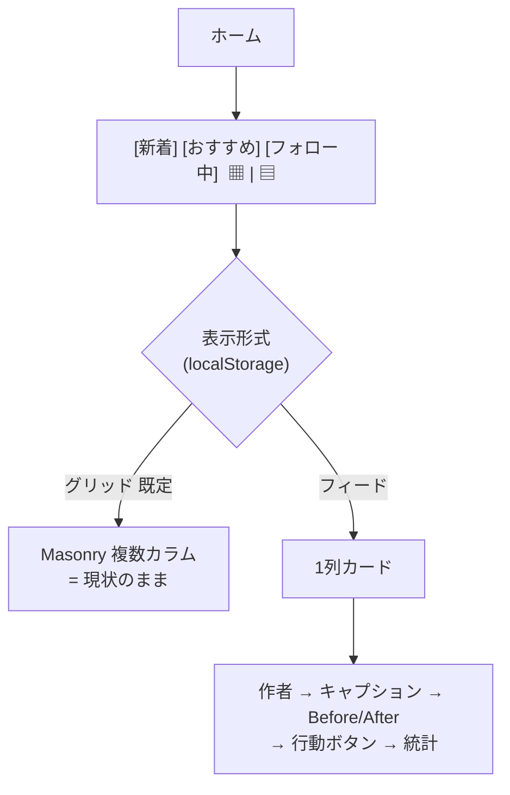
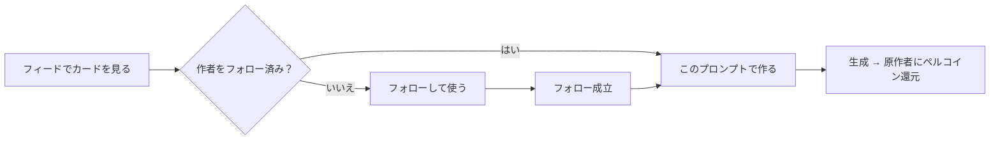
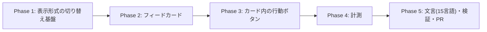

# ホームのフィード表示（1列）＋「このプロンプトで作る」導線 実装計画書

作成日: 2026-08-10
ステータス: 計画（ユーザーレビュー待ち）

## 背景と目的

クリエイター還元（`/creator-rewards`）と付与の仕組みは稼働したが、**他人のプロンプトが実際に使われた回数は累計13回・2人**にとどまる。狙う循環は「生成 → 投稿 → 別のユーザーが利用」であり、その最初の詰まりは **「このプロンプトを使ってみたい」と思わせる場所が無いこと**。

現在のホームは `Masonry` の複数カラム表示（スマホ2列 / PC4列）で、After 画像のサムネイルのみが並ぶ。そのため：

- **Before/After が見えない** → 「うちの子がこう変わる」という価値が伝わらない
- **キャプション（作者の想い）が見えない**
- **作者が目立たない** → フォロワー限定でプロンプトを提供する設計なのに、フォローの動機が生まれない
- **「このプロンプトで作る」が投稿詳細に入らないと存在しない** → 使うまでが遠い

本計画は、既存のグリッド表示を残したまま**1列のフィード表示を追加**し、カード上で価値と行動導線を成立させる。

## 決定事項（ユーザーとの議論で確定 2026-08-10）

| 項目 | 決定 | 理由 |
|---|---|---|
| 表示の切り替え方 | **アイコントグル（▦ / ▤）**。タブ（新着/おすすめ/フォロー中）とは独立した「表示形式」の設定 | タブ＝何を見るか、トグル＝どう見るか。フィードを4つ目のタブにすると「おすすめをフィードで見る」ができなくなる |
| トグルの適用範囲 | **3タブ共通**。タブを移動しても維持し、次回訪問時も記憶する | 表示形式はユーザーの好みであり、コンテンツ選択とは別軸 |
| 初期表示 | **当面はグリッド**（従来どおり）。認知が広がったらフィードへ切り替える | 既存ユーザーの画面が突然変わる不利益を避ける |
| 新機能の告知 | トグル横に **NEW バッジ**。一度フィードを開いたら消える／表示期間の上限あり | トグルは小さく、放置すると気づかれない |
| Before/After | **1:1 で並べる**。縦長は左右・横長は上下。**AFTER / BEFORE のラベルを必ず出す** | `SourcePromptReferenceCard` に同じ実装が既にある（`flex-1` + `isLandscape` 判定 + ラベル）ので流用する |
| キャプション | **X 準拠**。連続改行は詰める／最大5行で省略／タップで全文展開／さらにタップで詳細へ | 利用者に X ユーザーが多く、慣れた操作感の方が学習コストが低い |
| 画像タップ | 拡大ビュー（既存 `ImageFullscreen`。Before/After 間はスワイプ） | X と同じ挙動 |
| カード内の行動ボタン | **「このプロンプトで作る」**。未フォローなら**「フォローして使う」** | 「使いたい」がそのままフォロー動機に変換される。フォロワーゲート維持の帰結 |
| 計測 | **GA4 は導入しない**。既存の自前イベントテーブル方式で記録する | GA4 未導入で新規導入コスト（同意/プライバシー対応含む）が見合わない。期間をまたぐ追跡は SQL の方が正確 |
| リポスト | **本計画のスコープ外**（別PR） | 投稿の概念そのものの拡張で、DB とフィードの並び順に影響する。混ぜると検証が困難 |

## コードベース調査結果（2026-08-10 検証済み）

| 対象 | 現状 | 含意 |
|---|---|---|
| 一覧表示 | `PostList.tsx` が `Masonry`（default 4列 / 1024:2 / 640:2） | フィードは「1列の別レイアウト」として分岐。Masonry は温存 |
| タブ | `SortTabs.tsx`（newest / week=おすすめ / following） | トグルはこの行の右端に置く。タブの実装には手を入れない |
| カード | `PostCard.tsx`（After のみ・作者は下部・コメント数等） | フィード用カードは**別コンポーネント**として新設し、PostCard は据え置く（グリッドの回帰を防ぐ） |
| Before/After | `SourcePromptReferenceCard.tsx` に実装済み（`flex-1` 1:1 / `isLandscape` で `flex-col` 切替 / AFTER・BEFORE ラベル） | **この描画ロジックを共通部品として切り出して再利用** |
| Before 画像の解決 | `getPostBeforeImageUrl(post)`（永続パス → fallback → null） | 「Before があるときだけ2枚表示」の判定に使う |
| 拡大表示 | `ImageFullscreen`（初期インデックス指定可） | 画像タップの遷移先に流用 |
| 生成導線 | `PromptLockedGenerationSheet` / `SourcePromptReferenceCard` 内のボタン | カード上のボタンから同じシートを開く |
| フォロー | `FollowButton`（`onFollowChange` で即時反映） | 「フォローして使う」の実装に流用 |
| 既存イベント計測 | `prompt_usage_events` / `style_usage_events` / `post_impressions` 等 | 同じ作法で `home_view_events` を追加 |

## 概要図

### 画面構成



### カード上の行動とフォローの循環



### カードの構造

```
┌─────────────────────────────────────┐
│ 👤 みきふく @mikifuku · 2時間  [フォロー]│ ← 作者を最上部
├─────────────────────────────────────┤
│ 元気なchibiキャラになるイラストに      │ ← キャプション(X準拠・5行)
│ なります！                           │
├─────────────────────────────────────┤
│ ┌──────────┬──────────┐            │
│ │  AFTER   │  BEFORE  │            │ ← 1:1・ラベル必須
│ └──────────┴──────────┘            │   (縦長=左右 / 横長=上下)
├─────────────────────────────────────┤
│ ✨ このプロンプトで作る   12人が使用   │ ← 未フォローなら「フォローして使う」
├─────────────────────────────────────┤
│ 💬 3   ♡ 24   👁 156                │
└─────────────────────────────────────┘
```

## EARS（主要要件）

- When ユーザーがトグルでフィードを選ぶ, the system shall 3タブすべてを1列カードで表示し、選択を端末に記憶する
- When フィードのカードを描画する, the system shall 作者・キャプション・Before/After（あれば）・行動ボタン・統計をこの順で表示する
- Where 投稿に Before 画像がある, the system shall AFTER と BEFORE を 1:1 で並べ（縦長は左右・横長は上下）、両方にラベルを表示する
- When キャプションが5行を超える, the system shall 省略表示し、タップで全文展開する（連続改行は詰める）
- When 展開済みのキャプションをタップする, the system shall 投稿詳細へ遷移する
- When 画像をタップする, the system shall 拡大ビューを開く（詳細へは遷移しない）
- While 閲覧者が作者を未フォロー, the system shall 行動ボタンを「フォローして使う」として表示し、押下でフォロー成立後に生成シートを開く
- Where 投稿が生成に使えない（プロンプト非公開・原作削除等）, the system shall 行動ボタンを出さない（現行の詳細画面と同じ判定に従う）
- When 表示形式を切り替える / 行動ボタンを押す / カード経由でフォローする, the system shall イベントを記録する（表示形式を含む）
- 不変条件: グリッド表示の見た目・並び順・パフォーマンスを変更しない

## ADR

### ADR-001: フィード用カードは PostCard を拡張せず新設する

- **Context**: PostCard はグリッド前提（正方形サムネ・作者下部）で、フィードとは要素も順序も異なる
- **Decision**: `PostFeedCard` を新規作成し、`PostCard` には手を入れない
- **Reason**: 既存のグリッドは主要導線であり、条件分岐を増やすと回帰リスクが高い。共通部分（いいね・通報メニュー・インプレッション計測）は既存部品を再利用する
- **Consequence**: 2つのカードを保守することになる。共通ロジック（Before 画像解決・行動可否判定）はライブラリ関数に寄せて重複を避ける

### ADR-002: 表示形式は localStorage に持つ（サーバー保存しない）

- **Context**: 未ログインでもホームは見られる
- **Decision**: 端末単位の設定として localStorage に保存
- **Reason**: 未ログインでも機能し、サーバー往復が不要。既存の `generation-mode-preference` と同じ作法
- **Consequence**: 端末をまたぐと引き継がれない。許容する

### ADR-003: 計測は自前のイベントテーブルで行う

- **Context**: GA4 は未導入。知りたいのは「切り替え後に維持したか」「フィードは使用率を上げたか」
- **Decision**: `home_view_events` を新設し、切り替え・行動ボタン押下・カード経由フォローを記録する
- **Reason**: 期間をまたぐ状態追跡は GA4 が苦手（BigQuery 連携が要る）。既に自前テーブルで分析する運用が確立している
- **Consequence**: 分析は SQL / admin ダッシュボードで行う

### ADR-004: 初期表示はグリッドのまま据え置く

- **Context**: フィードは目的達成に直結するが、既存ユーザーの画面が突然変わる
- **Decision**: 既定はグリッド。NEW バッジで認知を作り、計測を見てから切り替えを判断する
- **Reason**: 既存体験の破壊を避けることを優先
- **Consequence**: フィードの露出が限られる。切り替え判断の基準を計測で持つ（下記）

## 実装計画



### Phase 1: 表示形式の切り替え基盤
目的: トグルで表示が切り替わり、設定が保持される

- [ ] `features/posts/lib/home-view-preference.ts`: `getHomeViewMode()` / `setHomeViewMode()`（localStorage・既定 `grid`・SSR セーフ。`generation-mode-preference.ts` を参考）
- [ ] `HomeViewToggle` コンポーネント（▦ / ▤ のアイコンボタン2つ・選択中を強調・`aria-pressed`）
- [ ] `SortTabs` の行の右端にトグルを配置（タブ実装には手を入れず、親でレイアウト）
- [ ] `PostList`: `viewMode` で `Masonry` と 1列描画を分岐
- [ ] NEW バッジ（初回フィード表示で消える・表示期限つき。localStorage）

### Phase 2: フィードカード
目的: カード1枚で価値が伝わる

- [ ] `BeforeAfterFrame` を共通部品として切り出し（`SourcePromptReferenceCard` の描画を関数化。1:1・縦横判定・ラベル）
- [ ] `PostFeedCard`: 作者（アイコン/名前/相対時刻/フォローボタン）→ キャプション → Before/After → 統計
- [ ] `FeedCaption`: 連続改行を詰める・5行クランプ・タップで展開・展開後タップで詳細
- [ ] 画像タップ → `ImageFullscreen`（Before/After のインデックス指定）
- [ ] タップ領域の切り分け（画像 / 本文 / カード地 / ボタンで誤爆しないこと）
- [ ] 完走投稿・One-Tap 投稿など Before が無い投稿は1枚表示

### Phase 3: カード内の行動ボタン
目的: 「使う」までの距離を最短にする

- [ ] 表示可否は既存の判定に従う（`getPostPromptDisplayMode` / `source_reference` の有無）
- [ ] フォロー済み → 「このプロンプトで作る」→ 既存の生成シートを開く
- [ ] 未フォロー → 「フォローして使う」→ フォロー成立後に同シートを開く
- [ ] 利用数（`◯人が使いました`）の表示。既存の利用数取得を流用

### Phase 4: 計測
目的: 続ける／やめる／既定を切り替えるの判断材料を貯める

- [ ] マイグレーション: `home_view_events`（`user_id` nullable / `event_type` / `view_mode` / `from_view_mode` / `post_id` nullable / `created_at`、RLS は INSERT のみ許可・参照は admin）
- [ ] 記録する3種:
      `view_mode_changed`(from/to) / `prompt_use_tapped`(view_mode, post_id) / `follow_from_card`(view_mode, post_id)
- [ ] 送信は best-effort（失敗しても操作を妨げない）
- [ ] 分析用 SQL をドキュメント化（切替人数・維持日数・**表示形式別の使用率**）

### Phase 5: 文言・検証・PR
- [ ] 15言語（トグルの読み上げラベル・NEW・「このプロンプトで作る」「フォローして使う」・「◯人が使いました」）
- [ ] 単体テスト: 表示形式の保持 / キャプションの改行詰め・クランプ / Before の有無による分岐 / 未フォロー時のボタン文言 / 行動可否
- [ ] `npm run lint` / `typecheck` / `test` / `build -- --webpack`
- [ ] 実機: スマホ・PC × 3タブ × 2表示 / タップ領域の誤爆 / 拡大ビュー / フォロー→生成
- [ ] PR（本計画書同梱・日本語）

## 修正対象ファイル一覧

| ファイル | 操作 | 変更内容 |
|---|---|---|
| features/posts/lib/home-view-preference.ts | 新規 | 表示形式の保存・取得 |
| features/posts/components/HomeViewToggle.tsx | 新規 | ▦ / ▤ トグル＋NEW バッジ |
| features/posts/components/PostFeedCard.tsx | 新規 | フィード用カード |
| features/posts/components/FeedCaption.tsx | 新規 | X 準拠のキャプション表示 |
| features/posts/components/BeforeAfterFrame.tsx | 新規 | Before/After の共通描画（既存ロジックを切り出し） |
| features/posts/components/SourcePromptReferenceCard.tsx | 修正 | 上記共通部品を使うよう置換（見た目は不変） |
| features/posts/components/PostList.tsx | 修正 | viewMode 分岐・トグル配置 |
| features/posts/lib/home-view-events.ts | 新規 | イベント送信（best-effort） |
| app/api/posts/home-view-events/route.ts | 新規 | 記録API |
| supabase/migrations/xxxx_add_home_view_events.sql | 新規 | イベントテーブル＋RLS |
| messages/*.ts（15言語） | 修正 | 文言追加 |
| tests/unit/... | 新規 | 上記テスト |

## 品質・テスト観点

- [ ] **グリッド表示に一切の回帰がないこと**（並び順・見た目・パフォーマンス）
- [ ] タップ領域の誤爆がないこと（画像/本文/カード地/ボタン）
- [ ] Before が無い投稿（One-Tap・完走投稿）でも破綻しないこと
- [ ] 未ログインでもフィードが見られること（行動ボタンはログインを促す）
- [ ] プロンプト非公開・原作削除の投稿で行動ボタンが出ないこと（秘匿の回帰防止）
- [ ] 計測が失敗しても操作が止まらないこと
- [ ] 15言語で文言が崩れないこと（ボタン文言が長い言語での折り返し）

## 効果測定と、既定を切り替える判断

公開後に見る指標（Phase 4 のイベントから SQL で算出）:

1. **フィードを一度でも使った人の数**（母数が小さいうちはここまで）
2. **表示形式別の「このプロンプトで作る」タップ率** ← **本命**
3. カード経由のフォロー発生数
4. 切り替え後の維持日数（母数が増えてから）

判断の目安: **2 でフィードがグリッドを明確に上回り、かつ 1 が一定数に達したら、既定をフィードへ切り替える**。現在の基準値は「他人のプロンプトの利用が累計13回・2人」。

## ロールバック方針

- 表示形式の既定はグリッドのため、フィードに問題があってもトグルを隠すだけで従来の状態に戻る
- DB 追加はイベントテーブルのみで、既存テーブルに変更なし
- フェーズごとにコミットし、Phase 単位で revert 可能にする

## スコープ外（別途）

- **リポスト（引用）** — 投稿概念の拡張。フィードの並び順・DB に影響するため別PR
- **ブックマーク** — 「あとで使いたいプロンプト」を貯める行為は目的と相性が良いが、今回は入れない
- **「みんなのプロンプト」棚** — 発見性の強化。フィードの効果を見てから判断
