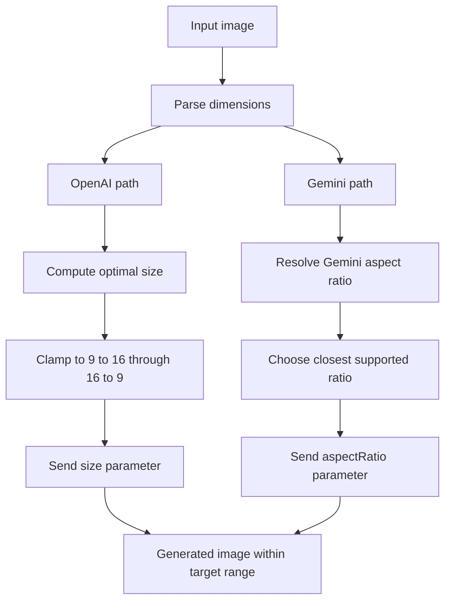
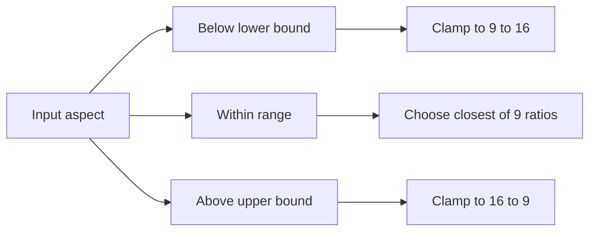
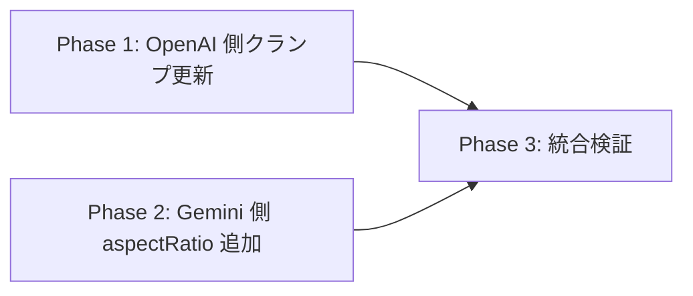

# 画像出力アスペクト比の上限クランプ（9:16〜16:9）

## 背景

`generated_images` テーブルに `width=512, height=1536`（= 1:3）という極端な縦長画像が生成された事例が発生した。原因は以下の2点：

1. **OpenAI gpt-image-2 経路**: [shared/generation/openai-image-model.ts:118](../../shared/generation/openai-image-model.ts#L118) の `MAX_ASPECT_RATIO = 3` により、入力画像が極端に縦長/横長の場合、出力サイズもそのまま 1:3 / 3:1 まで許容されていた。
2. **Gemini 経路**: [supabase/functions/image-gen-worker/index.ts:1715-1734](../../supabase/functions/image-gen-worker/index.ts#L1715-L1734) で `aspectRatio` を **未指定**。Gemini API のデフォルト挙動「入力画像のアスペクトに追従 or 1:1」により、極端な縦長入力がそのまま出力に反映されていた。

## 目的

両プロバイダーの出力アスペクト比を **9:16 〜 16:9** の範囲に収める。**入力画像のトリミングは行わず、出力サイズ側で丸める** 方針とする（入力画像のアスペクトと出力アスペクトが乖離する場合、AI 側で再構成される挙動を許容）。

## やらないこと

- クライアント [features/generation/lib/normalize-source-image.ts](../../features/generation/lib/normalize-source-image.ts) の変更（入力画像のアスペクトには触らない）
- プロンプト [shared/generation/style-prompts.ts](../../shared/generation/style-prompts.ts) の文言変更（Strict Framing の表現はそのまま）
- 入力画像バリデーション（早期拒否）の追加
- 過去に生成された 1:3 等の画像のマイグレーション（DB はそのまま）

---

## コードベース調査結果（Phase B）

### B-1: Supabase 接続確認
DB 変更なし。スキップ。

### B-2: 既存類似機能の調査

| 関心事 | 該当箇所 | 備考 |
|--------|---------|------|
| OpenAI 出力サイズ算出 | [shared/generation/openai-image-model.ts:127-189](../../shared/generation/openai-image-model.ts#L127-L189) `computeGptImage2OptimalSize` | アスペクト比クランプ `MAX_ASPECT_RATIO=3` がここに集約 |
| OpenAI 呼び出し時のサイズ解決 | [supabase/functions/image-gen-worker/openai-image.ts:208-220](../../supabase/functions/image-gen-worker/openai-image.ts#L208-L220) `resolveOpenAITargetSize` | base64 ヘッダから入力 dims を抽出して `getGptImage2TargetSize` に渡す |
| 入力画像 dims 抽出 | [supabase/functions/image-gen-worker/openai-image.ts](../../supabase/functions/image-gen-worker/openai-image.ts) `parseImageDimensions` | PNG/JPEG/WebP ヘッダパーサー。Gemini 経路からも再利用可能 |
| Gemini 呼び出しの request body 組み立て（非同期 worker） | [supabase/functions/image-gen-worker/index.ts:1680-1737](../../supabase/functions/image-gen-worker/index.ts#L1680-L1737) | `imageConfig.imageSize` のみ送信、`aspectRatio` 未指定 |
| Gemini legacy worker 経路 | [supabase/functions/image-gen-worker/index.ts:1715-1734](../../supabase/functions/image-gen-worker/index.ts#L1715-L1734) | `apiModel === "gemini-3.1-flash-image-preview"` / `gemini-3-pro-image-preview` 以外では `generationConfig.imageConfig` 自体を作らない。`gemini-2.5-flash-image` でも `aspectRatio` を送る設計が必要 |
| Gemini 直叩き経路 | [features/generation/lib/guest-generate.ts:320-326](../../features/generation/lib/guest-generate.ts#L320-L326), [app/api/style-templates/preview-generation/handler.ts:366-370](../../app/api/style-templates/preview-generation/handler.ts#L366-L370), [app/i2i/[slug]/generate/route.ts:588-597](../../app/i2i/%5Bslug%5D/generate/route.ts#L588-L597) | 「画像出力全体」が対象のため、worker 以外の Gemini 直叩き経路にも `aspectRatio` 指定が必要 |
| I2I PoC の画像順序 | [app/i2i/[slug]/generate/route.ts:554-562](../../app/i2i/%5Bslug%5D/generate/route.ts#L554-L562) | `baseImage` が最初の inline image、`characterImage` が2番目。出力フレームは base image（最初の inline image / image_0 相当）基準にする |
| 既存ユニットテスト | [tests/unit/features/generation/openai-image.test.ts:161-233](../../tests/unit/features/generation/openai-image.test.ts#L161-L233) | `resolveOpenAITargetSize` の挙動テストあり、新上限超えのケースが2件存在 |
| Gemini request body テスト | [tests/integration/app/style-generate-route.test.ts:315-374](../../tests/integration/app/style-generate-route.test.ts#L315-L374), [tests/unit/features/generation/guest-generate.test.ts:182-226](../../tests/unit/features/generation/guest-generate.test.ts#L182-L226) | style guest / guest 共通ヘルパには既存検証あり。worker / style-template preview / I2I PoC の request body 専用テストは現状見当たらないため新規追加が必要 |

### B-3: 影響範囲

- **必須変更**: 5ファイル（`shared/generation/openai-image-model.ts`, `supabase/functions/image-gen-worker/index.ts`, `features/generation/lib/guest-generate.ts`, `app/api/style-templates/preview-generation/handler.ts`, `app/i2i/[slug]/generate/route.ts`）
- **新規ファイル**: 2ファイル（Gemini 用アスペクト比マッピング関数、worker 用 request config helper）
- **型更新**: 1ファイル（`features/generation/lib/nanobanana-client.ts` の `imageConfig.aspectRatio` 型追加）
- **ドキュメント更新**: 1ファイル（`docs/API.md` の GPT Image 2 サイズ説明と Gemini aspectRatio 指定の追記）
- **テスト更新**: 既存テストの期待値修正 + 新規テスト + worker / Gemini 直叩き経路の request body 検証追加
- **DB 変更なし / RLS 変更なし / UI 変更なし**

### B-4: 参照ドキュメント

- Gemini API 仕様: <https://ai.google.dev/gemini-api/docs/image-generation>
- OpenAI gpt-image-2 仕様: 既存コードのコメント参照
- [.cursor/rules/database-design.mdc](../../.cursor/rules/database-design.mdc): 今回スキーマ無関係のため参照不要

---

## 1. 概要図

### 入力アスペクト → 出力アスペクトのクランプフロー

| 経路 | 処理 | 送信パラメータ |
|------|------|----------------|
| OpenAI gpt-image-2 | 入力画像の width / height から出力サイズを計算し、9:16〜16:9 にクランプ | `size` |
| Gemini | 入力画像の width / height から Gemini 対応比率の最近傍を選択 | `generationConfig.imageConfig.aspectRatio` |

### Gemini 側アスペクト比マッピング（離散値）

| 入力アスペクト | 解決方法 | 出力候補 |
|----------------|----------|----------|
| 9:16 より縦長 | 9:16 にクランプ | `9:16` |
| 9:16〜16:9 の範囲内 | 9段階から `log(aspect)` 距離が最小の比率を選択 | `9:16`, `4:5`, `3:4`, `2:3`, `1:1`, `3:2`, `4:3`, `5:4`, `16:9` |
| 16:9 より横長 | 16:9 にクランプ | `16:9` |

---

## 2. EARS（要件定義）

| ID | 要件 |
|----|------|
| REQ-1 | When OpenAI gpt-image-2 でサイズ算出する時, the system shall アスペクト比を 9/16 ≤ aspect ≤ 16/9 の範囲にクランプする。 **EN**: When computing OpenAI gpt-image-2 output size, the system shall clamp the aspect ratio to the range 9/16 ≤ aspect ≤ 16/9. |
| REQ-2 | When Gemini API を呼び出す時, the system shall 入力画像のアスペクト比から 9段階の離散比率（9:16, 4:5, 3:4, 2:3, 1:1, 3:2, 4:3, 5:4, 16:9）の中で最も近いものを `generationConfig.imageConfig.aspectRatio` として送信する。`imageSize` を持たない `gemini-2.5-flash-image` 経路でも `imageConfig.aspectRatio` は送信する。 **EN**: When invoking the Gemini API, the system shall send the closest discrete aspect ratio from a 9-tier set as `generationConfig.imageConfig.aspectRatio`, including Gemini paths without `imageSize` such as `gemini-2.5-flash-image`. |
| REQ-3 | If 入力画像から dimensions を抽出できない場合, then the system shall 1:1 として扱う（既存フォールバックを継承）。 **EN**: If image dimensions cannot be extracted, then the system shall treat it as 1:1 (inherits existing fallback). |
| REQ-4 | Where Gemini モデルが指定されている場合, the system shall モデルごとのサポート対象比率内に限定する（共通サポート対象の 9段階で十分）。 **EN**: Where a Gemini model is specified, the system shall restrict to ratios supported by the model. |
| REQ-5 | While 既存 OpenAI 単体テストが存在する間, the system shall 新上限を反映したテスト期待値で全テストを通過させる。 **EN**: While existing OpenAI unit tests exist, the system shall update expected values to reflect the new upper bound. |
| REQ-6 | When Gemini API を直接呼び出す worker 以外の経路がある場合, the system shall 同じ `resolveGeminiAspectRatio` ロジックで `aspectRatio` を送信する。 **EN**: When a non-worker path invokes the Gemini API directly, the system shall send `aspectRatio` using the same `resolveGeminiAspectRatio` logic. |
| REQ-7 | When Inspire の Gemini 複数入力で aspectRatio を解決する時, the system shall OpenAI と同じ基準画像選択（すべて維持=image_1、部分上書き=image_0）を使用する。 **EN**: When resolving aspectRatio for multi-input Inspire Gemini generation, the system shall use the same base-image selection as OpenAI. |
| REQ-8 | When I2I PoC の Gemini aspectRatio を解決する時, the system shall `baseImage`（最初の inline image / image_0 相当）を基準画像として使用する。 **EN**: When resolving Gemini aspectRatio for I2I PoC, the system shall use `baseImage` (the first inline image, equivalent to image_0) as the base image. |

---

## 3. ADR（設計判断記録）

### ADR-001: クランプ上限を 9:16 / 16:9 にする

- **Context**: 過去に 1:3 の極端な縦長画像が生成された事例があり、UX 上不自然な構図になる。
- **Decision**: OpenAI/Gemini 両プロバイダーで出力アスペクト比を 9:16 〜 16:9 にクランプする。
- **Reason**: 9:16 / 16:9 はスマホ縦・横写真の事実上の標準。これより極端な比率はコーディネート画像という用途で意味がない。
- **Consequence**: 入力が 9:16 より縦長の場合、出力アスペクトが入力と異なるため、AI が再構成する（被写体が画面内に再配置される）。ユーザーはこの挙動を許容済み。

### ADR-002: 入力画像のトリミングは行わない

- **Context**: 出力アスペクトを制限する手段として「入力をクロップしてアスペクトを合わせる」案もあった。
- **Decision**: 入力には一切手を加えず、出力 `size` / `aspectRatio` パラメータのみで制御する。
- **Reason**: ユーザー要件「入力画像はトリミングしたくない」を尊重。AI 側の再構成に委ねる方針。
- **Consequence**: AI が指定アスペクトに収めるための被写体配置を判断する。プロンプト内の `Strict Framing` 指示と矛盾する可能性があるが、稼働観察で問題が顕在化した場合に再検討する。

### ADR-003: Gemini はモデル別ではなく共通の 9段階セットを採用

- **Context**: Gemini モデルによってサポートする離散比率が異なる（`gemini-3.1-flash` のみ 1:4, 4:1, 8:1, 1:8 など追加サポート）。
- **Decision**: 全モデル共通でサポートされている **9段階**（9:16, 4:5, 3:4, 2:3, 1:1, 3:2, 4:3, 5:4, 16:9）のみ使用する。
- **Reason**: ロジック分岐を増やさず、本目的（9:16〜16:9 クランプ）にも十分。全 Gemini モデルでサポート保証あり。
- **Consequence**: モデル追加時にマッピング関数の改修不要。1:4 等は最初からクランプ対象なので除外で問題なし。

### ADR-004: マッピング関数を新規ファイルとして分離

- **Context**: Gemini の aspectRatio 解決ロジックを `index.ts`（既に 2000+ 行）に直接書くか、別ファイルにするか。
- **Decision**: `shared/generation/gemini-aspect-ratio.ts` として新規作成し、worker から import する。
- **Reason**: 単体テストが容易、既存 `shared/generation/openai-image-model.ts` と同じ分離パターン、Edge Function / Next.js 双方から再利用可能。
- **Consequence**: ファイル数は増えるが、責務が明確になる。

### ADR-005: Gemini 直叩き経路も対象に含める

- **Context**: 非同期 worker 以外にも、ゲスト同期生成、Inspire プレビュー、I2I PoC で Gemini API を直接呼び出す経路が存在する。
- **Decision**: 「画像出力全体」を 9:16〜16:9 に収めるため、全 Gemini 呼び出しの `imageConfig` に `aspectRatio` を追加する。
- **Reason**: worker のみ対応すると、同期生成やプレビュー経路では極端な参照画像比率がそのまま出力される余地が残る。
- **Consequence**: 共通マッピング関数を Next.js 側と Edge Function 側の両方から利用する。既存の request body テストがある style guest / guest 共通ヘルパは期待値を更新し、worker / style-template preview / I2I PoC は専用テストを新規追加する。

### ADR-006: Inspire 複数入力の基準画像を OpenAI と揃える

- **Context**: Inspire はユーザー画像（image_0）とテンプレ画像（image_1）の複数入力を使う。OpenAI 経路は `resolveInspireTargetSizeBaseIndex` で出力フレームの基準画像を切り替えている。
- **Decision**: Gemini 経路も同じ基準を使う。すべて維持（4 つ true）の場合はテンプレ画像（image_1）基準、部分上書きの場合はユーザー画像（image_0）基準で `aspectRatio` を解決する。
- **Reason**: プロンプト上の「どちらのシーン/構図へ寄せるか」と出力フレーム比率を一致させるため。
- **Consequence**: Inspire の Gemini worker と preview-generation の両方で、複数入力から基準画像を明示的に選ぶ実装が必要になる。

### ADR-007: I2I PoC は baseImage を出力フレーム基準にする

- **Context**: I2I PoC の request body は [app/i2i/[slug]/generate/route.ts:554-562](../../app/i2i/%5Bslug%5D/generate/route.ts#L554-L562) で `baseImage` を最初の inline image、`characterImage` を2番目の inline image として送信している。テキスト指示でも base image は背景・衣装・ポーズ・構図・カメラ・ライティングを維持する基準画像と定義されている。
- **Decision**: I2I PoC の `aspectRatio` は `baseImage`（最初の inline image / image_0 相当）から解決する。
- **Reason**: 出力フレームの構図基準と aspect ratio の基準を一致させるため。`characterImage` は人物参照であり、出力フレーム比率の基準ではない。
- **Consequence**: I2I PoC の TODO では「image_1」ではなく「baseImage / 最初の inline image」と明記する。

---

## 4. 実装計画（フェーズ＋TODO）

### フェーズ間の依存関係

Phase 1 と Phase 2 は独立しており並行実装可能。コミットも分割推奨。

### Phase 1: OpenAI 側クランプ更新

**目的**: `MAX_ASPECT_RATIO` を 16/9 に変更し、既存テストを更新する。
**ビルド確認**: `npm run lint && npm run typecheck && npm run test -- openai-image`

- [ ] [shared/generation/openai-image-model.ts:118](../../shared/generation/openai-image-model.ts#L118) の定数 `MAX_ASPECT_RATIO = 3` を `MAX_ASPECT_RATIO = 16 / 9` に変更
- [ ] 同ファイルのコメント（123行付近 `長:短 ≤ 3:1`, 125行付近 `3:1 を超える極端なアスペクト` 等）を `16:9` に更新
- [ ] [tests/unit/features/generation/openai-image.test.ts:175-182](../../tests/unit/features/generation/openai-image.test.ts#L175-L182) `1:2 縦長は 1K で 768x1536` の期待値を新クランプ後の値に更新
  - 入力 512x1024 (=1:2) → aspect クランプで 9/16 → 1536 × 9/16 = 864 → 16の倍数丸めで **864x1536**
- [ ] [tests/unit/features/generation/openai-image.test.ts:211-221](../../tests/unit/features/generation/openai-image.test.ts#L211-L221) `2k は ... 1:2 を保ったまま 1248x2496` の期待値を新クランプ後の値に更新
  - 入力 512x1024 (=1:2), 2k tier (maxEdge=2496) → クランプで 9/16 → 2496 × 9/16 = 1404 → 16の倍数丸めで **1408x2496**（pixel budget 2048×2048 内のため再スケール不要）
- [ ] 新規テスト追加（推奨）: 「入力 1:3 でも出力は 9:16 にクランプされる」「入力 3:1 でも出力は 16:9 にクランプされる」

### Phase 2: Gemini 側 aspectRatio 送信

**目的**: 入力画像のアスペクトから 9段階の離散比率を選び、すべての Gemini API 呼び出しに送信する。
**ビルド確認**: `npm run lint && npm run typecheck && npm run test -- gemini`

- [ ] **新規ファイル** [shared/generation/gemini-aspect-ratio.ts](../../shared/generation/gemini-aspect-ratio.ts) を作成
  - エクスポート: 型 `GeminiAspectRatio = "9:16" | "4:5" | "3:4" | "2:3" | "1:1" | "3:2" | "4:3" | "5:4" | "16:9"`
  - エクスポート: 配列 `GEMINI_SUPPORTED_ASPECT_RATIOS`（9段階の `{label, value}`）
  - エクスポート: 関数 `resolveGeminiAspectRatio(dimensions: {width, height} | null | undefined): GeminiAspectRatio`
    - dimensions が null/無効 → `"1:1"` フォールバック
    - aspect を 9/16 ≤ aspect ≤ 16/9 でクランプ
    - 9段階の中で `log(aspect)` 距離が最小のものを選択（幾何平均的に最近傍）
- [ ] **新規ファイル** [supabase/functions/image-gen-worker/gemini-request-config.ts](../../supabase/functions/image-gen-worker/gemini-request-config.ts) を作成
  - 目的: worker 本体を起動せずに `generationConfig.imageConfig` の組み立てを単体テストできるようにする
  - 入力: `imageSize: GeminiImageSize | null`, `aspectRatio: GeminiAspectRatio`, `requiresResponseModalities: boolean`
  - 出力: `generationConfig` 断片。`imageSize` が null でも `imageConfig.aspectRatio` は必ず含める
  - Deno / Jest 双方で import しやすいよう、Deno runtime API や Supabase client へ依存しない pure TypeScript にする
- [ ] **新規ファイル** [tests/unit/shared/generation/gemini-aspect-ratio.test.ts](../../tests/unit/shared/generation/gemini-aspect-ratio.test.ts) を作成
  - 各離散値が選ばれる典型ケース（1:1, 9:16, 16:9, 3:4, 4:3 等）
  - 範囲外（1:3, 3:1）が 9:16 / 16:9 にクランプされる
  - null / 0 / 不正値が 1:1 にフォールバック
- [ ] [supabase/functions/image-gen-worker/index.ts:1680-1737](../../supabase/functions/image-gen-worker/index.ts#L1680-L1737) の Gemini request body 組み立て箇所を修正
  - 入力画像があるケースで `parseImageDimensions` を呼び出して dims を取得
  - Inspire 複数入力では `resolveInspireTargetSizeBaseIndex` と同じ基準画像（すべて維持は image_1、部分上書きは image_0）から dims を取得
  - `resolveGeminiAspectRatio(dims)` で aspect ratio を解決
  - `imageConfig` に `aspectRatio` を追加して送信
  - `apiModel === "gemini-2.5-flash-image"` のように `imageSize` を持たない経路でも `generationConfig: { imageConfig: { aspectRatio } }` を作成する
  - `gemini-3.1-flash-image-preview` / `gemini-3-pro-image-preview` では既存の `imageSize` を維持し、同じ `imageConfig` に `aspectRatio` を併置する
  - 型定義（1695-1697 行付近）に `aspectRatio?: GeminiAspectRatio` を追加
  - `generationConfig.imageConfig` の生成は `gemini-request-config.ts` helper に寄せ、worker 本体を起動せずに単体テストできる形にする
- [ ] Edge Function は Deno なので、`shared/generation/gemini-aspect-ratio.ts` を import するパス・拡張子を Deno 互換にする（既存パターンに合わせる: [supabase/functions/image-gen-worker/openai-image.ts:14](../../supabase/functions/image-gen-worker/openai-image.ts#L14) で `shared/` から import している実例あり）
- [ ] [features/generation/lib/guest-generate.ts:320-326](../../features/generation/lib/guest-generate.ts#L320-L326) のゲスト同期 Gemini 経路にも `aspectRatio` を追加
  - `File` から取得したアップロード画像を基準に `resolveGeminiAspectRatio` を適用
- [ ] [app/api/style-templates/preview-generation/handler.ts:366-370](../../app/api/style-templates/preview-generation/handler.ts#L366-L370) の Inspire プレビュー Gemini 経路にも `aspectRatio` を追加
  - preview は「テンプレ適用後の見え方」を確認する用途のため、テンプレ画像（image_1）基準で解決
- [ ] [app/i2i/[slug]/generate/route.ts:588-597](../../app/i2i/%5Bslug%5D/generate/route.ts#L588-L597) の I2I PoC Gemini 経路にも `aspectRatio` を追加
  - [app/i2i/[slug]/generate/route.ts:554-562](../../app/i2i/%5Bslug%5D/generate/route.ts#L554-L562) では `baseImage` が最初の inline image、`characterImage` が2番目なので、`baseImage`（最初の inline image / image_0 相当）を基準に解決する
- [ ] [features/generation/lib/nanobanana-client.ts:18-20](../../features/generation/lib/nanobanana-client.ts#L18-L20) の `GeminiGenerateContentRequestBody` 型に `aspectRatio?: GeminiAspectRatio` を追加
- [ ] 既存の Gemini request body テストを更新
  - [tests/integration/app/style-generate-route.test.ts](../../tests/integration/app/style-generate-route.test.ts) の `imageConfig` 期待値に `aspectRatio` を追加
  - [tests/unit/features/generation/guest-generate.test.ts](../../tests/unit/features/generation/guest-generate.test.ts) の fetch body 検証に `aspectRatio` を追加
- [ ] 現状 request body 専用テストがない経路は新規テストを追加
  - [tests/unit/supabase/functions/image-gen-worker/gemini-request-config.test.ts](../../tests/unit/supabase/functions/image-gen-worker/gemini-request-config.test.ts): `gemini-2.5-flash-image` 相当でも `aspectRatio` が送られること、`imageSize` ありモデルでは `imageSize` と `aspectRatio` が共存すること
  - worker の request body helper 呼び出しテスト: Inspire の基準画像選択が OpenAI と一致すること
  - [tests/integration/api/style-template-preview-generation-route.test.ts](../../tests/integration/api/style-template-preview-generation-route.test.ts): テンプレ画像（image_1）基準の `aspectRatio` が `imageConfig` に入ること
  - [tests/integration/app/i2i-generate-route.test.ts](../../tests/integration/app/i2i-generate-route.test.ts): `baseImage`（最初の inline image / image_0 相当）基準の `aspectRatio` が `imageConfig` に入ること

### Phase 3: 統合検証

**目的**: 全テスト通過 + 実環境での動作確認。
**ビルド確認**: `npm run lint && npm run typecheck && npm run test && npm run build -- --webpack`

- [ ] `npm run lint`
- [ ] `npm run typecheck`
- [ ] `npm run test`（全テスト）
- [ ] `npm run build -- --webpack`（[.agents/skills/codex-webpack-build/](../../.agents/skills/codex-webpack-build/) 参照、Turbopack は禁止）
- [ ] Edge Function のローカル動作確認（任意、`supabase functions serve image-gen-worker`）
- [ ] ステージング環境で OpenAI / Gemini 経路それぞれで縦長入力を試し、出力が想定範囲内に収まることを確認
- [ ] [docs/API.md](../API.md) の GPT Image 2 出力サイズ説明を新クランプ後の代表値に更新し、Gemini も `aspectRatio` を明示指定することを追記

---

## 5. 修正対象ファイル一覧

| ファイル | 操作 | 変更内容 |
|----------|------|----------|
| [shared/generation/openai-image-model.ts](../../shared/generation/openai-image-model.ts) | 修正 | `MAX_ASPECT_RATIO` を 3 → 16/9、コメント更新 |
| [shared/generation/gemini-aspect-ratio.ts](../../shared/generation/gemini-aspect-ratio.ts) | 新規 | Gemini 向け aspect ratio 解決ロジック |
| [supabase/functions/image-gen-worker/gemini-request-config.ts](../../supabase/functions/image-gen-worker/gemini-request-config.ts) | 新規 | worker Gemini `generationConfig.imageConfig` の pure helper |
| [supabase/functions/image-gen-worker/index.ts](../../supabase/functions/image-gen-worker/index.ts) | 修正 | Gemini request body に `aspectRatio` を追加、入力 dims 取得 |
| [features/generation/lib/guest-generate.ts](../../features/generation/lib/guest-generate.ts) | 修正 | ゲスト同期 Gemini 経路の request body に `aspectRatio` を追加 |
| [app/api/style-templates/preview-generation/handler.ts](../../app/api/style-templates/preview-generation/handler.ts) | 修正 | Inspire プレビュー Gemini 経路の request body に `aspectRatio` を追加 |
| [app/i2i/[slug]/generate/route.ts](../../app/i2i/%5Bslug%5D/generate/route.ts) | 修正 | I2I PoC Gemini 経路の request body に `aspectRatio` を追加 |
| [features/generation/lib/nanobanana-client.ts](../../features/generation/lib/nanobanana-client.ts) | 修正 | Gemini request body 型に `aspectRatio` を追加 |
| [tests/unit/features/generation/openai-image.test.ts](../../tests/unit/features/generation/openai-image.test.ts) | 修正 | 1:2 / 2k 1:2 の期待値更新、新クランプの境界テスト追加 |
| [tests/unit/shared/generation/gemini-aspect-ratio.test.ts](../../tests/unit/shared/generation/gemini-aspect-ratio.test.ts) | 新規 | マッピング関数のユニットテスト |
| [tests/unit/supabase/functions/image-gen-worker/gemini-request-config.test.ts](../../tests/unit/supabase/functions/image-gen-worker/gemini-request-config.test.ts) | 新規 | `gemini-2.5-flash-image` 相当を含む worker Gemini request config の `aspectRatio` 検証 |
| [tests/integration/app/style-generate-route.test.ts](../../tests/integration/app/style-generate-route.test.ts) | 修正 | 既存 Gemini request body 期待値に `aspectRatio` を追加 |
| [tests/unit/features/generation/guest-generate.test.ts](../../tests/unit/features/generation/guest-generate.test.ts) | 修正 | ゲスト共通 Gemini fetch body の `aspectRatio` 検証を追加 |
| [tests/integration/api/style-template-preview-generation-route.test.ts](../../tests/integration/api/style-template-preview-generation-route.test.ts) | 新規 | テンプレ画像（image_1）基準の `aspectRatio` 検証 |
| [tests/integration/app/i2i-generate-route.test.ts](../../tests/integration/app/i2i-generate-route.test.ts) | 新規 | `baseImage`（最初の inline image / image_0 相当）基準の `aspectRatio` 検証 |
| [docs/API.md](../API.md) | 修正 | GPT Image 2 の代表サイズを新クランプ後に更新し、Gemini の `aspectRatio` 指定を追記 |

**変更行数の概算**: 本体 ~190 行追加 / ~45 行修正、テスト ~260 行追加 / ~40 行修正

---

## 6. 品質・テスト観点

### 品質チェックリスト

- [ ] **エラーハンドリング**: dimensions 抽出失敗時に 1:1 フォールバックが効く（既存挙動と同じ）
- [ ] **境界値**: 9:16 ちょうど、16:9 ちょうど、それを 1 ピクセル超える/下回るケース
- [ ] **後方互換**: 1:1 や 4:3 等、新上限内のアスペクトでは挙動変化なし
- [ ] **全経路適用**: worker / guest sync / Inspire preview / I2I PoC の Gemini request body がすべて `aspectRatio` を送る。`imageSize` を持たない `gemini-2.5-flash-image` worker 経路も対象
- [ ] **Inspire 複数入力**: Gemini でも OpenAI と同じ基準画像選択（すべて維持=image_1、部分上書き=image_0）になる
- [ ] **I2I 基準画像**: I2I PoC では `characterImage` ではなく `baseImage`（最初の inline image / image_0 相当）から `aspectRatio` を解決する
- [ ] **Edge Function ビルド**: Deno での型解決と import path が通る
- [ ] **i18n**: UI 文言変更なしのため対象外

### テスト観点

| カテゴリ | テスト内容 |
|----------|-----------|
| **正常系（OpenAI）** | 1:1, 4:5, 9:16, 16:9 の入力でそれぞれ期待サイズが返る |
| **正常系（Gemini）** | 1:1, 9:16, 16:9 の入力でそれぞれ完全一致するラベルが返る |
| **境界（OpenAI）** | 入力 1:3 → 出力 864x1536（9:16 クランプ後の最大）、入力 3:1 → 出力 1536x864 |
| **境界（Gemini）** | 入力 1:3 → "9:16"、入力 3:1 → "16:9"、入力 1.0 → "1:1"、入力 0.7 → "2:3"（`log(aspect)` 距離では 0.7 は 2:3 側。2:3 / 3:4 の境界は `sqrt(2/3*3/4) ≒ 0.7071`）|
| **異常系** | dims が null / width=0 / height=0 → 1:1 |
| **回帰** | 既存 `resolveOpenAITargetSize` のテストが新期待値で通る。worker / Gemini 直叩き経路の request body テストで `imageConfig.aspectRatio` を検証する |
| **worker legacy** | `gemini-2.5-flash-image` でも `generationConfig.imageConfig.aspectRatio` が送られる。`gemini-3.1-flash-image-preview` / `gemini-3-pro-image-preview` では `imageSize` と `aspectRatio` が共存する |
| **I2I** | `baseImage` と `characterImage` のアスペクトが異なるテストデータで、`baseImage` 側の比率が選ばれる |

### テスト実装手順

実装完了後、`/test-flow` スキルに沿ってテストを実施：

1. `/test-flow gemini-aspect-ratio` — 状態確認
2. `/spec-extract gemini-aspect-ratio` — EARS スペック抽出
3. `/test-generate gemini-aspect-ratio` — テスト生成
4. `/test-reviewing gemini-aspect-ratio` — レビュー
5. `/spec-verify gemini-aspect-ratio` — カバレッジ確認

---

## 7. ロールバック方針

- **Git**: Phase 1 / Phase 2 を別コミットにし、`git revert` で個別ロールバック可能にする
- **DB**: スキーマ変更なし → ロールバック不要
- **Edge Function**: 旧バージョンに `supabase functions deploy image-gen-worker --no-verify-jwt` で再デプロイ可能
- **機能フラグ不要**: 出力サイズの上限変更は破壊的ではなく、過去画像にも影響しない
- **段階リリース**: もし慎重に行きたい場合、Phase 1（OpenAI 側）のみ先行リリースし、Gemini 側は1週間ほど様子を見てから出す手も可

---

## 8. 使用スキル

| スキル | 用途 | フェーズ |
|--------|------|----------|
| `/git-create-branch` | 作業ブランチ作成 | 実装開始時 |
| `/spec-extract` | EARS 仕様の抽出 | Phase 2 のマッピング関数で活用 |
| `/test-generate` | テスト生成 | Phase 1 / Phase 2 |
| `/codex-webpack-build` | ビルド検証 | Phase 3 |
| `/git-create-pr` | PR 作成 | 実装完了時 |

---

## 9. 補足: Gemini モデル別サポート比率（参考）

リポジトリ内では Gemini 系モデルを **NanoBanana / NanoBanana 2 / NanoBanana Pro** の3系統で扱っている（UIラベル: [features/generation/components/LockableModelSelect.tsx:55-78](../../features/generation/components/LockableModelSelect.tsx#L55-L78), 命名由来コメント: [features/generation/lib/nanobanana.ts:2](../../features/generation/lib/nanobanana.ts#L2)）。

| リポジトリ呼称 | API モデル | API がサポートする比率 | 本計画の9段階を含むか |
|--------------|-----------|--------------------|------------------|
| **NanoBanana** | `gemini-2.5-flash-image` | 1:1, 2:3, 3:2, 3:4, 4:3, 4:5, 5:4, 9:16, 16:9, 21:9 | ✓ すべて含む |
| **NanoBanana 2** | `gemini-3.1-flash-image-preview` (-512 / -1024) | 1:1, 1:4, 1:8, 2:3, 3:2, 3:4, 4:1, 4:3, 4:5, 5:4, 8:1, 9:16, 16:9, 21:9 | ✓ すべて含む（追加で 1:4, 1:8, 4:1, 8:1 もあるが本計画では使用しない） |
| **NanoBanana Pro** | `gemini-3-pro-image-preview` (-1k / -2k / -4k) | 1:1, 2:3, 3:2, 3:4, 4:3, 4:5, 5:4, 9:16, 16:9, 21:9 | ✓ すべて含む |

**結論**: 9段階セット（9:16, 4:5, 3:4, 2:3, 1:1, 3:2, 4:3, 5:4, 16:9）は **NanoBanana / NanoBanana 2 / NanoBanana Pro の全 Gemini 系モデルで共通サポート** されるため、モデル判定不要・単一マッピング関数で対応可能（ADR-003 のとおり）。

---

## 10. 整合性チェック結果

- [x] **図とスキーマの整合性**: スキーマ変更なし、対象外
- [x] **認証モデルの一貫性**: 認証境界に変更なし、対象外
- [x] **データフェッチの整合性**: データ取得経路に変更なし、対象外
- [x] **イベント網羅性**: イベント追跡なし、対象外
- [x] **APIパラメータのソース安全性**: 入力画像は既存の認証済み経路から取得、変更なし
- [x] **ビジネスルールのDB層での強制**: DB制約不要（純粋に画像生成パラメータの制限）
