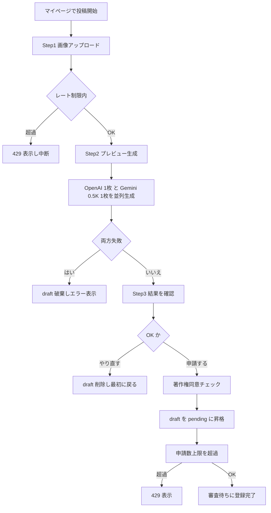
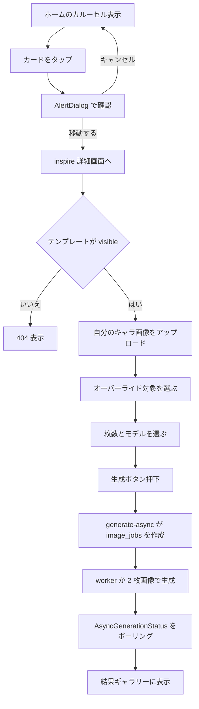
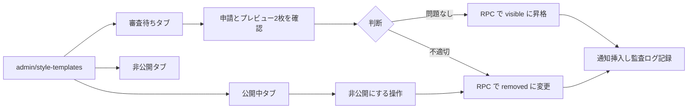
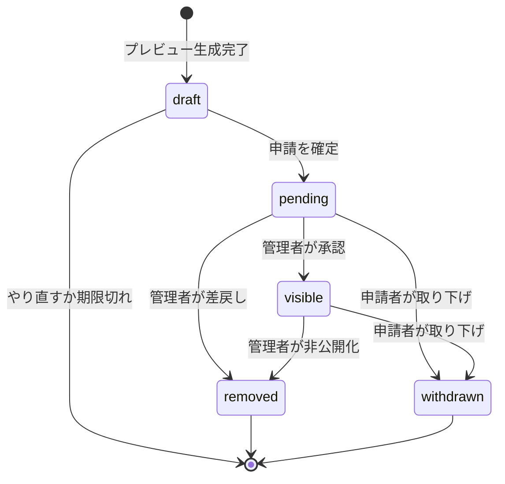
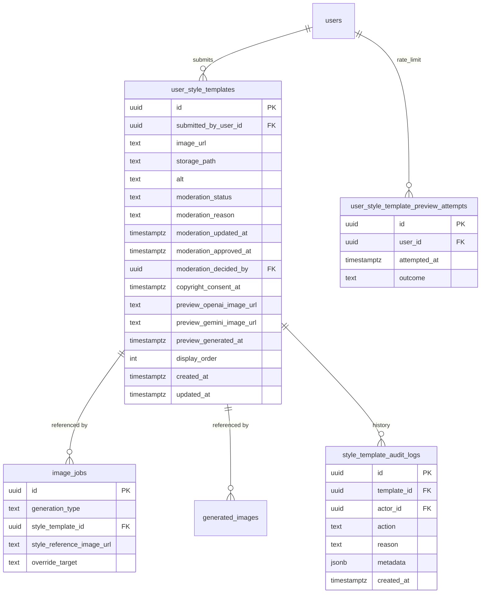
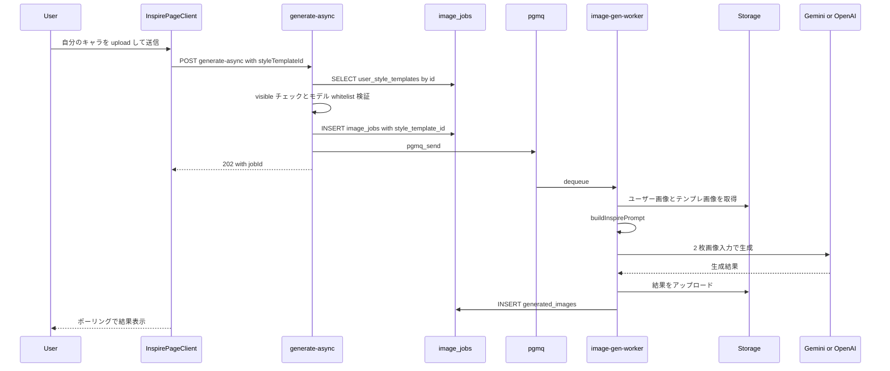
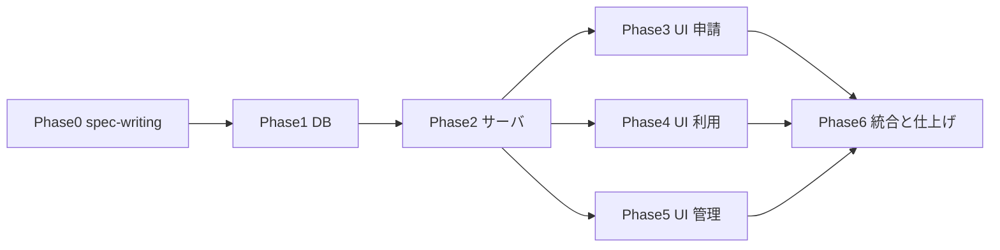

# ユーザー投稿スタイルテンプレート機能（Inspire）実装計画

最終更新日: 2026-05-02（Supabase live レビュー反映: ADR-011/012 追加、Phase 1 索引・RLS・Edge Function 設定を best-practice 準拠に修正）

---

## 0. Phase A サマリ（ヒアリング結果）

ユーザーとの対話で確定済みの主要決定（A-1〜A-5 を圧縮）:

- **ゴール**: 認証ユーザーが好きなイラストを「スタイルテンプレート」として申請、運営承認後にホームへ掲載。他ユーザーがそれを選び、自分のキャラクター画像と合成して、テンプレートのアングル/ポーズ/衣装/背景・全体雰囲気を維持しつつ、キャラクターだけを差し替えた画像を生成する。
- **スコープに含む**: 申請モーダル（プレビュー生成必須）、ホーム新カルーセル、`/inspire/[templateId]` 新規生成画面、`/admin/style-templates` 管理画面、`inspire` 用の生成 API/Worker 拡張、通知・監査ログ連携。
- **スコープに含まない（MVP では）**: テンプレート横断インデックスページ、テンプレート使用時の申請者報酬、AI による自動モデレーション、Storage の自動クリーンアップ（draft 自動掃除のみ採用）。
- **データ**: 新規テーブル `user_style_templates`、レートリミットテーブル、監査テーブル、`image_jobs`/`generated_images` の拡張。
- **UX**: ホーム/マイページ/生成画面/管理画面の4面に新規 UI、申請は3ステップ（アップロード → プレビュー → 申請確定）。
- **懸念**: OpenAI 多入力対応（確認済み: `/v1/images/edits` の `image[]`）、低解像度モデルの2画像入力品質、Storage コスト、自己申告型の著作権チェック。

---

## 1. コードベース調査結果（Phase B）

事前に Explore/Plan エージェントで以下を確認済み。本計画はこの調査結果に基づく。

### 1.1 ディレクトリ規約
- 機能ロジック: `features/<domain>/components/`, `features/<domain>/lib/`
- API ルート: `app/api/<route>/route.ts` + `handler.ts`
- 管理画面: `app/(app)/admin/<area>/page.tsx`
- 共通生成ロジック: `shared/generation/`（Node API と Deno Edge Function で共有）

### 1.2 既存の生成パイプライン（最接近）
| 役割 | ファイル |
|---|---|
| 認証ユーザーの非同期生成入口 | [app/api/generate-async/route.ts](../../app/api/generate-async/route.ts) → [app/api/generate-async/handler.ts](../../app/api/generate-async/handler.ts) |
| ジョブキュー Worker | [supabase/functions/image-gen-worker/index.ts](../../supabase/functions/image-gen-worker/index.ts) |
| プロンプトビルダ | [shared/generation/prompt-core.ts](../../shared/generation/prompt-core.ts) |
| OpenAI 画像クライアント | [features/generation/lib/openai-image.ts](../../features/generation/lib/openai-image.ts), [supabase/functions/image-gen-worker/openai-image.ts](../../supabase/functions/image-gen-worker/openai-image.ts) |
| モデル設定 | [features/generation/lib/model-config.ts](../../features/generation/lib/model-config.ts) |
| Zod スキーマ | [features/generation/lib/schema.ts](../../features/generation/lib/schema.ts) |
| ペルコイン課金/返金 | RPC `deduct_free_percoins` / `refund_percoins` |
| ゲスト同期生成 | [app/api/coordinate-generate-guest/route.ts](../../app/api/coordinate-generate-guest/route.ts) → [features/generation/lib/guest-generate.ts](../../features/generation/lib/guest-generate.ts) |

**既存制約**: `image_jobs.input_image_url` は単一画像。2 枚画像入力は新規対応が必要。

### 1.3 モデレーションのお手本
| 役割 | ファイル |
|---|---|
| Admin ガード | [lib/auth.ts](../../lib/auth.ts) `requireAdmin()`、`ADMIN_USER_IDS` env、[app/(app)/admin/layout.tsx](../../app/(app)/admin/layout.tsx) |
| Admin ナビ定義 | [app/(app)/admin/admin-nav-items.ts](../../app/(app)/admin/admin-nav-items.ts) |
| 投稿モデレーション UI | [app/(app)/admin/moderation/page.tsx](../../app/(app)/admin/moderation/page.tsx), [app/(app)/admin/moderation/ModerationQueueClient.tsx](../../app/(app)/admin/moderation/ModerationQueueClient.tsx) |
| 投稿モデレーション API | [app/api/admin/moderation/posts/[postId]/decision/route.ts](../../app/api/admin/moderation/posts/[postId]/decision/route.ts) |
| 決定 RPC のお手本 | [supabase/migrations/20260209094500_add_apply_admin_moderation_decision_rpc.sql](../../supabase/migrations/20260209094500_add_apply_admin_moderation_decision_rpc.sql) |
| 監査ヘルパ | [lib/admin-audit.ts](../../lib/admin-audit.ts) `logAdminAction()`、テーブル `admin_audit_log` |
| 履歴テーブル | `moderation_audit_logs`（投稿用、別物として `style_template_audit_logs` を新設） |

### 1.4 ホーム/UI のお手本
| 役割 | ファイル |
|---|---|
| ホームページ | [app/[locale]/page.tsx](../../app/[locale]/page.tsx) |
| カルーセル + AlertDialog 確認パターン | [features/home/components/HomeStylePresetCarousel.tsx](../../features/home/components/HomeStylePresetCarousel.tsx)（lines 296–331） |
| カルーセルのサーバ側キャッシュ | [features/home/components/CachedHomeStylePresetSection.tsx](../../features/home/components/CachedHomeStylePresetSection.tsx) |
| AlertDialog 基底 | [components/ui/alert-dialog.tsx](../../components/ui/alert-dialog.tsx) |
| Bottom Nav | [components/NavigationBar.tsx](../../components/NavigationBar.tsx) |
| 既存生成フォーム | [features/generation/components/GenerationForm.tsx](../../features/generation/components/GenerationForm.tsx) |
| 画像アップロード | [features/generation/components/ImageUploader.tsx](../../features/generation/components/ImageUploader.tsx) |
| モデルセレクタ | [features/generation/components/LockableModelSelect.tsx](../../features/generation/components/LockableModelSelect.tsx) |

### 1.5 i18n
- 翻訳ファイル: [messages/ja.ts](../../messages/ja.ts), [messages/en.ts](../../messages/en.ts)
- サーバ: `getTranslations('home')`, クライアント: `useTranslations('home')`

### 1.6 Supabase 接続
- `.cursor/rules/database-design.mdc` にスキーマ定義の正本あり
- マイグレーション規約: 追加のみ、DOWN はコメントで残す
- 既存パターンの参考:
  - 通知タイプ拡張: [supabase/migrations/20260108080809_update_notifications_type_constraint.sql](../../supabase/migrations/20260108080809_update_notifications_type_constraint.sql)
  - `generation_type` CHECK 拡張: [supabase/migrations/20260411153000_allow_one_tap_style_generation_type.sql](../../supabase/migrations/20260411153000_allow_one_tap_style_generation_type.sql)

### 1.7 影響範囲（変更が及ぶ既存ファイル）
- 生成パイプライン: handler.ts, schema.ts（KNOWN_MODEL_INPUTS は types.ts が単一の正本、ADR-008）, prompt-core.ts, image-gen-worker/index.ts（**`loadJobInputImages` への抽出リファクタ含む**、Phase 2）, image-gen-worker/openai-image.ts, model-config.ts, types.ts
- ホーム: app/[locale]/page.tsx
- マイページ: app/(app)/my-page/page.tsx
- Admin: admin-nav-items.ts, lib/admin-audit.ts
- env/lib: lib/env.ts
- i18n: messages/ja.ts, messages/en.ts

### 1.8 参照ドキュメント
- [docs/development/project-conventions.ja.md](../development/project-conventions.ja.md)
- [docs/architecture/data.ja.md](../architecture/data.ja.md)
- [docs/moderation-operations.md](../moderation-operations.md)
- [.cursor/rules/database-design.mdc](../../.cursor/rules/database-design.mdc)
- [.agents/skills/codex-webpack-build/](../../.agents/skills/codex-webpack-build/)

---

## 2. 概要図

### 2.1 申請者フロー（プレビュー → 確認 → 申請）

### 2.2 利用者フロー（テンプレートを使った生成）

### 2.3 管理者フロー

### 2.4 申請者の状態遷移

### 2.5 データモデル

### 2.6 生成 API シーケンス（inspire）

### 2.7 フェーズ間依存

---

## 3. EARS（要件定義）

### 3.1 申請（Submission）

| ID | EARS（EN） | 日本語 |
|---|---|---|
| REQ-S-01 | When an authenticated user uploads a template image and requests a preview, the system shall generate exactly one OpenAI image and one Gemini 0.5K image in parallel using the operator-provided test character. | 認証ユーザーがテンプレ画像をアップロードしプレビュー生成を要求したとき、システムは運営提供のテストキャラ画像と組み合わせて OpenAI 1枚 + Gemini 0.5K 1枚を並列同期生成しなければならない。 |
| REQ-S-02 | When a preview generation is requested, the system shall execute the following steps in order: (a) INSERT a draft row, (b) upload the template image to Storage and update the row, (c) call OpenAI/Gemini in parallel, (d) upload each successful preview to Storage and update the row, (e) record the attempt in `user_style_template_preview_attempts`. | プレビュー生成時、システムは次の順序で実行しなければならない: (a) draft 行を INSERT、(b) テンプレート画像を Storage にアップロードし行を更新、(c) OpenAI/Gemini を並列呼び出し、(d) 各成功プレビューを Storage にアップロードし行を更新、(e) 試行を `user_style_template_preview_attempts` に記録。 |
| REQ-S-03 | If a user has already attempted preview generation 10 or more times in the past 24 hours, then the system shall reject further preview requests with HTTP 429. | ユーザーが過去24時間で10回以上プレビュー生成を試みた場合、システムは追加要求を 429 で拒否しなければならない。 |
| REQ-S-04 | If both OpenAI and Gemini preview generations fail, then the system shall delete the draft row AND remove the uploaded template image from Storage, then return an error to the user. | OpenAI と Gemini の両方が失敗した場合、システムは draft 行を削除しさらに Storage 上のテンプレート画像も削除した上でエラーを返さなければならない。 |
| REQ-S-05 | If only one of the two preview generations fails, then the system shall preserve the draft with the successful preview and indicate `partial` to the client. | 片方のみ失敗した場合、システムは成功した方を保持した draft を残し、クライアントに `partial` を返さなければならない。 |
| REQ-S-06 | When a user submits a draft for review with `copyrightConsent=true`, the system shall promote the row from `draft` to `pending` and record `copyright_consent_at`. | ユーザーが同意付きで申請を確定したとき、システムは `draft` を `pending` に昇格し `copyright_consent_at` を記録しなければならない。 |
| REQ-S-07 | If a user has 5 or more rows in `pending` or `visible`, then the system shall reject promotion attempts with HTTP 429. | ユーザーが `pending` または `visible` を 5 件以上保有している場合、システムは申請昇格を 429 で拒否しなければならない。 |
| REQ-S-08 | While a row is in `draft` for more than 24 hours, the system shall delete the row and its Storage objects automatically. | `draft` 状態が24時間を超えた場合、システムは自動的に行と Storage オブジェクトを削除しなければならない。 |
| REQ-S-09 | When the submitter requests a withdrawal, the system shall change the status to `withdrawn` (if `pending`/`visible`) or fully delete the row (if `draft`). | 申請者が取り下げを要求したとき、`pending`/`visible` なら `withdrawn` に変更、`draft` なら完全削除しなければならない。 |
| REQ-S-10 | If a submission is made without `copyrightConsent=true`, then the system shall reject with HTTP 400. | 著作権同意がない申請は 400 で拒否しなければならない。 |
| REQ-S-11 | Where `INSPIRE_SUBMISSION_ALLOWED_USER_IDS` env is set to a non-empty list, only users whose `auth.uid()` is contained in the list shall be able to access submission APIs and the submission UI; other authenticated users shall receive HTTP 403 from the APIs and shall not see the submission entry point. When the env is unset/empty, all authenticated users shall be allowed. | `INSPIRE_SUBMISSION_ALLOWED_USER_IDS` env が空でないとき、リストに含まれるユーザーのみ申請 API と申請 UI にアクセス可。他の認証ユーザーには API は 403、UI は申請導線を非表示。env 未設定/空の場合は全認証ユーザー許可（ガード解除）。 |

### 3.2 モデレーション（Admin）

| ID | EARS（EN） | 日本語 |
|---|---|---|
| REQ-A-01 | While accessing `/admin/style-templates`, the system shall require an admin user (per `ADMIN_USER_IDS`). | `/admin/style-templates` 配下は `ADMIN_USER_IDS` に含まれる管理者のみアクセス可とする。 |
| REQ-A-02 | When an admin approves a pending template, the system shall set `moderation_status='visible'`, set `moderation_approved_at`, insert a `style_template_audit_logs` row, log to `admin_audit_log`, insert a `notifications` row, and revalidate the home cache tag. | 管理者が承認したとき、状態を `visible` に更新、承認時刻を記録、監査ログを2系統に記録、通知を発行、ホームキャッシュを再検証しなければならない。 |
| REQ-A-03 | When an admin rejects or unpublishes a template, the system shall set `moderation_status='removed'`, log audit, and (only on reject) insert a notification with reason. | 差戻し/非公開化時、状態を `removed` に変更、監査記録、（差戻しのみ）理由付き通知を発行する。 |
| REQ-A-04 | When an admin updates `display_order`, the system shall persist it and revalidate the home cache tag. | 並び順変更時、永続化しホームキャッシュを再検証する。 |

### 3.3 ホーム表示

| ID | EARS（EN） | 日本語 |
|---|---|---|
| REQ-H-01 | While rendering the home page, the system shall show only `moderation_status='visible'` rows in the user style template carousel, sorted by `display_order ASC, created_at DESC`. | ホーム描画時、`visible` 行のみを `display_order` 昇順 + `created_at` 降順でカルーセル表示する。 |
| REQ-H-02 | While rendering each card, the system shall display the submitter's nickname and avatar, with a link to the submitter's profile. | 各カードに申請者のニックネームとアバターを表示し、プロフィールへのリンクを設置する。 |
| REQ-H-03 | When a user taps a card, the system shall show an `AlertDialog` titled "このイラストのスタイルを使って生成画面へ移動しますか？" with confirm/cancel actions. | カードタップ時に `AlertDialog`（指定タイトル）で確認を求める。 |

### 3.4 利用者（生成）フロー

| ID | EARS（EN） | 日本語 |
|---|---|---|
| REQ-G-01 | While serving `/inspire/[templateId]`, the system shall return 404 if the template's `moderation_status != 'visible'`. | `/inspire/[templateId]` SSR で `visible` 以外は 404。 |
| REQ-G-02 | When a user submits the generation form, the system shall validate `styleTemplateId`, the user's character image, the model whitelist (`INSPIRE_ALLOWED_MODELS`), and the percoin balance. | 生成送信時、`styleTemplateId`・キャラ画像・許可モデル・残高をすべて検証する。 |
| REQ-G-03 | If the template's `moderation_status` becomes non-`visible` between page load and submission, then the system shall reject with HTTP 409. | テンプレートが送信時に非公開化されていれば 409 で拒否する。 |
| REQ-G-04 | When `generationType='inspire'` is processed by the worker, the system shall pass two images (user character + style template) to the AI provider and use `buildInspirePrompt` based on `override_target`. | Worker は inspire ジョブを 2 枚画像入力 + `buildInspirePrompt` で処理する。 |
| REQ-G-05 | When `override_target=null`, the system shall instruct the model to preserve the template's angle, pose, outfit, and background while replacing only the character. | `override_target=null` のとき、テンプレのアングル/ポーズ/衣装/背景を維持しキャラのみ差し替える。 |
| REQ-G-06 | Where `override_target` is one of `angle|pose|outfit|background`, the system shall regenerate that single element while preserving the others. | 個別オーバーライド時、対象要素のみ再生成し他は維持する。 |
| REQ-G-07a | When `/api/generate-async` validates an inspire request, the system shall pre-check sufficient balance using the formula `requiredPercoinCost = getPercoinCost(model) * acceptedImageCount`, identical to coordinate. | `/api/generate-async` で inspire リクエストを検証する際、`requiredPercoinCost = getPercoinCost(model) * acceptedImageCount` で残高を事前確認する（コーディネートと同一）。 |
| REQ-G-07b | When the worker successfully generates each image, the system shall debit `getPercoinCost(model)` per image via `deduct_free_percoins` RPC, identical to coordinate (per-image, not per-job). | Worker が画像を1枚生成成功するたびに `deduct_free_percoins` RPC で 1 枚分のコストを課金する（per-image、コーディネートと同一の per-image 課金）。 |
| REQ-G-07c | If image generation fails after percoin has been debited, the system shall refund via `refund_percoins` RPC. | 課金後に生成失敗した場合は `refund_percoins` RPC で返金する。 |

### 3.5 通知

| ID | EARS（EN） | 日本語 |
|---|---|---|
| REQ-N-01 | When a template is approved, the system shall insert a notification of `type='style_template_approved'`. | 承認時に `style_template_approved` の通知を挿入する。 |
| REQ-N-02 | When a pending template is rejected by admin, the system shall insert a notification of `type='style_template_rejected'` with reason. | 申請待ちのテンプレートが管理者により差戻しされた場合、理由付きで `style_template_rejected` 通知を挿入する。 |
| REQ-N-03 | When a previously approved template is unpublished by admin, the system shall insert a notification of `type='style_template_unpublished'` with reason. | 公開中のテンプレートが管理者により非公開化された場合、理由付きで `style_template_unpublished` 通知を挿入する（差戻しと UX を分離）。 |
| REQ-N-04 | When inserting any `style_template_*` notification, the system shall use direct `INSERT` into `notifications` (rather than `create_notification` RPC) so the notification path is uniform and easy to migrate when notification preferences are extended in the future. | `style_template_*` 通知の挿入時は `notifications` テーブルへ直接 INSERT する（`create_notification` RPC は `like|comment|follow` 以外の type を素通し INSERT するため挙動上は等価だが、将来 preference 列を拡張したときに挿入経路を 1 本にしておく方が改修しやすいため）。 |

---

## 4. ADR（設計判断記録）

### ADR-001: 既存 `style_presets` を流用せず新規テーブル `user_style_templates` を新設する

- **Context**: 既に管理者管理の One-Tap Style 用 `style_presets` が存在し、ホームのカルーセル + 確認ダイアログのお手本も提供している。
- **Decision**: 新規テーブル `user_style_templates` を新設する。
- **Reason**: ① 提出主体（運営 vs ユーザー）が違う、② 生成セマンティクスが違う（衣装変更 vs キャラ差し替え）、③ プレビュー画像列・著作権同意列・申請数 cap など独自要件があり、`style_presets` に混ぜると行ごとの意味が二重化する。
- **Consequence**: ホームには 2 つの似たカルーセルが並ぶことになる（One-Tap Style とユーザー投稿スタイル）。コピーで明確に区別する必要がある。

### ADR-002: `inspire` を新規 `generation_type` として既存パイプラインに乗せる

- **Context**: 既存パイプラインは generation_type で分岐している（`coordinate|specified_coordinate|full_body|chibi|one_tap_style`）。
- **Decision**: `generation_type='inspire'` を追加し、`image_jobs` / `generated_images` の CHECK を拡張する。
- **Reason**: 課金・キュー・Storage・通知などのインフラを再利用でき、Worker 側の追加実装を最小化できる。
- **Consequence**: `image_jobs` に2枚目画像用カラム（`style_template_id` / `style_reference_image_url`）と `override_target` を追加する。Worker の入力準備とプロバイダ呼び出しに分岐が増える。

### ADR-003: 申請前プレビューは同期 API で 2 モデル並列実行する

- **Context**: 申請者は審査前に「他人がどう見えるか」を確認したい。既存の同期生成パターン（ゲスト用）が利用可能。
- **Decision**: `POST /api/style-templates/preview-generation` を同期エンドポイントとして実装し、`gpt-image-2-low` と `gemini-3.1-flash-image-preview-512` を `Promise.allSettled` で並列実行する。
- **Reason**: 非同期キュー経由にすると UX がポーリング前提になり、ダイアログ内 UI が重くなる。コーディネート用の async 経路には乗せず、軽量な同期パスにする。
- **Consequence**: ダイアログでローディング待ちが発生する（最大 ~90 秒、OpenAI 制限）。レート制限と片肺成功（`partial`）のハンドリングを実装する必要がある。

### ADR-004: プレビューはペルコイン課金せず日次10回のレートリミットで運営負担とする

- **Context**: プレビューはユーザーの審査前確認が目的。課金すると審査前確認が萎縮し、運用上もユーザー負担を加えにくい。
- **Decision**: ユーザー側はペルコインを消費しない。代わりに `user_style_template_preview_attempts` テーブルで日次10回までに制限する。
- **Reason**: 試行コスト（運営側で gpt-image-2-low + gemini 0.5K = 約 0.04 USD/試行 想定）を低く抑えるため、低解像度モデルに固定する。10回/日は通常のユーザー試行で十分かつ濫用に耐える上限。
- **Consequence**: 運営コストが増える。Phase 3 以降に実コストを見て上限を再調整する。

### ADR-005: 状態 `draft` を導入し、申請の「未確定だが画像はアップロード済み」を表現する

- **Context**: プレビュー生成時点で画像3枚（テンプレ + プレビュー2枚）が Storage に上がる。ここで `pending` にしてしまうと、ユーザーが「やり直す」を選んだときの管理が複雑になる。
- **Decision**: `moderation_status` に `draft` を追加し、確定時に `pending` に昇格する 2 段階状態とする。
- **Reason**: 確定前の不要なノイズを管理画面の審査待ち件数から外せる。「やり直す」「期限切れ」を明確に表現できる。
- **Consequence**: 状態遷移と RLS が複雑化する。pg_cron による draft の自動掃除が必須。

### ADR-006: OpenAI 経路は `image[]` フィールドへの複数 append に拡張し、出力比率は `image_1`（テンプレート）に合わせる

- **Context**: OpenAI `/v1/images/edits` は **既に** [supabase/functions/image-gen-worker/openai-image.ts:200](../../supabase/functions/image-gen-worker/openai-image.ts#L200) で `form.append("image[]", file)` を 1 枚で使っている。`gpt-image-2` 系は複数枚 append による多入力をサポートする。出力フレーム比率は現状 image_0（先頭画像）から推定しているが、inspire では image_1（テンプレ）に合わせる必要がある。
- **Decision**: 既存 form フィールド名 `image[]` は変更せず、**同フィールドへの複数 `append` に拡張**する。`callOpenAIImageEditBatch` の引数を `inputImages: OpenAIImageInput[]` に変更し、配列順で append。`targetSize` は inspire の場合 `inputImages[1]`（テンプレート）から、それ以外は従来通り `inputImages[0]` から算出。
- **Reason**: フィールド名は既に正しい。出力フレームがテンプレの構図に従わないと「全要素維持」が破綻する。
- **Consequence**: `openai-image.ts` のシグネチャ変更は破壊的なため、非 inspire 経路の挙動不変を担保するリグレッションテストが必須（Phase 2）。

### ADR-007: 監査ログを2系統（`style_template_audit_logs` + `admin_audit_log`）に書く

- **Context**: 既存の投稿モデレーション（[lib/admin-audit.ts](../../lib/admin-audit.ts)）も同パターン。`admin_audit_log` は **管理者の全アクションの横断検索用**、`style_template_audit_logs` は **テンプレート単位の履歴 join 用**。役割が異なる。
- **Decision**: 2 系統に書く。`apply_user_style_template_decision` RPC が `style_template_audit_logs` を、API ハンドラが `logAdminAction()` を呼んで `admin_audit_log` を書く。
- **Reason**: `/admin/style-templates` の詳細パネルでテンプレ単位の履歴を表示するときの join コスト最小化と、admin ダッシュボードでの横断的な調査の両立。
- **Consequence**: 軽微なデータ重複。トランザクション境界が分かれるため、片方失敗時の整合性は eventual（既存パターン踏襲）。

### ADR-008: モデル列挙の単一の正本は `KNOWN_MODEL_INPUTS`（[features/generation/types.ts](../../features/generation/types.ts#L70)）

- **Context**: [features/generation/lib/schema.ts](../../features/generation/lib/schema.ts#L83-L86) は `KNOWN_MODEL_INPUTS` を import して使用している。types.ts が正本、schema.ts は consumer。
- **Decision**: モデル追加・除外は `types.ts` の `KNOWN_MODEL_INPUTS` を編集する。`INSPIRE_ALLOWED_MODELS` などの派生定数は [features/generation/lib/model-config.ts](../../features/generation/lib/model-config.ts) に置き、`KNOWN_MODEL_INPUTS` の subset として実装する。
- **Reason**: 同期ミスを防ぐ。型と実行時バリデーションを同じソースから生成。
- **Consequence**: プランの Phase 2 で「types.ts を schema と同期」と書いたのは誤り。types.ts が正本。

### ADR-009: 申請プレビュー画像は private バケット + 短期署名 URL とする

- **Context**: 当初は public バケットを想定したが、`pending` 段階のプレビューは申請者と admin しか参照しない。public バケットだと URL 漏洩リスクがある。なお、本リポジトリの既存 6 バケット（generated-images / banners / popup-banners / materials_images / style_presets / announcement-images）は **すべて public** であり、`style-templates` は **本プロジェクト初の private バケット**となる。
- **Decision**: `style-templates` バケットを **private** で作成。アクセスは Supabase の署名 URL（数分〜数十分の短期）を都度発行する。`visible` 状態のテンプレ本体（カルーセル表示用）も private + 署名 URL とする。
- **Reason**: pending プレビュー漏洩耐性を Phase 1 で担保。Phase 3 移行コストを排除。
- **Storage RLS（必ず明示）**:
  - INSERT: `bucket_id = 'style-templates' AND (storage.foldername(name))[1] = (SELECT auth.uid())::text`
  - DELETE: 同上（draft 取り下げ時の自己削除）
  - SELECT: **作らない**（DENY by default）。閲覧は API 経由で発行する signed URL のみ
  - `system/` 配下（運営テストキャラ画像）への書き込みは service-role 経由のみ（運用 Runbook §10.2 で明記）
- **Consequence**:
  - ホームカルーセルは ISR/Cache Components 上で署名 URL を都度更新する必要があり、`cacheTag` の TTL を署名期限より短くする運用が必要。または `` で都度 fetch する方が単純。Phase 4 で UI 設計時に最終決定。
  - **private バケット運用ノウハウが本リポジトリに無い**ため、Phase 1 で実機検証が必要: (1) iOS Safari / Chrome で signed URL の `` 表示、(2) 署名期限切れ時の再取得 UX、(3) Cache Components TTL < 署名期限の運用ルール化（マイグレでは強制不能）。

### ADR-010: 申請者ホワイトリストは fail-open（`requireAdmin()` の fail-closed と意図的に逆向き）

- **Context**: 既存 [lib/auth.ts:65-68](../../lib/auth.ts#L65-L68) の `requireAdmin()` は `ADMIN_USER_IDS` env が空のとき **403（fail-closed / deny-all）** を返す。一方、本機能の `isInspireSubmitterAllowed(userId)` は `INSPIRE_SUBMISSION_ALLOWED_USER_IDS` env が空のとき **true（fail-open / allow-all）** を返す。
- **Decision**: 上記の非対称を意図的に採用する。
- **Reason**: 申請者ホワイトリストは「段階開放の一時ゲート」であり、機能の最終形は全認証ユーザーへの開放。env を空にする = 全公開する、という運用フロー（§8 ロールバック方針の「全公開」シナリオ）を成立させるには fail-open でなければならない。`requireAdmin` の機能（管理者専用の永続的なゲート）とは目的が異なる。
- **Consequence**:
  - **意図せぬ全公開リスク**: 本番デプロイ時に env 設定漏れがあると意図せず全公開される。これを防ぐため、(1) `lib/auth.ts` の `isInspireSubmitterAllowed` 実装内にコメント `// 既存 requireAdmin と異なり env 空 = 全許可（段階開放ゲートのため、ADR-010 参照）` を必ず付記、(2) Phase 2 のチェックリストに「本番 env に `INSPIRE_SUBMISSION_ALLOWED_USER_IDS` を設定済か」をリリース前確認項目として明示
  - 後任のレビュアが `requireAdmin` パターンと同型と誤認しないよう、本 ADR への参照を実装コメントに含める

### ADR-011: `style-template-cleanup` Edge Function は `verify_jwt: false` + CRON_SECRET ヘッダで保護する

- **Context**: live で稼働中の `image-gen-worker-cron` は `pg_cron` から `net.http_post` で `/functions/v1/image-gen-worker` を Authorization ヘッダ無しで叩いている（`image-gen-worker` 側 `verify_jwt: false`）。これを踏襲しないと、新規 cron からの起動が 401 で失敗する。
- **Decision**: `style-template-cleanup` も **`verify_jwt: false`** で配置し、関数内で `Deno.env.get('CRON_SECRET')` を `Authorization: Bearer <token>` と照合する 2 層防御を採用する。`pg_cron` 側は `Authorization` ヘッダに CRON_SECRET（Vault 経由）を埋め込んで `net.http_post` する。
- **Reason**: (a) Supabase の JWT 検証は `verify_jwt: true` でも anon JWT で通ってしまうため、cron 起動を絞る目的では不十分、(b) 既存 worker と同パターンで揃えることで運用の一貫性を担保、(c) CRON_SECRET 漏洩時にも `verify_jwt: false` 単独より防御層が増える。
- **Consequence**: CRON_SECRET の管理が増える（既存 worker と同 secret を流用するか、別 secret を発行するかは Phase 1 で決定）。`supabase/config.toml` に `verify_jwt = false` を明記し、デプロイ時の取り違えを防ぐ。

### ADR-012: 新規テーブルの RLS は `(select auth.uid())` 形式で記述、FK 列は必ず索引化

- **Context**: `/supabase-postgres-best-practices` の `security-rls-performance` で「`auth.uid() = user_id` を直書きすると行ごとに関数呼び出しされ、100 倍以上遅くなる」と明記されている。本リポジトリの既存 `image_jobs` ポリシー（live: `(( SELECT auth.uid() AS uid) = user_id)`）はこの形に揃っている。同じく `schema-foreign-key-indexes` で「PostgreSQL は FK 列を自動索引化しないので CASCADE / JOIN がフルスキャンになる」と明記されている。
- **Decision**: 本機能で新設するすべての RLS ポリシーは `(SELECT auth.uid())` 形式で記述する。すべての FK 列に索引を作成する（複合索引で兼ねる場合は重複を避ける）。
- **Reason**: 性能ベストプラクティス準拠と既存ポリシーとの記述形式統一。
- **Consequence**: Phase 1 マイグレーションのレビュー時、`auth.uid()` 直書きポリシーがあれば必ず差し戻すこと。FK 索引の本数が増えるが、partial index で必要な状態のみに絞ることで書き込みオーバーヘッドを抑制する（§5 Phase 1 の索引一覧参照）。

### ADR-013: ホームカルーセル公開は `NEXT_PUBLIC_INSPIRE_HOME_CAROUSEL_ENABLED` フラグで段階制御する

- **Context**: ホームには既に One-Tap Style カルーセル（`CachedHomeStylePresetSection`）があり、その直下にユーザー投稿スタイルのカルーセルを置く想定。しかし、(a) 2 連カルーセルの UX 区別（並び順・コピー・密度）が未確定、(b) 申請者ホワイトリスト初期運用中はテンプレート数が極端に少なく、カルーセルとして見栄えしない。
- **Decision**: ホームカルーセルは Phase 4 で**コードのみ実装**し、`app/[locale]/page.tsx` への mount は env フラグ `NEXT_PUBLIC_INSPIRE_HOME_CAROUSEL_ENABLED` が `'true'` のときに限る。**MVP リリース時はフラグ未設定（OFF）**で、ホームに何も追加しない。利用フローは `/inspire/[templateId]` の **URL 直叩き or 申請者がマイページから自分の visible 件にジャンプ**で動作確認する。
- **Reason**:
  - admin が `visible` 化したテンプレートを露出させずに動作検証できる（テンプレ件数・運用負荷を見ながら段階公開）
  - UI 設計の最終決定（One-Tap Style との並び順・コピー）が固まるまで本番ホームを汚さない
  - `NEXT_PUBLIC_INSPIRE_ENABLED`（機能全体の kill switch）と独立させることで、「機能は ON だがホームには出さない」状態を表現できる
- **Consequence**:
  - フラグ OFF 時のテスト: ホームの DOM にカルーセルが出ないこと、`/inspire/[templateId]` 直叩きは動作すること、admin の承認 → 通知挿入まで一通り動くこと、を Phase 6 のテストに含める
  - フラグ ON への切り替えは env 1 行の追加のみ。コード変更不要（Cache Components の挙動上、フラグ変更後にデプロイが必要）
  - 申請者本人が「自分の承認済みテンプレ」をプレビューする導線は、マイページの `MySubmittedTemplatesCard` に各行から `/inspire/[id]` へのリンクを設ける（フラグに関係なく機能する）

---

## 5. 実装計画

### Phase 0（Phase 1 直前）: スペック精査

`/spec-writing inspire` を本計画の §3 EARS を起点に走らせ、Phase 1 マイグレーションの列定義が確定する前に REQ をリファインする。

### Phase 1: データベース設計とマイグレーション

**目的**: `user_style_templates` 本体・補助テーブル・状態 enum・拡張カラム・RPC・通知タイプ・Storage クリーンアップ Edge Function を揃える。
**ビルド確認**: `npm run typecheck` がパスし、Supabase の `supabase db reset` がエラーなく完了する。

- [ ] `supabase/migrations/20260502120000_add_user_style_templates.sql`
  - テーブル本体（`draft|pending|visible|removed|withdrawn` の status）
  - 列: `moderation_approved_at`, `moderation_reason`, `moderation_updated_at`, `moderation_decided_by` （後者は admin の user_id を `auth.users(id)` で参照、UI で「いつ誰が承認したか」を join なしで表示するため）
  - **インデックス（partial index で必要な状態のみに絞る）**:
    - `idx_user_style_templates_visible_order ON (display_order ASC, created_at DESC) WHERE moderation_status = 'visible'`（ホームカルーセル）
    - `idx_user_style_templates_pending_created ON (created_at DESC) WHERE moderation_status = 'pending'`（admin 審査キュー）
    - `idx_user_style_templates_draft_created ON (created_at) WHERE moderation_status = 'draft'`（cleanup function 用）
    - `idx_user_style_templates_submitter ON (submitted_by_user_id, moderation_status)`（FK 索引兼 user 自身の一覧用、FK 列のため `schema-foreign-key-indexes` ベストプラクティス準拠）
    - `idx_user_style_templates_decided_by ON (moderation_decided_by) WHERE moderation_decided_by IS NOT NULL`（FK 索引、CASCADE 高速化）
  - `update_updated_at_column` トリガ
  - cap トリガ `enforce_user_style_template_submission_cap`
    - **並行性対策**: トリガ先頭で `PERFORM pg_advisory_xact_lock(hashtextextended('user_style_template_cap:' || NEW.submitted_by_user_id::text, 0));` でユーザー単位の排他ロックを取得してから count（**bigint 単一引数版**を採用、`hashtext()::bigint` は型不一致で誤りのため `hashtextextended` を使用、`/supabase-postgres-best-practices` の `lock-advisory.md` 準拠）
    - INSERT/UPDATE で `pending` への遷移を検知し5件超で `check_violation`
  - **RLS（`(select auth.uid())` 形式で記述、`security-rls-performance` 準拠）**:
    - SELECT 公開: `USING (moderation_status = 'visible')`
    - SELECT 申請者: `USING ((SELECT auth.uid()) = submitted_by_user_id)`（全状態で自分の申請を閲覧可）
    - SELECT 管理者: `USING (EXISTS (SELECT 1 FROM admin_users WHERE user_id = (SELECT auth.uid())))`
    - UPDATE 申請者（取り下げのみ）: `USING ((SELECT auth.uid()) = submitted_by_user_id) WITH CHECK ((SELECT auth.uid()) = submitted_by_user_id AND moderation_status = 'withdrawn')`
    - UPDATE 状態昇格は `apply_user_style_template_decision` / `promote_user_style_template_draft` RPC（SECURITY DEFINER）経由のみ
- [ ] `supabase/migrations/20260502120010_add_user_style_template_preview_attempts.sql`
  - レートリミット用テーブル + `idx_user_id_attempted_at` 索引（FK 索引兼レートリミット集計用）
  - **RLS**: SELECT/INSERT は own のみ（`USING ((SELECT auth.uid()) = user_id)`）
- [ ] `supabase/migrations/20260502120020_add_style_templates_storage_bucket.sql`
  - `style-templates` **private** バケット（**本リポジトリ初の private バケット**、ADR-009）
  - **Storage RLS ポリシー（必ず明示）**:
    - INSERT: `bucket_id = 'style-templates' AND (storage.foldername(name))[1] = (SELECT auth.uid())::text`（自分のフォルダのみ）
    - DELETE: 同上（draft 取り下げ時の自己削除）
    - SELECT: **作らない**（閲覧は API 経由の signed URL のみ）
    - admin による `system/` 配下書き込みは service-role 経由（運用 Runbook で明記、§10.2 参照）
- [ ] `supabase/migrations/20260502120100_extend_image_jobs_for_inspire.sql`
  - `generation_type` CHECK に `'inspire'` 追加（現状 live: `coordinate|specified_coordinate|full_body|chibi|one_tap_style` を確認済、`20260411153000_allow_one_tap_style_generation_type.sql` を踏襲）
  - `image_jobs` に **NULL 許容**で 3 列追加: `style_template_id UUID REFERENCES public.user_style_templates(id) ON DELETE SET NULL`, `style_reference_image_url TEXT`, `override_target TEXT`
  - **整合性 CHECK 制約**: `CHECK ((generation_type = 'inspire') = (style_template_id IS NOT NULL))`（脱漏防止）
  - **FK 索引**: `idx_image_jobs_style_template_id ON (style_template_id) WHERE style_template_id IS NOT NULL`
  - `generated_images` に `style_template_id`, `override_target` カラム追加（同上 NULL 許容 + FK 索引）
- [ ] `supabase/migrations/20260502120200_add_style_template_audit_logs.sql`
  - 列: `id, template_id (FK), actor_id (FK), action, reason, metadata, created_at`
  - **FK 索引**: `(template_id, created_at DESC)` と `(actor_id, created_at DESC)`（`moderation_audit_logs` の前例踏襲）
  - **RLS（重要、`moderation_audit_logs` 前例の "全認証ユーザー SELECT 可" は採用しない）**:
    - SELECT 管理者: `USING (EXISTS (SELECT 1 FROM admin_users WHERE user_id = (SELECT auth.uid())))`
    - SELECT 申請者: `USING (EXISTS (SELECT 1 FROM user_style_templates t WHERE t.id = template_id AND t.submitted_by_user_id = (SELECT auth.uid())))`（自分のテンプレ履歴のみ）
    - INSERT は SECURITY DEFINER の RPC のみ → テーブル直 INSERT は GRANT しない
- [ ] `supabase/migrations/20260502120300_add_apply_user_style_template_decision_rpc.sql`（既存お手本 `20260209094500_add_apply_admin_moderation_decision_rpc.sql` を踏襲）
  - `approve|reject|unpublish` を受け、`moderation_status` 更新 + `moderation_approved_at` / `moderation_decided_by` / `moderation_reason` / `moderation_updated_at` の記録 + `style_template_audit_logs` への履歴挿入を 1 トランザクションで実行
  - **既存 `apply_admin_moderation_decision` 同様、RPC 内では admin チェックをしない**（API 側 `requireAdmin()` が前提）。実装コメントに「呼出側 admin ガード必須」を明記
- [ ] `supabase/migrations/20260502120310_add_promote_user_style_template_draft_rpc.sql`（draft → pending）
- [ ] `supabase/migrations/20260502120320_add_create_user_style_template_draft_rpc.sql`（プレビュー API から呼ぶ SECURITY DEFINER）
- [ ] `supabase/migrations/20260502120400_extend_notifications_for_style_template.sql`
  - **追加 `type` 値**: `'style_template_approved'`, `'style_template_rejected'`, `'style_template_unpublished'`
  - **追加 `entity_type` 値**: `'style_template'`
  - 現状 live CHECK: `type IN ('like','comment','follow','bonus')` / `entity_type IN ('post','comment','user')` を確認済、`20260108080809_update_notifications_type_constraint.sql` を踏襲
- [ ] `supabase/functions/style-template-cleanup/index.ts` 新規 Edge Function
  - **`verify_jwt: false`** で配置（既存 `image-gen-worker` と同じ。cron からヘッダ無しで叩けるように）。`supabase/config.toml` 等で明示
  - 関数内で `Deno.env.get('CRON_SECRET')` を `Authorization` ヘッダと照合（既存 worker パターン踏襲、CRON_SECRET 漏洩時の防御）
  - service-role クライアントで 24時間以上経過した `draft` 行を SELECT
  - 各行の `image_url`, `preview_openai_image_url`, `preview_gemini_image_url` から storage_path を逆引きし、`supabase.storage.from('style-templates').remove([paths])` で削除
  - DB 行を `DELETE`（Storage 削除順 → DB 削除順、途中失敗時は次回 cron が同じ行を拾うので冪等）
  - エラーは Sentry/Logflare に通知し、行残りは次回再処理可能
- [ ] `supabase/migrations/20260502120500_add_cleanup_stale_user_style_template_drafts.sql`
  - pg_cron で 1 時間ごと（cron 表記 `'0 * * * *'`）に `net.http_post` で `/functions/v1/style-template-cleanup` を呼ぶ
  - 既存パターンを踏襲: live `cron.job` の `image-gen-worker-cron`（`select net.http_post(url := 'https://<project_ref>.supabase.co/functions/v1/image-gen-worker', headers := jsonb_build_object('Content-Type','application/json','Authorization','Bearer ' || <CRON_SECRET>), body := '{}', timeout_milliseconds := 5000);`）と同形
  - **`Authorization` ヘッダに CRON_SECRET を埋め込む**（Vault 経由で取得、Edge Function 側 `verify_jwt: false` + 関数内ヘッダ照合で 2 重防御）
  - DB 内で完結する pg_cron だけでは Storage を消せないため、必ず Edge Function 経由で実行
- [ ] 各マイグレーション末尾に `-- DOWN:` のコメントブロックを残す

### Phase 2: サーバーサイド実装

**目的**: API・スキーマ・Worker・プロンプトの拡張を完了させる。
**ビルド確認**: `npm run lint && npm run typecheck && npm run test` がパスする。

- [ ] [features/generation/lib/schema.ts](../../features/generation/lib/schema.ts)
  - enum に `'inspire'` 追加
  - `styleTemplateId`, `overrideTarget` フィールド追加
  - `superRefine` で inspire 時の整合性検証
- [ ] [features/generation/types.ts](../../features/generation/types.ts) の `KNOWN_MODEL_INPUTS`（**単一の正本**、ADR-008）に必要なら新規モデルを追記。`schema.ts` は import のみで自動同期
- [ ] [features/generation/lib/model-config.ts](../../features/generation/lib/model-config.ts)
  - `INSPIRE_ALLOWED_MODELS` 定数（**1024px 以上のモデルのみ許可**: `gemini-2.5-flash-image`, `gemini-3.1-flash-image-preview-1024`, `gemini-3-pro-image-1k|2k|4k`, `gpt-image-2-low`。`gemini-3.1-flash-image-preview-512` は **inspire 用途には除外**）
  - `INSPIRE_PREVIEW_MODELS = ['gpt-image-2-low', 'gemini-3.1-flash-image-preview-512']`（プレビュー時のみ低解像度を使用、運営コスト最小化）
  - `isInspireAllowedModel(model)` ヘルパ
- [ ] [lib/env.ts](../../lib/env.ts) に `INSPIRE_TEST_CHARACTER_IMAGE_URL` を追加
- [ ] [lib/env.ts](../../lib/env.ts) に `INSPIRE_SUBMISSION_ALLOWED_USER_IDS`（カンマ区切り UUID 配列、空なら全許可）を追加。初期値は運営の `dfe54c3c-3764-4758-89eb-2bd445fdc4c6` 1 件
- [ ] [lib/env.ts](../../lib/env.ts) に `NEXT_PUBLIC_INSPIRE_HOME_CAROUSEL_ENABLED`（`'true'` でホームカルーセル有効、未設定/その他は OFF）を追加。**MVP リリース時は未設定**でホームに何も出さない（ADR-013）
- [ ] [lib/auth.ts](../../lib/auth.ts) に `isInspireSubmitterAllowed(userId: string): boolean` ヘルパを追加。**fail-open 設計（env 空 = 全許可）であることを実装内コメントで明記**: `// 既存 requireAdmin と異なり env 空 = 全許可（段階開放ゲートのため、ADR-010 参照）`。`requireAdmin` の構造（[lib/auth.ts:56-75](../../lib/auth.ts#L56-L75)）を**逆向きに**踏襲することに留意（ADR-010）
- [ ] **本番デプロイ前チェックリスト** に「`INSPIRE_SUBMISSION_ALLOWED_USER_IDS` env が運営の user_id を含む形で設定済か」を追加（env 漏れによる意図せぬ全公開を防ぐ、ADR-010 の Consequence）
- [ ] [shared/generation/prompt-core.ts](../../shared/generation/prompt-core.ts)
  - `'inspire'` を `GenerationType` に追加
  - `buildInspirePrompt({ overrideTarget, sourceImageType })` 実装（5 ブランチ）
  - `buildPrompt` の switch に `'inspire'` 分岐（または Worker 側で直接 `buildInspirePrompt` を呼ぶ）
- [ ] `features/inspire/lib/repository.ts` 新規（list / getById / countActive / updateOrder）
- [ ] `features/inspire/lib/route-copy.ts` 新規
- [ ] `app/api/style-templates/route.ts` 新規（GET 公開一覧）
- [ ] `app/api/style-templates/[id]/route.ts` 新規（GET 単体）
- [ ] `app/api/style-templates/preview-generation/route.ts` 新規 + `handler.ts`
  - **`export const maxDuration = 120;`** を route.ts に明示（[app/api/admin/bonus/grant-batch/route.ts:36](../../app/api/admin/bonus/grant-batch/route.ts#L36) の前例踏襲）。Vercel Fluid Compute でも明示しないと環境差で打ち切られる
  - **handler 冒頭で `isInspireSubmitterAllowed(user.id)` を確認、false なら 403 `INSPIRE_SUBMISSION_NOT_ALLOWED`**（REQ-S-11）
  - 認証チェック → ホワイトリストチェック → レートリミット確認 → 画像アップロード → OpenAI/Gemini 並列 → draft 作成 → プレビュー Storage 保存 → 結果返却
  - クライアント側 fetch のタイムアウトも 120s 程度に設定（iOS Safari/プロキシ対策）
- [ ] `app/api/style-templates/submissions/route.ts` 新規（POST: draft → pending 昇格）
  - **handler 冒頭で `isInspireSubmitterAllowed(user.id)` を確認、false なら 403**（REQ-S-11）
- [ ] `app/api/style-templates/submissions/[id]/route.ts` 新規（DELETE: 取り下げ）
  - 取り下げは既存申請者がホワイトリスト解除後でも実行できる必要があるため、ホワイトリスト判定はかけない（自身の申請の取り下げは常に可能）
- [ ] `app/api/admin/style-templates/route.ts` 新規（GET）
- [ ] `app/api/admin/style-templates/[id]/decision/route.ts` 新規（POST、`requireAdmin` + RPC + audit + 通知 + revalidateTag）
- [ ] `app/api/admin/style-templates/[id]/order/route.ts` 新規（PATCH）
- [ ] [app/api/generate-async/handler.ts](../../app/api/generate-async/handler.ts) を inspire 対応に拡張
- [ ] [supabase/functions/image-gen-worker/openai-image.ts](../../supabase/functions/image-gen-worker/openai-image.ts) を `inputImages: OpenAIImageInput[]` に拡張（既に `image[]` フィールドを使用しているので、複数 append への拡張のみ。ADR-006）
  - **リグレッションテスト**: 既存の単一画像経路（coordinate / one_tap_style）が同一の HTTP 形と targetSize を維持することをアサート
  - `targetSize` 解決: inspire のときは `inputImages[1]`、それ以外は `inputImages[0]` 起点
- [ ] [supabase/functions/image-gen-worker/index.ts](../../supabase/functions/image-gen-worker/index.ts) を 2 枚画像入力 + inspire ブランチ対応
  - **既存 8 箇所の `one_tap_style` 分岐**（1128, 1132, 1137, 1231, 1235, 1239, 1467, 1636 行付近）の構造を踏襲
  - **必須リファクタ**: 入力画像取得（URL → Storage → Stock の3段フォールバック、約 1384 行付近）を `loadJobInputImages(job): { user, styleTemplate? }` に抽出
    - 既存 `coordinate` / `one_tap_style` などの挙動が変わらないことをユニットテストで担保
  - Gemini parts 構築（約 1460 行付近）に inspire ブランチ追加: `[image_0(user), image_1(template), text]` の順
  - OpenAI 経路（約 1572 行付近）に inspire 用の複数 `image[]` append 分岐を追加
- [ ] [lib/admin-audit.ts](../../lib/admin-audit.ts) `AdminAuditAction` に 3 アクション追加: `'style_template_approve'`, `'style_template_reject'`, `'style_template_unpublish'`
- [ ] **通知挿入の方針確定（REQ-N-04）**: `create_notification` RPC は `'like'/'comment'/'follow'` のみ preferences を確認し、それ以外の type は preferences をスルーして INSERT する。挙動上は RPC 経由でも直 INSERT でも結果は同じだが、**MVP は直 INSERT を採用**する。理由は、(1) RPC の self-notification ガード（`p_recipient_id = p_actor_id` で NULL リターン）は admin→申請者の通知では不要、(2) 将来 preference 列を `style_template_*` 用に拡張する際、挿入経路を 1 本に揃えておく方が RPC 一括改修で吸収しやすい。Phase 3 以降で preference 列拡張＋RPC 経由化を再検討する（決定）

### Phase 3: 申請者 UI（マイページ + ダイアログ）

**目的**: 認証ユーザーが申請を完了できるようにする。
**ビルド確認**: `/my-page` で申請ダイアログが開きプレビュー生成 → 申請が成功すること（手動）。

- [ ] `features/my-page/components/UserStyleTemplateSubmissionDialog.tsx` 新規（3-step Wizard）
- [ ] `features/my-page/components/SubmissionPreviewPreview.tsx` 新規（2 モデル並列表示）
- [ ] `features/my-page/components/MySubmittedTemplatesCard.tsx` 新規
  - **`isInspireSubmitterAllowed(currentUserId)` でホワイトリスト判定し、false ならカード自体を非表示**（REQ-S-11）
  - サーバコンポーネントとして実装し、env をクライアントへ漏らさない
- [ ] [app/(app)/my-page/page.tsx](../../app/(app)/my-page/page.tsx) を編集して `MySubmittedTemplatesCard` を mount（カード内部でホワイトリスト判定し非該当ユーザーには `null` を返す）
- [ ] [messages/ja.ts](../../messages/ja.ts) / [messages/en.ts](../../messages/en.ts) に `myPage.inspire.*`, `inspire.submission.*` キーを追加

### Phase 4: 利用者 UI（/inspire 直リンク先行 → 後日カルーセル公開）

**目的**: `/inspire/[id]` の生成フローを完成させ、URL 直叩きで動作確認できる状態にする。**ホームカルーセルは UI 設計が固まるまで非公開**（admin が `visible` 化しても誰にも露出しない、ADR-013）。
**ビルド確認**: `/inspire/[id]` を URL 直叩き → 確認ダイアログ → 生成完了まで動作。ホームには何も追加されないこと。

- [ ] **(後日有効化)** `features/home/components/HomeUserStyleTemplateCarousel.tsx` 新規（[HomeStylePresetCarousel.tsx](../../features/home/components/HomeStylePresetCarousel.tsx) を参考）
  - **コードは Phase 4 で書くが、ホームへの mount は env フラグ `NEXT_PUBLIC_INSPIRE_HOME_CAROUSEL_ENABLED` が `'true'` のときのみ**（ADR-013）。MVP リリース時はフラグ OFF（未設定）でホームに何も出ない
- [ ] **(後日有効化)** `features/home/components/HomeUserStyleTemplateCarouselSkeleton.tsx` 新規
- [ ] **(後日有効化)** `features/home/components/CachedHomeUserStyleTemplateSection.tsx` 新規（`'use cache'` + `cacheLife` + `cacheTag('home-user-style-templates')`）
- [ ] [app/[locale]/page.tsx](../../app/[locale]/page.tsx) に `{process.env.NEXT_PUBLIC_INSPIRE_HOME_CAROUSEL_ENABLED === 'true' && <CachedHomeUserStyleTemplateSection />}` を `CachedHomeStylePresetSection` の直下に挿入。**フラグ OFF（既定）のときはレンダリング自体しない**
- [ ] `app/(app)/inspire/[templateId]/page.tsx` 新規（SSR で visibility 検証 + 404）
- [ ] `app/(app)/inspire/[templateId]/loading.tsx` 新規
- [ ] `features/inspire/components/InspirePageClient.tsx` 新規
- [ ] `features/inspire/components/InspireTemplateHeader.tsx` 新規
- [ ] `features/inspire/components/InspireForm.tsx` 新規
  - **MVP では override Radio を出さない**（keep_all 固定。`InspireOverrideRadio.tsx` は Phase 6 で導入）
- [ ] `features/inspire/components/InspireResultsSection.tsx` 新規（既存 `AsyncGenerationStatus` + `GeneratedImageGallery` を再利用）
- [ ] [messages/ja.ts](../../messages/ja.ts) / [messages/en.ts](../../messages/en.ts) に `home.userStyleTemplate*`, `inspire.*` キーを追加
  - **One-Tap Style と区別するコピー**を `home.userStyleTemplateCarouselTitle`、`home.userStyleTemplateConfirmTitle` のドラフトとして同タイミングで作成。例: 「みんなの投稿スタイル」「ユーザー投稿のコーデを試す」など、One-Tap Style の「プロンプトなしでお着替え！」と区別

### Phase 5: 管理者 UI

**目的**: 管理者が審査・並び替え・非公開化できるようにする。
**ビルド確認**: `/admin/style-templates` で承認/差戻し/非公開化が動作し、ホームへの反映が起きる。

- [ ] `app/(app)/admin/style-templates/page.tsx` 新規
- [ ] `app/(app)/admin/style-templates/AdminStyleTemplatesClient.tsx` 新規（タブ）
- [ ] `app/(app)/admin/style-templates/PendingQueueTab.tsx` 新規（[ModerationQueueClient.tsx](../../app/(app)/admin/moderation/ModerationQueueClient.tsx) を参考）
- [ ] `app/(app)/admin/style-templates/ActiveListTab.tsx` 新規（並び替えは **`@dnd-kit` を採用**。既に [`StylePresetListClient.tsx`](../../app/(app)/admin/style-presets/StylePresetListClient.tsx), [`MaterialImageListClient.tsx`](../../app/(app)/admin/materials-images/[slug]/MaterialImageListClient.tsx), [`PopupBannerListClient.tsx`](../../app/(app)/admin/popup-banners/PopupBannerListClient.tsx), [`BannerListClient.tsx`](../../app/(app)/admin/banners/BannerListClient.tsx) で採用済の確立パターン）
- [ ] `app/(app)/admin/style-templates/RemovedListTab.tsx` 新規
- [ ] `app/(app)/admin/style-templates/TemplateDetailSheet.tsx` 新規（テンプレ画像 + プレビュー2枚 + 申請者情報 + 履歴）
- [ ] [app/(app)/admin/admin-nav-items.ts](../../app/(app)/admin/admin-nav-items.ts) に「スタイルテンプレート」エントリ追加
- [ ] [messages/ja.ts](../../messages/ja.ts) / [messages/en.ts](../../messages/en.ts) に `admin.styleTemplates.*` キーを追加

### Phase 6: 統合・仕上げ・個別オーバーライド有効化

**目的**: 全体の動作確認、エラーハンドリング、フィーチャーフラグ整備、個別オーバーライドを有効化（REQ-G-06 の発火スコープ）。
**ビルド確認**: `npm run lint && npm run typecheck && npm run test && npm run build -- --webpack` 全パス。Playwright E2E（§7）が緑。

- [ ] フィーチャーフラグ `NEXT_PUBLIC_INSPIRE_ENABLED`（機能全体）と `NEXT_PUBLIC_INSPIRE_HOME_CAROUSEL_ENABLED`（ホームカルーセル個別、ADR-013）を [lib/env.ts](../../lib/env.ts) と関係 UI/API に通す
- [ ] **MVP リリース時の env 設定確認**: `NEXT_PUBLIC_INSPIRE_HOME_CAROUSEL_ENABLED` を**未設定のまま**でデプロイし、ホームに何も追加されないことをステージングで実機確認する（ADR-013）
- [ ] **個別オーバーライド有効化**（Phase 4 で先送りした `InspireOverrideRadio.tsx` 5 択を新規追加 + `/api/generate-async` の `overrideTarget` 受付有効化 + `buildInspirePrompt` の 4 ブランチを使用開始）
  - REQ-G-06 の発火スコープはこの Phase。Phase 1〜5 では `override_target=null` 固定運用
- [ ] エラーメッセージ・空状態・ローディングを最終調整
- [ ] Playwright/MCP で §7 のシナリオを実行
- [ ] [docs/architecture/data.ja.md](../architecture/data.ja.md) と [.cursor/rules/database-design.mdc](../../.cursor/rules/database-design.mdc) に新テーブルとカラムを追記

---

## 6. 修正対象ファイル一覧

| ファイル | 操作 | 変更内容 |
|---|---|---|
| supabase/migrations/20260502120000_add_user_style_templates.sql | 新規 | 本体テーブル + RLS + cap トリガ + インデックス |
| supabase/migrations/20260502120010_add_user_style_template_preview_attempts.sql | 新規 | レートリミット用テーブル |
| supabase/migrations/20260502120020_add_style_templates_storage_bucket.sql | 新規 | Storage バケット + ポリシー |
| supabase/migrations/20260502120100_extend_image_jobs_for_inspire.sql | 新規 | image_jobs / generated_images の CHECK と新カラム |
| supabase/migrations/20260502120200_add_style_template_audit_logs.sql | 新規 | 監査テーブル |
| supabase/migrations/20260502120300_add_apply_user_style_template_decision_rpc.sql | 新規 | 承認/差戻し/非公開化 RPC |
| supabase/migrations/20260502120310_add_promote_user_style_template_draft_rpc.sql | 新規 | draft → pending 昇格 RPC |
| supabase/migrations/20260502120320_add_create_user_style_template_draft_rpc.sql | 新規 | プレビュー API 用 draft 作成 RPC |
| supabase/migrations/20260502120400_extend_notifications_for_style_template.sql | 新規 | notifications.type/entity_type 拡張 |
| supabase/migrations/20260502120500_add_cleanup_stale_user_style_template_drafts.sql | 新規 | draft 自動削除 cron（pg_cron + pg_net で Edge Function キック） |
| supabase/functions/style-template-cleanup/index.ts | 新規 | draft 行と Storage オブジェクトの削除を行う Edge Function |
| features/generation/lib/schema.ts | 修正 | inspire enum / styleTemplateId / overrideTarget |
| features/generation/types.ts | 修正 | enum 同期 |
| features/generation/lib/model-config.ts | 修正 | INSPIRE_ALLOWED_MODELS / INSPIRE_PREVIEW_MODELS |
| lib/env.ts | 修正 | INSPIRE_TEST_CHARACTER_IMAGE_URL / NEXT_PUBLIC_INSPIRE_ENABLED / NEXT_PUBLIC_INSPIRE_HOME_CAROUSEL_ENABLED / INSPIRE_SUBMISSION_ALLOWED_USER_IDS |
| lib/auth.ts | 修正 | `isInspireSubmitterAllowed(userId)` ヘルパ追加 |
| shared/generation/prompt-core.ts | 修正 | inspire 追加 / buildInspirePrompt |
| supabase/functions/image-gen-worker/index.ts | 修正 | 2 枚画像入力 / inspire ブランチ |
| supabase/functions/image-gen-worker/openai-image.ts | 修正 | image[] 配列入力対応 |
| app/api/generate-async/handler.ts | 修正 | inspire 検証と image_jobs 拡張保存 |
| features/inspire/lib/repository.ts | 新規 | テンプレート DB ヘルパ |
| features/inspire/lib/route-copy.ts | 新規 | エラーコピー |
| features/inspire/components/InspirePageClient.tsx | 新規 | 生成画面 client wrapper |
| features/inspire/components/InspireTemplateHeader.tsx | 新規 | テンプレプレビュー + 申請者クレジット |
| features/inspire/components/InspireForm.tsx | 新規 | フォーム（MVP は override Radio なし） |
| features/inspire/components/InspireOverrideRadio.tsx | 新規（Phase 6） | 5 択 RadioGroup（個別オーバーライド有効化フェーズで追加） |
| features/inspire/components/InspireResultsSection.tsx | 新規 | 結果表示 |
| features/home/components/HomeUserStyleTemplateCarousel.tsx | 新規 | カルーセル |
| features/home/components/HomeUserStyleTemplateCarouselSkeleton.tsx | 新規 | スケルトン |
| features/home/components/CachedHomeUserStyleTemplateSection.tsx | 新規 | キャッシュ wrapper |
| features/my-page/components/UserStyleTemplateSubmissionDialog.tsx | 新規 | 3 step Wizard |
| features/my-page/components/SubmissionPreviewPreview.tsx | 新規 | プレビュー2枚表示 |
| features/my-page/components/MySubmittedTemplatesCard.tsx | 新規 | 自分の投稿一覧 |
| app/[locale]/page.tsx | 修正 | カルーセルセクション挿入 |
| app/(app)/my-page/page.tsx | 修正 | MySubmittedTemplatesCard mount |
| app/(app)/inspire/[templateId]/page.tsx | 新規 | 生成画面 SSR |
| app/(app)/inspire/[templateId]/loading.tsx | 新規 | スケルトン |
| app/(app)/admin/style-templates/page.tsx | 新規 | 管理画面 SSR |
| app/(app)/admin/style-templates/AdminStyleTemplatesClient.tsx | 新規 | タブ |
| app/(app)/admin/style-templates/PendingQueueTab.tsx | 新規 | 審査待ち |
| app/(app)/admin/style-templates/ActiveListTab.tsx | 新規 | 公開中 + 並び替え |
| app/(app)/admin/style-templates/RemovedListTab.tsx | 新規 | 非公開 |
| app/(app)/admin/style-templates/TemplateDetailSheet.tsx | 新規 | 詳細 |
| app/(app)/admin/admin-nav-items.ts | 修正 | エントリ追加 |
| lib/admin-audit.ts | 修正 | アクション 3 つ追加 |
| app/api/style-templates/route.ts | 新規 | 公開 GET |
| app/api/style-templates/[id]/route.ts | 新規 | 公開 GET 単体 |
| app/api/style-templates/preview-generation/route.ts | 新規 | プレビュー生成 |
| app/api/style-templates/submissions/route.ts | 新規 | 申請確定 |
| app/api/style-templates/submissions/[id]/route.ts | 新規 | 取り下げ |
| app/api/admin/style-templates/route.ts | 新規 | 管理 GET |
| app/api/admin/style-templates/[id]/decision/route.ts | 新規 | 決定 POST |
| app/api/admin/style-templates/[id]/order/route.ts | 新規 | 並び順 PATCH |
| messages/ja.ts | 修正 | inspire / home.userStyleTemplate / nav.adminStyleTemplates / myPage.inspire / admin.styleTemplates キー追加 |
| messages/en.ts | 修正 | 同上の英語版 |
| docs/architecture/data.ja.md | 修正 | 新テーブル/カラムを追記 |
| .cursor/rules/database-design.mdc | 修正 | スキーマ追記 |

---

## 7. 品質・テスト観点

### 7.1 品質チェックリスト
- [ ] エラーハンドリング: preview API の片肺成功 / 全失敗 / safety_blocked / OpenAI タイムアウト / Gemini タイムアウト / Storage アップロード失敗
- [ ] 権限制御: RLS（visible/own/draft）+ admin gate（`requireAdmin`）+ Storage バケットの owner 制約
- [ ] データ整合性: cap トリガ、状態遷移の DB 層強制、`copyright_consent_at` の CHECK
- [ ] セキュリティ: 同意フラグはサーバ側で `now()` を記録（クライアント値を信用しない）、user_id は常にセッションから解決、preview のテストキャラ URL は env で固定
- [ ] i18n: ja/en 両対応
- [ ] パフォーマンス: ホームカルーセルは Cache Components 化、admin 一覧はページング

### 7.2 テスト観点

| カテゴリ | 内容 |
|---|---|
| 正常系 | 申請ダイアログでアップロード→プレビュー→確認→申請確定が成功 / 管理者承認後 `/inspire/[id]` が 200 を返す / `/inspire/[id]` で生成完了 |
| ホームカルーセル個別フラグ（ADR-013） | `NEXT_PUBLIC_INSPIRE_HOME_CAROUSEL_ENABLED` 未設定/`'false'` のとき、ホーム DOM に `HomeUserStyleTemplateCarousel` が出現しないこと / 同フラグ OFF でも admin 承認 → 通知挿入 → `/inspire/[id]` 直叩き生成は成功すること / フラグ `'true'` 時のみカルーセルが visible 行を表示すること |
| 異常系 | プレビュー両失敗 / 片失敗 / safety_blocked / レート超過 / cap 超過 / 同意未チェック / テンプレ非公開後の `/inspire/[id]` 直アクセス / モデル whitelist 外 |
| 並行性 | 同一ユーザーから 2 並列で submit → advisory_xact_lock 経由で片方が cap 超過に弾かれる |
| 権限テスト | 未認証で申請 API 呼び出し → 401 / 他人の申請を取り下げ → 403 / 非 admin で `/admin/style-templates` → 403 / 公開前 visibility をクライアント越しに察知できないこと |
| ホワイトリスト（REQ-S-11、ADR-010） | env=`[user_A]` のとき user_B が `/api/style-templates/preview-generation` を叩く → 403 `INSPIRE_SUBMISSION_NOT_ALLOWED` / env=`[user_A]` のとき user_B のマイページで `MySubmittedTemplatesCard` が `null` を返し DOM に出ない / **user_A が申請後に env から外れた状態で DELETE（取り下げ）を叩く → 成功**（DELETE は判定対象外） / env 空のとき全認証ユーザーで申請可能（fail-open の動作確認） |
| RLS | 匿名 SELECT は `visible` のみ / 申請者は own を全状態で見える / `visible` への自己昇格は不可 / cap 超過の pending UPDATE はトリガで失敗 |
| Worker（inspire） | inspire ジョブで Gemini parts が `[user, template, text]` 順 / OpenAI form-data に `image[]` が 2 つ / 出力比率が image_1 ベース |
| Worker リグレッション | 既存 generation_type（`coordinate` / `specified_coordinate` / `full_body` / `chibi` / `one_tap_style`）の HTTP リクエスト形・targetSize・プロンプトが inspire 拡張前後で同一であることのスナップショット |
| 通知 | `style_template_*` 通知が直 INSERT 経路で挿入され、`create_notification` の preferences 分岐をすり抜けるが現状仕様として正しい（REQ-N-04） |
| Storage クリーンアップ | 25 時間放置の draft が pg_cron 経由で Edge Function を呼び、行 + Storage オブジェクトが削除される |
| 実機確認 | iPhone Safari でカルーセル / 申請ダイアログ / 生成画面のレスポンシブと触感 / 同期プレビューの 90 秒待ちでセッション切れない |

### 7.3 整合性チェック（出力後の自己検証）

- 状態遷移図（§2.4）と DB CHECK（`draft|pending|visible|removed|withdrawn`）と admin UI のタブ（審査待ち/公開中/非公開）が一致しているか → 一致
- RLS（own + visible のみ SELECT）と公開 API（`visible` のみ返却）と admin API（status filter で全件）が矛盾していないか → 一致
- ホームカルーセルはサーバコンポーネントから props 渡し（`CachedHomeStylePresetSection` と同型）、`/inspire` も SSR からの props 渡し → 一致
- イベント網羅性: 通知タイプは approve/reject の 2 種で十分（unpublish は通知なし、reject と挙動を分けたいなら追加検討）→ 整合
- API パラメータのソース安全性: `submitted_by_user_id` は常にサーバ側の `getUser()` から解決し、クライアント body に user_id を入れない → 整合
- ビジネスルールの DB 強制: cap はトリガ、同意は CHECK 制約、状態遷移は RPC（SECURITY DEFINER）で強制 → 整合

### 7.4 テスト実装手順
1. `/test-flow inspire` — 依存関係を確認
2. `/spec-extract inspire` — EARS 抽出（§3 を起点）
3. `/spec-write inspire` — 精査
4. `/test-generate inspire` — 生成
5. `/test-reviewing inspire` — レビュー
6. `/spec-verify inspire` — カバレッジ確認

---

## 8. ロールバック方針

- **マイグレーション**: 各ファイル末尾に `-- DOWN:` のコメントブロックで逆操作を記載（プロジェクト規約）。新規テーブルは `DROP TABLE`、CHECK 拡張は `ALTER TABLE ... DROP CONSTRAINT` + 旧 CHECK 復元。
- **フィーチャーフラグ（機能全体）**: `NEXT_PUBLIC_INSPIRE_ENABLED` を OFF にすると、ホームのカルーセル / `/inspire/*` / `/my-page` の申請カード / `/admin/style-templates` のリンク / 公開 API すべてが 404 を返す（env 一括ロールバック）。
- **ホームカルーセル個別フラグ（ADR-013）**: `NEXT_PUBLIC_INSPIRE_HOME_CAROUSEL_ENABLED` を未設定/`'false'` にすると、機能本体は ON のままホームのカルーセルだけ非表示にできる。MVP は **未設定（OFF）でリリース**し、UI 設計が固まり次第 `'true'` に切り替えてホーム公開する。
- **申請者ホワイトリスト**: `INSPIRE_SUBMISSION_ALLOWED_USER_IDS` env でリリース後の段階開放を制御（REQ-S-11）。
  - **初期リリース時**: 運営の `dfe54c3c-3764-4758-89eb-2bd445fdc4c6` のみを設定。一般ユーザーは申請導線が見えず、API も 403。
  - **段階開放**: env のリストにベータユーザーの user_id を追記してデプロイ。
  - **全公開**: env を空文字または未設定にしてデプロイ → 全認証ユーザーで申請可能。
  - **緊急停止**: env に存在しない UUID（例: `00000000-0000-0000-0000-000000000000`）を設定すれば、運営も含め申請を即座にブロック可能。
- **段階的ロールアウト**: Phase 6 でフラグ ON → 限定ユーザーで動作確認 → 全公開 の順。
- **Git**: 単一ブランチ `feature/inspire` 上で Phase 1 → 6 を順番に実装し、**phase 単位で commit を分ける**（後で history を読みやすくし、commit 単位の revert を可能にするため）。問題発生時は `git revert <commit-sha>` で該当 phase の変更のみを巻き戻す。
- **Worker**: 既存 generation_type には影響しない追加変更とする（共通コードに分岐を増やすが、既存パスは挙動不変であることを単体テストで担保）。
- **OpenAI 多入力の不具合時**: フィーチャーフラグまたはモデル whitelist から `gpt-image-2-low` を一時除外して Gemini のみで運用継続できるようにする。
- **テストキャラ画像差し替え**: env で運用差し替え可能。Storage の差し替えのみで反映。

---

## 9. 使用スキル

| スキル | 用途 | フェーズ |
|---|---|---|
| `/project-database-context` | スキーマと RLS 設計の参照 | Phase 1 |
| `/spec-writing` | §3 EARS の精査（Phase 1 着手前のリファイン） | **Phase 0** |
| `/spec-extracting` | 実装後の EARS 抽出 | Phase 6（テスト） |
| `/testing-flow` | テスト全体の流れ | Phase 6 |
| `/test-generating` | テストコード生成 | Phase 6 |
| `/test-reviewing` | テストレビュー | Phase 6 |
| `/spec-verifying` | カバレッジ確認 | Phase 6 |
| `/codex-webpack-build` | サンドボックスでのビルド検証（`--webpack` 必須） | 各フェーズ末 |
| `/git-create-branch` | フェーズごとのブランチ作成 | 実装開始時 |
| `/git-create-pr` | フェーズごとの PR 作成 | フェーズ完了時 |

---

## 10. 前提と未確定事項

### 10.1 確定事項（旧「仮」から昇格）

- **バケット**: `style-templates`（**private**、ADR-009）の単一バケットで運用。path prefix で運営/ユーザー領域を分離:
  - `style-templates/system/test-character.png` — 運営のテストキャラクター画像（env `INSPIRE_TEST_CHARACTER_IMAGE_URL` で参照）
  - `style-templates/{user_id}/{uuid}.{ext}` — 申請者がアップロードしたテンプレート画像
  - `style-templates/{user_id}/preview/{uuid}-{provider}.{ext}` — プレビュー画像
- **翻訳ファイル拡張子**: `.ts`（既存規約に合わせる、`.json` ではない）。
- **モデル列挙の正本**: `KNOWN_MODEL_INPUTS`（[features/generation/types.ts](../../features/generation/types.ts#L70)、ADR-008）。
- **通知挿入経路**: MVP は `notifications` への直 INSERT（REQ-N-04）。RPC 経由でも挙動は等価だが、将来の preference 列拡張時の改修一本化のため直 INSERT を選択。
- **monitoring**: 申請プレビュー用レートリミット 10/24h は MVP の暫定値。実コスト・濫用状況を見て調整（暫定）。
- **申請者ホワイトリスト（初期リリース時）**: `INSPIRE_SUBMISSION_ALLOWED_USER_IDS` env に運営の `dfe54c3c-3764-4758-89eb-2bd445fdc4c6` のみを設定し、一般ユーザーには申請導線を非表示。テンプレートの**閲覧・利用**（ホームのカルーセル、`/inspire/[id]` での生成）は全認証ユーザーに開放（REQ-S-11）。env を空にすれば全公開（§8 ロールバック方針参照）。
- **`notifications` CHECK 拡張値**（マイグレ `20260502120400` で追加）: `type` に `'style_template_approved'`/`'style_template_rejected'`/`'style_template_unpublished'`、`entity_type` に `'style_template'`。現状 live は `type IN ('like','comment','follow','bonus')` / `entity_type IN ('post','comment','user')` のみ。
- **`image_jobs` 拡張カラムの整合性**: `style_template_id`/`style_reference_image_url`/`override_target` は NULL 許容。`CHECK ((generation_type = 'inspire') = (style_template_id IS NOT NULL))` を必ず付与。
- **Edge Function `verify_jwt`**: `style-template-cleanup` は `verify_jwt: false` + 関数内 CRON_SECRET 照合（ADR-011）。`supabase/config.toml` に明記。
- **RLS 性能パターン**: 新規 RLS は `(SELECT auth.uid()) = ...` 形式で記述（ADR-012、`/supabase-postgres-best-practices` の `security-rls-performance` 準拠）。
- **FK 索引**: 新規 FK 列はすべて索引化、ただし複合索引で兼ねる場合は重複を避ける（ADR-012、`schema-foreign-key-indexes` 準拠）。
- **partial index**: `moderation_status` で絞り込む索引はすべて partial index（`WHERE moderation_status = '...'`）にする（`query-partial-indexes` 準拠）。
- **ホームカルーセル**: MVP リリース時は `NEXT_PUBLIC_INSPIRE_HOME_CAROUSEL_ENABLED` 未設定（OFF）でホームに出さず、`/inspire/[templateId]` の URL 直叩きで動作確認する（ADR-013）。UI 設計が固まり次第フラグを `'true'` に切り替えて公開する。

### 10.2 運用 Runbook

- **テストキャラ画像のアップロード**: `style-templates/system/test-character.png` への書き込みは Storage RLS により **service-role 経由でのみ可能**（一般ユーザーは自分の `auth.uid()` フォルダにしか書けない）。差し替え手順:
  1. Supabase Dashboard の Storage UI（管理者ログイン）でアップロード、または
  2. `supabase storage cp` を service-role キー付きで実行、または
  3. 一時的な admin-only API ルートを介してアップロード
- **CRON_SECRET の管理**: `style-template-cleanup` 用の CRON_SECRET は Vault に保管し、(a) Edge Function Secrets と (b) `pg_cron` ジョブの `Authorization` ヘッダ生成の両方から参照する。既存の `image-gen-worker` 用 secret を流用するか別 secret を発行するかは Phase 1 で決定。
- **本番デプロイ前チェックリスト** に以下を必ず含める:
  1. `INSPIRE_SUBMISSION_ALLOWED_USER_IDS` env が運営 user_id を含む形で設定済か（ADR-010、env 漏れによる意図せぬ全公開を防ぐ）
  2. `style-templates` バケットが private で作成され、SELECT ポリシーが存在しないか
  3. `style-template-cleanup` Edge Function が `verify_jwt: false` でデプロイされ、CRON_SECRET が設定済か
  4. `pg_cron` の cleanup ジョブが Authorization ヘッダ付きで `net.http_post` を呼んでいるか

### 10.3 残課題

- OpenAI `gpt-image-2-low` の 2 枚画像入力時の安全フィルタ挙動が想定外に厳しい場合は、preview を Gemini のみに切り替えるフォールバックを検討（Phase 2 で実機確認）。
- 申請者報酬（自分のテンプレが選ばれたらペルコイン付与）は Phase 3 以降で別計画。
- `image_jobs.model` の CHECK 制約には既に `gpt-image-2-low` が含まれている（[20260425120000_allow_gpt_image_2_low_model.sql](../../supabase/migrations/20260425120000_allow_gpt_image_2_low_model.sql)）ので、model CHECK 拡張のマイグレは inspire のために追加不要。
- **ホームカルーセル公開タイミング（ADR-013）**: MVP は `NEXT_PUBLIC_INSPIRE_HOME_CAROUSEL_ENABLED` 未設定で**ホーム非公開**スタート。`/inspire/[templateId]` URL 直叩きで先行運用する。公開可否の判断材料は (a) 蓄積されたテンプレート件数、(b) admin 審査の運用負荷、(c) UI 設計（One-Tap Style との並び順・コピー・密度）。フラグを `'true'` にする際の意思決定者と切替日時は別途決定。
- ホームの 2 連カルーセル（One-Tap Style + ユーザー投稿スタイル）の UX 区別（並び順・i18n コピー）は、上記フラグを ON にする直前に確定させる。
