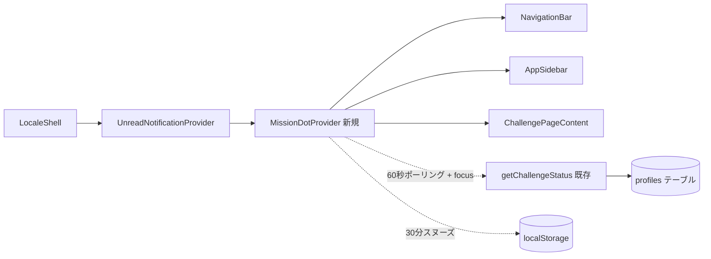
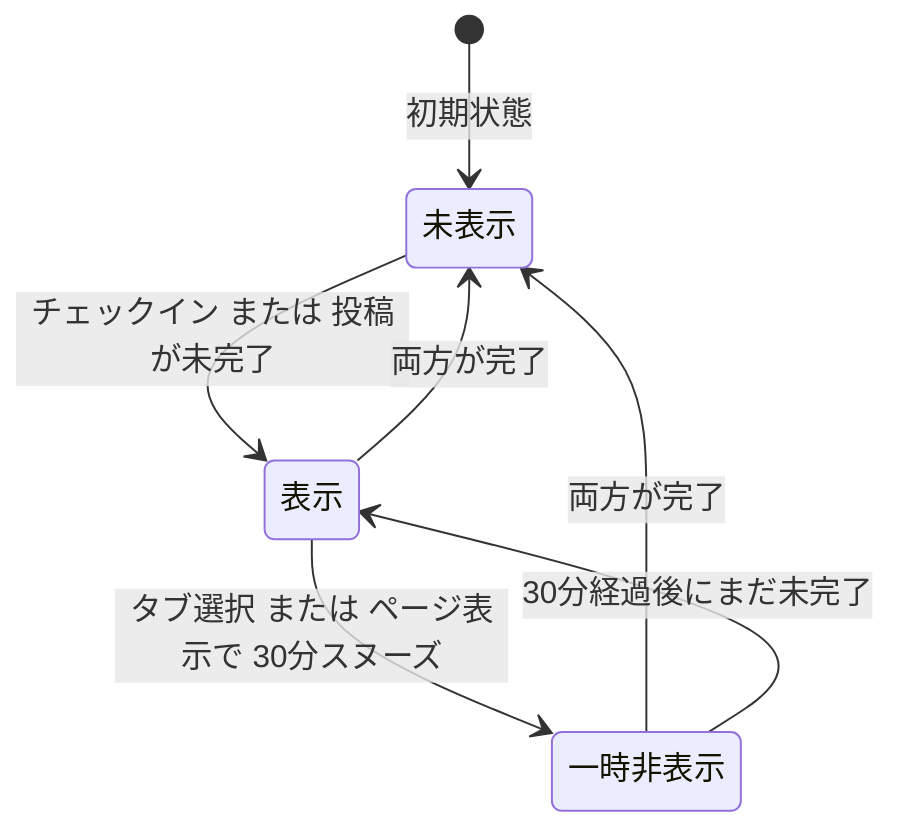
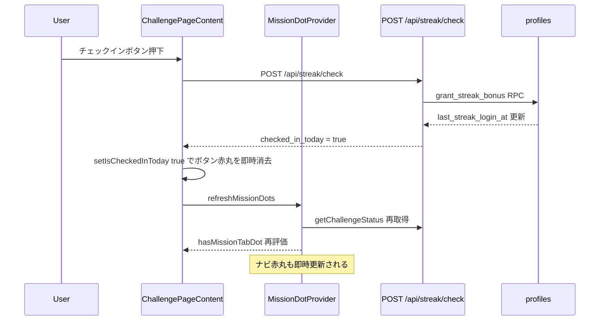
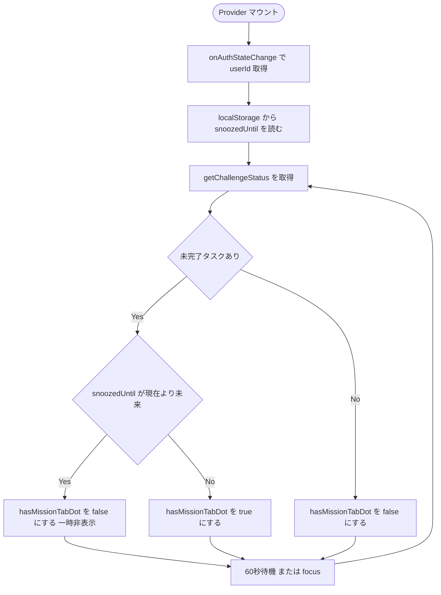
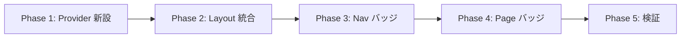

# ミッションページ赤丸バッジ機能 実装計画（事後ドキュメント）

作成日: 2026-04-28
ブランチ: `feature/mission-page-badge`
ステータス: 実装完了（変更ファイル起因の新規エラーなしを確認）

> 本ドキュメントは既に完了した実装の事後記録である。今後同種のバッジを追加する際の参照、または挙動仕様の正典として用いる。

---

## 概要

「お知らせ」アイコンの赤丸バッジと同様の挙動で、ミッション関連の3箇所に赤丸バッジを追加する。

### 追加場所

1. **ミッションタブ**: モバイル下部ナビ（`NavigationBar`）+ PC サイドバー（`AppSidebar`）の「ミッション」アイコン右上
2. **チェックインボタン**: ミッションページ（`/challenge`）のチェックインボタン右上
3. **デイリー投稿ボーナスカード**: 同ページの「投稿でボーナス獲得」ステータスカード右上

### バッジ挙動の要約

| 箇所 | 表示条件 | 消失条件 | スヌーズ |
|------|----------|----------|----------|
| ミッションタブ | 今日未チェックイン または 今日未デイリー投稿 | 両方とも完了 | タブ選択 / `/challenge` 表示で **30分の楽観的スヌーズ**。30分後に未完了ならば再表示 |
| チェックインボタン | 今日未チェックイン | チェックイン押下で即時消失（楽観的更新） | なし |
| デイリー投稿ボーナス | 今日未デイリー投稿 | 当日のボーナス対象投稿で消失 | なし |

ナビの赤丸スタイルは既存のお知らせ赤丸と同一（`bg-red-500` / `h-2.5 w-2.5`）。ページ内のチェックインボタンとデイリー投稿ステータスカードは、ストリークグリッドの次アクション表示と同じ `animate-ping` 付きの二重丸 UI を赤色で使う。デイリー投稿の未完了状態は、否定的な `XCircle` ではなく `ImagePlus` とブルー系カードで「投稿すれば獲得できる」状態として表現する。

---

## コードベース調査結果

### 参考にした既存実装

| レイヤー | ファイル | 役割 |
|----------|---------|------|
| 既存赤丸の Provider | [features/notifications/components/UnreadNotificationProvider.tsx](../../features/notifications/components/UnreadNotificationProvider.tsx) | 60秒ポーリング + window focus + auth state change で `hasSidebarDot` を提供 |
| 既存赤丸描画（モバイル） | [components/NavigationBar.tsx:185-187](../../components/NavigationBar.tsx) | `Bell` アイコン右上に `absolute -top-1 -right-1 h-2.5 w-2.5 rounded-full bg-red-500` |
| 既存赤丸描画（PC） | [components/AppSidebar.tsx:216-218](../../components/AppSidebar.tsx) | 同上 |
| 既存スヌーズ／既読パターン | `markAnnouncementSeen("page" \| "tab")` | DB（`profiles.announcements_*_seen_at`）に永続化、サーバ判定 |

### 流用した既存資産

| 資産 | 用途 |
|------|------|
| `profiles.last_streak_login_at`（カラム） | チェックインの最終 JST 日時 |
| `profiles.last_daily_post_bonus_at`（カラム） | デイリー投稿ボーナスの最終 JST 日時 |
| [getChallengeStatus()](../../features/challenges/lib/api.ts) | `streakDays` / `lastStreakLoginAt` / `lastDailyPostBonusAt` / `subscriptionPlan` を返すクライアント API |
| [onAuthStateChange()](../../features/auth/lib/auth-client.ts) | ユーザー識別と auth 状態購読 |
| [getJstDateString() / isSameJstDate() / isSameJstDateString()](../../features/challenges/lib/streak-utils.ts) | JST 日付の文字列比較を共通化 |

### 影響範囲

- `LocaleShell` に新規 Provider を追加
- `NavigationBar` / `AppSidebar` に Mission タブ赤丸描画とスヌーズ呼び出しを追加
- `ChallengePage` から初期表示用の JST 日付文字列を渡し、ハイドレーション前後の初期判定を安定化
- `ChallengePageContent` にボタン / カード右上の赤丸を追加、ページ表示時とチェックイン成功時に Provider と通信
- DB スキーマ変更なし
- API 新設なし

---

## 概要図

### コンポーネント構成



### ミッションタブ赤丸の状態遷移



### 同期シーケンス（チェックイン時）



### 60秒ポーリングフロー



---

## EARS 要件定義

### イベント駆動

- **EARS-01 (en)**: When the user has not yet checked in for the current JST date, the system shall display a red dot badge on the mission tab in both the mobile bottom navigation and the PC sidebar.
- **EARS-01 (ja)**: ユーザーが当日（JST）チェックイン未完了であるとき、システムはモバイル下部ナビと PC サイドバー双方のミッションタブに赤丸バッジを表示する。

- **EARS-02 (en)**: When the user has not yet earned today's daily post bonus, the system shall display the same red dot on the mission tab.
- **EARS-02 (ja)**: ユーザーが当日のデイリー投稿ボーナスを未獲得であるとき、システムはミッションタブに同じ赤丸を表示する。

- **EARS-03 (en)**: When the user taps the mission tab in either navigation, including re-selecting it while already on `/challenge`, the system shall persist a snooze timestamp (now + 30 minutes) in `localStorage` and immediately hide the tab badge.
- **EARS-03 (ja)**: ユーザーがいずれかのナビでミッションタブを選択したとき（既に `/challenge` 表示中の再選択を含む）、システムは `localStorage` にスヌーズ時刻（現在時刻 + 30分）を永続化し、ナビのバッジを即時非表示にする。

- **EARS-04 (en)**: When the user navigates to `/challenge` by any means (deep link, URL, navigation), the system shall apply the same 30-minute snooze on mount.
- **EARS-04 (ja)**: ユーザーが `/challenge` に遷移した時点で（手段を問わず）、システムは同様の 30分スヌーズをマウント時に適用する。

- **EARS-05 (en)**: When 30 minutes have elapsed since the last snooze and the underlying tasks remain incomplete, the system shall re-display the mission tab badge on the next polling tick or window focus.
- **EARS-05 (ja)**: スヌーズから 30分経過し、かつ未完了タスクが残存しているとき、システムは次のポーリングまたはウィンドウフォーカスでバッジを再表示する。

- **EARS-06 (en)**: When the user successfully checks in, the system shall hide the check-in button red dot immediately and refresh the mission tab badge state via `refreshMissionDots()`.
- **EARS-06 (ja)**: チェックインに成功したとき、システムはチェックインボタンの赤丸を即時非表示にし、`refreshMissionDots()` でナビのバッジ状態を再評価する。

- **EARS-07 (en)**: When the user successfully creates a bonus-eligible post, the system shall hide the daily post bonus red dot on the mission page when `MissionDotProvider` refreshes challenge status (mount, 60-second polling, or window focus).
- **EARS-07 (ja)**: ユーザーがボーナス対象投稿を完了したとき、システムは `MissionDotProvider` のチャレンジ状態更新（マウント／60秒ポーリング／ウィンドウフォーカス）でデイリー投稿ボーナスの赤丸を非表示にする。

### 状態駆動

- **EARS-08 (en)**: While the user is not authenticated, the system shall display none of the mission badges.
- **EARS-08 (ja)**: ユーザーが未ログインの間、システムはミッション関連の赤丸を一切表示しない。

- **EARS-09 (en)**: While `getChallengeStatus()` has not yet completed its first fetch, the system shall not display any mission badge to avoid false positives.
- **EARS-09 (ja)**: `getChallengeStatus()` の初回取得完了前は、誤表示を避けるためシステムはバッジを表示しない。

### 異常系

- **EARS-10 (en)**: If `getChallengeStatus()` fails (network error or API failure), the system shall log the error and retain the previous badge state without crashing.
- **EARS-10 (ja)**: `getChallengeStatus()` が失敗した場合、システムはエラーをログ出力し、直前のバッジ状態を維持して落ちない。

- **EARS-11 (en)**: If `localStorage` is unavailable (e.g., private mode), the system shall degrade gracefully — snooze remains effective in React state for the current session, but it is not persisted across reloads.
- **EARS-11 (ja)**: `localStorage` が利用不可の環境では、スヌーズはセッション内の React state のみで動作する形に縮退し、リロードでスヌーズが消える挙動になる（クラッシュしない）。

### オプション／スコープ外

- **EARS-12 (en)**: Where future tasks (additional missions) need badges, this provider can be extended by adding new derived flags without DB schema changes.
- **EARS-12 (ja)**: 今後追加されるミッションバッジは、本 Provider に派生フラグを追加することで DB 変更なしに拡張できる設計とする。

---

## ADR（設計判断記録）

### ADR-001: DB カラムを追加せず既存タイムスタンプから派生計算する

- **Context**: 「お知らせ」赤丸は `profiles.announcements_tab_seen_at` 等の seen_at カラムを追加して管理しているが、今回のミッションバッジはタスク完了型である。
- **Decision**: 新規 DB カラムを追加せず、既存の `profiles.last_streak_login_at` / `profiles.last_daily_post_bonus_at` から JST 日付比較で派生計算する。
- **Reason**:
  - チェックイン／デイリー投稿は「当日完了したか」が真の判定軸であり、`last_*_at` カラムから決定的に判定できる
  - seen_at カラムを追加するとマイグレーション・RLS・型定義の更新が必要になり、MVP のコストに見合わない
- **Consequence**:
  - DB スキーマ変更ゼロ。リバートはコード revert のみで完了
  - 一方で「ユーザーがバッジを見たかどうか」を端末横断で記録できないため、スヌーズはローカル限定（→ ADR-002）

### ADR-002: スヌーズを localStorage（端末ローカル）に保存する

- **Context**: 楽観的更新（タップで一旦消す）と「30分後に再表示」を両立させる仕組みが必要。
- **Decision**: スヌーズ時刻を `localStorage` の `missionTabDot:snoozedUntil:<userId>` キーに保存する。TTL は 30分。
- **Reason**:
  - サーバ往復不要で UI 応答が即時
  - 端末別のリマインドで十分（同じユーザーが別端末で見たかどうかを共有する強い必要性はない）
  - DB 変更不要で MVP に適合
- **Consequence**:
  - 別端末で同じユーザーが操作してもスヌーズは共有されない（許容範囲）
  - プライベートブラウジングでは `localStorage` が利用不可の場合があるが、その場合は React state のみでセッション内動作する（EARS-11）

### ADR-003: `UnreadNotificationProvider` と独立した `MissionDotProvider` を新設する

- **Context**: 既存の `UnreadNotificationProvider` に追加することも可能だが、責務が「お知らせ・通知の未読」と「ミッション完了状態」で異なる。
- **Decision**: 別 Provider として `MissionDotProvider` を新設し、`LocaleShell` で並列にラップする。
- **Reason**:
  - 責務分離（通知未読 vs タスク完了）
  - 将来的に Provider のキャッシュ戦略やポーリング間隔を独立に最適化できる
  - 単一 Provider に詰め込むと state や useEffect が肥大化し可読性が落ちる
- **Consequence**:
  - `MissionDotProvider` は `onAuthStateChange()` の初期セッション通知を使い、マウント時の `getCurrentUser()` 追加呼び出しを避ける

### ADR-004: スヌーズの TTL を 30分とする

- **Context**: タップで即消えるが時間が経つと再表示される、という挙動の TTL 値を決める必要がある。
- **Decision**: 30分。
- **Reason**:
  - 短すぎる（5〜10分）: 「消したのにすぐ戻る」と感じる
  - 長すぎる（1時間〜半日）: リマインドとして機能しない
  - モバイルゲームのデイリーミッション再表示の体感に合わせ、ユーザーが他の操作を一通り終えるくらいの時間（30分）が妥当
- **Consequence**: 仕様の運用に合わせて将来調整可能。`MissionDotProvider.tsx` の `SNOOZE_TTL_MS` を変更するだけで完結。

### ADR-005: ボタン／カード上の赤丸はスヌーズしない

- **Context**: ナビのタブ赤丸はスヌーズするが、ページ内のボタン／カード上の赤丸もスヌーズすべきか検討。
- **Decision**: ページ内のボタン／カード上の赤丸はスヌーズせず、状態に応じて即時に表示／非表示にする。
- **Reason**:
  - ページ内の赤丸は「アクションが必要」であることを視覚的に示す UI 要素
  - スヌーズすると「未完了なのに表示されない」期間が発生し、行動を促す目的に反する
  - ナビの赤丸はグローバルな注意喚起なのでスヌーズが有効、ページ内は局所的な指示なのでスヌーズ不要
- **Consequence**: ページ内の赤丸は `isCheckedInToday` / `isDailyBonusReceived` という既存ローカル state から直接導出し、Provider 経由しない。挙動が局所的・即時的になる。

---

## フェーズ別実装計画（実施済）

### フェーズ間の依存関係



### Phase 1: `MissionDotProvider` 新設

**目的**: `getChallengeStatus()` をポーリングし、3つのバッジ判定値とスヌーズ操作を Context で提供する。

**ビルド確認**: 単独でも tsc が通り、未使用 export のみで影響を出さない状態。

- [x] [features/challenges/components/MissionDotProvider.tsx](../../features/challenges/components/MissionDotProvider.tsx) 新規作成
  - `SNOOZE_KEY_PREFIX = "missionTabDot:snoozedUntil:"`、`SNOOZE_TTL_MS = 30 * 60 * 1000`、`POLL_INTERVAL_MS = 60_000`
  - `currentUserId` / `status` / `snoozedUntil` / `now` を state 管理
  - `fetchStatus(userId)` / `refreshMissionDots()` / `markMissionTabSnoozed()` を実装
  - `useEffect` で `onAuthStateChange` を購読し、初期セッション通知から `userId` を取得
  - `useEffect` で 60秒 `setInterval` + `window.focus` リスナで再取得
  - `useMemo` で `hasMissionTabDot` / `hasCheckInDot` / `hasDailyPostDot` を派生
  - `status === null` または `currentUserId === null` の間は全て `false`（誤表示防止 / EARS-09）

### Phase 2: Layout 統合

**目的**: アプリ全体に Provider を行き渡らせる。

**ビルド確認**: アプリ起動時にエラーが出ない。

- [x] [components/LocaleShell.tsx](../../components/LocaleShell.tsx) 修正
  - `MissionDotProvider` を import
  - `UnreadNotificationProvider` の内側で `MissionDotProvider` を使い `appContent` を包む

### Phase 3: ナビゲーションバッジ

**目的**: モバイル下部ナビと PC サイドバーの「ミッション」アイコン右上に赤丸を出し、タブ選択でスヌーズを発火する。

**ビルド確認**: `/challenge` 以外のページからナビをクリックしてもエラーが出ない。

- [x] [components/NavigationBar.tsx](../../components/NavigationBar.tsx) 修正
  - `useMissionDots()` から `hasMissionTabDot` / `markMissionTabSnoozed` を取得
  - `handleNavigation` 内で `normalizedTargetPath === "/challenge"` のとき `markMissionTabSnoozed()` を呼ぶ（既に `/challenge` 表示中の再選択を含む）
  - アイコン描画箇所で `path === "/challenge" && hasMissionTabDot` のとき既存お知らせ赤丸と同形の `<span>` を描画
- [x] [components/AppSidebar.tsx](../../components/AppSidebar.tsx) 修正
  - 同上（PC サイドバー）

### Phase 4: ページ内バッジとスヌーズ連携

**目的**: チェックインボタン右上と「投稿でボーナス獲得」ステータスカード右上に赤いパルスバッジを出す。`/challenge` 表示時に Provider をスヌーズし、チェックイン成功時に Provider を再評価する。

**ビルド確認**: `/challenge` を開き、チェックイン押下で 200 OK が返り、ボタン赤丸が即時消える。

- [x] [features/challenges/components/ChallengePageContent.tsx](../../features/challenges/components/ChallengePageContent.tsx) 修正
  - `useMissionDots()` から `refreshMissionDots` / `markMissionTabSnoozed` を取得
  - `useEffect(() => { markMissionTabSnoozed(); }, [markMissionTabSnoozed])` でマウント時にスヌーズ（EARS-04）
  - チェックインボタンを `<div className="relative inline-flex">` で包み、`!isCheckedInToday && !isCheckingIn` のとき右上に赤色の `RedPulseDot`（`animate-ping` 付き二重丸）を描画
  - 「投稿でボーナス獲得」ステータスカードのラッパに `relative` を付与し、`!isDailyBonusReceived` のとき右上に同じ `RedPulseDot` を描画
  - 未完了カードは `ImagePlus` アイコンとブルー系配色で、否定ではなく行動可能な状態として表示
  - 初期表示ではサーバー側で作成した `initialJstDateString` を使い、クライアントの現在時刻に依存した hydration 差分を避ける
  - `handleCheckIn` 成功時に、付与額の有無に関係なく `await refreshMissionDots()` を呼ぶ
  - ページ側は独自の `getChallengeStatus()` ポーリングを持たず、`MissionDotProvider` の `missionStatus` / 派生フラグを購読してローカル state を同期

### Phase 5: 検証

**目的**: 既存テスト・型・lint・ビルドの回帰がないことを確認する。

- [x] `npm run lint` 実行 — ベースライン同数（22 errors / 53 warnings）、変更ファイル新規エラー 0件
- [x] `npm run typecheck` 実行 — ベースライン同数（295 errors）、変更ファイル新規エラー 0件
- [x] `npm run test` 実行 — 102 suites / 869 tests pass
- [x] `npm run build -- --webpack` 実行 — Compiled with warnings（プリレンダー失敗は `.env` 不在による既存環境エラー）

---

## 修正対象ファイル一覧

| ファイル | 操作 | 変更内容 |
|----------|------|----------|
| `app/(app)/challenge/page.tsx` | 修正 | 初期表示用 JST 日付文字列を `CachedChallengePageContent` へ渡す |
| `features/challenges/components/CachedChallengePageContent.tsx` | 修正 | `initialJstDateString` を `ChallengePageContent` へ中継 |
| `features/challenges/components/MissionDotProvider.tsx` | 新規 | バッジ状態 Context、60秒ポーリング、localStorage スヌーズ |
| `features/challenges/lib/streak-utils.ts` | 修正 | JST 日付比較ヘルパー `isSameJstDate()` / `isSameJstDateString()` を追加 |
| `components/LocaleShell.tsx` | 修正 | `MissionDotProvider` で全画面ラップ |
| `components/NavigationBar.tsx` | 修正 | モバイル下部ナビのミッションタブに赤丸 + スヌーズ呼び出し |
| `components/AppSidebar.tsx` | 修正 | PC サイドバーのミッションタブに赤丸 + スヌーズ呼び出し |
| `features/challenges/components/ChallengePageContent.tsx` | 修正 | チェックインボタン / デイリー投稿ステータスカード右上に赤いパルスバッジ、ページ表示時スヌーズ、チェックイン成功時 refresh |
| `messages/ja.ts` | 修正 | デイリー投稿未完了状態の文言を前向きな表現へ変更 |
| `messages/en.ts` | 修正 | デイリー投稿未完了状態の英語文言を前向きな表現へ変更 |

合計: 新規 1 / 修正 9。DB マイグレーション・API ルート・i18n キー追加なし（既存キーの文言変更あり）。

---

## 品質・テスト観点

### 品質チェックリスト

- [x] **エラーハンドリング**: `getChallengeStatus()` 失敗時は `console.error` でログ出力し、直前 state を維持（EARS-10）
- [x] **権限制御**: 未ログイン時は全バッジ非表示（EARS-08）。Provider 内で `currentUserId === null` を gate
- [x] **データ整合性**: JST 比較は既存 `streak-utils.ts` と同じロジック（`Intl.DateTimeFormat ja-JP, Asia/Tokyo`）
- [x] **セキュリティ**: localStorage の値はユーザー識別子付きキー（`missionTabDot:snoozedUntil:<userId>`）。サーバ送信なし
- [x] **i18n**: 文言追加なし（純粋な視覚要素のみ）

### テスト観点

| カテゴリ | テスト内容 | 確認方法 |
|----------|-----------|----------|
| 正常系 | 未チェックイン状態でログイン → ナビ・ページ・カードに赤丸 | dev サーバ手動検証 |
| 正常系 | チェックイン押下 → ボタン赤丸即時消失 → ナビ赤丸（投稿が未完了なら残る） | dev サーバ手動検証 |
| 正常系 | デイリー投稿完了 → カード赤丸消失（Provider mount / 60秒ポーリング / フォーカス） | dev サーバ手動検証 |
| 正常系 | ナビのミッションタブ選択 → ナビ赤丸即時消失 → 30分後復活 | localStorage 直接編集で短縮検証 |
| 正常系 | `/challenge` URL 直アクセス → ナビ赤丸消失 | dev サーバ手動検証 |
| 異常系 | `getChallengeStatus()` ネットワーク失敗 → クラッシュなし、前回値保持 | DevTools の network throttle |
| 異常系 | localStorage 不可（プライベートブラウジング） → スヌーズはセッション内 React state のみで動作 | プライベートウィンドウで検証 |
| 権限 | 未ログイン状態 → 全バッジ非表示 | ログアウト状態で検証 |
| 権限 | アカウント切替 → 別ユーザーのスヌーズが影響しない | userId プレフィックス付きキーにより自動分離 |
| 回帰 | 既存「お知らせ」赤丸の挙動が変わらない | 通知が来た状態で確認 |

### 推奨される将来のテスト追加

本実装はユニットテストを追加していない（時間効率優先の MVP）。今後追加するなら以下を想定:

- `MissionDotProvider` のユニットテスト
  - 未ログインで全 false
  - status 取得後、未完了 → `hasMissionTabDot = true`
  - `markMissionTabSnoozed()` 呼び出し後、`hasMissionTabDot = false`
  - スヌーズから 30分経過後、再度 true
  - `localStorage` 不可環境で例外を投げない
- `NavigationBar` / `AppSidebar` の描画テスト
  - `hasMissionTabDot = true` で `<span class="...bg-red-500">` が `path === "/challenge"` のアイコンに描画される
- `ChallengePageContent` のテスト
  - `markMissionTabSnoozed()` がマウント時に呼ばれる
  - チェックイン成功時に `refreshMissionDots()` が呼ばれる

---

## ロールバック方針

- **DB 変更なし**: マイグレーション不要。データロールバック作業ゼロ
- **コード revert のみで完全復旧**: `git revert <merge-commit>` でこの機能の全削除が可能
- **段階的撤退**:
  - ナビバッジのみ残し、ページバッジを外したい → `ChallengePageContent` の赤丸 `<span>` 2 箇所と `useEffect(markMissionTabSnoozed)` を削除
  - 機能丸ごと無効化したい → `LocaleShell` の `<MissionDotProvider>` ラップを外す。子コンポーネント側の `useMissionDots()` が throw するため、各使用箇所も削除する必要あり
- **localStorage の残留**: 機能撤退時は `missionTabDot:snoozedUntil:*` キーが端末に残るが、害はなし。気になる場合はコード側で `localStorage.removeItem` を一度だけ走らせる migration を入れる

---

## 既知の制約と将来の改善余地

| 項目 | 現状 | 将来の改善案 |
|------|------|-------------|
| ポーリング間隔 | 60秒固定 | 必要に応じて Supabase Realtime チャンネルで `profiles` 行更新を購読し即時化 |
| スヌーズの端末横断共有 | localStorage（端末ローカル） | `profiles.mission_tab_snoozed_until` カラムを追加して DB 共有化 |
| TTL の調整 | コード定数 | 管理画面 / Remote Config から動的に変更可能にする |
| バッジ位置のオフセット | `-top-1 -right-1` 固定 | アイコンサイズに応じて自動調整するユーティリティに切り出す |
| デイリー投稿バッジの即時消去 | 投稿成功画面からミッションページ側へ直接イベント通知していないため、ミッションページ表示中は次の 60秒ポーリングまたはフォーカスまで残る場合がある | 投稿成功時に Provider / ページ state を即時更新するイベント経路を追加 |

---

## 使用スキル

| スキル | 用途 | フェーズ |
|--------|------|----------|
| 既存実装調査（Explore agent） | お知らせバッジ仕組みの解析 | 設計初期 |
| 既存実装調査（Explore agent） | mission/checkin/post 構造の把握 | 設計中期 |
| `codex-webpack-build` | サンドボックスビルドの注意（`--webpack` 必須） | Phase 5 |
| `git-create-pr` | 実装完了時の PR 作成（必要時に呼び出す） | リリース時 |

---

## 検証ログ

```
$ npm run lint   → 22 errors / 53 warnings（ベースラインと同数、新規エラー 0）
$ npm run typecheck → 295 errors（ベースラインと同数、新規エラー 0）
$ npm run test → Test Suites: 102 passed, Tests: 869 passed
$ npm run build -- --webpack → ✓ Compiled with warnings in 8.2s（プリレンダーは .env 不在の既存問題）
```

新規 / 変更ファイルからの lint・typecheck エラー: **0件**。
