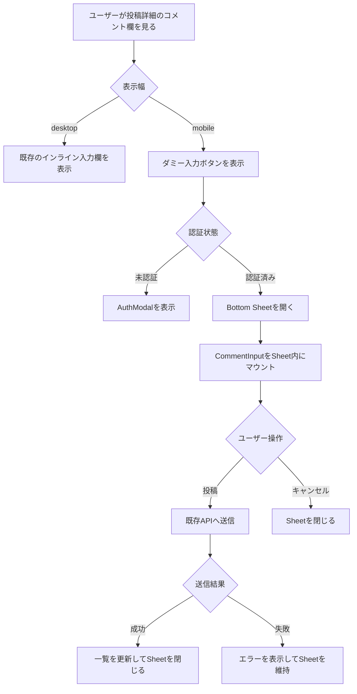
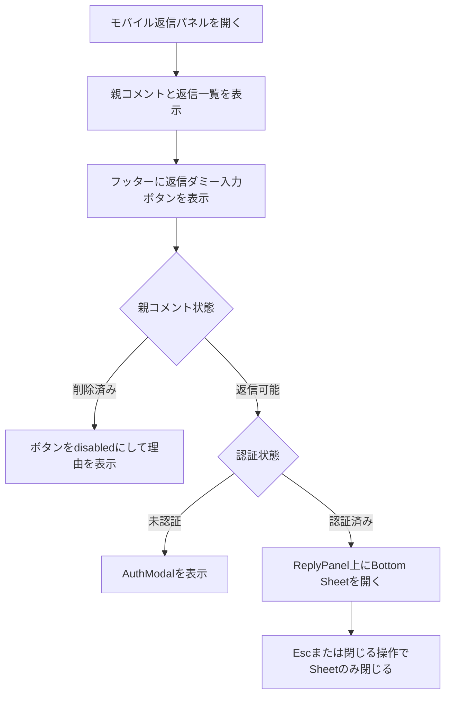
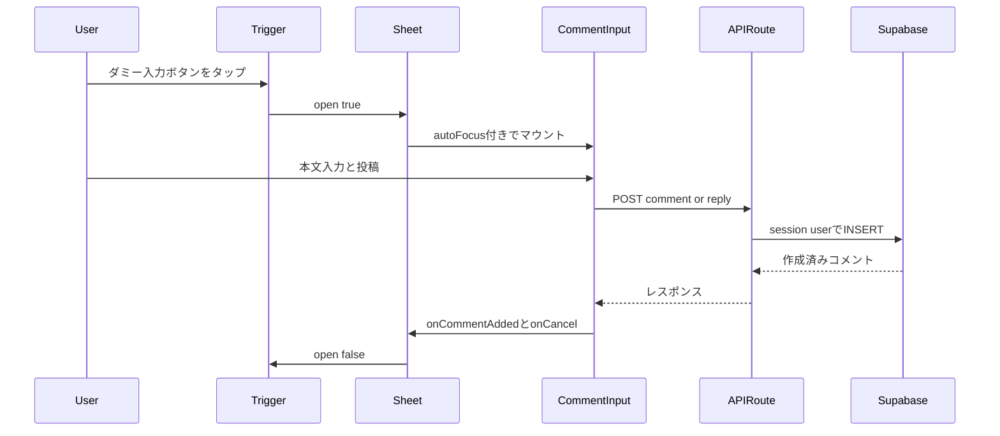

# モバイルコメント入力 Bottom Sheet 実装計画

作成日: 2026-04-28

## コードベース調査結果

### 調査サマリ

この機能は投稿詳細画面のモバイル UI 変更であり、DB スキーマ、RLS、API Route の追加変更は不要。Supabase 接続確認は不要と判断した。既存のコメント投稿と返信投稿は現在の API と server-api をそのまま使う。

| 領域 | 調査対象 | 結果 |
|---|---|---|
| 既存入力 UI | `features/posts/components/CommentInput.tsx` | 認証ガード、AuthModal、`redirectTo={pathname}`、サニタイズ、バリデーション、文字数表示、submit/cancel、`autoFocus`、`disabled` 対応が実装済み |
| コメントセクション | `features/posts/components/CommentSection.tsx` | トップレベルの `CommentInput` と `CommentList` を描画。コメント追加時は `CommentListRef.refresh()` を呼ぶ |
| モバイル返信パネル | `features/posts/components/ReplyPanel.tsx` | `md:hidden` の Radix Dialog。フッターに返信用 `CommentInput` を置いている。削除済み親コメントでは `disabled` と `disabledMessage` を渡す |
| PC 返信フォーム | `features/posts/components/ReplyThread.tsx` | PC 用インライン返信フォーム。今回の対象外 |
| Sheet UI | `components/ui/sheet.tsx` | shadcn/ui の Radix Dialog ベース。`side="bottom"` が存在するが、content の padding は呼び出し側で指定が必要 |
| AuthModal | `features/auth/components/AuthModal.tsx` | `redirectTo` 未指定時は `/`。新 Trigger 側でも `usePathname()` で現在パスを渡す必要がある |
| コメント投稿 API | `features/posts/lib/api.ts`, `app/api/posts/[id]/comments/route.ts` | クライアントは `{ content }` のみ送信。API は `getUser()` から user_id を解決し、サーバー側でも validation する |
| 返信投稿 API | `features/posts/lib/api.ts`, `app/api/comments/[id]/replies/route.ts` | クライアントは `{ content }` のみ送信。API は親コメント ID と session user から返信を作成する |
| データ方針 | `docs/architecture/data.ja.md` | コメントの親子構造と通知、`last_activity_at` 等は既存の route handler と DB trigger に集約済み |
| Product 要件 | `docs/product/requirements.md` | コメントは詳細画面のみ表示、投稿は認証必須 |
| 開発規約 | `docs/development/project-conventions.md` | モバイルファースト、44px 以上の touch target、固定 UI は safe area とキーボード重なりに注意 |
| アニメーション | `app/globals.css` | `ReplyPanel` は scoped keyframes で実装済み。`tw-animate-css` は未導入 |
| E2E 設定 | `playwright.config.ts` | 現在は Desktop Chrome 系のみ。`devices["iPhone 13"]` project は存在しない |
| i18n | `messages/ja.ts`, `messages/en.ts` | 既存の `commentPlaceholder`, `replyPlaceholder`, `commentSubmit`, `replySubmit`, `cancel` は再利用できるが、Sheet title 用の `commentSheetTitle` / `replySheetTitle` は未定義のため追加する |

### 既存挙動で維持する点

- PC 幅は `CommentInput` をインライン表示し、投稿成功時に `CommentListRef.refresh()` を呼ぶ。
- `ReplyThread.tsx` の PC 用インライン返信フォームは変更しない。
- コメントと返信の API payload は `content` のみとし、`user_id` はサーバー側 session から解決する。
- `CommentInput.tsx` は既存ロジックを原則変更しない。新規 wrapper 側で認証分岐と Sheet 開閉を担当する。

### 前回レビューから反映する修正方針

- 未認証時の Trigger は `AuthModal` に `redirectTo={pathname}` を必ず渡す。
- Playwright のモバイル E2E は、現行 config に `iPhone 13` project がない前提で計画する。自動化する場合は mobile project を追加するか、spec 側の `test.use` と auth setup の依存関係を明示する。
- Sheet content は `max-h` だけにせず、`px`, `pt`, `pb`, `overflow-y-auto`, `safe-area-inset-bottom` を明示する。
- `tw-animate-css` は導入しない。必要な motion は `app/globals.css` に scoped class と keyframes を追加する。既存 `replyPanelSlideIn` は横方向のため流用せず、Bottom Sheet 用の縦スライド keyframes を新規追加する。
- CSS ブレークポイント分岐では hidden 側も React tree に mount されるため、「完全な二重生成回避」とは書かない。Sheet 内の `CommentInput` は `open` 時だけ mount する。
- Sheet title は既存 placeholder や submit label を流用せず、`commentSheetTitle` と `replySheetTitle` の i18n key を追加する。
- Sheet close は `CommentInput` の成功時 `onCancel` 呼び出しだけに依存せず、`CommentComposerSheet` 側で `onCommentAdded` を decorate して明示的に閉じる。`onCancel` でも閉じるため、二重 close は no-op として扱う。
- ReplyPanel 上の nested Sheet は z-index、Esc、body scroll lock、safe area の重なりを browser verification の明示チェック項目にする。
- iOS Safari のキーボード対応は初期実装では CSS `dvh` と scroll で対応し、崩れが確認された場合のみ Sheet 専用の `visualViewport` 制御を追加する。

---

## 1. 概要図

### モバイル入力フロー



### 返信パネル内のネストフロー



### 投稿シーケンス



---

## 2. EARS 要件定義

| ID | Type | Spec EN | Spec JA |
|---|---|---|---|
| MCS-01 | State | While the viewport is mobile width, the system shall show a lightweight comment composer trigger instead of the visible inline textarea for top-level comments. | モバイル幅の間、システムはトップレベルコメントに表示上のインライン textarea ではなく軽量なコメント入力トリガーを表示する。 |
| MCS-02 | State | While the viewport is desktop width, the system shall preserve the existing inline `CommentInput` behavior for top-level comments. | デスクトップ幅の間、システムはトップレベルコメントの既存インライン `CommentInput` 挙動を維持する。 |
| MCS-03 | Event | When an authenticated mobile user taps the comment trigger, the system shall open a bottom sheet and mount `CommentInput` with `autoFocus`. | 認証済みモバイルユーザーがコメントトリガーをタップした時、システムは Bottom Sheet を開き、`autoFocus` 付きで `CommentInput` をマウントする。 |
| MCS-04 | Event | When an unauthenticated mobile user taps the trigger, the system shall open `AuthModal` with the current pathname as `redirectTo` and shall not open the sheet. | 未認証モバイルユーザーがトリガーをタップした時、システムは現在パスを `redirectTo` として `AuthModal` を開き、Sheet は開かない。 |
| MCS-05 | Event | When comment submission succeeds from the sheet, the system shall refresh the existing comment list and close the sheet. | Sheet からのコメント投稿が成功した時、システムは既存コメント一覧を更新し、Sheet を閉じる。 |
| MCS-06 | Event | When reply submission succeeds from the nested sheet, the system shall refresh replies and parent thread state using the existing `ReplyPanel` callbacks and close only the sheet. | ネストした Sheet から返信投稿が成功した時、システムは既存 `ReplyPanel` コールバックで返信と親スレッド状態を更新し、Sheet のみを閉じる。 |
| MCS-07 | State | While the parent comment is deleted, the reply trigger shall be disabled and shall show the existing disabled message. | 親コメントが削除済みの間、返信トリガーは disabled になり、既存の disabled message を表示する。 |
| MCS-08 | Event | When the user presses Escape or taps the sheet close control, the system shall close the sheet without closing the underlying reply panel. | ユーザーが Esc または Sheet の閉じる操作を行った時、システムは背後の返信パネルを閉じずに Sheet だけを閉じる。 |
| MCS-09 | State | While the sheet is open on mobile browsers, the system shall keep input controls reachable above safe area and support scrolling when the keyboard reduces available height. | モバイルブラウザで Sheet が開いている間、システムは入力操作部を safe area の上で操作可能に保ち、キーボードで利用可能高が減った場合もスクロールできるようにする。 |
| MCS-10 | Abnormal | If submission validation or the API request fails, the system shall keep the sheet open and display the existing validation or toast error. | 入力検証または API リクエストが失敗した場合、システムは Sheet を開いたままにし、既存の validation または toast error を表示する。 |

---

## 3. ADR 設計判断記録

### ADR-01: モバイル判定は CSS ブレークポイントで行う

- 決定: `md:hidden` と `hidden md:block` でモバイル表示と PC 表示を分岐する。
- 理由: `useMediaQuery` を新規導入せず、SSR と hydration のズレを避ける。
- 注意: CSS hidden 側も React tree には mount される。計画上の目的は「表示されるモバイル入力を Sheet 化すること」であり、完全な DOM 生成抑制ではない。

### ADR-02: 既存 `CommentInput` は変更せず wrapper で Sheet 化する

- 決定: `CommentInput.tsx` の認証、validation、API 呼び出し、toast、文字数表示、disabled の実装を流用する。
- 理由: コメント投稿の重要ロジックを複製しない。
- 実装ルール: `CommentComposerSheet` は `open` が true の時だけ `CommentInput` を children として描画する。

### ADR-03: 未認証分岐は Trigger 側に移す

- 決定: `CommentComposerTrigger` が `currentUserId` を見て、未認証なら `AuthModal` を開き、Sheet は開かない。
- 理由: Sheet 内 textarea の autoFocus と AuthModal が同時に出るネスト状態を避ける。
- 必須条件: 既存 `CommentInput` と同じく `usePathname()` で現在パスを取得し、`AuthModal` に `redirectTo={pathname}` を渡す。

### ADR-04: Bottom Sheet は既存 shadcn/ui Sheet を使う

- 決定: `components/ui/sheet.tsx` の `Sheet`, `SheetContent`, `SheetHeader`, `SheetTitle` を使う。
- 理由: Radix Dialog の focus trap、Esc、Portal、overlay を利用できる。
- 実装ルール: `SheetContent` は `side="bottom"`、`showCloseButton={false}` とし、ローカライズ済みの close button を header に置く。

### ADR-05: アニメーションは scoped CSS で追加する

- 決定: `tw-animate-css` は導入せず、`app/globals.css` に `.comment-composer-sheet-content[data-state="open"]` 向けの縦スライド keyframes を追加する。
- 理由: `tw-animate-css` 導入は既存 Dialog、Dropdown、Toast など広範囲の見た目を変える可能性がある。
- 参考: `ReplyPanel` の `.reply-panel-mobile-content` と `prefers-reduced-motion` 対応。ただし `replyPanelSlideIn` は `translate3d(40px, 0, 0)` の横スライドなので流用しない。
- 実装ルール: `commentComposerSheetSlideIn` などの新規 keyframes を作り、`translate3d(0, 100%, 0)` から `translate3d(0, 0, 0)` へ動かす。

### ADR-06: E2E は現行 Playwright 設定を明示的に補う

- 決定: 自動 E2E を追加する場合、`playwright.config.ts` に mobile project を追加するか、spec-local の `test.use` と auth setup dependency を明示する。
- 理由: 現行 config には `devices["iPhone 13"]` project がなく、認証済み mobile spec は storageState 生成順序も考慮する必要がある。

### ADR-07: Sheet close は wrapper 側で明示する

- 決定: `CommentComposerSheet` は `onCommentAdded` を decorate して、既存 callback 実行後に `onOpenChange(false)` を呼ぶ。
- 理由: `CommentInput` は現在 submit 成功時に `onCancel?.()` も呼ぶが、その暗黙仕様だけに Sheet close を依存しない。
- 実装ルール: `onCancel={() => onOpenChange(false)}` も渡す。成功時は `onCommentAdded` と `onCancel` の両方から close が呼ばれうるが、同じ `false` への state 更新なので no-op として扱う。

### ADR-08: iOS キーボード対応は CSS 優先で始める

- 決定: 初期実装では `max-h-[85dvh]`、`overflow-y-auto`、`pb-[calc(1rem+env(safe-area-inset-bottom))]` で対応する。
- 理由: 既存 `CommentSection.tsx` の `visualViewport` 制御は ReplyPanel の表示領域計算用であり、Sheet 用に流用すると実装が重くなる。
- 追加対応条件: iOS Safari 実機でキーボード表示時に textarea または submit/cancel が操作不能になる場合のみ、Sheet 専用の `visualViewport.height` 制御を追加する。

---

## 4. 変更ファイル一覧

| ファイル | 種別 | 内容 |
|---|---|---|
| `features/posts/components/CommentComposerSheet.tsx` | 新規 | Bottom Sheet wrapper。既存 `CommentInput` を open 時だけ mount し、close と accessible title を管理する |
| `features/posts/components/CommentComposerTrigger.tsx` | 新規 | ダミー入力ボタン、Sheet open state、AuthModal 分岐、disabled 表示を管理する |
| `features/posts/components/CommentSection.tsx` | 編集 | トップレベル入力を PC 用 inline と mobile 用 trigger に分岐する |
| `features/posts/components/ReplyPanel.tsx` | 編集 | フッターの返信 `CommentInput` を mobile bottom sheet trigger に置換する |
| `app/globals.css` | 編集 | scoped bottom sheet animation を追加する。`tw-animate-css` は追加しない |
| `messages/ja.ts` | 編集 | `commentSheetTitle` と `replySheetTitle` を追加する |
| `messages/en.ts` | 編集 | `commentSheetTitle` と `replySheetTitle` を追加する |
| `tests/unit/features/posts/comment-composer-trigger.test.tsx` | 新規 | Trigger の認証分岐、disabled、Sheet open を検証する |
| `tests/unit/features/posts/comment-composer-sheet.test.tsx` | 新規 | Sheet 内 `CommentInput` mount、cancel、submit success close を検証する |
| `tests/unit/features/posts/comment-section.test.tsx` | 編集 | PC inline と mobile trigger 分岐を考慮して既存 mock と selector を調整する |
| `tests/unit/features/posts/reply-panel.test.tsx` | 新規または既存拡張 | ReplyPanel footer の trigger、deleted parent disabled、nested close を検証する |
| `playwright.config.ts` | 条件付き編集 | mobile E2E を自動化する場合のみ mobile project を追加する |
| `tests/e2e/mobile-comment-composer-sheet.spec.ts` | 条件付き新規 | モバイル viewport の bottom sheet フローを検証する |

---

## 5. コンポーネント設計

### `CommentComposerTrigger`

Props:

```ts
interface CommentComposerTriggerProps {
  imageId?: string;
  parentCommentId?: string;
  currentUserId?: string | null;
  onCommentAdded: () => void;
  placeholder: string;
  triggerLabel: string;
  sheetTitle: string;
  submitLabel?: string;
  submittingLabel?: string;
  compact?: boolean;
  disabled?: boolean;
  disabledMessage?: string;
}
```

実装要点:

- `usePathname()` で現在パスを取得し、`AuthModal redirectTo={pathname}` を渡す。
- `button type="button"` の touch target は最低 44px を確保する。
- `disabled` の時は click を no-op にし、`disabledMessage` を既存 `CommentInput` と同じ扱いで表示する。
- `currentUserId` がない時は AuthModal を開き、Sheet の `open` は true にしない。
- `currentUserId` がある時だけ `CommentComposerSheet` を開く。
- `sheetTitle` は `t("commentSheetTitle")` または `t("replySheetTitle")` を渡す。placeholder や submit label は title に流用しない。

### `CommentComposerSheet`

Props:

```ts
interface CommentComposerSheetProps {
  open: boolean;
  onOpenChange: (open: boolean) => void;
  title: string;
  imageId?: string;
  parentCommentId?: string;
  currentUserId?: string | null;
  onCommentAdded: () => void;
  placeholder?: string;
  submitLabel?: string;
  submittingLabel?: string;
  compact?: boolean;
}
```

実装要点:

- `SheetContent` は以下を基準にする。

```tsx
<SheetContent
  side="bottom"
  showCloseButton={false}
  aria-describedby={undefined}
  className="comment-composer-sheet-content max-h-[85dvh] overflow-y-auto rounded-t-2xl px-4 pt-4 pb-[calc(1rem+env(safe-area-inset-bottom))]"
>
```

- `SheetTitle` を必ず置く。説明文が不要なら `aria-describedby={undefined}` を使う。
- `CommentInput` は `open ? <CommentInput ... /> : null` で描画する。
- `disabled` / `disabledMessage` は Trigger 側で処理し、Sheet props には持たせない。disabled 時は Sheet を開かない。
- `onCancel={() => onOpenChange(false)}` を渡す。
- `onCommentAdded` は wrapper 側で decorate し、既存 callback を呼んだ後に `onOpenChange(false)` を呼ぶ。`CommentInput` 側の submit 成功時 `onCancel` 呼び出しと重複しても、二重 close は no-op として扱う。

---

## 6. 実装フェーズ

### Phase 0: 事前確認

- `components/ui/sheet.tsx` の `side="bottom"` と `showCloseButton` API を再確認する。
- `features/posts/components/CommentInput.tsx` の `AuthModal redirectTo={pathname}` と submit 後 `onCancel` 呼び出しを再確認する。
- `playwright.config.ts` に mobile project がないことを確認し、E2E 自動化の範囲を決める。

### Phase 1: `CommentComposerSheet` 作成

- `features/posts/components/CommentComposerSheet.tsx` を追加する。
- 既存 `components/ui/sheet.tsx` を参考に `Sheet`, `SheetContent`, `SheetHeader`, `SheetTitle` を使う。
- 既存 `features/posts/components/ReplyPanel.tsx` の `aria-describedby={undefined}` を参考に、不要な description 警告を避ける。
- `CommentInput` は open 時だけ mount し、`autoFocus` と `onCancel` を渡す。

### Phase 2: scoped animation 追加

- `app/globals.css` に `.comment-composer-sheet-content[data-state="open"]` 用の縦方向 bottom slide keyframes を追加する。
- `replyPanelSlideIn` は横方向のため流用しない。`commentComposerSheetSlideIn` などの新規 keyframes で `translate3d(0, 100%, 0)` から `translate3d(0, 0, 0)` へ動かす。
- `ReplyPanel` の `prefers-reduced-motion` 対応を参考に、reduce motion では animation を無効化する。
- `tw-animate-css` は追加しない。

### Phase 3: i18n 追加

- `messages/ja.ts` に `commentSheetTitle: "コメントを追加"` と `replySheetTitle: "返信を追加"` を追加する。
- `messages/en.ts` に `commentSheetTitle: "Add a comment"` と `replySheetTitle: "Add a reply"` を追加する。
- `commentPlaceholder`, `replyPlaceholder`, `commentSubmit`, `replySubmit`, `repliesTitle` は Sheet title に流用しない。

### Phase 4: `CommentComposerTrigger` 作成

- `features/posts/components/CommentComposerTrigger.tsx` を追加する。
- 既存 `CommentInput.tsx` の `usePathname()` と `AuthModal` 利用を参考に、未認証時の redirect 退化を防ぐ。
- disabled 表示は `ReplyPanel.tsx` の `cannotReplyToDeletedComment` パターンを参考にする。
- ダミー入力欄は `button` とし、`aria-label` または visible label で目的を伝える。

### Phase 5: `CommentSection` へ組み込み

- `features/posts/components/CommentSection.tsx` のトップレベル入力を以下の構成にする。
  - PC: `hidden md:block` 内に既存 `CommentInput`
  - mobile: `md:hidden` 内に `CommentComposerTrigger`
- 既存 `commentListRef.current?.refresh()` callback を両方に渡す。
- mobile trigger の `sheetTitle` には `t("commentSheetTitle")` を渡す。
- CSS hidden 側も jsdom では存在するため、unit test の selector は role/name/testid を明確にする。

### Phase 6: `ReplyPanel` へ組み込み

- `features/posts/components/ReplyPanel.tsx` の footer `CommentInput` を `CommentComposerTrigger` に置換する。
- `parentComment.id`, `currentUserId`, `handleReplyAdded`, `placeholder`, `submitLabel`, `submittingLabel`, `compact`, `disabled`, `disabledMessage` を同じ意味で渡す。ただし `disabled` / `disabledMessage` は Trigger で消費し、Sheet には渡さない。
- `sheetTitle` には `t("replySheetTitle")` を渡す。`repliesTitle` は ReplyPanel header 用として維持する。
- `ReplyThread.tsx` は変更しない。
- `ReplyPanel` 上に Sheet が開くため、z-index、Esc、body scroll lock、safe area を browser verification で確認する。

### Phase 7: テスト追加と更新

- `CommentComposerTrigger` の unit test を追加する。
  - disabled click は no-op
  - 未認証 click は AuthModal を開き、Sheet を開かない
  - AuthModal に現在 pathname が渡る
  - 認証済み click は Sheet を開く
- `CommentComposerSheet` の unit test を追加する。
  - open false では `CommentInput` を mount しない
  - cancel で `onOpenChange(false)` を呼ぶ
  - submit success 相当で `onCommentAdded` decorator が `onOpenChange(false)` を呼ぶ
  - `CommentInput` が成功時に `onCancel` を呼ばない mock でも Sheet が閉じる
- `CommentSection` の既存 test を更新する。
  - `CommentInput` mock と `CommentComposerTrigger` mock を分け、PC inline と mobile trigger の callback が同じ refresh を呼ぶことを確認する
- `ReplyPanel` の unit test を追加または補強する。
  - footer trigger が props を正しく受ける
  - deleted parent の disabled message が表示される

### Phase 8: E2E と手動検証

- 自動 E2E を入れる場合は、`playwright.config.ts` に mobile project を追加する。
  - 例: `mobile-chromium-auth` project は `devices["iPhone 13"]`, `storageState: authFile`, `dependencies: ["setup"]` を使う
  - guest 用 spec が必要なら auth state なしの mobile project も分ける
- 投稿 fixture が安定していない場合は、自動 E2E は smoke test に留め、Browser Use または Playwright 手動 flow で以下を確認する。
  - mobile top-level comment trigger から Sheet が開く
  - 投稿成功で Sheet が閉じ、コメント一覧が更新される
  - ReplyPanel 内で Sheet を開き、Esc で Sheet のみ閉じる
  - もう一度 Esc で ReplyPanel が閉じる
  - ReplyPanel Content と Sheet Content はどちらも `z-50` なので、Portal の DOM 順により Sheet が上に表示されることを確認する
  - Sheet を閉じても ReplyPanel が開いている間は body scroll lock が維持されることを確認する
  - iOS Safari 実機または DevTools で keyboard、`dvh`、safe area の余白が過不足ないことを確認する
  - safe area が Sheet と ReplyPanel footer で二重適用され、冗長な下余白になっていないことを確認する

---

## 7. テスト観点

### Unit

- `CommentComposerTrigger`
  - `currentUserId` なしの場合、AuthModal が開き、Sheet は開かない
  - `redirectTo` に現在 pathname が渡る
  - `currentUserId` ありの場合、Sheet が開く
  - `disabled` の場合、AuthModal も Sheet も開かない
  - `disabledMessage` が表示される
- `CommentComposerSheet`
  - `open=false` で `CommentInput` が mount されない
  - `open=true` で `CommentInput autoFocus` が渡る
  - cancel で `onOpenChange(false)`
  - submit success 相当で `onCommentAdded` decorator が `onOpenChange(false)` を呼ぶ
  - `CommentInput` が成功時に `onCancel` を呼ばない mock でも Sheet が閉じる
- `CommentSection`
  - PC inline `CommentInput` の `onCommentAdded` で `CommentListRef.refresh()`
  - mobile trigger の `onCommentAdded` でも同じ refresh
- `ReplyPanel`
  - `parentComment.deleted_at` がある場合、trigger disabled
  - `handleReplyAdded` が `refreshReplies()` と `onThreadChanged()` を維持する

### E2E

- guest mobile: top-level trigger tap で AuthModal が開き、URL 遷移先が現在投稿詳細に維持される。
- authenticated mobile: top-level trigger tap で Sheet が開き、入力、送信、Sheet close、コメント表示更新まで確認する。
- authenticated mobile nested: ReplyPanel を開き、返信 trigger で Sheet を開き、Esc で Sheet のみ閉じる。
- authenticated mobile nested: Sheet close 後も ReplyPanel が開いている間は body scroll lock が維持される。
- authenticated mobile nested: `z-50` 同士の ReplyPanel と Sheet で Sheet が前面に表示される。
- deleted parent: 返信 trigger が disabled で理由文が表示される。

### 手動検証

- iOS Safari: ソフトキーボード表示時に入力欄、文字数、submit/cancel が操作可能。
- Android Chrome: overlay tap と back key 相当の挙動。
- Desktop: `md` 以上で既存 inline textarea が表示され、Sheet trigger は表示されない。

---

## 8. 検証コマンド

```bash
npm run lint
npm run typecheck
npm run test
npm run build -- --webpack
```

UI 変更のため、dev server で mobile と desktop viewport の両方を確認する。

```bash
npm run dev -- --webpack
```

---

## 9. ロールバック方針

1. `features/posts/components/CommentSection.tsx` のトップレベル入力を既存 `CommentInput` だけに戻す。
2. `features/posts/components/ReplyPanel.tsx` の footer を既存 `CommentInput` に戻す。
3. `features/posts/components/CommentComposerSheet.tsx` と `features/posts/components/CommentComposerTrigger.tsx` を削除する。
4. 追加した scoped animation を `app/globals.css` から削除する。
5. E2E 用に `playwright.config.ts` を変更した場合は mobile project を削除する。

`CommentInput.tsx`、API Route、DB migration を変更しない計画のため、ロールバック対象は UI wrapper とテストに限定される。

---

## 10. 整合性チェック

- 図とスキーマの整合性: DB スキーマ変更なし。状態遷移は UI open state のみ。
- 認証モデルの一貫性: 未認証では Sheet を開かず AuthModal を開く。投稿 API は引き続き `getUser()` から user_id を解決する。
- データフェッチの整合性: 既存 `CommentListRef.refresh()`、`refreshReplies()`、`onThreadChanged()` を維持する。
- イベント網羅性: open、cancel、submit success、submit failure、guest auth、disabled、nested Esc を EARS とテスト観点に含めた。
- API パラメータのソース安全性: client から user_id を送らない。既存 API と server-api を利用する。
- ビジネスルールの DB 層強制: 削除済み親コメントへの返信拒否は既存 `createReply()` と DB 側制約に従う。UI disabled は早期フィードバックとして扱う。
