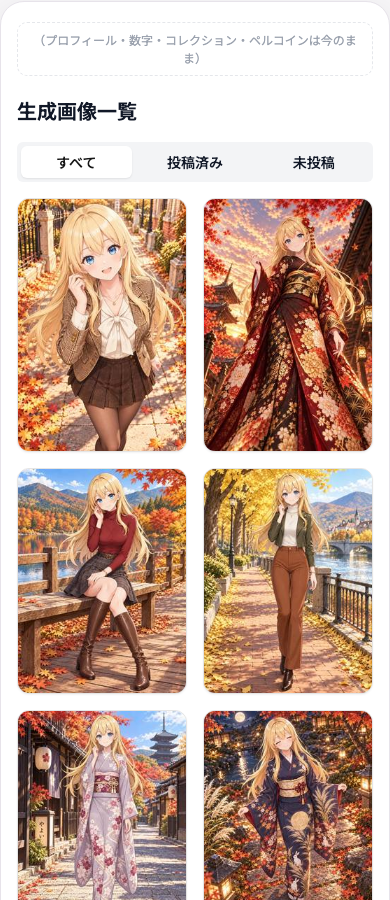
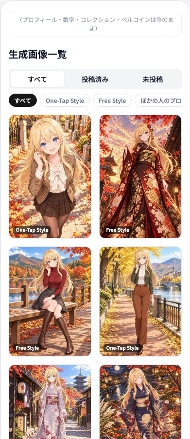
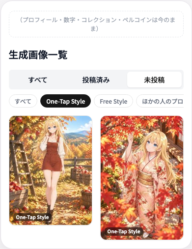
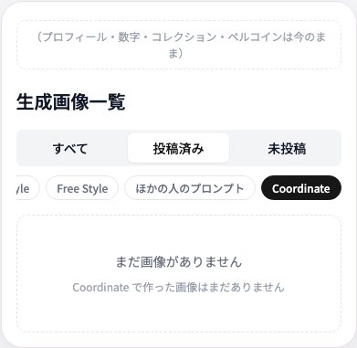

# マイページの生成画像一覧に「作り方」の絞り込みとラベルを足す 実装計画

- 作成日: 2026-09-29
- 状態: 実装待ち（ほかの開発者に依頼）
- 範囲: マイページの「生成画像一覧」の部分だけ。プロフィール・数字・コレクション・ペルコインは変えない

## 背景

マイページの生成画像一覧には、作り方の違う画像が1本の列に混ざっていて分かりにくい（2026-09-29 ユーザー指摘）。
今のタブは「すべて／投稿済み／未投稿」だけで、One-Tap Style・Free Style・ほかの人のプロンプトで作ったもの・Coordinate の区別がない。カードもサムネイルだけで、どの作り方の画像かが分からない。

本番の生成画像の内訳（2026-09-29、内部アカウントを除く実ユーザー）:

| 作り方 | 枚数 | 記録のされ方 |
|---|---:|---|
| One-Tap Style | 2,745 | `generation_type = 'one_tap_style'` |
| Coordinate（廃止予定） | 781 | `generation_type = 'coordinate'`（旧: `specified_coordinate` / `full_body` / `chibi` も同じ扱い） |
| Free Style（自分のプロンプト） | 600 | `generation_type = 'free'` かつ `source_post_id IS NULL` |
| ほかの人のプロンプト | 296 | `generation_type = 'free'` かつ `source_post_id IS NOT NULL`（元の投稿が入る） |
| Creator Style | 89 | `generation_type = 'inspire'` |

⭐ **Free Style と「ほかの人のプロンプト」は同じ `generation_type = 'free'` で記録される**（派生生成は元の投稿を `source_post_id` に持つ）。混ざって見える原因の1つなので、この2つは分けて見られるようにする。

生成数の中央値は6枚だが、30枚以上つくった人が25人（うち100枚以上13人）いて、混ざる困りごとは熱心な人ほど大きい。

## 画面の見本

`docs/planning/mockups/my-page-generated-images/` に置いた。`mock.html` はブラウザで開くと触れる（「変更後」のタブと絞り込みを押せる）。画像はペルスタの公式スタイルの見本画像で、利用者の画像ではない。

| 今 | 変更後 |
|---|---|
|  |  |

| 未投稿 × One-Tap Style | 空のとき（投稿済み × Coordinate） |
|---|---|
|  |  |

## 決定事項（2026-09-29 にユーザーと合意）

| 項目 | 決定 |
|---|---|
| 範囲 | 生成画像一覧の部分だけ。今のマイページを土台にする（画面全体の作り直しはしない） |
| 1. 作り方の絞り込み | 今のタブ（すべて／投稿済み／未投稿）はそのまま。その下に「作り方」の絞り込みを1行足す。タブと組み合わせて使える（例: 未投稿 × One-Tap Style） |
| 2. カードのラベル | カードの左下に作り方のラベル。ホームのフィードのカードと同じ見た目 |
| 3. 空のときの案内 | 選んだ作り方に合わせた案内にする（今は廃止予定の「コーディネート」タブを案内している） |
| 変えないもの | 並べ方（新しい順・2列の石積み）、タップで詳細、未投稿のまとめて削除、完走の投稿（`completion_id` 付き）の扱い |

## 未決事項（実装の前に決める）

| # | 決めること | おすすめ |
|---|---|---|
| 1 | 絞り込みの名前と並び | すべて ／ One-Tap Style ／ Free Style ／ ほかの人のプロンプト ／ Coordinate ／（Creator Style は持っている人だけ最後に）。名前はフィードのラベル（`posts.mode*`）と同じにする |
| 2 | Free Style を CREATE と呼ぶか | カタログ刷新の一般公開（`NEXT_PUBLIC_USER_STYLES_ENABLED`）に合わせて、フィードのラベルと一緒に変える。この計画では Free Style のまま |
| 3 | 一般の利用者に出す時期 | 今の並びや操作は変えず、絞り込みとラベルを足すだけなので、全員にそのまま出す。運営だけに先に出す場合は、公開フラグを1つ足す |

## コードベース調査結果（origin/main e7fd2bd 時点）

### 一覧のデータ

- `features/my-page/lib/server-api.ts:267-322` `getMyImagesServer(userId, filter, limit, offset, supabase?)`
  - `filter` は `"all" | "posted" | "unposted"`
  - `filter !== "posted"` のとき `completion_id IS NULL`（完走の投稿は「生成一覧」には出さず、投稿済みには出す。:283-287）
  - 並び: 投稿済みは `posted_at desc`、ほかは `created_at desc`（:289-295）
- `app/api/my-page/images/route.ts:21-45` GET `/api/my-page/images?filter=&limit=&offset=`（下までスクロールしたときの続きと、投稿済み・未投稿のタブの読み込み）
- `features/my-page/components/CachedMyPageImageGallery.tsx:13-18` 「すべて」の最初の20件だけをサーバーでキャッシュ（`"use cache"`・タグ `my-page-${userId}`）

### 一覧の画面

- `features/my-page/components/MyPageImageGalleryClient.tsx`
  - タブの状態: `filter`（:42）、すべて（:45-51）・投稿済み（:54）・未投稿（:61）で別々に持つ
  - 読み込み: `fetchImages(filterParam, offset)` が `/api/my-page/images` を呼ぶ（:94-100）
  - タブ切り替えで選択モードを解く（:276-280）。まとめて削除は未投稿のタブだけ（:81）
- `features/my-page/components/ImageTabs.tsx` タブ（`bg-gray-100` の中に3つ、選択中は `bg-white shadow-sm text-primary`）
- `features/my-page/components/MyImageGallery.tsx` 2列の石積み（`react-masonry-css`。幅 1024px 以下は2列、それより広いと3列）。空のときの表示（`myPage.emptyImagesTitle` / `emptyImagesDescription`）
- `features/my-page/components/MyImageCard.tsx` サムネイルだけのカード。タップで `/posts/{id}?from=my-page`、長押しで選択モード

### ラベル（そのまま使えるもの）

- `features/posts/lib/generation-mode-label.ts:15-33` `getGenerationModeLabelKey(generation_type)` → `posts.modeCoordinate` / `modeOneTapStyle` / `modeInspire` / `modeFree`（coordinate 系はまとめて Coordinate）
- `features/posts/components/PostCard.tsx:127-131` フィードのカードのラベルの見た目（`absolute bottom-2 left-2 rounded-md bg-black/55 px-1.5 py-0.5 text-[10px] font-semibold text-white`）

### 文言

- `messages/ja.ts` の `myPage`: `generatedImagesTitle`・`imageTabAll/Posted/Unposted`・`emptyImagesTitle`・`emptyImagesDescription`（「『コーディネート』タブから画像を生成してみましょう」← 直す）
- 15言語（`messages/*.ts`）すべてにキーをそろえる（`tests/unit/lib/translation-messages.test.ts` が確かめる）

## EARS（要件定義）

| ID | 要件（English） | 要件（日本語） |
|---|---|---|
| REQ-01 | The system shall show a row of generation-method filters below the existing all / posted / unposted tabs on My Page. | マイページの生成画像一覧で、今のタブの下に作り方の絞り込みを1行出す |
| REQ-02 | When the user selects a method, the system shall list only images made with that method, combined with the selected tab. | 作り方を選ぶと、選んでいるタブと組み合わせて、その作り方の画像だけを出す |
| REQ-03 | The system shall treat free images with a source post as "someone else's prompt", separately from Free Style made with the user's own prompt. | `free` のうち元の投稿があるものは「ほかの人のプロンプト」とし、自分のプロンプトの Free Style と分ける |
| REQ-04 | The system shall show the generation-method label at the bottom-left of each image card, in the same style as the home feed cards. | 各カードの左下に作り方のラベルを、ホームのフィードのカードと同じ見た目で出す |
| REQ-05 | While a method is selected, infinite scroll shall load more images under the same tab and method. | 絞り込み中に下までスクロールしたときも、同じタブと作り方で続きを読む |
| REQ-06 | If no image matches, the system shall show an empty state that suggests the next step for the selected method. | 当てはまる画像が無いときは、選んだ作り方に合わせた次の一歩を案内する |
| REQ-07 | The system shall show the Creator Style filter only to users who have at least one Creator Style image. | Creator Style の絞り込みは、Creator Style の画像を持っている人にだけ出す |
| REQ-08 | The system shall keep the existing order, detail navigation, bulk delete in the unposted tab, and the completion-post rules. | 並べ方・詳細への移動・未投稿のまとめて削除・完走の投稿の扱いは変えない |

## ADR（設計判断）

### ADR-001: 今のタブは残し、作り方は2段目の絞り込みにする

- **Context**: 利用者は今の「すべて／投稿済み／未投稿」に慣れている。作り方をタブに混ぜると、投稿の状態で見る使い方ができなくなる
- **Decision**: タブはそのまま。作り方は下の1行（横にスクロールできるチップ）にし、タブと組み合わせる
- **Consequence**: 読み込みは「タブ × 作り方」の組み合わせごとになる（ADR-003）

### ADR-002: 絞り込みはサーバーで行う（画面で取った分を絞らない）

- **Context**: 一覧は20件ずつ読む。画面で絞ると、1ページ目に当てはまる画像が無いときに「無い」と誤って出る
- **Decision**: `getMyImagesServer` と `/api/my-page/images` に作り方（`method`）を足し、データベースで絞る

| `method` | 条件 |
|---|---|
| `all` | 条件なし（今と同じ） |
| `one_tap_style` | `generation_type = 'one_tap_style'` |
| `free_own` | `generation_type = 'free'` かつ `source_post_id IS NULL` |
| `free_others` | `generation_type = 'free'` かつ `source_post_id IS NOT NULL` |
| `coordinate` | `generation_type IN ('coordinate', 'specified_coordinate', 'full_body', 'chibi')` |
| `inspire` | `generation_type = 'inspire'` |

- 知らない値は `all` として扱う（API は 400 にしない）
- `completion_id` と並び順の条件は今のまま重ねる
- 「元の投稿あり」は `.not("source_post_id", "is", null)` で絞る

### ADR-003: 画面の状態は「タブ × 作り方」ごとに持つ

- **Context**: 今は3つのタブの状態を別々の変数で持っている（`MyPageImageGalleryClient.tsx:45-66`）。作り方が加わると組み合わせが増える
- **Decision**: 状態を `${tab}:${method}` をキーにした1つの入れ物にまとめ、組み合わせを最初に開いたときに読み込む。サーバーでキャッシュした最初の20件は `all:all` だけに使う
- **Consequence**: 一度開いた組み合わせは、戻ったときに読み直さない（今のタブと同じ）。削除した画像は、どの組み合わせからも消す（今の `deletedIds` と同じ考え方）

### ADR-004: カードのラベルはフィードの部品と文言を使い回す

- **Decision**: `getGenerationModeLabelKey` と `posts.mode*` を使う。ほかの人のプロンプト（`free` かつ `source_post_id` あり）だけは、新しい文言キー（例: `myPage.imageMethodOthersPrompt`）で「ほかの人のプロンプト」と出す
- **Reason**: フィードとマイページで同じ画像に違う名前が付かないようにする。Free Style を CREATE と呼ぶことにしたら、`posts.modeFree` を変えるだけで両方がそろう

## 実装計画

### Phase 1: データ（サーバーと API）

- [ ] `getMyImagesServer` に `method` を足す（ADR-002 の表）。既定は `all`
- [ ] `/api/my-page/images` で `method` を受ける。知らない値は `all`
- [ ] Creator Style を持っているかを返す軽い問い合わせ（件数だけ・1件あれば true）。キャッシュのタグは `my-page-${userId}`
- [ ] テスト: 作り方ごとの条件、タブとの組み合わせ、`completion_id` の条件が残ること、知らない値

### Phase 2: 絞り込みの行

- [ ] `ImageTabs` の下に作り方のチップを1行（横スクロール）。選択中は塗りつぶし
- [ ] タップ領域は 44px 以上（`docs/development/project-conventions.md` の Mobile-first ルール）。見た目は小さくてよい
- [ ] `MyPageImageGalleryClient` の状態を `${tab}:${method}` ごとに持つ（ADR-003）。続きの読み込みも同じ組み合わせで
- [ ] 作り方を切り替えたら選択モードを解く（タブと同じ）
- [ ] Creator Style のチップは、持っている人にだけ最後に出す

### Phase 3: カードのラベル

- [ ] `MyImageCard` の左下に作り方のラベル（`PostCard.tsx:127-131` と同じ見た目）
- [ ] ほかの人のプロンプトの画像は「ほかの人のプロンプト」、ラベルが分からない種類（null）は出さない
- [ ] 選択モードでもラベルは出す（チェックは左上なので重ならない）

### Phase 4: 空のときの案内と文言

- [ ] 作り方ごとの案内（見本の文言）
  - すべて: 「One-Tap Style でスタイルを選んで、画像を生成してみましょう」
  - One-Tap Style: 「One-Tap Style でスタイルを選んでみましょう」
  - Free Style: 「Free Style で、自分のプロンプトから作ってみましょう」
  - ほかの人のプロンプト: 「ほかの人の投稿の『このプロンプトで作る』から作ってみましょう」
  - Coordinate: 「Coordinate で作った画像はまだありません」（廃止予定なので作り方は案内しない）
  - Creator Style: 「Creator Style で作った画像はまだありません」
- [ ] 今の `myPage.emptyImagesDescription`（「コーディネート」タブの案内）を直す
- [ ] 文言は15言語に足す

### Phase 5: 確かめる

- [ ] 実機（スマホ）で、チップの横スクロール・タップのしやすさ・タブとの組み合わせ・続きの読み込み・まとめて削除を確かめる
- [ ] 一般の利用者に出す時期は、未決事項 3 に従う

## 修正対象ファイル一覧

| ファイル | 操作 | 変更内容 |
|---|---|---|
| `features/my-page/lib/server-api.ts` | 修正 | `getMyImagesServer` に `method`。Creator Style を持っているかの問い合わせ |
| `app/api/my-page/images/route.ts` | 修正 | `method` を受ける |
| `features/my-page/components/CachedMyPageImageGallery.tsx` | 修正 | Creator Style を持っているかを渡す（最初の20件は今のまま） |
| `features/my-page/components/MyPageImageGalleryClient.tsx` | 修正 | 状態を `${tab}:${method}` ごとに。読み込みに `method` |
| `features/my-page/components/ImageMethodFilter.tsx`（名前は仮） | 新規 | 作り方のチップの行 |
| `features/my-page/components/MyImageCard.tsx` | 修正 | 左下のラベル |
| `features/my-page/components/MyImageGallery.tsx` | 修正 | 作り方ごとの空の案内 |
| `messages/*.ts`（15言語） | 修正 | 絞り込み・ラベル・空の案内の文言 |
| `tests/unit/...` | 新規・修正 | 下の「テスト観点」 |

データベースの変更（マイグレーション）は無い。

## 品質・テスト観点

### テスト観点

| 区分 | 観点 |
|---|---|
| 正常 | 作り方ごとの条件（ADR-002 の表）でデータベースに問い合わせる |
| 正常 | タブと作り方の組み合わせ（例: 未投稿 × One-Tap Style）。並び順は今のタブのまま |
| 正常 | カードのラベル: one_tap_style → One-Tap Style、free（元の投稿なし）→ Free Style、free（元の投稿あり）→ ほかの人のプロンプト、coordinate 系 → Coordinate、inspire → Creator Style |
| 正常 | 続きの読み込みも同じタブと作り方で読む |
| 境目 | Creator Style を持っていない人には、そのチップを出さない |
| 境目 | 作り方を切り替えると選択モードが解ける。まとめて削除は未投稿のタブだけ |
| 境目 | 完走の投稿（`completion_id` 付き）は、すべて・未投稿には出ず、投稿済みには出る（今のまま） |
| 異常 | 知らない `method` は `all` として扱う |
| 異常 | 当てはまる画像が無いときは、作り方ごとの案内を出す |
| 文言 | 15言語でキーがそろう（`translation-messages.test.ts`） |

### 品質チェックリスト

- [ ] `npm run lint` / `npm run typecheck` / `npm run test` / `npm run build -- --webpack`
- [ ] スマホ幅（360・390px）でページが横にはみ出さない。チップの行だけが横にスクロールする
- [ ] チップのタップ領域が 44px 以上

## ロールバック方針

データベースの変更が無いので、PR を戻せば元に戻る。公開フラグを足した場合は、フラグを外して再デプロイする。
