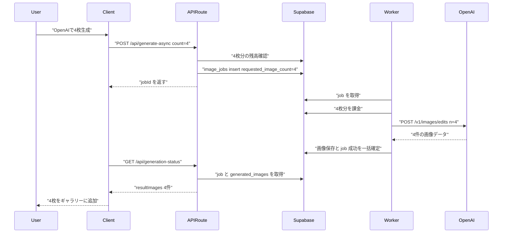
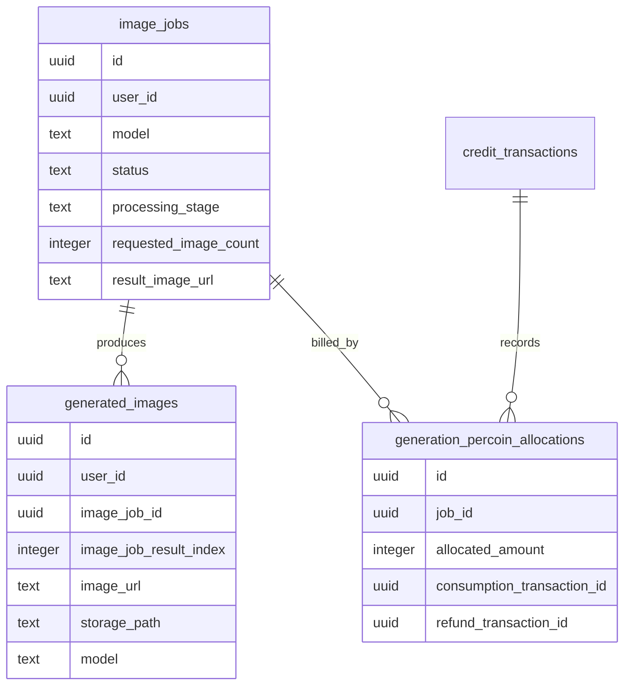
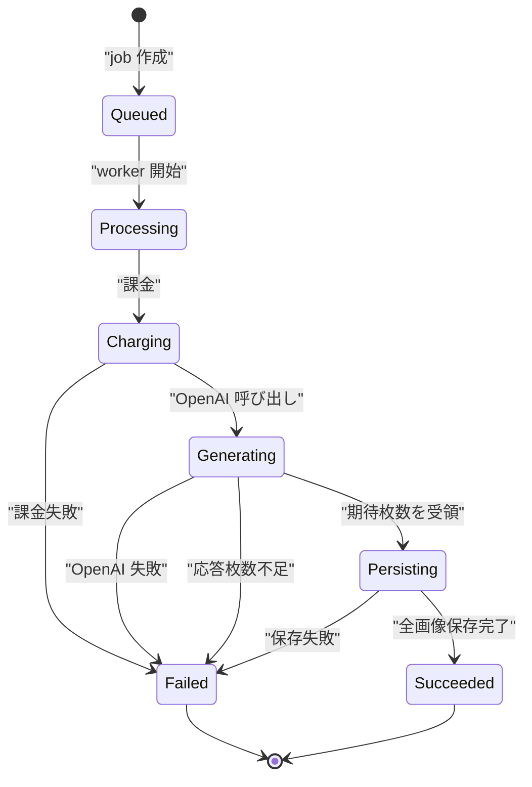

# OpenAI コーディネート複数枚生成バッチ化 実装計画

## 概要

コーディネート画面の `gpt-image-2-low` 選択時だけ、現在の「生成枚数分だけ `/api/generate-async` と OpenAI Images Edit API を呼ぶ」方式をやめ、OpenAI 側へ `n = 1..4` を渡す 1 回の `/v1/images/edits` 呼び出しに変更する。

画面上の生成枚数 UI とサブスク上限は現状のまま維持する。つまり Free は 1 枚、Light は 2 枚、Standard と Premium は 4 枚まで。Gemini Nano Banana 系は現行どおり 1 枚 1 ジョブの複数ジョブ方式を維持する。

今回の方針は OpenAI バッチを **all-or-nothing** として扱う。API が成功して期待枚数が返った場合のみ、全画像を保存し、要求枚数分のペルコインを課金する。OpenAI の応答枚数が要求枚数に満たない場合、または保存途中で失敗した場合はジョブ全体を失敗扱いにして返金する。ユーザーに「4枚中2枚完了」のような途中枚数表示は出さない。

公式 API Reference の `Create image edit` は `n` を「生成する編集画像の数」として扱い、最小 1、最大 10 を定義している。ただし本プロダクトではサブスク上限と既存 UI に合わせて最大 4 に制限する。

参考: https://developers.openai.com/api/reference/resources/images/methods/edit

補足: ローカル検証に使った OpenAI API key のローテーションは、この機能実装とは独立したセキュリティ対応として即時に扱う。この計画の Phase には含めず、別途対応状況を管理する。

---

## コードベース調査結果

### 1. 既存 UI とサブスク上限

- `features/generation/components/GenerationForm.tsx`
  - 生成枚数は `selectedCount` で管理されている。
  - `maxGenerationCount` に応じて 1..4 のボタンが表示される。
- `features/subscription/subscription-config.ts`
  - `maxGenerationCount` は Free 1、Light 2、Standard 4、Premium 4。
- `features/generation/components/GenerationFormContainer.tsx`
  - 認証済み生成では `allowedCount = Math.min(data.count, getMaxGenerationCount(subscriptionPlan))` を使っている。
  - 残高チェックは `allowedCount * percoinCost`。
  - その後 `for` ループで `allowedCount` 回 `generateImageAsync` を呼び、1 枚 1 jobId を作っている。

結論: UI とサブスク上限はすでに要件に合っている。OpenAI のときだけ内部の job 作成と worker 処理を 1 job N images に変える。

### 2. Async API 契約

- `features/generation/lib/async-api.ts`
  - `generateImageAsync` は `Omit<GenerationRequest, "count">` を受け取り、`count` を送っていない。
  - `AsyncGenerationResponse` は `{ jobId, status }` の単一 job 前提。
  - `AsyncGenerationStatus` は `previewImageUrl`, `resultImageUrl`, `generatedImageId` の単一画像前提。
- `features/generation/types.ts`
  - `GenerationRequest.count?: number` は存在する。
  - `isOpenAIImageModel()` で `gpt-image-*` を判定できる。
- `app/api/generate-async/handler.ts`
  - Zod schema は `count` 1..4 を受け付けるが、route handler では destructuring されず使われていない。
  - 現在の残高チェックと job 作成は 1 枚分。
- `app/api/generation-status/route.ts`
  - `image_jobs.result_image_url` から単一の `generatedImageId` を引く実装。

結論: OpenAI バッチ化には status API に複数結果を返すフィールドが必要。互換性のため既存の単一フィールドは「先頭画像」として残す。

### 3. OpenAI 呼び出し箇所

- `features/generation/lib/openai-image.ts`
  - Node 側のゲスト同期生成用。`n=1` 固定で `data[0].b64_json` を返す。
- `supabase/functions/image-gen-worker/openai-image.ts`
  - Deno Edge Function worker 側。`n=1` 固定で `data[0].b64_json` を返す。
- `supabase/functions/image-gen-worker/index.ts`
  - OpenAI 分岐で `callOpenAIImageEdit()` を呼び、1 枚の `generatedImage` として後続保存処理へ流している。

結論: 今回の主対象は worker 側の OpenAI client。ゲスト生成は scope 外なので `n=1` のままにする。Node 側 client は型とテストの一貫性のため count 対応してもよいが、呼び出し側では 1 固定を維持する。

### 4. Worker と課金処理

- `supabase/functions/image-gen-worker/index.ts`
  - 生成前に `deductPercoinsFromGeneration(jobId, percoinCost)` で 1 枚分を課金している。
  - OpenAI 分岐も Gemini 分岐も最終的に単一画像の upload、`generated_images` INSERT、`image_jobs` succeeded 更新へ流れる。
  - `credit_transactions.related_generation_id` は単一 `generated_images.id` を指す。
  - 失敗時 refund は `getPercoinCost(job.model)` に基づき 1 枚分を返す。
- `supabase/migrations/20260305090000_add_generation_percoin_allocations_and_precise_refund.sql`
  - `generation_percoin_allocations.job_id -> image_jobs.id` があり、job 単位の精密返金に使える。
- `supabase/migrations/20260222090000_add_generation_billing_uniqueness_indexes.sql`
  - `credit_transactions.metadata->>'job_id'` に consumption/refund の一意制約がある。

結論: OpenAI バッチは 1 job 1 consumption transaction として、金額だけ `percoinCost * requestedImageCount` にするのが自然。`related_generation_id` はレガシー互換として先頭画像を入れ、全画像の関係は新しい `generated_images.image_job_id` で表現する。

### 5. DB スキーマと既存リンク

- `image_jobs`
  - `result_image_url` は scalar。
  - 生成結果枚数を表すカラムはない。
- `generated_images`
  - `image_jobs` への FK がない。
  - `source_image_stock_id` はある。
- `features/generation/lib/coordinate-stocks-repository.ts`
  - `generated_images.job_id` が存在しないため、`image_jobs.result_image_url == generated_images.image_url` で紐付けているコメントと実装がある。
- `.cursor/rules/database-design.mdc`
  - 現行 ledger も `generated_images` と `image_jobs` の直接 FK を持たない前提。

結論: 複数結果を正しく扱うには `generated_images` から `image_jobs` へ nullable FK を追加する。既存データの互換性のため `image_jobs.result_image_url` は残し、先頭結果 URL を格納する。

### 6. ステータス表示

- `features/generation/lib/job-progress.ts`
  - 複数 job の status から `completedCount` と `progressPercent` を計算している。
- `features/generation/components/GenerationFormContainer.tsx`
  - `jobStatuses` が複数ある場合、進捗表示は job 単位で集約される。
  - タイトルは `t("generationProgressTitle", { completed, total })`。
- `messages/ja.ts`
  - `generationProgressTitle: "画像を生成中です ({completed} / {total} 枚完了)"`。
  - `partialGenerationFailed` も `failed/total` 表示。

結論: OpenAI バッチでは 1 job の中に複数画像があるため、この表示をそのまま使うと「1 / 1 枚完了」になり、実際の生成枚数とズレる。OpenAI バッチ中は枚数進捗タイトルを使わず、完了まで「画像を生成中です」のような単純表示に分岐する。

### 7. Supabase 接続と migration 状態

`supabase migration list --linked` は実行できた。Remote に `20260501005119` が存在し、Local 側には対応 migration がない状態だった。

結論: この計画を実装する前に、Remote-only migration `20260501005119` の内容を確認し、ローカル migration ledger とズレたまま新 migration を積まない。

---

## 1. 概要図

### OpenAI バッチ生成シーケンス



### データモデル



### 状態遷移



---

## 2. EARS 要件定義

| ID | 要件 |
| --- | --- |
| OBG-001 | When an authenticated user submits coordinate generation with an OpenAI image model and selects 1 to 4 images, the system shall create exactly one `image_jobs` row and enqueue exactly one worker job.<br>**ja**: 認証済みユーザーがコーディネート画面で OpenAI 画像モデルを選び 1 から 4 枚を指定したとき、システムは `image_jobs` を 1 件だけ作成し、worker job も 1 件だけ投入すること。 |
| OBG-002 | When the selected model is not an OpenAI image model, the system shall keep the existing behavior of creating one async job per requested image.<br>**ja**: 選択モデルが OpenAI 画像モデルではない場合、システムは要求枚数ごとに async job を 1 件作る現行挙動を維持すること。 |
| OBG-003 | When the OpenAI worker starts processing a batched job, the system shall charge `requested_image_count * percoinCost` in one consumption transaction before calling OpenAI.<br>**ja**: OpenAI worker がバッチ job の処理を開始したとき、システムは OpenAI 呼び出し前に `requested_image_count * percoinCost` を 1 件の消費トランザクションとして課金すること。 |
| OBG-004 | When the OpenAI worker calls the Images Edit API for a batched job, the system shall send `n = requested_image_count` in the same API request.<br>**ja**: OpenAI worker がバッチ job の Images Edit API を呼ぶとき、システムは同一 API リクエストに `n = requested_image_count` を渡すこと。 |
| OBG-005 | When OpenAI returns exactly the requested number of images, the system shall persist all returned images, link them to the same `image_jobs.id`, and mark the job as succeeded only after all persistence steps complete.<br>**ja**: OpenAI が要求枚数と同数の画像を返したとき、システムは全画像を保存し、同じ `image_jobs.id` に紐付け、全保存処理が完了した後だけ job を succeeded にすること。 |
| OBG-006 | If OpenAI returns fewer or more images than requested, the system shall treat the job as failed and shall not expose a partial result to the user.<br>**ja**: OpenAI の返却枚数が要求枚数と一致しない場合、システムは job を失敗扱いにし、部分結果をユーザーへ表示しないこと。 |
| OBG-007 | If a batched OpenAI job fails after charging, the system shall refund the full charged amount for that job exactly once.<br>**ja**: OpenAI バッチ job が課金後に失敗した場合、システムはその job に対して課金済み全額を 1 回だけ返金すること。 |
| OBG-008 | When `/api/generation-status` returns a succeeded OpenAI batched job, the response shall include all generated images in order and keep the legacy single-image fields populated with the first image.<br>**ja**: `/api/generation-status` が成功済み OpenAI バッチ job を返すとき、レスポンスは全生成画像を順序付きで含め、既存の単一画像フィールドには先頭画像を入れること。 |
| OBG-009 | While an OpenAI batched job is running, the coordinate screen shall not display intermediate count text such as `4枚中2枚完了`.<br>**ja**: OpenAI バッチ job の実行中、コーディネート画面は `4枚中2枚完了` のような途中枚数表示を出さないこと。 |
| OBG-010 | When the selected count exceeds the user's subscription limit, the client and server shall clamp or reject it using the existing subscription maximum of 1, 2, or 4.<br>**ja**: 選択枚数がユーザーのサブスク上限を超える場合、クライアントとサーバーは既存の 1、2、4 枚上限に基づいて丸めるか拒否すること。 |

---

## 3. ADR

### ADR-001: OpenAI のみ 1 job N images にする

- **Context**: Gemini Nano Banana 系は現行の複数 job 方式で動いており、Webhook や status 集約もその前提に寄っている。一方 OpenAI Images Edit API は `n` による複数枚生成を公式にサポートしており、手元テストでも `n=4` と `n=5` は成功した。
- **Decision**: `isOpenAIImageModel(model)` の場合だけ、`/api/generate-async` を 1 回呼び、1 job に `requested_image_count` を持たせる。非 OpenAI は現行のループ方式を維持する。
- **Reason**: UI を変えずに OpenAI の API 呼び出し数と queue job 数を削減できる。Gemini 側の実績ある挙動に影響を出さない。
- **Consequence**: status API と worker 永続化は 1 job 複数画像を扱えるよう拡張する必要がある。

### ADR-002: 複数画像と job の関係は `generated_images.image_job_id` で表現する

- **Context**: 現行は `image_jobs.result_image_url` と `generated_images.image_url` の一致でしか生成画像を逆引きできない。これは 1 job 1 image 前提では動くが、1 job N images では表現できない。
- **Decision**: `generated_images.image_job_id` と `generated_images.image_job_result_index` を追加する。`image_job_result_index` は OpenAI response の `data` 配列順をそのまま 0 始まりで保存し、アプリ側で独自ソートしない。既存の `image_jobs.result_image_url` には `image_job_result_index = 0` の先頭画像 URL を残す。
- **Reason**: 複数画像を順序付きで安全に取得できる。既存画面や過去データは `result_image_url` による fallback で維持できる。
- **Consequence**: DB migration、RLS ledger、docs、coordinate stock repository の更新が必要。

### ADR-003: OpenAI バッチは all-or-nothing とする

- **Context**: OpenAI API 1 回に対して `n=4` などを指定するため、アプリ側の個別 job 成功や「4枚中2枚成功」の概念とは相性が悪い。ユーザーも「API が成功した場合は確実に 4 枚返る」前提でよいと確認済み。
- **Decision**: 期待枚数がそろった場合だけ成功。枚数不一致、upload 失敗、DB 永続化失敗は job 全体を failed にし、全額返金する。
- **Reason**: 課金、UI、DB 整合性を単純に保てる。部分成功を許すと保存済み画像、返金額、通知、ギャラリー表示の整合性が複雑化する。
- **Consequence**: 保存途中で失敗した場合は、可能な範囲で Storage cleanup を行う。cleanup 失敗はログに残し、job と課金は失敗扱いを優先する。課金 RPC は既存の `deduct_free_percoins` を利用し、`metadata.job_id` による冪等性はそのまま流用する。変更点は `p_amount` を `percoinCost * requested_image_count` にすることだけで、RPC 自体の改修は不要。

### ADR-004: 複数画像の保存確定は SQL RPC に寄せる

- **Context**: バッチ成功時は `generated_images` 複数 INSERT、`image_jobs` 更新、`credit_transactions.related_generation_id` backfill を一貫して行う必要がある。リポジトリ方針では複数テーブルに跨る原子的な業務処理は SQL RPC に寄せる。
- **Decision**: `complete_image_job_with_generated_images` のような RPC を追加し、worker は upload 済み画像のメタデータ配列を渡す。RPC が job row を lock し、複数 INSERT と job succeeded 更新を 1 transaction で確定する。`credit_transactions.related_generation_id` は legacy 互換のため先頭画像 ID を入れるだけに留め、新規の集計、レポート、UI クエリは `generated_images.image_job_id` を正本にする。
- **Reason**: Edge Function 側で複数クエリを分散実行すると、途中失敗時に job status と generated_images がズレやすい。RPC 化により idempotency と整合性を DB 層で担保できる。
- **Consequence**: migration と RPC テスト観点が増える。既存 1 枚 job も同じ RPC に載せられるが、初回実装では OpenAI バッチに限定してもよい。

### ADR-005: ステータス表示は OpenAI バッチ中だけ枚数進捗を隠す

- **Context**: 現行の `generationProgressTitle` は `画像を生成中です ({completed} / {total} 枚完了)`。OpenAI バッチでは job が 1 件なので、この値は生成枚数の進捗を表さない。
- **Decision**: OpenAI バッチの `feedbackPhase === "running"` 中は、枚数を含まない status title を使う。OpenAI バッチ判定は、POST `/api/generate-async` の `acceptedImageCount` と、GET `/api/generation-status` / in-progress recovery の `requestedImageCount` を正本にする。完了時は既存の `generationCompletedTitle` を使い、ギャラリーには全画像を一括追加する。
- **Reason**: 実態と違う途中枚数表示を避けられる。見た目の大枠は維持しつつ、内部処理の違いだけを吸収できる。
- **Consequence**: `messages/ja.ts` と `messages/en.ts` に OpenAI バッチ用タイトルを追加するか、既存 title の分岐で枚数なし文言を使う。

### ADR-006: バッチ受理枚数は server response を正本にする

- **Context**: 新 client が OpenAI `count=4` を 1 回だけ送る設計にした場合、旧 server へロールバックされると server は `count` を無視して 1 job だけ作成する。client が「server は何枚として受理したか」を知らないと、silent に 1 枚生成で完了してしまう。
- **Decision**: `/api/generate-async` の成功 response に `acceptedImageCount` と `batchMode` を追加する。OpenAI バッチ対応 server は `acceptedImageCount = requested_image_count`, `batchMode = "openai_single_job"` を返す。client は response を正本にして skeleton 数、status 表示、polling 方式を決める。
- **Reason**: client と server の deploy/rollback のズレに強くなる。旧 server では `acceptedImageCount` が未定義になるため、client は最初の response を `acceptedImageCount = 1` とみなし、残り枚数だけ従来 loop 方式で追加投入できる。
- **Consequence**: `AsyncGenerationResponse` と `/api/generate-async` tests を更新する。feature flag を使う場合も server-side flag を response に反映し、client は独自判定ではなく server 応答に従う。

---

## 4. 実装計画

### Phase 0: 実装前確認

- [ ] Remote-only migration `20260501005119` の内容を確認し、ローカル migration と同期する。
- [ ] `/private/tmp/openai-image-edit-n4-yukata` と `/private/tmp/openai-image-edit-n5-yukata` の検証画像は product data ではないため、必要なら整理する。

### Phase 1: DB migration

参考: `supabase/migrations/20260115054748_add_image_jobs_queue.sql`, `supabase/migrations/20260305090000_add_generation_percoin_allocations_and_precise_refund.sql`

- [ ] `image_jobs.requested_image_count integer not null default 1` を追加する。
- [ ] `requested_image_count between 1 and 4` の CHECK 制約を追加する。
- [ ] `generated_images.image_job_id uuid null references public.image_jobs(id) on delete set null` を追加する。
- [ ] `generated_images.image_job_result_index integer null` と `image_job_result_index >= 0` の CHECK 制約を追加する。
- [ ] `idx_generated_images_image_job_id` を追加する。
- [ ] `generated_images(image_job_id, image_job_result_index)` の partial unique index を `WHERE image_job_id IS NOT NULL AND image_job_result_index IS NOT NULL` 付きで追加する。
- [ ] Gemini と guest の既存 single-image path では `image_job_id` と `image_job_result_index` を NULL のまま許容する。OpenAI バッチ path だけ新カラムを必須扱いにする。
- [ ] `complete_image_job_with_generated_images` RPC を追加する。
- [ ] RPC は `p_job_id`, `p_images jsonb`, `p_generation_metadata jsonb`, `p_result_image_url` を受け取り、job owner と status を検証する。
- [ ] RPC は `generated_images` を `image_job_result_index` 順で INSERT し、legacy 互換のため先頭画像 ID を `credit_transactions.related_generation_id` に backfill する。新規の集計や UI 参照は `generated_images.image_job_id` を使う。
- [ ] RPC は `image_jobs.status = succeeded`, `processing_stage = completed`, `completed_at`, `result_image_url` を更新する。
- [ ] `requested_image_count` の DB CHECK は今回の product cap に合わせて 1..4 とする。将来 5 枚以上に拡張する場合は subscription config だけでなく migration も必要になることを docs に明記する。

### Phase 2: OpenAI client を複数結果対応にする

参考: `supabase/functions/image-gen-worker/openai-image.ts`, `features/generation/lib/openai-image.ts`, `tests/unit/features/generation/openai-image.test.ts`

- [ ] worker 側 `callOpenAIImageEdit` に `n?: number` を追加する。
- [ ] worker 側戻り値を単一 `GeneratedImage` から `GeneratedImage[]` に変更するか、互換 wrapper を作る。
- [ ] `n` は route と DB で 1..4 に制限される前提だが、client 側でも 1..10 の範囲を defensive に検証する。
- [ ] OpenAI response の `data.length` が `n` と一致しない場合はエラーにする。
- [ ] Node 側 guest client は今回の scope 外とし、公開 API と戻り値は `n=1` の単一結果のまま維持する。worker 側の型変更が `features/generation/lib/openai-image.ts` と guest sync 経路へ波及しないよう、複数結果型は Deno worker 側に閉じるか互換 wrapper を分ける。
- [ ] unit test で `n=4` が form body に入ること、4 件の b64 結果を返すこと、枚数不一致を失敗にすることを確認する。

### Phase 3: `/api/generate-async` と client 呼び出しを分岐する

参考: `features/generation/lib/async-api.ts`, `app/api/generate-async/handler.ts`, `features/generation/components/GenerationFormContainer.tsx`

- [ ] `generateImageAsync` の型から `Omit<GenerationRequest, "count">` を外し、`count` を JSON body に含める。
- [ ] `/api/generate-async` で `count` を destructuring し、`isOpenAIImageModel(model)` の場合だけ `requested_image_count = count` とする。
- [ ] `/api/generate-async` の成功 response に `acceptedImageCount` と `batchMode` を追加する。OpenAI バッチ対応時は `acceptedImageCount = requested_image_count`, `batchMode = "openai_single_job"` を返す。
- [ ] client は `acceptedImageCount` が未定義の response を旧 server とみなし、最初の response を 1 枚受理として扱う。要求枚数が 4 なら残り 3 回を従来 loop 方式で追加投入できるようにする。
- [ ] 非 OpenAI model の場合は、server 側で `requested_image_count = 1` に固定するか、`count > 1` を拒否する。
- [ ] OpenAI の残高チェックを `percoinCost * requested_image_count` に変更する。
- [ ] `image_jobs` INSERT に `requested_image_count` を含める。
- [ ] `GenerationFormContainer` で OpenAI の場合は `generateImageAsync({ count: allowedCount })` を 1 回だけ呼ぶ。
- [ ] Gemini 系は現行どおり `allowedCount` 回ループする。
- [ ] OpenAI バッチの pending source image は 1 jobId に対して requested count を保持できるようにし、生成結果の全 URL を同じ jobId に bind できるようにする。
- [ ] `PendingSourceImageEntry.resultImageUrl` を `resultImageUrls: string[]` に変更する。
- [ ] `pendingSourceImageJobIdByResultUrl` は `Map<string, string>` のまま使い、同一 jobId に対して URL ごとの逆引きを N 件登録する。
- [ ] `bindPendingSourceImageResult` を `(jobId, resultImageUrl, index?)` 仕様に拡張し、同じ URL の重複登録を避ける。
- [ ] `consumePendingSourceImageBatchByResultUrl` は `resultImageUrls` 配列と逆引き Map の両方で検索できるようにする。

### Phase 4: Worker の課金と永続化をバッチ対応にする

参考: `supabase/functions/image-gen-worker/index.ts`

- [ ] job 取得時に `requested_image_count` を読む。
- [ ] OpenAI model の場合、課金額を `getPercoinCost(job.model) * requested_image_count` にする。
- [ ] 失敗時 refund も同じ total amount を使う。既存の `generation_percoin_allocations` と `credit_transactions.metadata.job_id` の冪等性を維持する。
- [ ] OpenAI 分岐で `callOpenAIImageEdit(..., { n: requested_image_count })` を呼ぶ。
- [ ] 返却枚数が一致しない場合は upload 前に失敗させる。
- [ ] 複数画像を Storage にアップロードする。ファイル名は `{user_id}/{jobId}-{index}-{randomStr}.{ext}` のように jobId と result index を含め、失敗時 cleanup が列挙しやすい形にする。
- [ ] 全 upload 成功後に RPC を呼び、複数 `generated_images` と job succeeded を一括確定する。
- [ ] RPC 失敗時はアップロード済みファイルを best-effort で削除し、job failed と refund に進める。
- [ ] cleanup 失敗で残った orphan object を後から削除できるよう、jobId を含む prefix 命名を前提に Storage GC の運用タスクまたは既存 cron への追加を検討項目として残す。
- [ ] WebP 変換通知は生成された全 `generated_images.id` に対して送る。通知自体は `EdgeRuntime.waitUntil` を使い、worker 本処理をブロックしない。4 件程度の上限では個別通知を許容するが、必要なら後続で ensure-webp API の `imageIds` batch 化を検討する。
- [ ] 既存の single-image path は Gemini と guest scope に影響しないよう維持し、新カラムは NULL のまま許容する。

### Phase 5: generation status とギャラリー反映

参考: `app/api/generation-status/route.ts`, `features/generation/lib/async-api.ts`, `features/generation/components/GenerationFormContainer.tsx`, `features/generation/components/GeneratedImageGalleryClient.tsx`

- [ ] `AsyncGenerationStatus` に `requestedImageCount: number` と `resultImages: Array<{ id: string; url: string }>` を追加する。
- [ ] 必要なら `previewImages` も同じ形で追加する。ただし OpenAI バッチは完了まで部分 preview を出さない。
- [ ] `/api/generation-status` は `generated_images.image_job_id = job.id` を優先して結果を取得する。
- [ ] `/api/generation-status/in-progress` も `requestedImageCount` と `batchMode` を返し、ページリロード後の recovery でも OpenAI バッチ表示を復元できるようにする。
- [ ] 過去 job 互換のため、`image_job_id` がない場合は現行どおり `result_image_url` から単一結果を fallback 取得する。
- [ ] legacy fields の `resultImageUrl` と `generatedImageId` には先頭画像を入れる。
- [ ] `syncPreviewFromStatus` を複数画像対応にし、OpenAI succeeded 時に `resultImages` 全件を `previewImages` へ追加する。
- [ ] skeleton は requested count 分を維持し、完了時に全件へ置き換える。

### Phase 6: ステータス表示の文言分岐

参考: `features/generation/components/GenerationFormContainer.tsx`, `messages/ja.ts`, `messages/en.ts`

- [ ] OpenAI バッチ実行中かどうかを `activeBatchGenerationMode` のような state で持つ。起点は model 選択状態ではなく、server response の `batchMode` / `acceptedImageCount` と status response の `requestedImageCount` にする。
- [ ] OpenAI バッチ実行中は `generationProgressTitle` を使わず、枚数なしの title を表示する。
- [ ] 完了時は既存の `generationCompletedTitle` を使う。
- [ ] `partialGenerationFailed` は OpenAI バッチには使わず、失敗時は通常の単一エラーとして出す。
- [ ] 非 OpenAI の複数 job では現行の `x / y 枚完了` と部分失敗表示を維持する。

### Phase 7: 元画像ストックと関連機能の追従

参考: `features/generation/lib/coordinate-stocks-repository.ts`, `features/generation/context/GenerationStateContext.tsx`

- [ ] `coordinate-stocks-repository.ts` の `image_jobs.result_image_url == generated_images.image_url` 依存を、`generated_images.image_job_id` 優先に変更する。
- [ ] legacy fallback として URL 一致ロジックは残す。
- [ ] pending source image の result binding を、1 job 複数 URL に対応させる。
- [ ] 投稿、モデレーション、マイページ、検索、管理画面で `generated_images` の追加カラムが副作用を出さないことを確認する。

### Phase 8: ドキュメント更新

参考: `docs/architecture/data.ja.md`, `docs/architecture/data.en.md`, `.cursor/rules/database-design.mdc`, `docs/API.md`

- [ ] `docs/architecture/data.ja.md` と `data.en.md` の非同期画像生成フローを、OpenAI だけ 1 job 複数 `generated_images` を許容する記述に更新する。
- [ ] `.cursor/rules/database-design.mdc` に `image_jobs.requested_image_count`, `generated_images.image_job_id`, `generated_images.image_job_result_index`, 新 index, 新 RPC を追記する。
- [ ] `docs/API.md` の `/api/generate-async` に、OpenAI の `count` は 1 job に集約されることを追記する。
- [ ] `docs/API.md` の `/api/generate-async` 成功 response に `acceptedImageCount` と `batchMode` を追記する。
- [ ] `docs/API.md` の `/api/generation-status` と `/api/generation-status/in-progress` に `requestedImageCount`, `batchMode`, `resultImages` を追記する。
- [ ] `credit_transactions.related_generation_id` は legacy 互換のみで、新規集計は `generated_images.image_job_id` を使う方針を `docs/architecture/data.ja.md`, `data.en.md`, `.cursor/rules/database-design.mdc` に明記する。
- [ ] `requested_image_count` の上限を 4 から変更する場合は DB CHECK migration が必要であることを docs に明記する。

---

## 5. テスト計画

### Unit

- [ ] `tests/unit/features/generation/openai-image.test.ts`
  - `n=4` を送信する。
  - `data` 4 件を配列として返す。
  - `data.length !== n` をエラーにする。
- [ ] `features/generation/lib/job-progress.ts`
  - 既存の複数 job 集約が Gemini path で壊れないことを確認する。必要なら追加なし。

### Integration

- [ ] `tests/integration/api/generate-async-route.test.ts`
  - OpenAI `count=4` で `image_jobs` が 1 件だけ作られる。
  - `requested_image_count=4` が保存される。
  - response に `acceptedImageCount=4` と `batchMode="openai_single_job"` が含まれる。
  - 残高不足判定が 4 枚分で行われる。
  - Gemini `count=4` を直接送った場合は 1 に丸めるか 400 になる。
- [ ] `tests/integration/api/generation-status-route.test.ts`
  - `requestedImageCount` と `batchMode` が返る。
  - `generated_images.image_job_id` に紐づく 4 件が `resultImages` に順序付きで返る。
  - legacy fields は先頭画像で埋まる。
  - `image_job_id` がない既存 job は fallback で単一結果が返る。
- [ ] `tests/integration/api/generation-status-in-progress-route.test.ts`
  - in-progress recovery 用 response に `requestedImageCount` と `batchMode` が含まれる。
- [ ] worker integration test
  - OpenAI `requested_image_count=4` で 4 件 upload し、RPC を呼ぶ。
  - OpenAI 応答枚数不足で job failed と全額 refund になる。
  - upload 後 RPC 失敗で best-effort cleanup と refund が走る。
  - Storage path に jobId と result index が含まれる。

### Component

- [ ] `GenerationFormContainer`
  - OpenAI 4 枚選択で `generateImageAsync` が 1 回だけ呼ばれ、body count が 4。
  - OpenAI response の `acceptedImageCount` が未定義の場合、最初の response を 1 枚受理として扱い、残り枚数だけ従来 loop 方式で追加投入する。
  - Gemini 4 枚選択では従来どおり 4 回呼ばれる。
  - OpenAI running 中は `4枚中2枚完了` のような文言が表示されない。
  - OpenAI succeeded status の `resultImages` 4 件がギャラリーへ追加される。
- [ ] `GenerationStateContext`
  - 1 jobId に複数 result URL を bind できる。
  - result URL から同一 pending source image batch を consume できる。

### Manual Verification

- [ ] ローカルで OpenAI `gpt-image-2-low`、`count=1` を実行し、1 job 1 image として保存される。
- [ ] ローカルで OpenAI `gpt-image-2-low`、`count=4` を実行し、1 job 4 images として保存される。
- [ ] Light plan 相当で 3 枚以上が選べない、または送っても 2 枚に制限される。
- [ ] Gemini 4 枚生成が従来どおり 4 job で進む。
- [ ] 残高が 3 枚分しかない状態で OpenAI 4 枚生成が拒否される。

### 実行コマンド候補

```bash
npm test -- tests/unit/features/generation/openai-image.test.ts
npm test -- tests/integration/api/generate-async-route.test.ts
npm test -- tests/integration/api/generation-status-route.test.ts
npm test -- tests/integration/api/generation-status-in-progress-route.test.ts
npm run typecheck
```

ビルド確認が必要な場合は、このリポジトリの既存方針に従い `npm run build -- --webpack` を使う。

---

## 6. ロールバック方針

- DB migration は additive にするため、緊急時は server-side feature flag で OpenAI バッチを無効化し、`/api/generate-async` の `batchMode` / `acceptedImageCount` を single-job 互換として返す。
- `generated_images.image_job_id` と `requested_image_count` は nullable/default 付きで追加し、既存データを破壊しない。
- `image_jobs.result_image_url` は削除しないため、旧 status API fallback は維持できる。
- worker の OpenAI バッチ path に障害が出た場合は、server-side flag で OpenAI も `requested_image_count=1` に固定し、client は response の `acceptedImageCount=1` / `batchMode` に従って残り枚数を従来 loop 方式で追加投入する。
- RPC 導入後も single-image insert path を一時的に残し、段階的に切り戻せるようにする。

---

## 7. 整合性チェック

- **図とスキーマ**: 状態遷移は既存 `image_jobs.status` の `queued`, `processing`, `succeeded`, `failed` と `processing_stage` の `queued`, `processing`, `charging`, `generating`, `uploading`, `persisting`, `completed`, `failed` に沿う。新規 `requested_image_count` は 1..4。
- **認証モデル**: `/api/generate-async` と `/api/generation-status` は既存どおり user session。`generated_images.image_job_id` は owner job と owner image の組み合わせで扱い、RLS は既存 owner CRUD を維持する。
- **APIパラメータ安全性**: `user_id` はセッションから解決し、client body からは受け取らない。`count` は client から来てもサーバー側で 1..4 とサブスク上限を再検証する。client は `acceptedImageCount` / `requestedImageCount` を正本にし、model 選択状態だけではバッチ確定とみなさない。
- **DB層ビジネスルール**: `requested_image_count` の CHECK、`image_job_result_index` の CHECK、`image_job_id + result_index` の partial unique index、RPC 内の job status 検証で不正状態を防ぐ。
- **課金整合性**: OpenAI バッチは 1 job 1 consumption/refund。金額は requested count 分。返金は `metadata.job_id` と allocation による冪等性を維持する。
- **部分成功排除**: OpenAI 応答枚数不足、upload 失敗、DB 確定失敗はすべて job failed。成功画像だけ保存や成功画像だけ課金は行わない。
- **既存互換**: `result_image_url` と legacy status fields は先頭画像で維持する。`credit_transactions.related_generation_id` も先頭画像を入れる legacy 互換に留め、新規集計は `generated_images.image_job_id` を使う。過去 job は URL fallback で読み取れる。
- **Storage 運用**: OpenAI バッチの storage path は jobId と index を含む。cleanup 失敗時はログに残し、prefix を使った後続 GC で orphan object を除去できるようにする。
