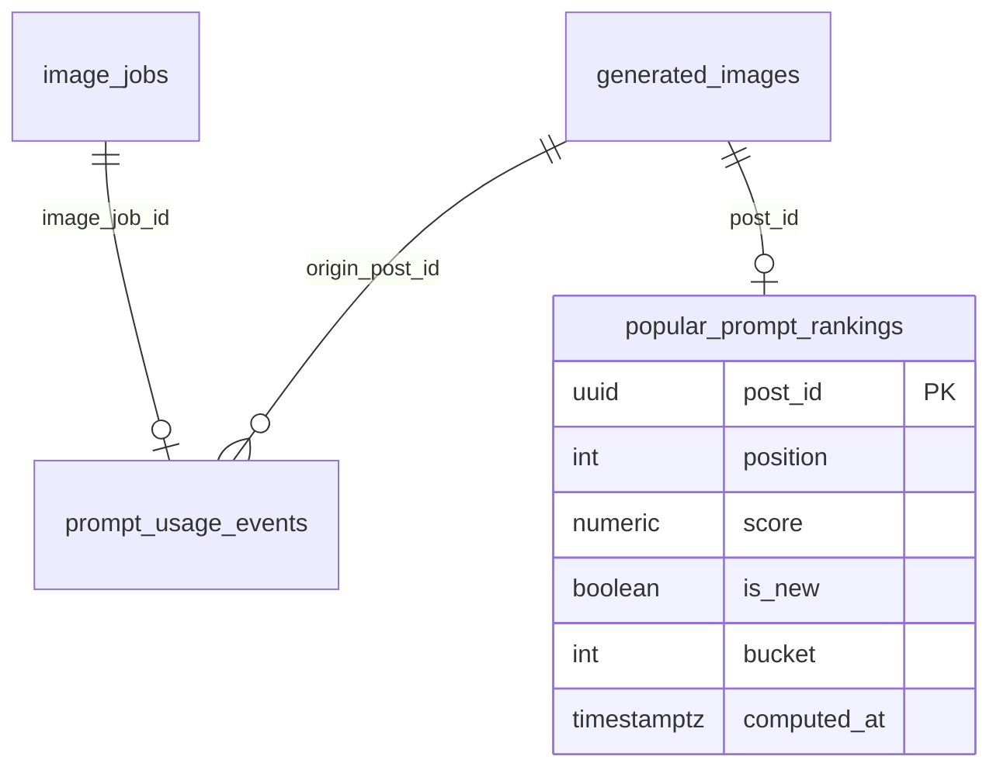
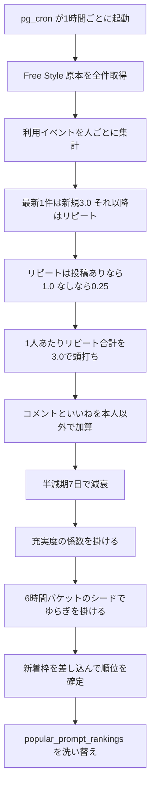
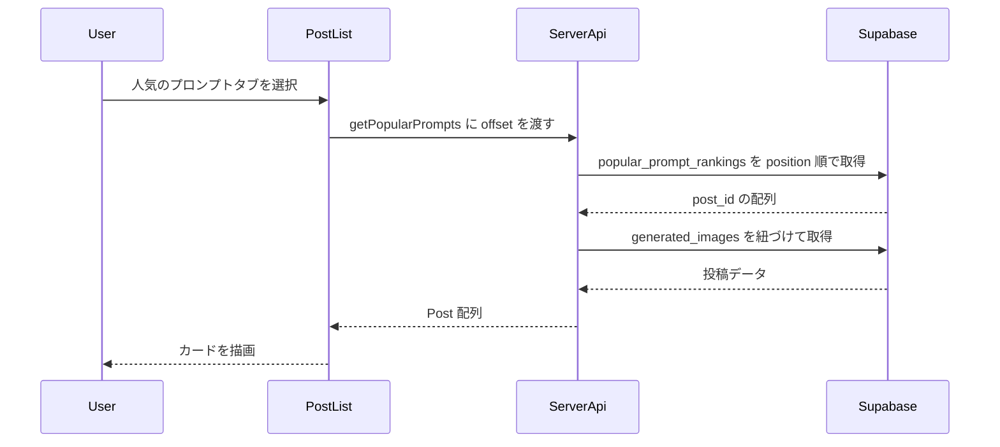
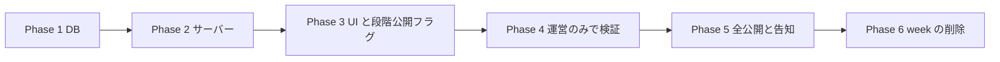

# 🔥人気のプロンプト タブ 実装計画

作成日: 2026-09-02

ホームの「オススメ」タブを廃止し、**Free Style 原本のみ**を対象とした
「🔥人気のプロンプト」タブへ置き換える。順位は pg_cron で事前計算し、
テーブルに保存したものを読むだけにする。

---

## コードベース調査結果

| 観点 | 調査結果 |
|---|---|
| 既存タブ | `features/posts/components/SortTabs.tsx` に3タブ。`sort="week"` が「オススメ」 |
| week の実装 | `features/posts/lib/server-api.ts:782` 付近。先週(日〜土)固定窓 + 週内いいね降順 + いいね0除外 |
| 1000行取得 | `sort !== "newest"` のとき `limit(1000)` して全件メモリソート（#579 と同型の温床） |
| キャッシュ | `home-posts-week` の出現は**計15箇所 / 13ファイル**。内訳は `revalidateTag(` **10回/8ファイル**、配列要素として渡すもの2箇所（モデレーション2ファイル）、別名 `revalidateTagFn(` 1箇所（`webp-storage.ts`）、`cacheTag(` 2箇所（`CachedHomePostList` / `CachedHomePostListSection`） |
| pg_cron 前例 | `20260503120100_schedule_cleanup_temp_images_cron.sql`。**登録直後に `cron.alter_job(active := false)` で無効化**し、有効化は手動 |
| マテビュー前例 | **なし**。通常テーブル + cron が既存パターンに沿う |
| RPC 権限方針 | `20260831140000_tighten_rpc_anon_allowlist.sql`。anon は「未ログインから呼ばれる**必要がある**ものだけ」。service_role 判定は `is_trusted_lineage_writer()` を使う（`auth.uid()` では未ログインを弾けない） |
| 利用イベント | `prompt_usage_events`。`complete_image_job_with_prompt_secrets` 経由で **成功ジョブごとに1件**。投稿の有無は見ていない（`20260806150000_add_creator_usage_percoin_reward.sql:510`） |
| 生成→投稿の紐づけ | **`generated_images.image_job_id` が存在**し、`prompt_usage_events.image_job_id` と直接結合できる。URL 一致より堅牢なのでこちらを使う。実測では**両方式とも163件中128件**が追跡でき、未追跡は35件で同数 |
| ストック画像ID | `source_image_stock_id` は `origin_post_id` と**同じ `jobData` で設定される**（`app/api/generate-async/handler.ts:516, 541`）。派生生成でも入力にストック画像を選べば値が入る。現データで全件 NULL なのは、実際には各自のうちの子を使っているためであって、構造上の保証ではない |
| Before の判定 | `show_before_image` かつ `pre_generation_storage_path IS NOT NULL`。**全124件に元画像は保存済み**で、非表示の53件は編集で直せる |
| 編集可否 | `EditPostModal` は caption と show_before_image の両方を更新できる（`app/api/posts/post/route.ts:130`） |
| 段階公開の前例 | `isSearchAvailable(userId)` = `isSearchPubliclyEnabled() OR isAdminViewer(userId)`（`lib/env.ts:447`）。**UI を閉じるだけでは足りず API 側でも同じ関数で認可する**とコメントに明記されている（REQ-06b）。Creator Looks も `CREATOR_LOOKS_ENABLED` で Stage1=admin のみ → Stage3=全公開 |

---

## 1. 概要図

### データモデル



### 順位計算のフロー



### 表示のシーケンス



---

## 2. EARS（要件定義）

### 順位計算

- **When** the cron job runs, the system shall recompute the ranking for all Free Style original posts and replace the contents of `popular_prompt_rankings`.
  （cron 実行時、システムは Free Style 原本すべての順位を再計算し、テーブルを洗い替えなければならない）
- **While** a usage event belongs to the origin author, the system shall exclude it from the score.
  （利用イベントが原作者自身のものである間、システムはそれをスコアに含めてはならない）
- **Where** a repeat usage resulted in a posted image, the system shall weight it at 1.0; otherwise at 0.25.
  （リピート利用が投稿に至っている場合は1.0、そうでなければ0.25で重み付けする）
- **When** the repeat contribution of a single user exceeds 3.0, the system shall cap it at 3.0.
  （単一利用者のリピート寄与が3.0を超えるとき、システムは3.0で頭打ちにしなければならない）
- **If** the generated image cannot be traced from the job, **then** the system shall treat the usage as unposted.
  （ジョブから生成画像を追跡できない場合、システムはその利用を未投稿として扱う）

### 表示

- **When** a viewer selects the popular prompts tab, the system shall return posts ordered by the stored position.
  （閲覧者が人気のプロンプトタブを選んだとき、保存された順位で投稿を返す）
- **Where** a post was created within 24 hours, the system shall mark it as new and place it in a reserved slot.
  （直近24時間の投稿は新着として印を付け、確保された枠に配置する）
- **If** the ranking table is stale beyond the staleness threshold, **then** the system shall fall back to newest order.
  （順位テーブルが鮮度の閾値を超えて古い場合、システムは新着順にフォールバックする）
- **While** a post is blocked, reported, or not visible, the system shall exclude it from the tab.
  （ブロック済み・通報済み・非公開の投稿は、タブから除外する）

### 権限・段階公開

- **If** an unauthenticated client calls the recompute RPC, **then** the system shall reject the call.
  （未認証クライアントが再計算RPCを呼んだ場合、システムは拒否しなければならない）
- **While** the public flag is off, the system shall show the tab only to admin viewers.
  （公開フラグが off のあいだ、システムはタブを運営にのみ表示しなければならない）
- **If** a client requests the popular prompts sort while not permitted, **then** the system shall ignore the sort and return the newest order instead of an error.
  （許可されていないクライアントが当該ソートを要求した場合、エラーではなく新着順を返す。未公開機能の存在を失敗の仕方から推測させないため）

---

## 3. ADR

### ADR-001: 順位をリクエスト時ではなく事前計算にする

- **Context**: 減衰の計算に `now()` を使うため、同じ時間帯でもスコアが連続的に動く。リクエスト時計算 + `use cache` だと、キャッシュが外れた瞬間に2ページ目が別の順序で計算され、無限スクロールで重複・抜けが出る。
- **Decision**: pg_cron で1時間ごとに全件を計算し、`popular_prompt_rankings` に確定した順位を保存する。API は position 順に読むだけにする。
- **Reason**: 候補は124件しかなく計算量は無視できる。事前計算の利点は速度ではなく**順序の安定性**にある。加えて「なぜこの順位だったか」を後から追える。
- **Consequence**: 新しい投稿が最大1時間表示されない。cron が停止すると順位が固まるため、鮮度チェックとフォールバックが必須になる。

### ADR-002: 利用を「ユニーク人数」で数え、リピートを分離する

- **Context**: `prompt_usage_events` は成功した生成ごとに1件入るため、1人が繰り返せば件数が伸びる。実測で1人が8分間に4回生成した例がある。
- **Decision**: その人の**最新1件**を新規（3.0）、それ以降をリピートとして扱い、投稿に至ったかで 1.0 / 0.25 に分ける。リピート寄与は1人あたり3.0で頭打ち。
- **Reason**: 単純な回数だと、1人の操作で上位に到達できてしまう（実測ケースで3位相当まで浮上した）。「何人が動いたか」を主軸にすれば自己操作の余地が消える。
- **投稿有無の判定**: `EXISTS (SELECT 1 FROM generated_images g WHERE g.image_job_id = e.image_job_id AND g.is_posted)` を使う。URL 一致（`result_image_url = image_url`）でも同じ結果になるが、文字列一致に依存しないぶん堅牢。
- **Consequence**: 「別のうちの子で作りたくてリピートした」ケースは直接判別できない。`source_image_stock_id` は派生生成でも設定されうるが、**各自のアップロード画像を使う場合は入らない**（現データは163件すべて NULL）。入力画像の同一性判定は行わず、投稿の有無を代理指標として使う。

### ADR-003: 閲覧数を指標から外す

- **Context**: `increment_view_count` は詳細ページを開くたびに加算する。本人の閲覧もリロードも数え、イベントテーブルが無いため減衰も期間指定もできない。投稿経過日との相関は 0.43。
- **Decision**: スコアから閲覧を除外する。
- **Reason**: 減衰できない・本人が無制限に増やせる・古い投稿ほど有利、の3点が揃う。寄与は約6%で、外しても順位はほとんど変わらない（実測で1件が9位→14位）。
- **Consequence**: 「よく見られている」という観点は失われる。必要になれば、閲覧イベントのテーブル化から着手する。

### ADR-004: 充実度を加点ではなく倍率にする

- **Context**: 説明文と Before の有無を評価に含めたい。ただしこれらは「人が何をしたか」ではなく「作者が何を書いたか」で、指標の種類が違う。
- **Decision**: 基礎スコアに 0.70〜1.00 の倍率として掛ける。上限1.00で、長く書くほど加点はしない。
- **Reason**: 加点にすると、誰にも使われていない投稿が充実度だけで上位に来て「人気」の看板と矛盾する。上限を設けることで、告知後の水増しを誘発しない。
- **Consequence**: 利用0の投稿は倍率が効かない（0 × 何でも 0）。充実させても順位が動かない層が残る。

### ADR-005: 「オススメ」タブを置き換える

- **Context**: 既存の `sort="week"` は先週(日〜土)の固定窓で、今週の投稿が一切出ず、土曜24時に全入れ替えして以降1週間不動だった。実測で対象154件中94件しか表示されていない。
- **Decision**: タブごと置き換え、`sort="week"` の実装を削除する。
- **Reason**: タブを4つに増やすとモバイル幅で折り返す。またオススメの再設計は別途検討中で、いま残しても改善されない。
- **Consequence**: 後日オススメを作る場合は再度追加になる。`daily` / `month` の分岐は使われていないが、`getLikeCountsByRangeBatch` が共有しているため今回は残す。

### ADR-006: 運営のみ → 全公開の2段階でリリースする

- **Context**: スコアの妥当性は本番データでしか確認できない。順位が不自然でも、公開してからでは戻しにくい。
- **Decision**: `NEXT_PUBLIC_POPULAR_PROMPTS_ENABLED` を追加し、`isPopularPromptsAvailable(userId)` = 公開フラグ **または** 運営かどうか で判定する。既存の `isSearchAvailable`（`lib/env.ts:447`）と同じ形にする。
- **Reason**: 同じ問題を検索機能で一度解いている。判定関数を1本に集約しておかないと、UI を隠したのに API が開いたままになる（REQ-06b でその事故が記録されている）。
- **Consequence**: 公開までのあいだ、cron は運営1人のために回り続ける。124件の計算なので負荷は無視できる。

---

## 4. 実装計画



**Phase 4 までは運営にしか見えない。** タブ自体が運営以外には描画されず、
API も同じ判定関数で閉じる。`sort="week"`（既存のオススメ）は**全公開が安定するまで残す**（削除は Phase 6）。

### Phase 1: テーブルと再計算関数 ✅ 完了（2026-09-02・本番適用済み）

**目的**: 順位を保存する器と、それを埋める関数を用意する。UI からはまだ使わない。
**ビルド確認**: マイグレーションのみ。アプリのビルドに影響しない。

**追加したファイル**

| ファイル | 内容 |
|---|---|
| `supabase/migrations/20260902110000_add_popular_prompt_rankings.sql` | テーブル・ヘルパー2本・`recompute_popular_prompts()` |
| `supabase/migrations/20260902110100_schedule_popular_prompts_cron.sql` | cron 登録（inactive・毎時15分） |

- [x] `popular_prompt_rankings` テーブルを作成（`post_id` PK / `position` / `score` / `is_new` / `bucket` / `computed_at`）
- [x] `position` に **UNIQUE 制約**（表示の唯一の順序であり、重複すると並びが不定になる）
  - 洗い替えは「全件 DELETE → 1 文で INSERT」なので途中で重複する瞬間が無く、`DEFERRABLE` は**不要だった**
- [ ] 読み出しも `ORDER BY position, post_id` として二重に固定する → **Phase 2 で実施**
- [x] `computed_at` は鮮度判定に使う
- [x] RLS: **全操作を拒否**し、`createAdminClient()`（service_role）からのみ読む
  - `prompt_usage_events`（`20260730200100`）と同じ形。`ENABLE ROW LEVEL SECURITY` + deny-all ポリシー + PUBLIC/anon/authenticated から `REVOKE ALL`
- [x] `recompute_popular_prompts()` を SECURITY DEFINER で作成
  - 入口で `is_trusted_lineage_writer()` を検証（`auth.uid()` では未ログインを弾けない）
  - `SET search_path = public, pg_temp` を明記
  - anon / authenticated から EXECUTE を剥がす
- [x] **`node scripts/check-rpc-grants.mjs` を実行して権限を検証する**
- [x] 計算内容は「5. スコア定義」のとおり
- [x] 適用内容をユーザーに提示してから `supabase db push`
  - ⭐ `supabase db diff` はローカル shadow DB（Docker）が要るため**この環境では動かない**。
    代わりに `supabase db push --dry-run` で対象マイグレーションを提示した
  - ⭐ `check-rpc-grants.mjs` は本番の `pg_proc` を見るので、**push の前には実行できない**。
    そのため本番適用を Phase 4 から Phase 1 へ前倒しした（追加のみ・cron は inactive・DOWN 記載済み）

**実施結果（本番実測）**

| 検証項目 | 結果 |
|---|---|
| 対象件数 | 126 件（Free 原本・visible） |
| `recompute_popular_prompts()` | 126 行を書き込んで正常終了 |
| `position` の整合 | 1〜126・重複なし・`post_id` 重複なし |
| 新着枠 | 3 件が position **4 / 5 / 7**（規定の 2〜9 内） |
| **決定性** | 同一バケットで 2 回実行 → `position` 変化 **0 件**・`is_new` 変化 **0 件** |
| **ゆらぎ（符号付き `bit(32)` の罠）** | 126 件全件で `r` ∈ 0.0017〜0.9975（範囲外 **0 件**）、`jitter` ∈ **0.8505〜1.1492**、新着枠位置 ∈ **2〜9** |
| 充実度 `k` | 0.70 / 0.75 / 0.80 / 0.85 / 0.90 / 0.95 を実データで確認（9字=+0・15字=+0.05・31字=+0.10・121字=+0.15 の境界が一致） |
| 権限 | `check-rpc-grants.mjs` = anon 6/6・authenticated 22/22・未監査 0 |
| RLS / GRANT | anon・authenticated とも SELECT 権限なし・EXECUTE 権限なし。service_role のみ可。`relrowsecurity = true` |
| cron | `recompute_popular_prompts_hourly` / `15 * * * *` / **active = false** |

⭐ **リピート上限 3.0 は現データでは発動していない。** 自己利用を除いた利用イベント 156 件のうち
新規 121・リピート 35（投稿あり 5／投稿なし 30）で、1 組あたり最大 5 件。
上限は将来の自己操作に対する保険であって、いまの順位には効いていない。

### Phase 2: サーバーサイド ✅ 完了（2026-09-02）

**目的**: 順位テーブルから投稿を取得する経路を作り、**既存の導線に接続する**。
**ビルド確認**: `npm run build -- --webpack` が通る。

**実施メモ（2026-09-02）**

- ⭐ **除外を LIMIT より前に置くため、読み出しも SQL 側へ寄せた。**
  `popular_prompt_rankings` は RLS 全拒否で PostgREST から join できず、
  `generated_images` との間に FK も張っていない（削除で順位が壊れないようにするため）。
  そこで `get_popular_prompt_page(p_viewer_id, p_limit, p_offset)` を追加し、
  順位 × 投稿の結合・公開条件・ブロック・通報を SQL で適用してから
  `LIMIT/OFFSET` する形にした（`20260902120000_add_popular_prompt_page_rpc.sql`）。
- ⭐ **射影も同じ 1 文に閉じた**（`20260903100000`・PR #590 のレビュー指摘）。
  当初は RPC が `post_id` だけを返し、投稿本体はアプリが別の SELECT で引いていた。
  これだと **2 文の間に**投稿取消・モデレーション・ブロック・通報が起きたときに
  除外が効かず、行が消えると件数が limit を下回って `hasMore` が誤る。
  `to_jsonb(g)` で行ごと返す形に変更（列を列挙しないので将来の列追加に追随不要。
  PostgREST の `select=*` と同じ形になることを実データで確認済み）。
  ⭐ 戻り値型の変更は `CREATE OR REPLACE` で置き換えられず **DROP が要る**。
  **DROP すると EXECUTE が既定の PUBLIC に戻る**ので REVOKE / GRANT を必ず通す。
- ⭐ **公開条件は毎回引き直す。** 順位は最大 1 時間前のスナップショットなので、
  cron 実行後に取消・非公開・モデレーションで消えた投稿が残りうる。
  RPC の join で `is_posted` / `moderation_status` を**現在値**で再確認している。
- ⭐ **`lib/env.ts` のフラグは Phase 2 に前倒しした。** 計画では Phase 3 だが、
  Phase 2 の API 認可がこの判定関数を使うため、切り離せない。
- **コンポーネント配線（ホームの初期データ供給）は Phase 3 へ移した。**
  `CachedHomePostList` の変更は `PostList` の `initialMiddleSort` 対応と
  同時でないと初期配列が捨てられるため、UI 側と 1 コミットにまとめる。
- `enrichPosts` を `server-api.ts` から export した（整形を二重に持たないため）。

**検証結果**: `npm run lint` / `typecheck`（非テスト 0 件）/ `test`（4255 passed）/
`build -- --webpack` すべて通過。`check-rpc-grants.mjs` は anon 6/6・authenticated 22/22・未監査 0。
RPC の実挙動も本番で確認（limit 5 offset 0 → position 1〜5・`is_new` が 4,5 で true、
limit 3 offset 125 → position 126 の 1 件のみ）。


- [x] `features/posts/lib/popular-prompts-api.ts` を新規作成
  - `getPopularPrompts(limit, offset, currentUserId)` を実装
  - `createAdminClient()` で `popular_prompt_rankings` を読む（RLS 全拒否のため）
  - ⭐ **除外はページングより前に適用する。** 「順位取得 → 投稿取得 → 除外」の順だと、
    20件取ってから数件をブロック・通報で落とした時点で `hasMore=false` になり穴が空く。
    順位テーブルと `generated_images` を join し、公開条件・ブロック・通報を
    **DB 側で適用してから `.range()`** する（現行 `getPosts` と同じ作法）
  - `computed_at` が閾値（例: 3時間）より古ければ新着順にフォールバックし、`console.error` を残す
- [x] **`app/api/posts/route.ts` に明示的な分岐を足す**
  - ⭐ 現状この API は `getPosts()` しか呼ばない（`route.ts:61`）。
    `validSorts` に足すだけでは**新着順が返るだけで新APIに到達しない**
  - `sort === "popular_prompts"` かつ認可 OK のときだけ `getPopularPrompts()` を呼ぶ
- [ ] **ホームの初期データ供給を既存の連鎖に載せる** → **Phase 3 で実施**
  - 現行は `app/[locale]/page.tsx:332` → `CachedHomePostListSection` → `CachedHomePostList` → `PostList`
  - 新規に `CachedPopularPromptsSection` を作っても**接続先が無い**。
    `CachedHomePostList` に `initialPopularPrompts` を追加し、`cacheTag("popular-prompts")` を付ける

- [ ] ⭐ **SSR の取得可否はサーバーで決める（Loader では決められない）** → **Phase 3 で実施**

  `PopularPromptsAvailabilityLoader` は**クライアントの後段昇格**なので、
  SSR 時点の取得可否は決められない。**一般ユーザーの HTML に人気投稿の配列を
  含めない**という不変条件は、次の経路で担保する。

  `CachedHomePostListSection` は `"use cache: private"` で `getUser()` を
  呼べる位置にあるので、ここで可否を確定させて引数で渡す。

  ```tsx
  // features/home/components/CachedHomePostListSection.tsx
  const user = await getUser();
  const popularPromptsAvailable = isPopularPromptsAvailable(user?.id);

  return (
    <CachedHomePostList
      userId={user?.id ?? null}
      popularPromptsAvailable={popularPromptsAvailable}
    />
  );
  ```

  `CachedHomePostList` は `"use cache"` なので、**この引数がそのまま
  キャッシュキーに入る**（`userId` と同じ扱い）。true / false でエントリが
  分かれるため、一般ユーザーのキャッシュに人気配列が混ざらない。

  ```tsx
  // features/posts/components/CachedHomePostList.tsx
  export async function CachedHomePostList({
    userId,
    popularPromptsAvailable,
  }: { userId: string | null; popularPromptsAvailable: boolean }) {
    "use cache";
    ...
    const [newestPosts, popularPrompts, percoinDefaults] = await Promise.all([
      getPosts(20, 0, "newest", undefined, userId),
      // ★ true のときだけ取得する。false なら week 用データを維持する
      //   （Phase 6 で week を消したあとは、初期配列なしで通常 API 取得へ倒す）
      popularPromptsAvailable
        ? getPopularPrompts(20, 0, userId)
        : getPosts(20, 0, "week", undefined, userId),
      getPercoinDefaultsForDisplay(),
    ]);
  ```

  **Phase 3〜4 のあいだは week がまだ存在する**ので、false 側は自然に
  week のデータが入る。Phase 5 で全公開すると全員 true になり、
  Phase 6 で week を消すときに false 側の分岐ごと削除できる。

### Phase 3: UI と段階公開フラグ ✅ 完了（2026-09-03）

**目的**: タブとカードを出す。ただし**運営にしか見えない状態**にする。
**ビルド確認**: `npm run build -- --webpack` と `npm run test` が通る。

**実施メモ（2026-09-03）**

- タブ名はユーザー確定で **「🔥人気」**（3 タブ横並びのため短く）。
  空状態は「まだ表示できる作品がありません」、🆕 ラベルは「NEW」。15 ロケール投入済み。
- ⭐ **🆕 の置き場所を実機で直した。** 当初は一覧のラッパーへ絶対配置していたが、
  フィードカードでは**作者アイコンに重なっていた**（スクリーンショットで確認）。
  カードの四隅は用途が決まっている（左上=完走 / 右上=三点リーダー /
  左下=生成モード / 右下=Before）ため、**左上を横並びの器**にして
  完走バッジと同居できる形にし、`PostCard` / `PostFeedCard` の画像上へ移した。
- `showNewBadges` のようなタブ判定フラグは持たない。`isNew` を付けるのは
  `getPopularPrompts` だけなので、**データ自体がタブにスコープされている**。

**実機確認（ローカル dev + Playwright / 390px）**

| 確認項目 | 結果 |
|---|---|
| タブ | 新着 / 🔥人気 / フォロー の **3 つ**・**折り返しなし**・横はみ出しなし |
| 4 タブ化 | 起きない（オススメが 🔥人気に**差し替わる**） |
| 🆕 | フィード・グリッドとも **3 件**、位置 **4 / 5 / 7**（DB の `is_new` と一致） |
| 重なり | 作者アイコン・三点リーダーと重ならないことを座標で確認 |
| 選択状態 | 🔥人気が active（下線）になる |


- [x] `lib/env.ts` に `NEXT_PUBLIC_POPULAR_PROMPTS_ENABLED` を追加
- [x] `isPopularPromptsPubliclyEnabled()` と `isPopularPromptsAvailable(userId)` を実装
  - 既存の `isSearchAvailable`（`lib/env.ts:447`）と同形にする
- [x] ⭐ **クライアントだけでは運営判定ができない。** `ADMIN_USER_IDS` は
  `NEXT_PUBLIC_` を持たないサーバー専用の値で、`SortTabs.tsx` は `"use client"` のため
  ブラウザでは常に false になる。検索と同じ **Loader + Provider 方式**を使う
  - `PopularPromptsAvailabilityLoader`（サーバー）を新規作成
    - `features/posts/components/SearchAvailabilityLoader.tsx` をそのまま模倣する
    - 公開後は `isPopularPromptsPubliclyEnabled()` で即 return（無駄な認証往復を避ける）
    - `sb-` cookie が無ければ運営ではありえないので認証を引かない
    - **独立した Suspense の中に置く**（同じ境界だとページ全体が認証待ちになる）
  - `PopularPromptsAvailabilityProvider` / `...Upgrade`（クライアント）を新規作成し、
    運営だけ可否を true へ昇格させる
  - ⭐ **`components/LocaleShell.tsx` にマウントする**（検索と同じ配置）
    - `:38` で `SearchAvailabilityProvider` が app content を包み、
      `:46` で `SearchAvailabilityLoader` を独立 Suspense 内に置いている
    - **ここに追加しないと Provider の外で false に倒れ、運営もタブを使えない**
    - Loader は**キャッシュ境界の外**に置く
- [x] `SortType` に `"popular_prompts"` を追加
- [x] `SortTabs.tsx`: **中間タブを可否で差し替える**
  ```
  中間タブ = available ? "popular_prompts" : "week"
  ```
  ⭐ 「popular を隠す」だけだと、week が残っている Phase 5 までのあいだ
  運営に**4タブが並ぶ**。差し替えにすれば、公開中は popular のみ、
  フラグを閉じた一般ユーザーには week が復帰する
  - Phase 6 で week を消したあとは、この分岐も削除して popular 固定にする
- [x] **`app/api/posts/route.ts` でも同じ関数で認可する**
  - UI を隠すだけでは足りない。この API は認証不要で `sort` を受けるため、直接叩けば取得できてしまう（検索で踏んだ REQ-06b と同型）
  - 許可されていない相手には `sort` を無視して新着順を返す（エラーにしない。未公開機能の存在を失敗の仕方から推測させないため）
- [x] ⭐ **`PostList` の初期配列を「中間タブ」で抽象化する**

  現行は `PostList.tsx:539` が **`sortType === "week"` を直書き**して
  `initialPostsForWeek` を再利用している。中間タブが可否によって
  week / popular のどちらにもなるため、**プロップ名だけ変えると片方が未使用**になる
  （popular 固定なら一般ユーザーの week 初期配列が、week 固定なら
  運営の popular 初期配列が捨てられる）。

  sort 値そのものを引数で受け取る形にする。

  ```tsx
  type MiddleSort = "week" | "popular_prompts";

  // CachedHomePostList 側
  const initialMiddleSort: MiddleSort =
    popularPromptsAvailable ? "popular_prompts" : "week";

  <PostList
    initialMiddlePosts={middlePosts}
    initialMiddleSort={initialMiddleSort}
  />
  ```

  `PostList` は **`sortType === initialMiddleSort` のときだけ**初期配列を再利用する。
  Phase 6 で week を消したあとは `MiddleSort` が1値になり、この抽象も畳める。

- [x] ⭐ **昇格前に week を選んだ場合の遷移を入れる**

  `SearchAvailabilityProvider` と同型なので、**初期値は公開フラグ（段階公開中は false）**で、
  Loader が遅れて `false → true` へ**昇格だけ**させる（ページ本体は待たない）。

  この間に運営が中間タブ（このとき week）を選ぶと、昇格後に **week タブだけ消えて
  `sortType` は `"week"` のまま残る**（選択中のタブが無い状態になる）。

  可否が `false → true` に変わったとき `sortType === "week"` なら
  `handleSortChange("popular_prompts")` を呼んで追随させる。
- [x] 🆕 ラベルのコンポーネントを追加（プリセット側の NEW バッジとは**別の定数**にする。あちらは14日窓で意味が違う）
- [x] 15ロケールに文言を追加（タブ名・空状態・🆕ラベル）
- [x] 空状態の文言を用意（現在は `postsT("preparing")` を流用している）

### Phase 4: 運営のみで検証

**目的**: 本番データで順位の妥当性を確かめる。ユーザーには一切見えない。
**ビルド確認**: 影響なし。

- [x] ~~本番へマイグレーション適用（`supabase db push`）~~ → **Phase 1 で実施済み**（2026-09-02）
- [ ] cron を有効化する（`cron.alter_job(active := true)`）
  - マイグレーションでは既存方針どおり **inactive で投入**済み。ここで初めて動かす
  - 有効化はユーザー承認を得てから行う
- [ ] cron を手動で1回実行し、`popular_prompt_rankings` の中身を SQL で確認
- [ ] 運営アカウントで実機確認（Top30 の顔ぶれ、🆕ラベル、空状態、モバイル幅）
- [ ] **数日運用して順位の動きを観察する**
  - 上位が固定化していないか
  - 新着枠が機能しているか（初回利用の中央値6時間に間に合っているか）
  - 充実度の係数が意図どおり効いているか
- [ ] 必要なら係数を調整する（この段階なら誰にも影響しない）

### Phase 5: 全公開と告知

**目的**: 全ユーザーへ開放する。
**ビルド確認**: 影響なし。

- [ ] `NEXT_PUBLIC_POPULAR_PROMPTS_ENABLED=true` を本番に設定して再デプロイ
- [ ] お知らせを出す（ロジックは書かない）。文面はレビューでいただいた案を採用する:
  > 🔥人気のプロンプトを公開しました。たくさん使われている作品を中心に表示します。
  > 説明文やBeforeがあると、魅力が伝わりやすくなります。
- [ ] 公開後、Before の表示率と説明文の充足率が上がるかを観察する
  - 現状の基準線: Before あり 71/124（57%）、説明文10字以上 60/124（48%）

**閉じ直すのは `NEXT_PUBLIC_POPULAR_PROMPTS_ENABLED` を消して再デプロイするだけ。**
（検索機能と同じ運用）

### Phase 6: `sort="week"` の削除

**目的**: 置き換え元を消す。**公開が安定してから**行う。

⭐ 順序を入れ替えた理由: 公開前に week を消すと、フラグを閉じ直したときに
オススメも人気タブも無い状態になる。公開切替の前後は
**一般ユーザーに week か popular のどちらか一方だけ**が出る状態を保ち、
フラグを戻せば week が復帰する形にしておく。
**ビルド確認**: `npm run lint` / `typecheck` / `test` / `build` がすべて通る。

- [ ] `server-api.ts` の `sort === "week"` 分岐を削除
- [ ] `getJSTLastWeekStart` / `getJSTLastWeekEnd` の利用箇所を確認して削除（`getLikeCountsByRangeBatch` の `range === "week"` は残す）
- [ ] `SortType` から `"week"` を削除。`utils.ts` / `app/api/posts/route.ts` の `validSorts` も更新
- [ ] `CachedHomePostList` の `getPosts(..., "week", ...)` を削除
- [ ] `cacheTag("home-posts-week")` を `"popular-prompts"` へ置換（**revalidate 側15箇所**を漏れなく更新すること）
- [ ] `tests/unit/components/post-list.test.tsx` の week ケースを差し替え

---

## 5. スコア定義（実装の正本）

曖昧さを残すと実装者ごとに結果が変わるため、境界と順序をすべて確定させる。

### 5-1. 対象

```sql
is_posted = true
AND moderation_status = 'visible'
AND generation_type = 'free'
AND source_post_id IS NULL      -- 原本のみ
```
利用者数による絞り込みは行わない。

### 5-2. 減衰

```
weight(t) = 0.5 ^ (経過日数 ÷ 7)      経過日数 = (now() - イベント日時) / 1 day
```
**すべてイベントの発生日時**に適用する（投稿日ではない）。

### 5-3. 利用（本人以外のみ。`user_id <> origin_author_id`）

投稿×利用者の組ごとに、**`created_at DESC, id DESC`** の順に並べる。
⭐ `created_at` だけでは同時刻イベントの「最新」が定まらず、実行ごとに
3.0 が付く行が入れ替わりうる。`id` を最終タイブレークにして固定する。

| 行 | 重み | 減衰に使う日時 |
|---|---|---|
| 1行目（＝その人の最新の利用） | **3.0** | その行の `created_at` |
| 2行目以降で**投稿に至った**もの | **1.0** | 各行の `created_at` |
| 2行目以降で**投稿に至らない**もの | **0.25** | 各行の `created_at` |

- 投稿有無の判定:
  `EXISTS (SELECT 1 FROM generated_images g WHERE g.image_job_id = e.image_job_id AND g.is_posted)`
  引けない場合は**投稿に至らない**扱い（安全側）
- **リピート上限は減衰「後」に適用する**: `LEAST(3.0, SUM(重み × 減衰))`
  （減衰前に3.0で切ると、古いリピートが不当に有利になる）

### 5-4. コメント

- `deleted_at IS NULL` のみ
- `user_id <> 投稿者` のみ（本人のコメントは数えない）
- **親コメントと返信を区別しない**（どちらも1件として扱う）
- **1人1票**。同一人が複数書いた場合は、**`created_at DESC, id DESC` の先頭行の `created_at`** で減衰させる
  （利用と同じく、同時刻のときに揺れないよう `id` で固定する）
- 係数 **1.5**

### 5-5. いいね

- `user_id <> 投稿者` のみ
- 1投稿1ユーザー1件（既存の一意制約に従う）
- 係数 **1.0**、各行の `created_at` で減衰

### 5-6. 充実度（基礎スコアに掛ける倍率）

```
k = 0.70
  + 説明文    char_length(trim(coalesce(caption,'')))
              9以下 → +0    ／ 10〜29 → +0.05
              30〜99 → +0.10 ／ 100以上 → +0.15
  + Before    show_before_image IS TRUE AND pre_generation_storage_path IS NOT NULL → +0.15
→ 0.70 〜 1.00
```

### 5-7. 決定的な擬似乱数 r(key)

ゆらぎと新着枠の位置は、同じ入力で必ず同じ値を返す必要がある。**次の1本だけを使う。**

```sql
-- r(key) ∈ [0, 1)
((('x' || substr(md5(key), 1, 8))::bit(32)::int)::bigint + 2147483648) / 4294967296.0
```

⭐ **`bit(32)::int` は符号付き**なので、`::bigint` へ広げて `2^31` を足し、`2^32` で割る。
これを省くとハッシュのおよそ半数で負になり（実測16件中6件）、
`r ∈ [-0.5, 0.5]` → jitter が `0.70〜1.00` に偏る（＝常に減点・±15%にならない）。

実測での確認値（16サンプル）:

| 式 | 範囲 |
|---|---|
| `r` | 0.0096 〜 0.9826（範囲外0件） |
| `jitter` | **0.853 〜 1.145**（＝±15%） |
| 新着枠の位置 | **2 〜 9** |

### 5-8. 表示順の確定

```
bucket = floor(extract(epoch from now()) / 21600)          -- 6時間

jitter(post_id) = 1 + (r(post_id || ':' || bucket) * 2 - 1) * 0.15
表示値          = スコア × jitter(post_id)
```

並べ替えの順序（**すべて決定的**にする）:

1. 表示値の降順
2. 同値なら `posted_at` の降順
3. それも同値なら `post_id` の昇順（最終タイブレーク）

保存時に `position` を 1 から採番する。`position` には **UNIQUE 制約**を付け、
読み出しも `ORDER BY position, post_id` として二重に固定する。

### 5-9. 新着枠

- 候補: `posted_at >= now() - interval '24 hours'` の対象投稿
- **選出**: `ORDER BY posted_at DESC, post_id ASC` で上位3件
  （`post_id` を入れないと、同時刻投稿のときに採用される3件が実行ごとに変わる）
- **挿入位置**: `2 + floor(r('newpos:' || post_id || ':' || bucket) * 8)` → **2〜9番目**
  採った順に1つずつずらして差し込む
- 新着枠に入った投稿は `is_new = true` として保存し、UI は 🆕 を出す
- 作者上限は設けない

---

## 6. 修正対象ファイル一覧

| ファイル | 操作 | 変更内容 |
|---|---|---|
| `supabase/migrations/2026xxxx_add_popular_prompt_rankings.sql` | 新規 | テーブル・RLS・`recompute_popular_prompts()` |
| `supabase/migrations/2026xxxx_schedule_popular_prompts_cron.sql` | 新規 | cron 登録（inactive で投入） |
| `features/posts/lib/popular-prompts-api.ts` | 新規 | 順位テーブルから投稿を取得 |
| `features/posts/components/SortTabs.tsx` | 修正 | タブの入れ替え |
| `features/posts/components/PostList.tsx` | 修正 | 分岐の差し替え・🆕ラベル |
| `features/posts/components/CachedHomePostList.tsx` | 修正 | `initialPopularPrompts` の追加 / week の取得を削除 |
| `features/home/components/CachedHomePostListSection.tsx` | 修正 | サーバー側の可否判定と `cacheTag` の差し替え |
| `features/posts/components/PopularPromptsAvailabilityLoader.tsx` | 新規 | サーバー側の運営判定 |
| `features/posts/components/PopularPromptsAvailabilityProvider.tsx` | 新規 | クライアントへの昇格 |
| `components/LocaleShell.tsx` | 修正 | Provider と Loader のマウント（**前回の一覧から漏れていた**） |
| `lib/env.ts` | 修正 | フラグと判定関数の追加 |
| `features/posts/lib/server-api.ts` | 修正 | `sort === "week"` 分岐の削除 |
| `features/posts/lib/date-utils.ts` | 修正 | 未使用になる関数の削除 |
| `features/posts/types.ts` | 修正 | `SortType` の更新 |
| `features/posts/lib/utils.ts` | 修正 | `validSorts` の更新 |
| `app/api/posts/route.ts` | 修正 | `validSorts` の更新 **＋ `getPopularPrompts()` への明示分岐** ＋ 認可 |
| `home-posts-week` の参照 **15箇所 / 13ファイル** | 修正 | `popular-prompts` へ置換（`revalidateTag(` 10・配列渡し 2・`revalidateTagFn(` 1・`cacheTag(` 2） |
| `messages/*.ts`（15言語） | 修正 | タブ名・空状態・🆕ラベル |
| `tests/unit/...` | 修正 | week ケースの差し替え、スコア計算のテスト追加 |

---

## 7. 品質・テスト観点

### 品質チェックリスト

- [ ] **権限**: `recompute_popular_prompts()` から anon / authenticated の EXECUTE を剥がしたか
- [ ] **service_role 判定**: `auth.uid()` ではなく `is_trusted_lineage_writer()` を使ったか
- [ ] **RLS**: 順位テーブルへ anon / authenticated から**直接 SELECT できない**こと（公開性・ブロック・通報の除外は、`createAdminClient()` を使うサーバー取得の結果で検証する）
- [ ] **除外**: ブロック済み・通報済みの投稿が読み出し時に除外されるか
- [ ] **i18n**: 15言語すべてに文言があるか
- [ ] **1000行問題**: DB 側で完結し、PostgREST の行上限に依存しないか（#579 と同型を作らない）

### テスト観点

| カテゴリ | 内容 |
|---|---|
| スコア計算 | 自己利用の除外／リピートの投稿有無で重みが変わる／1人あたり上限3.0／減衰の境界 |
| 追跡不能ケース | ジョブから画像を引けないとき未投稿扱いになる |
| 充実度 | 0字・9字・10字・29字・30字・99字・100字の境界／Before の有無 |
| ゆらぎ | 同じ post_id と同じバケットなら必ず同じ値（ページネーション整合） |
| フォールバック | `computed_at` が古いとき新着順に倒れる |
| RLS | anon / authenticated から順位テーブルを直接 SELECT できない |
| ゆらぎの範囲 | `r ∈ [0,1)` であること／jitter が 0.85〜1.15 に収まること（符号付き int の取りこぼしを検出する） |
| 決定性 | 同時刻の利用イベント・コメントがあっても、再実行で順位が変わらない |
| タブ差し替え | 可否 false のとき中間タブが week、true のとき popular になり、**4タブにならない** |
| Provider | `LocaleShell` の外側で参照しても false に倒れるだけでクラッシュしない |
| 初期配列の再利用 | 未公開時は week の初期配列が、運営時は popular の初期配列が**それぞれ再利用される**（どちらも捨てられない） |
| 昇格時の追随 | 昇格前に week を選んだ後、`false → true` で popular へ遷移し、選択中のタブが消えたままにならない |
| ページング | ブロック・通報で除外が起きても、20件揃うまで返り `hasMore` が誤らない |
| 導線 | `sort=popular_prompts` が実際に `getPopularPrompts()` へ到達する |
| 段階公開 | 未公開時、一般ユーザーの **SSR HTML に人気投稿の配列が含まれない**（`popularPromptsAvailable=false` のキャッシュエントリを検証する） |
| キャッシュ分離 | `popularPromptsAvailable` の true / false でキャッシュエントリが分かれる |
| 権限 | 未ログイン・一般ユーザーから再計算RPCを呼べない |
| 実機 | 🆕ラベルの表示、空状態、モバイル幅でのタブ折り返し |

---

## 8. ロールバック方針

- **Phase 1〜4**: タブは運営にしか見えない。ユーザーへの影響はゼロ
- **Phase 5 の全公開後**: `NEXT_PUBLIC_POPULAR_PROMPTS_ENABLED` を消して再デプロイするだけで閉じる。**week はまだ残っているのでオススメが復帰する**（検索機能と同じ運用）
- **Phase 6（week の削除）**: ここだけは revert が必要になる。**単独コミット**にし、公開が安定してから着手する
- **cron**: `cron.alter_job(active := false)` で即座に止まる。順位テーブルは残るが、鮮度チェックが働いて新着順に倒れる
- **テーブル**: `popular_prompt_rankings` は派生データのみを持つ。DROP しても元データは失われない

---

## 9. 未確定事項

| # | 内容 |
|---|---|
| 1 | cron を1時間ごとにすると、新着枠の反映遅延は最大1時間。初回利用の中央値が6時間なので許容範囲と判断しているが、要確認 |
| 2 | 追跡できない利用イベント**35件（163件中）**は「未投稿」に倒す。`generated_images.image_job_id` での直接結合に切り替えて再計測したが、**URL 一致と同じ 128/163** で件数は変わらなかった。残り35件は**画像行を追跡できないところまでしか言えない**（削除されたとは断定しない） |
| 3 | ~~お知らせ文の最終文面~~ → レビュー案で確定 |

---

## 10. 使用スキル

| スキル | 用途 | フェーズ |
|---|---|---|
| `/project-database-context` | DB設計の参照 | Phase 1 |
| `/git-create-branch` | ブランチ作成 | 実装開始時 |
| `/tdd` | スコア計算のテスト先行 | Phase 1〜2 |
| `/codex-webpack-build` | ビルド検証 | 各フェーズ |
| `/git-create-pr` | PR作成 | 完了時 |
