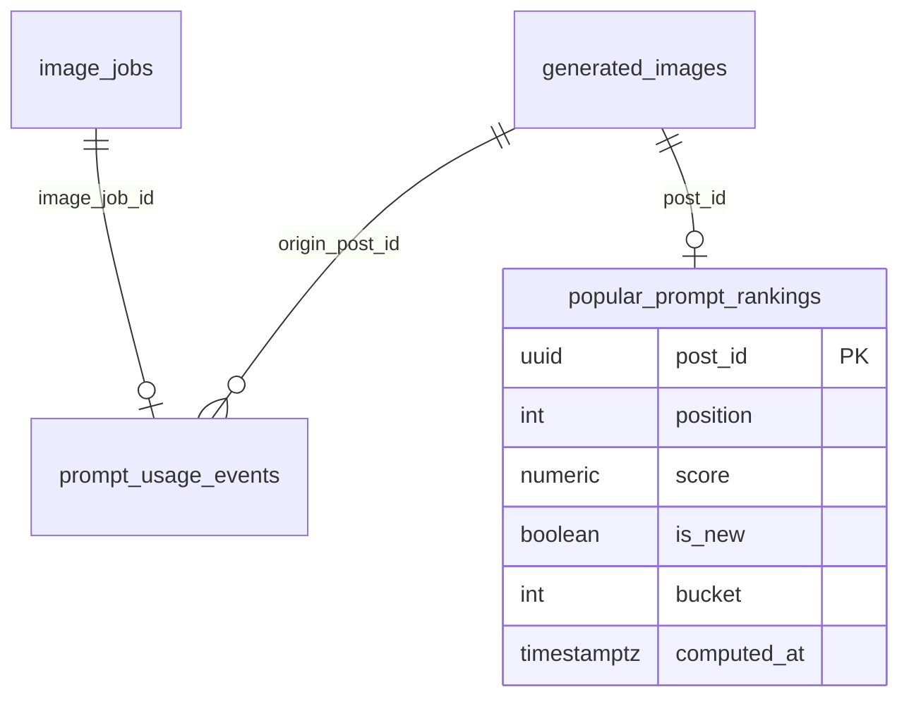
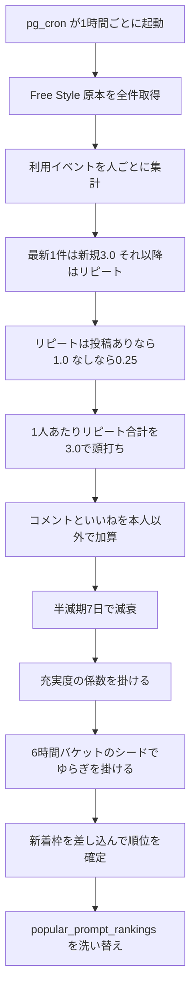
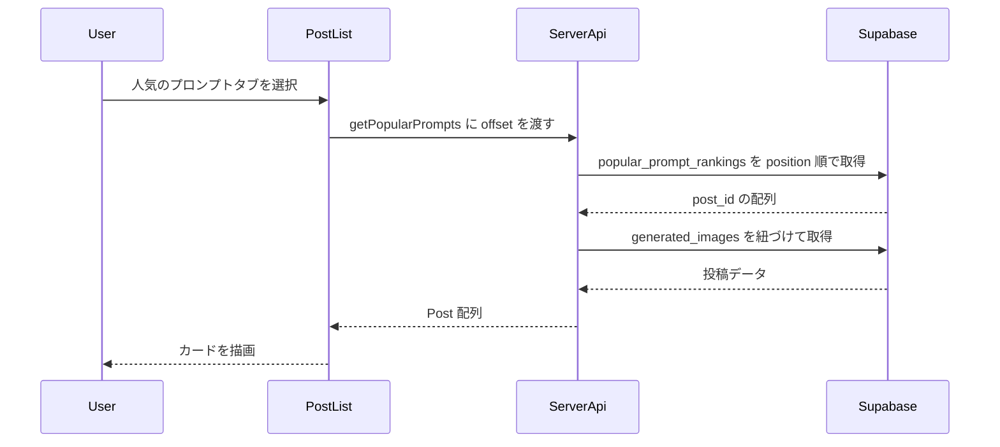
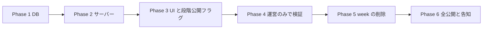

# 🔥人気のプロンプト タブ 実装計画

作成日: 2026-09-02

ホームの「オススメ」タブを廃止し、**Free Style 原本のみ**を対象とした
「🔥人気のプロンプト」タブへ置き換える。順位は pg_cron で事前計算し、
テーブルに保存したものを読むだけにする。

---

## コードベース調査結果

| 観点 | 調査結果 |
|---|---|
| 既存タブ | `features/posts/components/SortTabs.tsx` に3タブ。`sort="week"` が「オススメ」 |
| week の実装 | `features/posts/lib/server-api.ts:782` 付近。先週(日〜土)固定窓 + 週内いいね降順 + いいね0除外 |
| 1000行取得 | `sort !== "newest"` のとき `limit(1000)` して全件メモリソート（#579 と同型の温床） |
| キャッシュ | `CachedHomePostList` / `CachedHomePostListSection` が `cacheTag("home-posts-week")`。revalidate 側は**15箇所**が同タグを呼ぶ |
| pg_cron 前例 | `20260503120100_schedule_cleanup_temp_images_cron.sql`。**登録直後に `cron.alter_job(active := false)` で無効化**し、有効化は手動 |
| マテビュー前例 | **なし**。通常テーブル + cron が既存パターンに沿う |
| RPC 権限方針 | `20260831140000_tighten_rpc_anon_allowlist.sql`。anon は「未ログインから呼ばれる**必要がある**ものだけ」。service_role 判定は `is_trusted_lineage_writer()` を使う（`auth.uid()` では未ログインを弾けない） |
| 利用イベント | `prompt_usage_events`。`complete_image_job_with_prompt_secrets` 経由で **成功ジョブごとに1件**。投稿の有無は見ていない（`20260806150000_add_creator_usage_percoin_reward.sql:510`） |
| 生成→投稿の紐づけ | `image_jobs.result_image_url` = `generated_images.image_url` で追跡可能（実測 162件中127件が紐づく） |
| Before の判定 | `show_before_image` かつ `pre_generation_storage_path IS NOT NULL`。**全124件に元画像は保存済み**で、非表示の53件は編集で直せる |
| 編集可否 | `EditPostModal` は caption と show_before_image の両方を更新できる（`app/api/posts/post/route.ts:130`） |
| 段階公開の前例 | `isSearchAvailable(userId)` = `isSearchPubliclyEnabled() OR isAdminViewer(userId)`（`lib/env.ts:447`）。**UI を閉じるだけでは足りず API 側でも同じ関数で認可する**とコメントに明記されている（REQ-06b）。Creator Looks も `CREATOR_LOOKS_ENABLED` で Stage1=admin のみ → Stage3=全公開 |

---

## 1. 概要図

### データモデル



### 順位計算のフロー



### 表示のシーケンス



---

## 2. EARS（要件定義）

### 順位計算

- **When** the cron job runs, the system shall recompute the ranking for all Free Style original posts and replace the contents of `popular_prompt_rankings`.
  （cron 実行時、システムは Free Style 原本すべての順位を再計算し、テーブルを洗い替えなければならない）
- **While** a usage event belongs to the origin author, the system shall exclude it from the score.
  （利用イベントが原作者自身のものである間、システムはそれをスコアに含めてはならない）
- **Where** a repeat usage resulted in a posted image, the system shall weight it at 1.0; otherwise at 0.25.
  （リピート利用が投稿に至っている場合は1.0、そうでなければ0.25で重み付けする）
- **When** the repeat contribution of a single user exceeds 3.0, the system shall cap it at 3.0.
  （単一利用者のリピート寄与が3.0を超えるとき、システムは3.0で頭打ちにしなければならない）
- **If** the generated image cannot be traced from the job, **then** the system shall treat the usage as unposted.
  （ジョブから生成画像を追跡できない場合、システムはその利用を未投稿として扱う）

### 表示

- **When** a viewer selects the popular prompts tab, the system shall return posts ordered by the stored position.
  （閲覧者が人気のプロンプトタブを選んだとき、保存された順位で投稿を返す）
- **Where** a post was created within 24 hours, the system shall mark it as new and place it in a reserved slot.
  （直近24時間の投稿は新着として印を付け、確保された枠に配置する）
- **If** the ranking table is stale beyond the staleness threshold, **then** the system shall fall back to newest order.
  （順位テーブルが鮮度の閾値を超えて古い場合、システムは新着順にフォールバックする）
- **While** a post is blocked, reported, or not visible, the system shall exclude it from the tab.
  （ブロック済み・通報済み・非公開の投稿は、タブから除外する）

### 権限・段階公開

- **If** an unauthenticated client calls the recompute RPC, **then** the system shall reject the call.
  （未認証クライアントが再計算RPCを呼んだ場合、システムは拒否しなければならない）
- **While** the public flag is off, the system shall show the tab only to admin viewers.
  （公開フラグが off のあいだ、システムはタブを運営にのみ表示しなければならない）
- **If** a client requests the popular prompts sort while not permitted, **then** the system shall ignore the sort and return the newest order instead of an error.
  （許可されていないクライアントが当該ソートを要求した場合、エラーではなく新着順を返す。未公開機能の存在を失敗の仕方から推測させないため）

---

## 3. ADR

### ADR-001: 順位をリクエスト時ではなく事前計算にする

- **Context**: 減衰の計算に `now()` を使うため、同じ時間帯でもスコアが連続的に動く。リクエスト時計算 + `use cache` だと、キャッシュが外れた瞬間に2ページ目が別の順序で計算され、無限スクロールで重複・抜けが出る。
- **Decision**: pg_cron で1時間ごとに全件を計算し、`popular_prompt_rankings` に確定した順位を保存する。API は position 順に読むだけにする。
- **Reason**: 候補は124件しかなく計算量は無視できる。事前計算の利点は速度ではなく**順序の安定性**にある。加えて「なぜこの順位だったか」を後から追える。
- **Consequence**: 新しい投稿が最大1時間表示されない。cron が停止すると順位が固まるため、鮮度チェックとフォールバックが必須になる。

### ADR-002: 利用を「ユニーク人数」で数え、リピートを分離する

- **Context**: `prompt_usage_events` は成功した生成ごとに1件入るため、1人が繰り返せば件数が伸びる。実測で1人が8分間に4回生成した例がある。
- **Decision**: その人の**最新1件**を新規（3.0）、それ以降をリピートとして扱い、投稿に至ったかで 1.0 / 0.25 に分ける。リピート寄与は1人あたり3.0で頭打ち。
- **Reason**: 単純な回数だと、1人の操作で上位に到達できてしまう（実測ケースで3位相当まで浮上した）。「何人が動いたか」を主軸にすれば自己操作の余地が消える。
- **Consequence**: 「別のうちの子で作りたくてリピートした」ケースは直接判別できない（`source_image_stock_id` は派生生成では常に NULL）。投稿の有無を代理指標として使う。

### ADR-003: 閲覧数を指標から外す

- **Context**: `increment_view_count` は詳細ページを開くたびに加算する。本人の閲覧もリロードも数え、イベントテーブルが無いため減衰も期間指定もできない。投稿経過日との相関は 0.43。
- **Decision**: スコアから閲覧を除外する。
- **Reason**: 減衰できない・本人が無制限に増やせる・古い投稿ほど有利、の3点が揃う。寄与は約6%で、外しても順位はほとんど変わらない（実測で1件が9位→14位）。
- **Consequence**: 「よく見られている」という観点は失われる。必要になれば、閲覧イベントのテーブル化から着手する。

### ADR-004: 充実度を加点ではなく倍率にする

- **Context**: 説明文と Before の有無を評価に含めたい。ただしこれらは「人が何をしたか」ではなく「作者が何を書いたか」で、指標の種類が違う。
- **Decision**: 基礎スコアに 0.70〜1.00 の倍率として掛ける。上限1.00で、長く書くほど加点はしない。
- **Reason**: 加点にすると、誰にも使われていない投稿が充実度だけで上位に来て「人気」の看板と矛盾する。上限を設けることで、告知後の水増しを誘発しない。
- **Consequence**: 利用0の投稿は倍率が効かない（0 × 何でも 0）。充実させても順位が動かない層が残る。

### ADR-005: 「オススメ」タブを置き換える

- **Context**: 既存の `sort="week"` は先週(日〜土)の固定窓で、今週の投稿が一切出ず、土曜24時に全入れ替えして以降1週間不動だった。実測で対象154件中94件しか表示されていない。
- **Decision**: タブごと置き換え、`sort="week"` の実装を削除する。
- **Reason**: タブを4つに増やすとモバイル幅で折り返す。またオススメの再設計は別途検討中で、いま残しても改善されない。
- **Consequence**: 後日オススメを作る場合は再度追加になる。`daily` / `month` の分岐は使われていないが、`getLikeCountsByRangeBatch` が共有しているため今回は残す。

### ADR-006: 運営のみ → 全公開の2段階でリリースする

- **Context**: スコアの妥当性は本番データでしか確認できない。順位が不自然でも、公開してからでは戻しにくい。
- **Decision**: `NEXT_PUBLIC_POPULAR_PROMPTS_ENABLED` を追加し、`isPopularPromptsAvailable(userId)` = 公開フラグ **または** 運営かどうか で判定する。既存の `isSearchAvailable`（`lib/env.ts:447`）と同じ形にする。
- **Reason**: 同じ問題を検索機能で一度解いている。判定関数を1本に集約しておかないと、UI を隠したのに API が開いたままになる（REQ-06b でその事故が記録されている）。
- **Consequence**: 公開までのあいだ、cron は運営1人のために回り続ける。124件の計算なので負荷は無視できる。

---

## 4. 実装計画



**Phase 4 までは運営にしか見えない。** タブ自体が運営以外には描画されず、
API も同じ判定関数で閉じる。`sort="week"`（既存のオススメ）は Phase 5 まで残す。

### Phase 1: テーブルと再計算関数

**目的**: 順位を保存する器と、それを埋める関数を用意する。UI からはまだ使わない。
**ビルド確認**: マイグレーションのみ。アプリのビルドに影響しない。

- [ ] `popular_prompt_rankings` テーブルを作成（`post_id` PK / `position` / `score` / `is_new` / `bucket` / `computed_at`）
- [ ] `position` にインデックス。`computed_at` は鮮度判定に使う
- [ ] RLS: **全操作を拒否**し、`createAdminClient()`（service_role）からのみ読む
  - 既存の `style_usage_events` と同じ方式（`features/style/lib/style-popularity.ts` のコメント参照）
  - ⭐ SELECT を公開にすると、**段階公開中に PostgREST 経由で順位が読めてしまう**。公開前の機能の中身が漏れる
- [ ] `recompute_popular_prompts()` を SECURITY DEFINER で作成
  - 呼び出し元の検証は `is_trusted_lineage_writer()` を使う（`auth.uid()` では未ログインを弾けない。`20260831140000` 参照）
  - anon / authenticated から EXECUTE を剥がす
- [ ] 計算内容は「5. スコア定義」のとおり
- [ ] `supabase db push` 前に `supabase db diff` の結果をユーザーに提示する

### Phase 2: サーバーサイド

**目的**: 順位テーブルから投稿を取得する経路を作る。
**ビルド確認**: `npm run build -- --webpack` が通る。

- [ ] `features/posts/lib/popular-prompts-api.ts` を新規作成
  - `getPopularPrompts(limit, offset, currentUserId)` を実装
  - `popular_prompt_rankings` を position 順に取得（**`createAdminClient()` を使う。RLS 全拒否のため**）→ `generated_images` を引き当て → 既存の `enrichPosts` を再利用
  - ブロック・通報の除外は既存の `getVisibilityExclusions` を流用
  - `computed_at` が閾値（例: 3時間）より古ければ新着順にフォールバックし、`console.error` を残す
- [ ] `app/api/posts/route.ts` に `sort=popular_prompts` を追加（`validSorts` へ）
- [ ] `features/home/components/CachedPopularPromptsSection.tsx` を新規作成し、`cacheTag("popular-prompts")` / `cacheLife("minutes")` を付ける

### Phase 3: UI と段階公開フラグ

**目的**: タブとカードを出す。ただし**運営にしか見えない状態**にする。
**ビルド確認**: `npm run build -- --webpack` と `npm run test` が通る。

- [ ] `lib/env.ts` に `NEXT_PUBLIC_POPULAR_PROMPTS_ENABLED` を追加
- [ ] `isPopularPromptsPubliclyEnabled()` と `isPopularPromptsAvailable(userId)` を実装
  - **既存の `isSearchAvailable`（`lib/env.ts:447`）をそのまま模倣する**
  - 判定の入口はこの関数1本に集約する。フラグ単体で分岐すると、運営に開けたつもりの導線が閉じる
- [ ] `SortType` に `"popular_prompts"` を追加
- [ ] `SortTabs.tsx`: `isPopularPromptsAvailable` が false ならタブ自体を出さない
- [ ] **`app/api/posts/route.ts` でも同じ関数で認可する**
  - UI を隠すだけでは足りない。この API は認証不要で `sort` を受けるため、直接叩けば取得できてしまう（検索で踏んだ REQ-06b と同型）
  - 許可されていない相手には `sort` を無視して新着順を返す（エラーにしない。未公開機能の存在を失敗の仕方から推測させないため）
- [ ] `PostList.tsx` に分岐を追加。`initialPostsForWeek` は `initialPopularPrompts` へ置き換え
- [ ] 🆕 ラベルのコンポーネントを追加（プリセット側の NEW バッジとは**別の定数**にする。あちらは14日窓で意味が違う）
- [ ] 15ロケールに文言を追加（タブ名・空状態・🆕ラベル）
- [ ] 空状態の文言を用意（現在は `postsT("preparing")` を流用している）

### Phase 4: 運営のみで検証

**目的**: 本番データで順位の妥当性を確かめる。ユーザーには一切見えない。
**ビルド確認**: 影響なし。

- [ ] 本番へマイグレーション適用（`supabase db push`）
- [ ] cron を有効化する（`cron.alter_job(active := true)`）
  - マイグレーションでは既存方針どおり **inactive で投入**済み。ここで初めて動かす
  - 有効化はユーザー承認を得てから行う
- [ ] cron を手動で1回実行し、`popular_prompt_rankings` の中身を SQL で確認
- [ ] 運営アカウントで実機確認（Top30 の顔ぶれ、🆕ラベル、空状態、モバイル幅）
- [ ] **数日運用して順位の動きを観察する**
  - 上位が固定化していないか
  - 新着枠が機能しているか（初回利用の中央値6時間に間に合っているか）
  - 充実度の係数が意図どおり効いているか
- [ ] 必要なら係数を調整する（この段階なら誰にも影響しない）

### Phase 5: `sort="week"` の削除

**目的**: 置き換え元を消す。
**ビルド確認**: `npm run lint` / `typecheck` / `test` / `build` がすべて通る。

- [ ] `server-api.ts` の `sort === "week"` 分岐を削除
- [ ] `getJSTLastWeekStart` / `getJSTLastWeekEnd` の利用箇所を確認して削除（`getLikeCountsByRangeBatch` の `range === "week"` は残す）
- [ ] `SortType` から `"week"` を削除。`utils.ts` / `app/api/posts/route.ts` の `validSorts` も更新
- [ ] `CachedHomePostList` の `getPosts(..., "week", ...)` を削除
- [ ] `cacheTag("home-posts-week")` を `"popular-prompts"` へ置換（**revalidate 側15箇所**を漏れなく更新すること）
- [ ] `tests/unit/components/post-list.test.tsx` の week ケースを差し替え

### Phase 6: 全公開と告知

**目的**: 全ユーザーへ開放する。
**ビルド確認**: 影響なし。

- [ ] `NEXT_PUBLIC_POPULAR_PROMPTS_ENABLED=true` を本番に設定して再デプロイ
- [ ] お知らせを出す（ロジックは書かず「Before と説明文があると上位に出やすい」のみ）
- [ ] 公開後、Before の表示率と説明文の充足率が上がるかを観察する
  - 現状の基準線: Before あり 71/124（57%）、説明文10字以上 60/124（48%）

**閉じ直すのは `NEXT_PUBLIC_POPULAR_PROMPTS_ENABLED` を消して再デプロイするだけ。**
（検索機能と同じ運用）

---

## 5. スコア定義（実装の正本）

```
■ 利用（本人以外のみ）
  その人の最新1件      → 3.0
  それ以降のリピート    → 投稿に至った 1.0 ／ 至らない 0.25
                         （ジョブから画像を追跡できない場合は「至らない」扱い）
  ★ リピートの合計は1人あたり 3.0 で頭打ち

■ その他
  コメント  本人以外のユニーク投稿者数 × 1.5
  いいね    本人以外 × 1.0
  閲覧      指標に含めない

■ 減衰（各イベントの発生日に適用）
  weight = 0.5 ^ (経過日 ÷ 7)

■ 充実度（基礎スコアに掛ける倍率）
  0.70
  + 説明文  9字以下 +0 ／ 10字〜 +0.05 ／ 30字〜 +0.10 ／ 100字〜 +0.15
  + Before  あり +0.15
  → 0.70 〜 1.00

■ 表示順
  スコア × ゆらぎ（±15%・md5(post_id + 6時間バケット) から決定）
  新着枠: 直近24時間の投稿を3件、2〜9番目に散らす（位置もバケットで決まる）
  作者上限: なし
```

**対象**: `is_posted = true` かつ `moderation_status = 'visible'` かつ
`generation_type = 'free'` かつ `source_post_id IS NULL`（＝原本のみ）。
利用者数による絞り込みは行わない。

---

## 6. 修正対象ファイル一覧

| ファイル | 操作 | 変更内容 |
|---|---|---|
| `supabase/migrations/2026xxxx_add_popular_prompt_rankings.sql` | 新規 | テーブル・RLS・`recompute_popular_prompts()` |
| `supabase/migrations/2026xxxx_schedule_popular_prompts_cron.sql` | 新規 | cron 登録（inactive で投入） |
| `features/posts/lib/popular-prompts-api.ts` | 新規 | 順位テーブルから投稿を取得 |
| `features/home/components/CachedPopularPromptsSection.tsx` | 新規 | `use cache` ラッパ |
| `features/posts/components/SortTabs.tsx` | 修正 | タブの入れ替え |
| `features/posts/components/PostList.tsx` | 修正 | 分岐の差し替え・🆕ラベル |
| `features/posts/components/CachedHomePostList.tsx` | 修正 | week の取得を削除 |
| `features/posts/lib/server-api.ts` | 修正 | `sort === "week"` 分岐の削除 |
| `features/posts/lib/date-utils.ts` | 修正 | 未使用になる関数の削除 |
| `features/posts/types.ts` | 修正 | `SortType` の更新 |
| `features/posts/lib/utils.ts` | 修正 | `validSorts` の更新 |
| `app/api/posts/route.ts` | 修正 | `validSorts` の更新 |
| revalidate 呼び出し **15ファイル** | 修正 | `home-posts-week` → `popular-prompts` |
| `messages/*.ts`（15言語） | 修正 | タブ名・空状態・🆕ラベル |
| `tests/unit/...` | 修正 | week ケースの差し替え、スコア計算のテスト追加 |

---

## 7. 品質・テスト観点

### 品質チェックリスト

- [ ] **権限**: `recompute_popular_prompts()` から anon / authenticated の EXECUTE を剥がしたか
- [ ] **service_role 判定**: `auth.uid()` ではなく `is_trusted_lineage_writer()` を使ったか
- [ ] **RLS**: 順位テーブルの SELECT が公開投稿のみを露出しているか
- [ ] **除外**: ブロック済み・通報済みの投稿が読み出し時に除外されるか
- [ ] **i18n**: 15言語すべてに文言があるか
- [ ] **1000行問題**: DB 側で完結し、PostgREST の行上限に依存しないか（#579 と同型を作らない）

### テスト観点

| カテゴリ | 内容 |
|---|---|
| スコア計算 | 自己利用の除外／リピートの投稿有無で重みが変わる／1人あたり上限3.0／減衰の境界 |
| 追跡不能ケース | ジョブから画像を引けないとき未投稿扱いになる |
| 充実度 | 0字・9字・10字・29字・30字・99字・100字の境界／Before の有無 |
| ゆらぎ | 同じ post_id と同じバケットなら必ず同じ値（ページネーション整合） |
| フォールバック | `computed_at` が古いとき新着順に倒れる |
| 権限 | 未ログイン・一般ユーザーから再計算RPCを呼べない |
| 実機 | 🆕ラベルの表示、空状態、モバイル幅でのタブ折り返し |

---

## 8. ロールバック方針

- **Phase 1〜4**: タブは運営にしか見えない。ユーザーへの影響はゼロ
- **Phase 6 の全公開後**: `NEXT_PUBLIC_POPULAR_PROMPTS_ENABLED` を消して再デプロイするだけで閉じる（検索機能と同じ運用）
- **Phase 5（week の削除）**: ここだけは revert が必要になる。**単独コミット**にする
  - ⭐ 全公開前に week を消すと、閉じ直したときにオススメも人気タブも無い状態になる。**Phase 5 は Phase 6 の後ろに回してもよい**
- **cron**: `cron.alter_job(active := false)` で即座に止まる。順位テーブルは残るが、鮮度チェックが働いて新着順に倒れる
- **テーブル**: `popular_prompt_rankings` は派生データのみを持つ。DROP しても元データは失われない

---

## 9. 未確定事項

| # | 内容 |
|---|---|
| 1 | cron を1時間ごとにすると、新着枠の反映遅延は最大1時間。初回利用の中央値が6時間なので許容範囲と判断しているが、要確認 |
| 2 | 追跡できない利用イベント35件（162件中）は「未投稿」に倒す。将来 `image_jobs` と `generated_images` を明示的に紐づける列を足すかは別途 |
| 3 | お知らせ文の最終文面 |

---

## 10. 使用スキル

| スキル | 用途 | フェーズ |
|---|---|---|
| `/project-database-context` | DB設計の参照 | Phase 1 |
| `/git-create-branch` | ブランチ作成 | 実装開始時 |
| `/tdd` | スコア計算のテスト先行 | Phase 1〜2 |
| `/codex-webpack-build` | ビルド検証 | 各フェーズ |
| `/git-create-pr` | PR作成 | 完了時 |
