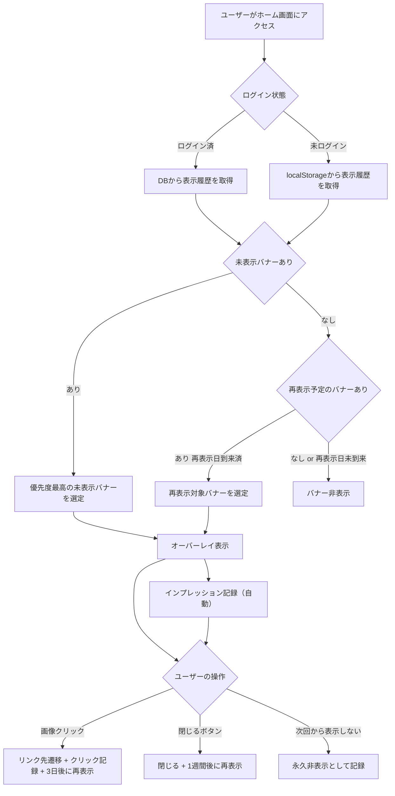
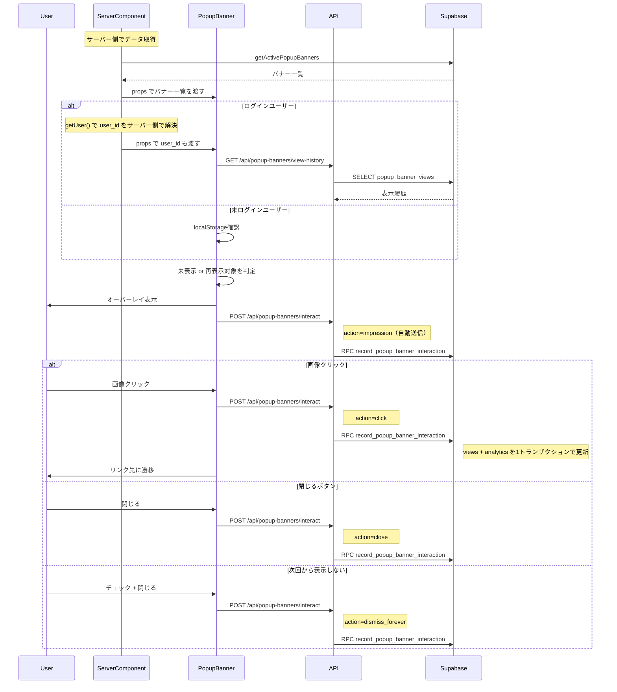
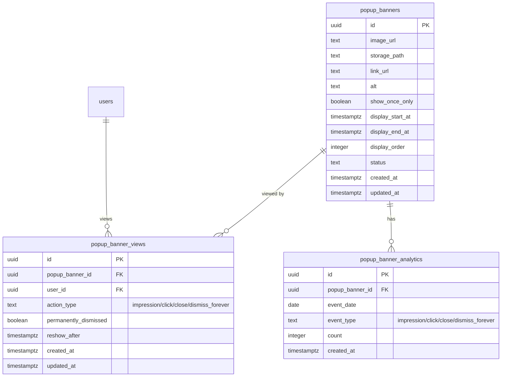
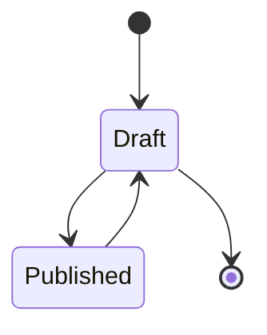
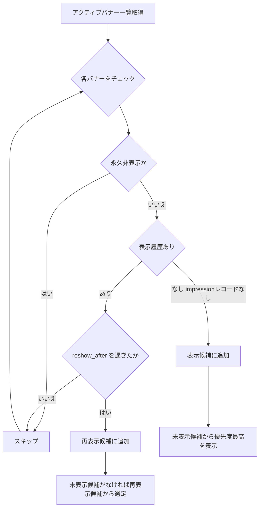
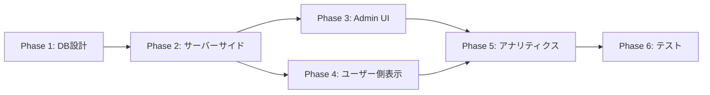

# ポップアップバナー機能 実装計画

作成日: 2026-03-25
更新日: 2026-03-26（Rev.3: impression追跡・セキュリティ強化）

## コードベース調査結果

計画作成にあたり、以下を調査済み：

- **Supabase接続**: 確認済み。既存 `banners` テーブル（4件のpublishedレコード）を確認
- **既存バナー機能**: `features/banners/` のパターン（schema, storage, validation, get-banners）を踏襲
- **Admin UIパターン**: `app/(app)/admin/banners/` の構成（`page.tsx` + `BannerListClient.tsx` + `BannerForm.tsx` + `BannerPreview.tsx`）を踏襲
- **Admin認証**: ページ認証は `getUser()` + `getAdminUserIds()` パターン、API認証は `requireAdmin()` パターン（用途で使い分け）
- **ドラッグ&ドロップ**: `@dnd-kit/*` ライブラリ使用
- **画像処理**: WebP変換（`convertToWebP` from `@/features/generation/lib/webp-converter`、maxWidth: 1280, quality: 85）
- **キャッシュ**: `"use cache"` + `cacheLife("minutes")` + `cacheTag()` パターン
- **Recharts**: v3.7.0インストール済み。`features/admin-dashboard/components/AdminTrendChart.tsx` を参考
- **Admin Nav**: `app/(app)/admin/admin-nav-items.ts` にアイテム追加
- **ホーム画面**: `app/[locale]/page.tsx` でサーバー側で `getUser()` と `getPublicBanners()` を解決済み。ポップアップバナーも同様にサーバーコンポーネントからpropsで渡す（クライアント側API待ちを回避）
- **UIライブラリ**: shadcn/ui（Dialog, Button, Input, Tabs, Badge, Card, AlertDialog, DropdownMenu）
- **リンク安全性**: `isValidLinkUrl()` で `https://` または内部 `/` パスのみ許可（既存 `banners/lib/validation.ts`）

---

## 1. 概要図

### ユーザー操作フロー

### API通信シーケンス

### データモデル

### バナー状態遷移

注: `display_end_at` を過ぎたバナーは自動的に非表示となるため、Archived状態は不要。ステータスは `draft | published` の2状態のみ。

### 表示判定ロジック

---

## 2. EARS（要件定義）

### ユーザー側表示

| ID | タイプ | EARS文 |
|----|--------|--------|
| PB-001 | イベント駆動 | When a user accesses the home page, the system shall check for unviewed popup banners and display the highest-priority one as a centered overlay with a semi-transparent black background. / ユーザーがホーム画面にアクセスした場合、システムは未表示のポップアップバナーを確認し、最も優先度の高いものを半透明黒背景のオーバーレイとして画面中央に表示する。 |
| PB-002 | イベント駆動 | When the user clicks the banner image and a link_url is set, the system shall navigate to the link_url, record a click event, and set the banner to re-show after 3 days. / ユーザーがバナー画像をクリックし、link_urlが設定されている場合、システムはlink_urlに遷移し、クリックイベントを記録し、3日後に再表示する設定を保存する。 |
| PB-003 | イベント駆動 | When the user clicks the close button, the system shall close the overlay and set the banner to re-show after 7 days. / ユーザーが閉じるボタンをクリックした場合、システムはオーバーレイを閉じ、7日後に再表示する設定を保存する。 |
| PB-004 | イベント駆動 | When the banner has show_once_only enabled and the user checks "Don't show again" before closing, the system shall permanently dismiss that banner for the user. / バナーにshow_once_onlyが有効で、ユーザーが「次回から表示しない」にチェックを入れて閉じた場合、システムはそのバナーを永久に非表示にする。 |
| PB-005 | 状態駆動 | While all banners have an impression record and none have reached their re-show date, the system shall not display any popup. / 全てのバナーにインプレッション記録（action_type=impression）があり、再表示日に達したものがない間、システムはポップアップを表示しない。 |
| PB-006 | 状態駆動 | While the user is not logged in, the system shall store view history and dismissal data in localStorage. / ユーザーが未ログインの間、システムは表示履歴と非表示データをlocalStorageに保存する。 |
| PB-007 | 状態駆動 | While unviewed banners exist, the system shall prioritize them over banners pending re-show. / 未表示のバナーが存在する間、システムは再表示待ちのバナーよりも未表示バナーを優先する。 |
| PB-008 | 異常系 | If no published popup banners exist within the display period, then the system shall not render the popup overlay. / 表示期間内の公開中ポップアップバナーが存在しない場合、システムはポップアップオーバーレイを表示しない。 |
| PB-009 | イベント駆動 | When a popup banner is displayed to the user, the system shall automatically record an impression event before the user interacts. / ポップアップバナーがユーザーに表示された時点で、システムはユーザー操作前に自動的にインプレッションイベントを記録する。 |

### Admin管理

| ID | タイプ | EARS文 |
|----|--------|--------|
| PB-010 | イベント駆動 | When an admin creates a popup banner, the system shall upload the image to Supabase Storage (WebP converted, 3:4 aspect ratio) and store metadata including the show_once_only setting. / 管理者がポップアップバナーを作成した場合、システムは画像をSupabase Storageにアップロード（WebP変換、3:4アスペクト比）し、show_once_only設定を含むメタデータをDBに保存する。 |
| PB-011 | イベント駆動 | When an admin updates a popup banner, the system shall update the metadata and optionally replace the image. / 管理者がポップアップバナーを更新した場合、システムはメタデータを更新し、任意で画像を差し替える。 |
| PB-012 | イベント駆動 | When an admin deletes a popup banner, the system shall remove the database record and the image from Storage. / 管理者がポップアップバナーを削除した場合、システムはDBレコードとStorage上の画像を削除する。 |
| PB-013 | イベント駆動 | When an admin reorders popup banners via drag-and-drop, the system shall update display_order for all affected banners. / 管理者がドラッグアンドドロップでポップアップバナーを並べ替えた場合、システムは影響する全バナーのdisplay_orderを更新する。 |
| PB-014 | 状態駆動 | While viewing the popup banner admin page, the system shall display daily impression and click counts as a line chart (Recharts). / ポップアップバナー管理画面を表示中、システムは日別のインプレッション数とクリック数を折れ線グラフ（Recharts）で表示する。 |

### セキュリティ・権限

| ID | タイプ | EARS文 |
|----|--------|--------|
| PB-020 | 状態駆動 | While a user is not an admin, the system shall deny INSERT, UPDATE, and DELETE operations on popup_banners via RLS. / ユーザーが管理者でない間、システムはRLSによりpopup_bannersへのINSERT/UPDATE/DELETE操作を拒否する。 |
| PB-021 | 異常系 | If a link_url contains a non-https protocol or dangerous pattern, then the system shall reject the input. / link_urlがhttps以外のプロトコルや危険なパターンを含む場合、システムは入力を拒否する。 |
| PB-022 | 状態駆動 | While processing an interact request, the system shall resolve user_id from the server-side session (getUser()), never from the client request body. / インタラクトリクエスト処理中、システムはuser_idをサーバーサイドのセッション（getUser()）から解決し、クライアントのリクエストボディからは受け取らない。 |
| PB-023 | 異常系 | If a dismiss_forever action is requested for a banner with show_once_only=false, then the system shall reject the request with an error. / show_once_only=falseのバナーに対してdismiss_foreverアクションが要求された場合、システムはエラーで拒否する。 |

---

## 3. ADR（設計判断記録）

### ADR-001: 表示履歴をpopup_banner_viewsテーブルで管理する

- **Context**: バナーの表示済み/未表示の判定、再表示日の管理、永久非表示の記録が必要。dismissalsテーブルとviewsテーブルを分けるか、統合するか。
- **Decision**: `popup_banner_views` テーブルに `action_type`（impression/click/close/dismiss_forever）、`reshow_after`（再表示日時）、`permanently_dismissed`（永久非表示フラグ）を持たせ、1テーブルで管理する。バナー表示時に `impression` を自動記録し、ユーザー操作時に `click/close/dismiss_forever` で上書きUPSERTする。
- **Reason**: 表示判定時に1テーブルをクエリするだけで全ての判定が可能。`impression` レコードの有無で「閲覧済み」を正確に判定できる（操作なしで閉じた場合も閲覧済みとなる）。テーブルを分けると JOIN が必要になり複雑化する。
- **Consequence**: 1ユーザー x 1バナーにつき1レコード（UPSERT）。データ量は限定的。`impression` 記録時は `reshow_after` を設定しない（操作されるまで再表示判定に影響しない）。

### ADR-002: interactエンドポイントはSQL RPCで原子的に処理する

- **Context**: ユーザー操作（クリック/閉じる/永久非表示）時に `popup_banner_views` と `popup_banner_analytics` の2テーブルを更新する必要がある。アプリ側で2回UPSERTするか、SQL RPCで1トランザクションにまとめるか。
- **Decision**: `record_popup_banner_interaction(p_banner_id uuid, p_user_id uuid, p_action_type text)` SQL RPCを作成し、views と analytics の更新を1トランザクションで行う。`p_user_id` はAPIエンドポイント側でサーバーサイドの `getUser()` から解決し、クライアントからは受け取らない。`p_action_type = 'dismiss_forever'` の場合、RPC内で対象バナーの `show_once_only` フラグを検証し、`false` の場合はエラーを返す。
- **Reason**: リポジトリの設計方針（`docs/architecture/data.ja.md`）に従い、複数テーブルに跨る処理はSQL RPCに寄せる。アプリ側の2回UPSERTでは片方だけ成功した場合に再表示判定と集計がずれるリスクがある。`p_user_id` をサーバー側で解決することで、なりすましを防止する。`show_once_only` の検証をRPC内で行うことで、ビジネスルールをDB側で強制する。
- **Consequence**: RPCの冪等性をDB側で担保できる。interactエンドポイントはRPCを1回呼ぶだけでシンプルになる。セキュリティ検証がDB層に集約される。

### ADR-003: アナリティクスを集計テーブルで管理する

- **Context**: バナーの表示回数・クリック数を日別で記録する必要がある。1行1イベントの生ログ方式と、日別集計テーブル方式がある。
- **Decision**: `popup_banner_analytics` テーブルで `(popup_banner_id, event_date, event_type)` ごとに `count` を持つ集計方式を採用する。
- **Reason**: 生ログ方式はデータ量が膨大になる。集計テーブルならUPSERT（`ON CONFLICT DO UPDATE count = count + 1`）で効率的に記録でき、グラフ表示時のクエリも軽い。
- **Consequence**: 個別ユーザーの行動追跡はできないが、要件上不要。

### ADR-004: 未ログインユーザーの表示履歴はlocalStorageで管理する

- **Context**: 未ログインユーザーの表示履歴・再表示日・永久非表示をどこに保存するか。
- **Decision**: `localStorage` に `{ bannerId: { action, reshowAfter, permanentlyDismissed } }` のJSON形式で保存する。
- **Reason**: 未ログインユーザーのためにDBレコードを作るのは過剰。ブラウザを変えればリセットされるが、未ログインユーザーに対してはこの程度で十分。
- **Consequence**: ブラウザ・デバイス間で同期されない。シークレットモードでは毎回表示される。

### ADR-005: 既存バナーテーブルとは別テーブルにする

- **Context**: 既存の `banners` テーブル（ホームカルーセル用、現在4件の公開レコード）に統合するか、別テーブルにするか。
- **Decision**: `popup_banners` として別テーブルを作成する。
- **Reason**: 既存 `banners` テーブルは `link_url NOT NULL`、`tags` カラムなど構造が異なる。表示制御ロジック（未表示追跡、再表示日、永久非表示）やアナリティクスも大きく異なる。統合すると `type` カラムによる分岐が複雑になり、既存バナー機能への影響リスクも生じる。
- **Consequence**: スキーマが類似するテーブルが2つ存在するが、独立性により安全に開発・運用できる。

### ADR-006: 再表示間隔をアクション種別で固定する

- **Context**: 再表示までの間隔をAdmin側で設定可能にするか、アクション種別ごとに固定するか。
- **Decision**: 画像クリック=3日後、閉じるボタン=7日後で固定する。
- **Reason**: シンプルさを優先。Admin側の設定項目が増えると運用が複雑になる。将来的にAdmin設定にする場合はカラム追加で対応可能。
- **Consequence**: 間隔変更にはコード修正が必要だが、頻繁に変わる想定はない。

### ADR-007: 既存バナー機能の実装パターンを踏襲する

- **Context**: Admin UI、Storage、キャッシュ、バリデーション等をどのパターンで実装するか。
- **Decision**: 既存 `banners` 機能のパターンを踏襲する。具体的には以下の通り：
  - Admin認証: ページは `getUser()` + `getAdminUserIds()` パターン、APIは `requireAdmin()` パターン
  - Admin UIコンポーネント: `app/(app)/admin/popup-banners/` 配下に配置（`features/` ではなくページ近接配置）
  - Storage: `convertToWebP()` による WebP変換、バケット `popup-banners`（public, 5MB制限）
  - キャッシュ: `"use cache"` + `cacheLife("minutes")` + `cacheTag("popup-banners")`
  - バリデーション: `isValidLinkUrl()` を既存 `banners/lib/validation.ts` から再利用
  - D&D: `@dnd-kit/*` ライブラリ
  - グラフ: Recharts v3.7.0（`AdminTrendChart.tsx` の実装パターンを参考）
- **Reason**: 既存パターンに統一することで、コードベースの一貫性を保ち、学習コストを下げる。
- **Consequence**: 既存パターンの制約を受けるが、実績あるパターンのため安全。

---

## 4. 実装計画（フェーズ＋TODO）

### フェーズ間の依存関係

### Phase 1: データベース設計とマイグレーション

**目的**: ポップアップバナーに必要な3テーブルを作成し、RLS・インデックスを設定する
**ビルド確認**: マイグレーション適用後にSupabase型生成が通ること
**参考**: 既存 `supabase/migrations/20260223000000_add_banners_table.sql` のパターン

- [ ] `popup_banners` テーブルのマイグレーション作成
  - 既存 `banners` テーブル構造を参考に、`show_once_only` boolean カラム追加
  - `link_url` は nullable（既存 `banners` は NOT NULL だが、popup はリンクなしも許可）
  - `alt` は NOT NULL（既存パターン踏襲）
  - `status` は `'draft' | 'published'`（既存パターン踏襲）
  - `tags` カラムは不要（ポップアップバナーにはタグ機能なし）
  - `updated_at` 自動更新トリガー設定
- [ ] `popup_banner_views` テーブルのマイグレーション作成（ユニーク制約: `popup_banner_id, user_id`）
- [ ] `popup_banner_analytics` テーブルのマイグレーション作成（ユニーク制約: `popup_banner_id, event_date, event_type`）
- [ ] RLSポリシー設定（既存 `banners` のRLSパターン踏襲）
  - popup_banners: SELECTは全員（`true`）、CUDはService Roleのみ
  - popup_banner_views: SELECTは自分のレコードのみ（`auth.uid() = user_id`）、INSERT/UPDATEはService Roleのみ（RPCから操作）
  - popup_banner_analytics: 全操作Service Roleのみ（RPCから操作。未ログインユーザーのイベントもAPI経由でservice roleが書き込む）
- [ ] インデックス設定（`idx_popup_banners_public_list` on `display_order WHERE status='published'`、analyticsの `event_date`）
- [ ] SQL RPC `record_popup_banner_interaction(p_banner_id uuid, p_user_id uuid, p_action_type text)` 作成
  - `p_action_type` は `impression | click | close | dismiss_forever` の4種
  - 1トランザクションで `popup_banner_views` のUPSERT + `popup_banner_analytics` のUPSERT を実行
  - `impression`: views に記録（reshow_after=null、permanently_dismissed=false）。表示済みフラグとして機能
  - `click`: views を更新（reshow_after=3日後）
  - `close`: views を更新（reshow_after=7日後）
  - `dismiss_forever`: views を更新（permanently_dismissed=true）。**事前に `popup_banners.show_once_only` を確認し、`false` の場合は `RAISE EXCEPTION` でエラーを返す**
  - analytics は `ON CONFLICT (popup_banner_id, event_date, event_type) DO UPDATE SET count = count + 1`
  - p_user_id が null の場合（未ログイン）は views の更新をスキップし、analytics のみ記録
- [ ] Supabase型定義の再生成（`npx supabase gen types typescript`）

### Phase 2: サーバーサイド実装

**目的**: CRUD・表示判定・アナリティクス記録のAPIを実装する
**ビルド確認**: 全APIルートが型エラーなくビルドできること
**参考**: 既存 `features/banners/lib/` および `app/api/admin/banners/` のパターン

- [ ] `features/popup-banners/lib/schema.ts` — 型定義（PopupBanner, PopupBannerInsert, PopupBannerUpdate。既存 `banners/lib/schema.ts` の構成を参考）
- [ ] `features/popup-banners/lib/popup-banner-storage.ts` — 画像アップロード/削除
  - 既存 `banners/lib/banner-storage.ts` を参考
  - バケット: `popup-banners`（public: true, 5MB, jpeg/png/webp許可）
  - WebP変換: `convertToWebP()` 使用（maxWidth: 1280, quality: 85）
  - 3:4アスペクト比の検証またはリサイズ
- [ ] `features/popup-banners/lib/validation.ts` — link_url バリデーション（既存 `isValidLinkUrl()` を再利用/import）
- [ ] `features/popup-banners/lib/popup-banner-repository.ts` — DB操作（CRUD、優先度順取得、アクティブバナー取得）
- [ ] `features/popup-banners/lib/popup-banner-view-repository.ts` — 表示履歴の取得専用（書き込みはRPC経由のため、この層ではSELECTのみ）
- [ ] `features/popup-banners/lib/get-active-popup-banners.ts` — 公開中かつ表示期間内のバナー一覧取得（`"use cache"` + `cacheLife("minutes")` + `cacheTag("popup-banners")`。既存 `get-banners.ts` を参考）
- [ ] `app/api/admin/popup-banners/route.ts` — GET（一覧）, POST（作成）。`requireAdmin()` で認証。既存 `app/api/admin/banners/route.ts` を参考
- [ ] `app/api/admin/popup-banners/[id]/route.ts` — PATCH（更新）, DELETE（削除）。`requireAdmin()` で認証。既存の `banners/[id]/route.ts` の PATCH パターンを踏襲
- [ ] `app/api/admin/popup-banners/reorder/route.ts` — POST（並び替え）。`requireAdmin()` で認証。既存 `app/api/admin/banners/reorder/route.ts` を参考
- [ ] `app/api/popup-banners/view-history/route.ts` — GET（ログインユーザーの表示履歴取得。`createClient()` + RLS で本人のみ）
- [ ] `app/api/popup-banners/interact/route.ts` — POST（impression/クリック/閉じる/永久非表示の統一エンドポイント。`createAdminClient()` で RPC `record_popup_banner_interaction` を呼び出し。未ログインユーザーも利用可能）
  - **`p_user_id` はサーバーサイドの `getUser()` から取得**（クライアントのリクエストボディからは受け取らない。未ログイン時は `null`）
  - リクエストボディは `{ banner_id, action_type }` のみ（user_id は含めない）
- [ ] `app/api/admin/popup-banners/[id]/analytics/route.ts` — GET（日別アナリティクスデータ取得。`requireAdmin()` で認証）

### Phase 3: Admin管理画面

**目的**: ポップアップバナーのCRUD管理画面を実装する
**ビルド確認**: `/admin/popup-banners` ページが表示・操作できること
**参考**: 既存 `app/(app)/admin/banners/` の構成（page.tsx + BannerListClient.tsx + BannerForm.tsx + BannerPreview.tsx）

- [ ] `app/(app)/admin/popup-banners/page.tsx` — サーバーコンポーネント
  - `getUser()` + `getAdminUserIds()` でページ認証（既存 `admin/banners/page.tsx` パターン踏襲。APIは別途 `requireAdmin()` を使用）
  - `createAdminClient()` でデータフェッチ
  - Card + CardHeader + CardTitle レイアウト
- [ ] `app/(app)/admin/popup-banners/PopupBannerListClient.tsx` — 一覧表示（ページ近接配置、既存パターン踏襲）
  - `@dnd-kit/*` によるドラッグアンドドロップ並び替え
  - ステータスバッジ（Badge コンポーネント）
  - 作成/編集: Dialog コンポーネント
  - 削除: AlertDialog コンポーネント
  - モバイル: DropdownMenu、デスクトップ: インラインボタン
  - Toast 通知（成功/エラー）
- [ ] `app/(app)/admin/popup-banners/PopupBannerForm.tsx` — 作成/編集フォーム
  - 画像アップロード（プレビュー付き、3:4アスペクト比）
  - link_url（nullable）、alt（必須）、表示期間（display_start_at / display_end_at）
  - display_order、status（draft/published）
  - **show_once_only トグル**（Switch コンポーネント）
  - FormData による送信（既存パターン踏襲）
  - 日時入力: UTC/ローカル変換（既存パターン踏襲）
- [ ] `app/(app)/admin/popup-banners/PopupBannerPreview.tsx` — プレビュー（3:4比率での表示確認）
- [ ] `messages/ja.json` — 日本語翻訳キー追加（popupBanners セクション）
- [ ] `messages/en.json` — 英語翻訳キー追加
- [ ] `app/(app)/admin/admin-nav-items.ts` — ナビゲーションアイテム追加
  - `{ path: "/admin/popup-banners", label: "ポップアップバナー", description: "ポップアップバナーの管理", iconKey: "image" }`

### Phase 4: ユーザー側ポップアップ表示

**目的**: ホーム画面でポップアップバナーを表示する
**ビルド確認**: ホーム画面でポップアップが正しく表示・非表示されること
**参考**: 既存 `features/home/components/HomeBannerCard.tsx` のリンク処理（`getSafeLinkUrl()`）

- [ ] `features/popup-banners/components/PopupBannerOverlay.tsx` — オーバーレイコンポーネント
  - shadcn Dialog コンポーネント使用
  - 半透明黒背景（既存パターン: bg-black/50）
  - 3:4画像表示（Next.js Image コンポーネント）
  - 閉じるボタン（X アイコン）
  - 条件付き「次回から表示しない」チェックボックス（show_once_only が true の場合のみ表示）
  - リンク処理: 外部URLは新しいタブ、内部URLはNext.js Link（既存 `HomeBannerCard.tsx` パターン踏襲）
- [ ] `features/popup-banners/lib/popup-banner-display-logic.ts` — 表示判定ロジック
  - 未表示バナー優先、再表示日チェック、永久非表示除外
  - 優先度（display_order）順でソート
- [ ] `features/popup-banners/hooks/usePopupBanner.ts` — 表示制御カスタムフック
  - ログイン/未ログイン分岐
  - localStorage管理（未ログイン用）
  - view-history API呼び出し（ログインユーザー用）
  - バナー一覧はpropsから受け取る（APIフェッチ不要）
- [ ] `app/[locale]/page.tsx` にPopupBannerOverlayを組み込み
  - サーバーコンポーネントで `getActivePopupBanners()` を呼び出し、結果をpropsで渡す（既存 `getPublicBanners()` → `HomeBannerList` と同じパターン。クライアント側のAPI待ちを回避）
- [ ] インプレッション自動記録: バナー表示時に `action_type=impression` を `/api/popup-banners/interact` へ自動送信（ユーザー操作前）
  - **二重送信防止**: `useRef` 等で同一バナーに対するimpression送信済みフラグを管理し、再レンダー・再マウント時の過剰加算を防ぐ
- [ ] クリック/閉じる/永久非表示の操作記録: ユーザー操作時に対応する `action_type` を `/api/popup-banners/interact` へ送信

### Phase 5: アナリティクスダッシュボード

**目的**: Admin画面でバナーごとの日別パフォーマンスをグラフ表示する
**ビルド確認**: グラフが正しく表示されること
**参考**: 既存 `features/admin-dashboard/components/AdminTrendChart.tsx`（Recharts v3.7.0 のパターン）

- [ ] `features/popup-banners/components/PopupBannerAnalyticsChart.tsx` — Recharts LineChart
  - ResponsiveContainer でレスポンシブ対応
  - CartesianGrid, XAxis, YAxis, Tooltip, Legend, Line
  - カスタム Tooltip コンポーネント（既存 `AdminTrendChart.tsx` のパターン）
  - 日別インプレッション/クリック/閉じる/永久非表示の折れ線グラフ
  - 空データ時のフォールバック表示（`flex h-[260px]` + dashed border）
  - 数値フォーマット: `.toLocaleString("ja-JP")`
- [ ] Admin一覧画面にグラフ表示エリアを追加（バナー選択で該当バナーの日別データ表示）
- [ ] 日付範囲フィルター（過去7日、30日、カスタム）

### Phase 6: テスト・仕上げ

**目的**: テスト実施と最終調整
**ビルド確認**: 全テスト通過、本番ビルド成功

- [ ] `/test-flow` に沿ったテスト実施（各Targetごと）
- [ ] レスポンシブ表示確認（モバイル/タブレット/PC）
- [ ] i18n確認（en/ja切り替え）
- [ ] エラーハンドリングの確認（ネットワークエラー、画像アップロード失敗等）
- [ ] `revalidateTag("popup-banners")` によるキャッシュ無効化の確認

---

## 5. 修正対象ファイル一覧

| ファイル | 操作 | 変更内容 |
|----------|------|----------|
| `supabase/migrations/2026xxxx_add_popup_banners.sql` | 新規 | popup_banners, popup_banner_views, popup_banner_analytics テーブル + RLS + インデックス + トリガー + RPC `record_popup_banner_interaction` |
| `features/popup-banners/lib/schema.ts` | 新規 | 型定義（PopupBanner, PopupBannerInsert, PopupBannerUpdate） |
| `features/popup-banners/lib/popup-banner-storage.ts` | 新規 | 画像アップロード/削除（WebP変換、バケット: popup-banners） |
| `features/popup-banners/lib/validation.ts` | 新規 | link_url バリデーション（既存 isValidLinkUrl 再利用） |
| `features/popup-banners/lib/popup-banner-repository.ts` | 新規 | DB操作（CRUD、優先度順取得） |
| `features/popup-banners/lib/popup-banner-view-repository.ts` | 新規 | 表示履歴の取得専用（SELECT のみ。書き込みはRPC経由） |
| `features/popup-banners/lib/get-active-popup-banners.ts` | 新規 | アクティブバナー取得（use cache + cacheTag） |
| `features/popup-banners/lib/popup-banner-display-logic.ts` | 新規 | 表示判定ロジック |
| `features/popup-banners/hooks/usePopupBanner.ts` | 新規 | 表示制御カスタムフック |
| `features/popup-banners/components/PopupBannerOverlay.tsx` | 新規 | ユーザー向けオーバーレイ |
| `features/popup-banners/components/PopupBannerAnalyticsChart.tsx` | 新規 | Recharts 折れ線グラフ |
| `app/(app)/admin/popup-banners/page.tsx` | 新規 | Admin管理ページ（サーバーコンポーネント） |
| `app/(app)/admin/popup-banners/PopupBannerListClient.tsx` | 新規 | Admin一覧（DnD、CRUD、Dialog） |
| `app/(app)/admin/popup-banners/PopupBannerForm.tsx` | 新規 | Admin作成/編集フォーム |
| `app/(app)/admin/popup-banners/PopupBannerPreview.tsx` | 新規 | Adminプレビュー |
| `app/api/admin/popup-banners/route.ts` | 新規 | GET/POST |
| `app/api/admin/popup-banners/[id]/route.ts` | 新規 | PATCH/DELETE |
| `app/api/admin/popup-banners/reorder/route.ts` | 新規 | 並び替え |
| `app/api/admin/popup-banners/[id]/analytics/route.ts` | 新規 | アナリティクスデータ |
| `app/api/popup-banners/view-history/route.ts` | 新規 | 表示履歴取得（ログインユーザー用） |
| `app/api/popup-banners/interact/route.ts` | 新規 | ユーザー操作の統一エンドポイント（RPC呼び出し、service role） |
| `app/[locale]/page.tsx` | 修正 | PopupBannerOverlay 追加 |
| `messages/ja.json` | 修正 | popupBanners セクション追加 |
| `messages/en.json` | 修正 | popupBanners セクション追加 |
| `app/(app)/admin/admin-nav-items.ts` | 修正 | ポップアップバナーのナビゲーションアイテム追加 |

---

## 6. 品質・テスト観点

### 品質チェックリスト

- [ ] **エラーハンドリング**: 画像アップロード失敗、DB接続エラー、Storage障害時の適切なフォールバック（Toast通知 + console.error）
- [ ] **権限制御**: Admin API は `requireAdmin()` で保護、popup_banner_views の SELECT は本人のみ（`auth.uid() = user_id`）、views/analytics の書き込みはRPC経由（service role）
- [ ] **データ整合性**: RPC `record_popup_banner_interaction` で views + analytics を1トランザクションで更新、viewsのユニーク制約（banner_id + user_id）、dismiss_forever時のshow_once_only検証（RPC内）
- [ ] **セキュリティ**: link_url のXSS対策（既存 `isValidLinkUrl` 再利用）、画像のMIMEタイプ・サイズ制限（5MB、jpeg/png/webp）、**interactエンドポイントの `p_user_id` はサーバーサイド `getUser()` から解決（なりすまし防止）**
- [ ] **i18n**: en/ja両方の翻訳、日時表示のタイムゾーン考慮（UTC/ローカル変換）
- [ ] **キャッシュ**: Admin操作時に `revalidateTag("popup-banners")` が正しく動作すること

### テスト観点

| カテゴリ | テスト内容 |
|----------|-----------|
| 正常系 | バナーCRUD、未表示優先表示、画像クリック後3日で再表示、閉じる後7日で再表示、永久非表示、show_once_onlyチェックボックス表示制御、アナリティクス記録、**インプレッション自動記録（表示時）**、**再レンダー・再マウント時のインプレッション二重送信防止** |
| 異常系 | 画像アップロード失敗、バナー0件時の非表示、不正なlink_url拒否、全バナー表示済みかつ再表示日未到来、**show_once_only=falseのバナーへのdismiss_forever拒否** |
| 権限テスト | 非AdminによるCRUD拒否（RLS）、他ユーザーのview履歴操作不可、**interactエンドポイントがリクエストボディのuser_idを無視しサーバーセッションからのみ解決すること** |
| 実機確認 | モバイル/PCでのオーバーレイ表示、3:4画像のレスポンシブ対応、localStorage動作（未ログイン）、外部/内部リンク遷移 |

### テスト実装手順

実装完了後、`/test-flow` スキルに沿って以下のTargetごとにテストを実施する：

1. `/test-flow PopupBannerRepository` — DB操作のテスト
2. `/test-flow PopupBannerDisplayLogic` — 表示判定ロジックのテスト
3. `/test-flow PopupBannerOverlay` — UIコンポーネントのテスト
4. `/test-flow PopupBannersAdminRoute` — Admin APIのテスト

---

## 7. ロールバック方針

- **DBマイグレーション**: 3テーブルは全て新規作成のため、`DROP TABLE` で安全にロールバック可能。既存テーブルへの変更なし
- **Git**: フェーズごとにコミットし、各フェーズ単位で `revert` 可能
- **既存機能への影響**: `app/[locale]/page.tsx` への `PopupBannerOverlay` 追加のみが既存コードへの変更。コンポーネントを削除するだけで元に戻せる
- **Storage**: 新規バケット `popup-banners` を使用。既存の `banners` バケットには影響なし
- **Admin Nav**: `admin-nav-items.ts` のエントリ1件を削除するだけで元に戻せる

---

## 8. 使用スキル

| スキル | 用途 | フェーズ |
|--------|------|----------|
| `/project-database-context` | 既存スキーマ確認、RLS設計 | Phase 1 |
| `/supabase-postgres-best-practices` | マイグレーション・インデックス設計 | Phase 1 |
| `/vercel-react-best-practices` | コンポーネント設計、キャッシュ戦略 | Phase 3, 4 |
| `/spec-extract` | EARS仕様の抽出 | Phase 6 |
| `/spec-write` | 仕様の精査 | Phase 6 |
| `/test-flow` | テストワークフロー | Phase 6 |
| `/test-generate` | テストコード生成 | Phase 6 |
| `/git-create-branch` | ブランチ作成 | 実装開始時 |
| `/git-create-pr` | PR作成 | 実装完了時 |
