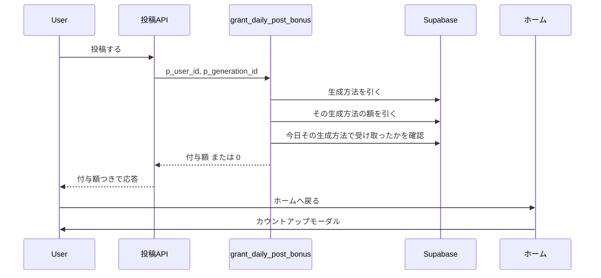
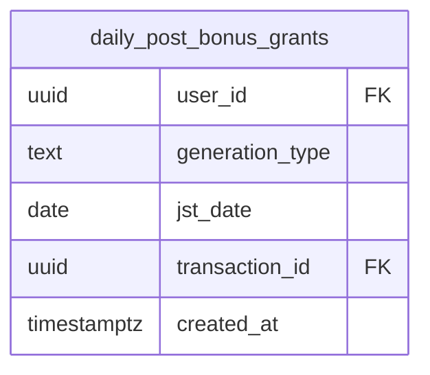
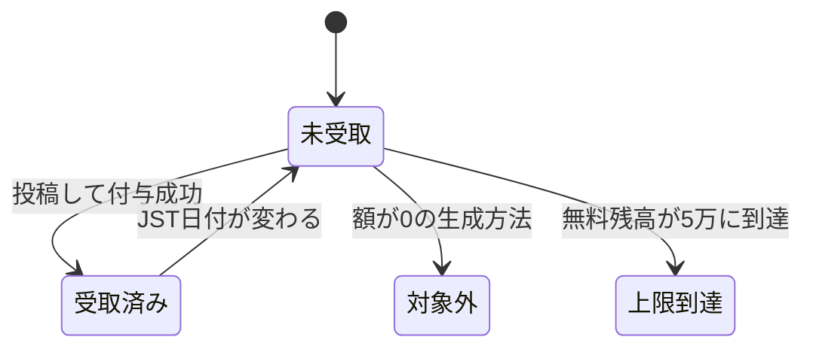
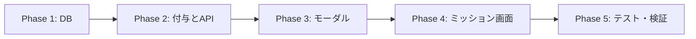

# 投稿ボーナスを生成方法ごとにする + 付与モーダル 実装計画書

作成日: 2026-08-12
ステータス: 計画（ユーザー決定済みの仕様を反映）

## ゴール

投稿ボーナス（現在 `daily_post` = 20・**1日1回・生成方法を問わない**）を、
**生成方法ごとに1日1回**へ変える。あわせて、付与の瞬間をトーストから
**カウントアップ付きモーダル**に格上げし、クリエイター還元の告知装置にする。

| 生成方法 | 付与 |
|---|---|
| One-Tap Style | +20 |
| Free Style | +20 |
| コーデ | **0** |

両方投稿すれば1日あたり最大 +40（現在の上限は +20）。額は管理画面で調整でき、
反応を見て下げられる。

## なぜやるか

クリエイター還元（他人のプロンプトで生成されたら原作者にペルコイン）は稼働済みだが
**まだ告知していない**。告知の効果を最大化するため、同時に出す施策を揃えている:

- 専用ページ `/creator-rewards`（既存）
- ホームバナー / ポップアップバナー
- 還元額を 1 → 2 へ引き上げ
- **本施策（Free Style 投稿への報酬 + 告知を兼ねるモーダル）**

Free Style は、**一般ユーザーが「使われる側」に回れる唯一の経路**（One-Tap の
スタイルは運営とクリエイター枠が作る）。ここに報酬を置くと、還元の仕組みと
素直に噛み合う。コーデは導線上も後方（タブ順は #498 で ワンタップ > フリー > コーデ）
なので、報酬から外して2つに集中させる。

## スコープ外（明示的にやらないこと）

- **プロンプト公開を条件にしない**（ADR-004。秘匿生成は非公開限定のため）
- 連続ログイン（`streak`）の減額 … [[persta-mission-revamp]] の別タスク
- 還元額 1 → 2 の変更 … 管理画面の操作のみで完結するため本PRでは扱わない
- 週次ミッション・ソーシャル系施策 … 2026-08-12 に見送り決定

## 概要図

### 投稿から付与・演出までの流れ



### 1日1回の判定（生成方法ごと）



`UNIQUE (user_id, generation_type, jst_date)` が「1日1回」の正本。

### 付与判定の状態遷移



## ユーザーストーリー

### ① ワンタップで投稿する人（いちばん多い）

いつもどおりワンタップスタイルで作って投稿する。ホームに戻ると、
**数字が 0 から 20 へ弾けるモーダル**が出る。

> 投稿しました！
> **+20ペルコイン**

「閉じる」で消える。今日はもう一度ワンタップで投稿してもモーダルは出ない。

### ② フリースタイルを初めて試す人（この施策の本命）

ミッション画面に「**フリースタイルで投稿する +20**」が並んでいるのを見て、
試してみる。投稿するとモーダルが出る。

> 投稿しました！
> **+20ペルコイン**
> このプロンプトを利用される度に、2ペルコイン が入ります。
> プロンプト非公開で設定の場合、相手にプロンプトを知られることはありません。

ここで**初めて「自分のプロンプトが収入になる」ことを知る**。
「非公開でも使ってもらえる」と書いてあるので、盗まれる心配もしなくてよいと分かる。
リンクから `/creator-rewards` を読みに行く。

### ③ 両方やる人

朝にワンタップで投稿して +20。夜にフリースタイルで投稿して +20。
**同じ日に合計40**受け取れる。ミッション画面では2枚のカードが別々に
「達成済み」になる。

### ④ 昨日つくった作品を投稿する人（新しい制約に当たる）

一昨日つくって下書きに置いていた作品を投稿する。投稿は成功するが、
**モーダルは出ない**（付与なし）。

お知らせで「その日に生成した作品が対象」と予告してあるので、
**驚きではなく納得**にする。ここを告知せずに出すと問い合わせになる。

### ⑤ 前の晩の在庫を翌日に投稿する人（ここが分かれ目）

23:00 にまとめて数枚生成し、23:55 に1枚投稿して **+20** を受け取る。

日付が変わった 00:05、前日 23:00 に生成した別の1枚を投稿する。
→ **付かない**（前日に生成したものなので）。

もう一度**その場で生成して**投稿すると **+20** が付く。

「日付が変わったらリセット」は投稿ボーナスで既に体験している区切りなので、
**生成も同じ区切り**にすることで「今日つくって、今日投稿する」の一言で伝わる
（ADR-004b）。

なお 23:55 に生成して 00:01 に投稿すると付かない、という段差はできる。
お知らせで**「その日に生成した作品が対象」**と明記して埋める。

### ⑥ コーデで投稿していた人（減る変更）

これまでコーデで投稿して20ペルコインを受け取っていた。今回から**付かなくなる**。

該当は直近30日で3人・25投稿。**事前告知が要る**のはこの人たち。
なおコーデでの生成・投稿そのものは今までどおりできる（報酬だけの変更）。

### ⑦ 無料ペルコインが上限に達している人（既存仕様のまま）

無料残高が5万に達していると、付与額が0になりモーダルは出ない。
運営アカウントが該当するため、**実機確認は必ず一般アカウントで行う**。

### ⑧ 運営（反応を見て調整する）

出してみたら配布が多すぎた、と感じたら `/admin/percoin-defaults` で
**額を下げる。0 にすればその生成方法だけ停止**できる。デプロイは要らない。

## EARS（要件定義）

- **REQ-01**: When ユーザーが One-Tap Style の画像を投稿したとき, the system shall
  その生成方法に設定された額を、その日まだ受け取っていなければ付与する。
- **REQ-02**: When ユーザーが Free Style の画像を投稿したとき, the system shall
  同様に付与する。**プロンプトの公開・非公開は条件にしない**。
- **REQ-03**: While ある生成方法の設定額が 0, the system shall その生成方法の投稿には
  付与しない（コーデの既定）。
- **REQ-04**: 同じ生成方法では **JSTの同日内に1回まで**。異なる生成方法は独立して
  1回ずつ受け取れる（1日あたり最大 +40）。
- **REQ-05**: 同じ投稿IDで二重に付与しない（冪等）。
- **REQ-05b**: **JSTの当日に生成された**画像のみ付与対象とする。前日以前に生成した
  画像を投稿しても付与しない（在庫の消化で毎日受け取れる状態をなくす）。
- **REQ-06**: 課金プランの倍率と、無料ペルコインの5万キャップは既存どおり適用する。
- **REQ-07**: When 付与が発生したとき, the system shall ホームでカウントアップ付きの
  モーダルを表示する（従来はトースト）。
- **REQ-08**: While 付与対象が Free Style の投稿, the modal shall
  「中身を見せずに他の人が使えます／使われるたびに◯ペルコイン」を併記し、
  クリエイター還元の説明へ導く。
- **REQ-09**: ミッション画面は生成方法ごとに達成状況を出す（One-Tap 済 / Free 未 など）。
- **REQ-10** (異常系): If 付与に失敗したら, then the system shall **投稿は成功させる**
  （現行踏襲。報酬は投稿の妨げにしない）。
- **REQ-11** (権限): 額の変更は管理者のみ。付与RPCは service_role 専用。

## ADR（設計判断記録）

### ADR-001: `transaction_type` は `daily_post` を維持し、生成方法は metadata に持つ

- **Context**: 生成方法別に3つの付与元を作るなら `transaction_type` を増やすのが素直。
- **Decision**: `daily_post` のままにし、`metadata->>'generation_type'` に記録する。
- **Reason**: 増やすと CHECK制約・admin の集計一覧（`credits-summary`）・通知の
  `bonus_type` マッピング・履歴表示の文言をすべて触ることになる。ユーザーから見て
  「投稿の特典」は1種類であり、内訳は運営が見たいだけ。
- **Consequence**: 集計で内訳を出すときは metadata を見る。既存の履歴表示は無改修。

### ADR-002: 「生成方法ごとに1日1回」は専用テーブル + UNIQUE で担保する

- **Context**: 現在は `profiles.last_daily_post_bonus_at`（単一列）で1日1回を見ている。
  生成方法ごとにするには表現力が足りない。
- **Decision**: `daily_post_bonus_grants(user_id, generation_type, jst_date)` を作り、
  `UNIQUE` で1日1回を保証する。列を増やす案（`last_free_post_bonus_at` 等）は採らない。
- **Reason**: 列を足す方式は生成方法が増えるたびに migration が必要。また
  「読んで判定 → 書く」の間に同時実行が入ると二重付与しうる。UNIQUE なら
  `ON CONFLICT DO NOTHING` で原子的に決まる（既存の `post_impressions` と同じ作法）。
- **Consequence**: `last_daily_post_bonus_at` は**後方互換のため更新を続ける**
  （他画面が参照している）。判定の正本は新テーブル。

### ADR-003: 額は `percoin_bonus_defaults` に生成方法別の source を足す

- **Decision**: `daily_post_one_tap` / `daily_post_free` / `daily_post_coordinate` を追加し、
  それぞれ 20 / 20 / 0 で seed する。既存 `daily_post` の行は残す（フォールバック）。
- **Reason**: 管理画面（`/admin/percoin-defaults`）の既存パターンにそのまま乗る。
  **0 を入れれば停止**でき、デプロイなしで額もON/OFFも変えられる。
- **Consequence**: 「コーデは対象外」をコードで表現しない。将来復活させたいときは
  額を入れるだけで戻る。

### ADR-004: プロンプトの公開を条件にしない

- **Context**: 当初「公開して投稿」を条件にする案を出した。
- **Decision**: **条件にしない**。公開・非公開を問わず付与する。
- **Reason**: 実装を確認したところ、派生生成の検証（`validate_derived_generation`）は
  `prompt_visibility <> 'private'` で弾いている。つまり
  **「このプロンプトで生成する」は非公開プロンプト専用の経路**で、公開すると
  この秘匿生成の対象から外れる。非公開のままの方が、他人に使ってもらえて・
  コピーされず・還元も入る。公開を促すのは逆効果。
- **Consequence**: モーダルの文言は「公開しよう」ではなく
  「**中身を見せずに使ってもらえる**」を軸にする。

### ADR-004b: 鮮度の条件は「JSTの当日に生成」

- **Context**: 現在は何日前に生成した画像でも投稿すれば付与される。在庫を1枚ずつ
  出せば毎日受け取れてしまう。候補は「生成から24時間以内」と「JST当日に生成」。
- **Decision**: **JSTの当日に生成**
  （`(created_at at time zone 'Asia/Tokyo')::date = 当日`）。
- **Reason**: **投稿ボーナス自体が JST 0:00 でリセットされる**ので、生成の条件も
  同じ区切りにすると「**今日つくって、今日投稿する**」の一文で説明が終わる。
  ユーザーは既に 0:00 の区切りを体験しており、理解の負荷が増えない。
  実装コストは24時間以内と同じ（どちらも条件1行）。
  なお24時間以内だと **23:00 に生成した在庫を翌 00:05 に投稿して受け取れて**しまい、
  「在庫を持ち越して毎日受け取る」余地が残る。これを塞ぐ狙いに対して 24時間以内は
  不十分だった。
- **Consequence**: 23:55 に生成して 00:01 に投稿すると付かない、という段差はできる。
  ただし「日付が変わったらリセット」という既存の体験と同じ区切りなので、
  **お知らせで「その日に生成した作品が対象」と明記すれば納得できる**範囲と判断した。

### ADR-005: 付与演出は既存部品を流用する

- **Decision**: `CountUpNumber` / `RewardBurst`（コレクション完走報酬で実装済み）を
  再利用し、`PostList` の付与トーストをモーダルへ差し替える。
- **Reason**: 付与額がホームまで渡る配管（`persistPendingHomePostRefresh` →
  `consumePendingRefresh`）は既にある。演出の実装もある。新規で作る部分がない。
- **Consequence**: 演出の見た目がコレクション完走と揃う（一貫性の利点）。

### ADR-006: 移行日の二重取りは seed で潰す

- **Context**: 適用日に既に `daily_post` を受け取っている人は、新テーブルが空だと
  もう一度受け取れてしまう。
- **Decision**: migration 内で、**当日の `daily_post` 取引から新テーブルへ1行 seed** する。
- **Reason**: 数人・数十ペルコインの話だが、「移行のせいで多くもらえた/もらえない」は
  問い合わせの種になる。潰せるコストで潰す。

## 実装計画



### Phase 1: DB
目的: 生成方法ごとの額と「1日1回」の器を作る。
ビルド確認: migration が Supabase Preview で通る。

- [ ] migration: `daily_post_bonus_grants` 作成（RLS有効・ポリシーなし＝service_role専用）
  - `UNIQUE (user_id, generation_type, jst_date)` / `generation_type` は CHECK で
    `one_tap_style` / `free` / `coordinate` に限定
- [ ] `percoin_bonus_defaults` に3行 seed（20 / 20 / 0）
- [ ] `grant_daily_post_bonus` を書き換え（**引数は変えない**）
  - `p_generation_id` から `generated_images.generation_type` を引く
    （呼び出し側に生成方法を渡させない＝偽装できない）
  - **JSTの当日に生成されたか**確認する
    （`(created_at at time zone 'Asia/Tokyo')::date`。同じ行から読めるので追加コストなし）
  - 生成方法別の額を `get_percoin_bonus_default` で引く。0 なら 0 を返して終了
  - 新テーブルへ `ON CONFLICT DO NOTHING` で挿入し、挿入できなければ 0 を返す
  - 倍率・5万キャップ・7ヶ月有効期限・通知は既存踏襲
  - `profiles.last_daily_post_bonus_at` も更新（後方互換）
  - `metadata` に `generation_type` を入れる（ADR-001）
- [ ] ADR-006 の seed
- [ ] **適用前に本番データでリハーサル**（`COMMIT` → `ROLLBACK` 置換で dry-run）

### Phase 2: 付与とAPI
目的: 投稿時に生成方法が演出まで届くようにする。
ビルド確認: `npm run build -- --webpack`

- [ ] `app/api/posts/post/route.ts`: 応答に `generationType` を追加
      （付与RPCの呼び出し自体は無改修＝引数を変えていないため）
- [ ] `features/posts/lib/home-post-refresh.ts`: `PendingHomePostRefresh` の
      `posted` に `generationType` を追加
- [ ] 投稿完了処理から `generationType` を持ち回す

### Phase 3: 付与モーダル
目的: 付与の瞬間を告知装置にする。
ビルド確認: 同上

- [ ] `features/posts/components/PostBonusModal.tsx` を追加
      （`CountUpNumber` + `RewardBurst` を流用。PC=Dialog / モバイル=Drawer の既存作法）
- [ ] `PostList` の `consumePendingRefresh` のトーストをモーダルへ差し替え
      （倍率バッジは現行の表示を踏襲）
- [ ] Free Style のときだけ還元の案内行と `/creator-rewards` へのリンクを出す
- [ ] 15ロケールの文言（タイトル・付与額・還元案内・閉じる）

**確定した文言（2026-08-12 ユーザー決定）**

```
投稿しました！
 +20ペルコイン
このプロンプトを利用される度に、2ペルコイン が入ります。
プロンプト非公開で設定の場合、相手にプロンプトを知られることはありません。
```

- 1〜2行目は**全生成方法**で出す（`+◯` はカウントアップ）
- 3〜4行目は **Free Style のときだけ**。One-Tap の利用還元
  （`style_usage_reward`）は現在 0＝未有効なので、出すと嘘になる
- **「2ペルコイン」は実際の設定値を読んで出す**（`prompt_usage_reward`）。
  文言に焼き込むと、額を変えたときに嘘になる

### Phase 4: ミッション画面
目的: 生成方法ごとの達成状況を見せる。
ビルド確認: 同上

- [ ] `features/challenges/lib/api.ts` / `server-api.ts`: 生成方法ごとの
      当日受取状況を返す（新テーブルを引く）
- [ ] `ChallengePageContent`: 投稿ミッションを2枚（One-Tap / Free Style）に分割。
      額が0の生成方法はカードを出さない（コーデが並ばない）
- [ ] `get-percoin-defaults.ts`: 生成方法別の額を返す

### Phase 5: テスト・検証
- [ ] RPC: 生成方法ごとに1日1回 / 同日2回目は0 / 額0は付与しない /
      同じ投稿IDで冪等 / 5万キャップ / 生成方法を呼び出し側から偽装できない /
      **前日23:00生成→当日00:05投稿は付与しない・当日00:05生成→当日00:10投稿は付与する**（境界）
- [ ] モーダル: 付与額のカウントアップ / Free Style のときだけ還元案内 /
      付与0なら出さない
- [ ] ミッション画面: 片方だけ達成した状態の表示 / 額0のカードは出ない
- [ ] `npm run lint` / `typecheck` / `test` / `build -- --webpack`
- [ ] 実機: One-Tap 投稿 → モーダル → Free Style 投稿 → モーダル（還元案内あり）→
      同日3回目は出ない → 翌日リセット

## 修正対象ファイル一覧

| ファイル | 操作 | 変更内容 |
|---|---|---|
| `supabase/migrations/2026xxxx_add_post_bonus_by_generation_type.sql` | 新規 | テーブル・seed・RPC書き換え |
| `app/api/posts/post/route.ts` | 修正 | 応答に生成方法を追加 |
| `features/posts/lib/home-post-refresh.ts` | 修正 | payload に生成方法を追加 |
| `features/posts/components/PostBonusModal.tsx` | 新規 | 付与モーダル |
| `features/posts/components/PostList.tsx` | 修正 | トースト → モーダル |
| `features/challenges/lib/api.ts` / `server-api.ts` | 修正 | 生成方法別の受取状況 |
| `features/challenges/components/ChallengePageContent.tsx` | 修正 | ミッションを2枚に |
| `features/credits/lib/get-percoin-defaults.ts` | 修正 | 生成方法別の額 |
| `features/credits/lib/percoin-bonus-defaults.ts` | 修正 | source を追加 |
| `messages/*.ts` | 修正 | 15ロケールの文言 |

## 品質・テスト観点

- [ ] **二重付与しない**: 同一投稿・同一生成方法・同日
- [ ] **偽装できない**: 生成方法はサーバー（RPC内）で解決する
- [ ] **投稿を妨げない**: 付与が失敗しても投稿は成功する
- [ ] **止められる**: 額を0にすればデプロイなしで停止
- [ ] **移行が滑らか**: 適用日に二重取りが起きない（ADR-006）
- [ ] i18n: 15ロケール揃っている

## ロールバック方針

- **額を 0 にすれば即停止**（デプロイ不要）。これが一次手段
- モーダルは `PostList` の差し替えを戻せばトーストに復帰
- migration は追加のみ（テーブル追加・seed・RPC書き換え）。RPC は引数を
  変えていないため、旧版の定義を再適用すれば戻る

## 告知（2026-08-12 決定）

運営お知らせ（`/admin/announcements` → `/notifications`。未読バッジあり）で
**2本に分けて、ほぼ同時に出す**。1本に詰め込むと長くなり、
「減る変更」と「還元の話」が混ざって読まれにくくなるため。

1. **ミッション変更のお知らせ** … 生成方法ごとに +20（両方で40）/
   コーデは対象外に / その日に生成した作品が対象に
2. **フリースタイルでの還元について** … 使われるたびに2ペルコイン /
   **非公開のままでも使ってもらえる（コピーされない）** / `/creator-rewards` へ

**モーダルは第1弾の時点から還元の案内を出す**（同時告知のため伏せる理由がない）。

**出す順序**: お知らせ（変更予告）→ リリース（migration + デプロイ + 額設定）
→ バナー掲出。減る変更を含むので、リリースの数日前に予告する。

## 未決（実装中にユーザーへ確認）

- お知らせ本文の最終的な言い回し（たたき台は提示済み。運営の言葉に直す）

## 使用スキル

| スキル | 用途 |
|---|---|
| `/git-create-branch` | ブランチ作成 |
| `/git-create-pr` | PR作成 |
