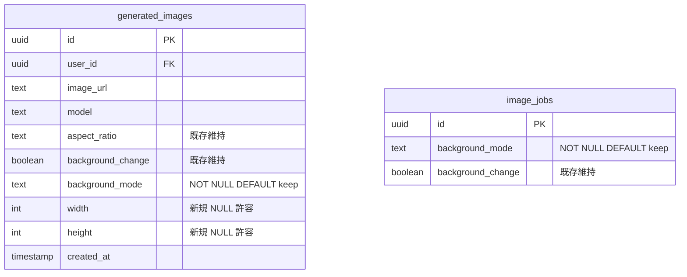
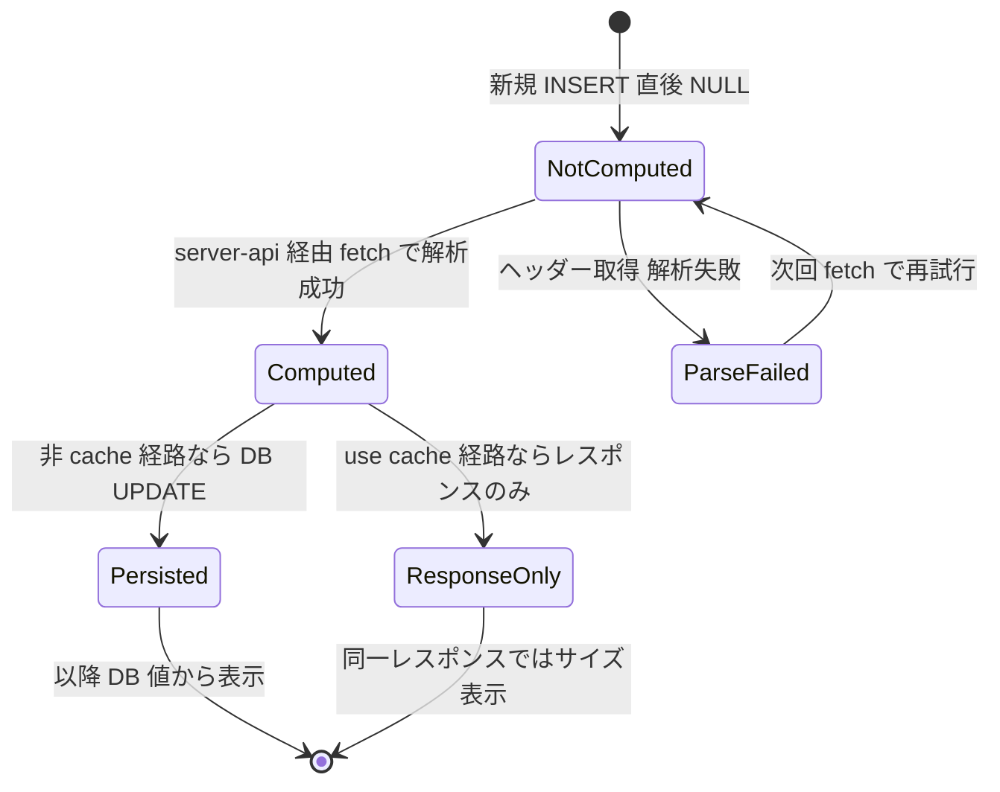
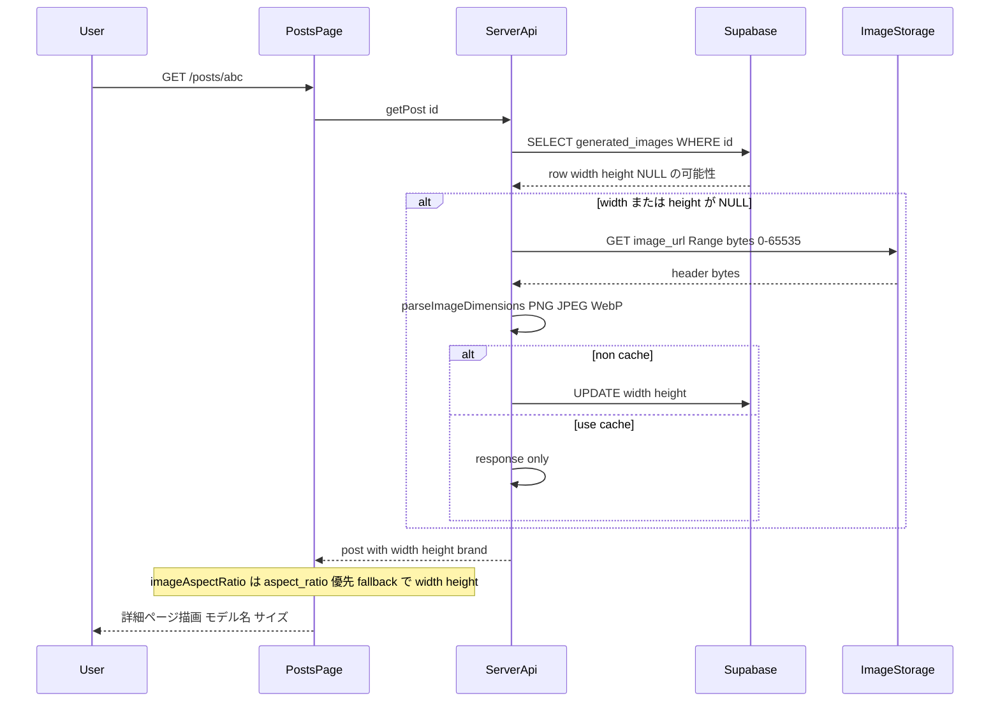
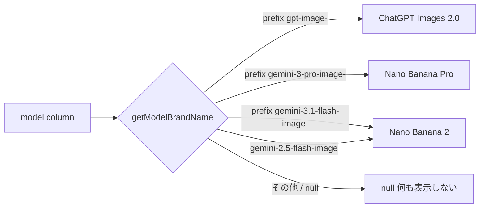
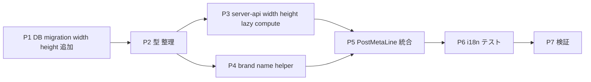

# Post 詳細画面に生成モデル名と画像サイズを表示する 実装計画

## Context

コーディネート画像の生成モデルが Nano Banana 2 / Nano Banana Pro / ChatGPT Images 2.0 の 3 系統に増えたため、Post 詳細画面でどのモデルで生成された画像かを視認できるようにする。同時に画像の実寸（例: `1024×1536`）も併記してリファレンスとしての価値を高める。

新しく `width`/`height` 列を追加して画像の実寸を保存できるようにする。ただし本 PR では互換性を優先し、既存の `aspect_ratio` / `background_change` 列は削除しない。列削除は、`width`/`height` の backfill と運用確認が完了した後の別 PR で検討する。

### 表示要件
- **表示位置**: 既存のプロンプトブロックの直前
- **表示フォーマット**: `ChatGPT Images 2.0 / 1024×1536`（ラベルなし、スラッシュ区切り）
- **表示範囲**: 自分以外の投稿を含めて全公開投稿で表示（誰でも見える）
- **対象画面**: 2 つの Post 詳細コンポーネント（`PostDetail.tsx` と `PostDetailStatic.tsx`）。`PostDetailContent.tsx` は `PostDetailStatic.tsx` のラッパーなので変更不要
- **データ取得**: 既存の `aspect_ratio` の lazy compute パターンを参考に、`width`/`height` をサーバー側で算出する。通常の `getPost` では best-effort で DB に保存し、`use cache` 経由ではレスポンス用に算出するが DB UPDATE は行わない
- **既存行のフォールバック**: `width`/`height` が NULL の場合は **モデル名のみ** 表示（推定値は出さない）
- **既存列の互換維持**: `aspect_ratio` / `background_change` の読み書きは本 PR では維持し、既存の生成経路・表示経路を壊さない

### DB 互換方針
本 PR では DB 列削除を行わない。

1. **`width` / `height`** (`generated_images`): 新規追加。NULL 許容。取得できた行から順次保存する
2. **`aspect_ratio`** (`generated_images`): 互換期間として維持。既存 UI のフレーム切替はこの値を優先し、`width`/`height` がある場合のみ派生値を fallback として使える
3. **`background_change`** (`generated_images` / `image_jobs`): 互換期間として維持。既存の INSERT 経路と worker の `resolveBackgroundMode` fallback を壊さない

将来の列削除 PR では、少なくとも以下を完了条件にする:
- `width`/`height` の backfill と取得失敗行の棚卸し
- `aspect_ratio` 参照箇所の完全除去
- `background_change` を書く全 route / Edge Function / tests の完全移行
- migration 先行・アプリ先行のどちらでも本番導線が壊れないデプロイ手順の確認

## コードベース調査結果

### 現状の DB スキーマ抜粋（本 PR 関連分のみ）
- `model TEXT` — モデル ID（display 対象）
- `aspect_ratio TEXT CHECK ('portrait' | 'landscape' | NULL)` — 既存互換のため維持
- `background_change BOOLEAN` — 既存互換のため維持
- `background_mode TEXT NOT NULL DEFAULT 'keep'` — `background_change` の上位互換、保持
- `width INT` / `height INT` — **新規追加**

### 重要な参照箇所

- **Post 型**: [features/posts/types.ts:22](features/posts/types.ts#L22) `Post extends GeneratedImageRecord`
- **元レコード型**: [features/generation/lib/database.ts:8-43](features/generation/lib/database.ts#L8-L43) — `aspect_ratio?` `background_change` を維持し、`width?` `height?` を追加する
- **Lazy compute 既存パターン**: [features/posts/lib/server-api.ts:747-777](features/posts/lib/server-api.ts#L747-L777) — `aspect_ratio` を fetch 時に計算 + UPDATE
- **寸法解析ヘルパー**: [features/posts/lib/utils.ts:227](features/posts/lib/utils.ts#L227) `getImageDimensions(imageUrl)` — Range fetch + PNG/JPEG/WebP ヘッダーパース
- **Edge Function INSERT**: [supabase/functions/image-gen-worker/index.ts:1865-1881](supabase/functions/image-gen-worker/index.ts#L1865-L1881) — 本 PR では変更不要（`background_change` は維持）
- **Next.js handler INSERT**: `app/api/generate-async/handler.ts` の `image_jobs` INSERT は本 PR では変更不要（`background_change` は維持）
- **Post 詳細 UI**:
  - [features/posts/components/PostDetail.tsx:286-318](features/posts/components/PostDetail.tsx#L286-L318) — クライアント版
  - [features/posts/components/PostDetailStatic.tsx:158-330](features/posts/components/PostDetailStatic.tsx#L158-L330) — SSR 版、`imageAspectRatio` で CSS 切替
  - [features/posts/components/PostDetailContent.tsx:63-86](features/posts/components/PostDetailContent.tsx#L63-L86) — `PostDetailStatic` のラッパー（変更不要）
  - [features/posts/components/CachedPostDetail.tsx:38-48](features/posts/components/CachedPostDetail.tsx#L38-L48) — `post.aspect_ratio` を読んで `imageAspectRatio` に渡す
- **`background_change` 読み取り**: [features/my-page/components/ImageDetailPageClient.tsx:34](features/my-page/components/ImageDetailPageClient.tsx#L34) で fallback として `image.background_change` を読んでいる。本 PR では維持
- **既存ブランド名**: [messages/ja.ts:670-675](messages/ja.ts#L670-L675), [messages/en.ts:695-702](messages/en.ts#L695-L702) — モデル選択 dropdown に既出
- **既存 migration 参考**: `supabase/migrations/20251212065229_add_aspect_ratio_to_generated_images.sql`、`supabase/migrations/20260222133000_add_background_mode_to_generation_tables.sql`
- **RLS**: `generated_images` は本人 + visible 公開の混合 RLS。本 PR で変更不要
- **入力境界の変換 helper**（**本 PR では触らない**、別議論）:
  - `shared/generation/prompt-core.ts` の `backgroundChangeToBackgroundMode` / `backgroundModeToBackgroundChange` / `resolveBackgroundMode`
  - `features/generation/lib/schema.ts` の zod 入力 `backgroundChange?` フィールド
  - `features/style/components/StylePageClient.tsx` の boolean トグル UI 状態
  - `features/generation/lib/nanobanana.ts` / `async-api.ts` の boolean 引数

これらは **リクエスト境界での入力変換**（フロント form の boolean → 内部 backgroundMode）であり、本 PR の表示追加とは独立。列削除や UI 改修は別議論。

---

## 1. 概要図

### データモデル変更（追加のみ）

### width/height の状態遷移

### Lazy compute シーケンス

### Provider 識別

---

## 2. EARS 要件定義

### 表示系

#### EV-1 ブランド名表示
- **EN**: When a user opens a post detail page where `getModelBrandName(post.model)` returns a non-null brand name, the system shall render the brand name above the prompt block in both `PostDetail.tsx` and `PostDetailStatic.tsx`.
- **JA**: ユーザーが Post 詳細を開き、`getModelBrandName(post.model)` が non-null のブランド名を返したとき、システムは `PostDetail.tsx` と `PostDetailStatic.tsx` の両方でプロンプトブロックの直前にブランド名を描画する。

#### EV-2 サイズ付加
- **EN**: When `post.width` and `post.height` are both non-null positive integers, the system shall append ` / WIDTHxHEIGHT` (using the × multiplication sign) to the brand name, producing strings like `ChatGPT Images 2.0 / 1024×1536`.
- **JA**: `post.width` と `post.height` の両方が non-null かつ正の整数のとき、システムはブランド名の右に ` / WIDTHxHEIGHT`（× は乗算記号）を連結し、`ChatGPT Images 2.0 / 1024×1536` のような文字列を生成する。

#### EV-3 公開可視性
- **EN**: Where the post is publicly viewable (`moderation_status='visible'` and `is_posted=true`), the model/size display shall also be visible to other users.
- **JA**: 公開投稿の場合、モデル/サイズ表示は本人だけでなく他ユーザーにも表示する。

### Lazy compute 系

#### EV-4 width/height の lazy compute
- **EN**: When `getPost` retrieves a row whose `width` or `height` is null and a display image URL can be resolved from `image_url` or `storage_path`, the system shall fetch the image header (Range bytes 0-65535), parse PNG / JPEG / WebP dimensions, and best-effort UPDATE the row with `width` and `height`. While `getPost` is invoked with `useCache=true`, the system shall compute dimensions for the response but shall not issue the UPDATE.
- **JA**: `getPost` が取得した行の `width` または `height` が null で、`image_url` または `storage_path` から表示用画像 URL を解決できるとき、システムは画像ヘッダー（Range bytes 0-65535）を取得して PNG / JPEG / WebP の寸法を解析し、`width` と `height` で行を最善努力で UPDATE する。ただし `getPost` が `useCache=true` で呼ばれている間は、レスポンス用に寸法を計算するが UPDATE は実行しない。

#### EV-5 imageAspectRatio の互換維持
- **EN**: When the page assembles the `imageAspectRatio` prop for `PostDetail*`, the system shall keep using the existing `aspect_ratio` value first, and may derive a fallback from `(width, height)` only when `aspect_ratio` is null.
- **JA**: ページが `PostDetail*` 系の `imageAspectRatio` prop を組み立てるとき、システムは既存の `aspect_ratio` を優先し、`aspect_ratio` が null の場合に限って `(width, height)` から fallback 派生してよい。

### 整合性 / 互換系

#### ST-1 既存 RLS との整合
- **EN**: While reading or updating `generated_images`, the system shall use the existing RLS policies without modification.
- **JA**: `generated_images` の読み書きにおいて、システムは既存の RLS ポリシーを変更せず使用する。

#### ST-2 background_change の互換維持
- **EN**: While this PR is deployed, the system shall keep existing `background_change` reads and writes so that current generation routes and the Edge Function remain compatible.
- **JA**: 本 PR の導入中、システムは既存の `background_change` 読み書きを維持し、現行の生成 route と Edge Function の互換性を保つ。

#### IF-1 寸法解析失敗
- **EN**: If image header fetch or dimension parsing fails, then the system shall log a warning, leave `width` and `height` as null, and continue rendering with brand-name-only.
- **JA**: 画像ヘッダー取得または寸法解析が失敗したとき、システムは warning ログを出し、`width` と `height` を null のままにし、ブランド名のみで描画を続行する。

#### IF-2 ブランド名未認識
- **EN**: If `getModelBrandName(model)` returns null, then the system shall not render the model/size block at all.
- **JA**: `getModelBrandName(model)` が null を返した場合、システムはモデル/サイズブロック自体を描画しない。

#### IF-3 useCache モード
- **EN**: While `getPost` is invoked with `useCache=true`, the system shall compute width/height for the response but shall NOT issue a DB UPDATE.
- **JA**: `getPost` が `useCache=true` で呼ばれている間、システムはレスポンス用に width/height を計算するが DB UPDATE は実行しない。

---

## 3. ADR

### ADR-001: lazy compute（既存 aspect_ratio パターン）を踏襲
- **Context**: 新規生成画像に width/height を保存する必要があるが、Edge Function に書き込み処理を追加するか、fetch 時 lazy compute するかの 2 案
- **Decision**: lazy compute（既存 `aspect_ratio` パターンを参考にしつつ、`use cache` 経路では DB UPDATE しない）
- **Reason**: Edge Function の生成処理に手を入れず、既存行にも段階的に対応できる。`use cache` 内の書き込みを避けられる
- **Consequence**: width/height 未保存行の初回表示時に Range fetch のレイテンシが追加される。DB への永続化は非 cache 経路または将来の backfill に依存する

### ADR-002: ブランド名はプレフィックスベースで判定
- **Context**: `model` から `getModelBrandName` で表示用ブランドを導出
- **Decision**: `startsWith` プレフィックス判定 + `gemini-2.5-flash-image` の例外マッチ
- **Reason**: 新モデル ID 追加時にヘルパー 1 行追加だけで済む
- **Consequence**: 未知プレフィックスは null（非表示）

### ADR-003: 表示フォーマットは `Brand / WxH` のラベルなし
- **Context**: ラベル付き / ラベルなしの選択
- **Decision**: ラベルなしの簡潔表記 `ChatGPT Images 2.0 / 1024×1536`
- **Reason**: ユーザーの選択。視認性・スペース効率
- **Consequence**: 何の値かが文脈依存。`aria-label` で a11y 補強

### ADR-004: width/height NULL 行はモデル名のみ表示
- **Context**: lazy compute 前 / 解析失敗時の表示
- **Decision**: width/height 両方 non-null のときのみ ` / WxH` 付与
- **Reason**: ユーザーの選択。推定値を出さない
- **Consequence**: 寸法解析に失敗した行はブランド名のみ表示される。解析に成功した行は同一レスポンスでサイズも表示され、非 cache 経路では以後 DB 値から表示される

### ADR-005: 表示部品は共通コンポーネント化
- **Context**: 2 つの Post 詳細コンポーネントに同じ表示を入れる
- **Decision**: `features/posts/components/PostMetaLine.tsx` を新規作成
- **Reason**: DRY、変更時の漏れ防止
- **Consequence**: 1 ファイル増えるがロジック重複が解消

### ADR-006: aspect_ratio 列は互換期間として維持
- **Context**: `width`/`height` が揃えば `aspect_ratio` は派生可能だが、既存行にはまだ寸法が保存されておらず、画像取得不能な行では復元できない可能性がある
- **Decision**: 本 PR では `aspect_ratio` を削除しない。既存のフレーム切替は `aspect_ratio` を優先し、`width`/`height` は表示と fallback に使う
- **Reason**: migration 先行・アプリ先行の破壊リスクを避ける。既存行のデータロスを発生させない
- **Consequence**: 一時的に `aspect_ratio` と `width`/`height` が併存する。将来の backfill / 参照除去 PR で整理する

### ADR-007: background_change 列は互換期間として維持
- **Context**: `background_change` は `background_mode` の互換列として残っており、Next.js route、style async route、Edge Function、テストが現在も参照している
- **Decision**: 本 PR では `image_jobs` / `generated_images` の `background_change` を削除しない。既存の INSERT と worker fallback も維持する
- **Reason**: 表示機能の追加と背景設定列の廃止を同時に行うと blast radius が大きい。特に migration 先行で生成導線が壊れる
- **Consequence**: `background_change` 廃止 TODO は残る。別 PR で全参照移行、互換 migration、削除 migration を段階的に行う

### ADR-008: 表示部品は公開可視性
- **Context**: プロンプトはユーザーによっては本人のみ閲覧可能（マスク）。モデル名・サイズも同様にすべきか
- **Decision**: モデル名・サイズは公開
- **Reason**: モデル名・サイズはセンシティブ情報を含まず、他ユーザーにとってリファレンス価値がある
- **Consequence**: 既存のプロンプトマスク（`getVisiblePrompt`）とは独立した表示制御

---

## 4. 実装計画

### フェーズ間の依存関係

### Phase 1: DB マイグレーション
**目的**: `width INT` / `height INT` を追加する。既存列は削除しない
**ビルド確認**: ローカル Supabase で migration apply できる

- [ ] `supabase/migrations/<timestamp>_add_generated_image_dimensions.sql` 作成
  - **追加**:
    - `ALTER TABLE public.generated_images ADD COLUMN width INT NULL CHECK (width IS NULL OR width > 0);`
    - `ALTER TABLE public.generated_images ADD COLUMN height INT NULL CHECK (height IS NULL OR height > 0);`
  - **削除しない**:
    - `generated_images.aspect_ratio`
    - `generated_images.background_change`
    - `image_jobs.background_change`
- [ ] ローカル apply 確認

### Phase 2: 型整理
**目的**: アプリ層に `width` / `height` を追加し、既存列は互換維持する
**ビルド確認**: `npm run typecheck` pass

- [ ] [features/generation/lib/database.ts](features/generation/lib/database.ts)
  - `width?: number | null;` と `height?: number | null;` を追加
  - `aspect_ratio?` と `background_change` は削除しない
- [ ] [features/generation/lib/job-types.ts](features/generation/lib/job-types.ts)
  - 本 PR では変更不要。`background_change` は互換維持
- [ ] `Post` (extends GeneratedImageRecord) は自動継承

### Phase 3: server-api に width/height lazy compute を追加
**目的**: 既存 `aspect_ratio` lazy compute を維持しつつ、`width`/`height` の lazy compute を追加する
**ビルド確認**: typecheck pass + 既存 generation テスト pass

- [ ] [features/posts/lib/server-api.ts:747-814](features/posts/lib/server-api.ts#L747-L814) を改修
  - `data.aspect_ratio` 参照と既存 UPDATE は維持
  - `width` または `height` が NULL の場合に、`data.image_url` または `data.storage_path` から表示用画像 URL を解決して `getImageDimensions(imageUrl)` を呼ぶ
  - 取得した `{ width, height }` を行に追加
  - DB UPDATE は `width` と `height` を更新。`aspect_ratio` が NULL の場合は既存互換として `aspect_ratio` も更新してよい
  - 失敗時は warn ログ + `null` 維持
  - `useCache` モードでは DB UPDATE をスキップし、レスポンス用の `width` / `height` のみセットする
  - 戻り値の `width` / `height` を Post に含める

### Phase 4: ブランド名ヘルパー
**目的**: モデル ID → ブランド名の単一情報源
**ビルド確認**: 新規ヘルパーテスト pass

- [ ] **NEW** `features/generation/lib/model-display.ts` 作成
  - `export function getModelBrandName(model: string | null | undefined): string | null`
  - 判定:
    - `startsWith('gpt-image-')` → `"ChatGPT Images 2.0"`
    - `startsWith('gemini-3-pro-image-')` → `"Nano Banana Pro"`
    - `startsWith('gemini-3.1-flash-image-')` または `=== 'gemini-2.5-flash-image'` → `"Nano Banana 2"`
    - その他 → `null`
- [ ] **NEW** `tests/unit/features/generation/model-display.test.ts` 作成
  - 各プレフィックス・null/undefined・空文字列・未知 ID

### Phase 5: PostMetaLine 部品 + 詳細画面統合
**目的**: 表示部品を 2 詳細コンポーネントに統合する。imageAspectRatio は互換維持
**ビルド確認**: `npm run lint && npm run typecheck && npm run build -- --webpack` pass

- [ ] **NEW** `features/posts/components/PostMetaLine.tsx` 作成
  - props: `{ model: string | null; width: number | null; height: number | null }`
  - `getModelBrandName(model)` が null なら `return null`
  - width && height があれば `${brand} / ${width}×${height}`、なければ `${brand}` のみ
  - `aria-label`: `t("metaModelLabel"): brand[, t("metaSizeLabel"): WxH]`
- [ ] [features/posts/components/CachedPostDetail.tsx:38-48](features/posts/components/CachedPostDetail.tsx#L38-L48) を改修
  - `post.aspect_ratio` 参照は維持
  - `post.aspect_ratio` が NULL で `post.width` / `post.height` が揃う場合のみ fallback として派生（`height > width ? 'portrait' : 'landscape'`）
  - 派生 helper を新規 export（例: `features/posts/lib/utils.ts` の `deriveAspectRatioFromDimensions`）
- [ ] [features/posts/components/PostDetail.tsx:286 直前](features/posts/components/PostDetail.tsx#L286)
  - プロンプトブロックの直前に `<PostMetaLine model={post.model ?? null} width={post.width ?? null} height={post.height ?? null} />`
  - クライアント側 `setImageAspectRatio` の `.onLoad` 計算は維持（DB 値が無い時のフォールバック）
- [ ] [features/posts/components/PostDetailStatic.tsx:330 直前](features/posts/components/PostDetailStatic.tsx#L330)
  - 同様の挿入
  - `imageAspectRatio` prop 自体は維持（呼び出し元 `CachedPostDetail` から派生値を受け取る）

### Phase 6: i18n + テスト整理
**目的**: aria-label 用 i18n + 新規表示・寸法算出のテスト追加
**ビルド確認**: 新規テスト pass + 既存テスト全 pass

- [ ] [messages/ja.ts](messages/ja.ts) の `posts` 名前空間に追加:
  - `metaModelLabel: "生成モデル"`
  - `metaSizeLabel: "サイズ"`
- [ ] [messages/en.ts](messages/en.ts) に同様:
  - `metaModelLabel: "Generation model"`
  - `metaSizeLabel: "Size"`
- [ ] **NEW** `tests/unit/features/posts/post-meta-line.test.tsx`
  - ブランド名 + サイズ表示
  - ブランド名のみ（width/height NULL）
  - 何も描画しない（model NULL / 未知）
  - aria-label の付与確認
- [ ] [tests/unit/features/posts/post-detail.test.tsx](tests/unit/features/posts/post-detail.test.tsx) を必要に応じて更新
  - `width` / `height` がある投稿で `<PostMetaLine />` が表示される
  - `aspect_ratio` を維持したまま表示が壊れない
- [ ] server-api の既存テストがある場合は、`width` / `height` NULL 時の `getImageDimensions` 呼び出しと UPDATE の期待を追加
- [ ] `background_change` / `aspect_ratio` の期待値は削除しない（互換維持のため）

### Phase 7: 検証
**目的**: 全テスト + 実機確認
**ビルド確認**: 4 コマンド全 pass

- [ ] `npm run lint`
- [ ] `npm run typecheck`
- [ ] `npm run test`
- [ ] `npm run build -- --webpack`
- [ ] Vercel Preview / 本番で実機確認:
  - 自分の最新 OpenAI 画像（width/height NULL）→ 初回アクセスで lazy compute → 同一レスポンスでサイズ表示
  - Nano Banana 系の既存画像 → ブランド名表示 + lazy compute 後にサイズ表示
  - 他ユーザーの公開画像 → 同じく表示
  - 縦/横のフレーム切替が既存 `aspect_ratio` 優先で維持される（CSS 崩れがない）
  - 背景変更系の生成（`backgroundMode` の各値）が既存通り問題なく完了

---

## 5. 修正対象ファイル一覧

| ファイル | 操作 | 変更内容 |
|---|---|---|
| `supabase/migrations/<ts>_add_generated_image_dimensions.sql` | 新規 | `generated_images.width` / `height` 追加のみ |
| `features/generation/lib/database.ts` | 修正 | `GeneratedImageRecord` に width/height 追加。既存列は維持 |
| `features/posts/lib/server-api.ts` | 修正 | 既存 aspect_ratio lazy compute を維持しつつ、width/height lazy compute を追加 |
| `features/posts/lib/utils.ts` | 修正 | `deriveAspectRatioFromDimensions` を export 追加 |
| `features/generation/lib/model-display.ts` | 新規 | `getModelBrandName(model)` |
| `features/posts/components/PostMetaLine.tsx` | 新規 | 共通表示部品 |
| `features/posts/components/CachedPostDetail.tsx` | 修正 | aspect_ratio 優先を維持し、width/height fallback を追加 |
| `features/posts/components/PostDetail.tsx` | 修正 | プロンプト直前に PostMetaLine 挿入 |
| `features/posts/components/PostDetailStatic.tsx` | 修正 | 同上 |
| `messages/ja.ts` | 修正 | aria-label 用キー追加 |
| `messages/en.ts` | 修正 | 同上 |
| `tests/unit/features/generation/model-display.test.ts` | 新規 | brand name ヘルパーの単体 |
| `tests/unit/features/posts/post-meta-line.test.tsx` | 新規 | 表示部品の単体 |
| `tests/unit/features/posts/post-detail.test.tsx` | 修正 | width/height mock と PostMetaLine 表示確認を追加 |
| server-api 関連テスト | 修正 | width/height lazy compute と UPDATE skip 条件を確認 |

合計: 新規 5、修正 10 前後（既存テスト構成により増減）

---

## 6. 品質・テスト観点

### 品質チェックリスト
- [ ] **エラーハンドリング**: 寸法解析失敗時 warning + null 維持で UI 描画継続
- [ ] **権限制御**: RLS 変更なし、他ユーザーの公開投稿読み取り権限は既存通り
- [ ] **データ整合性**: width/height は CHECK 制約で正の整数のみ。既存の `aspect_ratio` / `background_change` は削除せず互換維持
- [ ] **セキュリティ**: lazy compute は public な image_url を参照するだけ
- [ ] **i18n**: aria-label 用キーを ja/en 両方追加
- [ ] **互換性**: 入力境界の `backgroundChange` boolean → `backgroundMode` 変換、DB の `background_change` 読み書きは保持（フロント UI への破壊的変更なし）

### テスト観点

| カテゴリ | テスト内容 |
|---|---|
| 正常系 (model + size) | gpt-image-2-low + width/height で `ChatGPT Images 2.0 / 1024×1536` 表示 |
| 正常系 (model only) | width/height NULL で `Nano Banana Pro` のみ表示 |
| 正常系 (other user) | 他ユーザーの公開投稿でも同じ表示 |
| 正常系 (background_mode) | `ai_auto`/`include_in_prompt`/`keep` の各 mode で生成成功、my-page 詳細でも正しい mode 表示 |
| 異常系 (model unknown) | model が null や未知プレフィックスで `<PostMetaLine />` が render しない |
| 異常系 (lazy compute fail) | 寸法取得失敗 → ブランド名のみ表示 |
| 互換性 (aspect_ratio) | 既存 `aspect_ratio` がある場合は従来通り CSS 切替が動く |
| imageAspectRatio fallback | `aspect_ratio` が null で width/height がある場合のみ fallback 派生できる |
| 権限テスト | 他ユーザーの非公開投稿は既存 RLS で読めない（変更なし）|
| a11y | aria-label でスクリーンリーダー読み上げ可能 |
| 実機確認 | Vercel Preview で初回アクセス → width/height がレスポンス上で表示され、非 cache 経路では DB 保存される |

### テスト実装手順
実装完了後 `/test-flow` ワークフローに沿って:
1. `/test-flow {Target}` → 依存とスペック確認
2. `/spec-extract {Target}` → EARS 抽出
3. `/spec-write {Target}` → スペック精査
4. `/test-generate {Target}` → テスト生成
5. `/test-reviewing {Target}` → レビュー
6. `/spec-verify {Target}` → カバレッジ確認

### 整合性自己チェック
- **状態遷移と DB 値**: width/height は INT NULL（NULL=未計算、INT=計算済み）。状態遷移図と整合
- **認証一貫性**: lazy compute は server-api 経由のみ、RLS 既存通り
- **データフェッチ整合性**: 既存 aspect_ratio パターンを維持し、width/height の追加取得を併設
- **イベント網羅性**: lazy compute 成功/失敗/既知ブランド/未知ブランドを EARS で網羅
- **API パラメータの安全性**: lazy compute は id だけで行を引く、ユーザー入力は使わない
- **ビジネスルール DB 強制**: `width > 0` / `height > 0` を CHECK 制約
- **後方互換**: 入力境界の `backgroundChange` 変換と DB 互換列は保持。フロント UI に破壊的変更なし
- **データロス**: 本 PR では DROP しないため既存データのロスなし

---

## 7. ロールバック方針

- **DB migration**: 本 PR は `width` / `height` の追加のみ。問題があっても既存列は残るため既存機能は維持される。完全に戻す場合は追加 migration で `generated_images.width` / `height` を DROP する
- **アプリ機能**:
  - 表示問題: `<PostMetaLine />` の挿入を 2 箇所 revert すれば即解除できる
  - lazy compute 問題: server-api の width/height 追加処理のみ revert すれば、既存 `aspect_ratio` パターンに戻る
- **コミット粒度**: Phase 1 の追加 migration、server-api、UI 表示、テストを分けておくと `git revert` しやすい
- **デプロイ順序**:
  - 推奨: migration 適用後にアプリをデプロイする
  - migration 先行: 追加列のみなので既存アプリは壊れない
  - アプリ先行: `width` / `height` 列がない環境では server-api の SELECT / UPDATE が失敗する可能性があるため避ける
  - `aspect_ratio` / `background_change` は削除しないため、既存の生成導線・背景設定導線は維持される

---

## 8. 使用スキル

| スキル | 用途 | フェーズ |
|---|---|---|
| `/project-database-context` | generated_images スキーマ確認 | Phase 1 |
| `/git-create-branch` | 実装ブランチ作成（既に作成済 `feature/post-detail-meta`） | 着手時 |
| `/spec-extract` | EARS 仕様抽出 | テスト準備 |
| `/spec-write` | EARS 精査 | テスト準備 |
| `/test-flow` | テストワークフロー駆動 | テスト |
| `/test-generate` | 単体テスト雛形 | テスト |
| `/test-reviewing` | テストレビュー | テスト |
| `/spec-verify` | spec/test 整合確認 | テスト |
| `/git-create-pr` | PR 作成（日本語タイトル/本文） | 完了時 |

---

## 重要な参照箇所（再掲）

### DB 互換関連
- [features/generation/lib/database.ts:8-43](features/generation/lib/database.ts#L8-L43) — GeneratedImageRecord（width/height 追加、aspect_ratio/background_change 維持）
- [features/generation/lib/job-types.ts:45](features/generation/lib/job-types.ts#L45) — ImageJobCreateInput（本 PR では変更不要）
- [app/api/generate-async/handler.ts](app/api/generate-async/handler.ts) — image_jobs INSERT（本 PR では変更不要）
- [supabase/functions/image-gen-worker/index.ts:1865-1881](supabase/functions/image-gen-worker/index.ts#L1865-L1881) — generated_images INSERT（本 PR では変更不要）
- [features/my-page/components/ImageDetailPageClient.tsx:34](features/my-page/components/ImageDetailPageClient.tsx#L34) — background_change fallback は本 PR では維持

### 表示・lazy compute 関連
- [features/posts/types.ts:22](features/posts/types.ts#L22) — Post 型
- [features/posts/lib/server-api.ts:747-814](features/posts/lib/server-api.ts#L747-L814) — lazy compute（aspect_ratio 維持 + width/height 追加）
- [features/posts/lib/utils.ts:227](features/posts/lib/utils.ts#L227) — getImageDimensions ヘルパー
- [features/posts/components/PostDetail.tsx:286-318](features/posts/components/PostDetail.tsx#L286-L318) — プロンプトブロック挿入位置
- [features/posts/components/PostDetailStatic.tsx:158-330](features/posts/components/PostDetailStatic.tsx#L158-L330) — 同上 + imageAspectRatio CSS 利用箇所
- [features/posts/components/PostDetailContent.tsx:63-86](features/posts/components/PostDetailContent.tsx#L63-L86) — PostDetailStatic ラッパー（変更不要の確認）
- [features/posts/components/CachedPostDetail.tsx:38-48](features/posts/components/CachedPostDetail.tsx#L38-L48) — imageAspectRatio prop 組立箇所

### 既存 migration 参考
- `supabase/migrations/20251212065229_add_aspect_ratio_to_generated_images.sql`（lazy compute パターン先例）
- `supabase/migrations/20260222133000_add_background_mode_to_generation_tables.sql`（background_mode 追加 + 互換運用の先例）
- `supabase/migrations/20251221205634_add_model_to_generated_images.sql`（model 列追加の先例）

### 入力境界の helper（**本 PR では触らない**）
- [shared/generation/prompt-core.ts:16-56](shared/generation/prompt-core.ts#L16-L56) — `BACKGROUND_MODES`、変換 helper
- [features/generation/lib/schema.ts:69](features/generation/lib/schema.ts#L69) — zod 入力 backgroundChange
- [features/style/components/StylePageClient.tsx:490](features/style/components/StylePageClient.tsx#L490) — boolean トグル UI 状態
