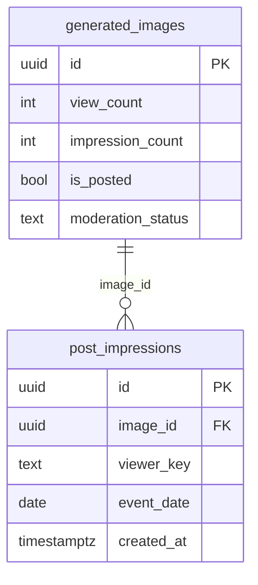
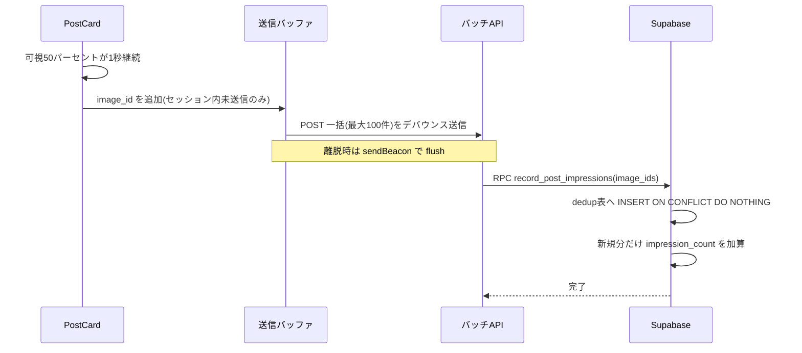
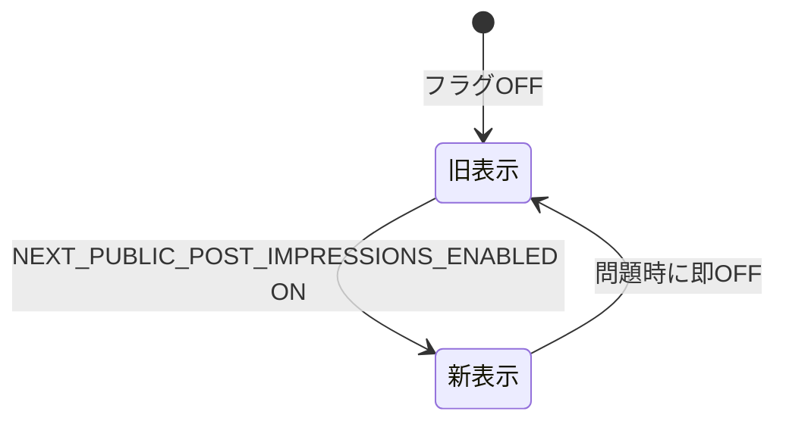
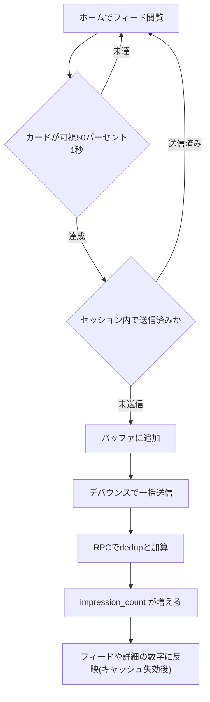
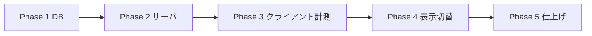

# 実装計画書: 公開「閲覧数」を viewable インプレッションへ変更

作成日: 2026-06-29 / 対象: Persta.AI

## 目的

ホーム/コンテンツ詳細に表示している公開「閲覧数」を、**詳細到達数(リーチ寄り)**から **viewable インプレッション(ホームフィードでの表示も含む、実際に画面に入った回数)**に変える。母数が「詳細を開いた一部の人」→「フィードで見た人」に広がるため、数値が大きく・速く伸び、**アプリが賑わって見える**(ユーザー数が少なく見える課題の緩和)。ただし“水増し”ではなく**実際に見られた回数(viewable)**として正直に出す。

## 確定済みの方針(ユーザー合意)

> 注: フラグ名はクライアント側UIゲートのため `NEXT_PUBLIC_` プレフィックス必須(MRAR学習)。i18n は `messages/*.ts`(全16ロケールモジュール、`messages/types.ts` がキー一致を型強制)。

- **A ラベル**: 👁 アイコンのまま(リネームしない)。
- **B 重複除外**: セッション単位で除外(クライアント sessionStorage 主担保 + DB 日次 UNIQUE をバックストップ)。
- **C 公開数値**: 併存。**公開数値=インプレッション**、既存 `view_count`(詳細到達)は**内部分析用に残す**。
- **viewable 定義**: カードが**可視率50% × 連続1秒**で表示されたとき1カウント(IAB 標準に整合)。
- **流用**: ポップアップバナーの impression 基盤(sessionStorage 除外 / DB UNIQUE / 集計 / IP hash / keepalive送信)。

---

## コードベース調査結果(Phase B)

### (a) 現 `view_count`
- 列: `generated_images.view_count INTEGER DEFAULT 0 NOT NULL CHECK(>=0)`(`supabase/migrations/20250109000006_likes_comments.sql:29-32`)。型 `features/posts/types.ts:35`。
- 加算: クライアント `incrementViewCountAPI`(`features/posts/lib/api.ts:100-111`)→ `POST /api/posts/[id]/view`(`app/api/posts/[id]/view/route.ts`、admin除外 `:43-45`)→ `incrementViewCount`(`features/posts/lib/server-api.ts:1609-1640`)→ RPC `increment_view_count`(`...20250109000006...:120-127`)。詳細ページ `useEffect` で1回(`PostDetailContent.tsx:42-48`)。**重複除外なし**。
- 表示(👁 Eye + 数値、`count>0` のみ): `PostCard.tsx:191-198`、`ViewCount.tsx`、`PostDetailStats.tsx:58`/`PostActions.tsx:58`。
- **過去の異常増加不具合**: サーバーレンダー/prefetch(RSC先読み)で過剰加算 → 対策で「加算はクライアント useEffect のみ」「`Link prefetch=false`」「admin/クローラ除外」。今回も同種リスクに注意。

### (b) 流用できるバナー impression 部品
- クライアント sessionStorage 除外: `usePopupBanner.ts:35,60-88`(送信済みID Set)。
- DB UNIQUE 除外: 認証 `popup_banner_views (banner_id,user_id)`、ゲスト `popup_banner_guest_events (banner_id,ip_hash,event_date,action_type)` ON CONFLICT DO NOTHING。
- 集計 UPSERT: `popup_banner_analytics (banner_id,event_date,event_type) count++`。RPC `record_popup_banner_interaction`(`app/api/popup-banners/interact/route.ts`)。
- IP hash: `features/popup-banners/lib/popup-banner-client-ip.ts:15-54`。送信は `keepalive:true`。
- 雛形 migration: `supabase/migrations/20260326102740_add_popup_banners.sql` / `20260326231403_*.sql`。

### (c) フィード差し込み
- 描画: `app/[locale]/page.tsx:202` → `CachedHomePostList`(use cache, 初期20件) → `PostList`(無限スクロール) → Masonry(4列) → `PostCard×N`。
- 既存 IntersectionObserver は**ページネーション専用**(`PostList.tsx:70-73`)。`react-intersection-observer` の `useInView` は使用実績あり → viewable 判定に再利用可。
- viewable 計測の推奨位置: `PostCard` 内に `useInView({threshold:0.5})` + 1秒タイマー(`PostCard.tsx:24-204`)。
- **sendBeacon/書き込みバッチは未実装=新規**(読み取りバッチ前例: `app/api/posts/likes/batch/route.ts`、最大100件のサイズ制約パターンのみ流用)。
- 注意: 1画面 20–40枚 × `useInView` → unmount クリーンアップ・(必要なら)共有Observer/仮想化、フレーム影響を実機計測。

### (d) 保存・集計
- 高頻度カウントは**ホット行 `UPDATE +1` を避け**、(i) 公開カウンタ列 + (ii) dedup/イベント表 + バッチ で緩和(バナー方式踏襲)。
- RLS: dedup/集計の生テーブルは公開SELECT禁止(service role/RPC前提)。公開数値は `generated_images` の公開カウンタ列に乗せ既存RLS(`is_posted=true AND moderation_status='visible'`)で読む。
- キャッシュ: フィード/詳細は `use cache`(`cacheLife("minutes")`)。impression は即時反映不要 → 自然失効に委ねる(厳密性より負荷軽減)。

---

## キー設計判断(ADR)

### ADR-001: 公開カウンタ列 `impression_count` + dedup表 + バッチRPC(ホット行回避)
- **Decision**: `generated_images.impression_count INT DEFAULT 0` を**公開数値**として持つ。重複除外は `post_impressions(image_id, viewer_key, event_date)` の UNIQUE(=日次×視聴者×投稿)。RPC `record_post_impressions(p_image_ids uuid[])` が「dedup表に INSERT ... ON CONFLICT DO NOTHING → 新規に入った分だけ `impression_count += n`」を**バッチ原子実行**。
- **Reason**: 公開数値はフィードで軽く読める(列)。加算は「1日1回/視聴者/投稿」かつバッチなのでホット行を大幅緩和。dedup表が将来の日次集計(admin チャート)も兼ねる。
- **Consequence**: `viewer_key` = 認証 `u:<user_id>` / ゲスト `g:<ip_hash>`、`event_date` は JST。

### ADR-002: 重複除外は二段(クライアント sessionStorage + DB 日次 UNIQUE)
- **Decision**: クライアントは sessionStorage で「このセッションで送信済みの image_id」を抑止(方針B=セッション単位の主担保、バナー流用)。DB は `(image_id, viewer_key, event_date)` UNIQUE で多端末/セッション消去/改ざんの最終防波堤。
- **Reason**: 信頼性とコストの両立。sessionStorage(localStorage ではない=タブ寿命でリセット、語義「セッション」に一致)。

### ADR-003: 異常増加の再発防止(最重要)
- **Context**: 過去に prefetch/RSC で過剰加算。viewable もクライアント発火。
- **Decision**: (1) **マウントではなく「可視50%×1秒経過後」のみ**カウント、(2) sessionStorage dedup を必ず通す、(3) `PostCard` の `prefetch=false` 維持、(4) admin/クローラ除外(view route と同様)、(5) BFCache 復帰(`pageshow`)/StrictMode 二重実行は sessionStorage dedup で吸収。
- **Consequence**: 計測経路に必ずガードを通す。実機で過剰加算が無いことを検証。

### ADR-004: 切替時のベースライン補填(数値をゼロに落とさない)
- **Context**: `impression_count` を 0 から始めると、表示を切替えた瞬間に既存投稿の数字が 0 に落ちる(目的=数字を大きく見せる に逆行)。
- **Decision**: migration で **`impression_count := view_count` を初期補填**(既存の詳細到達を下限とし、以降のインプレッションを上乗せ)。
- **Reason**: 連続性を保ち、切替直後から自然に大きい値。
- **Consequence**: 公開数値 = 旧到達ベースライン + 新フィードインプレッション(👁の意味=「見られた回数」と整合)。

### ADR-005: 機能フラグで段階公開
- **Decision**: env フラグ `NEXT_PUBLIC_POST_IMPRESSIONS_ENABLED` で「計測の有効化」と「表示の切替(view_count→impression_count)」をゲート。OFF時は従来表示・計測なし。
- **Reason**: 異常増加リスクがあるため、本番で即OFFできる安全弁。Creator Looks 等と同パターン。

---

## 1. 概要図

### データモデル(ER)

### 計測フロー(シーケンス)

### 表示の状態

### ユーザー操作フロー

### フェーズ依存

---

## 2. EARS(要件定義)

- **EARS-01(イベント)** When a feed card is viewable(50% for 1s) and not yet sent in this session, the system shall buffer its image id and send it in a debounced batch.
  フィードカードが可視50%×1秒かつ当セッション未送信のとき、image id をバッファして一括送信する。
- **EARS-02(状態)** While processing an impression batch, the system shall dedupe by (image_id, viewer_key, event_date) and increment `impression_count` only for newly recorded rows.
  バッチ処理中は (image_id, viewer_key, event_date) で重複除外し、新規分だけ `impression_count` を加算する。
- **EARS-03(オプション)** Where `NEXT_PUBLIC_POST_IMPRESSIONS_ENABLED` is on, the system shall display `impression_count` next to the 👁 icon; otherwise it shall display the legacy `view_count`.
  フラグONなら👁の数字に `impression_count` を表示、OFFなら従来 `view_count`。
- **EARS-04(権限)** Where the viewer is a full admin or a crawler/prefetch request, the system shall not count an impression.
  admin・クローラ・prefetch ではインプレッションを数えない。
- **EARS-05(イベント)** When the page is hidden/unloaded, the system shall flush the pending buffer via sendBeacon/keepalive.
  ページ離脱時、未送信バッファを sendBeacon/keepalive で送る。
- **EARS-06(状態)** While displaying impressions, the system shall keep incrementing the internal `view_count` on detail open(unchanged) for analytics.
  表示はインプレッションだが、詳細到達の内部 `view_count` 加算は従来どおり継続(分析用)。
- **EARS-07(異常系)** If a batch request fails, then the system shall fail silently and may retry on next flush (no UI disruption).
  バッチ失敗時は静かに失敗し、次回 flush で再送し得る(UIを妨げない)。

---

## 4. 実装計画(フェーズ + TODO)

### Phase 1: DB
目的: 公開カウンタ・dedup表・バッチRPC・ベースライン補填。
ビルド確認: migration 適用 + typecheck/build 緑。

- [ ] migration: `generated_images.impression_count INT DEFAULT 0 NOT NULL CHECK(>=0)` 追加。
- [ ] migration: `post_impressions(id, image_id FK, viewer_key text, event_date date, created_at)` + UNIQUE `(image_id, viewer_key, event_date)`。RLS: 公開SELECT禁止(service role/RPC前提)。index `(image_id, event_date)`。
- [ ] RPC `record_post_impressions(p_image_ids uuid[], p_viewer_key text)`(SECURITY DEFINER): 各 id を dedup表へ INSERT ON CONFLICT DO NOTHING、`GET DIAGNOSTICS` で新規件数を取り `impression_count += n`(image_idごと)。`p_image_ids` は上限100でガード。
- [ ] **ベースライン補填**(ADR-004): 同 migration で `UPDATE generated_images SET impression_count = view_count`(初期1回)。
- [ ] 型更新: `features/posts/types.ts` に `impression_count`。
- [ ] 参考: バナー `20260326102740/231403` のテーブル・RPC・UPSERT。

### Phase 2: サーバーサイド
目的: バッチ書き込みAPI + viewer_key 解決 + admin/クローラ除外。
ビルド確認: API 単体で複数 image_id を冪等に記録できる。

- [ ] API `POST /api/posts/impressions/batch`: Zod `{ image_ids: string[] (1..100) }`。`getUser()` → 認証は `u:<id>`、ゲストは IP hash(`popup-banner-client-ip` 流用)で `g:<hash>`。admin/クローラ/prefetch は記録しない(`view` route のガード流用)。フラグ `NEXT_PUBLIC_POST_IMPRESSIONS_ENABLED` OFF は 204/no-op。RPC 呼び出し。
- [ ] `getPosts()`/詳細取得が `impression_count` を返すよう拡張(既存 select に追加)。
- [ ] キャッシュ方針: 即時 revalidate せず `cacheLife` 自然失効に委ねる(コメントで明記)。

### Phase 3: クライアント計測
目的: viewable 判定 + セッション除外 + バッチ/Beacon送信。
ビルド確認: フィードで可視カードがバッチ送信される(過剰加算なし)。

- [ ] `PostCard.tsx` に `useInView({threshold:0.5})` + 1秒滞在タイマー。達成時のみ計測候補に。
- [ ] セッション除外: sessionStorage(`usePopupBanner` の Set パターン流用、キー例 `post-impressions-sent-v1`)。
- [ ] 送信バッファ(モジュールスコープ)+ 1–2秒デバウンス → `POST /api/posts/impressions/batch`。
- [ ] 離脱 flush: `visibilitychange`(hidden)/`pagehide` で `navigator.sendBeacon`(or fetch keepalive)。
- [ ] 計測対象画面の明示制御: PostCard に `trackImpressions` prop(または context)を足し、**ホームフィードのみ true**(他画面での混入防止)。要: PostCard 再利用面の網羅確認。
- [ ] ガード: マウント単独では数えない/`prefetch=false` 維持/admin・クローラ除外/StrictMode・BFCache は sessionStorage で吸収(ADR-003)。

### Phase 4: 表示切替
目的: 👁 の数字を impression_count に(フラグ連動)。
ビルド確認: フラグON/OFFで表示が切替わる。

- [ ] `PostCard.tsx:191-198`・`ViewCount.tsx`・`PostActions.tsx:58`/`PostDetailStats.tsx:58` の表示元を、フラグON時 `impression_count`、OFF時 `view_count` に。
- [ ] 詳細ページの内部 `view_count` 加算は**維持**(表示はインプレッション)。
- [ ] i18n: 文言変更があれば `messages/ja.ts`・`en.ts`(👁数値のみなら不要の可能性)。

### Phase 5: 仕上げ
目的: 性能・異常系・テスト・(任意)admin集計。
ビルド確認: lint/typecheck/test/build 緑。

- [ ] 実機: 1画面40枚での `useInView` 負荷・過剰加算が無いこと・数値の伸び方を確認(プレビューadmin垢/シークレット)。
- [ ] 異常系(バッチ失敗・離脱・連打スクロール)ハンドリング。
- [ ] ユニットテスト(RPC dedup/加算、viewer_key 解決、viewable ロジック、フラグ表示分岐)。
- [ ] (任意・別フェーズ) admin 用の日次インプレッション集計チャート(`post_impressions` を `event_date` で集計、バナー analytics API 流用)。

---

## 5. 修正対象ファイル一覧

| ファイル | 操作 | 変更内容 |
|----------|------|----------|
| `supabase/migrations/<ts>_add_post_impressions.sql` | 新規 | `impression_count` 列 + `post_impressions` 表 + RPC + ベースライン補填 |
| `features/posts/types.ts` | 修正 | `impression_count` 追加 |
| `features/posts/lib/server-api.ts` | 修正 | select に `impression_count`、(任意)記録 helper |
| `app/api/posts/impressions/batch/route.ts` | 新規 | バッチ記録API(認証/ゲスト・admin除外・フラグ) |
| `features/posts/lib/impressions-client.ts` | 新規 | バッファ/デバウンス/sessionStorage/sendBeacon |
| `features/posts/components/PostCard.tsx` | 修正 | viewable計測 + 表示元切替 |
| `features/posts/components/ViewCount.tsx` / `PostActions.tsx` / `PostDetailStats.tsx` | 修正 | 表示元を impression_count に(フラグ連動) |
| `lib/env.ts` | 修正 | `NEXT_PUBLIC_POST_IMPRESSIONS_ENABLED` フラグ |
| `messages/ja.ts` / `en.ts` | 修正(任意) | 文言 |

---

## 6. 品質・テスト観点

### 品質チェックリスト
- [ ] **過剰加算なし**(prefetch/RSC/BFCache/StrictMode)— 最重要。
- [ ] **権限**: `viewer_key` はサーバ(`auth.uid()`/IP hash)で解決、body 偽装不可。admin/クローラ除外。
- [ ] **整合性**: dedup UNIQUE + 新規分のみ加算。バッチ上限100。
- [ ] **性能**: 大量 `useInView` のフレーム影響、ホット行緩和(バッチ+日次dedup)。
- [ ] **i18n**: 必要箇所のみ。

### テスト観点
| カテゴリ | 内容 |
|----------|------|
| 正常系 | 可視→バッチ→dedup→impression_count 増加→表示反映 |
| 異常系 | バッチ失敗・離脱flush・連打スクロールで過剰加算しない |
| 権限 | admin/クローラ/prefetch で増えない・viewer_key 偽装不可 |
| 実機 | 40枚/画面の負荷・数値の伸び・フラグON/OFF |

---

## 7. ロールバック方針
- **フラグ**: `NEXT_PUBLIC_POST_IMPRESSIONS_ENABLED` OFF で従来表示・計測停止に即時復帰。
- **DB**: migration down(列・表・RPC drop)。`impression_count` は表示フラグOFFなら未使用で無害。ベースライン補填は一度きりUPDATEのため down では列削除で消える。
- **Git**: フェーズ単位コミットで revert 可。

## 8. 使用スキル
| スキル | 用途 | フェーズ |
|--------|------|----------|
| `/project-database-context` | DB設計参照 | Phase 1 |
| `/spec-extract`・`/spec-write`・`/test-generate` | テスト | テスト |
| `/git-create-pr` | PR作成 | 各フェーズ |

---

## 確認したい点(推奨込み)

1. **ベースライン補填(ADR-004)**: 切替時に `impression_count := view_count` を初期補填 → 数字がゼロに落ちず、切替直後から大きい。**推奨: 補填する**。よいか。
2. **機能フラグ(ADR-005)**: `NEXT_PUBLIC_POST_IMPRESSIONS_ENABLED` で段階公開。**推奨: 付ける**(異常増加の安全弁)。よいか。
3. **詳細ページを開いた行為**: v1 では**インプレッション計測対象にしない**(ホームフィードの可視のみ計測。詳細は従来 `view_count` を内部加算、表示は impression_count)。**推奨: この切り分け**。よいか。

> リスク再掲: 異常増加の再発(最重要・ガードで対処)/ ホット行(バッチ+日次dedupで緩和)/ ゲスト Cookie 発行範囲(ホームでの端末ID/IP hash 運用は実装時に確定)/ PostCard 再利用面の網羅。
