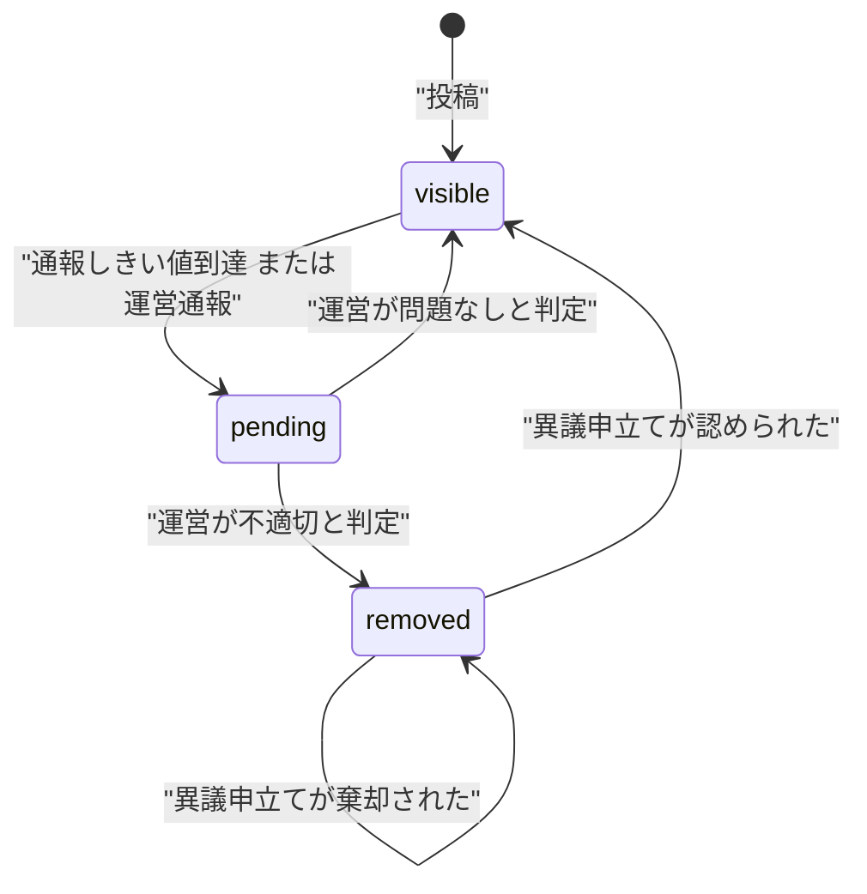
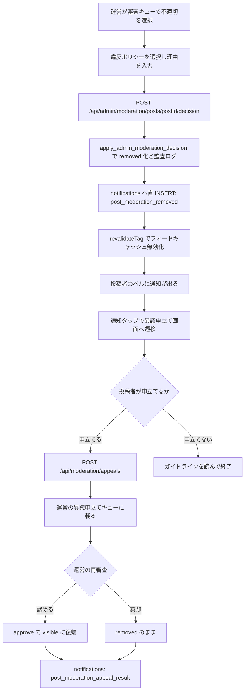
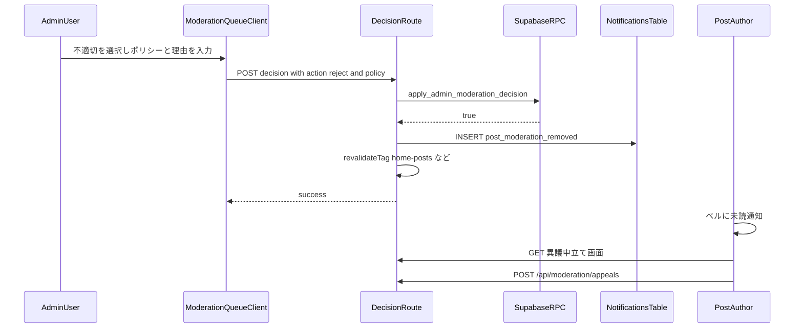
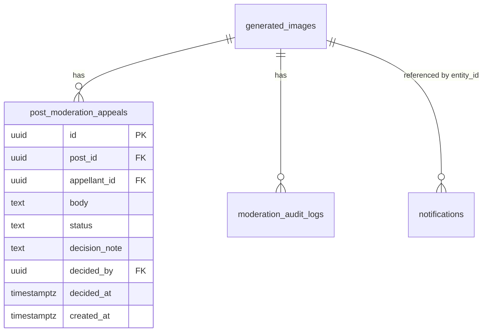
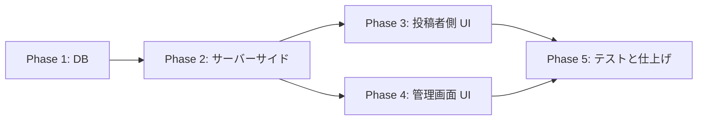

# 投稿モデレーション通知・異議申立て 実装計画

作成日: 2026-07-28
対象: 投稿（`generated_images`）のモデレーション判定結果を投稿者へ通知し、異議申立てを受け付ける

## 背景

現状、運営が `/admin/moderation` で「不適切」と判定すると、投稿は `moderation_status = 'removed'` になり全ユーザー（投稿者本人を含む）から見えなくなるが、**投稿者への通知・メール・プッシュが一切送られない**（無言削除）。理由を伝える手段も、異議を申し立てる導線もない。

### 外部調査の要約

| 論点 | 結論 |
| --- | --- |
| 日本 情プラ法（2025/4/1施行） | 第27条で削除時に「その事実と理由」を発信者へ通知、または発信者が容易に知り得る状態に置く義務。ただし対象は大規模特定電気通信役務提供者（登録型で平均月間発信者数1000万人以上）。**Persta.AI は対象外＝法的義務なし** |
| 情プラ法 第26条 | 削除基準の策定・公表義務。コミュニティガイドラインで実質達成済み |
| EU DSA 第17条 | ホスティングサービス提供者**全般**に適用（micro/small 企業免除は第20〜24条のみで第17条は免除されない）。理由説明に (a)措置の種類・範囲・期間 (b)依拠した事実 (c)自動化手段の使用 (d)法的根拠 (e)契約上の根拠 (f)救済手段 を含めることを要求。対象措置に「可視性の制限」を含む |
| TikTok | 通知に「投稿日 + 違反した具体的ポリシー + ガイドラインへのリンク + 異議申立てボタン」。導入後**異議申立て要求が14%減少**、ガイドライン閲覧が約3倍、再違反率も低下 |
| Meta | フィード内通知 + 違反ポリシー箇所の参照 + 「なぜ禁止か」の短い説明 + 再審査請求。strike system で累積管理 |
| Santa Clara Principles | 異議申立ての最低基準は「元の判断に関与していない人による人的レビュー」「追加情報を提出する機会」「結果の通知と理解可能な理由の説明」 |

**設計上の主要な示唆**: 丁寧な通知は運営のサポート負荷を増やすのではなく減らす（TikTok 実測）。無言削除は問い合わせと不信を生む側にある。

### 今回の決定事項（ヒアリング結果）

- スコープ: **通知 ＋ 異議申立て導線**（strike 管理は対象外）
- 通知タイミング: **reject のみ**（approve 復帰時・pending 化時は通知しない）
- removed の生成ギャラリー表示: **「削除済み」バッジを付けて残す**
- 通知チャネル: **アプリ内通知のみ**（メール・プッシュは対象外）

---

## コードベース調査結果

### 既存のモデレーション基盤（変更の土台）

| 要素 | 実体 | 備考 |
| --- | --- | --- |
| 判定 API | `app/api/admin/moderation/posts/[postId]/decision/route.ts` | `requireAdmin()` → RPC → `logAdminAction()`。**`revalidateTag` を呼んでいない** |
| 判定 RPC | `apply_admin_moderation_decision`（`supabase/migrations/20260209094500_...sql`） | status・reason・approved_at 更新 + `moderation_audit_logs` 挿入を atomic に実行。SECURITY DEFINER |
| 審査キュー API | `app/api/admin/moderation/posts/route.ts` | `moderation_status = 'pending'` を `moderation_updated_at` 降順で返す |
| 審査キュー UI | `app/(app)/admin/moderation/ModerationQueueClient.tsx` | 判定後はキュー再取得のみ。`router.refresh()` なし |
| 審査キュー ページ | `app/(app)/admin/moderation/page.tsx` | ページ認証は `getUser()` + `getAdminUserIds()`（API は `requireAdmin()`）。用途で異なるので踏襲する |
| 決定スキーマ | `features/moderation/lib/schemas.ts:32` | `action: "approve" \| "reject"`, `reason: string.max(300).optional()` |
| 通報タクソノミ | `constants/report-taxonomy.ts` | `rights / sexual / violence / harassment / danger / spam_fraud / other` の7カテゴリ + サブカテゴリ。**違反ポリシーの参照にそのまま再利用できる** |
| 監査ログ | `moderation_audit_logs`（`action IN ('pending_auto','approve','reject')`） | `metadata JSONB` あり |

### 通知基盤

| 要素 | 実体 | 今回の影響 |
| --- | --- | --- |
| テーブル | `notifications`（`supabase/migrations/20251213013611_notifications.sql`） | `type` CHECK に**現在14値**、`entity_type` CHECK に `post` を含む（本番実測済み） |
| RLS | INSERT は `WITH CHECK (false)`。SELECT/UPDATE/DELETE は本人のみ | service_role クライアント（`createAdminClient()`）は RLS をバイパスするので直 INSERT 可 |
| 生成関数 | `create_notification`（`20251213101944_fix_notifications_security_definer.sql`） | `recipient_id = actor_id` で self-skip。`notification_preferences` は like/comment/follow のみ判定 |
| TS 型 | `features/notifications/types.ts:5` は `'like' \| 'comment' \| 'follow' \| 'bonus'` の4値のみ | **DB の14値と既に乖離**。今回追加分は型にも追加する |
| 表示ロジック | `features/notifications/lib/presentation.ts` の `formatNotificationContent` | `default:` で DB の `title`/`body` にフォールバックするため、**型を追加しなくても表示自体は壊れない**。i18n したい場合は `case` を追加する |
| 遷移ロジック | `features/notifications/hooks/useNotifications.ts:425` | `entity_type === "post"` → `/posts/{entity_id}` に push。**removed な投稿は本人でも開けないため死んだリンクになる（要分岐追加）** |
| タブ | `features/notifications/lib/notification-tab.ts` | `activity` / `announcements` の2タブ。type によるフィルタはないので activity に出る |

### 参考にできる既存の「admin 判定 → 通知」実装

`app/api/admin/style-templates/[id]/decision/route.ts` が最も近い。パターンは以下（`docs/architecture/data.ja.md:311` に方針として明記済み）:

1. `requireAdmin()`
2. 対象を取得して申請者 `user_id` を得る
3. `apply_user_style_template_decision` RPC で状態 + 監査ログを atomic 更新
4. `logAdminAction()` で横断監査ログ
5. **`notifications` へ直 INSERT**（`create_notification` RPC は迂回）
6. `revalidateTag()` でキャッシュ無効化

Creator Looks 側（`supabase/migrations/20260603100100_...sql`）は trigger 方式（`AFTER UPDATE OF moderation_status ON user_style_templates`）だが、こちらは通知文言を DB に日本語ハードコードしている。

### 投稿者側の可視性（現状の歪み）

| 経路 | 実装 | removed 時 |
| --- | --- | --- |
| ホームフィード | `features/posts/lib/server-api.ts:432` `buildOwnerVisibleOrFilter` | 消える（本人も） |
| プロフィール投稿グリッド | `features/my-page/lib/server-api.ts:217` `getUserPostsServer` | 消える（本人も。`visible`/`pending` のみ許可） |
| 投稿詳細 | `features/posts/lib/server-api.ts:840` | 開けない（`isOwnerPending` は pending 限定） |
| **マイページ生成ギャラリー** | `features/my-page/lib/server-api.ts:245` `getMyImagesServer` | **残る。`moderation_status` を一切フィルタしていない** |

- カード UI: `features/my-page/components/MyImageCard.tsx`。`detailUrl = /posts/${image.id}?from=my-page` を固定生成しており、removed では死んだリンクになる
- 型: `GeneratedImageRecord`（`features/generation/lib/database.ts:9`）は `moderation_status` / `moderation_reason` を既に保持。**型追加は不要**

### i18n の制約（重要）

`messages/` に**16ロケール**（ja/en/ko/zh-CN/zh-TW/es/fr/de/it/pt/ar/hi/id/th/vi）。`messages/ja.ts` の `jaMessages` が master で、他は `} satisfies DeepReplaceStrings<typeof jaMessages>;`（例: `messages/en.ts:1898`）。**キーを1つ追加すると16ファイル全てに追加しないと typecheck が落ちる**。

### Supabase 接続

`npx supabase db query --linked` で参照系クエリの実行を確認済み。`notifications` の CHECK 制約は本番実測で確認した。

---

## 1. 概要図

### 状態遷移

### 削除から異議申立てまでのフロー

### API 通信シーケンス

### データモデル

---

## 2. EARS 要件定義

### 通知

- **REQ-001**: When an admin rejects a post via the moderation queue, the system shall insert a `post_moderation_removed` notification addressed to the post author, containing the violated policy category, the admin-entered reason, and a link to the appeal screen.
  管理者が審査キューで投稿を「不適切」と判定したとき、システムは投稿者宛に `post_moderation_removed` 通知を作成し、違反ポリシーカテゴリ・運営が入力した理由・異議申立て画面へのリンクを含めなければならない。

- **REQ-002**: If the notification insert fails, then the system shall still return success for the moderation decision and log the failure, so that the removal itself is never rolled back by a notification error.
  通知の INSERT が失敗した場合、システムはモデレーション判定自体は成功として返し、失敗をログに記録しなければならない（通知エラーで削除がロールバックされてはならない）。

- **REQ-003**: While a post is in `pending` status, the system shall not notify the author.
  投稿が `pending` の間、システムは投稿者に通知してはならない。

- **REQ-004**: When an admin approves a post, the system shall not create an author-facing notification but shall invalidate the feed cache tags so the post returns to the feed without waiting for natural cache expiry.
  管理者が「問題なし」と判定したとき、システムは投稿者向け通知を作成せず、フィードのキャッシュタグを無効化して自然失効を待たずに復帰させなければならない。

- **REQ-005**: Where the acting admin is the post author, the system shall skip the notification.
  判定した管理者が投稿者本人である場合、システムは通知をスキップしなければならない。

### 異議申立て

- **REQ-006**: When the author opens the appeal screen for a removed post they own, the system shall display the post thumbnail, the violated policy category, the admin reason, and a link to the community guidelines.
  投稿者が自分の removed 投稿の異議申立て画面を開いたとき、システムは投稿サムネイル・違反ポリシーカテゴリ・運営の理由・コミュニティガイドラインへのリンクを表示しなければならない。

- **REQ-007**: When the author submits an appeal, the system shall create exactly one `post_moderation_appeals` row with `status = 'pending'`, resolving `appellant_id` from the server-side session.
  投稿者が異議申立てを送信したとき、システムは `status = 'pending'` の `post_moderation_appeals` 行をちょうど1件作成し、`appellant_id` はサーバー側セッションから解決しなければならない。

- **REQ-008**: If the author has already appealed the same post, then the system shall reject the request with a duplicate error.
  同じ投稿に既に異議申立て済みの場合、システムは重複エラーで拒否しなければならない。

- **REQ-009**: If the target post is not owned by the requester or is not in `removed` status, then the system shall reject the appeal with a 403 or 404.
  対象投稿が申立て者の所有でない、または `removed` でない場合、システムは 403 または 404 で拒否しなければならない。

- **REQ-010**: When an admin decides an appeal, the system shall update the appeal row to `upheld` or `overturned`, record `decided_by` and `decided_at`, and notify the appellant with `post_moderation_appeal_result`.
  管理者が異議申立てを判定したとき、システムは申立て行を `upheld` または `overturned` に更新し、`decided_by` と `decided_at` を記録し、`post_moderation_appeal_result` で申立て者に通知しなければならない。

> **用語の対応（実装時の混同防止）**: `uphold` / `upheld` は「**元の削除判定を支持する**」＝ UI 上の「**棄却する**」で、投稿は `removed` のまま。`overturn` / `overturned` は「**元の削除判定を覆す**」＝ UI 上の「**認める**」で、投稿は `visible` に復帰する。日本語の「認める」を `uphold` に対応させると挙動が逆転するため注意する。

- **REQ-011**: When an appeal is overturned, the system shall restore the post to `visible` via `apply_admin_moderation_decision` and invalidate the feed cache tags.
  異議申立てが認められたとき、システムは `apply_admin_moderation_decision` 経由で投稿を `visible` に戻し、フィードのキャッシュタグを無効化しなければならない。

- **REQ-012**: While the appeal reviewer is the same admin who made the original decision, the system shall display a warning in the admin UI.
  異議申立ての審査者が元の判定を行った管理者と同一である間、システムは管理画面に警告を表示しなければならない。

### 権限・可視性

- **REQ-013**: While a post is `removed`, the system shall keep it visible in the author's own generation gallery with a removed badge, and shall route the card to the appeal screen instead of the post detail page.
  投稿が `removed` の間、システムは投稿者自身の生成ギャラリーに「削除済み」バッジ付きで表示を維持し、カードの遷移先を投稿詳細ではなく異議申立て画面にしなければならない。

- **REQ-014**: The system shall not expose the appeal screen, appeal API, or removal reason of a post to any user other than its author and admins.
  システムは、異議申立て画面・異議申立て API・削除理由を、投稿者本人と管理者以外のいかなるユーザーにも公開してはならない。

- **REQ-015**: Where the notification type is a moderation type, the system shall deliver it regardless of `notification_preferences`.
  通知タイプがモデレーション系である場合、システムは `notification_preferences` に関係なく配信しなければならない。

---

## 3. ADR

### ADR-001: 通知は trigger ではなく判定 API 内の直 INSERT にする

- **Context**: リポジトリには2つの前例がある。Creator Looks は `AFTER UPDATE OF moderation_status` の trigger（`user_style_templates`）、style_template は判定 API 内の直 INSERT（`docs/architecture/data.ja.md:311` に方針として明記）。
- **Decision**: `app/api/admin/moderation/posts/[postId]/decision/route.ts` 内で `createAdminClient()` から `notifications` へ直 INSERT する。
- **Reason**:
  1. `generated_images.moderation_status` は**通報 API（`app/api/reports/posts/route.ts`）からも `pending` に更新される**。trigger にすると pending 遷移でも発火するため、reject のみ通知する要件（REQ-003）を満たすには trigger 内に条件分岐が必要になり、意図が分散する。
  2. 判定 API は通知の recipient に使う `user_id` を取得する必要があり、これは trigger では `NEW` から取れるが、違反ポリシーカテゴリのような API 層の入力を渡すには metadata 経由の迂回が必要になる。
  3. `apply_admin_moderation_decision` RPC の呼び出し元はこの1ルートのみなので、DB 層に寄せる利点（複数経路からの一貫性保証）がない。
- **Consequence**: DB 直接更新（psql や Supabase Studio からの手動 UPDATE）では通知が飛ばない。運用手順として「removed 化は必ず管理画面から行う」を守る必要がある。監査ログは RPC 側に残るので事後検知は可能。

### ADR-002: 通知文言は i18n し、DB には reason code を保存する

- **Context**: 既存の Creator Looks trigger と style_template 判定 API は通知の `title`/`body` に日本語をハードコードしている。`formatNotificationContent` は未知の type を `default:` で DB の title/body にフォールバックさせる。
- **Decision**: `presentation.ts` に `case "post_moderation_removed"` と `case "post_moderation_appeal_result"` を追加し、i18n キーから文言を組み立てる。DB の `data` には `policy_category` / `policy_subcategory` / `admin_reason` / `appeal_status` を構造化して保存し、`title`/`body` には日本語のフォールバック文言も入れておく。
- **Reason**:
  1. DSA 第17条4項は「明確で容易に理解できる」理由説明を要求しており、16ロケール対応のアプリで日本語固定は要件を満たさない。
  2. `default:` フォールバックが既にあるため、i18n キー追加前でも表示は壊れず、段階的に移行できる。
  3. 運営が入力する自由記述の理由は翻訳できないため、**枠（ポリシー名・案内文）を i18n し、運営の理由文は引用として原文表示**する。TikTok もポリシー名は正典・追加コンテキストは原文の構成を取っている。
- **Consequence**: `messages/` 16ファイル全てにキー追加が必要（`satisfies DeepReplaceStrings<typeof jaMessages>` のため）。日本語以外は暫定的に英語文言を流用してよい。

### ADR-003: 違反ポリシーは既存の `REPORT_TAXONOMY` を再利用する

- **Context**: 現在 reject は自由記述の `reason`（最大300字）のみ。DSA 第17条3項(e) は「契約上の根拠」＝どの規約条項に違反したかの明示を求める。TikTok/Meta も違反ポリシー名を通知に含める。
- **Decision**: 新規タクソノミを作らず、`constants/report-taxonomy.ts` の `REPORT_TAXONOMY`（7カテゴリ + サブカテゴリ）から管理者が違反カテゴリを選択する。`moderationDecisionSchema` に `policyCategoryId` / `policySubcategoryId` を追加する。
- **Reason**: 通報時にユーザーが選ぶカテゴリと運営が判定に使うカテゴリが同一語彙になり、通報→判定→通知が一貫する。i18n キー（`moderation.categoryRights` 等）も既に16ロケール分揃っている。
- **Consequence**: 「どのカテゴリにも当てはまらないが削除する」ケースは `other` を使う。将来ガイドラインの条項番号と対応させたくなった場合はマッピング表の追加が必要。

### ADR-004: 異議申立ては新規テーブルにする（`post_reports` を流用しない）

- **Context**: 通報は `post_reports`、監査は `moderation_audit_logs` に既にある。
- **Decision**: `post_moderation_appeals` を新設する。
- **Reason**: 通報は「第三者→投稿」の関係、異議申立ては「投稿者→運営判定」の関係で、主体・ライフサイクル・RLS が全く異なる。`moderation_audit_logs` は運営操作の追記専用ログで、`status` を持つ可変レコードには不適。
- **Consequence**: テーブルが1つ増える。`UNIQUE(post_id, appellant_id)` で1投稿1回に制限する。

### ADR-005: 「元の判断者以外によるレビュー」は技術強制せず可視化に留める

- **Context**: Santa Clara Principles は異議申立ての最低基準として「元の決定に関与していない人または合議体による人的レビュー」を挙げる。
- **Decision**: `decided_by` を元判定（`moderation_audit_logs`）と異議申立て（`post_moderation_appeals`）の両方に記録し、**同一人物の場合は管理画面に警告バナーを出す**。ブロックはしない。
- **Reason**: 運営体制が実質1〜2名の現状で「別人によるレビュー」を技術的に強制すると、異議申立てが永久に処理できなくなる。理想を掲げて機能を止めるより、逸脱を可視化して記録に残す方が実効的。
- **Consequence**: 原則を完全には満たさない。運営規模が拡大した時点でブロックに変更できるよう、判定 API 側に「同一人物か」の判定ロジックだけは実装しておく。

### ADR-006: pending の「審査中」バッジは今回作らない

- **Context**: 現状 pending 中の投稿は投稿者からは通常表示のまま見える（他ユーザーからは非表示）。
- **Decision**: `removed` のみバッジを出し、`pending` にはバッジを出さない。
- **Reason**: 「reject のみ通知」の決定と整合させる。pending の可視化は「通報されている」事実の開示にあたり、誤通報段階での不安を招く。DSA 第17条は可視性制限も対象とするため厳密には開示が望ましいが、Persta.AI は DSA 指定事業者ではなく、通報→判定のリードタイムも短いため今回は見送る。
- **Consequence**: 投稿者は pending 期間中に自分の投稿が他者から見えていないことを知る手段がない。将来 DSA 対応を厳密化する場合は Phase 6 として追加する。

### ADR-007: 判定 API の `revalidateTag` 欠落を本計画で同時に修正する

- **Context**: `app/api/admin/moderation/posts/[postId]/decision/route.ts` は `revalidateTag` を呼んでおらず、`ModerationQueueClient` も `router.refresh()` を呼ばない。一方で通報 API（`app/api/reports/posts/route.ts:346`）は5つのタグを即時無効化している。結果として「非表示は即時・復帰は `cacheLife("minutes")` の自然失効待ち」という非対称がある。
- **Decision**: 同ファイルを触るため、本計画の Phase 2 で `revalidateTag` を追加する。
- **Reason**: approve による復帰の即時性は REQ-004 の一部であり、通知機能の正しさとも直結する（「削除しました」と通知した投稿が実は数分見え続ける、の逆パターンを防ぐ）。範囲外リファクタリングではなく、対象ファイルの機能欠落の修正と位置づける。
- **Consequence**: 通報 API と同じ5タグ（`home-posts` / `home-posts-week` / `search-posts` / `user-profile-{author}` / `post-detail-{id}`）を揃える。

---

## 4. 実装計画

### フェーズ間の依存関係

### Phase 1: データベース

**目的**: 通知タイプの追加と異議申立てテーブルの新設
**ビルド確認**: マイグレーション適用後に `npm run typecheck` と `npm run build -- --webpack` が通る（この時点でアプリ挙動は変わらない）

- [ ] `supabase/migrations/2026xxxx_extend_notifications_for_post_moderation.sql` を新規作成
  - `notifications_type_check` に `post_moderation_removed` / `post_moderation_appeal_result` を追加（既存14値を保持。`20260602100400_extend_notifications_for_creator_looks.sql` の書式を踏襲）
  - `entity_type` は `post` を再利用するため **CHECK 変更なし**
  - コメントに DOWN 手順を記載
- [ ] `supabase/migrations/2026xxxx_add_post_moderation_appeals.sql` を新規作成
  - `post_moderation_appeals` テーブル: `id`, `post_id`（FK → `generated_images` ON DELETE CASCADE）, `appellant_id`（FK → `auth.users` ON DELETE CASCADE）, `body TEXT NOT NULL`, `status TEXT NOT NULL DEFAULT 'pending' CHECK (status IN ('pending','upheld','overturned'))`, `decision_note TEXT`, `decided_by UUID`, `decided_at TIMESTAMPTZ`, `created_at TIMESTAMPTZ NOT NULL DEFAULT now()`
  - `UNIQUE (post_id, appellant_id)`（REQ-008）
  - `CHECK`: `status = 'pending'` のとき `decided_at IS NULL`、それ以外は `decided_at IS NOT NULL`（DB層でのビジネスルール強制）
  - インデックス: `(status, created_at DESC)`（キュー用）、`(appellant_id, created_at DESC)`
  - RLS 有効化。`post_reports` のポリシー（`20260208193000_add_moderation_reports_blocks.sql`）を参考に:
    - SELECT: `auth.uid() = appellant_id`
    - INSERT: `WITH CHECK (auth.uid() = appellant_id)`
    - UPDATE/DELETE: ポリシーを作らない（運営更新は service_role のみ）
  - **BEFORE INSERT guard trigger** を同マイグレーションに追加し、「対象投稿が申立て者の所有であり、かつ `moderation_status = 'removed'` である」ことを DB 層で強制する（REQ-009 を API 層だけに委ねない）。`supabase/migrations/20260602100600_creator_looks_db_guard_triggers.sql` の guard trigger 書式を踏襲し、違反時は `RAISE EXCEPTION` する。CHECK 制約では他テーブルを参照できないため trigger で実装する
- [ ] `supabase/migrations/2026xxxx_add_decide_post_moderation_appeal_rpc.sql` を新規作成
  - `decide_post_moderation_appeal(p_appeal_id, p_actor_id, p_action, p_note)` を SECURITY DEFINER で実装
  - `apply_admin_moderation_decision` と同じ書式（`20260209094500_...sql` を参考）
  - `overturned` のとき同一トランザクション内で `generated_images` を `visible` に戻し、`moderation_audit_logs` に `approve` を記録（REQ-011）
  - `p_action NOT IN ('uphold','overturn')` は `RAISE EXCEPTION`
  - 対象が `status <> 'pending'` なら `FALSE` を返す（冪等性ガード）
  - `REVOKE ALL FROM PUBLIC` + `GRANT EXECUTE TO authenticated`
- [ ] `supabase db diff` で差分を確認し、ユーザーに提示してから適用

### Phase 2: サーバーサイド

**目的**: 判定 API での通知発行と異議申立て API の実装
**ビルド確認**: `npm run lint` / `npm run typecheck` / `npm run build -- --webpack` が通る

- [ ] `features/moderation/lib/schemas.ts` に追加
  - `moderationDecisionSchema` に `policyCategoryId` / `policySubcategoryId` を追加（`REPORT_TAXONOMY` の id を `z.enum` ではなくランタイム検証で照合。approve 時は任意）
  - `createAppealSchema`: `postId: z.string().uuid()`, `body: z.string().min(1).max(1000)`
  - `appealDecisionSchema`: `action: z.enum(["uphold","overturn"])`, `note: z.string().max(500).optional()`
- [ ] `app/api/admin/moderation/posts/[postId]/decision/route.ts` を修正
  - 投稿の `user_id` を先に取得（`app/api/admin/style-templates/[id]/decision/route.ts` の「申請者取得→RPC→通知」順序を踏襲）
  - reject かつ `adminUser.id !== post.user_id` のとき `notifications` へ直 INSERT（REQ-001 / REQ-005）
    - `type: 'post_moderation_removed'`, `entity_type: 'post'`, `entity_id: postId`, `actor_id: adminUser.id`
    - `data`: `{ policy_category, policy_subcategory, admin_reason, appeal_path }`
    - `title`/`body` に日本語フォールバック文言（ADR-002）
  - INSERT 失敗は `console.error` に留め、判定自体は成功で返す（REQ-002）
  - `revalidateTag` を5タグ追加（ADR-007）
  - `logAdminAction` の `metadata` に `policy_category` を追加
- [ ] `features/moderation/lib/appeal-repository.ts` を新規作成
  - `getRemovedPostForOwner(postId, userId)`: `moderation_status = 'removed'` かつ `user_id = userId` の行だけを返す。**既存の `getPostDetail` は変更しない**（詳細ページの意味論を保つ）
    - セッションクライアント（`createClient()`）を使う。`generated_images` の RLS は所有者が自分の行を `moderation_status` に関係なく SELECT できる（`getMyImagesServer` が removed 行を返せている事実で確認済み）ため、service_role は不要
  - `getAppealByPostAndUser(postId, userId)`
  - `listPendingAppealsForAdmin(limit, offset)`: 元判定者を `moderation_audit_logs` から引いて同梱（REQ-012 の警告表示用）。admin クライアント（`createAdminClient()`）を使う
- [ ] `app/api/moderation/appeals/route.ts` を新規作成（POST）
  - `getUser()` で認証、`ensureSameOrigin(request)` で CSRF 防御（`app/api/reports/posts/route.ts` を踏襲）
  - `appellant_id` は**セッションから解決**。リクエストボディからは受け取らない（REQ-007）
  - 所有者かつ `removed` の検証（REQ-009）。重複は 409（REQ-008）
- [ ] `app/api/admin/moderation/appeals/route.ts` を新規作成（GET、`requireAdmin()`）
- [ ] `app/api/admin/moderation/appeals/[appealId]/decision/route.ts` を新規作成（POST、`requireAdmin()`）
  - `decide_post_moderation_appeal` RPC を呼ぶ
  - `post_moderation_appeal_result` 通知を直 INSERT（REQ-010）
  - overturn 時は5タグを `revalidateTag`（REQ-011）
  - `logAdminAction`（`actionType: 'moderation_appeal_uphold' | 'moderation_appeal_overturn'`）
- [ ] `features/my-page/lib/server-api.ts` の `getMyImagesServer` は**フィルタを変更しない**（removed を残す決定のため）。JSDoc に「removed を意図的に含む」旨を明記

### Phase 3: 投稿者側 UI

**目的**: 通知の表示・遷移と異議申立て画面、ギャラリーのバッジ
**ビルド確認**: `npm run build -- --webpack` が通り、16ロケールの typecheck が通る

- [ ] `features/notifications/types.ts` を修正
  - `NotificationType` に `'post_moderation_removed' | 'post_moderation_appeal_result'` を追加
  - `Notification['data']` に `policy_category?` / `policy_subcategory?` / `admin_reason?` / `appeal_status?` を追加
- [ ] `features/notifications/lib/presentation.ts` を修正
  - `NotificationTranslationKey` に新キーを追加
  - `formatNotificationContent` に2つの `case` を追加（ADR-002）。`data` が欠けている旧データは DB の title/body にフォールバック
- [ ] `features/notifications/hooks/useNotifications.ts` を修正
  - `entity_type === "post"` の分岐**より前**に、モデレーション系 type を異議申立て画面へ push する分岐を追加（死んだ `/posts/{id}` リンクの回避）
- [ ] `app/(app)/my-page/moderation/[postId]/page.tsx` を新規作成
  - `getUser()` で認証。`getRemovedPostForOwner` が `null` を返したら `notFound()`（REQ-014）
  - 表示: サムネイル / 違反ポリシーカテゴリ（i18n） / 運営の理由（原文引用） / コミュニティガイドラインへのリンク / 異議申立てフォーム（既に申立て済みなら状態表示）
  - データ取得はサーバーコンポーネントから props 渡し（既存 `app/(app)/admin/moderation/page.tsx` と同じ方式に揃える）
- [ ] `features/moderation/components/PostAppealForm.tsx` を新規作成（クライアント）
  - `Textarea` + 送信ボタン。`useToast` で結果表示（`PostModerationMenu.tsx` の作法を踏襲）
- [ ] `features/my-page/components/MyImageCard.tsx` を修正
  - `image.moderation_status === "removed"` のとき「削除済み」バッジを重ねる（REQ-013）
  - `detailUrl` を `removed` のときだけ `/my-page/moderation/${image.id}` に切り替える
- [ ] `messages/ja.ts` に `moderation` ブロック（`messages/ja.ts:545`）へキー追加
  - 通知タイトル/本文、異議申立て画面の文言、バッジラベル、フォームのエラー文言
- [ ] `messages/en.ts` 〜 `messages/vi.ts` の**残り15ファイル**に同じキーを追加（ja 以外は暫定的に英語文言でよい）

### Phase 4: 管理画面 UI

**目的**: 違反ポリシー選択と異議申立てキュー
**ビルド確認**: `npm run build -- --webpack` が通る

- [ ] `app/(app)/admin/moderation/ModerationQueueClient.tsx` を修正
  - 「不適切」判定時に違反ポリシーカテゴリ/サブカテゴリの `Select` を出す（`REPORT_TAXONOMY` を使用）
  - 判定後に `router.refresh()` を追加
- [ ] `app/(app)/admin/moderation/appeals/page.tsx` を新規作成
  - ページ認証は `getUser()` + `getAdminUserIds()` パターン（`app/(app)/admin/moderation/page.tsx:11-16` を踏襲）
- [ ] `app/(app)/admin/moderation/appeals/AppealQueueClient.tsx` を新規作成
  - データ取得は**クライアント側 fetch**（`ModerationQueueClient.tsx` の `fetchQueue()` パターンを踏襲）。投稿者側の異議申立て画面がサーバーコンポーネント props 方式なのと非対称だが、これは既存の「管理キューはクライアント fetch・一般画面はサーバー props」という分担に合わせたもの
  - 申立て本文 / 対象投稿サムネ / 元の削除理由 / 元判定者を表示
  - 元判定者が自分と同一なら警告バナー（REQ-012 / ADR-005）
  - 「認める」（= `overturn`、投稿を復帰）／「棄却する」（= `uphold`、`removed` のまま）ボタン + 理由入力。ラベルと action の対応を取り違えないこと
- [ ] `app/(app)/admin/admin-nav-items.ts` に `/admin/moderation/appeals`（label: 異議申立て、iconKey: `shield-check` を再利用、`quickAction: true`）を `/admin/reports` の直後に追加

### Phase 5: テストと仕上げ

**目的**: 回帰防止と実機確認
**ビルド確認**: `npm run lint` / `npm run typecheck` / `npm run test` / `npm run build -- --webpack` が全て通る

- [ ] `/test-flow` に沿ってテストを実装（下記テスト観点を参照）
- [ ] 実機確認（シークレットウィンドウで別アカウントを使用。既読状態は localStorage 端末単位ではなく DB の `is_read` なのでアカウント切替で確認可能）
- [ ] `docs/architecture/data.ja.md` の RPC カタログに `decide_post_moderation_appeal` を追記
- [ ] `app/(marketing)/community-guidelines/page.tsx` と `app/(marketing)/terms/page.tsx` の「異議申立て」記述を実装と整合させる（現在は導線が存在しない前提の文面）

---

## 5. 修正対象ファイル一覧

| ファイル | 操作 | 変更内容 |
| --- | --- | --- |
| `supabase/migrations/2026xxxx_extend_notifications_for_post_moderation.sql` | 新規 | `notifications_type_check` に2値追加 |
| `supabase/migrations/2026xxxx_add_post_moderation_appeals.sql` | 新規 | 異議申立てテーブル + RLS + インデックス + INSERT guard trigger |
| `supabase/migrations/2026xxxx_add_decide_post_moderation_appeal_rpc.sql` | 新規 | 判定 RPC（overturn 時の復帰を含む） |
| `features/moderation/lib/schemas.ts` | 修正 | 判定スキーマ拡張 + 異議申立てスキーマ追加 |
| `app/api/admin/moderation/posts/[postId]/decision/route.ts` | 修正 | 通知直 INSERT + `revalidateTag` + ポリシーカテゴリ |
| `features/moderation/lib/appeal-repository.ts` | 新規 | 所有者向け removed 取得 + 申立て取得 |
| `app/api/moderation/appeals/route.ts` | 新規 | 異議申立て投稿 API |
| `app/api/admin/moderation/appeals/route.ts` | 新規 | 異議申立てキュー取得 API |
| `app/api/admin/moderation/appeals/[appealId]/decision/route.ts` | 新規 | 異議申立て判定 API + 通知 |
| `features/my-page/lib/server-api.ts` | 修正 | `getMyImagesServer` の JSDoc 明記のみ |
| `features/notifications/types.ts` | 修正 | `NotificationType` と `data` 拡張 |
| `features/notifications/lib/presentation.ts` | 修正 | 2 type の i18n 表示分岐 |
| `features/notifications/hooks/useNotifications.ts` | 修正 | モデレーション通知の遷移先分岐 |
| `app/(app)/my-page/moderation/[postId]/page.tsx` | 新規 | 削除理由表示 + 異議申立て画面 |
| `features/moderation/components/PostAppealForm.tsx` | 新規 | 異議申立てフォーム |
| `features/my-page/components/MyImageCard.tsx` | 修正 | 削除済みバッジ + 遷移先切替 |
| `app/(app)/admin/moderation/ModerationQueueClient.tsx` | 修正 | ポリシー選択 + `router.refresh()` |
| `app/(app)/admin/moderation/appeals/page.tsx` | 新規 | 異議申立てキューページ |
| `app/(app)/admin/moderation/appeals/AppealQueueClient.tsx` | 新規 | 異議申立てキュー UI |
| `app/(app)/admin/admin-nav-items.ts` | 修正 | ナビ項目追加 |
| `messages/ja.ts` | 修正 | `moderation` ブロックにキー追加 |
| `messages/{en,ko,zh-CN,zh-TW,es,fr,de,it,pt,ar,hi,id,th,vi}.ts` | 修正 | 同キーを15ファイルに追加（typecheck 必須） |
| `docs/architecture/data.ja.md` | 修正 | RPC カタログに追記 |
| `app/(marketing)/community-guidelines/page.tsx` | 修正 | 異議申立て導線の記述を実装と整合 |
| `app/(marketing)/terms/page.tsx` | 修正 | 同上 |

---

## 6. 品質・テスト観点

### 品質チェックリスト

- [ ] **エラーハンドリング**: 通知 INSERT 失敗が削除判定をロールバックしない（REQ-002）。RPC エラー時に 500 を返し、監査ログの整合が崩れない
- [ ] **権限制御**: 異議申立て API が他人の投稿に対して 403/404 を返す。`appellant_id` がセッション由来である（クライアント指定不可）。異議申立てキュー API が `requireAdmin()` で守られている
- [ ] **データ整合性**: `UNIQUE(post_id, appellant_id)` が重複申立てを弾く。`status` と `decided_at` の整合が CHECK 制約で強制されている。overturn 時の「申立て更新 + 投稿復帰 + 監査ログ」が1トランザクション
- [ ] **セキュリティ**: RLS で申立て者以外が SELECT できない。UPDATE/DELETE ポリシーを作らないことで運営以外の改変を防ぐ。`body` のバリデーション（最大1000字）
- [ ] **i18n**: 16ロケール全てにキーが揃い `satisfies DeepReplaceStrings<typeof jaMessages>` が通る
- [ ] **キャッシュ**: approve / overturn 時に5タグが無効化され、フィード復帰が即時である

### テスト観点

| カテゴリ | テスト内容 |
| --- | --- |
| 正常系 | reject で `post_moderation_removed` 通知が1件作成される / 通知の `data` にポリシーカテゴリと理由が入る / 異議申立てが `pending` で作成される / overturn で投稿が `visible` に戻り `post_moderation_appeal_result` が飛ぶ |
| 正常系 | approve では投稿者向け通知が作成されない（REQ-004） |
| 正常系 | pending 遷移（通報 API 経由）では通知が作成されない（REQ-003） |
| 異常系 | 通知 INSERT が失敗しても judgment API は 200 を返す（モック注入で検証） |
| 異常系 | 同一投稿への2回目の異議申立てが 409 |
| 異常系 | `visible` な投稿への異議申立てが拒否される |
| 権限テスト | 未認証の異議申立て POST が 401 / 他人の投稿への申立てが 403 or 404 / 非 admin の異議申立てキュー GET が 403 |
| 権限テスト | 判定者が投稿者本人のとき通知が作成されない（REQ-005） |
| 権限テスト | RLS: 別ユーザーのセッションで `post_moderation_appeals` を SELECT しても0件 |
| 表示テスト | removed な投稿が生成ギャラリーに「削除済み」バッジ付きで残る / カードの遷移先が異議申立て画面 |
| 表示テスト | 通知一覧でモデレーション通知が i18n された文言で表示される / `data` 欠落時に DB の title/body にフォールバックする |
| 表示テスト | 通知タップで `/posts/{id}` ではなく異議申立て画面に遷移する |
| 表示テスト | 通知のサムネイル解決（`features/notifications/lib/server-api.ts:12` の post enrichment）が removed な投稿でも成立する |
| 実機確認 | シークレットウィンドウの別アカウントで削除→通知受信→申立て→運営判定→復帰までを通す。レスポンシブ表示 |

### テスト実装手順

1. `/test-flow PostModerationNotification` — 依存関係とスペックの状態を確認
2. `/spec-extract` → `/spec-write` → `/test-generate` → `/test-reviewing` → `/spec-verify`

`docs/planning/` の既存計画と同様、Jest の既存赤（`tests/**` の typecheck エラーは main 既存）を自分の回帰と誤認しないこと。

---

## 7. ロールバック方針

| 対象 | 方針 |
| --- | --- |
| `notifications` CHECK 拡張 | 値の**追加のみ**なので既存行に影響しない。DOWN は不要（戻すと新 type の行が制約違反になるため、むしろ戻さない方が安全）。マイグレーション末尾にこの判断をコメントで残す |
| `post_moderation_appeals` | `DROP TABLE` で完全に戻せる。既存テーブルへのカラム追加を含まないため安全 |
| `decide_post_moderation_appeal` RPC | `DROP FUNCTION` で戻せる。既存 RPC（`apply_admin_moderation_decision`）は**変更しない**ので、Phase 1 のロールバックが既存モデレーションを壊さない |
| 判定 API の通知 INSERT | try/catch で囲み、失敗しても判定は成功させる設計（REQ-002）。通知を止めたい場合は INSERT ブロックのみ revert すればよい |
| `revalidateTag` 追加（ADR-007） | 独立コミットにする。キャッシュ挙動に問題が出た場合これだけ revert できる |
| UI | Phase 3 / Phase 4 をそれぞれ独立コミットにし、フェーズ単位で `revert` 可能にする |
| 機能フラグ | 通知は「出す/出さない」の二値なので env フラグは設けない。段階投入したい場合は Phase 2 の通知 INSERT を最後にマージする順序制御で代替する |

**適用順序の推奨**: Phase 1 のマイグレーションを適用しても、Phase 2 をデプロイするまでアプリ挙動は一切変わらない。先に DB だけ本番適用して様子を見られる。

---

## 8. 使用スキル

| スキル | 用途 | フェーズ |
| --- | --- | --- |
| `/project-database-context` | DB 設計・RLS 方針の参照 | Phase 1 |
| `/git-create-branch` | ブランチ作成 | 実装開始時 |
| `/test-flow` | テストワークフロー | Phase 5 |
| `/spec-extract` `/spec-write` | EARS 仕様の抽出と精査 | Phase 5 |
| `/test-generate` `/test-reviewing` `/spec-verify` | テスト生成・レビュー・カバレッジ | Phase 5 |
| `/codex-webpack-build` | 本番ビルド検証（`npm run build -- --webpack`） | 各フェーズ末 |
| `/git-create-pr` | PR 作成（タイトル・本文は日本語必須） | 実装完了時 |

---

## 前提・未確定事項

- `notifications` の CHECK 制約値は 2026-07-28 時点の本番実測（14値）に基づく。マイグレーション作成時に再確認すること
- マイグレーションのタイムスタンプ接頭辞は作成時の日時で確定させる
- 他15ロケールの翻訳品質は暫定（英語流用）とし、必要なら別 PR で精査する
- ADR-005 の通り、Santa Clara Principles の「元の判断者以外によるレビュー」は現状の運営体制では技術強制しない
- 新規 Markdown はグローバル `.gitignore` の `*.md` に該当するため、コミット時に `git add -f` が必要
