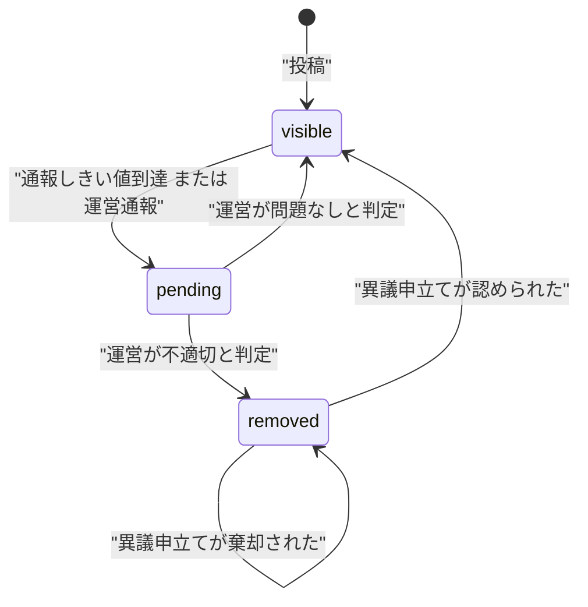
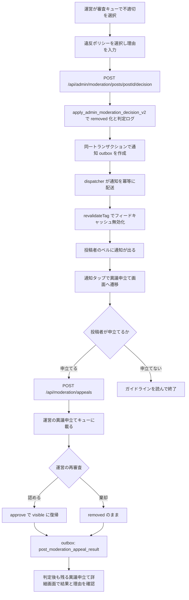
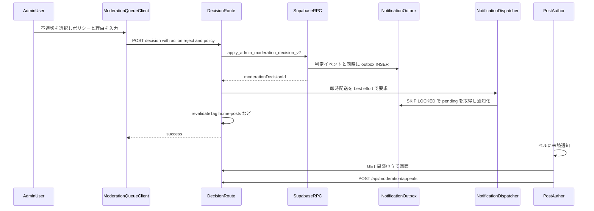
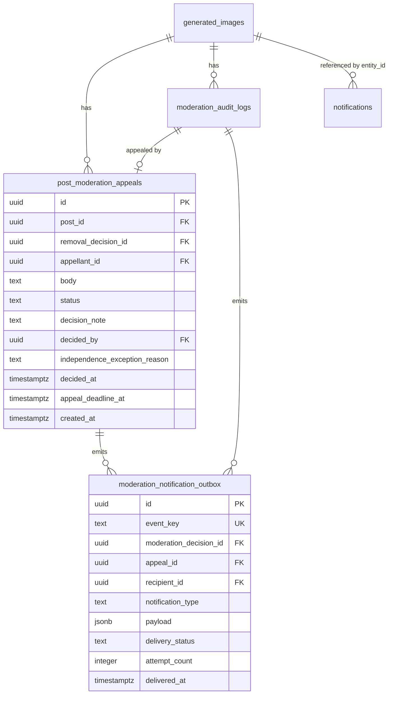
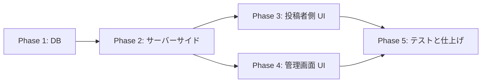

# 投稿モデレーション通知・異議申立て 実装計画

作成日: 2026-07-28
対象: 投稿（`generated_images`）のモデレーション判定結果を投稿者へ通知し、異議申立てを受け付ける

## 背景

現状、運営が `/admin/moderation` で「不適切」と判定すると、投稿は `moderation_status = 'removed'` になり全ユーザー（投稿者本人を含む）から見えなくなるが、**投稿者への通知・メール・プッシュが一切送られない**（無言削除）。理由を伝える手段も、異議を申し立てる導線もない。

### 外部調査の要約

| 論点 | 結論 |
| --- | --- |
| 日本 情プラ法（2025/4/1施行） | 第27条で削除時に「その事実と理由」を発信者へ通知、または発信者が容易に知り得る状態に置く義務。ただし対象は総務大臣が指定した大規模特定電気通信役務提供者。指定基準には平均月間発信者数等1,000万人超に加え、平均月間延べ発信者数200万人超の基準もある。**現時点で Persta.AI は指定対象外であり、第27条の直接の法的義務はない** |
| 情プラ法 第26条 | 削除基準の策定・公表義務。コミュニティガイドラインで実質達成済み |
| EU DSA 第17条 | EU 域内でサービスを提供するホスティングサービス提供者に適用（micro/small 企業免除は Section 3 が対象で、Section 2 の第17条は免除されない）。ただし **EU から技術的にアクセス可能なだけでは足りず**、EU 域内の相当数の利用者または EU 向け活動等の「EU との実質的な結び付き」が必要。理由説明に (a)措置の種類・範囲・期間 (b)依拠した事実 (c)自動化手段の使用 (d)法的根拠 (e)契約上の根拠 (f)救済手段 を含めることを要求し、「可視性の制限」も対象 |
| TikTok | 通知に「投稿日 + 違反した具体的ポリシー + ガイドラインへのリンク + 異議申立てボタン」。導入後**異議申立て要求が14%減少**、ガイドライン閲覧が約3倍、再違反率も低下 |
| Meta | フィード内通知 + 違反ポリシー箇所の参照 + 「なぜ禁止か」の短い説明 + 再審査請求。strike system で累積管理 |
| Santa Clara Principles | 異議申立ての最低基準は「元の判断に関与していない人による人的レビュー」「追加情報を提出する機会」「結果の通知と理解可能な理由の説明」 |

**設計上の主要な示唆**: 丁寧な通知は運営のサポート負荷を増やすのではなく減らす（TikTok 実測）。無言削除は問い合わせと不信を生む側にある。

一次資料:

- [情プラ法（e-Gov 法令検索）](https://laws.e-gov.go.jp/law/413AC0000000137/)
- [情プラ法施行規則（e-Gov 法令検索）](https://laws.e-gov.go.jp/law/504M60000008039)
- [EU Digital Services Act（EUR-Lex）](https://eur-lex.europa.eu/legal-content/EN/TXT/?uri=CELEX:32022R2065)
- [Santa Clara Principles](https://santaclaraprinciples.org/)
- [TikTok「コンテンツ削除に関する透明性を強化する新機能を追加」](https://newsroom.tiktok.com/ja-jp/add-clarity-to-content-removals)

### 今回の決定事項（ヒアリング結果）

- スコープ: **通知 ＋ 異議申立て導線**（strike 管理は対象外）
- 通知タイミング: **reject のみ**（approve 復帰時・pending 化時は通知しない）
- removed の生成ギャラリー表示: **「削除済み」の tombstone カードを残す**。重大カテゴリはサムネイルを再表示しない
- 通知チャネル: **アプリ内通知のみ**（メール・プッシュは対象外）
- 通知配送: 判定 API からの直 INSERT ではなく、**判定と同一トランザクションで outbox に記録し、冪等な dispatcher で通知化する**
- 異議申立ての単位: 投稿単位ではなく、**個々の削除判定（`moderation_audit_logs.id`）単位**
- リリースゲート: EU との実質的な結び付きがあるかをリリース前に法務・事業側で確認する。DSA 適用と判断した場合は ADR-006 を再検討し、pending 時点の理由通知を本リリースの必須スコープへ切り替える

---

## コードベース調査結果

### 既存のモデレーション基盤（変更の土台）

| 要素 | 実体 | 備考 |
| --- | --- | --- |
| 判定 API | `app/api/admin/moderation/posts/[postId]/decision/route.ts` | `requireAdmin()` → RPC → `logAdminAction()`。**`revalidateTag` を呼んでいない** |
| 判定 RPC | `apply_admin_moderation_decision`（`supabase/migrations/20260209094500_...sql`） | status・reason・approved_at 更新 + `moderation_audit_logs` 挿入を atomic に実行。SECURITY DEFINER。ただし現状は `authenticated` に実行権限があり、呼出者指定の `p_actor_id` を DB 内で admin 検証していないため、本計画で v2 化・権限是正が必要 |
| 審査キュー API | `app/api/admin/moderation/posts/route.ts` | `moderation_status = 'pending'` を `moderation_updated_at` 降順で返す |
| 審査キュー UI | `app/(app)/admin/moderation/ModerationQueueClient.tsx` | 判定後はキュー再取得のみ。`router.refresh()` なし |
| 審査キュー ページ | `app/(app)/admin/moderation/page.tsx` | ページ認証は `getUser()` + `getAdminUserIds()`（API は `requireAdmin()`）。用途で異なるので踏襲する |
| 決定スキーマ | `features/moderation/lib/schemas.ts:32` | `action: "approve" \| "reject"`, `reason: string.max(300).optional()` |
| 通報タクソノミ | `constants/report-taxonomy.ts` | `rights / sexual / violence / harassment / danger / spam_fraud / other` の7カテゴリ + サブカテゴリ。通報受付の語彙として再利用するが、契約上の根拠としては粗いため、版管理されたガイドライン条項とのマッピングを追加する |
| 監査ログ | `moderation_audit_logs`（`action IN ('pending_auto','approve','reject')`） | `metadata JSONB` あり。現状の SELECT/INSERT RLS は authenticated 全体に広すぎるため、削除理由の source of truth として使う前にアクセスを service_role 専用へ是正する |
| pending 化 RPC | `mark_post_pending_by_report`（`supabase/migrations/20260208221000_add_mark_post_pending_rpc.sql`） | SECURITY DEFINER。本番 ACL 実測で `anon=X \| authenticated=X`。`auth.uid()` を参照せず `p_actor_id` / `p_reason` が呼出者任せ。**anon キーだけで任意投稿を pending 化でき、監査ログに偽の actor を書ける既存の穴**。ADR-010 で是正する |

### 通知基盤

| 要素 | 実体 | 今回の影響 |
| --- | --- | --- |
| テーブル | `notifications`（`supabase/migrations/20251213013611_notifications.sql`） | `type` CHECK に**現在14値**、`entity_type` CHECK に `post` を含む（本番実測済み） |
| RLS | INSERT は `WITH CHECK (false)`。SELECT/UPDATE/DELETE は本人のみ | service_role クライアント（`createAdminClient()`）は RLS をバイパスするが、判定と通知を分離すると欠落・重複を安全に修復できないため、本機能では outbox 経由にする |
| 生成関数 | `create_notification`（`20251213101944_fix_notifications_security_definer.sql`） | `recipient_id = actor_id` で self-skip。`notification_preferences` は like/comment/follow のみ判定 |
| TS 型 | `features/notifications/types.ts:5` は `'like' \| 'comment' \| 'follow' \| 'bonus'` の4値のみ | **DB の14値と既に乖離**。今回追加分は型にも追加する |
| 表示ロジック | `features/notifications/lib/presentation.ts` の `formatNotificationContent` | `default:` で DB の `title`/`body` にフォールバックするため、**型を追加しなくても表示自体は壊れない**。i18n したい場合は `case` を追加する |
| 遷移ロジック | `features/notifications/hooks/useNotifications.ts:425` | `entity_type === "post"` → `/posts/{entity_id}` に push。**removed な投稿は本人でも開けないため死んだリンクになる（要分岐追加）** |
| タブ | `features/notifications/lib/notification-tab.ts` | `activity` / `announcements` の2タブ。type によるフィルタはないので activity に出る |

### 参考にできる既存の「admin 判定 → 通知」実装と今回の差分

`app/api/admin/style-templates/[id]/decision/route.ts` が最も近い。パターンは以下（`docs/architecture/data.ja.md:311` に方針として明記済み）:

1. `requireAdmin()`
2. 対象を取得して申請者 `user_id` を得る
3. `apply_user_style_template_decision` RPC で状態 + 監査ログを atomic 更新
4. `logAdminAction()` で横断監査ログ
5. **`notifications` へ直 INSERT**（`create_notification` RPC は迂回）
6. `revalidateTag()` でキャッシュ無効化

Creator Looks 側（`supabase/migrations/20260603100100_...sql`）は trigger 方式（`AFTER UPDATE OF moderation_status ON user_style_templates`）だが、こちらは通知文言を DB に日本語ハードコードしている。

上記はいずれも参考実装だが、投稿削除通知は異議申立ての起点となるため、同じ「RPC 後に通知を best-effort INSERT」方式は採用しない。判定・監査ログ・outbox を1トランザクションに閉じ、通知テーブルへの配送だけを再試行可能な副作用として分離する。

### 投稿者側の可視性（現状の歪み）

| 経路 | 実装 | removed 時 |
| --- | --- | --- |
| ホームフィード | `features/posts/lib/server-api.ts:432` `buildOwnerVisibleOrFilter` | 消える（本人も） |
| プロフィール投稿グリッド | `features/my-page/lib/server-api.ts:217` `getUserPostsServer` | 消える（本人も。`visible`/`pending` のみ許可） |
| 投稿詳細 | `features/posts/lib/server-api.ts:840` | 開けない（`isOwnerPending` は pending 限定） |
| **マイページ生成ギャラリー** | `features/my-page/lib/server-api.ts:245` `getMyImagesServer` | **残る。`moderation_status` を一切フィルタしていない** |

- カード UI: `features/my-page/components/MyImageCard.tsx`。`detailUrl = /posts/${image.id}?from=my-page` を固定生成しており、removed では死んだリンクになる
- 型: `GeneratedImageRecord`（`features/generation/lib/database.ts:9`）は `moderation_status` / `moderation_reason` を既に保持。**型追加は不要**

### i18n の制約（重要）

`messages/` に**16ロケール**（ja/en/ko/zh-CN/zh-TW/es/fr/de/it/pt/ar/hi/id/th/vi）。`messages/ja.ts` の `jaMessages` が master で、他は `} satisfies DeepReplaceStrings<typeof jaMessages>;`（例: `messages/en.ts:1898`）。**キーを1つ追加すると16ファイル全てに追加しないと typecheck が落ちる**。

### Supabase 接続

`npx supabase db query --linked` で参照系クエリの実行を確認済み。`notifications` の CHECK 制約は本番実測で確認した。

---

## 1. 概要図

### 状態遷移

### 削除から異議申立てまでのフロー

### API 通信シーケンス

### データモデル

---

## 2. EARS 要件定義

### 通知

- **REQ-001**: When an admin rejects a pending post via the moderation queue, the system shall atomically persist the removal, its moderation decision record, and one `post_moderation_removed` outbox event addressed to the post author.
  管理者が審査キューで pending 投稿を「不適切」と判定したとき、システムは removed 化・削除判定レコード・投稿者宛 `post_moderation_removed` outbox イベント1件を同一トランザクションで保存しなければならない。

- **REQ-002**: If delivery from the outbox to `notifications` fails, then the system shall keep the moderation decision committed, record the attempt and error, and retry without creating duplicate notifications.
  outbox から `notifications` への配送が失敗した場合、システムはモデレーション判定を維持し、試行回数とエラーを記録し、通知を重複させずに再試行しなければならない。

- **REQ-003**: While a post is in `pending` status, the system shall not notify the author.
  投稿が `pending` の間、システムは投稿者に通知してはならない。

- **REQ-004**: When an admin approves a post, the system shall not create an author-facing notification but shall invalidate the feed cache tags so the post returns to the feed without waiting for natural cache expiry.
  管理者が「問題なし」と判定したとき、システムは投稿者向け通知を作成せず、フィードのキャッシュタグを無効化して自然失効を待たずに復帰させなければならない。

- **REQ-005**: Where the acting admin is also the post author, the system shall still create the mandatory system notification and shall render it without exposing the administrator's profile identity.
  判定した管理者が投稿者本人である場合でも、システムは運営通知を省略してはならず、管理者個人のプロフィール情報を公開しない system notification として表示しなければならない。

### 異議申立て

- **REQ-006**: When the author opens a moderation decision page they own, the system shall display the restriction, policy clause and version, admin reason, decision source, automation involvement, available redress, and appeal status even after the post is restored.
  投稿者が自分に属する削除判定画面を開いたとき、システムは投稿が復帰した後も、措置内容・ポリシー条項と版・運営理由・判定ソース・自動化手段の関与・救済手段・異議申立て状態を表示しなければならない。

- **REQ-007**: When the author submits an appeal no later than 14 days after delivery of the removal notification, the system shall create exactly one `post_moderation_appeals` row for the referenced removal decision with `status = 'pending'`, resolving `appellant_id` from the server-side session. If delivery has not completed, the deadline shall not expire.
  投稿者が削除通知の配送完了から14日以内に異議申立てを送信したとき、システムは対象の削除判定に対して `status = 'pending'` の `post_moderation_appeals` 行をちょうど1件作成し、`appellant_id` はサーバー側セッションから解決しなければならない。通知が未配送の間は期限切れとして扱ってはならない。

- **REQ-008**: If the author has already appealed the same removal decision, then the system shall reject the request with a duplicate error while allowing an appeal against a later independent removal decision for the same post.
  同じ削除判定に既に異議申立て済みの場合は重複エラーで拒否しなければならないが、同じ投稿が後日別の判定で再削除された場合は新たな異議申立てを許可しなければならない。

- **REQ-009**: If the removal decision is not for a post owned by the requester, is not the current applicable removal, or is past its appeal deadline, then the system shall reject the appeal without disclosing another user's data.
  削除判定が申立て者所有の投稿に属さない、現在有効な削除判定でない、または申立期限を過ぎている場合、システムは他ユーザーの情報を開示せず申立てを拒否しなければならない。

- **REQ-010**: When an admin decides an appeal, the system shall atomically update it to `upheld` or `overturned`, record a required decision note, reviewer and timestamp, and create one idempotent `post_moderation_appeal_result` outbox event.
  管理者が異議申立てを判定したとき、システムは申立てを `upheld` または `overturned` に更新し、必須の判定理由・判定者・判定日時を記録し、冪等な `post_moderation_appeal_result` outbox イベント1件を同一トランザクションで作成しなければならない。

> **用語の対応（実装時の混同防止）**: `uphold` / `upheld` は「**元の削除判定を支持する**」＝ UI 上の「**棄却する**」で、投稿は `removed` のまま。`overturn` / `overturned` は「**元の削除判定を覆す**」＝ UI 上の「**認める**」で、投稿は `visible` に復帰する。日本語の「認める」を `uphold` に対応させると挙動が逆転するため注意する。

- **REQ-011**: When an appeal is overturned, the system shall restore the post to `visible` in the same transaction as the appeal decision, append an audit record, and invalidate the feed cache tags.
  異議申立てが認められたとき、システムは異議判定と同一トランザクションで投稿を `visible` に戻して監査ログを追記し、フィードのキャッシュタグを無効化しなければならない。

- **REQ-012**: While the appeal reviewer is the same admin who made the original decision, the system shall display a warning and require an independence-exception reason before allowing the decision.
  異議申立ての審査者が元の判定を行った管理者と同一である場合、システムは管理画面に警告を表示し、判定を許可する前に独立レビューを実施できない例外理由の入力を必須にしなければならない。

### 権限・可視性

- **REQ-013**: While a post is `removed`, the system shall keep a tombstone card in the author's generation gallery, route it to the current moderation decision, and suppress the thumbnail and content actions for severe safety categories.
  投稿が `removed` の間、システムは投稿者自身の生成ギャラリーに tombstone カードを残して現在の削除判定へ遷移させ、重大な安全カテゴリではサムネイルおよびダウンロード・共有操作を表示してはならない。

- **REQ-014**: The system shall not expose the appeal screen, appeal API, or removal reason of a post to any user other than its author and admins.
  システムは、異議申立て画面・異議申立て API・削除理由を、投稿者本人と管理者以外のいかなるユーザーにも公開してはならない。

- **REQ-015**: Where the notification type is a moderation type, the system shall deliver it regardless of `notification_preferences`.
  通知タイプがモデレーション系である場合、システムは `notification_preferences` に関係なく配信しなければならない。

- **REQ-016**: The system shall not expose the personal profile identity of the administrator who made or reviewed a moderation decision in author-facing notification presentation or API enrichment.
  システムは、モデレーション判定者・異議審査者の個人プロフィール情報を投稿者向け通知の表示または API enrichment で公開してはならない。

- **REQ-017**: If the service is determined to have a substantial connection to the EU, then the system shall notify the author at the time a `pending` visibility restriction is imposed and shall notify them when that restriction is lifted.
  本サービスが EU との実質的な結び付きを持つと判断された場合、システムは pending による可視性制限を課した時点で投稿者へ理由通知を行い、制限解除時にも結果を通知しなければならない。

- **REQ-018**: The system shall reject direct calls to admin moderation RPCs from `anon` and ordinary `authenticated` roles and shall verify `p_actor_id` against `admin_users` inside each service-role RPC.
  システムは `anon` および一般 `authenticated` ロールからの管理モデレーション RPC 直接実行を拒否し、service-role RPC 内でも `p_actor_id` が `admin_users` に存在することを検証しなければならない。

- **REQ-019**: The system shall reject direct calls to `mark_post_pending_by_report` from `anon` and `authenticated` roles, shall accept only `report_threshold` or `admin_immediate` as the reason, and shall verify `p_actor_id` against `admin_users` when the reason is `admin_immediate`.
  システムは `anon` および `authenticated` ロールからの `mark_post_pending_by_report` 直接実行を拒否し、reason は `report_threshold` または `admin_immediate` のみを受け付け、reason が `admin_immediate` のときは `p_actor_id` が `admin_users` に存在することを検証しなければならない。

- **REQ-020**: While the report flow marks a post pending, the system shall invoke the pending RPC through a service-role client from the server-side route handler, never from a user session client.
  通報フローが投稿を pending 化する間、システムは pending RPC をサーバー側 route handler の service-role クライアントから呼び出し、ユーザーセッションクライアントからは呼び出してはならない。

- **REQ-021**: If the pending RPC permission change is deployed without the corresponding route handler change, then the report-triggered auto-hiding shall fail; therefore the migration and the route change shall ship in the same commit and deployment.
  pending RPC の権限変更が対応する route handler の変更を伴わずにデプロイされた場合、通報起因の自動非表示は失敗する。したがってマイグレーションと route 変更は同一コミット・同一デプロイで反映しなければならない。

---

## 3. ADR

### ADR-001: 判定と通知要求は transactional outbox で結合する

- **Context**: 判定 RPC 後に API から `notifications` へ直 INSERT すると、判定だけが確定して通知が永久欠落する経路と、HTTP 再試行による重複経路が生じる。一方、通知配送障害で削除判定を取り消すべきではない。
- **Decision**: `apply_admin_moderation_decision_v2` が removed 化・`moderation_audit_logs`・`moderation_notification_outbox` を同一トランザクションで保存する。API は判定後に dispatcher を best effort で呼び、1分間隔の `pg_cron` が未配送行を再試行する。dispatcher は `event_key` と通知側の部分 UNIQUE index で冪等にする。
- **Reason**:
  1. 判定と「通知すべき事実」の欠落を防ぎつつ、通知配送は判定から分離できる。
  2. `FOR UPDATE SKIP LOCKED` で即時配送と cron が競合しても二重配送を防げる。
  3. psql / Supabase Studio の直接 UPDATE は通知だけでなく監査ログも作らないため、removed 化を RPC に技術的に集約し、直接 UPDATE を正式運用経路にしない。
- **Consequence**: outbox テーブル、dispatcher 関数、cron 監視が増える。未配送件数・最終エラーを管理画面または監視 SQL で確認できるようにする。

### ADR-002: 通知文言は i18n し、DB には reason code を保存する

- **Context**: 既存の Creator Looks trigger と style_template 判定 API は通知の `title`/`body` に日本語をハードコードしている。`formatNotificationContent` は未知の type を `default:` で DB の title/body にフォールバックさせる。
- **Decision**: `presentation.ts` に `case "post_moderation_removed"` と `case "post_moderation_appeal_result"` を追加し、i18n キーから文言を組み立てる。削除判定の正本は `moderation_audit_logs.metadata`、異議結果の正本は `post_moderation_appeals` とし、通知 `data` には `moderation_decision_id` / `appeal_id` / `policy_code` / `appeal_status` / `decision_note` を配送時スナップショットとして保存する。`title`/`body` には日本語のフォールバック文言も入れておく。
- **Reason**:
  1. DSA 第17条4項は「明確で容易に理解できる」理由説明を要求しており、16ロケール対応のアプリで日本語固定は要件を満たさない。
  2. `default:` フォールバックが既にあるため、i18n キー追加前でも表示は壊れず、段階的に移行できる。
  3. 運営が入力する自由記述の理由は翻訳できないため、**枠（ポリシー名・案内文）を i18n し、運営の理由文は引用として原文表示**する。TikTok もポリシー名は正典・追加コンテキストは原文の構成を取っている。
- **Consequence**: `messages/` 16ファイル全てにキー追加が必要（`satisfies DeepReplaceStrings<typeof jaMessages>` のため）。日本語以外は暫定的に英語文言を流用してよい。

### ADR-003: 通報分類と執行根拠を分離し、版管理されたマッピングを持つ

- **Context**: 現在 reject は自由記述の `reason`（最大300字）のみ。DSA 第17条3項(e) は「契約上の根拠」＝どの規約条項に違反したかの明示を求める。TikTok/Meta も違反ポリシー名を通知に含める。
- **Decision**: `REPORT_TAXONOMY` は通報受付カテゴリとして再利用しつつ、`constants/moderation-policy.ts` に `policy_code`、ガイドライン条項 anchor、`policy_version`、サムネイル表示可否を持つ `MODERATION_POLICY_CATALOG` を新設する。管理者は執行ポリシーを選択し、判定ログには選択時の版を保存する。
- **Reason**: 通報カテゴリだけでは DSA 第17条の契約上の根拠や、改定後に「当時どの条項で削除したか」を説明できない。入力語彙の一貫性を保ちつつ、執行根拠は安定IDで管理する。
- **Consequence**: ガイドライン改定時に catalog の version と anchor の更新が必要。「other」は自由裁量の根拠ではなく、具体的な条項と必須理由を選べる場合に限る。

### ADR-004: 異議申立ては新規テーブルにする（`post_reports` を流用しない）

- **Context**: 通報は `post_reports`、監査は `moderation_audit_logs` に既にある。
- **Decision**: `post_moderation_appeals` を新設する。
- **Reason**: 通報は「第三者→投稿」の関係、異議申立ては「投稿者→運営判定」の関係で、主体・ライフサイクル・RLS が全く異なる。`moderation_audit_logs` は運営操作の追記専用ログで、`status` を持つ可変レコードには不適。
- **Consequence**: テーブルが1つ増える。`removal_decision_id` で削除判定に紐付け、`UNIQUE(removal_decision_id, appellant_id)` で1判定1回に制限する。同じ投稿が後日別判定で再削除された場合は再度申立て可能。

### ADR-005: 「元の判断者以外によるレビュー」は技術強制せず可視化に留める

- **Context**: Santa Clara Principles は異議申立ての最低基準として「元の決定に関与していない人または合議体による人的レビュー」を挙げる。
- **Decision**: `decided_by` を元判定（`moderation_audit_logs`）と異議申立て（`post_moderation_appeals`）の両方に記録する。同一人物の場合は管理画面に警告バナーを出し、`independence_exception_reason` の入力を必須にする。別担当者が対応可能な場合は管理画面上で優先的に割り当てるが、最終的なブロックはしない。
- **Reason**: 運営体制が実質1〜2名の現状で「別人によるレビュー」を技術的に強制すると、異議申立てが永久に処理できなくなる。理想を掲げて機能を止めるより、逸脱を可視化して記録に残す方が実効的。
- **Consequence**: Santa Clara Principles の原則を完全には満たさないため、「独立レビュー例外」として記録・集計する。運営規模が拡大した時点でブロックへ変更できる。

### ADR-006: pending の「審査中」バッジは今回作らない

- **Context**: 現状 pending 中の投稿は投稿者からは通常表示のまま見える（他ユーザーからは非表示）。
- **Decision**: `removed` のみバッジを出し、`pending` にはバッジを出さない。
- **Reason**: 「reject のみ通知」の決定と整合させる。pending の可視化は誤通報段階での不安を招くため、国内向け baseline では見送る。ただし DSA は「指定事業者」制度ではなく、EU との実質的な結び付きがあれば第17条が適用され得る。
- **Consequence**: 投稿者は pending 期間中に自分の投稿が他者から見えていないことを知る手段がない。リリースゲートで DSA 適用と判断した場合、この ADR は採用せず、「通報」という語を避けた中立的な可視性制限通知と、approve 時の解除通知を実装する。

### ADR-007: 判定 API の `revalidateTag` 欠落を本計画で同時に修正する

- **Context**: `app/api/admin/moderation/posts/[postId]/decision/route.ts` は `revalidateTag` を呼んでおらず、`ModerationQueueClient` も `router.refresh()` を呼ばない。一方で通報 API（`app/api/reports/posts/route.ts:346`）は5つのタグを即時無効化している。結果として「非表示は即時・復帰は `cacheLife("minutes")` の自然失効待ち」という非対称がある。
- **Decision**: 同ファイルを触るため、本計画の Phase 2 で `revalidateTag` を追加する。
- **Reason**: approve による復帰の即時性は REQ-004 の一部であり、通知機能の正しさとも直結する（「削除しました」と通知した投稿が実は数分見え続ける、の逆パターンを防ぐ）。範囲外リファクタリングではなく、対象ファイルの機能欠落の修正と位置づける。
- **Consequence**: 通報 API と同じ5タグ（`home-posts` / `home-posts-week` / `search-posts` / `user-profile-{author}` / `post-detail-{id}`）を揃える。

### ADR-008: 通知・異議申立てのリンク先は削除判定の永続ページにする

- **Context**: 投稿IDをリンク先にすると、異議が認められて `visible` に戻った時点で「removed の場合だけ表示する画面」が404になる。また、同じ投稿に複数の削除判定があり得る。
- **Decision**: 通知は `/my-page/moderation/decisions/{moderationDecisionId}` へ遷移する。画面は所有者であることを検証した上で、投稿の現在状態に関係なく判定と異議結果を表示する。生成ギャラリーの removed tombstone は現在有効な削除判定IDへ遷移する。
- **Consequence**: 投稿復帰後も異議申立て結果を確認できる。投稿本体が将来削除される場合に備え、判定・異議レコードには表示に必要なポリシーと理由のスナップショットを保持する。

### ADR-009: 管理者 RPC は service_role 専用かつ DB 内でも admin を検証する

- **Context**: 既存 `apply_admin_moderation_decision` は SECURITY DEFINER でありながら `authenticated` に実行権限があり、`p_actor_id` の admin 検証もない。同じ書式を新 RPC にコピーすると一般ユーザーによる判定改変を許す。
- **Decision**: `PUBLIC` / `anon` / `authenticated` から EXECUTE を REVOKEし、`service_role` のみに GRANTする。さらに `p_actor_id` が `admin_users` に存在しなければ RPC 内で `42501` を送出する。API は `requireAdmin()` と `ensureSameOrigin()` も維持する。
- **Consequence**: API と DB の二重防御になる。既存 RPC は v2 導入時に直接実行権限を是正する。

### ADR-010: `mark_post_pending_by_report` の actor 偽装と任意 pending 化を塞ぐ

- **Context**: ADR-009 の是正対象は `apply_admin_moderation_decision` 系のみだが、`mark_post_pending_by_report`（`supabase/migrations/20260208221000_add_mark_post_pending_rpc.sql`）が同じ構造の穴を持つ。本番 ACL 実測は `anon=X | authenticated=X | service_role=X` で、マイグレーションは `GRANT EXECUTE TO authenticated` しか書いていないが Supabase の default privileges により **`anon` にも EXECUTE が付いている**。関数は SECURITY DEFINER でありながら `auth.uid()` を一切参照せず、`p_actor_id` と `p_reason` は呼出者任せ、`post_reports` の存在確認もない。更新条件は `is_posted = true AND moderation_status = 'visible'` のみ。

  影響は3点:

  1. **公開 anon キーだけで任意の公開投稿を1コールずつ `pending`（全ユーザーから非表示）にできる**。anon キーはクライアントバンドルに含まれる公開値であり、PostgREST の `/rest/v1/rpc/mark_post_pending_by_report` に直接到達できるため、検閲・DoS ベクタとして成立する
  2. `p_reason='admin_immediate'` と任意の `p_actor_id` を渡して「運営が即時非表示にした」偽の監査ログを作れる
  3. **本計画の根幹に効く**。本計画は `moderation_audit_logs` を削除判定の source of truth とし `removal_decision_id` をそこから引く設計だが、SECURITY DEFINER は RLS をバイパスするため、ADR-009 で authenticated 向け RLS policy を削除しても**この RPC 経路からの任意行 INSERT は止まらない**。正本テーブルに一般ユーザーが書ける穴が残り、`removal_decision_id` の信頼性が崩れる

  なお単純に `authenticated` から EXECUTE を REVOKE すると通報の自動非表示が壊れる。通報ルートがユーザーのセッションクライアントからこの RPC を呼んでいるため（`app/api/reports/posts/route.ts` の `setPendingWithRpc(supabase, context)`）。

- **Decision**: pending 化を **service_role 経路に一本化**する。
  1. `app/api/reports/posts/route.ts` の `setPendingWithRpc` に渡すクライアントをセッションクライアントから `createAdminClient()` に差し替える。同ルートは `calculatePendingMetrics` で既に admin クライアントを生成しているため、新規の資材追加は不要
  2. `mark_post_pending_by_report` から `PUBLIC` / `anon` / `authenticated` の EXECUTE を REVOKE し、`service_role` のみに GRANT する
  3. `p_reason` を呼出者任せにせず、RPC 内で `report_threshold` / `admin_immediate` の2値に限定する（`CHECK` 相当の `RAISE EXCEPTION`）。`admin_immediate` を渡す場合は `p_actor_id` が `admin_users` に存在することを RPC 内で検証する
  4. `isPostAlreadyPending` の照会も同じ admin クライアントに揃える

- **Reason**: (a) 案として「`p_actor_id` を廃止して `auth.uid()` から導出し、`post_reports` に当該行が存在することを RPC 内で検証する」も検討したが、通報 API は既に INSERT 済みの `post_reports` を前提に集計しており、RPC 側で再度存在確認を行うのは責務の二重化になる。ADR-009 が「管理系 RPC は service_role 専用」という方針を立てた直後に、同じテーブル群を触る RPC だけ authenticated に開けておく整合性の悪さもある。service_role へ寄せる方が方針が一貫し、変更量も小さい。

- **Consequence**:
  - 通報による自動非表示はサーバー側 route handler からのみ実行可能になる。クライアントから直接 RPC を叩く経路は消える
  - `moderation_audit_logs` への書き込み経路が service_role のみに閉じ、ADR-009 の RLS 是正と合わせて正本テーブルの完全性が担保される
  - **これは本計画が持ち込んだ問題ではなく既存の本番の穴**である。緊急度は本計画と独立しているため、Phase 1 の先頭に置いて単独でコミットし、計画の他部分の進捗と切り離して先行マージできる形にする
  - 通報フローの回帰リスクがあるため、Phase 5 で「通報しきい値到達時に pending 化される」既存挙動のテストを必ず通す

---

## 4. 実装計画

### フェーズ間の依存関係

### Phase 1: データベース

**目的**: 安全な判定イベント、通知 outbox、異議申立てのデータ基盤を追加
**ビルド確認**: マイグレーション適用後に `npm run typecheck` と `npm run build -- --webpack` が通る（この時点でアプリ挙動は変わらない）

> **先行マージ推奨**: 以下の1件目（ADR-010）は既存の本番の穴を塞ぐもので、本計画の他部分に依存しない。単独コミットにして先にマージできる形にする。**ただしアプリ側の 1 行変更（`setPendingWithRpc` のクライアント差し替え）と同時に適用しないと通報の自動非表示が壊れる**ため、マイグレーションとルート修正を同一コミットに含めること。

- [ ] `supabase/migrations/2026xxxx_harden_mark_post_pending_rpc.sql` を新規作成（ADR-010）
  - `mark_post_pending_by_report` から `PUBLIC` / `anon` / `authenticated` の EXECUTE を REVOKE し、`service_role` のみに GRANT
  - `p_reason` を `report_threshold` / `admin_immediate` の2値に限定（それ以外は `RAISE EXCEPTION` で `22023`）
  - `p_reason = 'admin_immediate'` のときは `p_actor_id` が `admin_users` に存在することを RPC 内で検証（不在なら `42501`）
  - 関数シグネチャは変更しないため、呼出側の引数修正は不要（差し替えるのはクライアントのみ）
  - 併せて `app/api/reports/posts/route.ts` を修正し、`setPendingWithRpc` と `isPostAlreadyPending` に渡すクライアントを `createAdminClient()` に差し替える（同ルートは `calculatePendingMetrics` で既に生成済み）
- [ ] `supabase/migrations/2026xxxx_extend_notifications_for_post_moderation.sql` を新規作成
  - `notifications_type_check` に `post_moderation_removed` / `post_moderation_appeal_result` を追加（既存14値を保持。`20260602100400_extend_notifications_for_creator_looks.sql` の書式を踏襲）
  - `entity_type` は `post` を再利用するため **CHECK 変更なし**
  - `data->>'moderation_event_key'` に moderation type 限定の部分 UNIQUE index を追加し、dispatcher の冪等性を担保
  - コメントに DOWN 手順を記載
- [ ] `supabase/migrations/2026xxxx_harden_post_moderation_decision.sql` を新規作成
  - 既存 `apply_admin_moderation_decision` の `authenticated` EXECUTE を REVOKE
  - `apply_admin_moderation_decision_v2(..., p_idempotency_key UUID) RETURNS UUID` を SECURITY DEFINER で作成し、`PUBLIC` / `anon` / `authenticated` を REVOKE、`service_role` のみに GRANT
  - `p_actor_id` が `admin_users` に存在することを DB 内で検証
  - `moderation_audit_logs.metadata->>'idempotency_key'` に対象 action 限定の部分 UNIQUE index を追加
  - 通常判定は対象が `pending` の場合だけ `FOR UPDATE` して適用し、同一 idempotency key の再送は既存 decision id を返す
  - reject 時は `policy_code` / `policy_version` / `policy_anchor` / `decision_source` / `automated_means_used` / `restriction_scope` / `restriction_duration` を `moderation_audit_logs.metadata` に保存
  - `moderation_audit_logs` の一般 authenticated 向け SELECT/INSERT policy を削除し、service_role/RPC 専用に是正
- [ ] `supabase/migrations/2026xxxx_add_moderation_notification_outbox.sql` を新規作成
  - `moderation_notification_outbox`: `id`, `event_key UNIQUE`, `moderation_decision_id`, `appeal_id`, `recipient_id`, `notification_type`, `entity_id`, `payload`, `delivery_status`, `attempt_count`, `last_error`, `available_at`, `delivered_at`, `created_at`
  - RLS 有効化、公開 policy なし、`PUBLIC` / `anon` / `authenticated` から全権限を REVOKE
  - `dispatch_moderation_notification_outbox(p_limit)` を `FOR UPDATE SKIP LOCKED` + notification UPSERT で実装。行ごとの `EXCEPTION` ブロックにより、成功時 `delivered`、失敗時 `pending` のまま attempt と error を更新
  - author-facing notification の `actor_id` には recipient ID を設定し `data.system_generated = true` とする。実際の admin ID は outbox payload / notification API に含めない
  - `pg_cron` で1分ごとに dispatcher を実行。既存 `cron.job` の重複防止パターンを踏襲
- [ ] `supabase/migrations/2026xxxx_add_post_moderation_appeals.sql` を新規作成
  - `post_moderation_appeals`: `id`, `post_id`, `removal_decision_id`（FK → `moderation_audit_logs`）, `appellant_id`, `body`, `status`, `decision_note`, `decided_by`, `decided_at`, `independence_exception_reason`, `appeal_deadline_at`, `created_at`
  - `UNIQUE (removal_decision_id, appellant_id)`（同じ投稿の別削除判定には再申立て可能）
  - `CHECK`: pending は判定3項目が NULL、判定済みは `decision_note` / `decided_by` / `decided_at` がすべて NOT NULL
  - インデックス: `(status, created_at DESC)`（キュー用）、`(appellant_id, created_at DESC)`
  - RLS:
    - SELECT: `auth.uid() = appellant_id`
    - INSERT: `WITH CHECK (auth.uid() = appellant_id)`
    - UPDATE/DELETE: ポリシーを作らない（運営更新は service_role のみ）
  - BEFORE INSERT guard で、所有者、現在 removed、対象 decision が最新かつ当該投稿の reject であることを検証
  - 申立期限は対象 decision の removal outbox `delivered_at + interval '14 days'` とし、未配送なら期限切れにしない。申立て作成時は算出した期限を `appeal_deadline_at` にスナップショットする
- [ ] `supabase/migrations/2026xxxx_add_decide_post_moderation_appeal_rpc.sql` を新規作成
  - `decide_post_moderation_appeal(p_appeal_id, p_actor_id, p_action, p_note, p_independence_exception_reason)` を SECURITY DEFINER で実装
  - actor の `admin_users` 検証、service_role 専用 EXECUTE（REQ-018）
  - 同一判定者の場合だけ `p_independence_exception_reason` を必須化
  - `overturned` のとき同一トランザクションで投稿を visible に戻し、監査ログを追記
  - 判定更新と同じトランザクションで `post_moderation_appeal_result` outbox を作成し、結果理由を payload に含める
  - `p_action NOT IN ('uphold','overturn')` は `RAISE EXCEPTION`
  - 対象が `status <> 'pending'` なら `FALSE` を返す（冪等性ガード）
- [ ] `supabase db diff` で差分を確認し、ユーザーに提示してから適用

### Phase 2: サーバーサイド

**目的**: v2 判定 RPC、outbox 即時配送、判定単位の異議申立て API を実装
**ビルド確認**: `npm run lint` / `npm run typecheck` / `npm run build -- --webpack` が通る

- [ ] `constants/moderation-policy.ts` を新規作成
  - `REPORT_TAXONOMY` と versioned guideline clause のマッピング
  - `policy_code`, `policy_version`, `policy_anchor`, `hide_thumbnail` を定義
- [ ] `features/moderation/lib/schemas.ts` に追加
  - reject 時は `policyCode` と trim 後1文字以上の `reason` を必須
  - 管理判定には UUID の `idempotencyKey` を必須化し、UI が操作開始時に生成して同じ送信の再試行で再利用
  - `createAppealSchema`: `moderationDecisionId: uuid`, trim 後1〜1000字の `body`
  - `appealDecisionSchema`: `action`, trim 後1〜500字の必須 `note`, optional `independenceExceptionReason`
- [ ] `app/api/admin/moderation/posts/[postId]/decision/route.ts` を修正
  - `requireAdmin()` + `ensureSameOrigin(request)`
  - `apply_admin_moderation_decision_v2` を呼び、`moderationDecisionId` を受け取る
  - API から notifications へ直接 INSERT しない。dispatcher RPC を best effort で呼び、失敗時も outbox が再試行可能なため判定は成功で返す
  - `revalidateTag` は5タグを個別に non-fatal で無効化（ADR-007）
  - `logAdminAction` の `metadata` に `policy_category` を追加
- [ ] `features/moderation/lib/appeal-repository.ts` を新規作成
  - `getModerationDecisionForOwner(decisionId, userId)`: service-role で取得する前にセッション user と投稿所有者を照合し、他人の判定を返さない。投稿復帰後も取得可能
  - removal outbox の `delivered_at` から申立期限を算出し、未配送時は申立可能として返す
  - `getCurrentRemovalDecisionId(postId, userId)`: gallery tombstone の遷移先解決用
  - `getAppealByDecisionAndUser(decisionId, userId)`
  - `listPendingAppealsForAdmin(limit, offset)`: 元判定者を `moderation_audit_logs` から引いて同梱（REQ-012 の警告表示用）。admin クライアント（`createAdminClient()`）を使う
- [ ] `app/api/moderation/appeals/route.ts` を新規作成（POST）
  - `getUser()` で認証、`ensureSameOrigin(request)` で CSRF 防御（`app/api/reports/posts/route.ts` を踏襲）
  - `appellant_id` はセッションから解決し、decision の所有・現在性・期限を API と DB guard で二重検証
  - 同一 decision の重複は409。同一投稿の後続 removal decision は許可
- [ ] `app/api/admin/moderation/appeals/route.ts` を新規作成（GET、`requireAdmin()`）
- [ ] `app/api/admin/moderation/appeals/[appealId]/decision/route.ts` を新規作成（POST、`requireAdmin()`）
  - `ensureSameOrigin(request)`
  - `decide_post_moderation_appeal` RPC を呼ぶ
  - dispatcher RPC を best effort で呼ぶ。通知直 INSERT は行わない
  - overturn 時は5タグを `revalidateTag`（REQ-011）
  - `logAdminAction`（`actionType: 'moderation_appeal_uphold' | 'moderation_appeal_overturn'`）
- [ ] `features/my-page/lib/server-api.ts` の `getMyImagesServer` は**フィルタを変更しない**（removed を残す決定のため）。JSDoc に「removed を意図的に含む」旨を明記

### Phase 3: 投稿者側 UI

**目的**: 永続的な判定詳細・異議申立て画面と安全な tombstone 表示
**ビルド確認**: `npm run build -- --webpack` が通り、16ロケールの typecheck が通る

- [ ] `features/notifications/types.ts` を修正
  - `NotificationType` に `'post_moderation_removed' | 'post_moderation_appeal_result'` を追加
  - `Notification['data']` に `moderation_decision_id?` / `appeal_id?` / `policy_code?` / `appeal_status?` / `decision_note?` / `system_generated?` を追加
- [ ] `features/notifications/lib/presentation.ts` を修正
  - `NotificationTranslationKey` に新キーを追加
  - `formatNotificationContent` に2つの `case` を追加（ADR-002）。`data` が欠けている旧データは DB の title/body にフォールバック
- [ ] `features/notifications/lib/server-api.ts` と `NotificationList.tsx` を修正
  - moderation type は actor profile enrichment を返さず、Persta.AI の運営ロゴ・名称で表示（REQ-016）
  - `hide_thumbnail` の判定に従い重大カテゴリの通知サムネイルを返さない
- [ ] `features/notifications/hooks/useNotifications.ts` を修正
  - moderation type は `data.moderation_decision_id` から `/my-page/moderation/decisions/{id}` へ遷移
- [ ] `app/(app)/my-page/moderation/decisions/[decisionId]/page.tsx` を新規作成
  - `getUser()` で認証し、所有者以外は `notFound()`
  - 投稿が visible に復帰済みでも判定・異議結果を表示
  - 措置の範囲・期間、判定ソース、自動化の関与、版付きポリシー、運営理由、救済手段、期限、異議状態、結果理由を表示
  - `hide_thumbnail` の場合は画像の代わりにプレースホルダーを表示
  - データ取得はサーバーコンポーネントから props 渡し（既存 `app/(app)/admin/moderation/page.tsx` と同じ方式に揃える）
- [ ] `features/moderation/components/PostAppealForm.tsx` を新規作成（クライアント）
  - 期限内かつ未申立ての場合のみ `Textarea` + 送信ボタン。状態・受付日時・結果理由を追跡可能にする
- [ ] `features/my-page/components/MyImageCard.tsx` を修正
  - removed は tombstone とし、重大カテゴリでは画像を描画しない
  - `detailUrl` を現在の decision ID に切り替え、投稿詳細・共有・ダウンロードへ遷移させない
- [ ] `messages/ja.ts` に `moderation` ブロック（`messages/ja.ts:545`）へキー追加
  - 通知、判定詳細、期限、状態、結果理由、tombstone、独立レビュー例外の文言
- [ ] `messages/en.ts` 〜 `messages/vi.ts` の**残り15ファイル**に同じキーを追加（ja 以外は暫定的に英語文言でよい）

### Phase 4: 管理画面 UI

**目的**: 違反ポリシー選択と異議申立てキュー
**ビルド確認**: `npm run build -- --webpack` が通る

- [ ] `app/(app)/admin/moderation/ModerationQueueClient.tsx` を修正
  - 「不適切」判定時に versioned policy catalog の条項を選択し、具体的理由を必須入力
  - 判定後に `router.refresh()` を追加
- [ ] `app/(app)/admin/moderation/appeals/page.tsx` を新規作成
  - ページ認証は `getUser()` + `getAdminUserIds()` パターン（`app/(app)/admin/moderation/page.tsx:11-16` を踏襲）
- [ ] `app/(app)/admin/moderation/appeals/AppealQueueClient.tsx` を新規作成
  - データ取得は**クライアント側 fetch**（`ModerationQueueClient.tsx` の `fetchQueue()` パターンを踏襲）。投稿者側の異議申立て画面がサーバーコンポーネント props 方式なのと非対称だが、これは既存の「管理キューはクライアント fetch・一般画面はサーバー props」という分担に合わせたもの
  - 申立て本文 / 対象投稿サムネ / 元の削除理由 / 元判定者を表示
  - 元判定者が自分と同一なら警告バナー + 独立レビュー例外理由を必須入力（REQ-012 / ADR-005）
  - 「認める」／「棄却する」いずれも結果理由を必須入力
  - outbox の pending/failed 件数と最終エラーを確認できる運用表示または診断リンク
- [ ] `app/(app)/admin/admin-nav-items.ts` に `/admin/moderation/appeals`（label: 異議申立て、iconKey: `shield-check` を再利用、`quickAction: true`）を `/admin/reports` の直後に追加

### Phase 5: テストと仕上げ

**目的**: 回帰防止と実機確認
**ビルド確認**: `npm run lint` / `npm run typecheck` / `npm run test` / `npm run build -- --webpack` が全て通る

- [ ] `/test-flow` に沿ってテストを実装（下記テスト観点を参照）
- [ ] 実機確認（シークレットウィンドウで別アカウントを使用。既読状態は localStorage 端末単位ではなく DB の `is_read` なのでアカウント切替で確認可能）
- [ ] EU との実質的な結び付きの有無を法務・事業側で確認し、結果を ADR-006 の採否として記録。適用する場合は REQ-017 を実装してからリリース
- [ ] `docs/architecture/data.ja.md` / `data.en.md`、`.cursor/rules/database-design.mdc`、`docs/API.md` を新テーブル・RLS・RPC・API契約と同期
- [ ] `app/(marketing)/community-guidelines/page.tsx` と `app/(marketing)/terms/page.tsx` の「異議申立て」記述を実装と整合させる（現在は導線が存在しない前提の文面）
  - 現行の「通知から原則14日以内」を実装と一致させる
  - CSAM 等でも受付自体を拒否するか、画像非表示の上で再審査だけ受け付けるかを法務・運営判断として明文化

---

## 5. 修正対象ファイル一覧

| ファイル | 操作 | 変更内容 |
| --- | --- | --- |
| `supabase/migrations/2026xxxx_harden_mark_post_pending_rpc.sql` | 新規 | pending 化 RPC を service_role 専用化 + reason 制限 + admin 検証（ADR-010） |
| `app/api/reports/posts/route.ts` | 修正 | `setPendingWithRpc` / `isPostAlreadyPending` を admin クライアント経由に差し替え（ADR-010） |
| `supabase/migrations/2026xxxx_extend_notifications_for_post_moderation.sql` | 新規 | 通知 type 2値 + moderation event 一意 index |
| `supabase/migrations/2026xxxx_harden_post_moderation_decision.sql` | 新規 | v2 判定 RPC、admin 二重検証、既存 RPC 権限是正 |
| `supabase/migrations/2026xxxx_add_moderation_notification_outbox.sql` | 新規 | outbox + dispatcher + retry cron |
| `supabase/migrations/2026xxxx_add_post_moderation_appeals.sql` | 新規 | decision 単位の異議申立て + RLS + guard |
| `supabase/migrations/2026xxxx_add_decide_post_moderation_appeal_rpc.sql` | 新規 | 異議判定 + 復帰 + 結果 outbox の atomic RPC |
| `constants/moderation-policy.ts` | 新規 | 通報分類と版付きガイドライン条項のマッピング |
| `features/moderation/lib/schemas.ts` | 修正 | 判定スキーマ拡張 + 異議申立てスキーマ追加 |
| `app/api/admin/moderation/posts/[postId]/decision/route.ts` | 修正 | v2 RPC + outbox 即時配送 + `revalidateTag` |
| `features/moderation/lib/appeal-repository.ts` | 新規 | 所有者向け永続 decision 詳細 + 申立て取得 |
| `app/api/moderation/appeals/route.ts` | 新規 | 異議申立て投稿 API |
| `app/api/admin/moderation/appeals/route.ts` | 新規 | 異議申立てキュー取得 API |
| `app/api/admin/moderation/appeals/[appealId]/decision/route.ts` | 新規 | 異議申立て判定 API + outbox 即時配送 |
| `features/my-page/lib/server-api.ts` | 修正 | `getMyImagesServer` の JSDoc 明記のみ |
| `features/notifications/types.ts` | 修正 | `NotificationType` と `data` 拡張 |
| `features/notifications/lib/presentation.ts` | 修正 | 2 type の i18n 表示分岐 |
| `features/notifications/lib/server-api.ts` | 修正 | moderation actor/thumbnail の非公開化 |
| `features/notifications/components/NotificationList.tsx` | 修正 | moderation type を運営ロゴで表示 |
| `features/notifications/hooks/useNotifications.ts` | 修正 | モデレーション通知の遷移先分岐 |
| `app/(app)/my-page/moderation/decisions/[decisionId]/page.tsx` | 新規 | 復帰後も残る判定・異議申立て詳細 |
| `features/moderation/components/PostAppealForm.tsx` | 新規 | 異議申立てフォーム |
| `features/my-page/components/MyImageCard.tsx` | 修正 | 安全な tombstone + decision 遷移 |
| `app/(app)/admin/moderation/ModerationQueueClient.tsx` | 修正 | ポリシー選択 + `router.refresh()` |
| `app/(app)/admin/moderation/appeals/page.tsx` | 新規 | 異議申立てキューページ |
| `app/(app)/admin/moderation/appeals/AppealQueueClient.tsx` | 新規 | 異議申立てキュー UI |
| `app/(app)/admin/admin-nav-items.ts` | 修正 | ナビ項目追加 |
| `messages/ja.ts` | 修正 | `moderation` ブロックにキー追加 |
| `messages/{en,ko,zh-CN,zh-TW,es,fr,de,it,pt,ar,hi,id,th,vi}.ts` | 修正 | 同キーを15ファイルに追加（typecheck 必須） |
| `docs/architecture/data.ja.md` / `data.en.md` | 修正 | outbox・異議フロー・RPC カタログ |
| `.cursor/rules/database-design.mdc` | 修正 | テーブル・RLS・index・function ledger |
| `docs/API.md` | 修正 | 異議申立て・管理判定 API 契約 |
| `app/(marketing)/community-guidelines/page.tsx` | 修正 | 異議申立て導線の記述を実装と整合 |
| `app/(marketing)/terms/page.tsx` | 修正 | 同上 |

---

## 6. 品質・テスト観点

### 品質チェックリスト

- [ ] **エラーハンドリング**: notification 配送失敗後も outbox が pending で残り、attempt/error を記録して cron で再試行できる
- [ ] **権限制御**: 異議申立て API が他人の decision を404扱いにする。admin RPC は一般 authenticated から直接実行できず、DB 内でも `admin_users` を検証する
- [ ] **データ整合性**: `UNIQUE(removal_decision_id, appellant_id)`、outbox `event_key`、notification 部分 UNIQUE が重複を防ぐ。overturn の「申立て更新 + 投稿復帰 + 監査ログ + outbox」が1トランザクション
- [ ] **セキュリティ**: admin mutation は `requireAdmin()` + Same-Origin + service-role RPC + DB admin check の多層防御。投稿者向けレスポンスに admin profile を含めない
- [ ] **コンテンツ安全性**: `hide_thumbnail` 対象は通知・gallery・decision 詳細の全経路で画像を描画せず、共有・ダウンロード導線を出さない
- [ ] **i18n**: 16ロケール全てにキーが揃い `satisfies DeepReplaceStrings<typeof jaMessages>` が通る
- [ ] **キャッシュ**: approve / overturn 時に5タグが無効化され、フィード復帰が即時である

### テスト観点

| カテゴリ | テスト内容 |
| --- | --- |
| 正常系 | reject で removed・audit・outbox が atomic に作成され、dispatcher 後に通知が1件だけ作成される |
| 正常系 | decision ID を指定した異議申立てが pending で作成され、overturn で投稿復帰・結果理由・outbox が atomic に確定する |
| 正常系 | approve では投稿者向け通知が作成されない（REQ-004） |
| 正常系 | pending 遷移（通報 API 経由）では通知が作成されない（REQ-003） |
| 冪等性 | 同じ判定リクエストの再送、dispatcher の並行実行、cron 再試行で audit/outbox/notification が重複しない |
| 障害回復 | notification INSERT 失敗後も判定は維持され、outbox が pending のまま残り、次回 dispatcher で1件配送される |
| 異常系 | 同じ removal decision への2回目は409、同じ投稿の後続 removal decision への申立ては成功 |
| 異常系 | 通知配送から14日を過ぎた decision、過去の非現行 decision、visible 投稿の未確定 decision への申立てが拒否され、outbox 未配送中は期限切れにならない |
| 権限テスト | `anon` / 一般 authenticated が2つの admin RPC を直接呼ぶと拒否され、actor spoofing も拒否される |
| 権限テスト | `anon` / 一般 authenticated が `mark_post_pending_by_report` を直接呼ぶと拒否される（ADR-010）。`p_reason` に許可外の値を渡すと拒否され、`admin_immediate` を非 admin の `p_actor_id` で渡すと `42501` になる |
| 回帰テスト | ADR-010 適用後も既存の通報フローが壊れないこと: しきい値到達で `pending` 化される / 運営通報は1件で即 `pending` 化される / 既に `pending` の投稿への通報が成功扱いになる |
| 権限テスト | 未認証の異議申立て POST が401 / 他人の decision は404 / 非 admin のキュー GET は403 / admin POST の cross-origin は拒否 |
| 権限テスト | 判定者が投稿者本人でも system notification が作られ、admin の nickname/avatar/id は投稿者向け enrichment に出ない |
| 権限テスト | RLS: 別ユーザーのセッションで `post_moderation_appeals` を SELECT しても0件 |
| 表示テスト | removed は tombstone として残り、重大カテゴリは画像なし、通常カテゴリは定義どおりの表示、カードは current decision へ遷移 |
| 表示テスト | 通知一覧でモデレーション通知が i18n された文言で表示される / `data` 欠落時に DB の title/body にフォールバックする |
| 表示テスト | overturn 結果通知から decision 詳細が開き、投稿が visible に戻った後も404にならず、結果理由を確認できる |
| 運用テスト | 同一判定者による異議判定は例外理由なしでは拒否され、理由ありでは記録付きで処理できる |
| 実機確認 | 別アカウントで削除→outbox配送→通知→申立て→運営判定→復帰→結果通知までを通す。レスポンシブ表示 |

### テスト実装手順

1. `/test-flow PostModerationNotification` — 依存関係とスペックの状態を確認
2. `/spec-extract` → `/spec-write` → `/test-generate` → `/test-reviewing` → `/spec-verify`

`docs/planning/` の既存計画と同様、Jest の既存赤（`tests/**` の typecheck エラーは main 既存）を自分の回帰と誤認しないこと。

---

## 7. ロールバック方針

| 対象 | 方針 |
| --- | --- |
| `notifications` CHECK 拡張 | 値の**追加のみ**なので既存行に影響しない。DOWN は不要（戻すと新 type の行が制約違反になるため、むしろ戻さない方が安全）。マイグレーション末尾にこの判断をコメントで残す |
| outbox / dispatcher / cron | まず `cron.alter_job(... active := false)` で配送を停止する。pending outbox を保持したまま API を v1 RPC へ戻せる。テーブル DROP はデータ保全確認後のみ |
| `post_moderation_appeals` | API/UI を先に無効化し、申立てデータを保持する。運用データを伴うため安易な `DROP TABLE` は行わない |
| v2 判定 RPC | API を旧 RPC に戻せるが、旧 RPC の一般 authenticated EXECUTE は再付与しない。権限是正はロールバック対象外 |
| `decide_post_moderation_appeal` RPC | 新規受付を止めた後に API/UI を戻す。確定済みの判定・outbox は保持する |
| `revalidateTag` 追加（ADR-007） | 独立コミットにする。キャッシュ挙動に問題が出た場合これだけ revert できる |
| UI | Phase 3 / Phase 4 をそれぞれ独立コミットにし、フェーズ単位で `revert` 可能にする |
| 機能フラグ | dispatcher cron を停止可能な配送 kill switch とし、判定記録と outbox は継続する。通知停止中も欠落イベントを失わない |
| pending 化 RPC の権限是正（ADR-010） | **ロールバック対象外**。既存の脆弱性の修正であり、`anon` / `authenticated` への EXECUTE を再付与してはならない。万一通報フローが壊れた場合は、権限を戻すのではなく `app/api/reports/posts/route.ts` 側のクライアント差し替えを修正する |

**適用順序の推奨**:

- **ADR-010 のマイグレーションだけは、アプリ側の `app/api/reports/posts/route.ts` 修正と同時にデプロイする必要がある**。マイグレーションを先行適用するとセッションクライアントからの RPC 実行が権限エラーになり、通報しきい値到達時の自動非表示が動かなくなる。同一コミット・同一デプロイで反映すること
- 残りの Phase 1 マイグレーション（通知 CHECK / outbox / appeals / 判定 v2 RPC）は、Phase 2 をデプロイするまでアプリ挙動を変えない。先に DB だけ本番適用して様子を見られる

---

## 8. 使用スキル

| スキル | 用途 | フェーズ |
| --- | --- | --- |
| `/project-database-context` | DB 設計・RLS 方針の参照 | Phase 1 |
| `/git-create-branch` | ブランチ作成 | 実装開始時 |
| `/test-flow` | テストワークフロー | Phase 5 |
| `/spec-extract` `/spec-write` | EARS 仕様の抽出と精査 | Phase 5 |
| `/test-generate` `/test-reviewing` `/spec-verify` | テスト生成・レビュー・カバレッジ | Phase 5 |
| `/codex-webpack-build` | 本番ビルド検証（`npm run build -- --webpack`） | 各フェーズ末 |
| `/git-create-pr` | PR 作成（タイトル・本文は日本語必須） | 実装完了時 |

---

## 前提・未確定事項

- `notifications` の CHECK 制約値は 2026-07-28 時点の本番実測（14値）に基づく。マイグレーション作成時に再確認すること
- マイグレーションのタイムスタンプ接頭辞は作成時の日時で確定させる
- 他15ロケールの翻訳品質は暫定（英語流用）とし、必要なら別 PR で精査する
- ADR-005 の通り、Santa Clara Principles の「元の判断者以外によるレビュー」は現状の運営体制では技術強制しないが、同一人物の場合の例外理由を必須記録する
- DSA 適用有無は「EUから閲覧可能か」ではなく EU との実質的な結び付きで判断し、リリース前に法務・事業側の確認結果を残す
- ロールアウト前から存在する removed 投稿は自動的に14日制限へ載せず、バックフィル通知を行う場合はその配送完了から14日を付与するか、対象外として個別対応するかを運営判断で確定する
- 新規 Markdown はグローバル `.gitignore` の `*.md` に該当するため、コミット時に `git add -f` が必要
- ADR-010 の対象は既存の本番脆弱性であり、本計画の他部分と独立して先行マージできる。ただし**マイグレーション単独では通報フローが壊れる**ため、`app/api/reports/posts/route.ts` の修正と必ず同一コミットにする（REQ-021）
- `anon` への EXECUTE 付与は Supabase の default privileges 由来であり、マイグレーションの `GRANT ... TO authenticated` だけを読んでも気づけない。他の SECURITY DEFINER 関数にも同種の過剰付与がないか、本計画とは別に棚卸しする価値がある（本計画のスコープ外）
