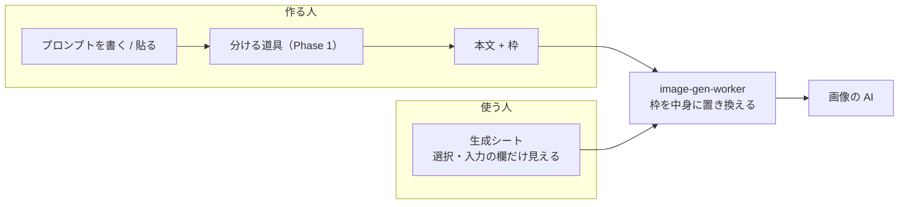
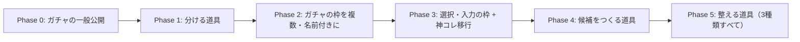

# プロンプトの枠（ガチャ・選択・入力）と、プロンプトを分ける道具 実装計画

作成: 2026-10-04（main `cbfeb8a` で調査）

## 背景

2026-10-04 に「ガチャプロンプト」を本番に出した（PR #673、image-gen-worker v132。公開前は運営だけ）。
プロンプトの `{{GACHA}}` 〜 `{{/GACHA}}` の候補から、生成のたびにサーバーが1つを選んで AI に送る仕組み。
運営の実機確認で、3回とも選ばれた職業どおりの画像になった（番号 17・15・12 / 20）。

ここから次の要望が出ている。

- 地域（国・県・州）ごとの特徴を出したい。言語設定から決めるのではなく、**使う人が選べるようにしたい**
- 職業ガチャ×国、国の衣装だけ、のように組み合わせを広げたい
- **キャラクターの名前を入れたい**。神コレクションは今、末尾に付け足す方式で無理に扱っている
- ユーザーが持っているのは ChatGPT 向けのプロンプト（AI に選ばせる書き方）。**ペルスタ用に分ける道具がほしい**

これらを、プロンプトの中に置く「枠」という1つの仕組みでまとめる。

## 決定事項（2026-10-03〜04 にユーザーと合意）

| 項目 | 決定 |
|---|---|
| 枠の種類 | **ガチャ**（サーバーがランダム）・**選択**（使う人が選ぶ。おまかせ可）・**入力**（使う人が文字を書く）の3つ。どれも「送る前にサーバーが枠を中身に置き換える」同じ仕組み |
| 地域 | 言語設定から決めない（言語にない国がある）。使う人が選ぶ（選択の枠） |
| 優先順位 | ① 計画書 → ② 今のガチャを早めに一般公開 → ③ **プロンプトを本文とガチャに分ける道具**（ほぼ変えない） → その後に選択・入力の枠 |
| ガチャの公開 | カタログ刷新とは別のフラグ `NEXT_PUBLIC_GACHA_PROMPT_ENABLED` で行う（2026-10-03 決定・実装済み） |
| 見た目のイメージ | 2026-10-04 に HTML の見本で確認し「おおよそ合っている」 |

## コードベース調査結果

### 今のガチャ（PR #673）

| 場所 | 内容 |
|---|---|
| `shared/generation/gacha-prompt.ts` | 囲みの読み取り（`parseGachaCandidates`）・入力欄の判定（`validateGachaField`）・本文と欄の結合（`composeGachaPrompt`）・展開（`expandGachaPrompt`）。Deno と Node の両方から読む |
| `supabase/functions/image-gen-worker/index.ts:2215` | `free` の生成で、本文確定の直後（派生生成なら原作者の入力を解決した後）に展開する |
| `shared/generation/job-metadata.ts` | 何番が出たかを `generation_metadata.gachaPicks`（番号と候補数だけ）に残す |
| `features/generation/components/GachaPromptField.tsx` | チェックボックス・候補欄・ヒント・「例を入れる」「空に戻す」 |
| `features/generation/components/GenerationForm.tsx:256` | `canUseGacha`。送るときに本文の末尾へ欄を付ける（`:388`） |
| `lib/env.ts:576` / `FreePageBody.tsx:66` | `isGachaPromptAvailable`（公開フラグ OR 運営）を /free のサーバー側で判定し props で渡す |
| `messages/*.ts` | `free.gacha*`。日本語以外は英語のまま（公開時に訳す） |

- 展開は、囲みが複数あっても1つずつ選べる作りになっている（`expandGachaPrompt` のテスト「囲みが複数あれば、それぞれから1つずつ選ぶ」）
- 保存される本文（author secret）は囲みを含んだまま。「このカタログで生成する」で他の人が使っても、worker が同じように展開する

### 神コレクションの名前（今の扱い）

- カテゴリ `collectible_wafer_sticker_god_6p` / `_god_petit_6p`（各6件）は `show_user_prompt_input=true`
- 入力欄のラベルは「名前を記載してください（任意）【神の名前 + 名前】になります。名前がない場合は神の名前のみになります。」
- 入力は本文の決まった位置には入らず、末尾に `User Visual Preferences:` として付け足される（`shared/generation/style-prompts.ts:74`）
- 「名前がない場合は神の名前のみ」は AI に条件分岐をさせている。画像の AI は条件分岐を守れないことがある（笑顔メッセージのプリセットで実例あり）

### 文章の AI の呼び出し

- Next.js 側は `OPENAI_API_KEY` を画像生成で使っている（`features/generation/lib/openai-image.ts:325`）
- 文章の AI は Edge Function `extract-creator-looks-prompt` が OpenAI Responses API を使っている（`supabase/functions/extract-creator-looks-prompt/index.ts:41`）
- 回数の制限は `/style` の生成に既存の仕組みがある（`app/(app)/style/rate-limit-status/`）。道具の回数制限を作るときに流用できるか確かめる

## 全体像

| 枠 | 書き方 | 誰が決めるか | 使う人の画面 |
|---|---|---|---|
| ガチャ | `{{GACHA}}` / `{{GACHA:職業}}` | サーバーがランダム | 「ガチャで決まります」の一言だけ |
| 選択 | `{{SELECT:国}}` | 使う人（おまかせ＝ランダム） | 見せる名前の一覧 |
| 入力 | `{{INPUT:名前}}` | 使う人が書く | 入力欄（ラベル・例・文字数） |

## EARS（要件定義）

### Phase 0: ガチャの一般公開

| ID | 要件（英語） | 要件（日本語） |
|---|---|---|
| REQ-001 | Where `NEXT_PUBLIC_GACHA_PROMPT_ENABLED` is `"true"`, the system shall show the gacha checkbox on /free to every signed-in user. | フラグが立っていれば、`/free` のガチャのチェックをログインしている全員に出す |
| REQ-002 | The system shall provide the gacha texts in all 15 locales. | ガチャの文言を15言語すべてに訳す |

### Phase 1: プロンプトを本文とガチャに分ける道具

| ID | 要件（英語） | 要件（日本語） |
|---|---|---|
| REQ-101 | When the user presses "Split into gacha" with a prompt in the main field, the system shall propose a main text and a gacha field without saving them. | 本文欄にプロンプトがある状態で「ガチャに分ける」を押すと、本文とガチャ欄の案を出す。この時点では入力欄を書き換えない |
| REQ-102 | The proposed main text shall consist only of lines from the original prompt, with the selection instructions removed. | 案の本文は、元のプロンプトの行だけでできている（選ばせる指示の行を消すだけで、言い換えない） |
| REQ-103 | Each proposed candidate shall appear in the original prompt. | 案の候補は、どれも元のプロンプトの中にある言葉にする（AI が作り足さない） |
| REQ-104 | The system shall show the removed lines and the candidates side by side with the original, and shall replace the fields only when the user accepts. | 消す行と候補を元の文と並べて見せ、ユーザーが「採用」したときだけ入力欄を書き換える。「元に戻す」で採用前に戻せる |
| REQ-105 | If the AI output cannot be parsed into at least two candidates, the system shall tell the user that the prompt could not be split and leave the fields unchanged. | AI の出力から候補が2つ以上取れなければ「分けられませんでした」と伝え、入力欄は変えない |
| REQ-106 | The system shall not store the prompt sent to the tool, and shall not write it to logs. | 道具に送った本文は保存せず、ログにも出さない |
| REQ-107 | The system shall limit the number of uses per user per day. | 1人1日あたりの使用回数に上限を設ける（数は未決。下の「決めること」） |

### Phase 2〜5（概要。各 Phase の着手時に詳しく書く）

| ID | 要件（日本語） |
|---|---|
| REQ-201 | ガチャの枠に名前を付けられる（`{{GACHA:職業}}`）。名前の無い `{{GACHA}}` も今までどおり動く |
| REQ-202 | 1つのプロンプトにガチャの枠を複数置ける。作る画面でも複数書ける |
| REQ-301 | 選択の枠 `{{SELECT:名前}}`。候補は「見せる名前｜見せない中身」。生成シートには見せる名前と「おまかせ」だけを出す |
| REQ-302 | 入力の枠 `{{INPUT:名前}}`。ラベル・例・文字数・空欄のときの文を持てる。入力した文字はかぎかっこの中の「描く文字」としてだけ扱う |
| REQ-303 | 非公開プロンプトでも、選択・入力の欄は出せる。本文と見せない中身は画面に送らない |
| REQ-304 | Persta ORIGINAL のプリセット（One-Tap Style）でも同じ枠を使える。今の「末尾に付け足す」方式は残す |
| REQ-401 | 枠の名前と本文から、候補（見せる名前｜見せない中身）を AI が作る道具 |
| REQ-501 | プロンプト全体を、本文と3種類の枠に整える道具 |

## ADR（設計判断）

### ADR-001: 枠はすべて worker が送る直前に置き換える

ガチャを入れたときと同じ場所（`image-gen-worker` の本文確定の直後）で、選択・入力も置き換える。

- 派生生成（このカタログで生成する）の本文は worker で初めて解決される。ここで置き換えれば、作った本人の生成と他の人の生成の両方に効く
- AI に条件分岐をさせない。「名前が空なら神の名前だけ」のような文は、サーバーが組み立ててから送る

### ADR-002: 分ける道具は「言い換えない」

ユーザーの希望は「プロンプトはほぼ変えず、本文とガチャに分ける」こと。AI に本文を書き直させると、意図しない言い換えや抜けが起きる。

- AI には本文を書かせない。**消す行の番号**と**候補**だけを JSON で返させる
- 本文は「元の行 − 消す行」でサーバーが組み立てる。言い換えが入る余地をなくす（REQ-102）
- 候補は元の文に含まれるかを機械で確かめ、含まれないものは捨てる（REQ-103）
- 「例：医師、看護師、獣医…」のように1行に並んだ候補は、区切って1行ずつにする。これは言い換えではなく並べ替えなので許す
- 候補が名前だけになる（職業ごとの服装や動作は AI の想像に任せる）点は割り切る。詳しくするのは Phase 4 の役目

### ADR-003: AI の出力は、見せて採用してから入れる

勝手に上書きすると、書いた人の意図が消える。案を元の文と並べて見せ、「採用」で初めて入力欄を書き換える（REQ-104）。

### ADR-004: 選択の候補は「見せる名前」と「見せない中身」に分ける

非公開プロンプトのカタログでも、使う人に選ばせたい。画面に出すのは見せる名前（例「フランス」）だけにし、
本文と見せない中身（例「パリの石畳、フランス語の看板」）はこれまでどおりサーバーの外に出さない。
見せる名前は作る人が公開を承知して書くもの、という扱いを作る画面で明示する。

### ADR-005: 神コレの今の方式は残し、新しい枠で作り直して入れ替える

今の「末尾に付け足す」方式（`appendUserPromptSection`）は消さない。新しい入力の枠を使ったプリセットだけが新しい動きになる。
神コレの12件は、新方式で作り直してから入れ替える。入れ替えの前後で同じキャラクター・名前で生成して見比べる。

### ADR-006: 一覧（国・都道府県・州）はペルスタが持つ（Phase 3 以降）

約200の国、47の都道府県、50の州を作る人に毎回書かせるのは現実的でない。将来、ペルスタが用意した一覧を
`{{SELECT:国}}` のように呼べるようにする。県や州は AI の知識が薄いので、見せない中身を具体的に書く。

## 実装計画

### フェーズ間の依存関係

### Phase 0: ガチャの一般公開

目的: マージ済みのガチャを、早めに全員へ出す。

- [ ] `free.gacha*` の文言を14言語へ訳す（今は日本語以外が英語）。`{{GACHA}}` は ICU の波括弧とぶつかるので、引き続き文言に直接書かない
- [ ] 運営の実機確認の残り（3回は確認済み）: スマホ幅の表示、「このカタログで生成する」で他のアカウントから使ったときもガチャになること
- [ ] Vercel に `NEXT_PUBLIC_GACHA_PROMPT_ENABLED=true` を登録して再デプロイ
- [ ] 公開後: `generation_metadata.gachaPicks` の番号の偏りを数日分見る

### Phase 1: プロンプトを本文とガチャに分ける道具

目的: ChatGPT 向けのプロンプトを貼って押すだけで、本文とガチャ欄に分けられるようにする。
公開は Phase 0 と同じフラグに乗せる（運営で確かめてから全員へ）。

- [ ] API（例: `app/api/gacha-prompt/split/route.ts`）
  - ログイン必須・`isGachaPromptAvailable` で判定・1日の回数制限
  - 文章の AI（OpenAI Responses API、JSON の形を指定）に、行番号付きの本文を渡す
  - 返り値: `removeLines`（消す行の番号）と `candidates`（候補の文字列）
  - サーバーで本文を組み立て、候補が元の文にあるかを確かめ、`validateGachaField` を通してから返す
  - 本文はログに出さない・保存しない
- [ ] 画面（`GachaPromptField` の近く）
  - 「ガチャに分ける」ボタン（本文が空なら押せない）
  - 案の表示: 元の文に「消す行」の印、作られたガチャ欄、候補の数
  - 「採用」「やめる」。採用後に「元に戻す」
- [ ] AI への指示文を `shared/` に置き、テストで固定する。今回手で分けた例（公園の遊具・職業ガチャ）を、指示文の見本と回帰テストに使う
- [ ] 確認: 公園の遊具・職業ガチャ・候補が段落ごとに書かれたもの・ガチャの要素が無いもの（分けられないと伝える）

### Phase 2: ガチャの枠を複数・名前付きに

- [ ] `{{GACHA:名前}}` の読み取り（名前の無い形も動かす）
- [ ] 作る画面で枠を足せる。何番が出たかの記録を枠ごとに残す

### Phase 3: 選択・入力の枠 + 神コレ移行

- [ ] 読み取り・展開を `shared/` に足す（worker の置き換え箇所は1つのまま）
- [ ] 生成シートに選択・入力の欄を出す。見せる名前と欄の設定だけを返す API（本文は返さない）
- [ ] One-Tap Style（Persta ORIGINAL）でも同じ枠を使えるようにする
- [ ] 神コレ12件を新方式で作り直し、見比べてから入れ替える

### Phase 4: 候補をつくる道具 / Phase 5: 整える道具

- [ ] 着手時に計画を詳しくする。Phase 1 の「見せて採用」「機械で確かめる」を同じ形で使う

## 修正対象ファイル一覧（Phase 0・1）

| ファイル | 内容 |
|---|---|
| `messages/*.ts`（14言語） | `free.gacha*` の翻訳。Phase 1 の文言 |
| `app/api/gacha-prompt/split/route.ts`（新規） | 分ける API |
| `shared/generation/gacha-split.ts`（新規） | AI への指示文・出力の確かめ・本文の組み立て（Deno 不要だが他の gacha と同じ場所に置く） |
| `features/generation/components/GachaPromptField.tsx` | 「ガチャに分ける」と案の表示 |
| `features/generation/components/GenerationForm.tsx` | 採用時に本文と欄を書き換える |

## 品質・テスト観点

- **言い換えないこと**: 案の本文の全行が元の文の行であること（REQ-102）をテストで固定する
- **作り足さないこと**: 元の文に無い候補が捨てられること（REQ-103）
- **壊れた出力**: JSON でない・候補が1つ・行番号が範囲外 → 入力欄を変えずに「分けられませんでした」
- **秘匿**: 道具の API がプロンプトをログに出さないこと
- **既存への影響**: ガチャのチェックを付けない人、`/free` 以外の画面に変化が無いこと

## ロールバック方針

- Phase 0: `NEXT_PUBLIC_GACHA_PROMPT_ENABLED` を消して再デプロイすれば運営だけに戻る。保存済みのガチャ付きプロンプトは worker が引き続き展開する
- Phase 1: 道具は入力欄を書き換えるだけで、データベースを変えない。PR を revert すればよい
- Phase 3: 神コレは入れ替え前のプリセットを `.local/backups` に保存してから入れ替える

## 決めること

1. **分ける道具の回数とペルコイン**: 無料で1日◯回 / 1回◯ペルコイン。原価は画像生成よりずっと小さい（実装時に単価表で見積もる）
2. **分ける道具の公開**: ガチャと同じフラグで同時に出すか、道具だけ運営で先に試すか
3. **Phase 0 の公開日**: 翻訳と実機確認が済み次第でよいか

## 使用スキル

| スキル | 用途 | フェーズ |
|---|---|---|
| `git-create-worktree` | 作業フォルダの用意 | 各フェーズ |
| `tdd` | テストを先に書く | Phase 1 以降 |
| `codex-webpack-build` | ビルドの確認 | 各フェーズ |
| `supabase-sync` | worker のデプロイ | Phase 2・3 |
| `git-create-pr` | PR 作成（日本語） | 各 PR |
