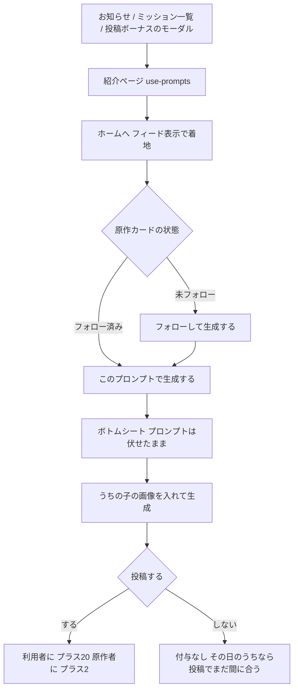
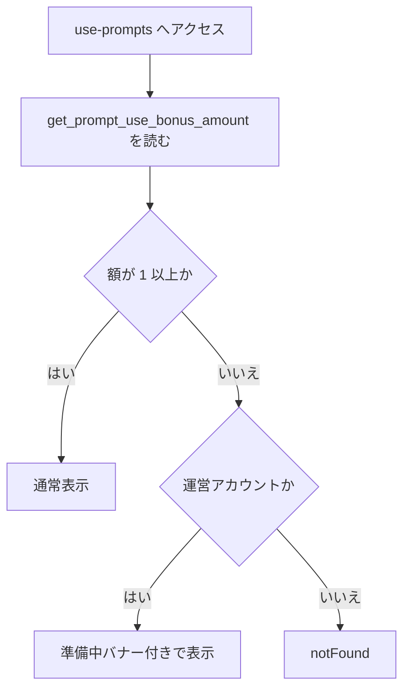
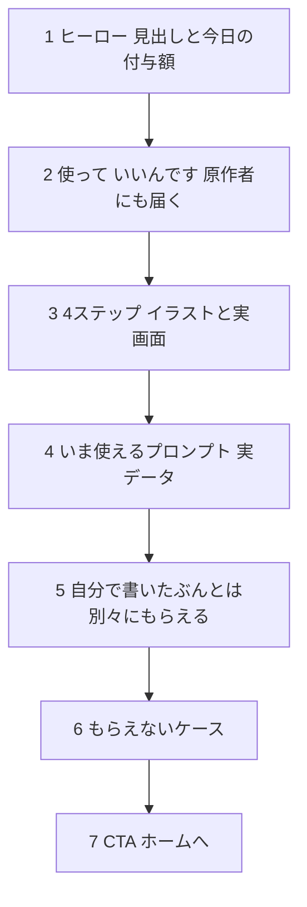
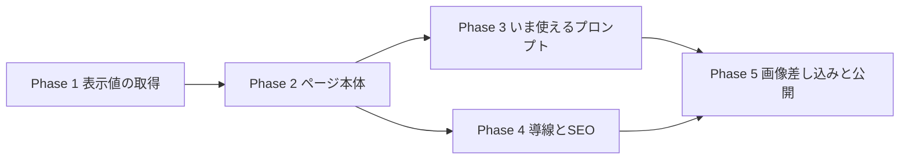

# プロンプト利用ミッションの紹介ページ 実装計画書

「ユーザーのプロンプトで生成＆投稿して、ペルコインGET！」を伝える公開ページを作る。
仕組み（`prompt_use_daily`）は 2026-08-18 に本番適用済みで、**額 0 のまま停止中**。
このページを公開してから額を入れる（＝周知してから実施する）。

- 作成日: 2026-08-21
- 関連: `docs/planning/prompt-use-daily-bonus-plan.md`（付与側の計画）
- 関連: `/creator-rewards`（**あげる側**の紹介ページ。本ページは**つかう側**）

---

## コードベース調査結果

### 現状の数値（2026-08-21 本番）

| 項目 | 値 |
|---|---|
| `percoin_bonus_defaults.prompt_use_daily` | **0（停止中）** |
| `percoin_bonus_defaults.prompt_usage_reward` | 2（作者還元・稼働中） |
| `daily_post_free` / `daily_post_one_tap` | 20 / 20 |
| 投稿済み Free 作品 | 73件（プロンプト公開 19 / 非公開 54） |
| Free 作品の作者 | 10人 |
| プロンプト利用イベント | 69回 |
| **プロンプトを使ったことがある人** | **7人**（2026-07-30〜） |

出す人は10人いるのに、使う人は7人。**このページの仕事は使う側のフタを外すこと**。

### 既存の足場（再利用できるもの）

| 対象 | 場所 | 備考 |
|---|---|---|
| 付与額の取得 RPC | `get_prompt_use_bonus_amount()` | `anon` に GRANT 済み。**マイグレーション不要** |
| 表示用デフォルト取得 | `features/credits/lib/get-percoin-defaults.ts` | `prompt_use_daily` は**未収録**。追加が必要 |
| 紹介ページの型 | `app/creator-rewards/page.tsx` + `features/credits/components/CreatorRewardsGuide.tsx` | ヒーロー `<picture>` 出し分け、`ImageSlot` / `ScreenshotSlot` / `PopIn` / `Sparkle` |
| 演出ユーティリティ | `app/globals.css` L1712〜 | `.reward-pop-in` / `.reward-float` / `.reward-sparkle` / `.reward-breathe` / `.reward-gradient-shift`（`prefers-reduced-motion` 対応済み） |
| ミッション行 | `features/challenges/components/ChallengePageContent.tsx` L166〜 | `key: "prompt_use"` / `href: "/"`。**`amount > 0` の行だけ表示**するので、額を入れると自動で出る |
| 投稿直後モーダル | `features/posts/components/PostBonusModal.tsx` | `isPromptUse` の分岐が既にある。`showCreatorReward` は `!isPromptUse` で抑止済み |
| 原作カード | `features/posts/components/SourcePromptReferenceCard.tsx` / `FeedSourceQuote.tsx` | `フォローして生成する` ボタンあり |
| 利用可否の正本 | `validate_derived_prompt_source(post, requester)` | **フォロワーのみ**（公開・非公開とも）。ブロック・削除予定・秘匿行の有無も見る |
| 利用数の表示規則 | `features/posts/lib/constants.ts` `USAGE_COUNT_DISPLAY_THRESHOLD = 10` | 10未満は出さない（少ない数字は逆の社会的証明になる） |
| 原作一覧の取得 | `features/posts/lib/source-prompt-reference.ts` `fetchPubliclyUsableOrigins` | `is_posted` かつ `moderation_status='visible'` |
| 運営判定 | `lib/env.ts` `getAdminUserIds()` / `getAdminPreviewUserIds()` | ページ側は `getUser()` と突き合わせる |
| canonical | `lib/metadata.ts` `createCanonicalAlternates` | |
| sitemap | `app/sitemap.ts` `UNLOCALIZED_PUBLIC_PATHS` | **`/creator-rewards` は未登録**。本ページは登録する |

### 付与条件（`grant_prompt_use_daily_bonus` の実装から）

ページの文言はこの条件と一致させること。**推測で書かない**。

1. 自分の作品であること（他人の ID を渡しても通らない）
2. **投稿していること**（生成しただけでは付与されない）
3. **その日つくったものであること**（JST の日付で比較）
4. `prompt_usage_events` に行があること = **アプリ内の「このプロンプトで生成する」経由**
   （プロンプトをコピペして `/free` で生成した分は、利用者・作者とも対象外）
5. **自己利用は除外**（原作者 = 自分なら 0）
6. 1日1回（`prompt_use_bonus_grants` の `UNIQUE(user_id, jst_date)`）
7. 無料残高が上限に達していると 0

さらに `grant_daily_post_bonus` 側で、**派生投稿はフリー投稿ボーナスから除外**されている。
＝1つの投稿で 20+20 にはならない。1日に両方やれば 40。

---

## 1. 概要図

### ユーザー動線

### ページの表示判定

### ページ構成

---

## 2. EARS（要件定義）

### 表示

- **When** a visitor opens `/use-prompts` **and** `get_prompt_use_bonus_amount()` returns a value greater than 0, **the system shall** render the guide with that amount shown as the reward.
  ／付与額が 1 以上のとき、その額を表示してページを描画する。

- **If** `get_prompt_use_bonus_amount()` returns 0 **and** the viewer is not an operator, **then the system shall** respond with 404.
  ／停止中は一般ユーザーに 404 を返す（もらえないのに告知しない）。

- **Where** the viewer is an operator (`getAdminUserIds()` または `getAdminPreviewUserIds()` に含まれる), **the system shall** render the page even when the amount is 0, with a 「準備中」 banner stating it is not yet live.
  ／運営は停止中でも確認できる。ただし準備中と明示する。

- **While** the amount is greater than 0, **the system shall** read it on every request without embedding it in copy.
  ／額は文言に焼き込まない。運営が変えたら表示も追従する。

- **When** the reward amount is rendered, **the system shall** apply no subscription multiplier.
  ／紹介ページは素の設定値を出す（プランごとの実額はミッション画面が持つ）。

### 「いま使えるプロンプト」

- **When** the page renders, **the system shall** show up to 6 recently posted Free works whose prompt can be used, as thumbnails linking to the post detail.
  ／使えるプロンプトを実データのサムネイルで出す。

- **If** a work is unposted, hidden by moderation, or has no stored prompt secret, **then the system shall** exclude it from that list.
  ／投稿取消・非表示・秘匿行なしは出さない。

- **If** the list cannot be fetched, **then the system shall** omit the section entirely rather than showing an empty frame.
  ／取得失敗時はセクションごと出さない（fail closed）。

- **While** a work's usage count is below `USAGE_COUNT_DISPLAY_THRESHOLD`, **the system shall** not display its usage count.
  ／既存の閾値（10）をそのまま使う。新しい規則を作らない。

### 文言の正しさ

- **When** the steps are described, **the system shall** state that following the author is required before generating.
  ／フォローが必要であることを手順に明記する。

- **When** the bonus is described, **the system shall** state that a single post earns either the Free post bonus or the prompt-use bonus, never both.
  ／1投稿はどちらか一方であることを明示する。

- **When** the exclusions are described, **the system shall** list: self-use, copy-and-paste generation, works not posted, and works created on a previous day.
  ／対象外の4条件を挙げる。

### 導線

- **When** a user receives the prompt-use bonus after posting, **the system shall** show a link to this page from the post bonus modal.
  ／付与モーダルから紹介ページへ行ける（`isPromptUse` の分岐に足す）。

---

## 3. ADR（設計判断記録）

### ADR-001: URL は `/use-prompts`（ロケール無し）

- **Context**: 対になる `/creator-rewards` はロケール無しの `app/` 直下。`/prompt-rewards` は creator-rewards と紛らわしい。
- **Decision**: `app/use-prompts/page.tsx`。ロケール付きルートは作らない。
- **Reason**: 既存の紹介ページと構成を揃える。URL から「つかう側」だと読める。
- **Consequence**: `PostBonusModal` と同じく `/use-prompts` 直リンクでよい（ロケール前置き不要）。

### ADR-002: 額 0 のときは 404 にせず、運営だけ見せる

- **Context**: `/creator-rewards` は額 0 で `notFound()`。同じにすると**公開前に自分で確認できない**。
- **Decision**: 額 0 かつ非運営のときだけ 404。運営には「準備中」バナー付きで表示する。
- **Reason**: このページは「周知してから実施する」ための資料で、公開前確認が工程に含まれる。
- **Consequence**: 運営が見ている画面と一般ユーザーの画面が違う。バナーで取り違えを防ぐ。

### ADR-003: 寒色。コインの金だけ共通に残す

- **Context**: `/creator-rewards` は pink→orange の暖色。2枚並ぶと役割が判別しづらい。
- **Decision**: ベースを `sky-50 → cyan-50 → white`、アクセントを sky-500 / teal-400 にする。ペルコインのアイコンと「+20」の金色だけ両ページ共通。
- **Reason**: **あげる側＝暖色 / つかう側＝寒色**で役割を色に持たせる。金色を残すことで別企画ではなく同シリーズだと分かる。
- **Consequence**: `CreatorRewardsGuide` のクラスをそのままコピーできない。共通部品（`ImageSlot` / `ScreenshotSlot` / `PopIn` / `Sparkle`）だけ切り出して共有する。

### ADR-004: フォロー必須を隠さず、手順の2番目として書く

- **Context**: `validate_derived_prompt_source` はフォロワーのみを通す。公開プロンプトでも同じ。
- **Decision**: ステップ2を「フォローして『このプロンプトで生成する』」にする。注意書きではなく手順にする。
- **Reason**: 隠すと「押したのに使えない」になる。カードには `フォローして生成する` という**1タップで両方すむボタン**が既にあるので、手順として書けば重くならない。
- **Consequence**: フォロー数が伸びる副作用がある。逆に、フォロー必須という設計自体が利用者数の天井になっている可能性は残る（本ページの範囲外）。

### ADR-005: 利用数の表示は既存の閾値をそのまま使う

- **Context**: 「◯人が使いました」の表示は以前から検討中だった。
- **Decision**: `shouldShowUsageCount`（10以上）を流用する。ページ独自の閾値を作らない。
- **Reason**: 閾値には「少ない数字は逆の社会的証明になる」という理由が既に書かれている。ページだけ緩めると、投稿詳細では出ない数字がページに出て食い違う。
- **Consequence**: 現状ほとんどの原作は10未満なので、当面は数字が出ない。サムネイル自体の訴求で持たせる。

### ADR-006: 「いま使えるプロンプト」で可否判定を再実装しない

- **Context**: 実際に使えるかは requester 依存（フォロー・ブロック）。未ログインでは決まらない。
- **Decision**: ページでは requester 非依存の条件（投稿済み・`moderation_status='visible'`・秘匿行あり・作者が削除予定でない）だけで絞り、見出しを「**フォローすると使えるプロンプト**」にする。
- **Reason**: 「使えます」と断言せず、事実（フォローすれば使える）だけを言う。判定の正本は RPC 側に残す。
- **Consequence**: ブロック関係の相手の作品が並ぶことはありうる。押した先の投稿詳細では正しく判定されるので、誤った生成は起きない。

### ADR-007: 排他（1投稿はどちらか一方）を独立セクションにする

- **Context**: `grant_daily_post_bonus` は派生投稿をフリー投稿ボーナスから除外している。
- **Decision**: 「自分で書いたぶんとは、別々にもらえます」を独立セクションにし、1投稿は一方・1日に両方で40 と明記する。
- **Reason**: 1投稿で40もらえると誤解されると、そのまま問い合わせになる。脚注に落とすと読まれない。
- **Consequence**: セクションが1つ増える。

### ADR-008: マイグレーションを追加しない

- **Context**: 付与額の取得は `get_prompt_use_bonus_amount()` が既に `anon` まで GRANT 済み。
- **Decision**: DB 変更なし。ページはこの RPC を読む。
- **Reason**: 表示のために `percoin_bonus_defaults` を直接読むと RLS の都合で admin クライアントが要る。既にある RPC で足りる。
- **Consequence**: 本 PR は**ロールバックが git revert だけで完結する**（DB に痕跡が残らない）。

---

## 4. 実装計画

### フェーズ間の依存関係

### Phase 1: 表示値の取得

**目的**: 紹介ページが付与額を読めるようにする。
**ビルド確認**: `npm run typecheck` / `npm run test` が通る。

- [ ] `features/credits/lib/get-prompt-use-bonus-amount.ts` を新設し、`get_prompt_use_bonus_amount()` を `react.cache` でラップして読む（既存の `get-percoin-defaults.ts` に相乗りさせない。あちらは admin クライアント前提で、こちらは anon で足りる）
- [ ] 取得失敗・null は 0 に倒す（＝停止中扱い。fail closed）
- [ ] 単体テスト: 正常値 / エラー / null

### Phase 2: ページ本体

**目的**: 画像がプレースホルダのまま、文言と構成が完成した状態にする。
**ビルド確認**: `/use-prompts` が描画され、額 0 では非運営に 404 が返る。

- [ ] `features/credits/components/reward-guide/` に共通部品を切り出す（`ImageSlot` / `ScreenshotSlot` / `PopIn` / `Sparkle`）。`CreatorRewardsGuide` からの移設で、**見た目は変えない**
- [ ] `features/credits/components/UsePromptsGuide.tsx` を新設（寒色パレット・ADR-003）
- [ ] `app/use-prompts/page.tsx`（`connection()` → 額取得 → 運営判定 → 404 or 描画）
- [ ] セクション 1・2・3・5・6・7 を実装（4 は Phase 3）
- [ ] 準備中バナー（運営のみ・額 0 のとき）
- [ ] `CreatorRewardsGuide` の回帰テストを流し、移設で壊れていないことを確認

### Phase 3: いま使えるプロンプト

**目的**: 実データのサムネイルで「使ってみたい」を作る。
**ビルド確認**: 取得失敗時にセクションが消え、ページは壊れない。

- [ ] `features/credits/lib/get-usable-prompt-showcase.ts`（Free の root 投稿・投稿済み・`moderation_status='visible'`・秘匿行あり・作者が削除予定でない、を新しい順に最大6件）
- [ ] サムネイルは投稿詳細へリンク。見出しは「フォローすると使えるプロンプト」
- [ ] 利用数は `shouldShowUsageCount` を通したものだけ表示
- [ ] 単体テスト: 除外条件ごとに1ケース / 取得失敗で空配列

### Phase 4: 導線と SEO

**目的**: ページに人が来る経路を作る。
**ビルド確認**: 既存のミッション画面・投稿モーダルが壊れない。

- [ ] `PostBonusModal` の `isPromptUse` 分岐に `/use-prompts` へのリンクを足す（`showCreatorReward` とは排他のまま）
- [ ] `ChallengePageContent` のプロンプト利用行の近くに紹介ページへの導線（`/creator-rewards` の導線と同じ作法）
- [ ] `messages/*.ts` に文言を追加（ja/en 必須、他ロケールはフォールバック方針に従う）
- [ ] metadata / OGP / `createCanonicalAlternates("/use-prompts")`
- [ ] `app/sitemap.ts` の `UNLOCALIZED_PUBLIC_PATHS` に `/use-prompts` を追加

### Phase 5: 画像差し込みと公開

**目的**: go-live。
**ビルド確認**: `npm run build -- --webpack`。

- [ ] ヒーロー画像（SP 縦 / PC 横）を `public/use-prompts/` に配置 → **ユーザー支給**
- [ ] ステップ4枚のイラスト → **ユーザー支給**
- [ ] 実画面スクショ4枚をこちらで取得（フィードの原作カード / フォローして生成する / ボトムシート（プロンプト伏せ）/ 付与モーダル）
- [ ] OGP 画像
- [ ] 運営アカウントで実機確認（スマホ / PC）
- [ ] **admin で `prompt_use_daily` を 20 にする**
- [ ] 一般アカウントでミッション行が出ることを確認
- [ ] お知らせを公開

---

## 5. 修正対象ファイル一覧

| ファイル | 操作 | 変更内容 |
|---|---|---|
| `features/credits/lib/get-prompt-use-bonus-amount.ts` | 新規 | 付与額の取得（RPC） |
| `features/credits/components/reward-guide/index.tsx` | 新規 | 共通部品の切り出し |
| `features/credits/components/CreatorRewardsGuide.tsx` | 修正 | 共通部品を import に置き換え（見た目は変えない） |
| `features/credits/components/UsePromptsGuide.tsx` | 新規 | 本ページ本体 |
| `features/credits/lib/get-usable-prompt-showcase.ts` | 新規 | 「いま使えるプロンプト」の取得 |
| `app/use-prompts/page.tsx` | 新規 | ページ（額取得・運営判定・metadata） |
| `features/posts/components/PostBonusModal.tsx` | 修正 | `isPromptUse` 分岐にリンク追加 |
| `features/challenges/components/ChallengePageContent.tsx` | 修正 | 紹介ページへの導線 |
| `messages/ja.ts` / `messages/en.ts` ほか | 修正 | 文言追加 |
| `app/sitemap.ts` | 修正 | `/use-prompts` を追加 |
| `public/use-prompts/*` | 新規 | 画像一式 |
| `tests/unit/features/credits/*` | 新規 | 単体テスト |

**マイグレーションは無し**（ADR-008）。

---

## 6. 品質・テスト観点

### 品質チェックリスト

- [ ] **文言と実装の一致**: 付与条件7つ・除外4つが `grant_prompt_use_daily_bonus` と食い違っていないか
- [ ] **額の非埋め込み**: 20 という数字がコード・文言に直書きされていないか
- [ ] **fail closed**: 額の取得失敗が「もらえます」の表示にならないか
- [ ] **運営限定表示**: 額 0 のとき一般ユーザーに 404 が返るか
- [ ] **i18n**: ja/en が揃っているか
- [ ] **回帰**: `/creator-rewards` の見た目が変わっていないか（共通部品の切り出し）

### テスト観点

| カテゴリ | テスト内容 |
|---|---|
| 正常系 | 額 > 0 でページが描画され、額が表示される |
| 停止中 | 額 0 かつ非運営で `notFound`。運営には準備中バナー付きで描画 |
| 異常系 | RPC エラーで 0 扱い。ショーケース取得失敗でセクションが消える |
| 除外条件 | 投稿取消 / 非表示 / 秘匿行なし / 作者削除予定 がショーケースから落ちる |
| 文言の同期 | ステップ本文にフォローの記載があること、排他の記載があることをテストで固定する |
| 実機確認 | スマホ / PC、ヒーローの `<picture>` 出し分け、`prefers-reduced-motion` |

---

## 7. ロールバック方針

- **DB 変更なし**のため、コードは `git revert` だけで完全に戻る
- 公開後に問題が出た場合、**admin で `prompt_use_daily` を 0 に戻す**とミッション行が消え、ページは非運営に 404 になる（コード変更なしで止められる）
- 共通部品の切り出しだけは `/creator-rewards` に影響するので、フェーズを分けて単独でコミットする

---

## 8. 使用スキル

| スキル | 用途 | フェーズ |
|---|---|---|
| `/git-create-branch` | ブランチ作成 | 実装開始時 |
| `/test-generate` | テストコード生成 | Phase 1〜3 |
| `/git-create-pr` | PR 作成 | 実装完了時 |

---

## 9. 未決事項

1. **イラストの枚数と内容**（ユーザー支給）。ヒーロー1枚＋ステップ4枚を想定。
   ステップは ①ホームで見つける ②フォローして生成する ③うちの子で生成する ④投稿してコインを受け取る
2. **お知らせの文面**。「使ってもいい」を前に出すか、額を前に出すか
3. **フォロー必須という設計そのもの**。利用者7人の天井になっている可能性がある。
   本ページの範囲外だが、公開後の数字を見て別途判断する
