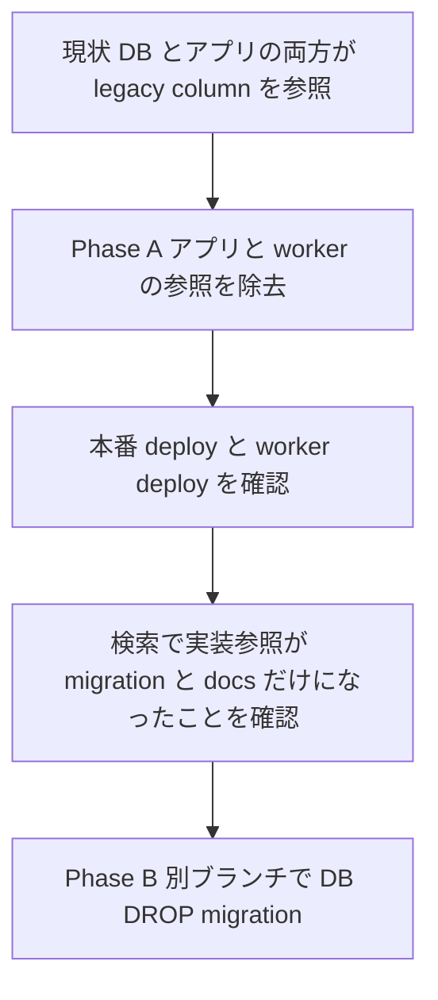
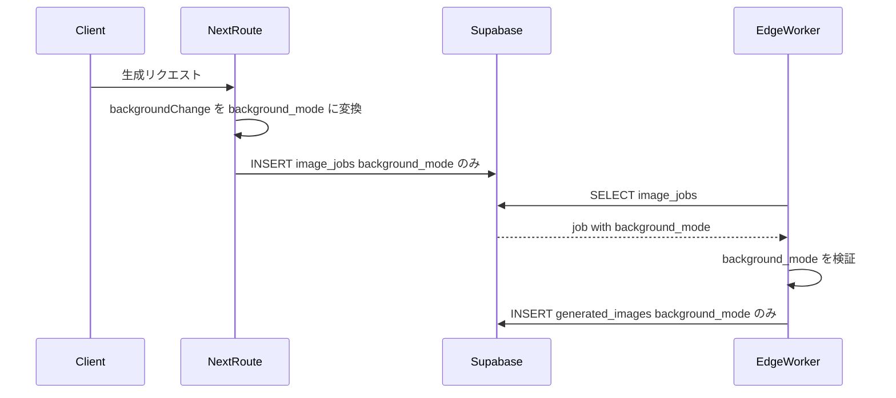
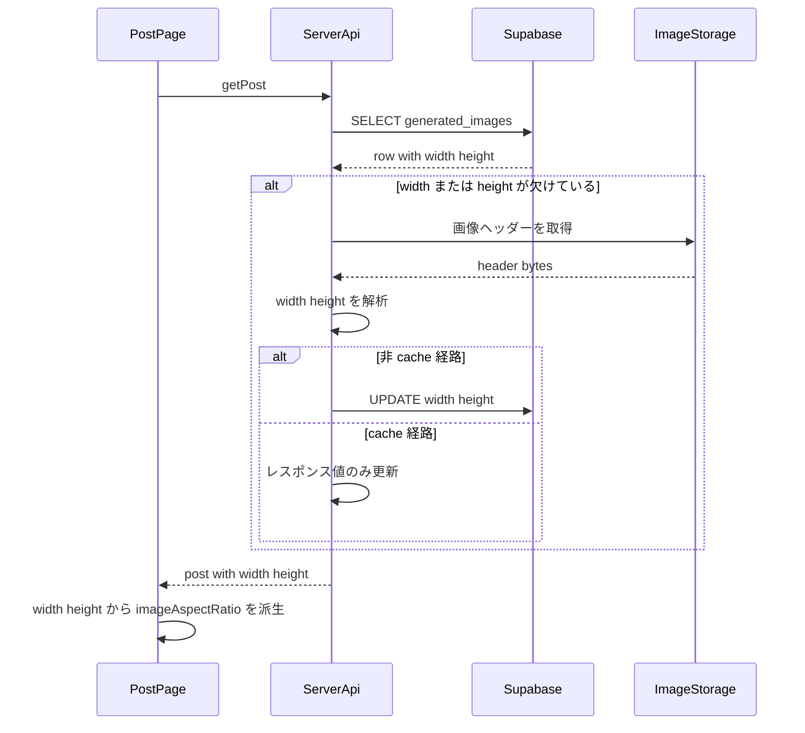
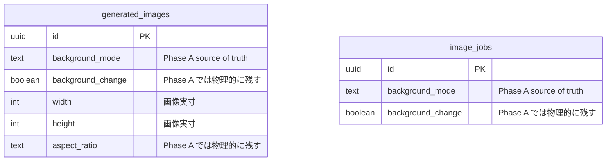

# Legacy 画像メタデータ参照除去 Phase A 実装計画

## Context

Post 詳細画面への生成モデル名と画像サイズ表示対応により、`generated_images.width` / `generated_images.height` が追加された。これにより、画像の向き判定を `generated_images.aspect_ratio` に依存し続ける必要は薄くなった。

また、`background_change` は過去の boolean 表現であり、現在は `background_mode` が `keep` / `ai_auto` などの拡張可能な表現として導入済みである。

この計画は **Phase A** として、DB カラムを削除する前にアプリケーション・Edge Function・型・テストから `aspect_ratio` / `background_change` への参照と書き込みを取り除く。DB の DROP は **Phase B の別ブランチ・別 PR** で扱う。

## ゴール

- `generated_images.aspect_ratio` をアプリケーションの読み取り・書き込み対象から外す
- `generated_images.background_change` をアプリケーションと Edge Function の読み取り・書き込み対象から外す
- `image_jobs.background_change` を Next.js route と Edge Function の読み取り・書き込み対象から外す
- Post 詳細の画像向き判定は `width` / `height` から派生し、寸法が欠ける場合のみ既存の画像ヘッダー解析に fallback する
- 背景処理は DB 上の `background_mode` を唯一のアプリ側 source of truth にする
- Phase B で DROP migration を安全に出せる状態を作る

## Non Goals

- この Phase では DB カラムを DROP しない
- この Phase では `idx_generated_images_aspect_ratio` を DROP しない
- この Phase では `backgroundChange` という API 入力・UI state を完全削除しない
- この Phase では `width` / `height` の全件 backfill job は作らない
- この Phase では Post 詳細 UI の見た目を変更しない

## コードベース調査結果

### DB スキーマと migration

- `generated_images.background_change` は `supabase/migrations/20250109000001_initial_setup.sql` で `BOOLEAN DEFAULT false` として作成済み
- `image_jobs.background_change` は `supabase/migrations/20260115054748_add_image_jobs_queue.sql` で `BOOLEAN DEFAULT false` として作成済み
- `generated_images.aspect_ratio` は `supabase/migrations/20251212065229_add_aspect_ratio_to_generated_images.sql` で追加済み
- `idx_generated_images_aspect_ratio` は同 migration で追加済み
- `background_mode` は `supabase/migrations/20260222133000_add_background_mode_to_generation_tables.sql` で `generated_images` / `image_jobs` に追加済み
- `background_mode` migration では既存 `background_change` から backfill し、その後も互換期間として `background_change` を残している
- 現行 route は `app/api/generate-async/handler.ts` と `app/(app)/style/generate-async/handler.ts` の両方で `image_jobs.background_mode` を INSERT payload に含めている
- `.cursor/rules/database-design.mdc` は現時点の物理スキーマ台帳であり、Phase A では `aspect_ratio` / `background_change` / `idx_generated_images_aspect_ratio` の記載を削除しない
- Supabase remote 接続確認は未実施。Phase A は DB migration なしのアプリ参照除去なので、ローカル migration と schema ledger を根拠に計画する。Phase B の DROP migration 作成時には remote migration 状態を確認する。

### 現在の主な参照箇所

#### `background_change`

- `app/api/generate-async/handler.ts`
  - `image_jobs` INSERT 時に `background_change` を書いている
- `app/(app)/style/generate-async/handler.ts`
  - `image_jobs` INSERT 時に `background_change` を書いている
- `supabase/functions/image-gen-worker/index.ts`
  - `job.background_change` を `resolveBackgroundMode` の fallback として読んでいる
  - `generated_images` INSERT 時に `background_change` を書いている
- `features/my-page/components/ImageDetailPageClient.tsx`
  - `background_mode` が不明な場合に `image.background_change` を fallback として読んでいる
- `features/generation/lib/job-types.ts`
  - `ImageJob` 型に `background_change` が含まれる
- `features/generation/lib/database.ts`
  - `GeneratedImageRecord` 型に `background_change` が含まれる
  - `saveGeneratedImage` / `saveGeneratedImages` は現状 `app` / `features` / `supabase` / `tests` / `shared` 配下から呼ばれていない。Phase A では削除せず、型だけを legacy column 除去後の形に追従する
- 関連テスト
  - `tests/characterization/api/generate-async-route.char.test.ts`
  - `tests/integration/api/generate-async-route.test.ts`
  - `tests/integration/app/style-generate-async-route.test.ts`
  - `tests/unit/features/posts/post-detail.test.tsx`

#### `aspect_ratio`

- `features/posts/lib/ensure-image-dimensions.ts`
  - `aspect_ratio` / `width` / `height` の lazy compute をまとめて担当している
  - UPDATE 対象に `aspect_ratio` が含まれる
- `features/posts/lib/server-api.ts`
  - `ensureImageDimensions` の戻り値から `aspect_ratio` を `getPost` の返却値に入れている
- `features/posts/components/CachedPostDetail.tsx`
  - `post.aspect_ratio` を `imageAspectRatio` の第一候補として使っている
- `features/generation/lib/database.ts`
  - `GeneratedImageRecord` 型に `aspect_ratio` が含まれる
- `features/posts/lib/utils.ts`
  - `deriveAspectRatioFromDimensions` のコメントが `aspect_ratio` fallback 前提になっている
- 関連テスト
  - `tests/unit/features/posts/server-api-get-post.test.ts`
  - `tests/unit/features/posts/ensure-image-dimensions.test.ts`

### Phase A 後に残ってよい参照

Phase A 完了後も、以下の `rg` ヒットは許容する。

- `supabase/migrations/**`
  - 過去 migration は履歴なので書き換えない
- `docs/planning/**`
  - 互換期間や Phase B の説明として残ってよい
- `.cursor/rules/database-design.mdc`
  - Phase A では物理カラムが残るため、台帳からは削除しない

アプリ実装・Edge Function・テストでは、原則として snake_case の `aspect_ratio` / `background_change` ヒットを残さない。

---

## 1. 概要図

### 段階的な除去方針



### Phase A 後の生成フロー



### Phase A 後の Post 詳細フロー



### データモデルの扱い



---

## 2. EARS 要件定義

### EV-1 `image_jobs.background_change` への書き込み停止

- **EN**: When a generation route creates an `image_jobs` row, the system shall write `background_mode` and shall not include `background_change` in the INSERT payload.
- **JA**: 生成 route が `image_jobs` 行を作成するとき、システムは `background_mode` を書き込み、INSERT payload に `background_change` を含めない。

### EV-2 worker の `background_change` 読み取り停止

- **EN**: When the image generation worker processes a job, the system shall resolve background behavior from `job.background_mode` and shall not read `job.background_change`.
- **JA**: 画像生成 worker が job を処理するとき、システムは `job.background_mode` から背景処理を決定し、`job.background_change` を読まない。

### EV-3 `generated_images.background_change` への書き込み停止

- **EN**: When the image generation worker creates a `generated_images` row, the system shall write `background_mode` and shall not include `background_change` in the INSERT payload.
- **JA**: 画像生成 worker が `generated_images` 行を作成するとき、システムは `background_mode` を書き込み、INSERT payload に `background_change` を含めない。

### EV-4 My Page 詳細の fallback 更新

- **EN**: When `ImageDetailPageClient` receives an image whose `background_mode` is invalid or missing, the system shall fall back to `keep` and shall not read `background_change`.
- **JA**: `ImageDetailPageClient` が無効または欠損した `background_mode` を受け取ったとき、システムは `keep` に fallback し、`background_change` を読まない。
- **Note**: `background_mode` は migration で backfill 済みかつ NOT NULL 化済みのため、通常は欠損しない想定。ただし Phase 0 で本番 DB に NULL / 不正値が残っていないことを確認できると、過去行の表示が `ai_auto` から `keep` に変わるリスクをより明確に潰せる。

### EV-5 `aspect_ratio` の lazy compute 停止

- **EN**: When `getPost` ensures image metadata, the system shall compute and persist only `width` and `height`, and shall not read or update `generated_images.aspect_ratio`.
- **JA**: `getPost` が画像メタデータを補完するとき、システムは `width` と `height` のみを計算・保存し、`generated_images.aspect_ratio` を読まない、または更新しない。

### EV-6 Post 詳細の向き判定

- **EN**: When Post detail needs `imageAspectRatio`, the system shall derive it from positive `width` and `height`; if dimensions are unavailable, the system may use image header parsing as a response-only fallback.
- **JA**: Post 詳細が `imageAspectRatio` を必要とするとき、システムは正の `width` と `height` から派生する。寸法が利用できない場合、レスポンス用 fallback として画像ヘッダー解析を使ってよい。

### ST-1 DB 互換性

- **EN**: While Phase A is deployed, the system shall keep existing DB columns and indexes so that older deployed code can still run during rollout.
- **JA**: Phase A の deploy 中、システムは既存 DB カラムと index を維持し、rollout 中に旧コードが動作できる状態を保つ。

### ST-2 API 入力互換性

- **EN**: While Phase A is deployed, the system shall keep accepting request-level `backgroundChange` where existing clients still send it, and shall convert it to `background_mode` inside the route boundary.
- **JA**: Phase A の deploy 中、既存 client が送る request-level の `backgroundChange` は引き続き受け付け、route 境界で `background_mode` に変換する。

### IF-1 寸法取得失敗

- **EN**: If width and height cannot be resolved from the DB or image header, then the system shall continue rendering the Post detail with the existing image layout fallback and shall not access `aspect_ratio`.
- **JA**: width / height を DB または画像ヘッダーから解決できない場合、システムは既存の画像レイアウト fallback で Post 詳細を描画し続け、`aspect_ratio` にはアクセスしない。

### IF-2 deploy 順序の互換性

- **EN**: If Next.js routes and the Edge Function are deployed at different times, then the system shall continue to work because both old and new code paths share `background_mode`.
- **JA**: Next.js route と Edge Function が異なるタイミングで deploy された場合でも、新旧両方のコードが `background_mode` を共有するため、システムは動作を継続する。
- **Premise**: この互換性は、本番に出ている現行 Next.js route が `image_jobs.background_mode` を書いていることに依存する。Phase 0 でこの前提を確認する。

---

## 3. ADR

### ADR-001: DROP ではなく参照除去を先に行う

- **Context**: `aspect_ratio` / `background_change` は DB に残っているが、すぐに DROP すると deploy 順序によって旧コードが壊れる可能性がある。
- **Decision**: Phase A ではアプリ・worker・型・テストの参照除去に限定し、DB DROP は Phase B に分離する。
- **Reason**: Next.js と Supabase Edge Function の deploy タイミング差を吸収できる。migration rollback なしでアプリ側の動作確認ができる。
- **Consequence**: DB 上には未使用カラムが一時的に残る。Phase B の前提条件として実装参照ゼロの確認が必要になる。

### ADR-002: `background_mode` をアプリ側 source of truth にする

- **Context**: `background_change` は boolean で、`keep` / `ai_auto` 以上の表現を持てない。`background_mode` は拡張可能で migration 済み。
- **Decision**: DB 読み書きでは `background_mode` のみを使う。request-level の `backgroundChange` は互換入力として route 境界に残す。
- **Reason**: UI や既存 client の互換性を壊さず、DB 永続化の source of truth を一本化できる。
- **Consequence**: `backgroundModeToBackgroundChange` helper は DB 書き込み用途では不要になるが、request 互換や別経路で使われている間は即時削除しない。`ImageDetailPageClient` の fallback は `keep` 固定になるため、もし過去行に `background_mode` NULL / 不正値が残っていると表示が `ai_auto` から `keep` に変わる可能性がある。migration では backfill と NOT NULL 化が済んでいるため実害は限定的な想定だが、Phase 0 で remote 状態を確認する。

### ADR-003: `aspect_ratio` ではなく `width` / `height` から派生する

- **Context**: Post 詳細のサイズ表示対応で画像実寸が保存されるようになった。
- **Decision**: 画像向き判定は `deriveAspectRatioFromDimensions(width, height)` を第一候補にする。寸法がない場合は画像ヘッダー解析 fallback を使う。
- **Reason**: `aspect_ratio` という派生値を永続化し続ける必要がなくなる。`width` / `height` からサイズ表示と向き判定を同時に満たせる。
- **Consequence**: `ensureImageDimensions` の責務は `width` / `height` の補完に絞る。`imageAspectRatio` という UI 用概念は残るが、DB column とは切り離す。

### ADR-004: schema ledger は Phase A では削除しない

- **Context**: `.cursor/rules/database-design.mdc` は物理スキーマの正確な台帳である。
- **Decision**: Phase A では `aspect_ratio` / `background_change` / `idx_generated_images_aspect_ratio` の台帳記載を削除しない。
- **Reason**: DB カラムと index が実際には残るため、Phase A で削除すると台帳が不正確になる。
- **Consequence**: Phase B の DROP migration と同じ PR で台帳を更新する。Phase A では必要に応じて「アプリでは未使用化予定」の注記に留める。

---

## 4. 実装フェーズ

### Phase 0: ベースライン確認

- [ ] `main` から切った `refactor/remove-legacy-image-metadata-usage` 上で作業していることを確認する
- [ ] `git status --short` で既存の unrelated 変更を確認し、今回の作業対象に含めない
- [ ] `rg -n "background_change|aspect_ratio" app features supabase/functions tests docs .cursor/rules -g '!node_modules'` で開始時点の参照を保存する
  - このコマンドは baseline 記録用なので `docs` / `.cursor/rules` も含める。Phase 3 の完了確認コマンドは実装参照だけを見るため、意図的に対象が異なる。
- [ ] `docs/planning/post-detail-model-and-size-display-plan.md` を参照し、`width` / `height` 導入時の互換方針と矛盾しないことを確認する
- [ ] `app/api/generate-async/handler.ts` と `app/(app)/style/generate-async/handler.ts` の現行実装が `image_jobs.background_mode` を INSERT payload に含めていることを確認する
- [ ] 本番に deploy 済みの Next.js route が `image_jobs.background_mode` を書いていることを確認する。未確認の場合は、Edge Function を `background_change` 非依存にする deploy 順序を慎重に扱う
- [ ] Supabase 接続が可能であれば、`generated_images.background_mode` / `image_jobs.background_mode` に NULL または CHECK 外の値が残っていないことを確認する

### Phase 1: `background_change` の DB 読み書きを停止

#### Next.js route

- [ ] `app/api/generate-async/handler.ts`
  - `image_jobs` INSERT payload から `background_change` を削除する
  - `backgroundChange` request 入力から `background_mode` への変換は維持する
- [ ] `app/(app)/style/generate-async/handler.ts`
  - `image_jobs` INSERT payload から `background_change` を削除する
  - 既存 UI state が boolean のままでも `background_mode` を保存できることを確認する

#### Edge Function

- [ ] `supabase/functions/image-gen-worker/index.ts`
  - `job.background_change` を読まないようにする
  - `resolveBackgroundMode(job.background_mode, job.background_change)` は `resolveBackgroundMode(job.background_mode, null)` にするか、`background_mode` の直接検証に置き換える
  - `generated_images` INSERT payload から `background_change` を削除する
  - `backgroundModeToBackgroundChange` import が不要になれば削除する

#### 型と UI fallback

- [ ] `features/generation/lib/job-types.ts`
  - `ImageJob` から `background_change` を削除する
- [ ] `features/generation/lib/database.ts`
  - `GeneratedImageRecord` から `background_change` を削除する
- [ ] `features/my-page/components/ImageDetailPageClient.tsx`
  - `image.background_change` fallback を削除する
  - 不明な `background_mode` は `keep` に fallback する

#### テスト更新

- [ ] `tests/characterization/api/generate-async-route.char.test.ts`
  - `image_jobs` INSERT payload に `background_change` が含まれないことを期待値に反映する
- [ ] `tests/integration/api/generate-async-route.test.ts`
  - 同上
- [ ] `tests/integration/app/style-generate-async-route.test.ts`
  - 同上
- [ ] `tests/unit/features/posts/post-detail.test.tsx`
  - mock から `background_change` を削除する

### Phase 2: `aspect_ratio` の DB 読み書きを停止

#### lazy compute の責務縮小

- [ ] `features/posts/lib/ensure-image-dimensions.ts`
  - コメントを `width` / `height` 補完に更新する
  - `ImageRowSubset.aspect_ratio` を削除する
  - 戻り値から `aspectRatio` を削除し、`width` / `height` のみにする
  - `needsAspectRatio` と `updates.aspect_ratio` を削除する
  - 正の整数ではない `width` / `height` を欠損扱いにする既存 sanitize は維持する

#### server-api

- [ ] `features/posts/lib/server-api.ts`
  - `ensureImageDimensions` の戻り値を `width` / `height` のみに追従する
  - `getPost` の返却値に `aspect_ratio` を含めない
  - DB UPDATE 対象を `width` / `height` のみにする

#### Post 詳細

- [ ] `features/posts/components/CachedPostDetail.tsx`
  - `post.aspect_ratio` を読まない
  - `deriveAspectRatioFromDimensions(post.width, post.height)` を第一候補にする
  - 寸法が不足する場合のみ `getImageAspectRatio(imageUrl)` を response-only fallback として呼ぶ
- [ ] `features/posts/lib/utils.ts`
  - `deriveAspectRatioFromDimensions` のコメントを `aspect_ratio` fallback 前提から `width` / `height` 派生前提へ更新する
  - JSDoc は「Post 詳細の向き判定の第一候補。寸法が無い場合のみ画像ヘッダー解析へ fallback」の趣旨に書き換える

#### 型とテスト

- [ ] `features/generation/lib/database.ts`
  - `GeneratedImageRecord` から `aspect_ratio` を削除する
  - `saveGeneratedImage` / `saveGeneratedImages` は現状未使用のため削除しない。Phase A では型だけを追従し、将来呼び出しを復活させる場合は `background_mode` を明示して保存する
- [ ] `tests/unit/features/posts/server-api-get-post.test.ts`
  - mock row と期待値から `aspect_ratio` を削除する
  - UPDATE 期待値を `width` / `height` のみにする
- [ ] `tests/unit/features/posts/ensure-image-dimensions.test.ts`
  - `aspect_ratio` の補完テストを削除する
  - `ignores unknown aspect_ratio strings as if missing` は `ImageRowSubset.aspect_ratio` 削除後に成立しないため削除する
  - `width` / `height` の全値あり、部分欠け、`useCache=true`、URL 不明、fetch null、fetch throw、update throw、非正値 sanitize を維持する

### Phase 3: 参照掃除と整合性確認

- [ ] `rg -n "background_change|aspect_ratio" app features supabase/functions tests -g '!node_modules'` を実行し、実装・テスト配下の snake_case 参照が残っていないことを確認する
  - Phase 0 の baseline と異なり、ここでは `docs` / `.cursor/rules` を除外する。Phase A では docs と schema ledger の legacy column 記載は許容ヒットとして残すため
- [ ] `rg -n "backgroundChangeToBackgroundMode|backgroundModeToBackgroundChange|resolveBackgroundMode" app features shared supabase/functions tests -g '!node_modules'` を実行し、不要 import だけを削除する
- [ ] `.cursor/rules/database-design.mdc` は Phase A でカラム・index を削除しない
- [ ] 必要であれば計画書または PR 本文に「Phase A では DB 物理カラムは残す」と明記する

### Phase 4: 検証

- [ ] `npm run lint`
- [ ] `npm run typecheck`
- [ ] `npm run test`
- [ ] `npm run build -- --webpack`
- [ ] 重要フローを手動またはテストで確認する
  - `/api/generate-async` の job 作成
  - `/style/generate-async` の job 作成
  - Edge Function の job 処理と `generated_images` INSERT
  - Post 詳細のモデル名・サイズ表示
  - Post 詳細の画像レイアウト
  - My Page の画像詳細で背景モード表示が崩れないこと

---

## 5. 変更予定ファイル

### 修正予定

| ファイル | 変更内容 |
| --- | --- |
| `app/api/generate-async/handler.ts` | `image_jobs.background_change` 書き込み停止 |
| `app/(app)/style/generate-async/handler.ts` | `image_jobs.background_change` 書き込み停止 |
| `supabase/functions/image-gen-worker/index.ts` | `job.background_change` 読み取り停止、`generated_images.background_change` 書き込み停止 |
| `features/generation/lib/job-types.ts` | `ImageJob.background_change` 削除 |
| `features/generation/lib/database.ts` | `GeneratedImageRecord.background_change` / `aspect_ratio` 削除 |
| `features/my-page/components/ImageDetailPageClient.tsx` | `background_change` fallback 削除 |
| `features/posts/lib/ensure-image-dimensions.ts` | `aspect_ratio` 補完を削除し `width` / `height` 専用化 |
| `features/posts/lib/server-api.ts` | `getPost` の `aspect_ratio` 返却と UPDATE を削除 |
| `features/posts/components/CachedPostDetail.tsx` | `post.aspect_ratio` 参照削除、`width` / `height` 派生へ移行 |
| `features/posts/lib/utils.ts` | `deriveAspectRatioFromDimensions` コメント更新 |
| `tests/characterization/api/generate-async-route.char.test.ts` | `background_change` 期待値削除 |
| `tests/integration/api/generate-async-route.test.ts` | `background_change` 期待値削除 |
| `tests/integration/app/style-generate-async-route.test.ts` | `background_change` 期待値削除 |
| `tests/unit/features/posts/post-detail.test.tsx` | mock から `background_change` 削除 |
| `tests/unit/features/posts/server-api-get-post.test.ts` | `aspect_ratio` 期待値削除 |
| `tests/unit/features/posts/ensure-image-dimensions.test.ts` | `aspect_ratio` 補完テスト削除、`width` / `height` テストへ更新 |

### 原則として変更しない

| ファイル | 理由 |
| --- | --- |
| `supabase/migrations/**` | Phase A では DB DROP しない。過去 migration は履歴として維持 |
| `.cursor/rules/database-design.mdc` | 物理カラムと index が残るため、削除表現にしない |
| `docs/architecture/data.*.md` | Phase A はスキーマ変更なし。必要なら Phase B で更新 |
| `features/generation/lib/schema.ts` | request-level `backgroundChange` は互換入力として維持 |
| `features/style/components/StylePageClient.tsx` | UI state の boolean は今回の DROP 準備の必須範囲ではない |
| `shared/generation/prompt-core.ts` | 互換 helper は不要になった import を見て段階的に削除判断する |

---

## 6. テスト計画

### Unit

- `tests/unit/features/posts/ensure-image-dimensions.test.ts`
  - 全値ありなら fetch も UPDATE もしない
  - `useCache=true` では fetch しても UPDATE しない
  - `useCache=false` では欠損している `width` / `height` だけ UPDATE する
  - URL 解決不可なら fetch も UPDATE もしない
  - fetch が null を返す場合は UPDATE しない
  - fetch が throw しても warning のみで握りつぶす
  - update が throw しても返却値は保持し warning のみで握りつぶす
  - `width <= 0` / `height <= 0` は欠損扱いにする
- `tests/unit/features/posts/server-api-get-post.test.ts`
  - `getPost` が `aspect_ratio` を UPDATE しないこと
  - `width` / `height` がある場合に画像 fetch しないこと
  - `width` / `height` が欠ける場合に補完すること
- `tests/unit/features/posts/post-detail.test.tsx`
  - `background_change` なしの mock で描画が通ること

### Integration / Characterization

- `tests/characterization/api/generate-async-route.char.test.ts`
  - INSERT payload に `background_mode` が含まれ、`background_change` が含まれないこと
- `tests/integration/api/generate-async-route.test.ts`
  - 同上
- `tests/integration/app/style-generate-async-route.test.ts`
  - 同上

### 検索ベースの確認

```bash
rg -n "background_change|aspect_ratio" app features supabase/functions tests -g '!node_modules'
```

期待結果:

- 実装・テスト配下でヒットなし
- もし `imageAspectRatio` のような camelCase UI 概念が残る場合は許容
- `supabase/migrations/**`、`docs/planning/**`、`.cursor/rules/database-design.mdc` の履歴・台帳ヒットは許容

---

## 7. Rollout と deploy 順序

Phase A は DB migration なしで deploy できる。

### Next.js route が先に deploy された場合

- 新 route は `image_jobs.background_change` を書かない
- DB default により物理列には `false` が入る可能性がある
- 旧 worker は `background_mode` を優先して処理できるため、背景処理は壊れない想定

### Edge Function が先に deploy された場合

- 旧 route は `image_jobs.background_change` を書く可能性がある
- 新 worker は `background_mode` を読むため、背景処理は壊れない想定
- `background_mode` は migration 済みで route 側が保存している

### Post 詳細が先に deploy された場合

- `aspect_ratio` を読まなくなる
- `width` / `height` がある行はそこから向き判定できる
- `width` / `height` がない行は画像ヘッダー解析 fallback で向き判定できる

---

## 8. Rollback 方針

- Phase A は DB migration を含まないため、rollback はアプリコードの revert で対応できる
- revert 後も DB には `aspect_ratio` / `background_change` が残っているため、旧コードは動作可能
- Phase A deploy 後に問題が見つかった場合は、まず該当 PR を revert し、DB 操作は行わない
- Phase B の DROP migration は、Phase A の本番動作確認と参照ゼロ確認が完了するまで作成しない

---

## 9. Phase B への引き継ぎ条件

Phase B で DROP migration を作る前に、以下を満たすこと。

- [ ] Phase A が Next.js と Supabase Edge Function の両方に deploy 済み
- [ ] 本番導線で `/api/generate-async` または `/style/generate-async` から生成 job を作成し、Edge Function が `generated_images` INSERT まで完了することを確認済み
- [ ] 生成後の Post 詳細で width / height 由来のモデル名・サイズ表示と画像レイアウトが正常
- [ ] `rg -n "background_change|aspect_ratio" app features supabase/functions tests -g '!node_modules'` がヒットしない
- [ ] `.cursor/rules/database-design.mdc` と migration を Phase B で更新する準備がある

Phase B の migration 候補:

```sql
DROP INDEX IF EXISTS public.idx_generated_images_aspect_ratio;

ALTER TABLE public.generated_images
  DROP COLUMN IF EXISTS aspect_ratio,
  DROP COLUMN IF EXISTS background_change;

ALTER TABLE public.image_jobs
  DROP COLUMN IF EXISTS background_change;
```

Phase B では migration と同じ PR で以下を更新する。

- `.cursor/rules/database-design.mdc`
  - `generated_images` 主要カラムから `aspect_ratio` / `background_change` を削除
  - `image_jobs` 主要カラムから `background_change` を削除
  - `idx_generated_images_aspect_ratio` を index 一覧から削除
- 必要に応じて `docs/architecture/data.ja.md` / `docs/architecture/data.en.md`
  - 画像生成メタデータの source of truth を `width` / `height` / `background_mode` として記載

---

## 10. 実装完了の定義

- `background_change` の DB 読み書きがアプリ・worker から消えている
- `aspect_ratio` の DB 読み書きがアプリから消えている
- `GeneratedImageRecord` / `ImageJob` 型が legacy column に依存していない
- `ensureImageDimensions` が `width` / `height` 専用になっている
- Post 詳細のレイアウトが `width` / `height` 由来で維持されている
- 既存の request-level `backgroundChange` 互換は維持されている
- `npm run lint` が通る
- `npm run typecheck` が通る
- `npm run test` が通る
- `npm run build -- --webpack` が通る
- Phase B 用の DROP migration 前提条件が PR 本文に明記されている
