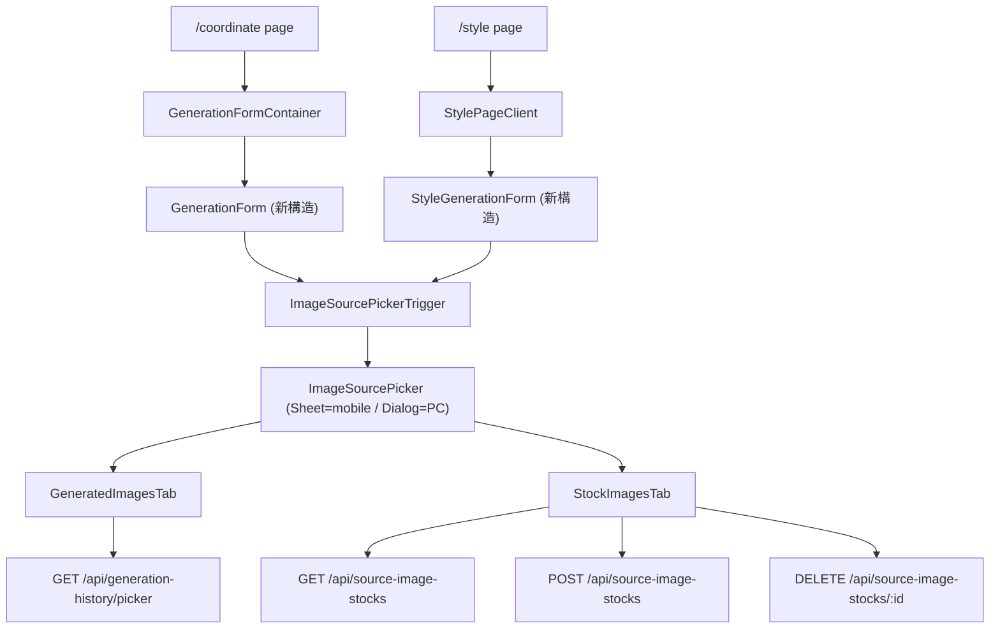
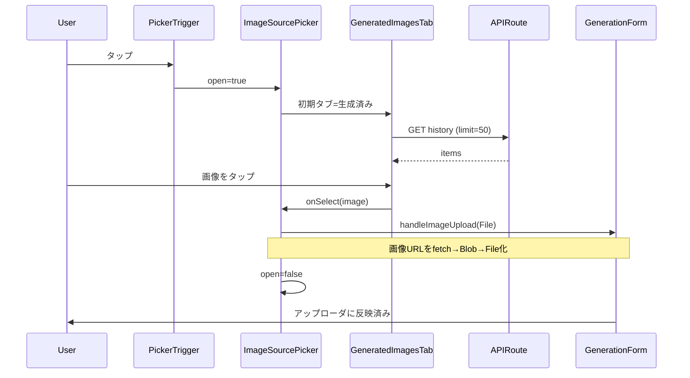
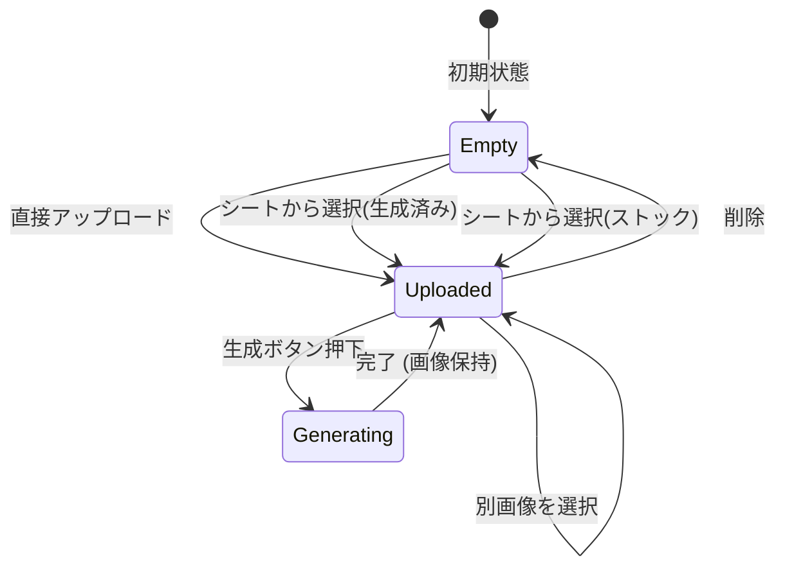
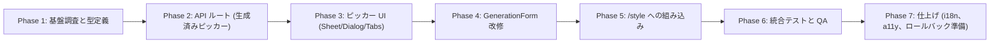

# /style と /coordinate の画像ソースピッカー統一実装計画

最終更新: 2026-05-24

## 目的

`/style` 画面に「ストック」機能を追加し、`/coordinate` 画面の既存「ライブラリ/ストック」タブ UI も同じパターンに統一する。  
両画面の画像入力エリアを以下に揃える:

- アップローダ常時表示
- アップローダ直下に二次動線ボタン `生成済み/ストックから選ぶ ▾`
- ボタンタップで、モバイル = ボトムシート / PC = 中央モーダル を開く
- シート/モーダル内に `[生成済み(default) | ストック]` のセグメントタブ
- 生成済みタブ: `generated_images` テーブルから style + coordinate 両方を最新順 50 件 + 無限スクロール
- ストックタブ: 既存 `source_image_stocks` 共有。グリッド先頭の `+追加` タイルから新規アップロード
- 画像選択 → アップローダに反映 → 既存の生成ボタンでそのまま実行

採用前に gpt-image-2 で UI モックを 3 案 (B案改修版 + ストックタブ拡張案) 生成・確認し、B案改修版を採用済み。

---

## コードベース調査結果

### 既存実装の参照点

| 観点 | 参照ファイル / 行 | 備考 |
|------|------------------|------|
| 「このイラストで生成」フロー | `features/generation/components/GeneratedImageList.tsx:201-240`、`features/generation/lib/apply-from-history-event.ts`、`features/generation/components/GenerationForm.tsx:504-553` | `CustomEvent COORDINATE_APPLY_FROM_HISTORY_EVENT` で URL を渡し、`fetch → Blob → File` 化して `handleImageUpload()` 経由でアップローダに反映 |
| sessionStorage hand-off | `apply-from-history-event.ts:25-26` (`persta-ai:coordinate-pending-source-image-url`) | `/style → /coordinate` ページ遷移時の橋渡しに使用 |
| ライブラリ/ストックタブ | `GenerationForm.tsx:670-714` | 撤廃対象。`imageSourceType: "upload" \| "stock"` の state も再設計 |
| 未読ドット | `useCoordinateStocksUnread`、`GenerationForm.tsx:32-33, 184-186, 257-272, 708` | シート/モーダルを開いた時に既読化する形に再配線 |
| 関連生成結果表示 | `GenerationForm.tsx:728-733, 813-820` (`GeneratedImagesFromSource`) | アップローダ直下、ストック選択時のみ表示 (現行ロジックを踏襲) |
| ソース画像ストック API | `app/api/source-image-stocks/route.ts`、`app/api/source-image-stocks/[id]/route.ts`、RPC `insert_source_image_stock` (`supabase/migrations/20260214150000_*.sql`) | `pg_advisory_xact_lock` で並行投入を直列化。plan 別の上限あり |
| Storage 物理削除 | `DELETE /api/source-image-stocks/[id]` で Storage と DB の両方を削除 (`20251207195458_*.sql`) | 削除時は一貫してこの API を使う |
| ストック上限取得 | `getStockImageLimit()` / `getCurrentStockImageCount()` (`features/generation/lib/database.ts:273-302`) | シート内ストックタブ上部の `保存中 N / M 枚` 表示に使う |
| `generated_images` スキーマ | `database.ts:9-52`、`getGeneratedImages(userId, limit, offset, generationType?)` (`database.ts:118-152`) | `generation_type ∈ {coordinate, specified_coordinate, full_body, chibi, one_tap_style, inspire}`。タブで複数 type 横断取得が必要 |
| キャッシュ | `CachedGeneratedImageGallery.tsx:62-64` (`"use cache"` + `cacheTag` + `cacheLife("minutes")`) | シート内の「生成済み」グリッドは別キャッシュタグで管理 |
| shadcn 部品 | `components/ui/sheet.tsx`、`dialog.tsx`、`tabs.tsx` | いずれも実装済み |
| 既存の Sheet 事例 | `features/posts/components/CommentComposerSheet.tsx` (shadcn Sheet 使用)、`features/posts/components/ReplyPanel.tsx` (`md:hidden` でモバイル限定) | レスポンシブ分岐は CSS パターン (md:hidden / hidden md:block) で十分 |
| i18n | `messages/ja.ts:1091` (`listApplyForNext: "このイラストで生成"`)、`messages/ja.ts:790-791, 1039-1057` (stock 系キー) | 新キーは `coordinate` / `style` セクションを横断する `imageSource` 名前空間に集約予定 |

### 影響する制約・落とし穴

1. **アトミック RPC のロック**  
   `insert_source_image_stock` は `pg_advisory_xact_lock(hashtext(user_id))` で同一ユーザー直列化済み。シート内アップロードでも同じ API を使えばよく、追加対策不要。
2. **生成済みタブの type 横断クエリ**  
   現状の `getGeneratedImages(..., generationType?)` は単一 type 指定。配列対応の新関数 (例: `getGeneratedImagesForPicker`) を追加する。
3. **CORS / Storage の picker 内表示**  
   生成済み画像も Supabase Storage 配信なので URL は同一オリジン/CDN 想定。`fetch → Blob` 化は既存 apply-from-history と同じ経路で問題なし。
4. **未読ドットの再配線**  
   現状はタブ切替を `markStockTabSeen` トリガにしているが、新設計ではシート/モーダルを「ストック」タブで開いた時に既読化する。`openStockTabRequestId` (GenerationStateContext) は撤去または再用途化。
5. **localStorage キー**  
   `IMAGE_SOURCE_TYPE_STORAGE_KEY` / `SELECTED_STOCK_ID_STORAGE_KEY` は移行に伴い意味が変わるため、新キーで明示的に書き換える (旧キーは読まずに無視 = 自然失効)。
6. **「生成済み」選択時の `source_image_stock_id` 渡し方**  
   生成済み画像は stock ではないので `sourceImageStockId` には載せない。クライアント側で fetch → File 化 → 通常の `uploadImage` (FormData) として送信する (既存 apply-from-history と完全に同じ経路を踏襲)。これにより API 変更は不要。
7. **Sheet ⇔ Dialog のレスポンシブ分岐**  
   `md:hidden` / `hidden md:block` で2つ並べる方式 (ReplyPanel パターン) を採用。`useMediaQuery` 系の追加 hook は不要。
8. **ペル画像 / inspire のソース画像**  
   今回スコープ外 (確認済み)。シート内には出さない。

---

## 概要図

### 全体構成 (画面 → コンポーネント)

### 画像選択シーケンス

### 画像ソース状態遷移

---

## EARS (要件定義)

### 共通

- **EV-001**: When the user taps the `生成済み/ストックから選ぶ` button, the system shall open the image source picker. (ユーザーがボタンをタップしたとき、画像ソースピッカーを開く)
- **EV-002**: While the picker is open on a viewport ≤ 768px, the system shall render it as a bottom sheet. (モバイル時はボトムシートとして描画する)
- **EV-003**: While the picker is open on a viewport > 768px, the system shall render it as a centered modal dialog. (PC 時は中央モーダルで描画する)
- **EV-004**: When the picker opens for the first time in a session, the system shall activate the `生成済み` tab by default. (初期タブは「生成済み」)
- **EV-005**: When the user selects an image inside the picker, the system shall close the picker and reflect the image to the uploader. (画像を選ぶとピッカーを閉じてアップローダに反映)
- **EV-006**: When the user selects an image, the system shall fetch the image URL, convert it to a File via Blob, and call `handleImageUpload(file)`. (URL → Blob → File 化してアップローダに渡す)

### 生成済みタブ

- **EV-010**: When the `生成済み` tab is activated, the system shall fetch the latest 50 `generated_images` items belonging to the current user where `generation_type` is in the set of style + coordinate types. (style と coordinate 両方の生成画像を最新順 50 件取得)
- **EV-011**: When the user scrolls near the bottom of the grid, the system shall fetch the next 50 items via offset pagination. (50件ずつ追加取得)
- **EV-012**: If the user has zero generated images, the system shall display a skeleton dummy grid plus a guidance text "まだ生成画像がありません". (空状態はダミースケルトン + 説明文)

### ストックタブ

- **EV-020**: When the `ストック` tab is activated, the system shall fetch up to 50 `source_image_stocks` items for the current user. (最新順 50 件取得)
- **EV-021**: When the user taps the `+追加` tile at the head of the grid, the system shall open the file chooser and POST `/api/source-image-stocks` on selection. (先頭タイルから新規追加)
- **EV-022**: While the stock count has reached the plan limit, the system shall disable the `+追加` tile and display `保存中 N / M 枚（上限）`. (上限到達時は追加不可)
- **EV-023**: When the user long-presses (mobile) or hovers (PC) a stock thumbnail, the system shall reveal a delete (×) badge whose tap calls `DELETE /api/source-image-stocks/:id` after confirmation. (削除動線)
- **EV-024**: When a stock image is selected from the picker, the system shall pass `sourceImageStockId` to the generation submit payload. (ストック画像選択時は既存と同じ stock 経路を使う)
- **EV-025**: If the user has zero stock images, the system shall display a skeleton dummy grid plus a guidance text "ストック画像を追加すると、ここに表示されます". (空状態)

### 統合

- **EV-030**: When the picker is opened with the `ストック` tab activated, the system shall mark the stock-unread badge as seen. (シートのストックタブを表示したら未読ドットを既読化)
- **EV-031**: While a generation is in progress (`isGenerating === true`), the system shall disable the picker trigger button. (生成中はピッカーを開かせない)
- **EV-032**: When the user has selected a stock image and a generation completes, the system shall keep showing `GeneratedImagesFromSource` directly below the uploader. (現行の関連結果表示挙動を維持)
- **EV-033**: If fetching either tab's data fails, the system shall display a retry message and a "再読み込み" button. (取得失敗時のリトライ)

### 撤廃

- **EV-040**: When the new image source picker is deployed, the system shall remove the existing `ライブラリ / ストック` toggle buttons and the associated `imageSourceType` branching from `GenerationForm.tsx`. (旧トグルを削除)

---

## ADR (設計判断記録)

### ADR-001: ピッカーの表示形態をモバイル=Sheet / PC=Dialog で分岐

- **Context**: モバイル中心の UX だが PC でも自然に使いたい。ボトムシートを PC 全幅で出すと視線移動が大きい。
- **Decision**: shadcn `Sheet` (side=bottom) と `Dialog` (中央モーダル) を両方マウントし、Tailwind の `md:hidden` / `hidden md:flex` で出し分ける。両方とも同じ `<ImageSourcePickerContent>` をスロットインする。
- **Reason**: 既存 `ReplyPanel` で同様パターンが確立されており、`useMediaQuery` を新設しなくても SSR フレンドリに分岐できる。
- **Consequence**: 表示ツリーが二重になるため、ピッカー内で重い処理 (画像 fetch) は片側でしか動かないよう注意。`open` 状態は一元管理。

### ADR-002: 「生成済み」選択時に sourceImageStockId は使わず File 化して送る

- **Context**: 生成済み画像をストックとして保存するとプラン上限を消費し、UX が悪化する。
- **Decision**: 既存「このイラストで生成」と完全に同じ経路 (`fetch → blob → File`) を使い、生成 API には通常のアップロード扱いで送る。`source_image_stocks` には保存しない。
- **Reason**: API/DB の変更が不要、ストック枠を消費しない、既存実装の安定パターンを再利用できる。
- **Consequence**: 大きい画像で fetch がやや遅い可能性があるが、apply-from-history の `preloadImage(5s timeout)` 同等で十分。

### ADR-003: 旧「ライブラリ/ストック」トグルは一気に置き換える (feature flag なし)

- **Context**: 段階的に切り替える方法もあるが、両 UI を並行維持するとコード負債が膨らむ。
- **Decision**: 一回の PR で旧 UI を完全に置き換える。問題発生時は `git revert` を一次対応とする。
- **Reason**: コード量最小、フェーズ単位コミットで revert 容易、UI 変更の認知コストも一括で済む。
- **Consequence**: リリース直後の不具合は影響が大きいため、PR レビュー + 手動 QA を入念に行う。Vercel preview deploy での確認を必須とする。

### ADR-004: 生成済みタブの取得は新 API ルートに切り出す

- **Context**: 既存 `getGeneratedImages(userId, ..., generationType?)` は単一 type 指定で、複数 type 横断には対応していない。クライアント直 fetch だと RLS で守られていても抽象漏れになる。
- **Decision**: `GET /api/generation-history/picker?limit=50&offset=0` を新設し、内部で `generation_type IN (...)` を実行する。クライアントは fetch するだけ。
- **Reason**: クエリの単一化、キャッシュタグ管理の一元化、将来「自分の inspire 結果も入れる」等の拡張余地。
- **Consequence**: 新ルート分のテスト/ドキュメントが追加される。

---

## 実装計画 (フェーズ + TODO)

### フェーズ間の依存関係

### Phase 1: 基盤調査と型定義

目的: 共有型と新 API のシグネチャを確定させる。  
ビルド確認: `npm run typecheck` 通過。

- [ ] `features/generation/lib/database.ts` に `getGeneratedImagesForPicker(userId, limit, offset)` を追加 (style + coordinate 両 type を IN 句で取得)
- [ ] `features/generation/types.ts` に `PickerSourceItem` 型を追加 (`{ id, kind: "generated" | "stock", imageUrl, storagePath, createdAt, generationType?, sourceImageStockId? }`)
- [ ] `messages/ja.ts` `messages/en.ts` に `imageSourcePicker` 名前空間 (ラベル一式) を追加するキー一覧を確定 (実装は Phase 3)
- [ ] `getStockImageLimit()` の戻り値型と現行呼び出し箇所を再確認 (UI への上限表示で再利用)

### Phase 2: API ルート (生成済みピッカー)

目的: 新エンドポイント追加と既存 API 確認。  
ビルド確認: `npm run lint` `npm run typecheck` `tests/integration/api/` 関連のテストグリーン。

- [ ] `app/api/generation-history/picker/route.ts` 新規作成
  - GET: `limit`, `offset` クエリ。`getUser()` で認証必須。`generation_type IN (...)` で style + coordinate 両方 (`coordinate`, `specified_coordinate`, `full_body`, `chibi`, `one_tap_style`, `inspire` のうち UX 上「ユーザーが作った」と見なすもの) を最新順返却
  - レスポンス: `{ items: PickerSourceItem[], nextOffset: number | null }`
- [ ] 既存 `/api/source-image-stocks` 系は変更不要であることを確認 (既存 POST/DELETE をそのまま流用)
- [ ] `tests/integration/api/generation-history-picker-route.test.ts` 新規 (正常系 / 未認証 / 0件 / 50件越え)

### Phase 3: ピッカー UI (Sheet / Dialog / Tabs)

目的: 表示と選択ロジックを完成させる (まだフォームとは繋がない)。  
ビルド確認: Storybook はないので、`/coordinate` `/style` 内の一時 toggle で目視確認。

- [ ] `features/generation/components/ImageSourcePicker/` 新規ディレクトリ
  - `ImageSourcePicker.tsx` (Sheet と Dialog を両方マウント、`md:hidden` / `hidden md:flex` で分岐)
  - `ImageSourcePickerContent.tsx` (タブ + グリッドの共通中身)
  - `GeneratedImagesTab.tsx` (50 件 + 無限スクロール、空状態スケルトン)
  - `StockImagesTab.tsx` (グリッド先頭 `+追加` タイル、上限表示、削除ボタン)
  - `PickerImageTile.tsx` (共通サムネタイル)
  - `PickerSkeleton.tsx` (空 / ローディング用スケルトン)
- [ ] `useImageSourcePicker` カスタム hook (open 状態 / 選択 callback / 既読化トリガ) — `features/generation/hooks/useImageSourcePicker.ts`
- [ ] 画像 fetch → File 化のユーティリティを `features/generation/lib/source-image-to-file.ts` に切り出し (apply-from-history-event.ts の同等ロジックを再利用 / 共通化)
- [ ] i18n キー追加 (`messages/ja.ts`, `messages/en.ts` の `imageSourcePicker` セクション)

### Phase 4: GenerationForm 改修 (/coordinate 側)

目的: 旧トグル UI を撤去し、新ピッカーを組み込む。  
ビルド確認: `/coordinate` で従来のアップロードとストック選択経由の生成が両方動く。`npm run build -- --webpack` 通過。

- [ ] `GenerationForm.tsx` から `imageSourceType` の二者択一分岐と関連 state を削除
- [ ] `Button` 2 つ (ライブラリ/ストック) を削除し、`ImageUploader` を常時表示に変更
- [ ] `ImageUploader` 直下に `ImageSourcePickerTrigger` (`生成済み/ストックから選ぶ ▾`) を配置
- [ ] 「ストック画像から生成された結果一覧」 `GeneratedImagesFromSource` の表示条件を `selectedStockId !== null` のみで維持 (アップローダの直下に表示)
- [ ] `useCoordinateStocksUnread` の `markSeen` 呼び出しを、ピッカーが「ストック」タブで開かれた瞬間に発火するよう再配線
- [ ] 永続化 localStorage キーの整理: 旧 `IMAGE_SOURCE_TYPE_STORAGE_KEY` `SELECTED_STOCK_ID_STORAGE_KEY` は読み無視 + 書き込みなし。新たに「最後に選んだ画像 (生成済み or ストック) のメタ」を保存するか判断 — 当面は保存しない方針 (シンプル優先)
- [ ] `GenerationFormContainer.tsx` の hand-off 部分も併せて確認

### Phase 5: /style への組み込み

目的: `/style` 画面にも同じピッカーを組み込み、「このイラストで生成」と整合させる。  
ビルド確認: `/style` で画像入力 → スタイル生成が動く。

- [ ] `StylePageClient.tsx` で既存の `uploadedImage` 周辺 UI を再構成 (アップローダ + ピッカートリガをコンポーネント化して両画面で共有)
- [ ] 共通化候補: `features/generation/components/ImageInputArea.tsx` を新設し、`/coordinate` と `/style` の両方から使う (props で「ストック削除可否」「上限取得関数」を差し替えられる設計)
- [ ] 既存 `apply-from-history-event` 経由の「このイラストで生成 → /style」遷移挙動が壊れていないことを確認
- [ ] `/style` 側で sessionStorage hand-off が引き続き機能することを確認 (apply-from-history-event.ts は変更しない)

### Phase 6: 統合テストと QA

目的: 主要シナリオの回帰検証。  
ビルド確認: 全テストグリーン、`npm run build -- --webpack` 通過。

- [ ] Playwright E2E
  - `/coordinate`: ピッカーを開く → 生成済みタブから選択 → 生成 → 結果表示
  - `/coordinate`: ピッカーを開く → ストックタブから選択 → 生成 → 結果表示
  - `/coordinate`: ピッカー内ストックタブで新規追加 → グリッドに反映
  - `/coordinate`: ピッカー内ストックタブで削除 → グリッドから消える
  - `/style`: 同様の3シナリオ
  - レスポンシブ: 幅 375px (モバイル) で Sheet、幅 1280px (PC) で Dialog
- [ ] Jest 統合テスト (新 API ルート)
- [ ] 既存テストへの影響確認 (`features/generation/` 配下、`tests/integration/` 配下)
- [ ] 手動 QA: 未読ドットが「シートのストックタブを表示」で既読化されるか
- [ ] 手動 QA: 生成中はトリガボタンが disabled になるか

### Phase 7: 仕上げ (i18n、a11y、ロールバック準備)

目的: リリース品質まで持ち上げ。  
ビルド確認: 全工程グリーン。

- [ ] i18n: `ja` / `en` の `imageSourcePicker` キー完全同期 (PR レビュー前に diff チェック)
- [ ] a11y: Sheet/Dialog のキーボード操作 (Esc 閉じ、Tab フォーカストラップ、`aria-label`)、タブの `role=tablist`、空状態の `aria-live`
- [ ] PR 説明に「旧トグル撤廃」の影響範囲を明記、`/coordinate` `/style` の Before/After スクショ添付
- [ ] ロールバック手順 README を PR に同梱 (本ファイル末尾参照)

---

## 修正対象ファイル一覧

| ファイル | 操作 | 変更内容 |
|---------|------|---------|
| `features/generation/components/ImageSourcePicker/ImageSourcePicker.tsx` | 新規 | Sheet + Dialog のレスポンシブ分岐ラッパ |
| `features/generation/components/ImageSourcePicker/ImageSourcePickerContent.tsx` | 新規 | タブ + グリッドの共通中身 |
| `features/generation/components/ImageSourcePicker/GeneratedImagesTab.tsx` | 新規 | 生成済み 50 件 + 無限スクロール + 空状態 |
| `features/generation/components/ImageSourcePicker/StockImagesTab.tsx` | 新規 | ストック + `+追加`タイル + 削除 |
| `features/generation/components/ImageSourcePicker/PickerImageTile.tsx` | 新規 | サムネ共通タイル |
| `features/generation/components/ImageSourcePicker/PickerSkeleton.tsx` | 新規 | 空 / ローディング用スケルトン |
| `features/generation/components/ImageSourcePickerTrigger.tsx` | 新規 | `生成済み/ストックから選ぶ ▾` ボタン |
| `features/generation/components/ImageInputArea.tsx` | 新規 | アップローダ + トリガを束ねる共通コンポーネント |
| `features/generation/hooks/useImageSourcePicker.ts` | 新規 | open 状態 / 選択 callback / 既読化 |
| `features/generation/lib/source-image-to-file.ts` | 新規 | 画像 URL → Blob → File ユーティリティ (apply-from-history と共通化) |
| `features/generation/lib/database.ts` | 修正 | `getGeneratedImagesForPicker()` 追加 |
| `features/generation/types.ts` | 修正 | `PickerSourceItem` 型追加 |
| `features/generation/components/GenerationForm.tsx` | 修正 | 旧トグル削除、`ImageInputArea` 組み込み、未読ドット配線 |
| `features/generation/components/GenerationFormContainer.tsx` | 修正 | hand-off 周辺の整合性確認・微修正 |
| `features/style/components/StylePageClient.tsx` | 修正 | `ImageInputArea` 組み込み |
| `app/api/generation-history/picker/route.ts` | 新規 | GET 一覧取得 (style + coordinate 横断) |
| `tests/integration/api/generation-history-picker-route.test.ts` | 新規 | 正常系 / 未認証 / 空 / pagination |
| `tests/e2e/image-source-picker.spec.ts` | 新規 | Playwright E2E (3 シナリオ × 2 画面 × 2 viewport) |
| `messages/ja.ts` | 修正 | `imageSourcePicker` 名前空間追加 |
| `messages/en.ts` | 修正 | `imageSourcePicker` 名前空間追加 (ja と同期) |
| `features/generation/lib/apply-from-history-event.ts` | 修正 (任意) | `source-image-to-file.ts` を内部で利用するよう統合 |
| `features/generation/components/StockImageListClient.tsx` 等 旧 stock 専用 UI | 削除候補 | 新 `StockImagesTab` に責務移管されたら未参照になるものを削除 |

> 削除候補は Phase 4 完了後に grep で参照ゼロを確認したうえで削除する。

---

## 品質・テスト観点

### 品質チェックリスト

- [ ] **エラーハンドリング**: ピッカー内 fetch 失敗時に「再読み込み」ボタン表示。生成済み画像の Blob fetch 失敗時はアップローダに反映せずトースト
- [ ] **権限制御**: `/api/generation-history/picker` は `getUser()` 必須。`/api/source-image-stocks` の既存ガードは流用
- [ ] **データ整合性**: ストック追加時の RPC `insert_source_image_stock` を変更しない (上限ロジックを温存)
- [ ] **セキュリティ**: 生成済み画像 URL がクライアントに渡る経路は既存と同じ Supabase Storage URL。新規漏洩経路なし
- [ ] **i18n**: `ja` / `en` の `imageSourcePicker.*` キー完全一致
- [ ] **a11y**: Sheet/Dialog の ARIA、フォーカストラップ、Escape クローズ、`role=tablist`、未読ドットに `aria-label`

### テスト観点

| カテゴリ | テスト内容 |
|----------|-----------|
| 正常系 | ピッカー開閉、両タブ切替、画像選択 → アップローダ反映、生成成功 (両画面) |
| 異常系 | API 失敗 → リトライ UI、Blob fetch 失敗 → トースト、ストック上限到達 → `+追加` 無効化 |
| 権限テスト | 未認証で `/api/generation-history/picker` GET → 401。他ユーザーの stock 削除 → 403/404 |
| レスポンシブ | 375px / 768px / 1280px で Sheet ⇔ Dialog 切替、グリッド列数の適切性 |
| 永続化 | 旧 localStorage キー (`persta-ai:last-image-source-type` 等) が残っていてもエラーなく動作する |

### テスト実装手順

実装完了後、`/test-flow` に沿って:

1. `/test-flow ImageSourcePicker` — 依存関係とスペックの状態を確認
2. `/spec-extract ImageSourcePicker` — EARS スペックを抽出
3. `/spec-write ImageSourcePicker` — スペックを対話的に精査
4. `/test-generate ImageSourcePicker` — テストコード生成
5. `/test-reviewing ImageSourcePicker` — テストレビュー
6. `/spec-verify ImageSourcePicker` — カバレッジ確認

---

## ロールバック方針

- **Git**: フェーズごとに分割コミット (Phase 1〜7)。各フェーズで `npm run build -- --webpack` をパスさせる。問題発生時は該当フェーズ以降をまとめて `git revert`
- **DB**: 本計画はマイグレーション不要。`source_image_stocks` も `generated_images` も既存スキーマのまま
- **API**: 新規追加 `/api/generation-history/picker` は削除しても既存機能は動作 (旧 UI を併用するわけではないので、ロールバック = 旧 UI を git revert で復元 + 新 API を残置/削除どちらでも OK)
- **外部サービス**: 追加なし
- **クライアント状態の互換性**: 旧 localStorage キーは残置してもエラーにならないよう「読み無視」設計。新キーを追加する場合は別名で

---

## 使用スキル

| スキル | 用途 | フェーズ |
|--------|------|----------|
| `/project-database-context` | `generated_images` / `source_image_stocks` の RLS / インデックス確認 | Phase 1, 2 |
| `/git-create-branch` | 作業ブランチ作成 | Phase 1 開始時 |
| `/test-flow` `/spec-extract` `/spec-write` `/test-generate` `/test-reviewing` `/spec-verify` | テスト段階 | Phase 6 |
| `/code-review` | フェーズ単位のレビュー | 各 Phase 完了時 |
| `/git-create-pr` | PR 作成 | Phase 7 完了時 |
| `/verify` | 実機での E2E 確認 | Phase 6 |

---

## 前提 / 未決事項

- 生成済みタブに含める `generation_type` の正確な集合: 現案は `coordinate / specified_coordinate / full_body / chibi / one_tap_style / inspire` の 6 種。Phase 1 で要再確認 (admin 専用やテスト用 type が含まれていないか)
- 「最後に選んだ画像」をピッカー再オープン時に highlight するかどうかは未定 (UX 改善余地、本計画ではスコープ外)
- 未読ドット相当のインジケータをトリガボタン側にも出すかは未定 (ストックに新着があるとき)。本計画では従来通り「ピッカー内ストックタブ」側の表現のみ
- ペル画像 (`PelImage`) や inspire 専用ソース画像との統合: スコープ外 (確認済み)
