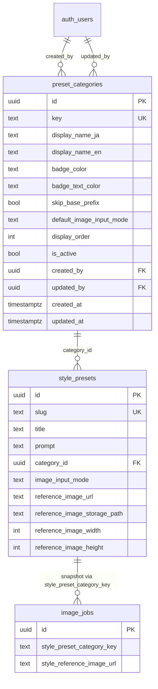
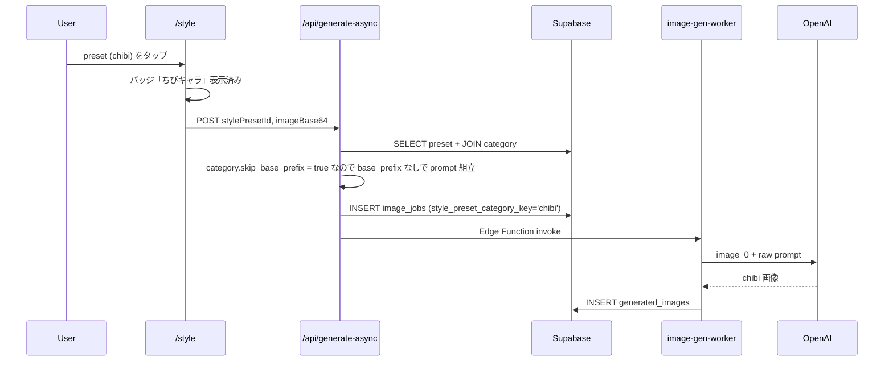
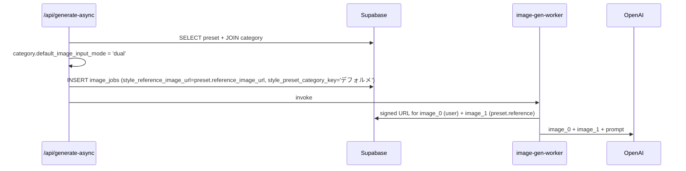
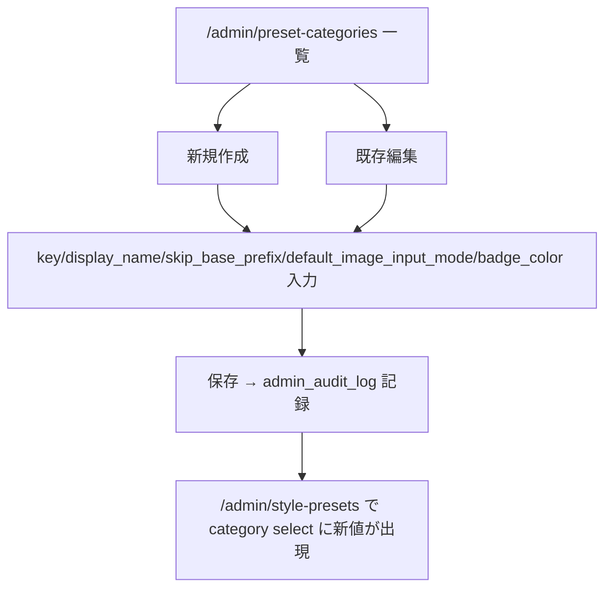
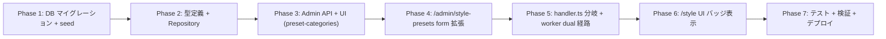

# Style プリセットの raw モード + カテゴリ管理機能

## 背景

`/style` 画面で使われるプリセット (`style_presets`) は、現在「コーディネート (衣装の差し替え)」用途を前提とした共通 prefix (`style.base_prefix`、PR #290 で admin から編集可能化) を必ず先頭に付与する。この prefix は「人物の identity / フレーム / 既存可視部位を厳密に維持しつつ衣装だけを差し替える」ことを強く要求するため、**ちびキャラ化やデフォルメ化のような「フォルム自体を変える」生成には逆効果** になる。

本計画は、admin が動的に追加できる **プリセットカテゴリ** という概念を導入し、カテゴリ単位で:
1. 共通 prefix を付与するかどうか (`skip_base_prefix`)
2. 入力画像モード (`single` / `dual`)
3. UI 上のバッジ表示色 / 表示名

を制御できるようにする。最初のユースケースは「マイキャラからちびキャラ生成」(カテゴリ `chibi`、raw モード、single)。将来はデフォルメ・イラスト化・線画化など raw 系を増やしていける基盤とする。

## 目的

- admin が画面上から **プリセットカテゴリを動的に CRUD** できる仕組みを作る
- 既存 `style_presets` をカテゴリに紐付けて raw モード / dual モードを切り替え可能にする
- ユーザー側 `/style` 画面ではカテゴリバッジで区別を見せつつ、UI フローは現状維持 (= preset を選んで生成するだけ)
- 過去ジョブのアナリティクス整合性を `image_jobs.style_preset_category_key` のスナップショット保存で担保する
- 既存の coordinate 用 preset の挙動は **一切変えない** (seed で `coordinate` カテゴリを backfill)

## やらないこと

- 新規 admin ページを `/admin/style-presets` とは別に作る (= 既存拡張のみ)
- 新規ユーザー向けページ (`/chibi` 等) を作る (= `/style` に混在)
- `image_jobs.generation_type` の CHECK 制約を緩める (= 既存 enum 維持)
- 課金 (Percoin) の category 別倍率 (= model 単位のみ、既存通り)
- バッジ表示以外のフィルタ UI / カテゴリタブ
- 既存プリセットの挙動変更 (= migration で seed 'coordinate' を backfill して 100% 後方互換)
- 通知 / Realtime / moderation の category 連携 (将来必要なら別計画)
- preset_categories の i18n 翻訳の自動化 (= admin が ja/en を手動入力)

---

## コードベース調査結果 (Phase B)

### B-1: Supabase 接続確認
- リンク済みプロジェクト: `hnrccaxrvhtbuihfvitc` (ai_coordinate, Tokyo region)
- `supabase db push` / `supabase functions deploy` 利用可
- 破壊的操作 (DROP / migration rollback) はユーザー承認必須

### B-2: 既存実装

#### `style_presets` テーブル (`supabase/migrations/20260322100000_add_style_presets.sql`)
カラム: `id, slug (UNIQUE), title, prompt, thumbnail_image_url, thumbnail_storage_path, thumbnail_width/height, sort_order, status ('draft'|'published'), created_by/updated_by, created_at/updated_at`。RLS は SELECT `status = 'published'`、admin の INSERT/UPDATE は RPC 経由。トリガー `update_updated_at_column()` で自動更新。

#### 既存 admin (`/admin/style-presets/`)
- `StylePresetForm.tsx` (305行): title / stylingPrompt / backgroundPrompt / sortOrder / status / file (thumbnail) の編集
- `StylePresetListClient.tsx`: 一覧
- API: `POST /api/admin/style-presets`, `PATCH/DELETE /api/admin/style-presets/[id]`, `POST /api/admin/style-presets/reorder`

#### `/style` 画面
- `app/(app)/style/page.tsx`: `getPublishedStylePresets()` → `StylePageClient` に渡す
- `StylePageClient.tsx`: `presets: readonly StylePresetPublicSummary[]` を表示
- `StylePresetPreviewCard.tsx`, `OneTapStyleDetailCard.tsx`: 個別カード描画

#### プロンプト生成 (`shared/generation/style-prompts.ts`)
- `buildStyleGenerationPrompt(params)` (53-76行): `resolveTemplate(templates, "style.base_prefix")` + promptSuffix + backgroundInstruction + styling/background direction
- registry key `style.base_prefix` の defaultContent は PR #290 で編集可能 (CRITICAL INSTRUCTION 3 ステップ)

#### `image_jobs` テーブル
- `generation_type` の CHECK 制約は: `coordinate / specified_coordinate / full_body / chibi / one_tap_style / inspire` の固定 enum
  - ※ `chibi` は既にレガシー値として CHECK に存在するが、本計画では使わない (= `one_tap_style` を継続使用)
- inspire で導入された関連カラム: `style_template_id`, `style_reference_image_url`, `override_*` 4 boolean
- 整合性 CHECK: `(generation_type = 'inspire') = (style_template_id IS NOT NULL)`

#### `/api/generate-async` (`handler.ts`)
- `stylePresetId` を受け取り、生成時点で `prompt_text` に serialized 済みの形で `image_jobs` に INSERT (= preset id は jobs に保存していない)
- `style_reference_image_url` は inspire 専用に使われている

#### Edge Function (`image-gen-worker/index.ts`)
- 1634-1642 行: `job.style_reference_image_url` (storage_path) を署名 URL 化して image_1 として OpenAI に渡す経路
- 1537-1735 行: multi-input batch 経路で image_0 (ユーザーキャラ) / image_1 (style template) を構築

#### Storage
- `generated-images` (public): 既存生成画像 + temp 一時アップロード
- `style-templates` (private): inspire の参考画像
- preset reference 用は `generated-images/presets/{presetId}/reference.webp` で統一推奨 (RLS 既存)

#### `/admin/generation-prompts` (PR #290) — 参考にする admin パターン
- list / [key] 詳細 / API route / audit log / category 別グループ表示

#### テスト既存
- `tests/unit/lib/style-preset-repository.test.ts`
- `tests/integration/api/admin-style-presets-routes.test.ts`
- `tests/integration/app/style-generate-async-route.test.ts` 他 5 件
- `tests/characterization/api/generate-async-route.char.test.ts`

### B-3: 影響範囲

| 領域 | 既存 | 拡張/新規 |
|---|---|---|
| `preset_categories` テーブル | なし | **新規** |
| `style_presets` テーブル | 既存 | `category_id`, `image_input_mode`, `reference_image_url`, `reference_image_storage_path`, `reference_image_width/height` を追加 |
| `image_jobs` テーブル | 既存 | `style_preset_category_key` (text, nullable) スナップショット追加 |
| `/admin/style-presets` form | 既存 | category select + image_input_mode + reference image upload |
| `/admin/preset-categories` | なし | **新規** (list + edit + audit log) |
| `/style` UI | 既存 | preset card に category バッジ追加 |
| `handler.ts` | 既存 | preset 解決時に category 取得 → skip_base_prefix と image_input_mode 反映 |
| `buildStyleGenerationPrompt` | 既存 | 第二引数に `{ skipBasePrefix?: boolean }` を追加 |
| `image-gen-worker` | 既存 | dual モード時の image_1 取得経路を inspire と共通化 |
| `messages/ja.ts` / `en.ts` | 既存 | category 関連ラベル + バッジ |
| テスト | 既存 8 件 | 拡張 + 新規 (preset_categories CRUD / handler 分岐 / worker dual) |

### B-4: 参照ドキュメント
- `docs/development/project-conventions.ja.md`
- `docs/architecture/data.ja.md` (RPC 方針 / 単純 CRUD vs 原子的処理)
- `.cursor/rules/database-design.mdc`
- `docs/planning/admin-generation-prompt-editor-implementation-plan.md` (PR #290 計画書、参照パターン)

---

## 1. 概要図

### 1.1 ER 図 (拡張部分)



### 1.2 ユーザー生成フロー (raw モード / single)



### 1.3 dual モードフロー



### 1.4 admin カテゴリ管理フロー



---

## 2. EARS (要件定義)

| ID | 要件 |
|---|---|
| REQ-1 | When admin が `/admin/preset-categories` で新規カテゴリを作成する時, the system shall key (slug) / 表示名 (ja/en) / バッジ色 / `skip_base_prefix` / `default_image_input_mode` を保存し audit_log に記録する。<br>**EN**: When an admin creates a new preset category, the system shall persist its key, display names, badge colors, `skip_base_prefix`, `default_image_input_mode`, and record an audit log entry. |
| REQ-2 | When admin が `/admin/style-presets` で preset を作成・編集する時, the system shall preset_categories から有効な category 一覧を select に表示し、選択を必須化する。<br>**EN**: When editing a style preset, the system shall present active categories as a required select. |
| REQ-3 | When preset の `image_input_mode = 'dual'` の場合, the system shall admin に参考画像 (image_1) のアップロードを必須化し、`generated-images/presets/{presetId}/reference.webp` に保存する。<br>**EN**: When the input mode is 'dual', the system shall require the admin to upload a reference image and store it at `generated-images/presets/{presetId}/reference.webp`. |
| REQ-4 | When ユーザーが `/style` でプリセットを選んで生成する時, the system shall preset → category を join 取得し、`category.skip_base_prefix = true` なら `style.base_prefix` を付与せず raw プロンプトを送る。<br>**EN**: When generating, the system shall skip `style.base_prefix` if the joined `category.skip_base_prefix` is true. |
| REQ-5 | When 生成ジョブが作成される時, the system shall `image_jobs.style_preset_category_key` に生成時点の category.key をスナップショット保存する。<br>**EN**: When creating a job, the system shall snapshot the category key into `image_jobs.style_preset_category_key`. |
| REQ-6 | When dual モード preset の生成時, the system shall preset.reference_image_url を `image_jobs.style_reference_image_url` に保存し、worker が image_1 として OpenAI / Gemini に渡す。<br>**EN**: For dual-mode generation, the system shall propagate the reference image to `style_reference_image_url` and the worker shall pass it as image_1. |
| REQ-7 | If admin が category を `is_active = false` にした場合, then the system shall その category を新規 preset 編集の select から除外するが、既存 preset の挙動と過去ジョブの集計は維持する。<br>**EN**: If a category is deactivated, the system shall hide it from new preset editing but preserve existing preset behavior and historical analytics. |
| REQ-8 | While `/style` ページで preset を一覧表示する時, the system shall preset_categories.badge_color / badge_text_color / display_name (現在 locale) に基づくバッジを各 preset card に表示する。<br>**EN**: While listing presets, the system shall render badges using category fields in the current locale. |
| REQ-9 | Where 既存 preset (= migration 前から存在) の場合, the system shall seed された `coordinate` カテゴリに backfill 紐付けし、`skip_base_prefix = false` / `image_input_mode = 'single'` で現状挙動を 100% 維持する。<br>**EN**: Existing presets shall be backfilled to a seeded `coordinate` category with `skip_base_prefix = false` and `image_input_mode = 'single'`. |
| REQ-10 | If category の skip_base_prefix と preset の image_input_mode が DB 整合性 (CHECK 制約) に違反する INSERT/UPDATE がある場合, then the system shall RAISE EXCEPTION で拒否する。<br>**EN**: The DB shall reject inserts/updates that violate consistency constraints. |
| REQ-11 | When admin が category / preset を更新した時, the system shall `cacheTag` を `revalidateTag` でフラッシュし、ユーザー側 `/style` 一覧に反映する。<br>**EN**: On admin updates, the system shall revalidate cache tags so the user-facing list reflects changes. |
| REQ-12 | Where preset の image_input_mode = 'dual' で reference 画像が削除済み (storage_path に object 無し) の場合, the system shall handler 段階で 500 を返さず、worker 側で「reference download failed」として通常の失敗フローに乗せる (既存 inspire と同等)。<br>**EN**: If the reference object is missing, the worker shall handle it as a normal failure path, same as inspire. |

---

## 3. ADR (設計判断記録)

### ADR-001: image_jobs.generation_type は固定 enum 維持

- **Context**: 「運営が type を動的追加」要件は category テーブルで実現可能。`image_jobs.generation_type` の CHECK 制約を緩めると型安全と既存集計に影響。
- **Decision**: `image_jobs.generation_type` は既存 enum (`coordinate/style/inspire/one_tap_style/...`) を維持。新カテゴリは preset_categories.key で表現し、`image_jobs.style_preset_category_key` に snapshot 保存。
- **Reason**: (a) PR #275 等で築いた CHECK 制約を崩さない (b) generation_type は handler のロジック分岐 (inspire 専用バリデーション等) と密接で、固定 enum の方が安全 (c) admin が type を追加するときに schema migration 不要。
- **Consequence**: 過去ジョブ集計は `style_preset_category_key` で取れるため要件を満たす。「カテゴリ別の生成数」は SQL 1 本で取得可能。

### ADR-002: preset_categories は独立テーブル (= preset への直接 enum 化はしない)

- **Context**: preset に category を「テキスト直接」で持たせる選択もあった (B 案)。
- **Decision**: 正規化された `preset_categories` テーブルを立て、`style_presets.category_id` で FK 参照。
- **Reason**: (a) badge_color / display_name (ja/en) / skip_base_prefix / display_order などの付随情報をカテゴリ側に集約できる (b) admin で削除 (`is_active = false`) しても過去 preset の参照が壊れない (c) i18n の更新が一箇所で済む。
- **Consequence**: JOIN が増えるが、`/style` 一覧は `cacheTag` でキャッシュされるため実害なし。

### ADR-003: skip_base_prefix は category 単位、image_input_mode は preset 単位

- **Context**: 当初 image_input_mode も category 単位とする案があったが、ヒアリングで「preset ごとに固定」と決定。
- **Decision**: `skip_base_prefix` は category 共通 (= カテゴリの本質的挙動を決める)。`image_input_mode` は preset 単位で持ち、admin がカテゴリの default 値を起点に preset ごと上書き可能 (実装上は preset.image_input_mode は NOT NULL、`category.default_image_input_mode` を form の初期値として参照)。
- **Reason**: (a) skip_base_prefix はカテゴリの「アイデンティティ」(raw か coordinate か) であり preset で変えない方が一貫 (b) image_input_mode は preset の中身 (= プロンプト内容) で決まる (例: 同じ chibi でも 1 枚で生成する preset と参考画像が必要な preset があり得る)。
- **Consequence**: 整合性は CHECK 制約で担保 (`image_input_mode = 'dual'` なら `reference_image_storage_path NOT NULL`)。

### ADR-004: 共通 prefix の完全除去 (raw 100%)

- **Context**: ヒアリングで「最低限の identity 保持ルールも残さない」と確定。
- **Decision**: `skip_base_prefix = true` のとき `style.base_prefix` を 100% 付与しない。admin が登録した prompt そのものを送る。
- **Reason**: (a) ちびキャラはフォルム自体を変えるため identity 保持文言が逆効果 (b) raw の品質保証は admin プロンプト責任に集中させる (c) registry に 'raw_base_prefix' のような中途半端な共通文言を増やすと運用が複雑化。
- **Consequence**: admin プロンプト品質への依存が大きくなる。レビューと preview 機能 (将来) で担保。今回は admin の責任で運用開始。

### ADR-005: dual モードの image_1 は preset 固定 (= admin がアップロード、ユーザーは選択不可)

- **Context**: ヒアリングで「preset レコードに 1 枚固定」を選択。
- **Decision**: dual モード時の image_1 (参考画像) は preset レコードに紐付け、admin が `/admin/style-presets` で 1 枚アップロード。ユーザー側は preset を選ぶだけで自動付与。
- **Reason**: (a) UX が「ボタン 1 つ」で完結 (b) 参考画像のキュレーション責任を admin に集中 (= 品質安定) (c) inspire 機能の image_1 経路をそのまま再利用できる。
- **Consequence**: ユーザー側でアレンジしたいニーズには応えられないが、それは将来 dual モードの UI を拡張するときに検討。

### ADR-006: image_jobs.style_preset_category_key は **key 文字列** をスナップショット (= category_id ではなく)

- **Context**: 過去ジョブの分析と category 削除耐性を両立する保存形式の選択。
- **Decision**: `image_jobs.style_preset_category_key` (text, nullable) に category.key をコピー保存。category_id は持たない。
- **Reason**: (a) key は admin が決める安定識別子 (例: 'chibi') で集計時に人間が読みやすい (b) category 削除 / 再作成があっても key 一致で履歴が連続する (c) 過去のジョブを SQL で `GROUP BY style_preset_category_key` 一発で集計可能。
- **Consequence**: key 変更 (rename) を許す場合、過去ジョブが古い key を持つ。これは「key は不変原則」を運用ルールにすることで吸収する (= 必要なら新規 category を作って display_name で見せ方を変える)。

### ADR-007: 既存 preset は seed 'coordinate' で backfill (= NULL を許さない)

- **Context**: NULL を「未設定 = コーディネート扱い」とする案もあった。
- **Decision**: migration で `coordinate` カテゴリを seed 投入し、既存 preset を全て backfill。`style_presets.category_id` は NOT NULL。
- **Reason**: (a) クエリ・集計から NULL 分岐を排除 (b) admin form で category 選択が常に明示される (c) NULL = 旧データという暗黙ルールを残さない。
- **Consequence**: seed migration 失敗時のロールバック検討が必要 (Phase 1 で対策)。

### ADR-008: storage bucket は既存 `generated-images` を流用

- **Context**: 新規 `style-presets` バケットを作る案もあった。
- **Decision**: 既存 `generated-images` (public) 配下の `presets/{presetId}/reference.webp` に保存。
- **Reason**: (a) RLS と CDN 設定が既に整っている (b) 既存 thumbnail (`style_presets.thumbnail_*`) と同じ運用パターン (c) public bucket でも CDN キャッシュで実用十分。
- **Consequence**: 万が一プライベート化したい時は別 bucket 作成 + storage_path 移行 migration が必要。当面は public で問題なし。

---

## 4. 実装計画 (フェーズ + TODO)

### フェーズ間の依存関係



### Phase 1: DB マイグレーション + seed

**目的**: スキーマ追加 + 既存データの backfill。
**ビルド確認**: `supabase db push --dry-run` 成功、`npm run typecheck` パス。

- [ ] `supabase/migrations/<ts>_add_preset_categories.sql`:
  ```sql
  CREATE TABLE public.preset_categories (
    id UUID PRIMARY KEY DEFAULT gen_random_uuid(),
    key TEXT NOT NULL UNIQUE,
    display_name_ja TEXT NOT NULL,
    display_name_en TEXT NOT NULL,
    badge_color TEXT NOT NULL DEFAULT '#1f2937',
    badge_text_color TEXT NOT NULL DEFAULT '#ffffff',
    skip_base_prefix BOOLEAN NOT NULL DEFAULT false,
    default_image_input_mode TEXT NOT NULL DEFAULT 'single' CHECK (default_image_input_mode IN ('single','dual')),
    display_order INT NOT NULL DEFAULT 0,
    is_active BOOLEAN NOT NULL DEFAULT true,
    created_by UUID REFERENCES auth.users(id) ON DELETE SET NULL,
    updated_by UUID REFERENCES auth.users(id) ON DELETE SET NULL,
    created_at TIMESTAMPTZ NOT NULL DEFAULT now(),
    updated_at TIMESTAMPTZ NOT NULL DEFAULT now()
  );
  CREATE TRIGGER trg_preset_categories_updated_at BEFORE UPDATE ON public.preset_categories FOR EACH ROW EXECUTE FUNCTION update_updated_at_column();
  -- key は不変原則 (ADR-006) — トリガで UPDATE 禁止
  CREATE OR REPLACE FUNCTION prevent_preset_category_key_change() RETURNS trigger LANGUAGE plpgsql AS $$
    BEGIN IF NEW.key <> OLD.key THEN RAISE EXCEPTION 'preset_categories.key is immutable'; END IF; RETURN NEW; END;
  $$;
  CREATE TRIGGER trg_preset_categories_key_immutable BEFORE UPDATE ON public.preset_categories FOR EACH ROW EXECUTE FUNCTION prevent_preset_category_key_change();
  -- RLS: 公開 SELECT (is_active のみ), admin の CUD は service_role 経由
  ALTER TABLE public.preset_categories ENABLE ROW LEVEL SECURITY;
  CREATE POLICY "preset_categories_public_read" ON public.preset_categories FOR SELECT USING (is_active = true);
  ```
- [ ] `<ts>_seed_default_preset_categories.sql` (上記と同じ migration ファイル内でも可):
  ```sql
  INSERT INTO public.preset_categories (key, display_name_ja, display_name_en, badge_color, badge_text_color, skip_base_prefix, default_image_input_mode, display_order)
    VALUES
      ('coordinate', 'コーディネート', 'Coordinate', '#1f2937', '#ffffff', false, 'single', 0),
      ('chibi', 'ちびキャラ', 'Chibi', '#ec4899', '#ffffff', true, 'single', 10)
    ON CONFLICT (key) DO NOTHING;
  ```
- [ ] `<ts>_extend_style_presets_with_category.sql`:
  ```sql
  ALTER TABLE public.style_presets
    ADD COLUMN category_id UUID REFERENCES public.preset_categories(id) ON DELETE RESTRICT,
    ADD COLUMN image_input_mode TEXT CHECK (image_input_mode IN ('single','dual')),
    ADD COLUMN reference_image_url TEXT,
    ADD COLUMN reference_image_storage_path TEXT,
    ADD COLUMN reference_image_width INT,
    ADD COLUMN reference_image_height INT;
  -- backfill: 全 preset を 'coordinate' に紐付け、single モード
  UPDATE public.style_presets sp
    SET category_id = (SELECT id FROM public.preset_categories WHERE key='coordinate'),
        image_input_mode = 'single'
    WHERE category_id IS NULL;
  ALTER TABLE public.style_presets
    ALTER COLUMN category_id SET NOT NULL,
    ALTER COLUMN image_input_mode SET NOT NULL,
    ADD CONSTRAINT style_presets_dual_requires_reference CHECK (
      image_input_mode = 'single' OR (image_input_mode = 'dual' AND reference_image_storage_path IS NOT NULL)
    );
  ```
- [ ] `<ts>_add_style_preset_category_key_to_image_jobs.sql`:
  ```sql
  ALTER TABLE public.image_jobs ADD COLUMN style_preset_category_key TEXT;
  CREATE INDEX idx_image_jobs_style_preset_category_key ON public.image_jobs(style_preset_category_key) WHERE style_preset_category_key IS NOT NULL;
  COMMENT ON COLUMN public.image_jobs.style_preset_category_key IS '生成時点の preset_categories.key スナップショット (ADR-006)';
  ```
- [ ] `.cursor/rules/database-design.mdc` 更新 (新テーブル + 新カラム反映)
- [ ] migration の rollback ノートを `docs/operations/migration-notes/` に追記 (`coordinate` seed の rollback 手順)

### Phase 2: 型定義 + Repository

**目的**: 各層から扱える型と DB アクセス層。
**ビルド確認**: `npm run lint && npm run typecheck`。

- [ ] `features/style-presets/types.ts` (新規 or 既存拡張):
  ```ts
  export type PresetCategoryKey = string;  // admin が動的に追加するため固定 enum 化しない
  export interface PresetCategoryRow { id: string; key: string; display_name_ja: string; display_name_en: string; badge_color: string; badge_text_color: string; skip_base_prefix: boolean; default_image_input_mode: 'single'|'dual'; display_order: number; is_active: boolean; ... }
  ```
- [ ] `features/style-presets/lib/preset-category-repository.ts` (新規): listAll / getByKey / upsert / delete
- [ ] `features/style-presets/lib/style-preset-repository.ts` (既存拡張): category_id / image_input_mode / reference_image_* を返すよう SELECT 修正、INSERT/UPDATE に対応
- [ ] `features/style-presets/lib/get-public-style-presets.ts`: JOIN で `preset_categories` を取得、`cacheTag` を `style-presets-with-category` に変更
- [ ] `features/generation/lib/job-types.ts`: `ImageJobCreateInput` に `style_preset_category_key?: string | null`、`style_reference_image_url?: string | null` (既存 inspire 用カラム流用) を追加
- [ ] `features/style-presets/lib/schema.ts`: `StylePresetPublicSummary` 型に category 情報追加

### Phase 3: Admin API + UI — preset-categories

**目的**: admin が category を CRUD できるページと API。
**ビルド確認**: ローカルで `/admin/preset-categories` から登録 → DB 反映を確認。

- [ ] `app/api/admin/preset-categories/route.ts`: GET (一覧) + POST (新規)
- [ ] `app/api/admin/preset-categories/[id]/route.ts`: PATCH + DELETE (= is_active=false 化、物理削除はしない)
- [ ] `lib/admin-audit.ts`: `preset_category_create` / `preset_category_update` / `preset_category_deactivate` の `AdminAuditAction` 追加
- [ ] `app/(app)/admin/preset-categories/page.tsx`: 一覧 (server component)
- [ ] `features/preset-categories/components/AdminPresetCategoryListClient.tsx`: 一覧 + 並び替え
- [ ] `app/(app)/admin/preset-categories/[id]/page.tsx`: 編集
- [ ] `features/preset-categories/components/AdminPresetCategoryEditClient.tsx`: form (key は新規時のみ編集可、編集時は readonly)
- [ ] `app/(app)/admin/admin-nav-items.ts`: ナビに「カテゴリ管理」を追加
- [ ] `messages/ja.ts` / `en.ts`: admin 用ラベル追加

### Phase 4: /admin/style-presets form 拡張

**目的**: preset 登録時に category / image_input_mode / reference image を扱える。
**ビルド確認**: ローカルで preset を category=chibi で登録 → DB に正しく入る。

- [ ] `features/style-presets/components/StylePresetForm.tsx`:
  - category select (preset_categories.list_active() を使用)
  - image_input_mode radio (single / dual) — category 選択時に default_image_input_mode を初期値にセット
  - reference image upload (dual モード時のみ表示、必須)
- [ ] `app/api/admin/style-presets/route.ts` (POST) / `[id]/route.ts` (PATCH):
  - category_id / image_input_mode / reference_image_storage_path を受け付け
  - validation: dual モードなら reference image 必須
  - reference image を `generated-images/presets/{presetId}/reference.webp` に upload
- [ ] `features/style-presets/lib/style-preset-storage.ts`: reference image 用の uploader 追加 (既存 thumbnail uploader と同じパターン)
- [ ] `lib/admin-audit.ts`: `style_preset_update` のメタデータに category 変更履歴を含める

### Phase 5: handler.ts 分岐 + worker dual 経路

**目的**: 生成時に category.skip_base_prefix と image_input_mode を反映。
**ビルド確認**: `npm run test` で handler の characterization テスト通過、Edge Function deploy 後にローカルで coordinate / chibi / dual 各経路を実機確認。

- [ ] `shared/generation/style-prompts.ts`: `buildStyleGenerationPrompt(params, options?: { skipBasePrefix?: boolean })` に変更
- [ ] `app/api/generate-async/handler.ts`:
  - `stylePresetId` を受け取った時、preset + category を join 取得
  - `category.skip_base_prefix` を `buildStyleGenerationPrompt` の options に渡す
  - `image_input_mode = 'dual'` なら `style_reference_image_url` を image_jobs に保存 (= preset.reference_image_storage_path から signed URL or storage_path を渡す)
  - `image_jobs.style_preset_category_key = category.key` を保存
- [ ] `features/generation/lib/schema.ts`: 必要なら `stylePresetId` の validation 拡張 (= category 経由で image_input_mode を inspire と区別)
- [ ] `supabase/functions/image-gen-worker/index.ts`:
  - 1634-1642 行の image_1 取得経路を「inspire 専用」から「`style_reference_image_url` があれば取得」へ汎化
  - dual モード時のテスト: storage download 失敗時の失敗フロー確認

### Phase 6: /style UI バッジ表示

**目的**: ユーザーが preset 一覧でカテゴリを視覚的に区別できる。
**ビルド確認**: ローカル + 実機 (スマホ) で表示確認。

- [ ] `features/style-presets/lib/schema.ts`: `StylePresetPublicSummary` に `category: { key, display_name_ja, display_name_en, badge_color, badge_text_color }` を含める
- [ ] `features/style/components/StylePresetPreviewCard.tsx`: バッジコンポーネントを左上 (or 右上) に重ねる
- [ ] `features/style/components/OneTapStyleDetailCard.tsx`: 同上
- [ ] `messages/ja.ts` / `en.ts`: badge の aria-label など補助テキスト

### Phase 7: テスト + 統合検証 + デプロイ

**目的**: 全体動作確認と本番反映。
**ビルド確認**: `npm run lint && typecheck && test && build -- --webpack` 全パス。

- [ ] ユニットテスト:
  - `preset-category-repository.test.ts`
  - `style-preset-repository.test.ts` (category JOIN 拡張)
  - `style-prompts.test.ts` (`skipBasePrefix=true` 経路)
- [ ] 統合テスト:
  - `admin-preset-categories-routes.test.ts`
  - `admin-style-presets-routes.test.ts` (category / dual モード 拡張)
  - `generate-async-route.test.ts` (skip_base_prefix 分岐 + style_reference_image_url 経路)
- [ ] characterization テスト: 既存 `generate-async-route.char.test.ts` を category=coordinate ケースで通る (= 後方互換確認)
- [ ] E2E スモーク (手動 or playwright):
  - admin → category 作成 → preset 作成 (single + dual 各 1) → user 側で生成 → 結果確認
- [ ] migration を本番適用 (`supabase db push` — ユーザー承認要)
- [ ] Edge Function を再デプロイ (`supabase functions deploy image-gen-worker` — ユーザー承認要)
- [ ] Vercel デプロイ (PR マージで自動)
- [ ] 本番で coordinate / chibi (single) / dual モード preset の各 1 件で生成成功を確認

---

## 5. 修正対象ファイル一覧

| ファイル | 操作 | 変更内容 |
|---|---|---|
| `supabase/migrations/<ts>_add_preset_categories.sql` | 新規 | テーブル + RLS + key 不変トリガ |
| `supabase/migrations/<ts>_seed_default_preset_categories.sql` | 新規 | coordinate / chibi seed |
| `supabase/migrations/<ts>_extend_style_presets_with_category.sql` | 新規 | カラム追加 + backfill + CHECK |
| `supabase/migrations/<ts>_add_style_preset_category_key_to_image_jobs.sql` | 新規 | snapshot カラム + index |
| `.cursor/rules/database-design.mdc` | 修正 | 新テーブル + 新カラム |
| `features/preset-categories/lib/repository.ts` | 新規 | CRUD |
| `features/preset-categories/components/AdminPresetCategoryListClient.tsx` | 新規 | 一覧 |
| `features/preset-categories/components/AdminPresetCategoryEditClient.tsx` | 新規 | 編集 |
| `app/(app)/admin/preset-categories/page.tsx` | 新規 | 一覧ページ |
| `app/(app)/admin/preset-categories/[id]/page.tsx` | 新規 | 編集ページ |
| `app/api/admin/preset-categories/route.ts` | 新規 | GET / POST |
| `app/api/admin/preset-categories/[id]/route.ts` | 新規 | PATCH / DELETE |
| `lib/admin-audit.ts` | 修正 | AuditAction 追加 |
| `app/(app)/admin/admin-nav-items.ts` | 修正 | ナビに追加 |
| `features/style-presets/lib/style-preset-repository.ts` | 修正 | category 結合 |
| `features/style-presets/lib/get-public-style-presets.ts` | 修正 | JOIN + cacheTag |
| `features/style-presets/lib/schema.ts` | 修正 | StylePresetPublicSummary 拡張 |
| `features/style-presets/lib/style-preset-storage.ts` | 修正 | reference image uploader |
| `features/style-presets/components/StylePresetForm.tsx` | 修正 | category / dual / reference image UI |
| `app/api/admin/style-presets/route.ts` | 修正 | category / dual / reference image validation |
| `app/api/admin/style-presets/[id]/route.ts` | 修正 | 同上 |
| `shared/generation/style-prompts.ts` | 修正 | `skipBasePrefix` option 追加 |
| `app/api/generate-async/handler.ts` | 修正 | preset + category 解決 + 分岐 |
| `features/generation/lib/job-types.ts` | 修正 | style_preset_category_key |
| `features/generation/lib/schema.ts` | 修正 | 必要なら validation |
| `supabase/functions/image-gen-worker/index.ts` | 修正 | image_1 経路を inspire 専用から汎化 |
| `features/style/components/StylePresetPreviewCard.tsx` | 修正 | バッジ表示 |
| `features/style/components/OneTapStyleDetailCard.tsx` | 修正 | 同上 |
| `messages/ja.ts` / `messages/en.ts` | 修正 | category 関連ラベル + admin UI 文言 |
| `tests/unit/lib/preset-category-repository.test.ts` | 新規 | CRUD ユニット |
| `tests/unit/lib/style-preset-repository.test.ts` | 修正 | category JOIN |
| `tests/unit/shared/style-prompts-skip-base-prefix.test.ts` | 新規 | skipBasePrefix 分岐 |
| `tests/integration/api/admin-preset-categories-routes.test.ts` | 新規 | API |
| `tests/integration/api/admin-style-presets-routes.test.ts` | 修正 | category + dual モード |
| `tests/integration/app/generate-async-route.test.ts` | 修正 | skip_base_prefix / style_reference_image_url 経路 |

**変更概算**: 本体 ~700 行 (追加 ~550 / 修正 ~150) / テスト ~500 行追加。

---

## 6. 品質・テスト観点

### 品質チェックリスト

- [ ] **エラーハンドリング**: category not active / preset.reference 欠落 / dual モードで image_1 download 失敗
- [ ] **権限制御**: preset_categories の SELECT は public (is_active のみ)、CUD は admin (requireAdmin)
- [ ] **データ整合性**: `style_presets_dual_requires_reference` CHECK、key 不変トリガ、`category_id NOT NULL`
- [ ] **セキュリティ**: reference image upload は admin 限定 + MIME / サイズ検証 (既存 thumbnail uploader と同じ)、storage_path injection 防止
- [ ] **キャッシュ整合性**: admin 更新時に `revalidateTag('style-presets-with-category')` を呼ぶ
- [ ] **i18n**: ja / en の category 表示名を admin が両方入力する form 必須化
- [ ] **後方互換**: 既存 preset = coordinate / single / skip_base_prefix=false で 100% 同一挙動
- [ ] **Realtime**: 本機能では不要 (admin の編集はユーザーには cacheTag 経由で反映)
- [ ] **アナリティクス**: `image_jobs.style_preset_category_key` で「カテゴリ別生成数」を SQL 1 本で取得可能であること

### テスト観点

| カテゴリ | テスト内容 |
|---|---|
| 正常系 (DB) | seed coordinate / chibi が両方入る、key 不変 (UPDATE で RAISE)、`style_presets_dual_requires_reference` 通過 |
| 正常系 (API) | admin で category CRUD、preset で category 紐付け + dual モード reference image upload |
| 正常系 (handler) | coordinate preset: 既存挙動と完全一致 (snapshot 検証)、chibi preset: base_prefix なし、dual preset: style_reference_image_url 保存 |
| 正常系 (worker) | dual モード時に image_1 を download + signed URL 生成 + OpenAI に渡す |
| 異常系 | inactive category を新規 preset に紐付けようとすると 400、dual モードで reference 無しの POST で 400、key 重複で 409 |
| 後方互換 | 既存 preset (= coordinate seed 後 backfill) の生成結果が migration 前と prompt 完全一致 (= snapshot/golden file) |
| 権限 | non-admin が `/api/admin/preset-categories` を叩くと 403、preset_categories の SELECT は inactive を返さない |
| UI バッジ | StylePresetPreviewCard でバッジ表示 (color / display_name) を locale 切り替えで確認 |

### テスト実装手順

1. `/test-flow style-preset-raw-mode` — 状態確認
2. `/spec-extract style-preset-raw-mode` — EARS 抽出
3. `/test-generate style-preset-raw-mode` — 生成
4. `/test-reviewing style-preset-raw-mode` — レビュー
5. `/spec-verify style-preset-raw-mode` — カバレッジ確認

---

## 7. ロールバック方針

- **DB**:
  - migration は additive (新テーブル + カラム追加 + seed)
  - 問題時は preset_categories DROP / style_presets の新カラム DROP / image_jobs.style_preset_category_key DROP で戻せる
  - 既存 preset は backfill 解除でも UNIQUE 違反は出ない (category_id NOT NULL の解除を伴う)
  - seed 行のロールバックは `DELETE FROM preset_categories WHERE key IN ('coordinate','chibi')` (= ただし FK 制約で style_presets が紐付いていれば不可、その場合は backfill 解除が先)
- **Git**: Phase 単位で別コミット。Phase 7 → 6 → 5 と部分的に revert 可能
- **段階リリース**: Phase 1-2 (DB + 型) だけ deploy しても、handler / UI は旧挙動 (= migration の skip_base_prefix=false 等で 100% 後方互換)。Phase 5 の deploy で skip_base_prefix が初めて有効化される
- **機能フラグ**: 必要なら `NEXT_PUBLIC_STYLE_PRESET_RAW_MODE_ENABLED` を導入し、UI バッジ / chibi preset の出現を制御可能 (Phase 6 まで完成後に判断)
- **Edge Function**: Phase 5 の worker 変更は inspire の image_1 経路を汎化するだけで、`style_reference_image_url` が NULL なら従来と同じ挙動。revert したい場合は前バージョンに redeploy で安全

---

## 8. 使用スキル

| スキル | 用途 | フェーズ |
|---|---|---|
| `/project-database-context` | DB 設計時の参照 | Phase 1 |
| `/git-create-branch` | ブランチ作成 | 実装開始時 |
| `/spec-extract` | EARS 抽出 | Phase 7 前 |
| `/spec-write` | 仕様精査 | Phase 7 前 |
| `/test-flow` | テストワークフロー | Phase 7 |
| `/test-generate` | テストコード生成 | Phase 7 |
| `/codex-webpack-build` | ビルド検証 | Phase 7 |
| `/git-create-pr` | PR 作成 | 実装完了時 |
| `/resolve-gemini-review` | レビュー対応 | PR 後 |

---

## 9. 整合性チェック結果

- [x] **図とスキーマの整合性**: ER 図のカラムと migration SQL が一致 (category_id / image_input_mode / reference_image_* / style_preset_category_key)
- [x] **認証モデルの一貫性**: preset_categories の RLS (public SELECT は is_active のみ、CUD は admin 経由) + admin API は `requireAdmin()` で保護
- [x] **データフェッチの整合性**: `/style` は Server Component + `cacheTag` (既存パターン踏襲)、admin は `requireAdmin` + RPC/管理者 client
- [x] **イベント網羅性**: 生成 INSERT / category 更新 (audit_log) / 削除 (= is_active=false) すべてカバー
- [x] **API パラメータのソース安全性**: stylePresetId は user 入力だが、サーバ側で preset 存在 + status='published' + category.is_active=true を再検証
- [x] **ビジネスルールの DB 層での強制**:
  - 整合性: `style_presets_dual_requires_reference` CHECK
  - key 不変: BEFORE UPDATE トリガで RAISE EXCEPTION
  - default_image_input_mode: CHECK ('single','dual')
  - category_id: NOT NULL + FK RESTRICT (= category 物理削除を防止)
