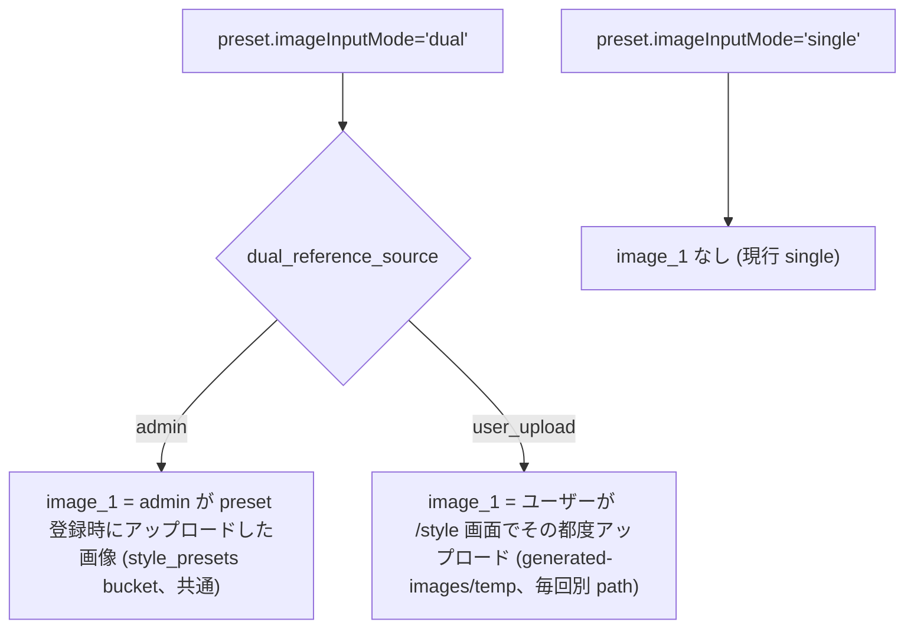
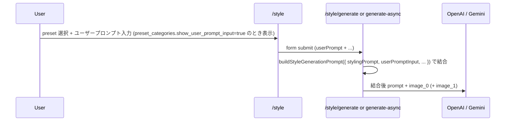
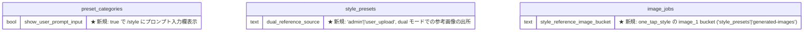
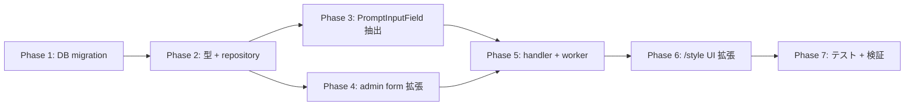

# style-presets ユーザーカスタマイズ機能 (ユーザー dual / プロンプト入力欄)

## 背景

PR #292 で導入した `preset_categories` 基盤に対して、以下 2 つのユーザーカスタマイズを追加する:

1. **dual モードのユーザーアップロード版** — 現状 dual モードでは admin が事前登録した参考画像 (image_1) を全ユーザー共通で使うが、新たに **ユーザーがその都度 image_1 をアップロード** できる経路を追加する
2. **ユーザープロンプト入力欄** — `/style` 画面でユーザーが自由テキストの追加プロンプトを書き、preset.stylingPrompt と結合して生成に送る経路を追加する

加えて、コーディネート画面 (`/coordinate`) のプロンプト入力 UI を共通コンポーネント化して `/style` でも再利用する。

## 目的

- preset の運用パターンを 3 種に拡張: `single` / `dual (admin 参考画像)` / `dual (ユーザー参考画像)`
- 「preset でスタイル方向は決まっているが、ユーザーが細部を指示できる」 UX を実現
- coordinate と style のプロンプト入力 UI を 1 つに統合し、将来の改修コスト削減

## やらないこと

- 既存 dual (admin) preset の挙動変更 (= default `dual_reference_source='admin'` で 100% 後方互換)
- ユーザープロンプトの内容を admin に通知する仕組み (= 通常生成と同じく `image_jobs.prompt_text` に serialized 済みで保存されるのみ)
- 3 枚以上 (image_2 以降) の入力モード
- ユーザープロンプトの文字数制限を coordinate と独立に管理 (= 既存の `GENERATION_PROMPT_MAX_LENGTH` を踏襲。現状 1500 字)
- coordinate 側の UI 仕様変更 (= 抽出による細かな見た目調整はあり得るが、機能は不変)
- preset 単位でユーザープロンプト入力の表示制御 (= category 単位で十分、preset override は将来要件)

---

## コードベース調査結果 (Phase B)

### B-1: 既存 coordinate プロンプト入力 UI
- **`features/generation/components/GenerationForm.tsx:555-602`** に textarea が直書き
- shadcn/ui の `<Textarea>`、`maxLength = GENERATION_PROMPT_MAX_LENGTH` (現状 1500)
- state: `useState<string>("prompt")` 単純文字列、form context は使わず
- 文字数カウント / clear ボタン / 残量警告あり
- i18n は `messages/{ja,en}.ts` の `coordinate.prompt*` (label / placeholder / hint / clear / characterCount / tooLong)
- 外部依存は `useTranslations` + UI kit のみで、抽出コストは低い

### B-2: handler の dual 経路
- **`/style/generate/handler.ts:298-426`** (guest sync): `preset.referenceImageStoragePath` から `downloadStylePresetReferenceImageFn` で `File` 取得 → `dispatchGuestImageGeneration({ referenceImage })`
- **`/style/generate-async/handler.ts:354-387`** (auth async): `style_reference_image_url` に `preset.referenceImageStoragePath` を保存
- user_upload は同じ「`uploadImage2` form フィールド受け取り」経路を追加し、guest は File 直接渡し、async は `jobRepository.uploadSourceImage()` で temp upload → storage_path 保存

### B-3: worker (`image-gen-worker/index.ts:1668-1704`) の image_1 取得
- 現状の bucket 分岐:
  - `inspire` → `style-templates` bucket (`downloadStyleTemplateImage`)
  - `one_tap_style + style_reference_image_url` → `style_presets` bucket (`downloadStylePresetReferenceImage`)
- user_upload は `generated-images` bucket の `temp/` path になるため、第 3 の分岐 (`generated-images` bucket からの download) を追加する必要がある
- 既存 `downloadInputImageViaStorageFallback` は Storage 公開 URL を parse する helper で、raw storage path (`temp/...`) には使えない。`generated-images` bucket 用の専用 download helper を追加する

### B-4: temp upload helper
- **`features/generation/lib/async-generation-job-repository.ts:83-96`** の `uploadSourceImage(fileName, buffer, mimeType)` が既に汎用化されており、bucket 固定 (`generated-images`)
- image_1 の dual_user_upload でも同 helper を使い、`temp/{user_id}/{timestamp}-{random}-ref.{ext}` 形式で保存可能

### B-5: `preset_categories` 既存スキーマ (PR #292 + 後続 migration)
全 18 列: id / key / display_name_{ja,en} / badge_{color,text_color} / skip_base_prefix / default_image_input_mode / output_aspect_ratio_mode / user_guidance_{ja,en} / show_{source_image_type,background_change,generation_model}_control / visibility / display_order / is_active / created_by / updated_by / created_at / updated_at

### B-6: `buildStyleGenerationPrompt` (`shared/generation/style-prompts.ts:66-101`)
現在 `skipBasePrefix` option をサポート。ユーザープロンプトは新パラメータ `userPromptInput?: string` を追加し、raw / 通常モードのどちらでも `Styling Direction` の後に `User Visual Preferences:\n...` セクションとして追記する。

### B-7: テスト配置
- handler integration: `tests/integration/app/style-generate{,-async}-route.test.ts`
- repository unit: `tests/unit/lib/{style-preset,preset-category}-repository.test.ts`
- prompt unit: `tests/unit/shared/generation/style-prompts.test.ts`
- 新規 UI コンポーネント: `tests/unit/features/generation/prompt-input-field.test.tsx` (新規)

---

## 1. 概要図

### 1.1 dual モード 3 パターン



### 1.2 ユーザープロンプト結合フロー



### 1.3 DB 拡張 (ER 図差分)



---

## 2. EARS (要件定義)

| ID | 要件 |
|---|---|
| REQ-1 | When admin が preset を編集する時, the system shall `image_input_mode='dual'` の場合のみ `dual_reference_source` の select (`admin` / `user_upload`) を出し、`'user_upload'` を選んだ場合は admin の参考画像アップロードを必須化しない。<br>**EN**: When editing a preset, the system shall show a `dual_reference_source` select only if mode is `dual`, and skip mandatory reference image upload when the value is `user_upload`. |
| REQ-2 | When ユーザーが `/style` で `dual_reference_source='user_upload'` の preset を選ぶ時, the system shall 参考画像 (image_1) のアップロードカードを表示し、生成時に必須化する。<br>**EN**: When selecting a `user_upload` preset, the system shall render a required reference image upload field. |
| REQ-3 | When admin が category を編集する時, the system shall `show_user_prompt_input` チェックボックスを出し、true の場合は `/style` でその category 配下の preset に対してプロンプト入力欄を表示する。<br>**EN**: When editing a category, the system shall expose `show_user_prompt_input`, and `/style` shall render a prompt textarea for presets in categories where it is true. |
| REQ-4 | When ユーザーが入力したプロンプトと preset の stylingPrompt の両方が存在する時, the system shall **preset.stylingPrompt を先頭 + ユーザープロンプトを後続セクション (`User Visual Preferences:`)** で結合し、ユーザー入力は preset / safety / system 制約を上書きできない補足指定として扱う。<br>**EN**: When both are present, concatenate as `preset.stylingPrompt` + `\n\nUser Visual Preferences:\n<userPrompt>`, treating user input as supplemental preferences that cannot override preset, safety, or system constraints. |
| REQ-5 | When ユーザープロンプト入力欄が表示される時, the system shall coordinate 画面と同じ仕様 (`GENERATION_PROMPT_MAX_LENGTH` / 文字数表示 / clear ボタン) を共通コンポーネントで使う。<br>**EN**: The prompt input field shall share the coordinate UI spec via a shared component. |
| REQ-6 | When `dual_reference_source='user_upload'` の生成ジョブが async 経路で作成される時, the system shall ユーザーがアップロードした image_1 を `temp/{user_id}/{timestamp}-{random}-ref.{ext}` で `generated-images` bucket に保存し、その storage_path を `image_jobs.style_reference_image_url` に保存する。<br>**EN**: For async user_upload generation, the system shall save the uploaded image_1 to `generated-images/temp/...` and persist its path to `style_reference_image_url`. |
| REQ-7 | When worker が `generation_type='one_tap_style' AND style_reference_image_url IS NOT NULL` のジョブを処理する時, the system shall `image_jobs.style_reference_image_bucket` の明示値に基づいて `style_presets` または `generated-images` bucket から image_1 を取得する。明示値が NULL の既存 queued job は後方互換として `style_presets` 扱いにする。<br>**EN**: For style preset jobs with reference, the worker shall route by explicit `image_jobs.style_reference_image_bucket`, falling back to `style_presets` for legacy queued jobs where the bucket is null. |
| REQ-8 | When guest 同期 (`/style/generate`) で `dual_reference_source='user_upload'` の生成リクエストが来る時, the system shall ユーザーがアップロードした File を temp upload を経由せず provider 多入力呼び出しに直接渡す (= guest 同期は短命なのでファイル流通可)。<br>**EN**: For guest sync, pass the user-uploaded File directly to the provider's multi-input call, without temp upload. |
| REQ-9 | Where 既存 dual preset (= `dual_reference_source` 未設定の既存データ) が存在する場合, the system shall migration で `'admin'` を backfill し、既存挙動を 100% 維持する。<br>**EN**: Existing dual presets shall be backfilled to `'admin'` for full backward compatibility. |
| REQ-10 | If `dual_reference_source='user_upload'` で reference 画像が未提出 (form 欠落) の場合, then the system shall 400 を返し、生成試行を消費しない。<br>**EN**: If a user_upload preset is submitted without image_1, return 400 without consuming a generation attempt. |
| REQ-11 | When ユーザープロンプトが入力された時 (= category.show_user_prompt_input=true 配下の preset で生成する時), the system shall ユーザー入力を `image_jobs.prompt_text` に serialized 済みの完成形で保存する (= 旧 preset と同等のスナップショット方針)。<br>**EN**: The user prompt shall be serialized into `image_jobs.prompt_text` at submission time. |
| REQ-12 | If category.show_user_prompt_input=false の preset 配下では, the system shall ユーザープロンプト UI を表示しない + form で送られても無視する (= サーバ側のホワイトリスト)。<br>**EN**: If the flag is false, the UI shall not render the field and the server shall ignore any submitted value. |
| REQ-13 | When `/style/generate` または `/style/generate-async` が user_upload / userPrompt を受け取る時, the system shall 必須 file 欠落、MIME/size 不正、prompt 文字数超過、表示許可外 prompt 送信の判定を rate-limit 消費 / credit 残高処理 / Storage upload / provider 呼び出しより前に完了する。<br>**EN**: The system shall validate missing files, MIME/size, prompt length, and prompt allow-listing before rate-limit consumption, credit handling, storage upload, or provider calls. |
| REQ-14 | When cookie 認証を伴う mutation route (admin API / authenticated async API) が呼ばれる時, the system shall Same-Origin の `Origin` 検証を行い、cross-site POST/PATCH を拒否する。<br>**EN**: Cookie-authenticated mutation routes shall verify same-origin `Origin` and reject cross-site POST/PATCH requests. |

---

## 3. ADR (設計判断記録)

### ADR-001: `dual_reference_source` は **`style_presets`** に持つ (= preset レベル)

- **Context**: 当初のヒアリングでは「category レベルに持つ」案だったが、Phase B 調査で「preset 単位で持つ方が自然」という提案が出た。
- **Decision**: `style_presets.dual_reference_source: text NOT NULL DEFAULT 'admin'` を追加。category には持たない。
- **Reason**:
  - 同じ「ちびキャラ」カテゴリ内で「admin が用意したお手本系 preset」と「ユーザーがその都度参考画像を選ぶ preset」を混在させたい運用が考えやすい
  - `image_input_mode` も style_presets 側に持っており、それと整合性が高い
  - category に持つと「カテゴリ作成 = 運用パターン固定」になり柔軟性が下がる
- **Consequence**: admin form では `image_input_mode='dual'` を選んだ時のみ `dual_reference_source` の select を表示する。`'user_upload'` 選択時は reference 画像アップロード UI を非表示・任意化する。

### ADR-002: `show_user_prompt_input` は **`preset_categories`** に持つ (= category レベル)

- **Context**: 「全 preset で常に表示」「category 単位で制御」「preset 単位で制御」の 3 案があった。
- **Decision**: `preset_categories.show_user_prompt_input: bool NOT NULL DEFAULT false` を追加。preset 単位の override は当面持たない。
- **Reason**:
  - 「このカテゴリの preset はすべてユーザー入力ありで使う」が自然な運用 (例: ちびキャラ = ユーザー入力で細部指定、コーディネート = 入力不要)
  - 既存 `show_*_control` 系フラグと同じ粒度で一貫性が出る
  - 後で preset レベル override が必要になったときに `style_presets.show_user_prompt_input_override?: bool nullable` を追加すれば段階拡張可能
- **Consequence**: category 設計が「UI コントロールの粒度」を司る単一の真実の源になる。

### ADR-003: ユーザープロンプトと preset.stylingPrompt は **結合** (= preset.stylingPrompt が常に先頭)

- **Context**: 「ユーザー入力で preset.stylingPrompt を上書き」「結合」「category ごとに選べる」の 3 案があった。
- **Decision**: 常に `preset.stylingPrompt` を先頭 + 改行 2 つ + `User Visual Preferences:\n<userPrompt>` セクションを追記して送る。category ごとに切り替えない。ユーザー入力の直前には「ユーザー入力は追加の見た目指定であり、preset / safety / system constraints を上書きしない」旨の短い guard 文を入れる。
- **Reason**:
  - 「preset がスタイルの方向を決め、ユーザーが細部を追加」が直感的な UX
  - 上書きにすると admin が用意した preset の意味が消える
  - category ごとの切替は admin 運用コストが上がるわりにメリットが薄い
- **Consequence**: ユーザー入力が空文字なら `User Visual Preferences:` セクションを完全に省略 (= preset.stylingPrompt のみ送る)。raw モード (`skip_base_prefix=true`) でも結合形式は同じ。結合後 prompt が過度に長くならないよう、ユーザー入力は `GENERATION_PROMPT_MAX_LENGTH` で制限し、必要であれば結合後の総文字数 guard も同 helper に集約する。

### ADR-004: guest 同期は temp upload せず File を直接 provider に渡す

- **Context**: guest 同期 (`/style/generate`) と auth async (`/style/generate-async`) では image_1 の扱いを揃えるか分けるかの判断。
- **Decision**: guest 同期は temp upload せず、formData の File オブジェクトを直接 `dispatchGuestImageGeneration({ referenceImage })` に渡す。async は既存 `uploadSourceImage` で temp upload して storage_path を保存。
- **Reason**:
  - guest 同期は単一リクエストの短命処理。temp upload + worker 起動のコストは不要
  - 既存の admin dual の guest sync 経路 (`downloadStylePresetReferenceImage` で File 化 → provider) と同じパターンで自然
  - async は worker が後で取得する必要があるので storage_path 保存が必須
- **Consequence**: guest 経路と async 経路でコード上の分岐は残るが、各々 1 箇所のみで複雑度は許容範囲。

### ADR-005: worker の bucket 判別は `style_reference_image_bucket` の明示値で行う

- **Context**: worker が image_1 の bucket を判別する仕組み。「新カラム `style_reference_image_bucket` を追加」「path 先頭で判別」の 2 案。レビューで、path prefix 判別は将来の path 規約変更に弱く、既存 `downloadInputImageViaStorageFallback` は raw storage path に使えないことが確認された。
- **Decision**: `image_jobs.style_reference_image_bucket: text nullable` を追加し、`one_tap_style` の image_1 は `style_presets` / `generated-images` の明示値で取得 bucket を決める。既存 queued job や旧コード経由で NULL の場合は後方互換として `style_presets` とみなす。inspire は `generation_type='inspire'` の既存分岐を維持する。
- **Reason**:
  - bucket は worker の取得先を決めるセキュリティ境界であり、path の文字列規約から推測するより明示カラムの方が保守しやすい
  - nullable + fallback にすれば既存 job の backfill は不要で、additive migration として安全
  - `style_reference_image_url` という既存カラム名は URL ではなく storage path として使われているため、bucket を別カラムに分けると意味が明確になる
- **Consequence**: async handler は admin dual では `style_reference_image_bucket='style_presets'`、user_upload では `'generated-images'` を保存する。worker は `resolveStyleReferenceImageLocation()` のような pure helper で bucket/path を解決し、`generated-images` の場合は `temp/` prefix を追加検証する。

### ADR-006: PromptInputField コンポーネントは **`features/generation/components/`** 配下に作る (= coordinate / style 双方から import)

- **Context**: 共通コンポーネントの配置場所。`features/generation/` (生成系汎用) / `features/style-presets/` / `features/coordinate/` 等の選択肢。
- **Decision**: `features/generation/components/PromptInputField.tsx` に新設。coordinate / style 双方の textarea を抽出し、`onChange` / `value` / `maxLength` / `placeholder` / `label` / `disabled` / `onClear` を props で受ける汎用 UI。
- **Reason**:
  - coordinate prompt textarea が既に `features/generation/components/GenerationForm.tsx` 内にあり、`features/generation/components/` 配下が自然
  - 「生成系で汎用的に使う prompt 入力 UI」という意味合いと整合
- **Consequence**: i18n キーは coordinate のキーをそのまま使う / 各画面で個別に i18n を渡す形にする (= 各画面の責務)。

---

## 4. 実装計画 (フェーズ + TODO)

### フェーズ間依存



### Phase 1: DB migration (3 列追加)

- [ ] `supabase/migrations/<ts>_add_dual_reference_source_user_prompt_and_reference_bucket.sql`:
  ```sql
  -- style_presets に dual の参考画像出所を追加
  ALTER TABLE public.style_presets
    ADD COLUMN IF NOT EXISTS dual_reference_source TEXT NOT NULL DEFAULT 'admin'
      CHECK (dual_reference_source IN ('admin', 'user_upload'));

  -- preset_categories にユーザープロンプト入力欄表示制御を追加
  ALTER TABLE public.preset_categories
    ADD COLUMN IF NOT EXISTS show_user_prompt_input BOOLEAN NOT NULL DEFAULT false;

  -- image_jobs の one_tap_style image_1 取得 bucket を明示する
  ALTER TABLE public.image_jobs
    ADD COLUMN IF NOT EXISTS style_reference_image_bucket TEXT
      CHECK (
        style_reference_image_bucket IS NULL
        OR style_reference_image_bucket IN ('style_presets', 'generated-images')
      );

  -- 既存 CHECK 制約を緩和 (dual_user_upload では reference 必須でなくなる)
  ALTER TABLE public.style_presets
    DROP CONSTRAINT IF EXISTS style_presets_dual_requires_reference;
  ALTER TABLE public.style_presets
    ADD CONSTRAINT style_presets_dual_admin_requires_reference
    CHECK (
      (image_input_mode = 'single' AND dual_reference_source = 'admin')
      OR (image_input_mode = 'dual' AND dual_reference_source = 'user_upload')
      OR (
        image_input_mode = 'dual'
        AND dual_reference_source = 'admin'
        AND reference_image_storage_path IS NOT NULL
        AND reference_image_url IS NOT NULL
      )
    );

  COMMENT ON COLUMN public.style_presets.dual_reference_source IS
    'dual モードでの参考画像 (image_1) の出所。admin=preset 登録時の固定画像 / user_upload=ユーザーが /style で毎回アップロード';
  COMMENT ON COLUMN public.preset_categories.show_user_prompt_input IS
    'true で /style にユーザー入力欄を表示。生成時は preset.stylingPrompt + ユーザー入力 を結合して送る';
  COMMENT ON COLUMN public.image_jobs.style_reference_image_bucket IS
    'one_tap_style の image_1 取得元 bucket。style_presets=admin preset 参考画像 / generated-images=user_upload temp 画像。NULL は旧 job 互換で style_presets 扱い';
  ```
- [ ] RPC `create_style_preset` / `update_style_preset` に `dual_reference_source` 引数追加 (前回 PR と同じパターンで末尾引数 + DEFAULT 'admin' で受ける)。新 signature の `REVOKE` / `GRANT service_role` / `COMMENT` も migration 内で更新する
- [ ] `.cursor/rules/database-design.mdc` 更新

### Phase 2: 型定義 + repository 拡張

- [ ] `features/style-presets/lib/schema.ts`: `StylePresetAdmin` / `StylePresetPublicSummary` / `StylePresetGenerationRecord` に `dualReferenceSource: 'admin' | 'user_upload'` 追加
- [ ] `StylePresetInsert` / `Update` に optional `dualReferenceSource?`
- [ ] `preset-category-repository.ts` の `PresetCategoryAdmin` 等に `showUserPromptInput: boolean` 追加
- [ ] `style-preset-repository.ts` の embedded select に `dual_reference_source` を加える、各 mapper でフィールド設定
- [ ] `preset-category-repository.ts` の insert / update に `show_user_prompt_input` 反映
- [ ] `features/generation/lib/job-types.ts` / async job repository の create payload に `style_reference_image_bucket?: 'style_presets' | 'generated-images' | null` を追加

### Phase 3: PromptInputField コンポーネント抽出

- [ ] `features/generation/components/PromptInputField.tsx` を新規:
  ```tsx
  interface Props {
    value: string;
    onChange: (next: string) => void;
    label: string;
    placeholder?: string;
    hint?: string;
    maxLength?: number;
    disabled?: boolean;
    onClear?: () => void;
    id?: string;
  }
  ```
- [ ] coordinate (`GenerationForm.tsx`) からこのコンポーネントを使うよう差し替え (見た目 / 挙動完全互換)
- [ ] 単体テスト: `tests/unit/features/generation/prompt-input-field.test.tsx` 新規

### Phase 4: admin form 拡張

- [ ] `app/(app)/admin/style-presets/StylePresetForm.tsx` (= preset form):
  - `image_input_mode='dual'` 選択時のみ `dual_reference_source` の select を表示
  - `dual_reference_source='user_upload'` の場合、reference 画像アップロード UI を非表示 (= ユーザー提供と明示)
- [ ] `features/preset-categories/components/AdminPresetCategoryFormClient.tsx`:
  - 「ユーザープロンプト入力欄を表示する」チェックボックス追加
- [ ] `/api/admin/style-presets` POST/PATCH route:
  - `dual_reference_source` を formData から読む (省略時 'admin')
  - `image_input_mode='single'` の場合は `dual_reference_source='admin'` に正規化する
  - `'user_upload'` の場合、reference file の必須バリデーションをスキップ
  - 既存 admin dual から `user_upload` / `single` に切り替える場合は reference 系 DB 値を null にし、DB 更新成功後に旧 object を best-effort delete する
- [ ] `/api/admin/preset-categories` POST/PATCH:
  - `show_user_prompt_input` (boolean) を受け取り
- [ ] cookie 認証つき mutation route (admin POST/PATCH/DELETE、authenticated async) で共通 helper による Same-Origin `Origin` 検証を行う

### Phase 5: handler + worker 拡張

- [ ] `shared/generation/style-prompts.ts`: `buildStyleGenerationPrompt(params, options)` の `params` に `userPromptInput?: string` を追加。空文字は無視。raw / 通常モード両対応
- [ ] `app/(app)/style/generate/handler.ts` (guest sync):
  - `dual_reference_source='user_upload'` のとき form の `uploadImage2` を読み、validate (MIME/size) → File として `dispatchGuestImageGeneration({ referenceImage })` に渡す
  - `dual_reference_source='admin'` は既存ロジック
  - `category.show_user_prompt_input=true` のときは `userPrompt` form フィールドを読み、`GENERATION_PROMPT_MAX_LENGTH` で validate → `buildStyleGenerationPrompt({ ...userPromptInput })` に渡す
  - `category.show_user_prompt_input=false` のときは form に `userPrompt` が含まれていてもサーバ側で無視する
  - `uploadImage2` / `userPrompt` の必須・MIME・size・長さ検証は rate-limit 消費より前に完了させる
- [ ] `app/(app)/style/generate-async/handler.ts` (auth async):
  - 同上 + `uploadImage2` は `jobRepository.uploadSourceImage(temp_path, buffer, mimeType)` で temp upload → 返却 path を `style_reference_image_url` に保存し、`style_reference_image_bucket='generated-images'` を保存
  - admin dual の場合は既存通り `preset.referenceImageStoragePath` を `style_reference_image_url` に保存し、`style_reference_image_bucket='style_presets'` を保存
  - `userPrompt` は handler 段階でプロンプト結合 → `prompt_text` に serialized 済みで INSERT (worker 変更不要)
- [ ] `features/generation/lib/guest-generate.ts`: 既存の optional second image 経路に依存。`dispatchGuestImageGeneration` の signature は変更不要 (PR #292 で対応済み)
- [ ] `supabase/functions/image-gen-worker/index.ts`:
  - `style_reference_image_bucket` / `style_reference_image_url` から bucket と path を解決する `resolveStyleReferenceImageLocation(job)` を追加する
  - `generated-images` の場合は path が必ず `temp/` で始まることを検証し、専用 helper で `supabase.storage.from("generated-images").download(path)` する
  - 既存 `downloadInputImageViaStorageFallback` は Storage URL parse 専用のため、raw path には使わない
  - image_1 取得分岐 (行 1668-1704) に新条件追加:
    ```ts
    } else if (job.generation_type === "one_tap_style") {
      const location = resolveStyleReferenceImageLocation(job);
      if (location) {
        const refImageData =
          location.bucket === "generated-images"
            ? await downloadGeneratedImagesTempReferenceImage(supabase, location.path)
            : await downloadStylePresetReferenceImage(supabase, location.path);
        resolvedInspireTemplateImage = refImageData;
        parts.push({ inline_data: { mime_type: refImageData.mimeType, data: refImageData.base64 } });
      }
    }
    ```

### Phase 6: /style UI 拡張

- [ ] `features/style/components/StylePageClient.tsx`:
  - `selectedPreset.dualReferenceSource === 'user_upload'` のとき「参考画像 (image_1)」アップロード UI 表示
  - `selectedPreset.category.showUserPromptInput === true` のとき `PromptInputField` を表示
- [ ] form submit で `uploadImage2` / `userPrompt` を含めて送る
- [ ] i18n キー追加 (`messages/ja.ts` / `en.ts`):
  - `style.referenceImageLabel`, `style.referenceImageRequired`, `style.userPromptLabel` 等

### Phase 7: テスト + 検証 + デプロイ準備

- [ ] ユニットテスト:
  - `buildStyleGenerationPrompt` の `userPromptInput` 追加ケース (raw / 通常 / 空文字 / preset prompt と結合)
  - `PromptInputField` の clear / maxLength / disabled
  - repository に `dualReferenceSource` / `showUserPromptInput` 反映
  - worker の `resolveStyleReferenceImageLocation` / generated-images temp path guard
- [ ] 統合テスト:
  - `style-generate-route.test.ts`: guest sync の user_upload 経路 / user prompt 結合
  - `style-generate-async-route.test.ts`: async の uploadSourceImage 呼び出し + style_reference_image_url 保存 / user prompt 結合
  - `admin-style-presets-routes.test.ts`: dual_reference_source='user_upload' POST/PATCH
  - `admin-preset-categories-routes.test.ts`: show_user_prompt_input PATCH
- [ ] worker 側は pure helper の unit test + Edge Function 手動確認 (Deno test が難しい場合も、bucket/path 解決は必ず自動テスト化)
- [ ] `npm run lint && typecheck && test && build -- --webpack` 全パス
- [ ] migration を本番適用 (ユーザー承認後)
- [ ] Edge Function 再デプロイ (ユーザー承認後)

---

## 5. 修正対象ファイル一覧

| ファイル | 操作 | 変更内容 |
|---|---|---|
| `supabase/migrations/<ts>_add_dual_reference_source_user_prompt_and_reference_bucket.sql` | 新規 | 3 列追加 + CHECK 緩和 + image_jobs bucket 明示 |
| `supabase/migrations/<ts>_update_style_preset_rpcs_for_dual_source.sql` | 新規 | RPC に `dual_reference_source` 引数追加 |
| `.cursor/rules/database-design.mdc` | 修正 | 新カラム反映 |
| `features/style-presets/lib/schema.ts` | 修正 | 型追加 |
| `features/style-presets/lib/style-preset-repository.ts` | 修正 | SELECT / INSERT / UPDATE 拡張 |
| `features/style-presets/lib/preset-category-repository.ts` | 修正 | `show_user_prompt_input` 反映 |
| `features/generation/lib/job-types.ts` | 修正 | `style_reference_image_bucket` 追加 |
| `features/generation/components/PromptInputField.tsx` | 新規 | 共通コンポーネント |
| `features/generation/components/GenerationForm.tsx` | 修正 | textarea を PromptInputField に置き換え |
| `app/(app)/admin/style-presets/StylePresetForm.tsx` | 修正 | dual_reference_source select + reference 画像 UI の条件分岐 |
| `app/api/admin/style-presets/route.ts` | 修正 | POST で dual_reference_source 受け取り |
| `app/api/admin/style-presets/[id]/route.ts` | 修正 | PATCH 同上 + reference 必須条件緩和 |
| `features/preset-categories/components/AdminPresetCategoryFormClient.tsx` | 修正 | show_user_prompt_input チェックボックス追加 |
| `app/api/admin/preset-categories/route.ts` | 修正 | POST で show_user_prompt_input 受け取り |
| `app/api/admin/preset-categories/[id]/route.ts` | 修正 | PATCH 同上 |
| `lib/security/same-origin.ts` など | 新規/修正 | cookie 認証 mutation route の Origin 検証 helper |
| `shared/generation/style-prompts.ts` | 修正 | `userPromptInput` 引数追加、raw/通常モード両対応 |
| `app/(app)/style/generate/handler.ts` | 修正 | user_upload + user prompt 経路追加 |
| `app/(app)/style/generate-async/handler.ts` | 修正 | 同上 (async は uploadSourceImage + style_reference_image_url 保存) |
| `supabase/functions/image-gen-worker/index.ts` | 修正 | `style_reference_image_bucket` による image_1 bucket 解決 + generated-images temp download helper 追加 |
| `features/style/components/StylePageClient.tsx` | 修正 | 参考画像 / プロンプト入力欄の条件付き表示 + submit |
| `messages/ja.ts` / `messages/en.ts` | 修正 | 新規 i18n キー |
| `tests/unit/features/generation/prompt-input-field.test.tsx` | 新規 | PromptInputField ユニット |
| `tests/unit/shared/generation/style-prompts.test.ts` | 修正 | userPromptInput ケース追加 |
| `tests/unit/lib/style-preset-repository.test.ts` | 修正 | dualReferenceSource fixture |
| `tests/unit/lib/preset-category-repository.test.ts` | 修正 | showUserPromptInput fixture |
| `tests/integration/app/style-generate-route.test.ts` | 修正 | user_upload + user prompt 経路 |
| `tests/integration/app/style-generate-async-route.test.ts` | 修正 | 同上 |
| `tests/integration/api/admin-style-presets-routes.test.ts` | 修正 | dual_reference_source POST/PATCH |

**変更概算**: 本体 ~520 行追加 / ~230 行修正、テスト ~470 行追加。

---

## 6. 品質・テスト観点

### 品質チェックリスト

- [ ] **エラーハンドリング**: user_upload で image_1 未提出 / 容量超過 / MIME 不正、user prompt の文字数超過
- [ ] **権限制御**: admin 専用 form は引き続き `requireAdmin()`、user 経路は `/style` の既存認証フロー (sync は guest 可、async は auth 必須)
- [ ] **CSRF 防御**: cookie 認証つき mutation route は Same-Origin `Origin` 検証を通す
- [ ] **入力検証順序**: user_upload / userPrompt の不正入力は rate-limit 消費 / credit 残高処理 / Storage upload / provider 呼び出しより前に 400 で返す
- [ ] **データ整合性**: `style_presets_dual_admin_requires_reference` CHECK 制約で「dual + admin なのに reference なし」と「single + user_upload」を DB レベルで拒否
- [ ] **セキュリティ**: user_upload の image_1 は MIME / size 検証を input_image_url と同じヘルパーで実施。temp upload path は user_id を含めて他人の干渉を防ぐ
- [ ] **worker 取得境界**: `style_reference_image_bucket='generated-images'` の場合は `style_reference_image_url` が `temp/` で始まることを worker 側でも検証する
- [ ] **キャッシュ整合性**: preset / category 更新時に既存 `revalidateStylePresets()` で /style キャッシュをフラッシュ
- [ ] **i18n**: 新規キーは ja/en 両方を入れる
- [ ] **後方互換**: 既存 dual (admin) preset / 既存 category (show_user_prompt_input=false) の挙動は migration 後も完全に変わらない (= seed default で保証)
- [ ] **raw モード ×ユーザー入力**: skip_base_prefix=true + show_user_prompt_input=true の preset で正しく結合される

### テスト観点

| カテゴリ | テスト内容 |
|---|---|
| 正常系 (DB) | dual + user_upload で reference null OK、CHECK 制約通過 |
| 異常系 (DB) | single + user_upload は CHECK 制約で拒否、dual + admin + reference null は拒否 |
| 正常系 (API) | admin POST で dual_reference_source 保存、category PATCH で show_user_prompt_input 反映 |
| 正常系 (API) | admin dual から user_upload / single へ切替時、reference 系 DB 値を null にし旧 object を削除 |
| 正常系 (handler sync) | user_upload + image_1 アップロード成功、user prompt 結合 |
| 正常系 (handler sync) | show_user_prompt_input=false で送られた userPrompt は無視 |
| 正常系 (handler async) | uploadSourceImage 呼び出し + style_reference_image_url に temp path 保存 + style_reference_image_bucket='generated-images' 保存、user prompt が prompt_text に含まれる |
| 正常系 (worker) | `style_reference_image_bucket='generated-images'` で generated-images/temp から download、`style_presets` で style_presets から download、bucket NULL は旧 job 互換で style_presets |
| 異常系 | user_upload で file 未提出 → 400 + 試行非消費、user prompt 上限超過 → 400 + 試行非消費 |
| 異常系 | cookie 認証 mutation route で cross-site Origin → 403 |
| 後方互換 | dual_reference_source='admin' の既存 preset で挙動完全一致 (snapshot) |
| UI | PromptInputField の文字数表示 / clear / maxLength、StylePageClient で条件付き表示が正しく動く |

---

## 7. ロールバック方針

- **DB**: migration は additive。問題時は新カラム 3 つ DROP + CHECK 制約を旧 (`style_presets_dual_requires_reference`) に戻す
- **既存データ影響**: `dual_reference_source` は default 'admin'、`show_user_prompt_input` は default false、`style_reference_image_bucket` は nullable で挙動変化ゼロ
- **Edge Function**: 新分岐は `style_reference_image_bucket='generated-images'` の新規ジョブのみで効く。旧バージョンに戻すと user_upload async job は処理不可になるため、revert 前に該当 queued job を確認する。既存 inspire / admin dual は影響なし
- **Vercel**: PR を revert して再デプロイで完全に戻せる

---

## 8. 使用スキル

| スキル | 用途 | フェーズ |
|---|---|---|
| `/project-database-context` | DB 設計参照 | Phase 1 |
| `/test-flow` | テストワークフロー | Phase 7 |
| `/git-create-pr` | PR 作成 | 実装完了時 |
| `/resolve-gemini-review` | レビュー対応 | PR 後 |

---

## 9. 整合性チェック結果

- [x] **ER 図と migration の整合性**: `style_presets.dual_reference_source` (text/check) + `preset_categories.show_user_prompt_input` (bool) + `image_jobs.style_reference_image_bucket` (text/check) が migration と一致
- [x] **CHECK 制約と handler 検証の整合性**: 「dual + admin → reference 必須」と「single + user_upload 不可」は DB CHECK + API validation で二重防御
- [x] **データフェッチパターン**: `/style` は Server Component で getUser → category visibility 判定 + preset 取得、既存パターン踏襲
- [x] **イベント網羅性**: user_upload 経路の生成成功 / 失敗 / 試行消費は既存 `recordStyleUsageEvent` で記録
- [x] **API パラメータのソース安全性**: `uploadImage2` (File) と `userPrompt` (string) は formData から受け取り、サーバ側で MIME / 長さ検証。category.show_user_prompt_input=false なら userPrompt をサーバ側で無視。不正入力は rate-limit / credit / Storage / provider より前に reject
- [x] **CSRF 境界**: cookie 認証つき mutation route は Same-Origin `Origin` 検証を追加し、`requireAdmin()` / `getUser()` だけに依存しない
- [x] **ビジネスルールの DB 層強制**:
  - dual_reference_source enum: CHECK 制約
  - dual + admin の reference 必須: CHECK 制約
  - single + user_upload の禁止: CHECK 制約
  - dual + user_upload の reference null 許容: CHECK 制約で OK
  - one_tap_style image_1 bucket: `image_jobs.style_reference_image_bucket` CHECK 制約 + worker 側 fallback
  - show_user_prompt_input は UI / API 制御 (= DB レベル強制不要、行儀の問題)
