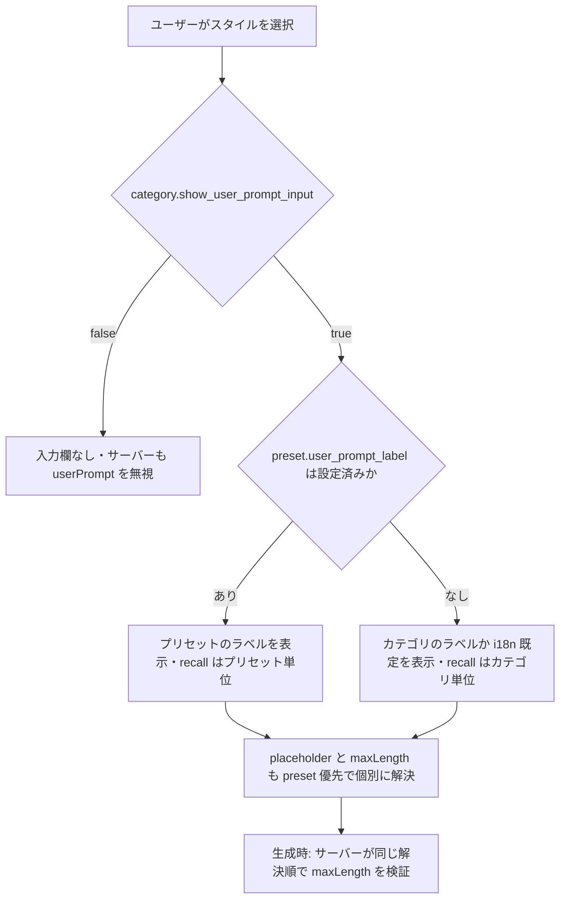
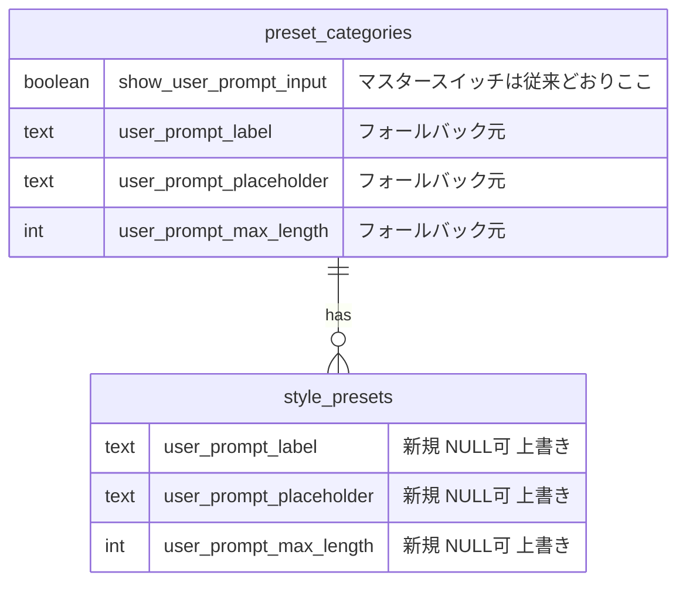
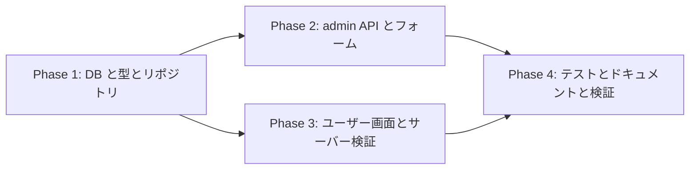

# One-Tap Style スタイル別ユーザープロンプト入力欄設定 実装計画書

作成日: 2026-08-05
ステータス: 実装完了（本計画書は実装と同一 PR に同梱。実装中の発見を反映済み）

> **実装中の重要な発見（計画からの差分）**: `style_presets` への書き込みは直接 UPDATE ではなく
> `create_style_preset` / `update_style_preset` RPC 経由だったため、列追加に加えて
> **両 RPC の引数追加（DROP + CREATE、20260626100000 の provider 追加と同型）**が必要になった。
> これに伴い適用順序が確定: **マイグレーション先行 → コードデプロイ**（逆順だと新コードが
> 新引数を送って PGRST202 でプリセット保存が壊れる。マイグレーション先行は旧コードと互換）。

## 背景・ゴール

現在、`/style` のユーザープロンプト入力欄（textarea）の「ラベル・プレースホルダ・最大文字数」は
**カテゴリ単位**（`preset_categories.user_prompt_label` / `user_prompt_placeholder` / `user_prompt_max_length`）でのみ設定できる。

しかし `character_remix_text` カテゴリのように 1 カテゴリへ多数のスタイルが混在する運用では、
スタイルごとにユーザーへ求める入力が異なる（例:「キャラクターの名前」「好きなことば」「好きな数字」）。

本機能では、**One-Tap Style の各スタイル（`style_presets`）単位で 3 項目を上書き設定**できるようにする。

### 解決順（3段フォールバック）

```
プリセット設定 → カテゴリ設定 → i18n 既定（ラベル/placeholder）・1500 文字（上限）
```

NULL = 上位に継承。既存の全プリセットは新列が NULL のため、**挙動は一切変わらない**。
これはクリエイタークレジットの provider 解決（preset → category フォールバック、
`StylePresetPublicSummary.providerUserId` のコメント参照）と同じ思想。

### 決定済みの設計方針（ユーザー承認済み 2026-08-05）

1. **「前回入力」の復元単位**: プリセットにラベル設定があるスタイルは**プリセット単位**で記憶、
   なければ従来どおり**カテゴリ単位**（ラベルが違う = 入力の意味が違う、というシグナルで切替）
2. **入力欄の表示 ON/OFF はカテゴリに残す**: マスタースイッチ `show_user_prompt_input` はカテゴリのまま。
   per-style で上書きするのは「文言と上限」のみ

### 既存カテゴリへの影響（本番データで確認済み）

`collectible_wafer_sticker_god_6p` / `collectible_wafer_sticker_god_petit_6p`（神コレ/ぷち神）は
両方とも `show_user_prompt_input=true`・ラベル「💡 名前を記載してください（任意）…」・
placeholder「ノエル」・上限 10 文字・各 6 プリセットで稼働中。

- 新列はすべて NULL → カテゴリ設定にフォールバック → **表示・上限検証とも完全に現状維持**
- ラベル上書きなし → recall キーもカテゴリ単位のまま（`user-prompt:{categoryKey}`）→
  **過去に保存された下書き（localStorage）もそのまま生きる**
- 将来、神ごとに placeholder を変えたくなったらプリセット側に設定するだけで対応可能

## コードベース調査結果

| 対象 | 場所 | 現状 |
|------|------|------|
| カテゴリ側 3 設定の起源 | `supabase/migrations/20260610090000_add_user_prompt_label_placeholder.sql` / `20260610140000_add_user_prompt_max_length.sql` | NULL なら i18n 既定へフォールバックする設計。down migration は明示しない方針 |
| ユーザー画面の描画 | `features/style/components/StylePageClient.tsx:2061-2077`（ラベル/placeholder）・`611-613`（maxLength） | すべて `selectedPreset.category.*` から**選択中プリセット経由で毎回解決**している → preset 優先に変えるだけで per-style 化できる |
| サーバー検証 | `app/(app)/style/generate-async/handler.ts:393-403` / `app/(app)/style/generate/handler.ts:370-380` | `category.showUserPromptInput` で採用判定（REQ-12）、`category.userPromptMaxLength ?? GENERATION_PROMPT_MAX_LENGTH` で上限検証 |
| 前回入力の復元 | `features/style/lib/user-prompt-recall.ts`（テスト: `tests/unit/features/style/user-prompt-recall.test.ts`） | localStorage キー `user-prompt:{categoryKey}`。maxLength 縮小時の slice 保険あり |
| 型定義 | `features/style-presets/lib/schema.ts` | `StylePresetCategoryRef` に 3 項目あり。`StylePresetAdmin` / `StylePresetPublicSummary` / `StylePresetGenerationRecord` に preset 側 3 項目を追加する（GenerationRecord は PublicSummary を extends） |
| リポジトリ | `features/style-presets/lib/style-preset-repository.ts` | select は `"*"`（新列は自動で届く）。Row 型 + マッピング + `createStylePreset` / `updateStylePreset` 入力に追加 |
| admin API | `app/api/admin/style-presets/route.ts`（POST）/ `[id]/route.ts`（PATCH） | **FormData**（multipart。ファイル同送のため）。バリデーションはカテゴリ API（`app/api/admin/preset-categories/route.ts:24-25,317-378`）をミラー: ラベル ≤120・placeholder ≤200・maxLength は 1〜`GENERATION_PROMPT_MAX_LENGTH`(1500) の整数 or null。DB CHECK は置かない（カテゴリ側と同じく API 層検証で統一） |
| admin フォーム | `app/(app)/admin/style-presets/StylePresetForm.tsx` | `categories: PresetCategoryAdmin[]` を保持（`showUserPromptInput` を参照可能）→ 選択中カテゴリが入力欄有効のときのみ 3 欄セクションを表示できる |
| i18n | `messages/ja.ts:1618-1620` ほか全 15 ロケール | 既定文言は既存キーのまま。admin 設定値は単一言語フリーテキスト（カテゴリ側と同じ設計）のため**新規 i18n キーは不要** |
| プロンプト組み立て | （変更なし） | ユーザー入力は UVP セクションとして末尾追記される既存設計のまま。本機能で触るのは表示文言と上限のみ |

## 概要図

### 解決フロー



### データモデル（追加分）



## EARS（要件定義）

- **REQ-01** (イベント駆動): When admin がプリセットに `user_prompt_label` / `user_prompt_placeholder` / `user_prompt_max_length` を設定して保存したとき, the system shall それらを `style_presets` に保存する（そのプリセットを選択中の `/style` textarea へ反映）。
  admin がプリセットのラベル・プレースホルダ・上限を保存すると、そのスタイル選択時の入力欄に反映される。
- **REQ-02** (状態駆動): While プリセット側の各項目が NULL, the system shall カテゴリ設定 → i18n 既定（上限は 1500）の順でフォールバックする。
  未設定の項目はカテゴリ設定、それも無ければ従来の既定文言・既定上限を使う。
- **REQ-03** (状態駆動): While `category.show_user_prompt_input = false`, the system shall プリセット側の設定値に関わらず入力欄を表示せず、サーバーも userPrompt を無視する（既存 REQ-12 維持）。
  表示 ON/OFF はカテゴリのマスタースイッチが常に優先される。
- **REQ-04** (イベント駆動): When 生成リクエストを受けたとき, the system shall preset → category → 既定 の解決順で得た maxLength で userPrompt 長を検証し、超過時は既存のエラー応答を返す。
  文字数上限はサーバー側でも同じ優先順位で検証される。
- **REQ-05** (状態駆動): While プリセットに `user_prompt_label` が設定されている, the system shall 前回入力を `user-prompt:preset:{presetId}` キーで保存・復元する。それ以外は既存の `user-prompt:{categoryKey}` を使い続ける。
  ラベルを独自設定したスタイルだけ下書きがスタイル単位になり、既存カテゴリの下書きは今までどおり。
- **REQ-06** (異常系): If admin API へ不正な値（ラベル >120 字・placeholder >200 字・上限が 1〜1500 の整数でない）が送られたら, then the system shall 400 を返し保存しない（カテゴリ API と同一基準）。
- **REQ-07** (権限): admin API（POST/PATCH）は既存の admin 認証のまま。一般ユーザーが preset の設定値を書き換える経路は存在しない（`style_presets` への書き込みは admin API のみ）。

## ADR（設計判断記録）

### ADR-001: NULL 可の上書き 3 列を `style_presets` に追加（JSON や別テーブルにしない）

- **Context**: per-style 設定の持ち方は、列追加 / JSONB 設定塊 / 別テーブルの選択肢がある。
- **Decision**: カテゴリ側と同名の 3 列を NULL 可で追加し、NULL = 継承とする。
- **Reason**: カテゴリ側の既存設計と完全対称で認知負荷が最小。provider 解決（preset → category）という同型の先例が既にある。3 項目固定で拡張予定もないため JSONB の柔軟性は不要。
- **Consequence**: 既存プリセットは全て NULL → 挙動不変で後方互換。列が 3 本増えるが select は `"*"` のため配線コストは小さい。

### ADR-002: 表示 ON/OFF のマスタースイッチはカテゴリに残す

- **Context**: per-style で「このスタイルだけ入力欄なし」も技術的には可能。
- **Decision**: `show_user_prompt_input` はカテゴリ単位のまま。preset 側で上書きするのは文言と上限のみ。
- **Reason**: サーバーの採用判定（REQ-12）を触らずに済み、セキュリティ境界が変わらない。現時点でユースケースがない。
- **Consequence**: 将来必要になれば `style_presets.show_user_prompt_input`（NULL=継承の3値）を追加で対応可能。

### ADR-003: recall キーは「preset にラベル設定があるときだけ preset 単位」

- **Context**: 下書きはカテゴリ単位の localStorage（例: 神コレで入力した名前が同カテゴリ内で引き継がれるのは意図された挙動）。per-style 化で「キャラの名前」の下書きが「好きな数字」欄に prefill される事故が起こり得る。
- **Decision**: `user_prompt_label` が非 NULL のプリセットは `user-prompt:preset:{presetId}`、それ以外は既存の `user-prompt:{categoryKey}`。
- **Reason**: 「ラベルが違う = 入力の意味が違う」を運営設定そのものをシグナルとして使える。既存カテゴリのキーが変わらないため、過去の下書きが消えない。
- **Consequence**: placeholder や上限だけ上書きした場合はカテゴリ単位のまま（意味が同じなら妥当）。ラベルを後から設定すると下書きが一度空に見えるが、意味が変わった入力欄に旧値を出さないのはむしろ正しい。

## 実装計画

### フェーズ間の依存関係



### Phase 1: DB・型・リポジトリ

目的: 3 列を追加し、read/write の配線を通す（この時点では誰も値を設定できないため挙動不変）
ビルド確認: `npm run typecheck` / `npm run build -- --webpack` が通る

- [x] マイグレーション `supabase/migrations/20260805150000_add_style_preset_user_prompt_overrides.sql`
      — `ALTER TABLE style_presets ADD COLUMN IF NOT EXISTS` ×3 + `COMMENT ON COLUMN`（解決順を明記）
      + **`create_style_preset` / `update_style_preset` RPC の DROP + CREATE（末尾3引数 DEFAULT NULL 追加・REVOKE/GRANT/COMMENT 再付与）**
      + カタログ検証 DO ブロック（列3本・新アリティ 23/22 のみ・authenticated 実行不可）。20260610090000 と同様に down は明示しない
- [ ] `features/style-presets/lib/schema.ts` — `StylePresetAdmin` / `StylePresetPublicSummary` に 3 項目（optional・コメントで解決順を明記。`StylePresetGenerationRecord` は継承で自動）
- [ ] `features/style-presets/lib/style-preset-repository.ts` — Row 型・全マッピング箇所・`createStylePreset` / `updateStylePreset` の入力と payload に 3 項目

### Phase 2: admin API・フォーム

目的: 運営がプリセット編集画面から 3 項目を設定できる
ビルド確認: admin でプリセットを保存し、値が保存・再表示される

- [ ] `app/api/admin/style-presets/route.ts`（POST）/ `[id]/route.ts`（PATCH）
      — FormData から `user_prompt_label` / `user_prompt_placeholder` / `user_prompt_max_length` を受領。
      バリデーションはカテゴリ API 基準をミラー（ラベル ≤120・placeholder ≤200・上限 1〜1500 整数・空文字→NULL）
- [ ] `app/(app)/admin/style-presets/StylePresetForm.tsx`
      — 選択中カテゴリの `showUserPromptInput=true` のときのみ「ユーザープロンプト入力欄（スタイル別上書き）」セクションを表示。
      3 欄とも空 = カテゴリ設定を継承、と明記したヘルプテキストを添える

### Phase 3: ユーザー画面・サーバー検証

目的: `/style` の textarea が preset 優先で描画され、サーバー検証も同じ解決順になる
ビルド確認: 上書き設定したプリセット選択時にラベル等が切り替わり、未設定プリセットは従来表示

- [ ] `features/style/components/StylePageClient.tsx`
      — ラベル/placeholder/maxLength の解決を `selectedPreset.userPromptXxx ?? selectedPreset.category.userPromptXxx ?? 既定` に変更（2061-2077・611-613 と recall 呼び出し箇所）
- [ ] `features/style/lib/user-prompt-recall.ts`
      — キー生成をスコープ引数化（`presetId` + `hasPresetLabel` + `categoryKey`）。ADR-003 の分岐を実装。既存エクスポート名は維持しつつシグネチャ拡張
- [ ] `app/(app)/style/generate-async/handler.ts` / `app/(app)/style/generate/handler.ts`
      — maxLength 解決を `preset.userPromptMaxLength ?? preset.category.userPromptMaxLength ?? GENERATION_PROMPT_MAX_LENGTH` に変更（採用判定 REQ-12 は不変）

### Phase 4: テスト・ドキュメント・検証

目的: 品質ゲートを全て通す
ビルド確認: `npm run lint` / `npm run typecheck` / `npm run test` / `npm run build -- --webpack` 全通過（typecheck/lint の main 既存赤は除く）

- [ ] `tests/unit/features/style/user-prompt-recall.test.ts` — スコープ分岐（ラベル有→preset キー / 無→category キー・後方互換）を追加
- [ ] 生成 handler の userPrompt 検証テスト（既存テストがあれば preset 優先ケースを追加、なければ解決ロジックを純関数に切り出して単体テスト）
- [ ] `.cursor/rules/database-design.mdc` — `style_presets` に 3 列追記
- [ ] 検証コマンド 4 種の実行

## 修正対象ファイル一覧

| ファイル | 操作 | 変更内容 |
|----------|------|----------|
| `supabase/migrations/20260805150000_add_style_preset_user_prompt_overrides.sql` | 新規 | 3 列追加 + RPC 2 本の引数追加(DROP+CREATE) + COMMENT + カタログ検証 |
| `features/style-presets/lib/schema.ts` | 修正 | Admin/PublicSummary/Insert/Update 型に 3 項目 |
| `features/style-presets/lib/style-preset-repository.ts` | 修正 | Row 型・マッピング・create/update(RPC 新引数) |
| `features/style-presets/lib/parse-user-prompt-override-fields.ts` | 新規 | POST/PATCH 共通の FormData パーサ(カテゴリ API 同基準の検証) |
| `features/style-presets/lib/resolve-user-prompt-settings.ts` | 新規 | 3 段フォールバック解決(UI と生成 handler で共用) |
| `app/api/admin/style-presets/route.ts` | 修正 | POST で 3 項目受領 + 検証 |
| `app/api/admin/style-presets/[id]/route.ts` | 修正 | PATCH で 3 項目受領 + 検証(未送信=現状維持) |
| `app/(app)/admin/style-presets/StylePresetForm.tsx` | 修正 | 条件付き 3 欄セクション(継承中のカテゴリ設定値を placeholder 提示) |
| `features/style/components/StylePageClient.tsx` | 修正 | 3 段フォールバック解決 + recall スコープ呼び出し |
| `features/style/lib/user-prompt-recall.ts` | 修正 | recall キーのスコープ分岐(`loadUserPromptForScope`/`saveUserPromptForScope` に改名) |
| `app/(app)/style/generate-async/handler.ts` | 修正 | maxLength 解決を共用ヘルパー(preset 優先)に |
| `app/(app)/style/generate/handler.ts` | 修正 | 同上 |
| `tests/unit/features/style/user-prompt-recall.test.ts` | 修正 | スコープ分岐テスト(既存カバレッジ維持 + preset キー分離) |
| `tests/unit/features/style-presets/resolve-user-prompt-settings.test.ts` | 新規 | 3 段フォールバックの単体テスト |
| `tests/unit/features/style-presets/parse-user-prompt-override-fields.test.ts` | 新規 | 境界値(120/200/1〜1500)・空文字クリア・未送信維持 |
| `.cursor/rules/database-design.mdc` | 修正 | スキーマ一覧更新 |

## 品質・テスト観点

- [ ] **後方互換**: 新列 NULL の既存全プリセット（神コレ 2 カテゴリ含む）で表示・検証・recall が完全に現状維持であること
- [ ] **権限制御**: 3 項目の書き込みが admin API 経由のみであること（既存の style_presets 書き込み経路を増やさない）
- [ ] **入力バリデーション**: 上限値の境界（0 / 1 / 1500 / 1501 / 小数 / 文字列）で 400
- [ ] **XSS**: ラベル/placeholder は React のテキストレンダリングのみ（dangerouslySetInnerHTML 不使用）を確認
- [ ] **i18n**: 既定文言パスが全 15 ロケールで従来どおり機能

| カテゴリ | テスト内容 |
|----------|-----------|
| 正常系 | 上書きプリセット選択→3 項目反映 / 未設定→カテゴリ→i18n の順で解決 |
| 異常系 | 上限超過の userPrompt がサーバーで拒否される（preset 上書き値基準） |
| recall | ラベル有プリセット↔無プリセットの切替で下書きが混ざらない・既存キー互換 |
| 実機確認 | character_remix_text の 1 プリセットに設定→/style で切替表示・神コレ側が不変 |

## ロールバック方針

- 3 列は NULL 可・加算のみで、値を設定しなければ完全に不活性。機能を止めたいときは admin で値を外す（NULL に戻す）だけでよい
- カテゴリ側 20260610090000 と同じく down migration は明示しない（設定済み値の消失リスクのため、必要時に個別判断）
- コード変更はフェーズごとにコミットし revert 可能

## 使用スキル

| スキル | 用途 | フェーズ |
|--------|------|----------|
| `/git-create-branch` | ブランチ作成 | 実装開始時 |
| `/git-create-pr` | PR 作成（計画書と実装を同一 PR に同梱・タイトル本文は日本語） | 実装完了時 |

マイグレーションの本番適用はユーザーと一緒に `supabase db push` で行う。
ただし本 PR は RPC の引数追加を含むため、**適用順序はマイグレーション先行 → マージ/デプロイ**
（20260626100000 と同じ理由: 新コードが新引数を送るため、未適用のままデプロイすると
プリセットの作成・更新が PGRST202 で壊れる。マイグレーション先行は旧コードと完全互換）。
