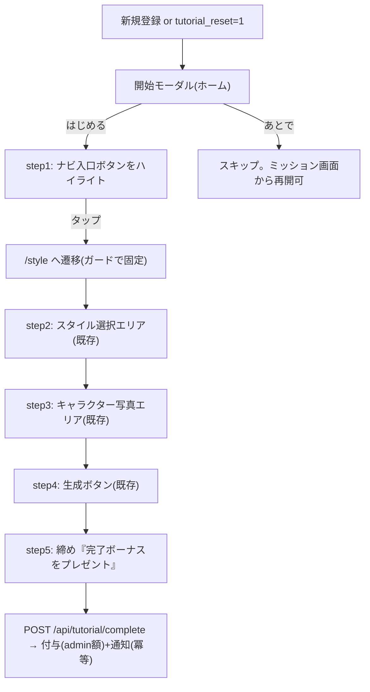

# 新規登録チュートリアルの One-Tap Style ミニツアー化 実装計画書

作成日: 2026-08-08（同日中に2回改訂: /free 移行案 → /style 実生成案 → 本案）
ステータス: 承認済み・実装中

## ゴール

新規登録時のチュートリアルを「コーディネート画面で実際に1枚生成する重いツアー」から、**One-Tap Style 画面の3ステップミニツアーを土台にした軽量ツアー（ツールチップのみ・生成なし・画像挿入なし）**へ置き換える。完了時のペルコイン付与は現行の仕組み（`grant_tour_bonus`・冪等・通知つき・admin 額設定）をそのまま流用し、額はリリース時に admin で **10** にする。

## 決定事項（ユーザー確定 2026-08-08）

| 項目 | 決定 |
|---|---|
| ツアー内容 | **全5ステップ・すべてツールチップのみ**。生成もデモ画像挿入もしない |
| 構成 | ①ナビ入口案内（ホーム・新規作成）→ /style 遷移 → ②スタイル選択 ③キャラクター写真 ④生成ボタン（②〜④は既存ミニツアー流用）→ ⑤締め＋付与 |
| スタイル事前選択 | **しない**（生成しないため固定不要。「好きなスタイルを選ぼう」の既存文言で自然） |
| 無料生成 | **不要になったため廃止**（課金経路・worker には一切触らない） |
| ナビ入口の既定着地 | `DEFAULT_PATH` を `/coordinate` → **`/style`** へ |
| ツアー中のナビ遷移先 | #499 のガードを拡張し、ツアー中は**常に /style** へ（直近モード復帰より優先） |
| 完了付与額 | **10**（リリース時に admin `/admin/percoin-defaults` の `tour_bonus` 20→10。コード変更不要） |
| 旧コーデ版ツアー | 削除（デモ画像・プロンプト注入・生成完了待ちの配線ごと撤去） |
| 既存ミニツアー（StyleTourButton） | **現状維持**（/style 上の手動リプレイとして併存。新ツアーはステップ定義を共用） |

## トレードオフ（記録）

ツアー内での「実生成の成功体験」は失うが、現行ツアーの生成は**デモ画像（他人のキャラ）**であり本質的な感動（うちの子で生成）はもともと提供できていない。ツアー終了時点でユーザーは /style におり、完了ボーナス10で初回生成1回分がまかなえるため実害は小さい、と判断（ユーザー合意済み）。

## コードベース調査結果（2026-08-08 検証済み）

| 対象 | 場所 | 含意 |
|---|---|---|
| オーケストレーター | `features/tutorial/components/TutorialTourProvider.tsx` | 遷移 `router.push` と再開判定を /style へ。デモ画像・プロンプト・生成完了待ち・ギャラリー切替のイベント群は削除 |
| 旧ステップ定義 | `features/tutorial/lib/tour-steps.ts` | 11ステップ → 5ステップへ全面改稿 |
| 既存ミニツアー | `features/style/lib/style-tour-steps.ts`（3ステップ: `style-tour-preset` / `style-tour-character` / `style-tour-generate`） | アンカーは `StylePageClient` に実装済み。**StylePageClient への改修は不要** |
| ナビ詰まりガード | `isTutorialTourInProgress()`（#499） | ツアー中の遷移先を「差し替えスキップ(/coordinate)」から「**/style 固定**」へ拡張（NavigationBar / AppSidebar） |
| ナビ既定 | `features/generation/lib/generation-mode-preference.ts` `DEFAULT_PATH` | `/style` へ変更 |
| 完了API/報酬 | `app/api/tutorial/complete/route.ts` → `grant_tour_bonus` RPC | 無改修（冪等・通知・admin 額） |
| 付与額のUI表示 | `features/tutorial/lib/constants.ts` `TUTORIAL_BONUS_AMOUNT=20`（ハードコード） | admin 設定値参照へ（`useUsageRewardAmounts` の5分TTLキャッシュ方式を踏襲した小さな API+フック） |
| 再実行導線 | `ChallengeTutorialCard` → `CoordinateTourButton` | /style 版へ差し替え |
| 文言 | `messages/{15言語}.ts` `tutorial` セクション | 新規は①ナビ案内と⑤締めのみ。②〜④は style ミニツアーの既存キーを共用。旧コーデツアー用キーは削除 |

## 新フロー

## EARS（主要要件）

- When 新規ユーザーが開始モーダルで「はじめる」を選ぶ, the system shall ナビ入口をハイライトし、タップで `/style` に遷移する（ツアー中は直近モード復帰より優先）
- When `/style` に到達しミニツアーの3アンカーが揃う, the system shall ②〜④のステップを順に表示する
- When ⑤締めステップで完了操作をする, the system shall `grant_tour_bonus` により付与・通知し（冪等）、`tutorial_completed` を立てる
- If ユーザーがスキップする, then the system shall `tutorial_completed` を更新せず、ミッション画面から再開可能にする
- Where `?tutorial_reset=1`, the system shall 完了・スキップ状態に関わらず開始モーダルを再表示する（付与は冪等で0）
- While ツアー表示中, the system shall 生成・課金経路に一切影響を与えない（ツールチップのみ）

## 実装計画

### Phase 1: ツアー本体の /style 化＋5ステップ化
- [ ] `tour-steps.ts`: 5ステップへ改稿（②〜④は style-tour-steps のアンカー/文言を共用）
- [ ] `TutorialTourProvider`: 遷移・再開判定を /style へ。旧イベント配線（デモ画像・プロンプト・生成完了待ち・ギャラリー）削除。⑤で完了API呼び出し
- [ ] `generation-mode-preference.ts`: `DEFAULT_PATH` → `/style`
- [ ] NavigationBar / AppSidebar: ツアー中は生成入口の遷移先を `/style` 固定（#499 ガードの拡張）

### Phase 2: 文言（15言語）
- [ ] ①ナビ案内・⑤締めの新キー追加、旧コーデツアーキー削除

### Phase 3: 付与額表示の admin 値化
- [ ] `GET /api/percoin/tour-bonus`（`get_percoin_bonus_default('tour_bonus')` を返す・キャッシュ）＋クライアントフック
- [ ] `TUTORIAL_BONUS_AMOUNT` 参照箇所（開始モーダル・ミッションカード・⑤締め等）を置換・定数削除

### Phase 4: 再実行導線
- [ ] `CoordinateTourButton` → /style 版へ差し替え（`ChallengeTutorialCard` 含む）

### Phase 5: 検証・PR
- [ ] 単体テスト（ステップ構成・ガード遷移先・付与額フック）
- [ ] `npm run lint` / `typecheck` / `test` / `build -- --webpack`
- [ ] 実機（`tutorial_reset=1`）: モバイル/PC × 開始→/style→②〜④→⑤→付与(冪等0)。新規垢で実付与
- [ ] PR（本計画書同梱・日本語）

### リリース時（ユーザーと一緒に）
- [ ] admin `/admin/percoin-defaults`: `tour_bonus` 20 → **10**

DB・API スキーマ変更: **なし** ／ Edge Function: **なし**

## 品質・テスト観点

- [ ] 生成・課金経路に無変更（ツアーはツールチップのみ）
- [ ] 既存完了者・スキップ者に再表示されない／付与の冪等性維持
- [ ] ツアー中のナビタップが必ず /style に着地（モバイル/PC・直近モードが style/free/coordinate いずれでも）
- [ ] StyleTourButton（手動リプレイ）が従来どおり動く
- [ ] 付与額表示が admin 設定に追従（取得失敗時は額を出さない等 fail-safe）

## ロールバック方針

- コード revert のみで旧ツアーへ復帰（DB・worker 変更なし）
