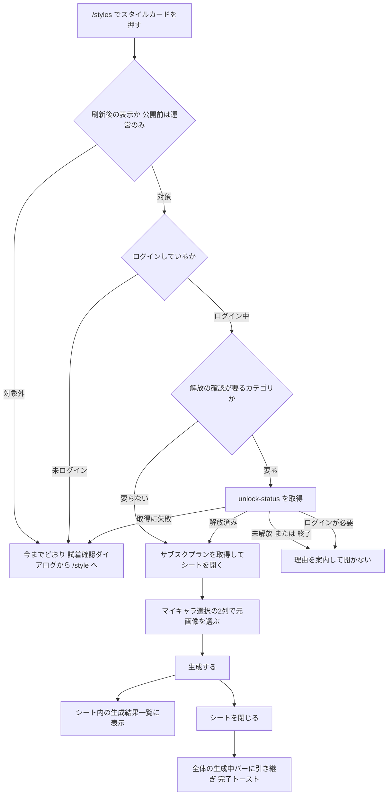
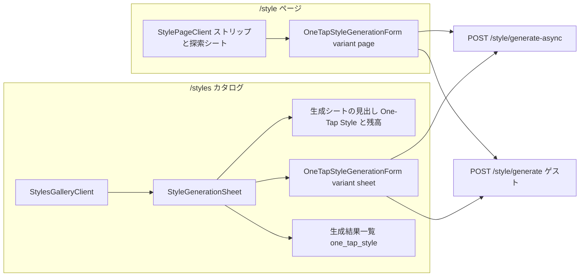
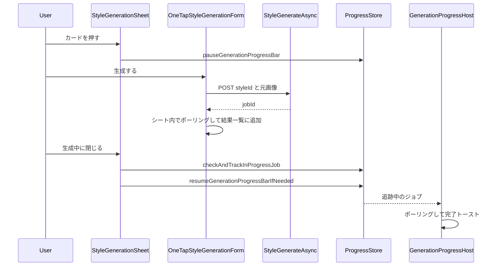
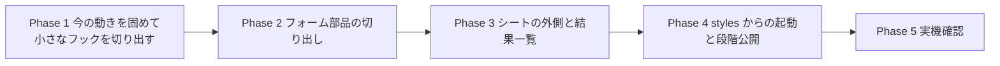

# Persta.AI ORIGINAL 生成シート（`/styles` からその場で One-Tap Style 生成）実装計画

`/styles`（Persta.AI ORIGINAL）のスタイルカードを押したとき、確認ダイアログから `/style` へ
移動する代わりに**ボトムシートを開き、そのスタイルに固定した One-Tap Style の生成をその場で完結させる**。
User ORIGINAL の「このプロンプトで生成する」（`PromptLockedGenerationSheet`）と同じ手触りにする。

生成フォームは `StylePageClient` から**スタイル固定の部品として切り出し**、`/style` ページとシートで共用する。

- 作成日: 2026-09-26
- 関連:
  - `docs/planning/user-original-styles-implementation-plan.md`（User ORIGINAL / 段階公開の仕組み）
  - PR #642（カタログ刷新。`useStylesCatalogRevamp` の導入）

---

## 0. ユーザーが決めたこと（前提・変更禁止）

| 論点 | 決定 |
|---|---|
| カードを押したとき | **確認ダイアログなしで、すぐシートを開く**（刷新後のみ） |
| シートの見た目 | **Free Style のボトムシート（`PromptLockedGenerationSheet`）と同じ感じ**。スマホはボトムシート、PC は左入力・右結果の2列モーダル |
| 元画像の選択 | **One-Tap Style のマイキャラ選択と同じ2列**（My Character ／ Style）。左右に並ぶスタイル画像が「何を生成するか」の表示を兼ねる |
| 生成結果 | **シートの中に生成結果一覧を出す**（Free Style のシートと同じ） |
| フォーム | `/style` と**同じ部品を共用**する（フォームを2つ持たない） |
| `/style` ページ | **見た目も動きも変えない** |
| 公開範囲 | **User ORIGINAL と同じ段階公開**（`useStylesCatalogRevamp`）。公開前は運営のみ。User ORIGINAL を一般公開すると、シートも同時に全員へ出る（ADR-008） |
| 含めない | `/styles/[slug]`・ホームのカルーセル・`/style` の探索シートの動き、シートからの投稿導線、DB / API の変更 |
| 未ログイン | **シートを開かず、今の「試着確認 → `/style`」のまま**（§0-2、2026-09-26 決定） |
| 未解放・終了の企画スタイル | シートを開かず、理由を案内する（投稿詳細と同じダイアログ） |

### 0-1. 段階公開の判定（2026-09-26 決定）

**User ORIGINAL と同じ判定（`useStylesCatalogRevamp`）に乗せる。**

- `useStylesCatalogRevamp`（`features/style-presets/hooks/useStylesCatalogRevamp.ts`）は `useUserStylesAvailable()` をそのまま返す。
- そのため、`NEXT_PUBLIC_USER_STYLES_ENABLED` を立てた時点で、生成シートも全員に出る。
- シート専用の判定（別の公開フラグ）を作る案も検討したが、採らなかった（ADR-008）。
- ⚠️ **User ORIGINAL を一般公開する前に、シートの実機確認（Phase 5）を終えておくこと。**

### 0-2. 未ログインの人にはシートを開かない（2026-09-26 決定）

当初は「お試し可のスタイルはシートで生成できる」としていた。しかし着手前の詳細調査で、**ゲストの「保存」がシートでは完結しない**ことが分かったため、A に決めた。

- 保存の流れ（`features/wardrobe/hooks/use-wardrobe-save.ts`）:
  1. ゲストが「保存」を押すと、画像を退避する
  2. サインアップへ進む
  3. 元の URL に `?claim_wardrobe=1` を付けて戻る
  4. **戻った先のページで動いている `useWardrobeSave` が保存する**
- シートは `/styles` の上に開くため、戻り先は `/styles` になる。そこにはシートが開いていないので保存処理が動かず、**画像が保存されない**。
- ゲストの結果は、シートを閉じると消える（`clearGuestGeneration` はアンマウント時に走る。`StylePageClient.tsx:665-676`）。ゲストは 1 日 1 回しか生成できないので、下へ引いてうっかり閉じると取り返せない。

**選択肢:**
- **A（採用）: 未ログインの人にはシートを開かず、今の「試着確認 → `/style`」のままにする。**
  - `/style` はゲストの生成・透かし付きダウンロード・保存まで、今すでに完結している。
  - シートでゲストを扱うための分岐がすべて不要になる。
- **B（不採用）: ゲストにもシートを開く。**
  - 保存の戻り先を `/style?style=<id>&claim_wardrobe=1` に向ける口を `useWardrobeSave` に足す。
  - 結果があるときに閉じようとしたら確認を出す。

---

## 1. コードベース調査結果

### 1-1. One-Tap Style の生成は Free Style と別経路

| | Free Style（User ORIGINAL のシート） | One-Tap Style |
|---|---|---|
| フォーム | `GenerationFormContainer`（`mode="free"`, `promptLocked`） | `StylePageClient` に一体化（2,744 行） |
| 生成 API | `POST /api/generate-async`（プロンプト） | ログイン時 `POST /style/generate-async`、未ログイン時 `POST /style/generate`（同期） |
| 送る内容 | プロンプト・画像 | `styleId`・`sourceImageType`・`backgroundChange`・`model`・`posePrompt?`・`uploadImage2?`・`userPrompt?`・`outputAspectRatioMode?`・元画像 1 種 |

- One-Tap の送信の分岐と送信内容は `features/style/components/StylePageClient.tsx:1713-1774`（非同期）と `1433-1541`（同期）にある。
- 未ログインの非同期生成は 401（`app/(app)/style/generate-async/handler.ts:143-146`）。未ログインは同期ルートを使う。
- **帰結: Free Style のフォームは流用できない。** One-Tap のフォームを `StylePageClient` から切り出す（ADR-001）。

### 1-2. `StylePageClient` の構造（切り出しの境目）

`StylePageClient.tsx` の JSX（1920-2742）の並び:

| 区画 | 行 | 行き先 |
|---|---|---|
| A. スタイル選択（ストリップ・探索シート・お気に入り・生成済みバッジ） | 1922-2013 | **ページに残す** |
| B1. マイキャラ選択の2列（左 `ImageUploader` "My Character"／右 `StyleReferencePanel` "Style"）＋`ImageSourcePickerTrigger` | 2017-2130 | **フォームへ**（シートでもこの2列を出す） |
| B2. `GenerationTipCard` | 2132-2140 | フォームへ |
| B3. オプション（画像タイプ・2枚目の参照画像・追加プロンプト・背景変更・ポーズ・比率・モデル・生成ボタン・残高・状態カード） | 2142-2519 | フォームへ |
| C. エラー＋登録 CTA | 2522-2541 | フォームへ |
| D. 結果パネル `GenerationResultPanel` | 2550-2617 | フォームへ |
| E. ダイアログ群（結果リセット確認・ゲスト回数制限・AuthModal・Upsell・`ImageSourcePicker` 等） | 2619-2741 | フォームへ（`lockedRequestedReason` ダイアログ 2666-2702 だけページに残す） |

**状態と処理**
- **フォームへ移すもの:**
  - 元画像（427-439）
  - 各入力（453-475）
  - モデル・比率の保存（867-934、キーは `features/generation/lib/form-preferences.ts`）
  - 追加プロンプトの保存（533-546、`features/style/lib/user-prompt-recall.ts`）
  - 送信（1433-1862）
  - ポーリングと再開（1600-1691）
  - 回数制限（1041-1057）、残高（1059-1104）
  - 結果表示（483-496, 654-688, 971-1021）
  - スタイル変更時のリセット（527-554）
- **ページに残すもの:**
  - `selectedPresetId` と URL 同期（424-426, 1145-1167）
  - ストリップのドラッグ（1235-1307）と中央寄せ（1119-1143）
  - `visit` イベント（1902-1918）
- **ページとフォームの取り合い:**
  - スタイル切り替え時の「結果リセット確認」（`runAfterResultResetCheck` 1181-1199）は、フォームの状態（生成中・結果あり・ゲストの結果固定）を読む。
  - ストリップのカードを押せなくする判定（1976）も同じ状態を読む。
  - → フォームから状態を通知し、リセット確認を親から呼べる口が要る（ADR-005）。

### 1-3. ページ前提の処理（シートの中で困るもの）

| 処理 | 場所 | シートでの扱い |
|---|---|---|
| `scrollSectionIntoView`（`scrollIntoView({block:"center"})`） | 779-790, 853-857, 987-993, 1010 | シートでは無効。シートの本文だけをスクロールする（ADR-004） |
| `router.refresh()`（生成成功後） | 1563-1570 | ページだけで行う。シートでは `/api/revalidate/style` だけ呼ぶ |
| sessionStorage のジョブ再開 `persta:style:active-async-job` | `features/style/lib/active-async-job-storage.ts:16`、`StylePageClient.tsx:1652-1691` | シートは読まない・書かない（ADR-003） |
| チュートリアルの目印 `data-tour`（3か所） | 1922, 2017, 2389 | シートでは出さない（`TutorialTourProvider` が `querySelector` で探すため、重複させない） |
| ログイン中は結果パネルを出さない（`showResultPanel={!user}`） | `features/style/components/StylePageBody.tsx:214-216` | シートでは結果を**生成結果一覧**で見せる（ADR-006） |
| `useSearchParams` を使うフック（`useCurrentUrlForRedirect`, `useWardrobeSave`） | `lib/build-current-url.ts:19-20`、`features/wardrobe/hooks/use-wardrobe-save.ts:137-139` | `/styles` は静的シェル。シートは `Suspense` の内側に置く（動的 import なので自然に満たす） |
| `ImageSourcePicker` 自体が vaul の Drawer | `features/generation/components/ImageSourcePicker/ImageSourcePicker.tsx:488-489` | Drawer の入れ子になる。User ORIGINAL のシートで同じ組み合わせが既に動いている。実機で確認する |
| ゲスト用の共有ストア（バナー・サイドバー） | 665-676 | アンマウントで消える。シートを閉じたらゲストの結果が消える（`/style` を離れたときと同じ） |
| ゲストの保存（`?claim_wardrobe=1` で戻って保存） | `features/wardrobe/hooks/use-wardrobe-save.ts` | 戻り先の `/styles` にはシートが無く、保存されない（§0-2） |
| 生成完了トースト（「結果を見る」でスクロール） | 995-1021 | シートでは出さない。結果は同じシートの一覧にすぐ出る |

### 1-4. Free Style シートの外側（流用するもの）

`features/generation/components/PromptLockedGenerationSheet.tsx`
- **画面幅の判定:** `useIsDesktopViewport()`（768px）。
- **PC:** shadcn `Dialog`（幅・高さはインライン指定 193-200）で、左右それぞれがスクロールする。
- **スマホ:** vaul `Drawer`（高さ `92dvh`、本文 `overflow-y-auto`、229-253）。
- **閉じても生成を続ける仕組み:**
  - `useGenerationProgressAvailable()` のときに、開いている間は `pauseGenerationProgressBar()`、閉じたら `resumeGenerationProgressBarIfNeeded()`（124-132）。
  - 閉じる操作で `checkAndTrackInProgressJob()` を呼ぶ（139-147）。
- **生成タイプを問わない:** 生成中ジョブの取得（`app/api/generation-status/in-progress/route.ts:30-35`）と状態取得は `generation_type` で絞らない。
  → **One-Tap のジョブも全体の生成中バーに引き継げる**（シートを閉じた後の完了トーストも出る）。

**そのままでは使えない部分:**
- **見出し** `PromptLockedGenerationHeader.tsx`:
  - `free` 名前空間と `getPercoinPurchaseUrl("free")` が固定。
  - 残高は `GET /api/credits/balance` をクライアントで1回取得している。
- **結果一覧** `PromptLockedGenerationResults.tsx`:
  - 生成タイプが `"free"` 固定（64-66）、見出しは `free.resultsTitle`（116）。
  - `GenerationStateContext` の `previewImages` と、DB の最新4件を合わせて出す。
  - One-Tap のフォームは `upsertPreviewImage` を呼んでいない（`StylePageClient.tsx:942-969` は件数・生成中フラグだけ同期）。

### 1-5. `/styles` 側で使えるデータ

- **ギャラリーは Suspense の中で認証済み。** `StylesGallerySection`（`app/(styles-catalog)/styles/page.tsx:76-95`）は既に `getUser()`／`isAdminViewer()` を呼んでいる。
  → `canUseFreePose` などの閲覧者依存の値は、ここからプロップで渡せる（静的シェルと JSON-LD は崩れない）。
- **サブスクプラン:** `GET /api/users/me/subscription-plan`（`FollowAndUsePromptButton.tsx:97-116` と同じく、開く直前に取得）。
- **残高:** `GET /api/credits/balance`。**回数制限:** `GET /style/rate-limit-status`（フォームが自前で取得）。
- **スタイルの情報:** `StylePresetPublicSummary` は `/style` と同じ型・同じ取得関数。フォームが必要とする項目はそろっている（2枚目の参照画像の URL はサーバーが解決するので不要）。
- **未解放の企画スタイルが `/styles` に並んでいる。** `/styles` は `applyCollectionUnlockGating` を通していない（`page.tsx:80`）。
  - 開く前に `GET /api/style-presets/[id]/unlock-status` で確認する。
  - 既存の呼び出し例は `features/style-presets/components/StylePresetGenerateCta.tsx`。
  - 確認が要るかは `categoryNeedsUnlockContext(preset.category)` で判定できる。
- **生成後のコレクション演出:** `CollectionProgressChecker` は `AppShell` にあり、`/styles` でも動く。フォームが `COLLECTION_PROGRESS_REFRESH_EVENT` を出せば即時に出る。

### 1-6. サーバー側で強制されていること（クライアントの判定は見た目だけ）

`/style/generate-async` はサーバー側で次を検証する（`handler.ts`）。
- 公開状態・`admin_only`・掲載期間（178-184）
- 解放状況（194-212）
- ポーズ指定は運営のみ（236-285）
- 各カテゴリで表示するコントロール（286-295）
- 元画像は1種類だけ（342-359）
- 2枚目の参照画像（386-409）
- 追加プロンプトの長さ（412-427）
- 残高（430-456）

**無料プランのモデル制限はクライアントだけ**（handler はサブスクプランを読まない）。今回は既存の `/style` と同じ扱いで、変えない。

---

## 2. 概要図

### 2-1. 画面の流れ



### 2-2. 部品の関係



### 2-3. ログイン中の生成とシートを閉じたときの引き継ぎ



---

## 3. EARS 要件

### シートを開く

- **REQ-001** When a viewer for whom `useStylesCatalogRevamp` is true taps a style card on `/styles`, the system shall open the generation sheet for that style without the try-on confirm dialog.
  （刷新後の表示の閲覧者（公開前は運営のみ）が `/styles` のカードを押したら、確認ダイアログを出さずにそのスタイルの生成シートを開く）
- **REQ-002** While `useStylesCatalogRevamp` is false for the viewer, the system shall keep the current behavior (try-on confirm dialog, then navigate to `/style?style=<id>`).
  （対象外の閲覧者には、今の「試着確認 → `/style` へ移動」を続ける）
- **REQ-003** When the tapped style belongs to a gated category and `unlock-status` returns `locked` or `ended`, the system shall not open the sheet and shall show the same reason as `/style`.
  （未解放・終了の企画スタイルはシートを開かず、`/style` と同じ理由を案内する）
- **REQ-004** If the viewer is signed out, then the system shall not open the sheet and shall keep the current try-on confirm dialog, then navigate to `/style?style=<id>`.
  （未ログインならシートは開かず、今の「試着確認 → `/style`」にする。§0-2）
- **REQ-005** If `unlock-status` or the subscription-plan request fails, then the system shall fall back to the current confirm-and-navigate behavior.
  （確認の取得に失敗したら、今の「確認して `/style` へ移動」に戻す）

### シートの中身

- **REQ-010** The sheet shall show the One-Tap Style title, description and the viewer's percoin balance at the top, in the same layout as the Free Style sheet.
  （先頭に One-Tap Style の見出し・説明・保有ペルコインを、Free Style のシートと同じ並びで出す）
- **REQ-011** The sheet shall show the source-image picker as the same two-column block as `/style` (My Character / Style), with the tapped style fixed.
  （元画像の選択は `/style` と同じ2列で出し、右側のスタイルは押したものに固定する）
- **REQ-012** The sheet shall show exactly the per-category controls that `/style` shows for that style (source image type, background change, user prompt, dual reference, aspect ratio, model).
  （スタイルごとの入力欄は `/style` と同じものを出す）
- **REQ-013** The sheet shall not render the preset strip, the browse sheet, or tutorial anchors (`data-tour`).
  （スタイル選択の一覧・探索シート・チュートリアルの目印は出さない）
- **REQ-014** While generating or after completion, the sheet shall list the viewer's recent One-Tap Style results (latest first), including the in-progress preview.
  （生成中と生成後は、One-Tap Style の最近の生成結果を、生成中のものを含めて新しい順に一覧で出す）

### 生成と引き継ぎ

- **REQ-020** When the viewer submits in the sheet, the system shall call `POST /style/generate-async` with the same fields as `/style`.
  （シートでは、`/style` と同じ内容で `/style/generate-async` を呼ぶ。シートを開くのはログイン中だけなので、ゲスト用の同期経路は使わない）
- **REQ-021** When the viewer closes the sheet while a job is running, the system shall hand the job to the global generation progress bar (`checkAndTrackInProgressJob`).
  （生成中に閉じたら、全体の生成中バーに引き継ぐ）
- **REQ-022** While the sheet is open, the system shall pause the global progress bar (`pauseGenerationProgressBar`).
  （シートが開いている間は、全体の生成中バーを止める）
- **REQ-023** The sheet shall neither read nor write the `/style` job-resume key (`persta:style:active-async-job`).
  （シートは `/style` のジョブ再開キーを読み書きしない）
- **REQ-024** When a sheet job succeeds, the system shall revalidate the `/style` gallery (`POST /api/revalidate/style`), record the `generate` usage event, and dispatch `COLLECTION_PROGRESS_REFRESH_EVENT`. It shall not call `router.refresh()`.
  （成功したら、`/style` のギャラリーの再検証・利用イベント・コレクション演出の合図を行う。`/styles` のページ全体は再読み込みしない）

### `/style` を変えない

- **REQ-030** The `/style` page shall render and behave identically before and after the extraction, including result-reset confirm, job resume, scroll-into-view, tutorial anchors and `router.refresh()`.
  （`/style` は切り出しの前後で見た目も動きも同じにする）

---

## 4. ADR

### ADR-001: Free Style のフォームではなく、One-Tap のフォームを `StylePageClient` から切り出して共用する

- **Context:** ユーザーは「Free Style のシートと同じ感じ」を望んでいる。ただし生成の API と送る内容が別物（§1-1）。
- **Decision:** シートの外側（Drawer/Dialog・見出し・結果一覧・生成中バーとの連携）は Free Style のシートを踏襲する。中身の入力と送信は、`StylePageClient` から切り出した `OneTapStyleGenerationForm` を `/style` と共用する。
- **Reason:**
  - Free Style のフォームを One-Tap 対応に広げると、カテゴリごとの入力やゲストの同期経路まで抱えることになり、2つのモードが1つの部品で絡む。
  - 逆に One-Tap のフォームを複製すると、「片方だけ直して壊す」事故を繰り返す（`PromptLockedGenerationSheet.tsx:47-50` の記録と同じ理由）。
- **Consequence:** `StylePageClient`（2,744 行）の大きなリファクタになる。先にキャラクタリゼーションテストで今の動きを固め、段階的に切り出す（Phase 1-2）。

### ADR-002: ページとシートの違いは `variant` で切り替える

- **Context:** ページ前提の処理（§1-3）がフォームの中に散らばっている。
- **Decision:** `variant: "page" | "sheet"` を1つ持ち、次を `variant` で分岐する。
  - scrollIntoView
  - `router.refresh()`
  - ジョブ再開
  - `data-tour`
  - ログイン中の結果パネル
- **Reason:** 真偽値のプロップを5つ持つより、読み手が「シートでは何が違うか」を1か所で追える。
- **Consequence:** `variant` による分岐はフォーム内に閉じる。新しい違いが増えたらここに足す。

### ADR-003: シートは `/style` のジョブ再開キーを使わず、全体の生成中バーに引き継ぐ

- **Context:**
  - `/style` は sessionStorage の `persta:style:active-async-job` で、ページを開き直したときにジョブを再開する（`StylePageClient.tsx:1652-1691`）。
  - シートが同じキーを使うと、`/style` を開いたときにシートのジョブを拾い、完了を二重に知らせる。
  - 違うスタイルのジョブを拾う恐れもある。
- **Decision:** シートは再開キーを読まない・書かない。閉じたら `checkAndTrackInProgressJob()` で全体の生成中バーに渡す（User ORIGINAL のシートと同じ）。
- **Reason:** 全体の生成中バーの仕組みは `generation_type` を問わず One-Tap のジョブを扱える（§1-4）。仕組みを増やさずに済む。
- **Consequence:** 全体の生成中バーが無効な閲覧者（`useGenerationProgressAvailable()` が false）は、閉じた後の完了がシートの外では分からない。結果はマイページと `/style` の一覧に残る。User ORIGINAL のシートと同じ扱い。

### ADR-004: シートではページのスクロールをしない

- **Context:** `scrollIntoView` は祖先のスクロール領域も動かすため、Drawer の下のページまで動くことがある。
- **Decision:** `variant="sheet"` では `scrollSectionIntoView` を呼ばない。必要ならシートの本文（`overflow-y-auto` の要素）だけを `scrollTo` する。

### ADR-005: ページとフォームの取り合いは「状態の通知」と「リセット確認の呼び出し口」で解く

- **Context:** `/style` のストリップは、フォームの状態（生成中・結果あり・ゲストの結果固定）を読んで、カードを押せなくしたりリセット確認を出したりする（1181-1199, 1976）。
- **Decision:**
  - フォームは `onStatusChange({ isGenerating, isGuestResultLocked, effectiveAuthState })` で状態を親へ知らせる。
    - ページはこれで、ストリップのカードを押せなくする（1976）。
    - ゲスト向けのカード表示（1958-1961）、探索シート・お気に入りのログイン判定（575-578, 2008）にも使う。
  - 親は `ref` 経由で2つの操作を呼ぶ（React 19 なので `forwardRef` は不要）。
    - `requestChange(action)`：`runAfterResultResetCheck` を通して `action` を実行し、エラーと結果を消す（1215-1225 の中身）。
    - `openAuthModal()`：未解放スタイルの案内ダイアログ（ページに残す）の「ログイン」から呼ぶ（2686-2691）。
  - シートでは使わない。
- **Reason:** フォームを `key={preset.id}` で作り直す案は簡単だが、今の「結果を消してよいか」の確認が消えて `/style` の動きが変わる（REQ-030 に反する）。

### ADR-006: シートの結果は「生成結果一覧」で見せる（ログイン中も）

- **Context:**
  - `/style` のログイン中は、結果パネルを出さず、ページ下の `CachedGeneratedImageGallery` が結果を担う（`StylePageBody.tsx:214-216, 224-237`）。
  - シートにはそのギャラリーが無い。
- **Decision:**
  - `PromptLockedGenerationResults` を、生成タイプと見出しの名前空間を受け取れる形に広げる（既定は今の `"free"`）。シートでは `one_tap_style` と `style.resultsTitle` で使う。
  - **プレビュー（`upsertPreviewImage`）は流さない。** 結果一覧は今の作りのまま、次のように動く。
    - フォームが生成中（running / completing）の間、`GenerationStateContext` の `generatingCount` でスケルトンを出す（`StylePageClient.tsx:946-969`、`PromptLockedGenerationResults.tsx:118-122`）。
    - 表示待ち（5 秒、`RESULT_REVEAL_DELAY_MS`）が終わって `isGenerating` が落ちたら、DB の最新 4 件を引き直す（`PromptLockedGenerationResults.tsx:55-98`）。
    - このとき生成画像はすでに DB にある。
  - 結果パネル（`GenerationResultPanel`）はシートでは出さない（シートを開くのはログイン中だけ。§0-2）。
- **Consequence:**
  - `/style` のログイン中と同じ見え方（スケルトン → 一覧に追加）になる。プレビューを流さないので、プレビューと DB の行の二重表示も起きない。
  - Free Style のシートで起こりうる二重表示（`PromptLockedGenerationResults.tsx:101-106` の id による重複除去が、プレビューと DB の行に効かない）は、今回の範囲外。実機で起きているかは未確認のため、別件として扱う。

### ADR-007: 開く前の確認（解放状況・ログイン・プラン）はカード側で行う

- **Context:** `/styles` は未解放の企画スタイルも普通に並べている（§1-5）。フォームは未解放なら生成ボタンを押せなくするだけで、理由は出さない。
- **Decision:** カードを押したら、`categoryNeedsUnlockContext` が真のときだけ `unlock-status` を呼ぶ。結果に応じて「開かない（理由を案内）／ログイン誘導／開く」に分ける。
  - 理由の文言は `OneTapStyleDetailCard.tsx` と `StylePageClient` の `lockedRequestedReason` ダイアログにある既存のキーを使う。
- **Reason:** シートを開いてから押せないボタンを見せるより、押した時点で分かるほうがよい。サーバーでも生成時に再検証される（§1-6）ので、ここは案内の役割。

### ADR-008: 段階公開は User ORIGINAL と同じ判定（`useStylesCatalogRevamp`）に乗せる

- **Context:**
  - シートは「表示の刷新」ではなく生成の新しい入口で、実機での検証量が多い。
  - `useStylesCatalogRevamp` は User ORIGINAL の公開フラグと一体。
- **Decision:** シート専用の判定は作らず、`useStylesCatalogRevamp` が真のときにシートを開く（ユーザー決定、2026-09-26）。
- **Reason:** シートの入口（Persta.AI ORIGINAL のカード）は、刷新後のカタログ（Catalog ／ 2つのタブ）の一部で、公開時期をそろえるほうが自然。公開フラグと Provider/Loader を増やさずに済む。
- **Consequence:**
  - User ORIGINAL を一般公開すると、シートも同時に全員へ出る。一般公開の前に Phase 5 の実機確認を終えておく必要がある。
  - 後で切り離したくなったら、`useStylesCatalogRevamp` の隣にシート専用のフックを足し、カード側の判定だけ差し替えればよい。
  - 検討して採らなかった案: `NEXT_PUBLIC_STYLES_GENERATION_SHEET_ENABLED`＋運営昇格の Provider/Loader（`UserStylesAvailability*` と同じ形）。

### ADR-009: フォームの切り出しは「コードをそのまま移す」。フックへの分解は後回し

- **Context:**
  - 当初は、回数制限・残高・モデル保存・ポーリングをフックに分けてから切り出す計画だった。
  - しかし送信・ポーリング・確定の処理は、フォームの `setState` を多数呼び合う閉じた関数になっている（1390-1405, 1433-1862）。
- **Decision:** B〜E の JSX と関連する状態・処理を、**書き換えずに** `OneTapStyleGenerationForm` へ移す。変えるのは `variant` による分岐と、ページとの口（ADR-005）だけ。
- **Reason:**
  - 分解しながら移すと、差分が「移動」と「書き換え」の混ざったものになり、`/style` を変えていないことをレビューで確かめにくい。
  - 移すだけなら、既存テスト 50 件がそのまま安全網になる。
- **Consequence:**
  - フォームは約 2,000 行のまま残る。
  - フックへの分解は、必要になったら別 PR で行う。

### ADR-010: 未解放・終了・要ログインの案内ダイアログは、投稿詳細のものを部品にして共用する

- **Context:** 案内ダイアログ（文言キー・ボタンの出し分け）が `OneTapStyleDetailCard.tsx`（投稿詳細）にだけある。
- **Decision:** そのダイアログを `PresetUnlockNoticeDialog` として切り出し、投稿詳細と `/styles` のカードで使う。
- **Reason:** 同じ状態（`PresetUnlockState`）に対する案内を2か所で書くと、文言や分岐がずれる。

---

## 5. 実装計画

### フェーズ間の依存関係



各フェーズの終わりで次を通す。
- `npm run lint`（今回変えたファイルに新しいエラーがない）
- `npm run test`
- `npm run build -- --webpack`

`/style` の動きが変わっていないことを、各フェーズで確認する。

### Phase 1: 今の動きをテストで固める（コードは変えない）

目的: 切り出しで壊れやすいのに、既存テスト（`tests/unit/features/style/style-page-client.test.tsx`、約 50 件）が守っていない動きを先に固める。

- [ ] 足すテスト（すべて `StylePageClient` に対して。§10-4 に詳細）
  - チュートリアルの目印 `data-tour` が3つ出る
  - 未解放の `?style=` の案内ダイアログ（sequential / prerequisite / login_required）と、その「ログイン」で認証モーダルが開く
  - `requestedModel` が初期モデルに反映される
  - 運営（`canUseFreePose`）だけにポーズ指定欄が出て、入力が `posePrompt` として送られる
  - 2 枚目の参照画像（dual + user_upload）が `uploadImage2` として送られる
  - 非同期生成の成功後に、`/api/revalidate/style` → `router.refresh()`、`COLLECTION_PROGRESS_REFRESH_EVENT` の発火
  - 探索シートからスタイルを選ぶと、結果があるときはリセット確認を通る
  - ゲストの結果にワードローブ保存ボタンが出る

ビルド確認: 既存テストと追加テストがすべて通る（コードは変えていない）。

### Phase 2: `OneTapStyleGenerationForm` の切り出し（`/style` は同じ表示）

目的: §1-2 の B〜E をフォーム部品にし、`StylePageClient` はスタイル選択とフォームを並べるだけにする（ADR-009: コードは移すだけ）。

- [ ] `features/style/components/OneTapStyleGenerationForm.tsx` を新設する。プロップと操作は §10-1
- [ ] `variant` の分岐（ADR-002、§10-2）を入れる。`"page"` は今の動きのまま
- [ ] `StylePageClient` に残すのは次だけ（§10-3）
  - ストリップ、探索シート、お気に入り
  - 未解放の案内ダイアログ
  - `visit` イベント
  - URL との同期
- [ ] Phase 1 のテストを含む既存テストが、**テストを変えずに**通ることを確認する

ビルド確認: `/style` の見た目の差分がない（dev サーバーでスマホ・PC のスクリーンショットを比べる）。

### Phase 3: シートの外側と結果一覧

目的: User ORIGINAL のシートと同じ外側で、One-Tap のフォームを包む。

- [ ] `PromptLockedGenerationHeader` を、名前空間・購入導線の参照元（`free` / `style`）を受け取れる形に広げる。`/free` 側の表示は変えない
- [ ] `PromptLockedGenerationResults` を、`generationType` と見出しキーを受け取れる形に広げる。既定値は今の `"free"`
- [ ] `features/style/components/StyleGenerationSheet.tsx` を新設する。`PromptLockedGenerationSheet` の外側を踏襲し、次を入れる。
  - `useIsDesktopViewport`、vaul Drawer / Dialog、生成中バーの一時停止と引き継ぎ
  - `GenerationStateProvider`
  - 中身は `OneTapStyleGenerationForm variant="sheet"`
- [ ] i18n: シートの読み上げ用タイトル・説明（`style.generationSheetTitle` / `generationSheetDescription`）を15ロケールに追加する。結果一覧の見出しは既存の `style.resultsTitle`（「生成結果」）を使う

ビルド確認: シート単体のテスト（開閉・生成中バーの一時停止と引き継ぎ・結果一覧の生成タイプ）が通る。

### Phase 4: `/styles` からの起動と段階公開

目的: 運営だけ、カードを押したらシートが開く。

- [ ] `StylesGallerySection`（`app/(styles-catalog)/styles/page.tsx`）から `canUseFreePose` を `StylesGalleryClient` に渡す
- [ ] `StylesGalleryClient` のカードを押したときの処理を分岐する（ADR-007）
  1. 刷新後（`useStylesCatalogRevamp`）か
  2. `categoryNeedsUnlockContext` なら `unlock-status` を取得
  3. ログインを確認（未ログインは今の確認ダイアログ。§0-2）
  4. サブスクプランを取得（`FollowAndUsePromptButton` と同じ）
  5. シートを開く
- [ ] 対象外、または確認の取得に失敗したときは、今の `StyleTryOnConfirmDialog` → `/style` のまま（REQ-002, REQ-005）
- [ ] シートは `next/dynamic`（`ssr:false`）で読み込む。押した人だけが重さを払う
- [ ] 未解放・終了・要ログインの案内は、`OneTapStyleDetailCard.tsx` から切り出した `PresetUnlockNoticeDialog` を使う（ADR-010）

ビルド確認:
- 刷新後の表示でない閲覧者では、`/styles` の挙動が今と同じ（テストで固定）
- 対象の運営ではシートが開く
- `/styles` の静的シェルと JSON-LD が崩れていない（build の出力で `/styles` が ◐ のまま）

### Phase 5: 実機確認と仕上げ

- [ ] 運営アカウントで、iOS Safari・Android Chrome・PC Chrome を確認する
  - 開く・元画像の選択（Drawer の入れ子）・生成・結果一覧・生成中に閉じたときの引き継ぎと完了トースト
- [ ] 一般アカウント・未ログインで、今と同じ「試着確認 → `/style`」になることを確認する
- [ ] 未ログインでは、お試し可・不可どちらのスタイルでも、今の「試着確認 → `/style`」になることを確認する
- [ ] 企画スタイル（順番解放・前提未達・終了）の案内を確認する
- [ ] 生成後に `/style` を開いても、シートのジョブが二重に完了扱いにならないことを確認する

---

## 6. 修正対象ファイル一覧

| ファイル | 操作 | 変更内容 |
|---|---|---|
| `features/style/components/StylePageClient.tsx` | 修正 | フォームを切り出し、スタイル選択・未解放案内・`visit` だけにする |
| `features/style/components/OneTapStyleGenerationForm.tsx` | 新規 | スタイル固定の生成フォーム（`variant`） |
| `features/style/components/StyleGenerationSheet.tsx` | 新規 | シートの外側（Drawer / Dialog・生成中バー連携） |
| `features/generation/components/PromptLockedGenerationHeader.tsx` | 修正 | 名前空間・購入導線の参照元を受け取る（既定は今の Free） |
| `features/generation/components/PromptLockedGenerationResults.tsx` | 修正 | 生成タイプ・見出しの名前空間を受け取る（既定は今の Free） |
| `features/style/components/PresetUnlockNoticeDialog.tsx` | 新規 | 未解放・終了・要ログインの案内（`OneTapStyleDetailCard.tsx` から切り出し） |
| `features/style/components/OneTapStyleDetailCard.tsx` | 修正 | 上の部品を使う（表示は変えない） |
| `features/style-presets/components/StylesGalleryClient.tsx` | 修正 | カードを押したときの分岐（シート／今の確認ダイアログ） |
| `app/(styles-catalog)/styles/page.tsx` | 修正 | `canUseFreePose` を渡す |
| `messages/*.ts`（15 ロケール） | 修正 | シートの読み上げ用タイトル・説明、結果一覧の見出し |
| `tests/unit/features/style/*` | 新規・修正 | キャラクタリゼーション、フォーム、シート、フック |
| `tests/unit/features/style-presets/styles-gallery-client.test.tsx` | 修正 | カードを押したときの分岐 |

DB・マイグレーション・API ルートの変更はない。

---

## 7. 品質・テスト観点

### 品質チェックリスト

- [ ] **`/style` の不変:** 切り出しの前後で、表示・入力・送信内容・再開・スクロール・チュートリアルが同じ（REQ-030）
- [ ] **権限:**
  - 刷新後の表示でない閲覧者にはシートが出ない
  - 未解放・終了・`admin_only` はサーバーでも拒否される（既存）
  - ポーズ指定は運営のみ（既存）
- [ ] **二重処理:** シートのジョブを `/style` が再開しない。完了トーストが二重に出ない
- [ ] **静的シェル:** `/styles` の見出し・JSON-LD が初期 HTML に残る
- [ ] **重さ:** シートは押した人だけが読み込む（`next/dynamic`）
- [ ] **i18n:** 追加キーが15ロケールにそろう

### テスト観点

| カテゴリ | テスト内容 |
|---|---|
| 正常系 | 運営がカードを押す → シートが開く → 元画像を選ぶ → 生成 → 結果一覧に出る |
| 正常系 | 生成中に閉じる → `checkAndTrackInProgressJob` が呼ばれる → 生成中バーが引き継ぐ |
| 正常系 | 未ログインは今の「試着確認 → `/style`」のまま |
| 異常系 | `unlock-status`・プラン取得の失敗で、今の確認ダイアログに戻る |
| 異常系 | 残高不足・回数制限・生成失敗の表示が `/style` と同じ |
| 権限 | 一般・未ログインは今の挙動のまま。未解放・終了は開かない |
| 回帰 | `/style` のスタイル切り替え時のリセット確認、ジョブ再開、チュートリアル |
| 実機 | Drawer の入れ子（元画像の選択）、iOS のキーボード、92dvh の高さ |

### テスト実装手順

`/test-flow OneTapStyleGenerationForm` から、`/spec-extract` → `/spec-write` → `/test-generate` → `/test-reviewing` → `/spec-verify` の順で行う。

---

## 8. ロールバック方針

- **段階公開:** シートは `useStylesCatalogRevamp` が真のときだけ出る。
  - 公開前（運営のみ）に問題があれば、ブランチを revert すれば今の確認ダイアログに戻る。
  - 一般公開後に問題が出た場合、フラグを戻すと User ORIGINAL も一緒に隠れる。シートだけ止めたいときは、カード側の判定を外す修正を出す（ADR-008）。
- **フェーズごとの PR:** Phase 1-2 は `/style` のリファクタ（表示の変化なし）、Phase 3-4 はシート。フェーズ単位で `revert` できる。
- **DB・API の変更なし:** マイグレーションの巻き戻しは不要。

---

## 9. 使用スキル

| スキル | 用途 | フェーズ |
|---|---|---|
| `/characterization-testing` | `/style` の今の動きを固める | Phase 1 |
| `/test-flow` ほかテスト系 | フォームとシートのテスト | Phase 2-4 |
| `/codex-webpack-build` | ビルド確認 | 各フェーズ |
| `/git-create-branch` | ブランチ作成 | 実装開始時 |
| `/git-create-pr` | PR 作成 | 各フェーズの完了時 |

---

## 10. 実装メモ（着手前の詳細調査、2026-09-26）

行番号は、調査時点の `features/style/components/StylePageClient.tsx`（2,744 行）のもの。

### 10-1. `OneTapStyleGenerationForm` のプロップと操作

```ts
type OneTapStyleGenerationFormProps = {
  /** 生成するスタイル。/style では選択中のもの、シートでは押したもので固定 */
  preset: StylePresetPublicSummary | null;
  variant: "page" | "sheet";
  initialAuthState?: "authenticated" | "guest";
  subscriptionPlan?: SubscriptionPlan;
  canUseFreePose?: boolean;
  /** /style だけ(`?model=`) */
  requestedModel?: string | null;
  /** 既定 true。/style はログイン中 false(StylePageBody.tsx:216)、シートは false */
  showResultPanel?: boolean;
  /**
   * 利用イベントの categoryKey を styleId から引く。
   * /style はジョブ再開で preset と別のスタイルの結果を確定しうるので、presets から引く(1571-1581)。
   * 既定は styleId === preset.id のときだけ preset.category.key
   */
  resolveCategoryKey?: (styleId: string) => string | null;
  onStatusChange?: (status: {
    isGenerating: boolean;
    isGuestResultLocked: boolean;
    effectiveAuthState: "authenticated" | "guest" | null;
  }) => void;
  ref?: React.Ref<OneTapStyleGenerationFormHandle>;
};

type OneTapStyleGenerationFormHandle = {
  /** 結果があればリセット確認を出し、同意後に action → エラーと結果を消す(1215-1225) */
  requestChange: (action: () => void) => void;
  /** 未解放の案内ダイアログの「ログイン」から(2686-2691) */
  openAuthModal: () => void;
};
```

**フォームへ移すもの:**
- 状態:
  - 427-518 から、ページ側の分を除いたもの
  - ページ側の分: `selectedPresetId`、ストリップのドラッグ、`isBrowseSheetOpen`、`hasTrackedVisitRef`、`syncedSelectedPresetParamRef`、`presetButtonRefs`、`presetStripRef`
- 導出値: 519-777（`selectedPreset` は `preset` プロップに置き換える）
- 処理:
  - 779-1117（1119-1167 の2つの effect はページへ）
  - 1169-1213、1309-1900
- JSX: 2015-2741（2662-2702 の未解放の案内ダイアログはページへ）
- 小さな関数と定数（206-264, 295-379）

`StyleErrorState` などの型も一緒に移す。

### 10-2. `variant` で変える処理

| 処理 | 場所 | `"page"` | `"sheet"` |
|---|---|---|---|
| `data-tour`（style-tour-character / style-tour-generate） | 2017, 2389 | 付ける | 付けない（style-tour-preset 1922 はページ側） |
| ジョブの保存と再開（`persistActiveStyleJob` / 再開 effect） | 1842-1845, 1652-1691 | する | しない（ADR-003） |
| 成功後の `router.refresh()` | 1569 | する | しない（`/api/revalidate/style` は呼ぶ） |
| 生成開始時のスクロール | 987-993 | する | しない（ADR-004） |
| 生成完了トースト | 995-1021 | 出す | 出さない（結果はシートの一覧に出る） |
| 結果画像の読み込み後の再スクロール | 848-857 | する | しない（トーストを出さないので起きない） |

### 10-3. `StylePageClient` に残すもの

- **ストリップ**（1922-1994）:
  - ドラッグ（1235-1307）と中央寄せ（1119-1143）
  - カードの `disabled` とゲスト用表示には `onStatusChange` の値を使う
- **探索シート**（1997-2012）と、お気に入り（575-578）
  - `isAuthenticated` には `onStatusChange` の `effectiveAuthState` を使う。最初の値は `initialAuthState`
- **URL との同期**（1145-1167）、`visit` イベント（1902-1918）
- **未解放の案内ダイアログ**（2662-2702）。「ログイン」ボタンは `formRef.current?.openAuthModal()`
- **スタイルの切り替え:** `handlePresetSelect` は `formRef.current?.requestChange(() => setSelectedPresetId(id))` に置き換える
- **フォームへ渡すもの:** `resolveCategoryKey={(id) => presets.find((p) => p.id === id)?.category.key ?? null}`

### 10-4. Phase 1 で足すテスト

既存の土台（`tests/unit/features/style/style-page-client.test.tsx`）の fetch キュー・`flushReactScheduler`・`next/navigation` のモックを使う。

| テスト | 確かめること |
|---|---|
| 目印 | `[data-tour="style-tour-preset"]`・`style-tour-character`・`style-tour-generate` がそれぞれ1つ |
| 未解放の案内 | `lockedRequestedReason` ごとのタイトル・説明、login_required の「ログイン」で `mock-auth-modal` が出る |
| モデル指定 | `resolveRequestedModelFromUrl`（`features/generation/lib/model-config.ts`）を通る既知のモデル値を `requestedModel` に渡すと、初期モデルに反映される。未知の値は無視される |
| ポーズ指定 | `canUseFreePose` かつログイン中だけ欄が出て、入力が FormData の `posePrompt` に入る。ゲスト・`skipBasePrefix` では出ない |
| 2枚目の参照画像 | dual + user_upload のプリセットで、選んだファイルが `uploadImage2` として送られる |
| 成功後の処理 | 非同期成功で `/api/revalidate/style` への POST → `router.refresh()`、`COLLECTION_PROGRESS_REFRESH_EVENT` が window に出る |
| 探索シート | 結果があるときに探索シートから選ぶと、リセット確認を経て切り替わる |
| ゲストの保存 | ゲストの結果にワードローブ保存ボタンが出る |

### 10-5. `/styles` でカードを押したときの流れ

`StylesGalleryClient`（`features/style-presets/components/StylesGalleryClient.tsx`）の `onSelect`（今は `setConfirmingPreset`、267-271）を置き換える。

1. **刷新後でない、または未ログインのとき:** `setConfirmingPreset(preset)` を呼ぶ（今のまま）。
   - 未ログインかは、`isAuthenticated`（マウント後に `supabase.auth.getUser()` で決まる。91-123）で判定する。
2. **二度押しを止める:** 処理中は `pendingPresetId` を立てる。
3. **解放状況の確認:** `categoryNeedsUnlockContext(preset.category)` が真のときだけ、`GET /api/style-presets/:id/unlock-status` を呼ぶ。
   - `locked` / `ended` / `login_required` のときは、`PresetUnlockNoticeDialog` を出して終わり。
   - 取得に失敗したときは `setConfirmingPreset(preset)`（今のまま。REQ-005）。
   - この関数はブラウザで使える純粋関数（`features/collections/lib/collection-unlock.ts:81`）。
4. **サブスクプランの取得:** `GET /api/users/me/subscription-plan`（初回だけ取得して state に置く。`FollowAndUsePromptButton.tsx:97-116` と同じ）。
5. **シートを開く:** `setSheetPreset(preset)`。シートは `next/dynamic`（`ssr:false`）で読み込み、`{sheetPreset && plan ? <StyleGenerationSheet .../> : null}` で描く（閉じたらアンマウント）。

**`StylesGallerySection` から渡すもの:**
`canUseFreePose={isAdminViewerFlag}` を渡す（`app/(styles-catalog)/styles/page.tsx:76-95`。すでに `getUser()` / `isAdminViewer()` を呼んでいる）。

### 10-6. `StyleGenerationSheet` の骨組み

`PromptLockedGenerationSheet.tsx` をなぞる。

- **プロップ:** `open` / `onOpenChange` / `preset` / `subscriptionPlan` / `canUseFreePose`
- **画面幅の判定:** `useIsDesktopViewport()` で分ける。
  - **PC:** `Dialog`（幅・高さは同じインライン指定）。左列に見出しとフォーム、右列に結果一覧。
  - **スマホ:** vaul `Drawer`（`92dvh`）。本文に見出し・フォーム・結果一覧。
- **見出し:** `PromptLockedGenerationHeader` を `style` 名前空間・参照元 `"style"` で使う。
- **包むもの:** 全体を `GenerationStateProvider` で包む。
- **生成中バーとの連携:** `PromptLockedGenerationSheet.tsx:124-147` と同じ。
  - `useGenerationProgressAvailable()`
  - `open` を見た一時停止と再開
  - 閉じるときの `checkAndTrackInProgressJob()`
- **フォーム:** `<OneTapStyleGenerationForm variant="sheet" preset={preset} initialAuthState="authenticated" showResultPanel={false} .../>`

### 10-7. 注意点

- **`/styles` の静的シェル:**
  - フォームの中の `useCurrentUrlForRedirect` と `useWardrobeSave` は `useSearchParams` を使う。
  - シートを `ssr:false` で読み込めば、サーバーで描かれないので問題ない（build の出力で `/styles` が ◐ のままか確認する）。
- **認証モーダルの戻り先:**
  - モデルの鍵やアップセルから開く認証モーダルは、今の URL（`/styles`）へ戻る。
  - シートを開くのはログイン中だけ（§0-2）なので、実際に開くのは Upsell だけ。
- **ペルコイン購入ボタン:** `router.push(getPercoinPurchaseUrl())`（2476）でページを移動する。シートは閉じるが、それで問題ない。
- **`useGptImage25Available`:** Provider が `components/LocaleShell.tsx` にあるので、`/styles` でもそのまま効く。
- **入れ子の Drawer:** 元画像の選択（`ImageSourcePicker`）はスマホで vaul の Drawer を開く。Free Style のシート（`GenerationForm.tsx`）でも同じ入れ子が本番で動いているが、実機確認の対象に入れる。
- **サーバー側の検証:** 生成 API は、プリセットの公開状態・解放・`admin_only`・ポーズ指定・残高をサーバーで再検証する（§1-6）。カード側の確認は案内のためのもので、抜けても不正な生成はできない。

