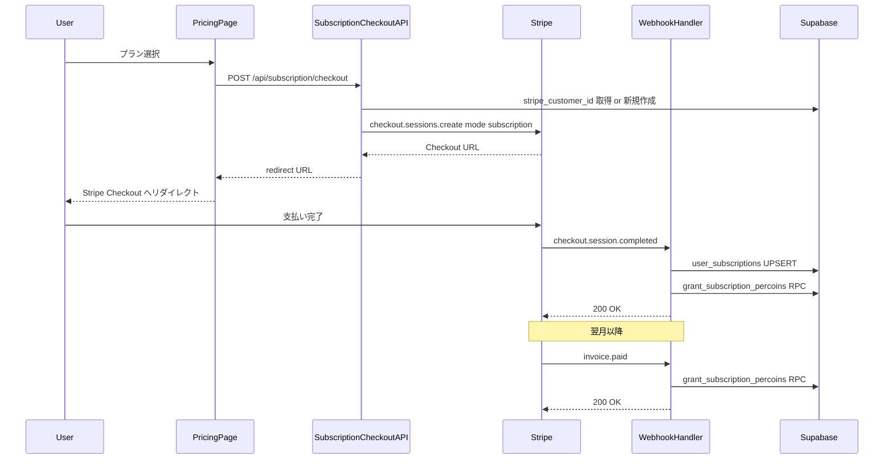
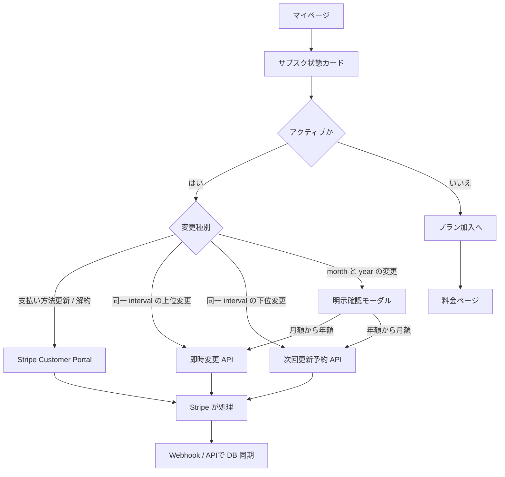
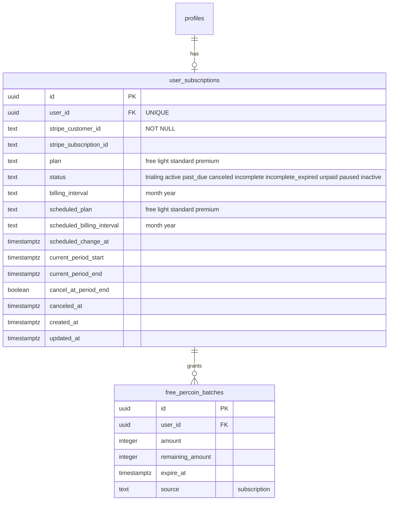
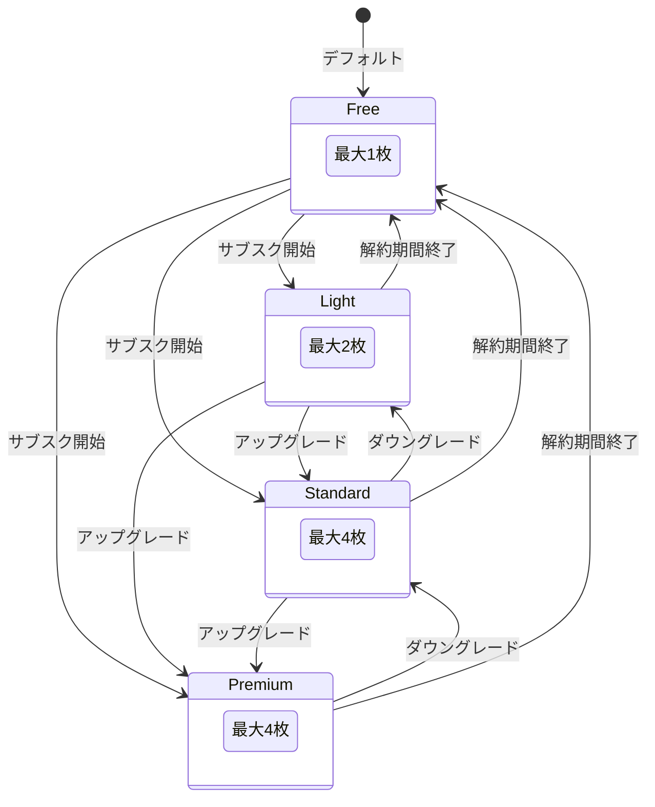
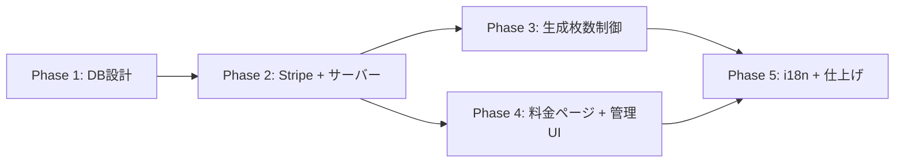

# サブスクリプション機能 実装計画

## コードベース調査結果

### 既存パターン

| 領域 | 既存パターン | 参照ファイル |
|------|-------------|-------------|
| Stripe Checkout | `mode: "payment"`, `client_reference_id`, `metadata` でペルコイン数を渡す | `app/api/credits/checkout/route.ts` |
| Webhook | `checkout.session.completed` のみ処理。`stripe_payment_intent_id` でべき等性保証 | `app/api/stripe/webhook/route.ts` |
| ペルコイン付与 | `recordPercoinPurchase` → `apply_percoin_transaction` RPC（`purchase_paid` / `purchase_promo`） | `features/credits/lib/percoin-service.ts` |
| ボーナス付与 | `grant_daily_post_bonus` / `grant_streak_bonus` → `free_percoin_batches` INSERT + `user_credits` 加算 | `supabase/migrations/20260228000001_*.sql` |
| 生成枚数 | フォーム側 `[1,2,3,4]` ハードコード、Zod `count.max(4)` はあるが、`generateImageAsync()` は `count` を送らず、コンテナが `count` 分だけ 1 枚ジョブを送信 | `features/generation/components/GenerationForm.tsx:588-622`、`features/generation/lib/schema.ts:70`、`features/generation/lib/async-api.ts:169-221`、`GenerationFormContainer.tsx:737-772` |
| i18n | `.ts` ファイル（`messages/ja.ts`, `messages/en.ts`）、`clientNamespaces` ホワイトリスト | `i18n/messages.ts` |
| プロフィール | `profiles.subscription_plan` カラムは存在し、現行の許可値は `free/plan_a/plan_b/plan_c`。現在の実データは全件 `free` | `.cursor/rules/database-design.mdc`、`supabase/migrations/20250123140000_add_generation_types_and_stock_images.sql` |
| ストック画像上限 | `get_stock_image_limit` / `insert_source_image_stock` が `profiles.subscription_plan` を参照。現行上限は free=3, plan_a=10, plan_b=30, plan_c=50 | `supabase/migrations/20250123140001_*.sql`、`20260214150000_*.sql`、`features/generation/lib/server-database.ts` |
| ユーザー名表示 | 投稿詳細: `PostDetailStatic.tsx:208-216`、プロフィール: `ProfileHeader.tsx:112-156` | — |
| Stripe Customer | **未実装** — 現在のワンタイム購入フローでは Customer オブジェクトを作成・保存していない | — |

### 影響範囲

- **Stripe Webhook**: サブスクイベント対応で大幅拡張が必要
- **生成フォーム**: 枚数ボタンのプラン制限 + アップセル UI
- **ストック画像**: プラン別上限の再設計 + 既存 over-limit ユーザーの扱い整理
- **料金ページ**: サブスクプラン表示の追加
- **マイページ**: サブスク状態カード追加
- **ボーナス RPC**: 倍率パラメータの追加
- **i18n**: `subscription` 名前空間の新規追加

---

## 1. 概要図

### サブスクリプション購入フロー



### サブスクリプション管理フロー



### データモデル



### 生成枚数制御の状態



---

## 2. EARS（要件定義）

### サブスクリプション購入

| ID | Type | Specification (EN) | 仕様 (JA) |
|----|------|--------------------|-----------|
| SUB-001 | Event | When a user selects a subscription plan on the pricing page, the system shall create a Stripe Checkout session in subscription mode and redirect the user | ユーザーが料金ページでプランを選択したとき、システムはサブスクリプションモードの Stripe Checkout セッションを作成しリダイレクトする |
| SUB-002 | Event | When Stripe fires `checkout.session.completed` with mode=subscription, the system shall create/update the user_subscriptions record and grant monthly percoins | Stripe が mode=subscription の `checkout.session.completed` を発火したとき、user_subscriptions を作成/更新し月間ペルコインを付与する |
| SUB-003 | Event | When Stripe fires `invoice.paid` for a subscription renewal with `billing_reason=subscription_cycle`, the system shall grant monthly percoins for the new billing period | サブスク更新の `invoice.paid` を `billing_reason=subscription_cycle` で受信したとき、新しい請求期間のペルコインを付与する |
| SUB-004 | Event | When Stripe fires `customer.subscription.updated`, the system shall update the user_subscriptions record (plan, status, period, cancel_at_period_end) | `customer.subscription.updated` を受信したとき、user_subscriptions レコードを更新する |
| SUB-005 | Event | When Stripe fires `customer.subscription.deleted`, the system shall set status to 'canceled' and sync profiles.subscription_plan to 'free' | `customer.subscription.deleted` を受信したとき、ステータスを canceled に変更し profiles.subscription_plan を free に同期する |

### 生成枚数制御

| ID | Type | Specification (EN) | 仕様 (JA) |
|----|------|--------------------|-----------|
| GEN-001 | State | While the user's subscription_plan is 'free', the coordinate screen shall expose only the 1-image option as selectable | ユーザーのプランが free の間、コーディネート画面では 1 枚のみ選択可能にする |
| GEN-002 | State | While the user's subscription_plan is 'light', the coordinate screen shall expose only the 1-image and 2-image options as selectable | プランが light の間、コーディネート画面では 1 枚と 2 枚のみ選択可能にする |
| GEN-003 | State | While the user's subscription_plan is 'standard' or 'premium', the coordinate screen shall expose the 1-image through 4-image options as selectable | プランが standard/premium の間、コーディネート画面では 1 枚から 4 枚まで選択可能にする |
| GEN-004 | Event | When a user taps a locked generation count option, the system shall show a subscription upsell dialog instead of changing the selected count | ユーザーがロックされた枚数オプションをタップしたとき、選択値は変えずにサブスク案内ダイアログを表示する |
| GEN-005 | Abnormal | If the client detects a selected count above the user's plan limit because of stale state or a plan downgrade, the system shall clamp the count to the plan limit before submitting jobs | stale state やプラン変更で選択枚数が上限を超えていた場合、クライアントは送信前に上限値へ補正する |

### ボーナス倍率

| ID | Type | Specification (EN) | 仕様 (JA) |
|----|------|--------------------|-----------|
| BON-001 | State | While the user has an active subscription, the system shall apply the plan-specific bonus multiplier (light: 1.2x, standard: 1.5x, premium: 2.0x) to daily post and streak bonuses | アクティブなサブスクがある間、プラン別のボーナス倍率をデイリー投稿/ストリークボーナスに適用する |

### ストック画像上限

| ID | Type | Specification (EN) | 仕様 (JA) |
|----|------|--------------------|-----------|
| STK-001 | State | While the user's subscription_plan is 'free', the system shall allow at most 2 active stock images | プランが free の間、アクティブなストック画像は最大 2 枚まで許可する |
| STK-002 | State | While the user's subscription_plan is 'light', the system shall allow at most 5 active stock images | プランが light の間、アクティブなストック画像は最大 5 枚まで許可する |
| STK-003 | State | While the user's subscription_plan is 'standard', the system shall allow at most 10 active stock images | プランが standard の間、アクティブなストック画像は最大 10 枚まで許可する |
| STK-004 | State | While the user's subscription_plan is 'premium', the system shall allow at most 30 active stock images | プランが premium の間、アクティブなストック画像は最大 30 枚まで許可する |
| STK-005 | Abnormal | If adding a stock image would exceed the user's current plan limit, the system shall reject only the new stock creation request | 新しいストック画像追加で現在プランの上限を超える場合、新規追加リクエストのみ拒否する |
| STK-006 | State | If a user already exceeds the current stock limit because of a downgrade or legacy rules, the system shall keep existing stock images accessible and block additional stock creation until the count is within the limit | ダウングレードや旧ルールにより既に上限超過している場合、既存ストック画像は保持したまま、新規追加のみ上限内に戻るまで停止する |

### 無償ペルコイン上限

| ID | Type | Specification (EN) | 仕様 (JA) |
|----|------|--------------------|-----------|
| CAP-001 | Abnormal | If granting free percoins would exceed the 50,000 balance cap, the system shall grant only the amount up to the cap | 無償ペルコイン付与で残高が50,000を超える場合、上限までの差分のみ付与する |

### サブスク管理

| ID | Type | Specification (EN) | 仕様 (JA) |
|----|------|--------------------|-----------|
| MGT-001 | Event | When an active subscriber clicks "Manage subscription", the system shall redirect to Stripe Customer Portal | サブスク会員が「サブスク管理」をクリックしたとき、Stripe Customer Portal へリダイレクトする |
| MGT-002 | State | While a user has an active subscription, the system shall display the subscription badge next to their nickname | サブスクがアクティブの間、ニックネーム横にサブスクバッジを表示する |

### プラン変更

| ID | Type | Specification (EN) | 仕様 (JA) |
|----|------|--------------------|-----------|
| CHG-001 | Event | When an active subscriber selects a higher plan within the same billing interval, the system shall start a new billing period for the target plan immediately after payment succeeds, end the current plan at that time, and grant the target plan's monthly or yearly percoins in full | アクティブ会員が同じ請求間隔のまま上位プランを選択したとき、システムは支払い成功後ただちに変更先プランの新しい請求期間を開始し、その時点で現在プランを終了して、変更先プランの月額または年額ペルコインを満額付与する |
| CHG-002 | Event | When an active subscriber selects a lower plan within the same billing interval, the system shall keep the current plan active and schedule the lower plan for the next renewal date | アクティブ会員が同じ請求間隔のまま下位プランを選択したとき、システムは現在プランを維持し、次回更新日から下位プランへ切り替える予約を行う |
| CHG-003 | Event | When an active subscriber changes from monthly to yearly billing, the system shall require explicit confirmation and schedule the yearly plan for the next renewal date | アクティブ会員が月額から年額へ変更するとき、システムは明示確認を行い、次回更新日から年額プランへ切り替える予約を行う |
| CHG-004 | Event | When an active subscriber changes from yearly to monthly billing, the system shall require explicit confirmation and schedule the monthly plan for the next renewal date | アクティブ会員が年額から月額へ変更するとき、システムは明示確認を行い、次回更新日から月額プランへ切り替える予約を行う |
| CHG-005 | State | When a change request includes both a plan tier change and a billing interval change, the system shall follow the billing interval rule instead of the same-interval upgrade or downgrade rule | 変更要求にプラン階層変更と請求間隔変更が同時に含まれる場合、システムは上位/下位変更ルールではなく請求間隔変更ルールを優先する |
| CHG-006 | State | While a subscription has a scheduled downgrade or a scheduled billing-interval change, the system shall display the scheduled next plan, billing interval, and effective date in the management UI | ダウングレードや請求間隔変更が予約されている間、システムは次のプラン・請求間隔・反映日を管理 UI に表示する |
| CHG-007 | Abnormal | If payment for an immediate change fails, the system shall keep the current plan unchanged and surface the failure to the user | 即時反映の変更で支払いに失敗した場合、システムは現在プランを変更せず、失敗をユーザーへ通知する |

---

## 3. ADR（設計判断記録）

### ADR-001: user_subscriptions テーブルの分離

- **Context**: サブスク情報を profiles テーブルに直接追加するか、別テーブルにするか
- **Decision**: `user_subscriptions` テーブルを新設し、`profiles.subscription_plan` はトリガーで同期
- **Reason**: Stripe 固有のデータ（subscription_id, period, customer_id）を profiles に混ぜると関心の分離が崩れる。`profiles.subscription_plan` は高頻度の読み取り用キャッシュとして機能させ、トリガーで自動同期する
- **Consequence**: 1テーブル追加。トリガーで整合性を保つため、直接の profiles 更新と競合しないよう注意が必要

### ADR-002: サブスクペルコインの付与方式

- **Context**: サブスクで付与するペルコインを有償枠（paid_balance）にするか無償枠（free_percoin_batches）にするか。また、未使用分を繰り越すかどうか
- **Decision**: `free_percoin_batches` に `source = 'subscription'` で INSERT する。有効期限は既存ボーナスと同じ（JST月初基準 + 7ヶ月 − 1秒）。未使用分は繰り越され、無償ペルコイン残高の上限 50,000 で制御する
- **Reason**: サブスクユーザーは付与されたペルコインを「貯めて使う」体験を期待する。請求期間終了で失効すると不満が生じやすい。既存のボーナス付与RPC と完全に同じ有効期限パターンを使えるため、実装もシンプルになる。上限 50,000 がストッパーとして機能し、無限蓄積を防ぐ
- **Consequence**: 解約後もすでに付与済みのペルコインは有効期限まで残る。上限到達後は新規付与がスキップ（または差分のみ付与）されるため、ユーザーには「上限に達しています」の通知が望ましい

### ADR-003: Webhook でのべき等性

- **Context**: サブスクの Webhook はイベントが重複配信される可能性がある
- **Decision**: `invoice.id` を `credit_transactions.stripe_payment_intent_id` に格納し、一意制約でべき等性を保証する
- **Reason**: 既存のワンタイム購入と同じパターン（`payment_intent_id` でのべき等チェック）を踏襲。invoice.id は請求期間ごとに一意
- **Consequence**: 既存のべき等性チェック列 `stripe_payment_intent_id` を invoice ID にも使い回すため、列名と実際の値の意味がずれる。コメントで明示する

### ADR-004: 生成枚数制御は UI / クライアント送信制御を正本にする

- **Context**: 現行の非同期生成は 1 リクエスト = 1 ジョブであり、複数枚生成はクライアントが `count` 回ループして実現している。Gemini ネイティブ画像生成も「1 回の API 呼び出しで 4 枚をまとめて返す」前提では扱わない
- **Decision**: 枚数制御はコーディネート画面の選択UIと `GenerationFormContainer` のクライアント送信制御を正本にし、サーバー側の `count` チェックは今回のスコープから外す
- **Reason**: 現行APIには `count` が届かず、サーバーで厳密に制御するにはバッチ送信APIかジョブ投入レイヤーの再設計が必要。今回の要件は「free ユーザーが画面上で 1 枚しか選べないこと」で十分なため、UI / クライアントで完結させる方が実装コストに対して合理的
- **Consequence**: 通常導線では要件を満たすが、API 直叩きまで厳密に防ぐ設計ではない。将来的に強い権限制御が必要になった場合は、バッチAPI化またはジョブ投入のサーバー集約を別フェーズで行う

### ADR-005: Stripe Customer の遅延作成

- **Context**: Stripe Customer をユーザー登録時に全員分作成するか、サブスク購入時に初めて作成するか
- **Decision**: サブスク Checkout 開始時に `user_subscriptions` レコードがなければ Stripe Customer を作成し、stripe_customer_id を保存する
- **Reason**: 全ユーザーに Customer を作成するのは無駄（大半はサブスク非加入）。購入時に作成すれば必要最小限のリソースで済む
- **Consequence**: 初回のサブスク Checkout が若干遅くなる（Customer 作成分）。ワンタイム購入フローは変更不要

### ADR-006: ストック画像上限は `subscription_plan` を再利用し、over-limit は grandfather する

- **Context**: 既存のストック画像上限は `profiles.subscription_plan` を参照する RPC で実装済みであり、free=3 / plan_a=10 / plan_b=30 / plan_c=50 の旧マッピングが残っている
- **Decision**: `subscription_plan` の正本値を `free/light/standard/premium` に更新し、ストック画像上限を free=2 / light=5 / standard=10 / premium=30 に再定義する。ダウングレードや旧ルールで既に上限超過しているユーザーは既存ストックを保持し、新規追加のみ停止する
- **Reason**: 既存 RPC パターンを活かしたまま、サブスク特典として自然な上限差を作れる。over-limit ユーザーに対して強制削除を行わないため、既存体験を壊さない
- **Consequence**: 現行データでは free 上限を 2 に下げると一部ユーザーが over-limit になるため、UI で現在数と上限を明示する必要がある。旧 `plan_a/plan_b/plan_c` 制約と RPC 分岐は同一マイグレーションで更新する

### ADR-007: プラン変更は Checkout を再利用せず、Stripe Subscription Update / Schedule に分離する

- **Context**: 既存実装ではアクティブ会員が別プランを押しても `mode: "subscription"` の Checkout を新規作成してしまい、Stripe 上で二重契約になるリスクがある
- **Decision**: 新規加入は Checkout を維持するが、アクティブ会員のプラン変更は `app/api/subscription/change/*` 系 API に分離する。同 interval のアップグレードは `stripe.subscriptions.update` で `billing_cycle_anchor='now'` を指定して新しい請求期間を開始し、ダウングレードや `yearly -> monthly` のような次回更新予約が必要な変更は `subscription schedules` を使う
- **Reason**: Stripe 公式でも既存サブスクリプションの price 変更は `subscription item` を置き換える更新 API を使うのが正道であり、新規 Checkout を重ねるのは誤り。さらに `billing_cycle_anchor='now'` を使えば、アップグレード時に「今この瞬間から新プランの1期間を開始する」という分かりやすい体験を実現できる
- **Consequence**: 変更API、確認モーダル、Webhook の補強が必要になる。即時アップグレード時は旧プランの未使用期間に対する Stripe の proration credit を同一請求書に反映させる方針を取る。Billing Portal は支払い方法更新・解約用に限定し、プラン変更は原則アプリ側 UI から行う

### ADR-008: 予約済み変更は `user_subscriptions` にミラーする

- **Context**: ダウングレードや年額から月額への変更は Stripe 側で次回更新予約として保持されるが、予約情報を DB に持たないと管理 UI で「何がいつ反映されるか」を表示できない
- **Decision**: `user_subscriptions` に `scheduled_plan`, `scheduled_billing_interval`, `scheduled_change_at` を追加し、変更 API 実行時または関連 Webhook 受信時に同期する
- **Reason**: 次回更新予約の状態をアプリ内で即時表示でき、ユーザーサポート時にも DB だけで把握しやすい。将来、通知メールやバナーで「次回更新で変更されます」を出す基盤にもなる
- **Consequence**: `customer.subscription.updated` だけでは予定変更を完全復元できないケースがあるため、変更 API 実行時に DB へ先に記録し、Webhook で最終同期する運用にする

### ADR-009: interval 変更は優先ルールを持つ別フローにする

- **Context**: `monthly -> yearly` や `yearly -> monthly` は、同じプラン階層内のアップグレード/ダウングレードと異なり billing cycle anchor の変更や proration が絡むため、単純な上位/下位判定では扱えない
- **Decision**: interval 変更を含むリクエストは常に「interval 変更フロー」として扱う。`monthly -> yearly` / `yearly -> monthly` はどちらも明示確認後に次回更新予約とする
- **Reason**: 請求間隔変更をすべて次回更新予約に寄せることで、mid-cycle の proration や即時課金、付与経路の抜け道を避けられる。ルールが単純になり、UI と CS の説明も一貫する
- **Consequence**: `standard monthly -> premium yearly` のようにプランと interval が同時に変わる場合でも、判定は interval 変更ルールが優先される。プラン比較 UI にも「請求間隔が変わる場合は別確認が入る」ことを明示する

---

## 4. 実装計画（フェーズ + TODO）

### 確定スペック

| 特典 | 無課金 | ライト ¥980/月 | スタンダード ¥2,480/月 | プレミアム ¥4,980/月 |
|------|--------|----------------|------------------------|----------------------|
| 月間ペルコイン | - | 400 | 1,200 | 3,000 |
| 1回の最大生成枚数 | 1枚 | 2枚 | 4枚 | 4枚 |
| ストック画像上限 | 2枚 | 5枚 | 10枚 | 30枚 |
| サブスクバッジ | - | ○ | ○ | ○ |
| ボーナス倍率 | 1.0倍 | 1.2倍 | 1.5倍 | 2.0倍 |
| 無償ペルコイン残高上限 | 50,000 | 50,000 | 50,000 | 50,000 |

| プラン | 月額 | 年額（15%OFF） | 月額換算 |
|--------|------|----------------|----------|
| ライト | ¥980 | ¥10,000 | ¥833 |
| スタンダード | ¥2,480 | ¥25,300 | ¥2,108 |
| プレミアム | ¥4,980 | ¥50,800 | ¥4,233 |

### プラン変更ポリシー

| 現在 | 変更先 | 反映タイミング | 課金挙動 | UI |
|------|--------|----------------|----------|----|
| light monthly | standard monthly / premium monthly | 即時 | 新しい月額期間をその場で開始。旧プラン未使用分は proration credit として同一請求書に充当し、新プランの請求と即時決済する | ボタン押下で即時変更 |
| standard monthly | premium monthly | 即時 | 新しい月額期間をその場で開始。旧プラン未使用分は proration credit として同一請求書に充当し、新プランの請求と即時決済する | ボタン押下で即時変更 |
| premium monthly | standard monthly / light monthly | 次回更新日 | 直近の請求期間は維持、次回請求から新価格 | 「次回更新から変更」表示 |
| standard monthly | light monthly | 次回更新日 | 同上 | 同上 |
| light yearly | standard yearly / premium yearly | 即時 | 新しい年額期間をその場で開始。旧プラン未使用分は proration credit として同一請求書に充当し、新プランの請求と即時決済する | ボタン押下で即時変更 |
| standard yearly | premium yearly | 即時 | 新しい年額期間をその場で開始。旧プラン未使用分は proration credit として同一請求書に充当し、新プランの請求と即時決済する | ボタン押下で即時変更 |
| premium yearly | standard yearly / light yearly | 次回更新日 | 直近の請求期間は維持、次回請求から新価格 | 「次回更新から変更」表示 |
| standard yearly | light yearly | 次回更新日 | 同上 | 同上 |
| 任意 monthly | 任意 yearly | 明示確認後に次回更新日 | 月額期間を使い切ってから年額へ移行 | 確認モーダル必須 |
| 任意 yearly | 任意 monthly | 明示確認後に次回更新日 | 年額期間を使い切ってから月額へ移行 | 確認モーダル必須 |

### プラン変更時の付与ルール

- 同 interval の即時アップグレードは **新しい請求期間の開始** とみなし、変更先プランのペルコインを満額で即時付与する
- 同 interval の即時アップグレードでは **プラン状態（生成上限・ストック画像上限・バッジ）** もその場で変更先プランへ切り替える
- 同 interval の即時アップグレード後、次回更新日は **変更実行時点から再計算** する
- 即時アップグレード時の請求は、旧プラン未使用期間の credit を反映したうえで Stripe が即時決済する
- ダウングレード予約中も、現在の請求期間が終わるまでは現プランの特典を維持する
- interval 変更は両方向とも次回更新予約とし、現在の請求期間が終わるまでは現プランの状態と付与ルールを維持する

### フェーズ間の依存関係



---

### Phase 1: データベース設計とマイグレーション

**目的**: サブスク管理に必要なテーブル・RPC・トリガーを作成し、既存のボーナス RPC とストック画像上限 RPC を新プラン体系へ揃える

**ビルド確認**: マイグレーション適用後、既存の機能（ワンタイム購入、ボーナス付与、生成）が正常動作すること

- [ ] `user_subscriptions` テーブル作成マイグレーション
  ```sql
  CREATE TABLE public.user_subscriptions (
    id                     uuid PRIMARY KEY DEFAULT gen_random_uuid(),
    user_id                uuid NOT NULL REFERENCES auth.users(id) ON DELETE CASCADE,
    stripe_customer_id     text NOT NULL,
    stripe_subscription_id text,
    plan                   text NOT NULL DEFAULT 'free'
                           CHECK (plan IN ('free', 'light', 'standard', 'premium')),
    status                 text NOT NULL DEFAULT 'inactive'
                           CHECK (status IN ('trialing', 'active', 'past_due', 'canceled', 'incomplete', 'incomplete_expired', 'unpaid', 'paused', 'inactive')),
    billing_interval       text CHECK (billing_interval IN ('month', 'year')),
    scheduled_plan         text
                           CHECK (scheduled_plan IN ('free', 'light', 'standard', 'premium')),
    scheduled_billing_interval text
                           CHECK (scheduled_billing_interval IN ('month', 'year')),
    scheduled_change_at    timestamptz,
    current_period_start   timestamptz,
    current_period_end     timestamptz,
    cancel_at_period_end   boolean NOT NULL DEFAULT false,
    canceled_at            timestamptz,
    created_at             timestamptz NOT NULL DEFAULT now(),
    updated_at             timestamptz NOT NULL DEFAULT now(),
    CONSTRAINT user_subscriptions_user_id_unique UNIQUE (user_id)
  );
  CREATE INDEX user_subscriptions_stripe_customer_id_idx
    ON public.user_subscriptions (stripe_customer_id);
  CREATE INDEX user_subscriptions_stripe_subscription_id_idx
    ON public.user_subscriptions (stripe_subscription_id);
  ```
- [ ] `sync_profile_subscription_plan` トリガー作成
  ```sql
  CREATE OR REPLACE FUNCTION sync_profile_subscription_plan()
  RETURNS TRIGGER AS $$
  BEGIN
    UPDATE public.profiles
    SET subscription_plan =
      CASE WHEN NEW.status IN ('trialing', 'active') THEN NEW.plan ELSE 'free' END,
      updated_at = now()
    WHERE user_id = NEW.user_id;
    RETURN NEW;
  END;
  $$ LANGUAGE plpgsql SECURITY DEFINER;

  CREATE TRIGGER trg_sync_subscription_plan
    AFTER INSERT OR UPDATE ON public.user_subscriptions
    FOR EACH ROW
    EXECUTE FUNCTION sync_profile_subscription_plan();
  ```
- [ ] `profiles.subscription_plan` の許可値を `free/light/standard/premium` に更新
  - 既存 CHECK 制約を旧 `free/plan_a/plan_b/plan_c` から置き換える
  - 現行データは全件 `free` のため、本番データ上の backfill は不要。ただし test/staging に旧値がある場合は制約切替前に手動変換する
- [ ] RLS ポリシー: ユーザーは自分の `user_subscriptions` のみ SELECT 可、INSERT/UPDATE/DELETE は service_role のみ
- [ ] `grant_subscription_percoins` RPC 作成（既存の `grant_daily_post_bonus` パターンを参考）
  - パラメータ: `p_user_id`, `p_amount`, `p_invoice_id`
  - べき等性: `credit_transactions.stripe_payment_intent_id = p_invoice_id` で重複チェック
  - 有効期限: 既存ボーナスと同じ（JST月初基準 + 7ヶ月 − 1秒）— 繰越あり
  - 上限チェック: 付与後の `user_credits.balance - user_credits.paid_balance` が 50,000 を超える場合は差分のみ付与（0なら付与スキップ）
  - `free_percoin_batches` に `source = 'subscription'` で INSERT
- [ ] 既存ボーナス RPC（`grant_daily_post_bonus`, `grant_streak_bonus`）にサブスク倍率を適用
  - `profiles.subscription_plan` を参照し、プランに応じた倍率を乗算
  - 倍率: free=1.0, light=1.2, standard=1.5, premium=2.0
  - 付与後の無償残高が 50,000 を超える場合は上限までに制限
- [ ] 既存ストック画像上限 RPC（`get_stock_image_limit`, `insert_source_image_stock`）を新プラン体系へ更新
  - 上限: free=2, light=5, standard=10, premium=30
  - 旧 `plan_a/plan_b/plan_c` 分岐を削除し、新しい `subscription_plan` 値に置き換える
  - over-limit ユーザーは既存ストックを保持し、新規追加のみ拒否する
- [ ] `.cursor/rules/database-design.mdc` に `user_subscriptions` テーブルを追記

---

### Phase 2: Stripe プロダクト設定 + サーバーサイド統合

**目的**: Stripe にプロダクト・プライスを作成し、サブスク購入・管理の API を実装する

**ビルド確認**: Stripe Checkout でサブスク購入が完了し、Webhook で DB が更新されること

- [ ] Stripe にプロダクト 3 つ + プライス 6 つを作成（Stripe MCP または Dashboard）
  - Light Monthly ¥980 / Light Yearly ¥10,000
  - Standard Monthly ¥2,480 / Standard Yearly ¥25,300
  - Premium Monthly ¥4,980 / Premium Yearly ¥50,800
- [ ] `features/subscription/subscription-config.ts` — プラン定義定数
  - プラン名、月間ペルコイン数、最大生成枚数、ボーナス倍率
  - Stripe Price ID のマッピング（test/live）
  - `getSubscriptionPlan(priceId)` ヘルパー
- [ ] `features/subscription/lib/stripe-customer.ts` — Stripe Customer 管理
  - `getOrCreateStripeCustomer(userId, email)`: `user_subscriptions.stripe_customer_id` を取得、なければ Stripe Customer を作成して `user_subscriptions` に INSERT
  - 既存の `app/api/credits/checkout/route.ts` のパターンを参考（`createAdminClient()` 使用）
- [ ] `app/api/subscription/checkout/route.ts` — サブスク Checkout セッション作成
  - POST: `planId`, `billingInterval` を受け取る
  - アクティブな subscription がある場合は 409 を返し、プラン変更には使用させない
  - `getOrCreateStripeCustomer` で Customer ID を取得
  - `stripe.checkout.sessions.create({ mode: 'subscription', customer, line_items, ... })`
  - `metadata` に `userId`, `plan`, `billingInterval` を付与
  - success_url / cancel_url 設定
- [ ] `features/subscription/lib/change-policy.ts` — 変更種別判定ヘルパー
  - 入力: `currentPlan`, `currentBillingInterval`, `targetPlan`, `targetBillingInterval`
  - 出力: `same_interval_upgrade` / `same_interval_downgrade` / `monthly_to_yearly` / `yearly_to_monthly` / `no_change`
  - `billingInterval` が変わる場合は常に interval 変更を優先
- [ ] `app/api/subscription/change-preview/route.ts` — 変更内容の事前確認 API
  - 即時反映系（同 interval アップグレード）は Stripe の upcoming invoice / proration preview を返す
  - 次回更新系（同 interval ダウングレード、monthly→yearly、yearly→monthly）は `effectiveAt=current_period_end` と target plan を返す
  - 確認モーダル用に「即時請求の有無」「次回更新日」「現在プラン」「変更後プラン」を整形
- [ ] `app/api/subscription/change/route.ts` — アクティブ会員向けプラン変更 API
  - 同 interval アップグレード:
    - `stripe.subscriptions.update`
    - `items[0][id]` を指定して現在 price を置き換える
    - `billing_cycle_anchor='now'`
    - `proration_behavior='create_prorations'`
    - `payment_behavior='pending_if_incomplete'`
    - 支払い成功時のみ変更確定
    - 変更成功時に `grant_subscription_percoins` を即時実行し、新プランの満額ペルコインを付与
  - 同 interval ダウングレード:
    - `subscription schedules` で `current_period_end` から target price を開始
    - `user_subscriptions.scheduled_*` を更新
  - `monthly -> yearly`:
    - 明示確認済みフラグ必須
    - `subscription schedules` で次回更新日から反映
  - `yearly -> monthly`:
    - 明示確認済みフラグ必須
    - `subscription schedules` で次回更新日から反映
  - `no_change` は 400 を返す
- [ ] `app/api/subscription/portal/route.ts` — Customer Portal セッション作成
  - POST: 認証ユーザーの `stripe_customer_id` を取得
  - `stripe.billingPortal.sessions.create({ customer, return_url })`
  - Customer Portal では **支払い方法更新 / 請求書確認 / 解約** を主用途とし、プラン変更はアプリ側 UI を正本とする
- [ ] `app/api/stripe/webhook/route.ts` の拡張 — サブスクイベント対応
  - `checkout.session.completed` に `mode === 'subscription'` 分岐を追加
    - `user_subscriptions` UPSERT（plan, status, billing_interval, period_start/end）
    - `grant_subscription_percoins` RPC 呼び出し
  - `invoice.paid` ハンドラ追加（サブスク更新時のペルコイン付与）
    - `billing_reason === 'subscription_cycle'` の場合のみ処理
    - `grant_subscription_percoins` RPC 呼び出し（invoice.id でべき等性保証）
  - `customer.subscription.updated` ハンドラ追加
    - `user_subscriptions` の plan, status, period, cancel_at_period_end を更新
    - schedule 由来の予約情報がある場合は `scheduled_*` を同期 or クリア
  - `customer.subscription.deleted` ハンドラ追加
    - status を `'canceled'` に変更（トリガーで `profiles.subscription_plan = 'free'` に同期）
  - `invoice.payment_failed` ハンドラ追加
    - status を `'past_due'` に更新（トリガーで `profiles.subscription_plan = 'free'` に同期）
- [ ] `features/subscription/lib/server-api.ts` — サブスク状態取得
  - `getUserSubscription(userId)`: `user_subscriptions` から取得するサーバー関数
  - キャッシュタグ: `subscription-ui-${userId}`
- [ ] サブスク状態を描画する cached surface に `subscription-ui-${userId}` を追加
  - 対象: `CachedMyPageContent`, `CachedUserProfileData`, `CachedPostDetail`
- [ ] Webhook の revalidateTag に `subscription-ui-${userId}` を追加し、既存の `my-page-*` などと併用する

---

### Phase 3: 生成枚数制御 + アップセル UI

**目的**: プランに応じた生成枚数制限をコーディネート画面の UI とクライアント送信制御で実装する

**ビルド確認**: 無課金ユーザーはコーディネート画面で 1 枚のみ選択可能、ロック済みボタンタップでアップセル表示

- [ ] `features/subscription/subscription-config.ts` に `getMaxGenerationCount(plan)` を追加
  - free: 1, light: 2, standard: 4, premium: 4
- [ ] `features/subscription/components/SubscriptionUpsellDialog.tsx` — アップセルダイアログ
  - プラン比較の簡易テーブル
  - 「プランを見る」ボタン → `/pricing` へリンク
  - shadcn `Dialog` または `Sheet` で実装
- [ ] `features/generation/components/GenerationForm.tsx` の枚数ボタンを改修
  - props に `subscriptionPlan` を追加（`GenerationFormContainer` から渡す）
  - `maxCount = getMaxGenerationCount(subscriptionPlan)` で上限を算出
  - `count > maxCount` のボタンはロック表示（半透明スタイル + ロックアイコン + `aria-disabled` 相当）
  - ロック済みボタンのタップで `SubscriptionUpsellDialog` を表示
  - `[2, 3, 4].map` のハードコードを `[2, 3, 4].map` のまま維持し、ロック表示条件を動的に変更
  - 既存参照: `features/generation/components/GenerationForm.tsx:588-622`
- [ ] `features/generation/components/GenerationFormContainer.tsx` に `subscriptionPlan` の取得を追加
  - `coordinate/page.tsx` のサーバーコンポーネントから props で渡す or クライアントで `useUser` 系フックから取得
  - `data.count > getMaxGenerationCount(plan)` なら送信前に上限へ補正し、必要ならアップセル UI を開く
  - 既存参照: `app/(app)/coordinate/page.tsx` の `CachedCoordinatePercoinBalance` パターン
- [ ] `features/generation/lib/schema.ts` の Zod スキーマ `max(4)` は維持（最大4は全プラン共通上限）
- [ ] 現行の非同期生成 API は「1 リクエスト = 1 ジョブ」を維持し、複数枚生成はクライアントループで継続する

---

### Phase 4: 料金ページ + サブスク管理 UI

**目的**: サブスクプランの表示・購入・管理の UI を実装する

**ビルド確認**: 料金ページでプラン選択 → Checkout → マイページでサブスク状態表示ができること

- [ ] `app/(marketing)/pricing/page.tsx` の改修 — サブスクプラン表示を追加
  - デザイン参考: [PixAI メンバーシップページ](https://pixai.art/ja/membership/plans)
  - `/ui-ux-pro-max` スキルを使用してデザインシステムを生成
  - 既存のペルコインパッケージ表の上にサブスクプランセクションを追加
  - 月額/年額の切り替えトグル（クライアントコンポーネント化が必要）
  - 3プランのカード（特典一覧、価格、CTA ボタン）
  - CTA ボタンは未ログインなら `/auth/login` へ、ログイン済みなら `/api/subscription/checkout` を呼ぶ
  - 既存参照: `app/(marketing)/pricing/page.tsx`
- [ ] `features/subscription/components/PricingPlans.tsx` — プランカードコンポーネント（クライアント）
  - 月額/年額トグルの状態管理
  - 未加入時は Checkout API 呼び出し
  - 加入中は current subscription との比較で CTA を出し分け
    - 同 interval の上位変更: `今すぐアップグレード`
    - 同 interval の下位変更: `次回更新から変更`
    - interval 変更あり: `変更内容を確認`
  - ローディング状態
- [ ] `features/subscription/components/SubscriptionChangeConfirmDialog.tsx`
  - monthly↔yearly の変更時に必須表示
  - 即時請求額 / 次回更新日 / 現在プラン / 変更後プラン / 取り消し可否を表示
  - preview API の結果をそのまま描画
- [ ] `features/my-page/components/CachedMyPageContent.tsx` にサブスク状態カードを追加
  - アクティブ: プラン名、次回更新日、「管理」ボタン（Customer Portal へ）
  - 未加入: 「プランに加入する」導線
  - 解約予定: 「XX月XX日まで利用可能」表示
  - 既存参照: `features/my-page/components/CachedMyPageContent.tsx` の残高カード近辺に配置
- [ ] `features/subscription/components/SubscriptionStatusCard.tsx` — ステータス表示カード
  - `scheduled_plan`, `scheduled_billing_interval`, `scheduled_change_at` がある場合は「次回更新からライト月額へ変更予定」表示
- [ ] `features/subscription/components/SubscriptionBadge.tsx` — サブスクバッジ
  - プランに応じたバッジ（ライト/スタンダード/プレミアム）
  - 小さいインラインバッジ（ニックネーム横用）
- [ ] 投稿詳細のユーザー名横にバッジ追加
  - `features/posts/components/PostDetailStatic.tsx:208-216` の Link 横に SubscriptionBadge を配置
  - `post.user` に `subscription_plan` を含めるため、`features/posts/lib/server-api.ts` と `features/posts/types.ts` を更新
- [ ] プロフィールページのユーザー名横にバッジ追加
  - `features/my-page/components/ProfileHeader.tsx:112-121`（自分）と `154-156`（他人）に配置
  - `features/my-page/lib/server-api.ts` の `UserProfile` に `subscription_plan` を追加
- [ ] `app/(app)/my-page/credits/purchase/page.tsx` にサブスク加入バナーを追加（未加入ユーザー向け）
- [ ] サブスク状態を描画する cached surface に `subscription-ui-${userId}` を追加
  - `features/my-page/components/CachedUserProfileData.tsx`
  - `features/posts/components/CachedPostDetail.tsx`

---

### Phase 5: i18n + 仕上げ

**目的**: 全 UI テキストの多言語対応とエッジケース処理

**ビルド確認**: ja/en 両方でサブスク関連 UI が正しく表示されること

- [ ] `messages/ja.ts` に `subscription` セクションを追加
  - プラン名、特典説明、CTA テキスト、ステータス表示、アップセルダイアログ文言
- [ ] `messages/en.ts` に同等の `subscription` セクションを追加
- [ ] `i18n/messages.ts` の `clientNamespaces` に `"subscription"` を追加
- [ ] `features/generation/components/GenerationForm.tsx` のグレーアウト時ツールチップ文言を i18n 対応
  - `coordinate` セクションにキー追加（例: `countLocked`, `countLockedDescription`）
- [ ] 料金ページの多言語対応
  - `app/(marketing)/pricing/page.tsx` の既存のインラインコピーパターンを踏襲
- [ ] エラーハンドリング
  - Checkout 作成失敗時のトースト通知
  - Webhook 処理失敗時のログ強化とリトライ安全性
  - Customer Portal リダイレクト失敗時のフォールバック
- [ ] `docs/business/monetization.md` にサブスクプラン仕様を追記
- [ ] `docs/architecture/data.ja.md` / `docs/architecture/data.en.md` にサブスク・ストック画像上限フローを追記
- [ ] `docs/API.md` にサブスク関連 API エンドポイントを追記
- [ ] `app/(marketing)/terms/page.tsx` に定期課金・解約・プラン変更・ペルコイン有効期限の条項を追記
- [ ] `app/(marketing)/tokushoho/page.tsx` にサブスク料金・課金サイクル・解約方法・返金ポリシーを追記（日割り返金なし）
- [ ] `app/(marketing)/privacy/page.tsx` に Stripe Customer ID とサブスク状態の保存を追記

---

## 5. 修正対象ファイル一覧

| ファイル | 操作 | 変更内容 |
|----------|------|----------|
| `supabase/migrations/YYYYMMDD_subscription_tables.sql` | 新規 | user_subscriptions テーブル、トリガー、RLS、RPC |
| `supabase/migrations/YYYYMMDD_bonus_multiplier_and_cap.sql` | 新規 | 既存ボーナスRPCにサブスク倍率と無償ペルコイン上限を追加、`subscription_plan` 制約とストック画像上限RPCを新プラン体系へ更新 |
| `.cursor/rules/database-design.mdc` | 修正 | user_subscriptions テーブル定義を追記 |
| `features/subscription/subscription-config.ts` | 新規 | プラン定義、Price ID マッピング、ヘルパー関数 |
| `features/subscription/lib/stripe-customer.ts` | 新規 | Stripe Customer 作成・取得 |
| `features/subscription/lib/server-api.ts` | 新規 | サブスク状態取得のサーバー関数 |
| `features/subscription/lib/change-policy.ts` | 新規 | 変更種別の判定と CTA ロジック |
| `features/subscription/components/PricingPlans.tsx` | 新規 | 料金プラン選択カード（月額/年額トグル付き） |
| `features/subscription/components/SubscriptionChangeConfirmDialog.tsx` | 新規 | interval 変更の確認モーダル |
| `features/subscription/components/SubscriptionStatusCard.tsx` | 新規 | マイページのサブスク状態表示カード |
| `features/subscription/components/SubscriptionBadge.tsx` | 新規 | ニックネーム横のサブスクバッジ |
| `features/subscription/components/SubscriptionUpsellDialog.tsx` | 新規 | 生成枚数制限時のアップセルダイアログ |
| `app/api/subscription/checkout/route.ts` | 新規 | サブスク Checkout セッション作成 API |
| `app/api/subscription/change-preview/route.ts` | 新規 | プラン変更プレビュー API |
| `app/api/subscription/change/route.ts` | 新規 | アクティブ会員向けプラン変更 API |
| `app/api/subscription/portal/route.ts` | 新規 | Customer Portal セッション作成 API |
| `app/api/stripe/webhook/route.ts` | 修正 | サブスクイベント（5種類）のハンドラ追加 |
| `app/(marketing)/pricing/page.tsx` | 修正 | サブスクプランセクション追加（部分的にクライアントコンポーネント化） |
| `features/my-page/components/CachedMyPageContent.tsx` | 修正 | サブスク状態カード追加 |
| `features/my-page/components/CachedUserProfileData.tsx` | 修正 | サブスクUI用 cacheTag 追加 |
| `features/my-page/lib/server-api.ts` | 修正 | `UserProfile` と profiles 取得に `subscription_plan` を追加 |
| `app/(app)/my-page/credits/purchase/page.tsx` | 修正 | サブスク加入バナー追加 |
| `app/(app)/coordinate/page.tsx` | 修正 | subscription_plan をフォームコンテナに渡す |
| `features/generation/components/GenerationForm.tsx` | 修正 | 枚数ボタンのプラン制限 + ロック表示 + アップセル導線 |
| `features/generation/components/GenerationFormContainer.tsx` | 修正 | subscriptionPlan の取得・子コンポーネントへの受け渡し |
| `features/posts/components/PostDetailStatic.tsx` | 修正 | ユーザー名横にサブスクバッジ追加 |
| `features/posts/components/CachedPostDetail.tsx` | 修正 | サブスクUI用 cacheTag 追加 |
| `features/my-page/components/ProfileHeader.tsx` | 修正 | ユーザー名横にサブスクバッジ追加 |
| `features/posts/lib/server-api.ts` | 修正 | profiles 取得時に subscription_plan を含める |
| `features/posts/types.ts` | 修正 | `Post.user` に `subscription_plan` を追加 |
| `messages/ja.ts` | 修正 | subscription セクション追加、coordinate セクションにキー追加 |
| `messages/en.ts` | 修正 | 同上 |
| `i18n/messages.ts` | 修正 | clientNamespaces に subscription 追加 |
| `docs/business/monetization.md` | 修正 | サブスクプラン仕様追記 |
| `docs/architecture/data.ja.md` | 修正 | サブスク・ストック画像上限フロー追記 |
| `docs/architecture/data.en.md` | 修正 | 同上 |
| `docs/API.md` | 修正 | サブスク関連 API 追記 |
| `app/(marketing)/terms/page.tsx` | 修正 | 定期課金・解約・ペルコイン有効期限の条項追記 |
| `app/(marketing)/tokushoho/page.tsx` | 修正 | サブスク料金・課金サイクル・解約方法・返金ポリシー追記 |
| `app/(marketing)/privacy/page.tsx` | 修正 | Stripe Customer ID・サブスク状態の保存について追記 |

---

## 6. 品質・テスト観点

### 品質チェックリスト

- [ ] **エラーハンドリング**: Stripe API 障害、Webhook 配信遅延、DB 接続エラー時の適切な処理
- [ ] **権限制御**: user_subscriptions の RLS、API の認証チェック、ストック画像上限RPCの認可
- [ ] **データ整合性**: `grant_subscription_percoins` のべき等性、トリガーによる `profiles.subscription_plan` 同期、無償ペルコイン上限
- [ ] **セキュリティ**: Webhook 署名検証、CSRF 対策（API Route の認証）、ユーザーの plan 改ざん防止（トリガー同期 + RPC）
- [ ] **i18n**: en/ja 両翻訳の完全性、料金表示のロケール対応（通貨フォーマット）
- [ ] **既存機能への影響なし**: ワンタイム購入フロー、既存ボーナス付与、生成フローが破壊されないこと

### テスト観点

| カテゴリ | テスト内容 |
|----------|-----------|
| 正常系 | サブスク購入 → ペルコイン付与 → DB 反映の一連のフロー |
| 正常系 | 月次更新（`invoice.paid` + `billing_reason=subscription_cycle`）でのペルコイン再付与 |
| 正常系 | 同 interval アップグレードで即時に plan / status が更新され、新しい請求期間が変更時点から始まる |
| 正常系 | 同 interval アップグレードで変更先プランのペルコインが満額即時付与される |
| 正常系 | 同 interval ダウングレードで `scheduled_*` が設定され、次回更新日まで current plan を維持する |
| 正常系 | `monthly -> yearly` は確認モーダル表示後、`scheduled_*` のみ設定される |
| 正常系 | `yearly -> monthly` は確認モーダル表示後、`scheduled_*` のみ設定される |
| 正常系 | interval 変更が絡む場合、プランの上位/下位に関わらず interval ルールが優先される |
| 正常系 | 解約 → 期間終了 → free への降格 |
| 正常系 | 生成枚数制限: free は 1 枚のみ、light は 2 枚まで、standard/premium は 4 枚まで UI で選択できる |
| 正常系 | 複数枚生成は選択枚数ぶんだけ 1 ジョブずつ投入される |
| 異常系 | ロック済み枚数ボタンを押したとき、選択値は変わらずアップセルダイアログが表示される |
| 異常系 | Webhook 重複配信でのべき等性（同じ invoice.id で二重付与されない） |
| 異常系 | 即時アップグレードの proration 支払い失敗時に現在プランが維持される |
| 正常系 | 繰越: 前月の未使用サブスクペルコインが翌月も残っていること |
| 異常系 | 無償ペルコイン上限（50,000）超過時の部分付与（差分のみ） |
| 正常系 | ストック画像上限: free=2, light=5, standard=10, premium=30 で保存上限が変わる |
| 異常系 | ストック画像追加で上限超過した場合、新規追加のみ拒否され既存ストックは維持される |
| 異常系 | ダウングレード後に既に over-limit の場合も既存ストックは参照可能で、新規追加だけ止まる |
| 異常系 | 支払い失敗（invoice.payment_failed）でのステータス変更 |
| 権限テスト | 他ユーザーの user_subscriptions にアクセスできないこと |
| 実機確認 | Stripe テストモードでの E2E フロー |
| 実機確認 | モバイルでの料金ページ・アップセルダイアログの表示 |

### テスト実装手順

実装完了後、`/test-flow` スキルに沿ってテストを実施：

1. `/test-flow {subscription}` — 依存関係とスペックの状態を確認
2. `/spec-extract {subscription}` — EARS スペックを抽出
3. `/test-generate {subscription}` — テストコード生成
4. `/test-reviewing {subscription}` — テストレビュー
5. `/spec-verify {subscription}` — カバレッジ確認

---

## 7. ロールバック方針

- **DB マイグレーション**: `user_subscriptions` テーブルは他テーブルへの FK を持たないため、DROP TABLE で安全にロールバック可能。ボーナス RPC の変更は旧バージョンの関数定義で上書きすれば復元可能
- **Stripe プロダクト**: プロダクト/プライスを archive すれば新規購入は不可。既存サブスクは Stripe 側で手動キャンセル
- **Webhook**: 新イベントタイプのハンドラは追加的（既存の `checkout.session.completed` 処理には影響しない）。問題時はサブスク系ハンドラのみコメントアウトで一時停止可能
- **UI**: サブスクプランセクションは既存ページへの追加であり、削除すれば元の状態に戻る
- **生成枚数制限**: `getMaxGenerationCount()` のデフォルトを `4` に変更すれば全ユーザーが旧動作に戻る
- **Git**: フェーズごとにコミットし、各フェーズ単位で revert 可能にする

---

## 8. 使用スキル

| スキル | 用途 | フェーズ |
|--------|------|----------|
| `/project-database-context` | DB 設計時のスキーマ参照 | Phase 1 |
| `/stripe-integration` | Stripe Checkout/Webhook のベストプラクティス | Phase 2 |
| `/supabase-postgres-best-practices` | RPC・インデックス設計の最適化 | Phase 1 |
| `/vercel-react-best-practices` | RSC・キャッシュ設計 | Phase 3-4 |
| `/ui-ux-pro-max` | 料金ページ・アップセル UI のデザイン | Phase 4 |
| `/spec-extract` | EARS 仕様の抽出 | テスト |
| `/test-flow` | テストワークフロー | テスト |
| `/git-create-branch` | ブランチ作成 | 実装開始時 |
| `/git-create-pr` | PR 作成 | 各フェーズ完了時 |
