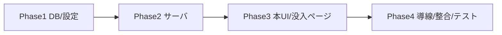

# travel_to_italy スクラップブック(めくれる旅行日記)実装計画

作成日: 2026-06-27
対象: コレクション `travel_to_italy`(9:16 縦長・8枚)の完走者向け「めくれる日記帳」シェアページ

## 1. 概要

コラボ企画 `travel_to_italy`(8プリセット=Day1..Day8、9:16縦長のスクラップブック生成)を**コレクションシリーズ化**し、
完走時に従来の単一コンプリートカード(台紙)ではなく、**8枚を1枚ずつめくれる「旅行日記帳」**として表示・シェアできるようにする。
めくりUIは絵師カタログ(`/catalog/[slug]`)の `CatalogBookView`(react-pageflip)を流用する。

### 決定事項(ユーザー合意)
- 完走表示: **本(めくり日記帳)に置き換え**(travel_to_italy のみ。従来台紙は出さない)
- Xシェア時のOGP: **運営がOGP画像を用意**(別途登録)
- 各ページの画像: **既定は自動(各Day最新1枚・sort_order順)+ 従来の台紙コンポーザ同様、同一Dayに複数あれば選択UIで差し替え可能**(「作り直し」で更新)
- **本の0ページ目(表紙)**: travel_to_italy 用に**別途登録した表紙画像**を使う(`BookCover` front = 登録表紙)

### 現状(調査済み)
- `travel_to_italy`: `is_collection_series=false` / `completion_threshold=null` / `output_aspect_ratio_mode=9:16` / `visibility=admin_only` / published 8枚。
- 完走の仕組み: `reserve_collection_completion` RPC → `collection_completions`(mount_status, mount_image_path)→ `/api/collections/mount` で単一PNG合成 → 公開ページ `/m/[completionId]`。
- 各Day代表画像: `getRepresentativeImagesForCategory()`(generation_metadata->oneTapStyle->id でプリセット紐付け、最新1枚・sort_order順)。
- カタログ本UI: `CatalogReaderModal` + `CatalogBookView`(react-pageflip・縦横自動切替・ジェスチャ)、`BookCover`、AppShell バイパス(`isCatalogReader`)。

## 2. 設計判断(ADR)

### ADR-1: 完走表示モードをカテゴリ設定で分岐
- **Decision**: `preset_categories` に `completion_view_mode TEXT DEFAULT 'mount'`('mount' | 'book')を追加。travel_to_italy のみ 'book'。
- **Reason**: 既存カテゴリ(神コレ等)の台紙挙動を一切変えずに、本表示を限定導入できる。
- **Consequence**: 完走処理・表示が mode で分岐。

### ADR-2: カタログ本UIは「共有コア抽出」で流用
- **Decision**: `CatalogBookView` のめくり+ジェスチャ中核を汎用 `BookView`(ページは generic + `renderPage` コールバック)として抽出し、カタログ側は薄いラッパで従来どおり利用。スクラップブックは `ScrapbookPage`(9:16画像)を renderPage で描画。
- **Reason**: 重複を避けつつ、カタログの既存挙動を壊さない。型結合(xAccountUrl 等カタログ固有)を切り離す。
- **Consequence**: `/catalog` のリグレッション確認が必須。代替案=丸ごと複製(重複増だが影響局所)。リスク次第で複製にフォールバック可。

### ADR-3: 本の画像ページはスナップショット保存 + Dayごとに選択可
- **Decision**: 完走者が「旅行日記を作る」時、既存 `CollectionMountComposer` 同様の**選択UI**を出す(各Day既定=代表[最新1枚]、複数あれば差し替え可)。確定した「各Dayの採用画像 storage_path 8件」を `collection_completions.book_page_paths JSONB` に保存。
- **Reason**: 同一Dayに複数生成があるユーザーが望む1枚を選べる(従来台紙のUXを踏襲)。自動選択は再生成で変わるためスナップショットで本を固定。
- **Consequence**: 選択UI(8枠版)が必要。表示は generated-images(public)の公開URLで配信(既存の台紙共有と同方式)。「作り直し」で更新可。

### ADR-4: OGPは運営登録画像(既存テンプレ合成基盤を流用)
- **Decision**: 運営が用意するOGP画像を `travel_to_italy.ogp_template_path` に登録(必要なら `ogp_mount_placement` で代表画像を合成)。既存 `compose-mount-ogp` を流用。
- **Reason**: OGP生成基盤を再利用でき新規実装が最小。運営がデザインを管理。
- **Consequence**: 運営がOGP画像を用意(本件はユーザー提供予定)。

### ADR-6: 本の表紙(0ページ目)はカテゴリに登録
- **Decision**: `preset_categories.book_cover_path`(新列)に travel_to_italy の表紙画像を登録し、`BookCover` の front(0ページ目)に使う。未登録時は簡易表紙にフォールバック。
- **Reason**: カタログのキャンペーン表紙(cover_storage_path)と同じ考え方。本の世界観を表紙で出す。
- **Consequence**: 表紙画像(運営アセット)の登録手段が必要(まずはバケット配置+列設定、将来 admin UI 化)。

### ADR-5: 公開シェアは没入の本ビュー専用ルート
- **Decision**: 本モードの公開シェアは没入ルート(例 `/m/[token]/book` または `/collections/book/[completionId]`)で `CatalogBookView` を全画面表示。OGP メタは表紙画像。AppShell バイパス対象に追加。`/m/[token]`(従来台紙)は mount モードのまま。
- **Reason**: めくりUIは没入が前提(catalog と同様)。

## 3. EARS(主要要件)

- When ユーザーが travel_to_italy の8種をユニーク生成完了, the system shall 完走を記録し本生成を可能にする。
- When 完走者が「旅行日記を作る」を押下, the system shall 各Day最新1枚を採用してページパスをスナップショットし、表紙OGPを生成し、シェア用の本を公開する。
- While completion_view_mode='book', the system shall 単一台紙(mount)合成を行わず本表示にする。
- When 任意のユーザーがシェアURLを開く, the system shall 没入の本ビュー(8ページめくり)を表示し、所有者にはシェア/作り直し、ゲストには「あなたのうちの子でも作れる」CTAを出す。
- If 8種に達していない, then the system shall 本生成を拒否(既存 reserve RPC の再検証を流用)。

## 4. 実装フェーズ

### Phase 1: DB・カテゴリ設定
- migration: `preset_categories` に `completion_view_mode`('mount'|'book', default 'mount')と `book_cover_path TEXT`(表紙)追加。`collection_completions.book_page_paths JSONB` 追加。
- データ設定: travel_to_italy を `is_collection_series=true` / `completion_threshold=8` / `completion_view_mode='book'` に。OGP(`ogp_template_path`=運営提供)と `book_cover_path`(表紙)を設定。
- ビルド確認: 型/マイグレーション差分が通る。

### Phase 2: サーバー(本生成・取得)
- `/api/collections/mount`(または新 `/api/collections/book`)を mode 分岐: book モードは台紙合成をスキップし、選択(無ければ代表)8枚を解決→`book_page_paths` 保存→OGP合成→finalize。
- 公開取得: `getCollectionBookByToken(completionId)` = 表紙 + 8ページ公開URL(generated-images) + 所有者判定。
- ビルド確認: API 単体で動作。

### Phase 3: 本UI・没入ページ・選択UI
- `CatalogBookView` を最小変更で流用(ページ型からカタログ固有のクレジット必須項目を任意化)。`ScrapbookPage`(9:16)+ front 表紙=`book_cover_path`。
- 没入シェアページ(新ルート)で本表示。AppShell バイパスに条件追加。OGP メタ設定。
- **選択UI**: `CollectionMountComposer` を 8枠・Day選択版として流用し「旅行日記を作る」フローに。
- ビルド確認: /catalog リグレッション無し + 本ページ表示。

### Phase 4: 導線・整合・テスト
- 完走者の進捗モーダル/マイページに「旅行日記を見る/作る」CTA(book モード時)。
- 整合: 図と DB/UI の状態一致、ゲスト/所有者の出し分け、公開URL(generated-images)配信。
- 検証: lint/typecheck/test/build、実機(完走→選択→本生成→シェア→ゲスト閲覧→OGP)。

## 5. 主要修正ファイル(見込み)

| ファイル | 操作 | 内容 |
|---|---|---|
| supabase/migrations/<new>.sql | 新規 | completion_view_mode / book_page_paths 追加 |
| features/collections/lib/*(mount/representative) | 修正 | book モード分岐・代表8枚解決・スナップショット |
| app/api/collections/mount(or book)/route.ts | 修正/新規 | book 生成 |
| features/collections/lib/public-... | 修正 | 本取得(署名URL) |
| features/catalog/components/CatalogBookView.tsx | 修正 | 汎用 BookView 抽出(挙動不変) |
| features/collections/components/ScrapbookBookView/ScrapbookPage | 新規 | 9:16本表示 |
| app/(没入の本ルート)/page.tsx | 新規 | 公開シェア本ページ |
| components/AppShell.tsx | 修正 | 本ルートをバイパス対象に |
| features/my-page/.../CollectionProgressModal | 修正 | 「旅行日記」CTA |

## 6. 前提・運営インプット・リスク

- **運営インプット**: 表紙テーマ画像(OGP用 1200×630 + 本表紙)1枚。プレースメント(うちの子の配置)。
- **前提**: travel_to_italy を公開(visibility public)するタイミングは運営判断(コラボ公開時)。
- **リスク**: `CatalogBookView` 汎用化で /catalog を壊さないこと(代替=複製)。react-pageflip の非公開API依存。9:16縦長×モバイルでの見開き挙動(縦は単ページ送りで自然)。
- **ロールバック**: completion_view_mode 既定 'mount' なので travel_to_italy を 'mount' に戻せば従来挙動。migration は追加列のみ。

## 7. 検証
- lint / typecheck / test / build --webpack。
- 実機: 8種生成→完走→「旅行日記を作る」→ 没入本(8ページめくり)→ シェアURL→ ゲスト閲覧→ OGP(表紙)確認。
- /catalog リグレッション(汎用化の影響)。
