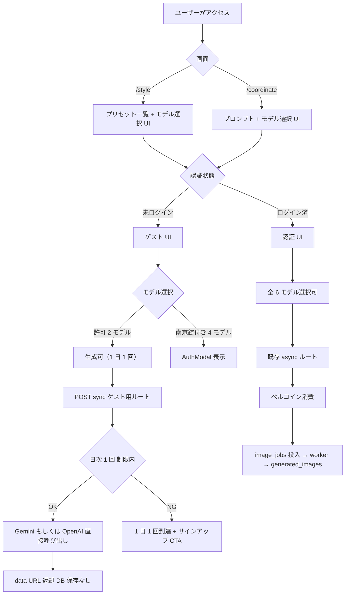
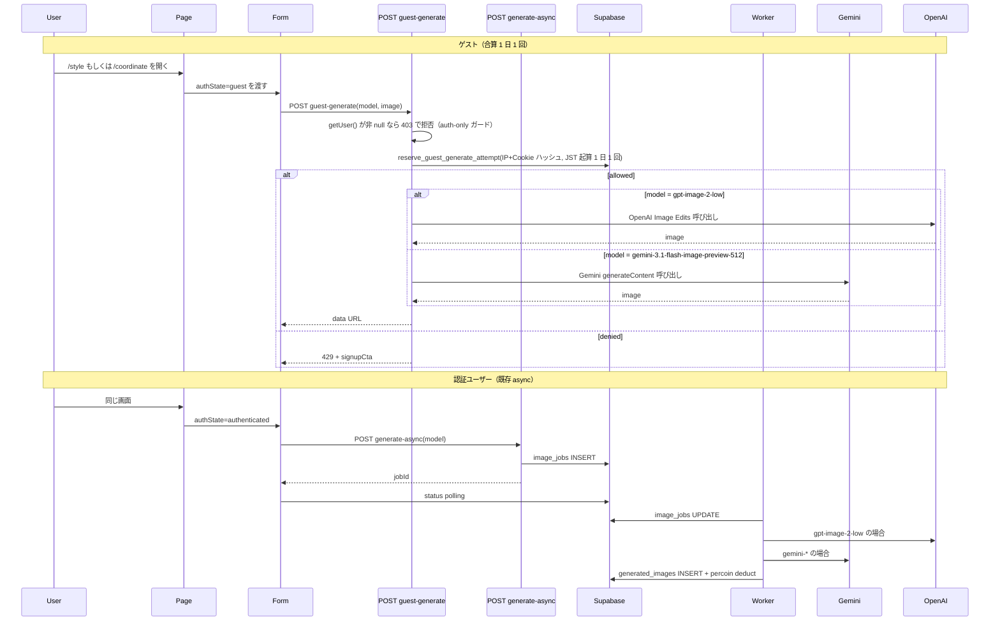
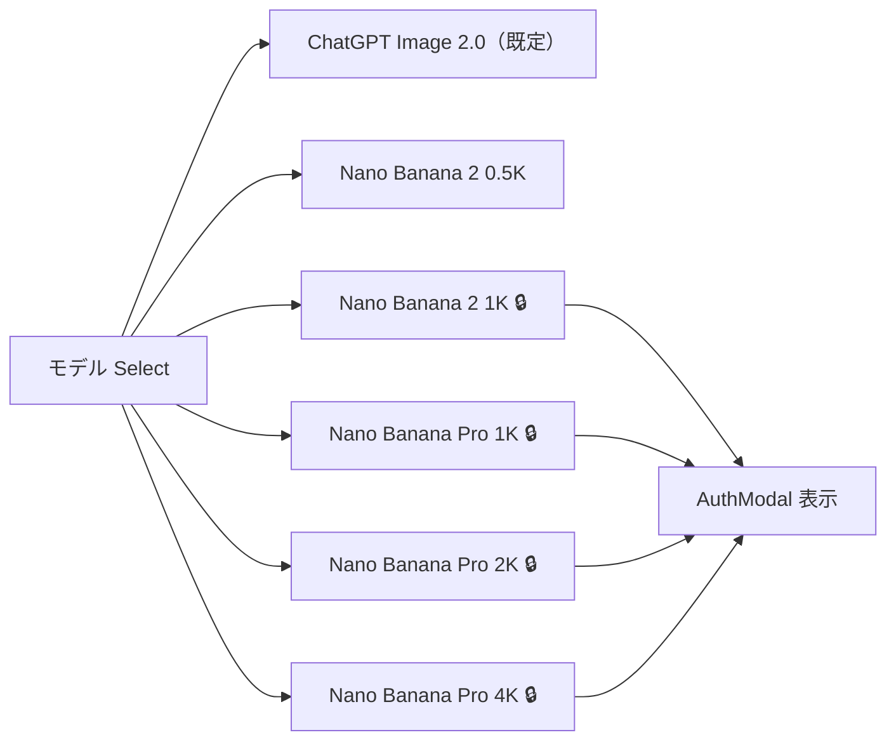
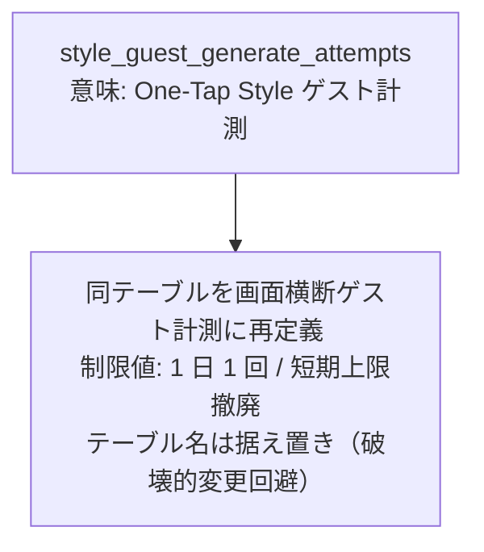
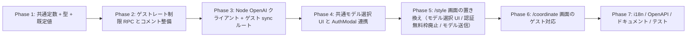

# /style と /coordinate 利用制限・モデル選択 統一 実装計画

作成日: 2026-04-26
ブランチ: `feat/style-model-selection-and-unified-usage-limits`

## コードベース調査結果

計画作成にあたり、以下を調査済み。

- **/style 画面（現状）**:
  - クライアント [features/style/components/StylePageClient.tsx:531](../../features/style/components/StylePageClient.tsx#L531) で `shouldUseAsyncGeneration = effectiveAuthState === "authenticated"` 分岐。**ゲストは sync ルート、認証ユーザーは async ルートに振り分けられている**。
  - sync: [app/(app)/style/generate/handler.ts](../../app/(app)/style/generate/handler.ts)。Gemini API を直接呼び、結果は data URL 返却（DB 保存なし）。`gemini-3.1-flash-image-preview` 固定 + `imageSize=512`。
  - async: [app/(app)/style/generate-async/handler.ts:191-194](../../app/(app)/style/generate-async/handler.ts#L191-L194) で `getUser()` を強制し、未ログインは 401。`image_jobs` キュー経由 → ワーカー処理 → `generated_images` 保存。
  - モデルは [features/style/lib/constants.ts](../../features/style/lib/constants.ts) で `STYLE_GENERATION_MODEL` 固定。**モデル選択 UI は存在しない**。
  - レート制限値は [features/style/lib/style-rate-limit.ts:9-11](../../features/style/lib/style-rate-limit.ts#L9-L11) に定数で `GUEST_SHORT_LIMIT=2 / GUEST_DAILY_LIMIT=2 / AUTHENTICATED_DAILY_LIMIT=5`。
  - 起算は JST 0時。`reserve_style_guest_generate_attempt` RPC 内で `date_trunc('day', p_now, 'Asia/Tokyo')` を使用（[supabase/migrations/20260412170000_add_style_attempt_release_reservations.sql:227-294](../../supabase/migrations/20260412170000_add_style_attempt_release_reservations.sql#L227-L294)）。

- **/coordinate 画面（現状）**:
  - [app/(app)/coordinate/page.tsx:18](../../app/(app)/coordinate/page.tsx#L18) で `requireAuth()` を呼んでおり、**未ログインは弾かれる**。
  - クライアントは [features/generation/components/GenerationFormContainer.tsx:751](../../features/generation/components/GenerationFormContainer.tsx#L751) で `generateImageAsync()` → `POST /api/generate-async`（async only）。
  - ペルコイン残高は [features/credits/components/CachedCoordinatePercoinBalance.tsx](../../features/credits/components/CachedCoordinatePercoinBalance.tsx)、生成結果は [features/generation/components/CachedGeneratedImageGallery.tsx](../../features/generation/components/CachedGeneratedImageGallery.tsx)。両方とも `userId` 必須。
  - モデル選択 UI は [features/generation/components/GenerationForm.tsx:617-647](../../features/generation/components/GenerationForm.tsx#L617-L647) の `<Select>`。6 モデル（`gemini-3.1-flash-image-preview-512` / `gpt-image-2-low` / `-1024` / `gemini-3-pro-image-1k|2k|4k`）。
  - デフォルトモデルは [features/generation/lib/form-preferences.ts:26](../../features/generation/lib/form-preferences.ts#L26) で `gemini-3.1-flash-image-preview-512`、[features/generation/lib/async-api.ts:113](../../features/generation/lib/async-api.ts#L113) と [features/generation/lib/schema.ts:97](../../features/generation/lib/schema.ts#L97) でも同値が default。

- **モデル ↔ ペルコイン単価**:
  - [features/generation/lib/model-config.ts](../../features/generation/lib/model-config.ts) に集約。`gpt-image-2-low=10`、`gemini-3.1-flash-image-preview-512=10`、`-1024=20`、`pro-1k=50`、`-2k=80`、`-4k=100`。

- **OpenAI 画像呼び出しの所在**:
  - 現状は **Edge Function ワーカー** ([supabase/functions/image-gen-worker/openai-image.ts](../../supabase/functions/image-gen-worker/openai-image.ts), 245 行) のみ。Deno 製、`fetch` で `https://api.openai.com/v1/images/edits` を multipart 呼び出し。Node.js 側に実装は無い。
  - 既存 `/style/generate` sync ルート は Gemini 直叩きのみで、OpenAI には対応していない。
  - **本計画ではゲストでも `gpt-image-2-low` を使えるようにするため、Node ランタイムへの OpenAI 呼び出し実装の移植が必須**。

- **未ログイン時のログインカード（ユーザーが指定）**:
  - 既存コンポーネント [features/auth/components/AuthModal.tsx](../../features/auth/components/AuthModal.tsx)。`AuthForm mode="signin"` をモーダル表示し、`redirectTo` を受け取る。`CommentInput` / `LikeButton` / `FollowButton` などで「未ログイン → モーダル」用途で既に流用されている。

- **データアクセス方針**: [docs/architecture/data.ja.md](../architecture/data.ja.md) — 単純 CRUD は route handler、原子的・冪等な処理は SQL RPC に寄せる。レート制限の予約/リリースは現行どおり RPC で扱う。

- **Supabase 接続**: 既存の `style_guest_generate_attempts` テーブルに対する RPC が複数（`reserve_style_guest_generate_attempt` 等）整っており、本計画ではこれを画面横断でも使えるよう **意味付けを変更** する（テーブル名は据え置き、コメントと制限値だけ変更）。

## 1. 概要図

### ユーザー操作フロー

### API 経路

### モデル選択 UI（ゲスト時）

### レート制限テーブル意味付け変更

## 2. EARS 要件定義

| ID | タイプ | EARS 文（EN） | 要件文（JA） |
| --- | --- | --- | --- |
| UCL-001 | 状態駆動 | While the user is unauthenticated on `/style` or `/coordinate`, the system shall allow image generation only with `gpt-image-2-low` or `gemini-3.1-flash-image-preview-512`. | ユーザーが `/style` または `/coordinate` で未ログイン状態にある間、システムは `gpt-image-2-low` と `gemini-3.1-flash-image-preview-512` のみで画像生成を許可しなければならない。 |
| UCL-002 | 状態駆動 | While the user is unauthenticated, the system shall enforce a combined limit of 1 reserved generation attempt per JST day across `/style` and `/coordinate`, identified by a SHA-256 hash of `client_ip + persistent_cookie_id`. The cookie is issued on first guest visit (HttpOnly, SameSite=Lax, 1-year TTL). If either input is missing, the request is rejected per UCL-010. | ユーザーが未ログインである間、システムは `client_ip` と永続 Cookie ID を結合した SHA-256 ハッシュで識別される 1 識別子あたり JST 1 日 1 回の生成予約上限を `/style` と `/coordinate` を合算して適用しなければならない。Cookie は初回ゲスト訪問時に発行する（HttpOnly、SameSite=Lax、有効期限 1 年）。いずれかが取得できない場合は UCL-010 に従って拒否する。 |
| UCL-003 | イベント駆動 | When an unauthenticated user submits a guest generation request, the system shall return the generated image as a data URL and shall not persist any record in `generated_images` or `image_jobs`. | 未ログインユーザーがゲスト生成を要求したとき、システムは生成画像を data URL で返し、`generated_images` および `image_jobs` には保存してはならない。 |
| UCL-004 | イベント駆動 | When an unauthenticated user clicks a locked model option, the system shall open the existing `AuthModal` (signin) with `redirectTo` set to the full current URL including search params. | 未ログインユーザーが南京錠付きのモデルを選択したとき、システムは既存の `AuthModal`（signin）を `redirectTo` にクエリパラメータを含む現在 URL を設定して表示しなければならない。 |
| UCL-005 | 状態駆動 | While the user is on `/coordinate` unauthenticated, the system shall display a persistent login CTA at the top of the page and hide percoin balance UI and gallery UI. | ユーザーが `/coordinate` で未ログイン状態にある間、システムはページ上部にログイン誘導 CTA を常時表示し、ペルコイン残高 UI と生成結果一覧 UI を非表示にしなければならない。 |
| UCL-006 | 状態駆動 | While the user is on `/style` unauthenticated, the system shall display the same coordinate-style model selector with locked indicators on the four restricted models. | ユーザーが `/style` で未ログイン状態にある間、システムは `/coordinate` と同じモデル選択 UI を表示し、制限対象の 4 モデルに南京錠を表示しなければならない。 |
| UCL-007 | 状態駆動 | While the user is authenticated on either screen, the system shall route generation through the existing `POST /api/generate-async` (coordinate) or `POST /style/generate-async` (style) and shall charge percoins per `MODEL_PERCOIN_COSTS` for every model including `gpt-image-2-low` and `gemini-3.1-flash-image-preview-*`. | ユーザーがいずれかの画面で認証済みである間、システムはコーディネートでは既存の `POST /api/generate-async`、スタイルでは `POST /style/generate-async` を経由させ、`gpt-image-2-low` と `gemini-3.1-flash-image-preview-*` を含む全モデルで `MODEL_PERCOIN_COSTS` に従ってペルコインを消費しなければならない。 |
| UCL-008 | 状態駆動 | While the user is authenticated on `/style`, the system shall no longer grant the previous "5 free attempts per day" allowance and shall remove related remaining-quota copy. | ユーザーが `/style` で認証済みである間、システムは従来の「1 日 5 回無料」を提供してはならず、関連する残回数表示も撤去しなければならない。 |
| UCL-009 | 状態駆動 | While the application initializes the model selector on `/style` and `/coordinate`, the system shall default the selection to `gpt-image-2-low` for both authenticated and unauthenticated users. | アプリが `/style` および `/coordinate` でモデル選択 UI を初期化している間、システムは認証状態に関わらず `gpt-image-2-low` を既定選択としなければならない。 |
| UCL-010 | 異常系 | If the unauthenticated client cannot be identified by IP or persistent cookie, then the system shall reject the guest generation request with a clear error rather than allowing unrestricted use. | 未ログインクライアントの IP または永続 Cookie が取得できない場合、システムは無制限利用を許さず、明確なエラーでゲスト生成要求を拒否しなければならない。 |
| UCL-011a | 異常系 | If the upstream provider returns a system-side failure (HTTP 5xx, timeout, no-image-returned) for a guest request, then the system shall release the reserved attempt so the user retains their daily allowance. | ゲストのリクエストで上流プロバイダがシステム側起因で失敗（HTTP 5xx / timeout / 画像未返却）した場合、システムは予約済みの試行をリリースし、当日分の権利を消費させてはならない。 |
| UCL-011b | 異常系 | If the upstream provider returns a safety/policy block for a guest request, then the system shall keep the attempt consumed and shall not release the reservation. | ゲストのリクエストで上流プロバイダが safety / policy で拒否した場合、システムは予約済み試行を消費したまま保持し、リリースしてはならない。 |
| UCL-011c | 異常系 | If the request fails because of user-fixable input issues (e.g. unsupported MIME, oversized image, OpenAI-incompatible GIF), then the system shall reject the request before reservation so no attempt is consumed. | ユーザー側で修正可能な入力エラー（未対応 MIME、サイズ超過、OpenAI 非対応 GIF など）でリクエストが失敗する場合、システムは予約を行う前に拒否し、試行を消費させてはならない。 |
| UCL-012 | 状態駆動 | While historical `image_jobs` and `generated_images` rows reference the legacy default model, the system shall keep them readable without rewriting historical records. | 履歴の `image_jobs` と `generated_images` が旧既定モデルを参照している間、システムはそれらを書き換えず、引き続き読み取り可能な状態を保たなければならない。 |
| UCL-013 | 状態駆動 | While the localStorage of an existing browser still holds the previous default model, the system shall continue to honor the stored preference without forcing a reset. | 既存ブラウザの localStorage に旧既定モデルが残っている間、システムは保存された選択を尊重し、強制的にリセットしてはならない。 |
| UCL-014 | 異常系 | If an authenticated user calls the guest sync route (`/style/generate` or `/api/coordinate-generate-guest`) directly, then the system shall reject the request with HTTP 403 and instruct the client to use the authenticated async route. | 認証済みユーザーがゲスト sync ルート（`/style/generate` または `/api/coordinate-generate-guest`）を直接呼び出した場合、システムは HTTP 403 で拒否し、認証 async ルートを使うよう案内しなければならない。 |
| UCL-015 | 状態駆動 | While the unauthenticated user has a stored model preference that is not in `GUEST_ALLOWED_MODELS`, the system shall display the selector with the value clamped to `DEFAULT_GENERATION_MODEL` for the session, without overwriting the persisted preference. | 未ログインユーザーの localStorage に格納された選択モデルが `GUEST_ALLOWED_MODELS` に含まれない場合、システムはそのセッションでの表示値を `DEFAULT_GENERATION_MODEL` に丸めて表示し、保存された設定を上書きしてはならない。 |
| UCL-016 | 状態駆動 | While the user is authenticated on `/style`, the system shall set `generation_metadata.oneTapStyle.billingMode = "paid"` on every job created by `POST /style/generate-async`, so the worker performs the percoin deduction with `getPercoinCost(model)`. | ユーザーが `/style` で認証済みである間、システムは `POST /style/generate-async` が作成する全ジョブの `generation_metadata.oneTapStyle.billingMode` を `"paid"` に設定し、worker が `getPercoinCost(model)` でペルコイン減算を行うようにしなければならない。 |
| UCL-017 | 状態駆動 | While an unauthenticated user generates on `/coordinate`, the system shall display the resulting data URL in a dedicated guest result region (in-memory only) that is cleared on page reload. | 未ログインユーザーが `/coordinate` で生成している間、システムは結果の data URL を専用のゲスト結果表示領域（in-memory のみ）に表示し、ページリロードで消えるようにしなければならない。 |
| UCL-018 | イベント駆動 | When the user opens `AuthModal` from a locked model click on `/style?style=...`, the system shall set `redirectTo` to the full current URL including search params so the same preset stays selected after sign-in. | ユーザーが `/style?style=...` で南京錠付きモデルから `AuthModal` を開いたとき、システムは `redirectTo` をクエリパラメータを含む完全な URL に設定し、ログイン後も同じプリセットが選択されたままになるようにしなければならない。 |

## 3. ADR（設計判断記録）

### ADR-001: ゲスト生成は新設の sync ルートで処理し、認証ユーザーは既存 async を継続する（案 A）

- **Context**: コーディネート画面でも未ログインに開放するにあたり、(A) /style と同じく「ゲスト=sync, 認証=async」の二段構えと、(B) async ルートに guest 対応を追加する一段構え、の選択がある。(B) は `image_jobs` のオーナー NULL、`generated_images` の RLS、ポーリング SSE の guest 経路など、既存の認証前提エンティティに広範な変更を要する。
- **Decision**: (A) を採用する。`/api/coordinate-generate-guest`（仮称）を新設し、画面横断で利用される「ゲスト sync 経路」のロジックを `features/generation/lib/guest-generate.ts`（仮称）に集約する。
- **Reason**: `/style` で既に確立済みのパターンを踏襲できる、ジョブキュー / ストレージ / RLS への侵襲がない、ロールバックが容易、Edge Function ワーカーに guest 経路を持ち込まない。結果はリロードで消える前提で十分（ユーザー要件と一致）。
- **Consequence**: Gemini と OpenAI 双方の HTTP 呼び出しコードを sync 側で持つ必要があり、`supabase/functions/image-gen-worker/openai-image.ts` 相当を Node ランタイムへ移植する手間が発生する。

### ADR-002: ゲストレート制限テーブルは `style_guest_generate_attempts` を据え置きで再利用する

- **Context**: 既存 `style_guest_generate_attempts` は IP ハッシュのみを持ち、`style_id` は格納していない。すなわちテーブルとしては既に画面横断で使える形をしている。リネームすると RPC・ポリシー・参照コードに広く波及する。
- **Decision**: テーブル名と既存 RPC 名（`reserve_style_guest_generate_attempt` 等）はそのまま維持する。意味付けは「画面横断のゲスト生成試行」へ拡張し、コメントを更新する。制限値（短期撤廃 / 日次=1）は呼び出し側から渡す。
- **Reason**: 破壊的なリネームは規約違反のリスクと merge conflict の温床になる。再定義はコメントと運用で吸収できる。
- **Consequence**: 名前と用途の不一致が残るため、将来 `guest_generate_attempts` へ整理する方針はバックログに残す。テーブル・RPC のドキュメントと CLAUDE 等にコメントを追記する。

### ADR-003: 認証 /style の「1 日 5 回無料枠」は廃止し、ペルコイン消費に統一する

- **Context**: ユーザー要件として「/style と /coordinate の利用制限を統一」したい。現状 /style 認証側だけが無料枠を持つことが乖離を生んでいる。
- **Decision**: `AUTHENTICATED_DAILY_LIMIT=5` 経路を撤去し、認証ユーザーの /style 生成は `MODEL_PERCOIN_COSTS` に従ってペルコイン消費させる。`reserve_style_authenticated_generate_attempt` 系 RPC は呼び出さなくなる（廃止 SQL は別 PR で扱える）。
- **Reason**: シンプル化。料金体系を 1 本化することで、UI 上の残回数表示や警告ダイアログも撤去できる。
- **Consequence**: 既存 /style 認証ユーザーは無料枠を失う。リリースノート / お知らせ告知が必要。コードと文言を同時に整理する。

### ADR-004: デフォルトモデルを `gpt-image-2-low` に変更する

- **Context**: ユーザー要件として、両画面でデフォルトを ChatGPT Image 2.0 にしたい。
- **Decision**: `features/generation/lib/form-preferences.ts` の `DEFAULT_MODEL`、`features/generation/lib/schema.ts` の `model.default(...)`、`features/generation/lib/async-api.ts` の `model || ...`、`features/generation/types.ts` の `normalizeModelName` の最終 fallback を `gpt-image-2-low` に揃える。
- **Reason**: ユーザー要件の単純実装。`MODEL_PERCOIN_COSTS` 上は `gpt-image-2-low=10` で軽量モデルと同単価。
- **Consequence**: 既存ブラウザの localStorage に残っている旧デフォルトはそのまま尊重される（=既存ユーザー体験は不変）。新規ユーザーと localStorage クリア後のみ新既定が効く。型 / OpenAPI / 文言を同時に更新する。

### ADR-005: Node ランタイムに OpenAI Image Edits クライアントを実装する

- **Context**: 新しい guest sync ルートで `gpt-image-2-low` を扱うために、現在 Edge Function 内にしかない OpenAI Image Edits クライアントが Node 側に必要になる。
- **Decision**: `features/generation/lib/openai-image.ts`（新設、Node 専用）に `callOpenAIImageEdit()` 同等関数を移植する。Edge Function 側 (`supabase/functions/image-gen-worker/openai-image.ts`) はそのまま維持する。
- **Reason**: ランタイムが異なる（Edge Function は Deno、Node ルートは Node）ため import の共有は難しい。アスペクト比から `1024x*` を選ぶロジックや SAFETY 系エラーの正規化など、コアロジックはコピーして同期させる。
- **Consequence**: 同等ロジックが二か所に存在することになる。コメントで対応を明示し、変更時の同期忘れを防ぐ。型と定数（`OPENAI_PROVIDER_ERROR` 等）は `shared/generation/errors.ts` を参照する形を維持する。

### ADR-007: 認証ユーザーによる guest sync ルート直叩きを 403 で明示拒否する

- **Context**: ゲスト sync は無料 / DB 保存なし / モデル制限ありの軽量ルート。認証ユーザーがこれを直接呼ぶと、ペルコイン消費を回避し、なおかつ generated_images にも残らない「抜け道」になる。
- **Decision**: `/style/generate` と `/api/coordinate-generate-guest`（新設）の両方で、`getUser()` が非 null の場合は HTTP 403 + `errorCode: "GUEST_ROUTE_AUTHENTICATED_FORBIDDEN"` を返す。レスポンスには「認証 async ルートを使ってください」という案内コードを含める。
- **Reason**: ペルコイン課金抜け / 利用制限抜けの双方を防ぐ。フロントは authState で経路を切り替えるためこのガードに到達しない想定だが、サーバー側で必ず拒否する。
- **Consequence**: 既存 `/style/generate` の挙動は破壊的変更となる（現状は認証ユーザーでも 200）。実態としてフロントから認証ユーザーが叩く経路は無く、影響はない見込みだが、変更を merge する際は char/integration テストの認証ケースを更新する必要がある。

### ADR-008: 認証 /style のペルコイン減算は worker 側に集約し、route handler は残高チェックと `billingMode="paid"` 設定のみ担う

- **Context**: 既存 worker (`supabase/functions/image-gen-worker/index.ts`) は `generation_metadata.oneTapStyle.billingMode === "free"` の場合に減算をスキップする実装。/style/generate-async が今後ペルコイン消費型になっても、減算ロジックを route handler 側に二重化すると課金二重実行や減算漏れの温床になる。
- **Decision**: `/style/generate-async` route handler は (1) `body.model` を `MODEL_PERCOIN_COSTS` に従って `getPercoinCost(model)` で参照しユーザー残高を事前検証する、(2) `image_jobs` 投入時に `generation_metadata.oneTapStyle.billingMode = "paid"`（明示）と `model` を保存する、までで止める。実減算は既存 worker に任せる。
- **Reason**: コーディネート async と同じ責務分担になり、減算は worker の 1 経路に統一できる。`billingMode="paid"` を明示することで、worker の既存 `if (billingMode === "free") skip` 分岐に確実に引っかからない。
- **Consequence**: route handler のテストでは「正しい cost で残高チェックしたか」「billingMode が paid で保存されたか」を検証する。worker 側のテストは既存のままで良いが、`oneTapStyle.billingMode === "paid"` 経路が動くケースを 1 本追加する。

### ADR-009: ゲスト識別子は `IP + 永続 Cookie` の SHA-256 ハッシュにし、Cookie は `proxy.ts` で発行する

- **Context**: 元要件は「IP + Cookie ベース」。現行 `style_guest_generate_attempts` は `client_ip_hash` のみ。IP のみだと NAT 配下で他ゲストが巻き込まれる、IP のみだと Cookie 削除耐性がない（再判定可能）一方で、Cookie のみだと sandbox / cookie 拒否で抜け穴になる。
- **Decision**: `client_ip` と永続 Cookie ID（初回ゲスト訪問時に Next.js Proxy の `proxy.ts` が発行する UUID）を `|` で連結したものを既存 salt と組み合わせて SHA-256 ハッシュ化し、`client_ip_hash` カラムに保存する（カラム名は据え置き、内容のみ拡張）。Cookie は HttpOnly / SameSite=Lax / 1 年 TTL。
- **Reason**: テーブル schema を増やさず、NAT 配下の巻き込みを IP のみより抑えつつ、Cookie 単独より共有・転用に強い識別子にできる。Cookie 削除後は同じ IP でもハッシュが変わるため、同日カウントは引き継がれない。この抜け穴をさらに塞ぐ場合は、別途 IP-only の補助チェックを追加する。
- **Consequence**: `extractClientIp()` の呼び出し箇所に Cookie 読み取りロジックを追加し、Cookie が無い場合は `proxy.ts` 側で発行する。Cookie 名は `persta_guest_id`（仮）。リクエストロギングや RPC 引数のドキュメント更新が必要。

### ADR-006: 南京錠アイコンは `Select` の中で disabled+icon ではなく、interactive な「ロック表示」で実装する

- **Context**: 標準の `<SelectItem disabled>` だと keyboard / pointer どちらでも反応しないため、要件「クリックしたら AuthModal を出す」を満たせない。
- **Decision**: 制限対象 4 モデルは `<SelectItem>` を使わず、`<button role="option">` に南京錠アイコンを添えて表示する。クリックで `AuthModal` を `open` にする。`Select` の値としては選択不可のまま。
- **Reason**: shadcn/ui の `Select` は `<SelectItem>` を `value` 必須とするため、選択しない動作（=値変更しないが動作する）には別実装が要る。アクセシビリティとしては `aria-disabled` + `aria-haspopup="dialog"` を併用する。
- **Consequence**: 既存 `Select` 実装より少し複雑になる。共通コンポーネント `LockableModelSelect`（仮称）として切り出し、`/style` と `/coordinate` で共有する。

## 4. 実装計画（フェーズ＋TODO）

### フェーズ間の依存関係

#### Phase 1: 共通定数・型・既定値の更新
目的: 既定モデル変更とゲスト許可モデルの whitelist を一箇所に定義し、後続フェーズで参照する。  
ビルド確認: `npm run typecheck` と `npm run build -- --webpack` がパスする（UI / API 挙動は未変更）。

- [ ] [features/generation/lib/model-config.ts](../../features/generation/lib/model-config.ts) に `GUEST_ALLOWED_MODELS` 定数を追加（`["gpt-image-2-low", "gemini-3.1-flash-image-preview-512"]`）
- [ ] 同ファイルに `DEFAULT_GENERATION_MODEL = "gpt-image-2-low"` を追加し、各所で参照
- [ ] [features/generation/types.ts](../../features/generation/types.ts) の `normalizeModelName` 最終 fallback を `gpt-image-2-low` に変更
- [ ] [features/generation/lib/schema.ts:97](../../features/generation/lib/schema.ts#L97) の `model.default(...)` を `gpt-image-2-low` に変更
- [ ] [features/generation/lib/async-api.ts:113](../../features/generation/lib/async-api.ts#L113) の fallback を `gpt-image-2-low` に変更
- [ ] [features/generation/lib/form-preferences.ts:26](../../features/generation/lib/form-preferences.ts#L26) の `DEFAULT_MODEL` を `gpt-image-2-low` に変更（`PERSISTABLE_MODELS` は変更不要）
- [ ] 旧既定 `gemini-3.1-flash-image-preview-512` の参照箇所が他に無いか `rg "gemini-3.1-flash-image-preview-512"` で確認（テスト・OpenAPI・ドキュメント含む）

#### Phase 2: ゲスト Cookie 発行 + ゲストレート制限 RPC の意味付け変更
目的: 既存 `reserve_style_guest_generate_attempt` を「画面横断ゲスト 1 日 1 回 + IP+Cookie 識別」として運用できる状態にする。  
ビルド確認: マイグレーションが `npm run typecheck` を妨げない。Cookie 発行が `proxy.ts` で動く。

- [ ] **ゲスト Cookie 発行**
  - [ ] [proxy.ts](../../proxy.ts) と新規 `lib/guest-id.ts` で、`/style` と `/coordinate` 配下のリクエストに `persta_guest_id`（UUID v4）Cookie を発行（HttpOnly、SameSite=Lax、Path=/、Max-Age=1 年）。既に存在する場合は触らない
  - [ ] Cookie 値の検証（UUID 形式）を server 側ヘルパに用意し、不正値は再発行
- [ ] **新規マイグレーション** `supabase/migrations/<timestamp>_repurpose_guest_generate_attempts.sql` を追加
  - [ ] `style_guest_generate_attempts` テーブル / カラム / RPC のコメントを「画面横断ゲスト試行（識別子: IP+Cookie ハッシュ）」に更新（テーブル名・カラム名は据え置き、ADR-002 / ADR-009）
  - [ ] `reserve_style_guest_generate_attempt` の `p_short_limit DEFAULT` を `999`（実質無効）、`p_daily_limit DEFAULT` を `1` に変更（呼び出し側からも明示的に渡す）
- [ ] **識別子ハッシュ化ロジック更新**
  - [ ] [features/style/lib/style-rate-limit.ts:81-85](../../features/style/lib/style-rate-limit.ts#L81-L85) の `buildClientIpHash()` を `buildGuestIdentifierHash(ip, cookieId)` に拡張（`SHA-256(ip + "|" + cookieId + "|" + salt)`）
  - [ ] `extractClientIp()` 隣に `extractGuestCookieId()` を追加し、Cookie が無い場合は `null` を返す
  - [ ] `checkAndConsumeStyleGenerateRateLimit` のゲスト経路で IP・Cookie 双方が無いとき UCL-010 に従って `{ allowed: false, reason: "missing_identifier" }` を返す（既存の「IP 無し → 通す」挙動は撤去）
- [ ] **共通化**
  - [ ] guest rate limit を画面横断で扱うため、`features/generation/lib/guest-rate-limit.ts`（仮称）として `features/style/lib/style-rate-limit.ts` のゲスト経路を抽出（薄い re-export でも可）
- [ ] **constants 整理**
  - [ ] [features/style/lib/style-rate-limit.ts:9-11](../../features/style/lib/style-rate-limit.ts#L9-L11) の `GUEST_SHORT_LIMIT` を撤去し、`GUEST_DAILY_LIMIT=1` に変更。`AUTHENTICATED_DAILY_LIMIT` は将来削除のため `@deprecated` コメントを付与
  - [ ] `consumeAuthenticatedGenerateAttempt` を `/style/generate-async` 側で使わなくする準備（実除去は Phase 5）

#### Phase 3: Node 用 OpenAI Image Edits クライアントとゲスト sync ルート
目的: ゲストが `gpt-image-2-low` と `gemini-3.1-flash-image-preview-512` のいずれを選んでも sync で完結できる API を用意する。  
ビルド確認: 新ルートが lint / typecheck / unit テストでパスする。手動 fetch で 200 が返る。

- [ ] `features/generation/lib/openai-image.ts` を新設（[supabase/functions/image-gen-worker/openai-image.ts](../../supabase/functions/image-gen-worker/openai-image.ts) を Node に移植、`process.env.OPENAI_API_KEY` を参照）
- [ ] `features/generation/lib/guest-generate.ts`（仮称）を新設し、以下を内包する
  - [ ] **認証ユーザー拒否ガード**: `getUser()` が非 null なら HTTP 403 + `errorCode: "GUEST_ROUTE_AUTHENTICATED_FORBIDDEN"`（UCL-014 / ADR-007）
  - [ ] `model` whitelist 検証（`GUEST_ALLOWED_MODELS` 以外は 400、UCL-001）
  - [ ] 入力エラー（MIME / size / GIF on OpenAI）を **reserve 前** に検出して 400 を返す（UCL-011c。試行を消費させない）
  - [ ] レート制限の `reserve`（IP+Cookie ハッシュ） → モデル呼び出し → エラー種別に応じた `release` / 維持
    - [ ] 上流 5xx / timeout / no-image: `release`（UCL-011a）
    - [ ] safety / policy block: 維持（UCL-011b）
  - [ ] モデルに応じた Gemini / OpenAI 直接呼び出し
  - [ ] data URL 返却（`generated_images` に保存しない、UCL-003）
- [ ] `app/api/coordinate-generate-guest/route.ts` と `handler.ts` を新設し、`guest-generate.ts` を使用
  - [ ] 入力: `formData`（画像 + プロンプト + model + sourceImageType + backgroundChange など、`/style/generate` の slim 版）
  - [ ] 出力: `{ imageDataUrl, mimeType }` または `{ error, errorCode, signupCta?, signupPath?, showRateLimitDialog? }`
- [ ] [app/(app)/style/generate/handler.ts](../../app/(app)/style/generate/handler.ts) を `guest-generate.ts` に内部委譲し、認証ユーザー拒否ガードを追加（既存 sync 経路を踏襲しつつ、モデル選択を反映）

#### Phase 4: 共通モデル選択 UI と AuthModal 連携
目的: `/style` と `/coordinate` 双方で同じ「南京錠付きモデル選択」を実現する。  
ビルド確認: ストーリー的に未ログイン / ログイン済の両方で UI が壊れていないことを手動確認、unit テスト緑。

- [ ] `features/generation/components/LockableModelSelect.tsx`（仮称）を新設
  - [ ] Props: `value`, `onChange`, `authState`, `onLockedClick`（=`AuthModal` を開く）, `disabled`
  - [ ] 6 モデルの並びと表示名は既存 `GenerationForm` と同じ。`authState === 'guest'` のとき `GUEST_ALLOWED_MODELS` 以外に南京錠アイコン
  - [ ] 制限対象は `<SelectItem>` を使わず、`<button role="option" aria-haspopup="dialog">` で実装（ADR-006）
  - [ ] **表示値の clamp**: `authState === 'guest'` かつ `value` が `GUEST_ALLOWED_MODELS` に含まれない場合は、表示上だけ `DEFAULT_GENERATION_MODEL` に丸める。localStorage の保存値は変更しない（UCL-015 / ADR-004）
- [ ] [features/generation/components/GenerationForm.tsx:617-647](../../features/generation/components/GenerationForm.tsx#L617-L647) の `Select` を `LockableModelSelect` に置換
- [ ] `GenerationForm` に `authState` プロップを追加し、未ログイン時に AuthModal を開ける状態管理を持たせる
- [ ] `AuthModal` 表示時の `redirectTo` は `usePathname()` + `useSearchParams()` を組み合わせて完全な URL を構築する（UCL-018）。例: `/style?style=foo` のようにクエリも保持する。実装は `lib/build-current-url.ts`（新設）に切り出す

#### Phase 5: /style 画面の置き換え
目的: モデル選択 UI を /style に追加し、認証無料枠を撤廃して認証ユーザーの生成をペルコイン消費に統一する。  
ビルド確認: `/style` を未ログイン / ログイン済で開いて、ゲストはモデル選択（4 つ南京錠）+ 1 回まで生成できる、ログインユーザーは 6 モデル選択でき、ペルコインが減ることを確認。

- [ ] [features/style/components/StylePageClient.tsx](../../features/style/components/StylePageClient.tsx) に `LockableModelSelect` を追加（既存のスタイル固定ロジックを置換）
- [ ] [features/style/lib/constants.ts](../../features/style/lib/constants.ts) の `STYLE_GENERATION_MODEL` 固定を削除し、リクエスト時に form の選択値を送る形に変更
- [ ] [app/(app)/style/generate/handler.ts](../../app/(app)/style/generate/handler.ts) を `guest-generate.ts` 経由に統一（Phase 3 の最終ステップで実施済みなら確認のみ）
- [ ] [app/(app)/style/generate-async/handler.ts](../../app/(app)/style/generate-async/handler.ts) を以下のように変更（ADR-008 に従う）
  - [ ] `model` を form / body から受け取り、`generationRequestSchema` 等で検証
  - [ ] `consumeAuthenticatedGenerateAttempt` の 5 回無料枠呼び出しを **撤去**
  - [ ] **route handler の責務は残高チェックのみ**: `getPercoinCost(model)` でユーザー残高を事前検証し、不足なら 400 で `INSUFFICIENT_PERCOINS`
  - [ ] **`image_jobs` 投入時に `generation_metadata.oneTapStyle.billingMode = "paid"` を必ず設定**（UCL-016）。`model` も同 metadata / カラムに保存
  - [ ] **実減算は worker に委ねる**（既存 `image-gen-worker/index.ts` が `billingMode === "free"` 以外で減算するロジックを再利用）
  - [ ] worker への引き渡しに `model` を含める
- [ ] [features/style/components/StylePageClient.tsx](../../features/style/components/StylePageClient.tsx) の「残り N 回」関連 UI と `refreshRateLimitStatus` 経路から認証ユーザー向け枠を撤去（ゲスト向けの「残り 1 回」表示は残す）

#### Phase 6: /coordinate 画面のゲスト対応
目的: `/coordinate` を未ログインに開放し、上部 CTA・ペルコイン UI 隠蔽・ゲスト sync 呼び分けを実装する。  
ビルド確認: `/coordinate` を未ログインで開けて、CTA が表示され、ゲスト sync で生成が動くこと。ログインユーザーの既存挙動が変化していないこと。

- [ ] [app/(app)/coordinate/page.tsx:18](../../app/(app)/coordinate/page.tsx#L18) の `requireAuth()` を `getUser()` に置換し、`user` が `null` の場合の分岐を追加
- [ ] 未ログイン時のレイアウト
  - [ ] 上部に `GuestLoginCta`（仮称、新設 or 既存 CTA を流用）を常時表示
  - [ ] `CachedCoordinatePercoinBalance` / `CachedGeneratedImageGallery` / `RefreshOnMount` / `getUserProfileServer` 等は認証時のみレンダリング
- [ ] `GenerationFormContainer` に `authState` を渡し、未ログイン時は `handleGenerate` を「ゲスト sync 経路（`/api/coordinate-generate-guest`）」に切り替え（新設ヘルパ `submitGuestCoordinateGeneration` を `features/generation/lib/async-api.ts` 隣に追加）
- [ ] **ゲスト結果表示領域の新設**（UCL-017）
  - [ ] 現状 `GenerationFormContainer` は生成画像自体を描画せず、進捗カードのみを表示し、結果は `CachedGeneratedImageGallery` 側がギャラリーに反映する設計。ゲストでは DB 保存しないためギャラリー経由では表示できない。
  - [ ] 新規コンポーネント `features/generation/components/GuestResultPreview.tsx`（仮称）を作り、`GenerationFormContainer` で `authState === 'guest'` のとき直下にレンダリング
  - [ ] 表示は in-memory state（`useState<{ url: string; mimeType: string } | null>`）。リロードで消える
  - [ ] 「保存するにはログイン」CTA（`AuthModal` を開くボタン）を結果カードの下に置く
- [ ] チュートリアル / 進捗ポーリング / `useCoordinateGenerationFeedback` などは認証時のみ動かす（`if (authState === 'guest') return;` で早期 return）

#### Phase 7: i18n / OpenAPI / ドキュメント / テスト
目的: 文言・型・スキーマ・テストを揃えてリリース可能な状態にする。  
ビルド確認: `npm run lint && npm run typecheck && npm run test && npm run build -- --webpack`。

- [ ] [messages/ja.ts](../../messages/ja.ts) と [messages/en.ts](../../messages/en.ts) に追加文言（ゲスト 1 日 1 回、ロックモデル説明、CTA、デフォルトモデル変更に伴う調整、`GUEST_ROUTE_AUTHENTICATED_FORBIDDEN` のエラー文言、ゲスト結果プレビュー）
- [ ] [docs/API.md](../API.md) と [docs/openapi.yaml](../openapi.yaml) に新ルート `POST /api/coordinate-generate-guest`（仮称）と `model` enum 既定値変更を反映
- [ ] **データドキュメント整備**（ADR-002 / ADR-009）
  - [ ] [docs/architecture/data.ja.md](../architecture/data.ja.md) に `style_guest_generate_attempts` の意味付け変更（画面横断ゲスト試行 / IP+Cookie ハッシュ）を反映
  - [ ] `docs/architecture/data.en.md`（存在すれば）も同様に更新
  - [ ] `.cursor/rules/database-design.mdc` のテーブル説明とコメントを更新
- [ ] /style と /coordinate の char/integration/unit テストを更新（後述「テスト観点」）
- [ ] 既存 e2e（locale-persistence など）に影響が出ていないか `npm run test` で確認

## 5. 修正対象ファイル一覧

| ファイル | 操作 | 変更内容 |
| --- | --- | --- |
| supabase/migrations/<timestamp>_repurpose_guest_generate_attempts.sql | 新規 | コメント更新と RPC default 値変更（短期撤廃 / 日次=1） |
| proxy.ts | 修正 | `/style` `/coordinate` 配下で `persta_guest_id` Cookie を発行（既存無ければ） |
| lib/guest-id.ts | 新規 | Cookie の発行 / 検証 / 取得ヘルパ |
| lib/build-current-url.ts | 新規 | `usePathname()` + `useSearchParams()` から完全な URL を構築（AuthModal `redirectTo` 用） |
| features/generation/lib/model-config.ts | 修正 | `GUEST_ALLOWED_MODELS` と `DEFAULT_GENERATION_MODEL` 追加 |
| features/generation/types.ts | 修正 | `normalizeModelName` 最終 fallback を `gpt-image-2-low` に |
| features/generation/lib/schema.ts | 修正 | `model.default(...)` を `gpt-image-2-low` に |
| features/generation/lib/async-api.ts | 修正 | `model` fallback を `gpt-image-2-low` に。ゲスト送信ヘルパ追加 |
| features/generation/lib/form-preferences.ts | 修正 | `DEFAULT_MODEL` を `gpt-image-2-low` に |
| features/generation/lib/openai-image.ts | 新規 | Edge Function の OpenAI Image Edits クライアントを Node へ移植 |
| features/generation/lib/guest-generate.ts | 新規 | ゲスト sync 共通ロジック（**認証ユーザー拒否ガード** / whitelist 検証 / 入力エラー先行検出 / Gemini or OpenAI / reserve・release ポリシー） |
| features/generation/lib/guest-rate-limit.ts | 新規 | 画面横断ゲストレート制限の薄いラッパ（既存 RPC を IP+Cookie ハッシュで呼ぶ） |
| features/generation/components/LockableModelSelect.tsx | 新規 | 共通モデル選択 UI（南京錠 + AuthModal 連携、guest 時の表示値 clamp） |
| features/generation/components/GuestResultPreview.tsx | 新規 | /coordinate ゲスト結果の in-memory 表示領域 + 「保存はログイン」CTA |
| features/generation/components/GenerationForm.tsx | 修正 | `Select` を `LockableModelSelect` へ置換、`authState` プロップ追加 |
| features/generation/components/GenerationFormContainer.tsx | 修正 | `authState` を上から受け取り、ゲスト sync 経路に切り替え。`GuestResultPreview` を guest 時に出す |
| features/style/components/StylePageClient.tsx | 修正 | `LockableModelSelect` 追加、認証ユーザー向け残回数 UI 撤去、選択モデルを送信に含める |
| features/style/lib/constants.ts | 修正 | `STYLE_GENERATION_MODEL` 固定を撤去（既定値は LockableModelSelect 側） |
| features/style/lib/style-rate-limit.ts | 修正 | `GUEST_SHORT_LIMIT` 撤去、`GUEST_DAILY_LIMIT=1`、IP+Cookie ハッシュ化、識別子無し時の拒否、認証経路 `@deprecated` |
| app/api/coordinate-generate-guest/route.ts | 新規 | コーディネート画面のゲスト sync ルート（route 本体） |
| app/api/coordinate-generate-guest/handler.ts | 新規 | 同 handler（認証ユーザー拒否ガード含む） |
| app/(app)/coordinate/page.tsx | 修正 | `requireAuth()` → `getUser()`、未ログイン時レイアウト追加 |
| app/(app)/style/generate/handler.ts | 修正 | `guest-generate.ts` に内部委譲、モデル選択を反映、認証ユーザー拒否ガード追加 |
| app/(app)/style/generate-async/handler.ts | 修正 | 認証無料枠撤去、残高チェックのみ、`billingMode="paid"` を必ず設定、`model` 受け取り |
| messages/ja.ts | 修正 | ゲスト 1 日 1 回 / ロックモデル / CTA / 既定モデル変更 / `GUEST_ROUTE_AUTHENTICATED_FORBIDDEN` 文言 |
| messages/en.ts | 修正 | 同上 |
| docs/API.md | 修正 | 新ルート + 既定モデル変更 |
| docs/openapi.yaml | 修正 | 同上 |
| docs/architecture/data.ja.md | 修正 | `style_guest_generate_attempts` 意味付け変更 + Cookie 識別追記 |
| docs/architecture/data.en.md | 修正（存在すれば） | 同上 |
| .cursor/rules/database-design.mdc | 修正 | テーブル説明とコメント更新 |
| tests/unit/features/generation/generation-form.test.tsx | 修正 | 既定モデル変更と `LockableModelSelect` の検証 |
| tests/integration/api/generate-async-route.test.ts | 修正 | 既定モデル変更の追従 |
| tests/integration/api/coordinate-generate-guest-route.test.ts | 新規 | ゲスト sync ルートのテスト（認証ユーザー拒否含む） |
| tests/integration/app/style-generate-route.test.ts | 修正 | 認証ユーザー拒否（403）の char テスト追加 |
| tests/integration/app/style-generate-async-route.test.ts | 修正 | `billingMode="paid"` の設定 / 残高チェックのみ / 5回無料枠撤去 |
| tests/unit/features/style/style-rate-limit.test.ts | 修正 | 新ゲスト制限値 / IP+Cookie ハッシュ / 識別子無し時の拒否 / 認証経路撤去 |
| tests/unit/features/generation/guest-generate.test.ts | 新規 | reserve / release ポリシー（5xx vs safety vs user error）の網羅 |
| tests/unit/features/auth/auth-modal.test.tsx | 修正（必要に応じて） | `LockableModelSelect` からの呼び出し検証 |

## 6. 品質・テスト観点

### 品質チェックリスト

- [ ] **エラーハンドリング**: ゲスト経路で Gemini / OpenAI の system-side failure（HTTP 5xx / timeout / no-image）のみ `release_style_guest_generate_attempt` が呼ばれること。safety / policy block は消費維持、user-fixable input error は reserve 前拒否にする。
- [ ] **権限制御**: 新ルートが service role を直接公開していないこと（`createAdminClient()` はサーバー内のみ）。RPC は `service_role` のみ実行可。
- [ ] **データ整合性**: `image_jobs` / `generated_images` がゲスト要求では一切 INSERT されないこと（DB ダンプで確認）。
- [ ] **セキュリティ**: 入力画像 MIME / サイズ検証、プロンプト長制限、IP 取得失敗時の挙動が UCL-010 に従うこと。
- [ ] **i18n**: en/ja 両方の翻訳が揃っていること。
- [ ] **デフォルトモデル変更の影響**: 既存ユーザーの localStorage に旧既定が残っているケースを動作確認（=新既定で上書きしない）。

### テスト観点

| カテゴリ | テスト内容 |
| --- | --- |
| 正常系 | ゲストが /style と /coordinate **合算で 1 日 1 回** 成功する（/style 1 回後の /coordinate も 429）。認証ユーザーが ChatGPT Image 2.0 でペルコインを消費して /style と /coordinate で生成できる。 |
| 異常系（reserve ポリシー） | (a) 上流 5xx / timeout / no-image: release されて当日もう 1 回行ける（UCL-011a）。(b) safety / policy block: release されず当日 2 回目は不可（UCL-011b）。(c) user-fixable input error（MIME / size / GIF on OpenAI）: reserve 前に拒否されて当日もう 1 回行ける（UCL-011c）。(d) ゲストの 2 回目: 429 + signup CTA。(e) 許可外モデル送信: 400。 |
| 認証ガード | **認証ユーザーが /style/generate / /api/coordinate-generate-guest を直接叩くと 403 + `GUEST_ROUTE_AUTHENTICATED_FORBIDDEN`**（UCL-014）。 |
| 識別子 | IP も Cookie も無いリクエストは 400（UCL-010）。Cookie 削除後に再アクセスすると `proxy.ts` が新規発行する。 |
| 課金責務 | /style/generate-async が `billingMode="paid"` で `image_jobs` を作成すること。残高不足は route handler で 400。実減算は worker（既存テスト範囲）。 |
| 権限テスト | 未ログインで /coordinate を開いてもエラーにならず、ペルコイン UI とギャラリーが非表示で `GuestResultPreview` が出る。ログイン後に表示が戻る。 |
| UI 操作 | 南京錠付き選択肢クリック → AuthModal 表示。`redirectTo` が **現在 URL（pathname + search）**（UCL-018）。 |
| モデル clamp | localStorage に Pro 系が残っているゲストブラウザで /style /coordinate を開く → 表示は `gpt-image-2-low` に丸められ、localStorage は変わらない（UCL-015）。ログイン後は元の Pro 系が復活する。 |
| ゲスト結果表示 | /coordinate ゲスト生成成功 → `GuestResultPreview` に画像表示。リロードで消える。「保存はログイン」CTA をクリック → `AuthModal` 表示。 |
| 互換性 | 既存ブラウザ localStorage の旧既定モデルが認証ユーザーでは尊重される。古いクライアントが旧既定モデル ID を送っても動作する（`normalizeModelName` 経由）。 |
| 実機確認 | iOS Safari / Android Chrome で /style と /coordinate のレイアウト崩れを確認（モデル選択 UI が正しく lock 表示される）。Cookie 発行が HttpOnly + SameSite=Lax で動く。 |

### テスト実装手順

実装完了後、`/testing-flow` スキル沿いで進める：

1. `/testing-flow {Target}` — 依存関係とスペック状態を確認
2. `/spec-extracting {Target}` — EARS スペック抽出（UCL-001 〜 UCL-018）
3. `/spec-writing {Target}` — スペック精査
4. `/test-generating {Target}` — テストコード生成
5. `/test-reviewing {Target}` — テストレビュー
6. `/spec-verifying {Target}` — カバレッジ確認

## 7. ロールバック方針

- **マイグレーション**: 新規マイグレーション `*_repurpose_guest_generate_attempts.sql` は RPC default 値の変更のみで、テーブル構造は触らない。`DEFAULT` を旧値（`p_short_limit=2 / p_daily_limit=2`）に戻す `DOWN` SQL を同 PR の備考にコピーで残す。実テーブル / 既存行への破壊的変更なし。
- **Cookie 発行**: `proxy.ts` の Cookie 発行は副作用のみで、無効化したい場合は `proxy.ts` の該当ブロックを早期 return すれば停止できる。発行済み Cookie は次回失効まで残るが、サーバーが Cookie を読まなければ実害なし。
- **新ルート**: `/api/coordinate-generate-guest` は新設のため、route ファイルを削除すれば消える。フロント側は `authState === 'authenticated'` 経路を常に通すフォールバックを残しておけば、緊急時は `requireAuth()` を再投入して未ログインアクセスをブロックできる。
- **/style 既存挙動**: Phase 5 の変更（無料枠廃止 + モデル選択追加）は revert で簡単に戻せるよう、フェーズごとに細かくコミットする。
- **デフォルトモデル**: localStorage はそのまま尊重するため、既存ユーザー体験は不変。新既定の rollback は `form-preferences.ts` の 1 行変更で済む。
- **OpenAI Node クライアント**: 新設のため、ゲスト経路だけ無効にしたい場合は guest-generate.ts の whitelist から `gpt-image-2-low` を一時的に外す（Gemini のみ許可に縮退）。
- **段階的リリース**: フェーズ 1〜2（共通定数 + RPC コメント）→ フェーズ 3〜5（API + /style）→ フェーズ 6（/coordinate）と PR を分割して段階デプロイすることで、影響範囲を最小化する。

## 8. 使用スキル

| スキル | 用途 | フェーズ |
| --- | --- | --- |
| `/project-database-context` | DB 設計と既存 RPC の参照 | Phase 2 |
| `/spec-extracting` | EARS スペック抽出 | テスト |
| `/spec-writing` | スペック精査 | テスト |
| `/testing-flow` | テストワークフロー | テスト |
| `/test-generating` | テストコード生成 | テスト |
| `/git-create-branch` | ブランチ作成 | 既に作成済み |
| `/git-create-pr` | PR 作成 | 各フェーズ完了時 |

## 補足: お知らせ／告知が必要な変更点

- **/style ログインユーザーの 1 日 5 回無料が廃止**: ペルコイン消費に変わる旨を、お知らせ管理 UI またはリリースノートで明示する必要あり。
- **デフォルトモデルが ChatGPT Image 2.0 に**: 既存ユーザーの localStorage は尊重されるため UI 上の挙動は変わらないが、新規ユーザー / クリア後ユーザーには「初期値が変わった」と伝える価値あり。

## 補足: 将来課題

- **ゲスト制限の Cookie 削除耐性**: 現行案では `IP + Cookie` の複合ハッシュで制限するため、Cookie 削除後は同じ IP でも同日カウントを引き継がない。この挙動は今回のスコープでは受容する。より強い制限が必要になった場合は、IP-only 補助チェック（既存 RPC 拡張、追加 RPC、追加カラムのいずれか）を検討する。

## 補足: レビュー反映履歴（2026-04-26）

実装計画レビュー（High×4 / Medium×3 / Minor×2）を以下の通り反映済み:

- **High 1 (認証ユーザーの guest sync 拒否)**: UCL-014 / ADR-007 / Phase 3 に反映。`features/generation/lib/guest-generate.ts` で 403 ガード、char テスト追加。
- **High 2 (IP+Cookie 矛盾)**: UCL-002 を IP+Cookie に明確化、UCL-010 を更新、ADR-009 を追加、Phase 2 に Cookie 発行 / RPC ハッシュ拡張のタスク追加、ファイル一覧に `proxy.ts` 修正と `lib/guest-id.ts` 新規を追加。
- **High 3 (/style 認証課金責務)**: UCL-016 / ADR-008 / Phase 5 に反映。route handler は残高チェック + `billingMode="paid"` 設定のみ、減算は worker 側に集約。
- **High 4 (ゲスト結果表示)**: UCL-017 / Phase 6 / ファイル一覧に反映。`features/generation/components/GuestResultPreview.tsx` を新設。
- **Medium 5 (localStorage clamp)**: UCL-015 / Phase 4 / ADR-004 への参照に反映。表示値のみ clamp、保存値は尊重。
- **Medium 6 (reserve ポリシー)**: UCL-011 を a/b/c に分割（5xx・timeout=release / safety=consume / user error=reserve 前拒否）、Phase 3 とテスト観点に反映。
- **Medium 7 (docs 更新対象)**: Phase 7 / ファイル一覧に `docs/architecture/data.ja.md` `data.en.md` `.cursor/rules/database-design.mdc` を追加。
- **Minor 8 (Mermaid ラベル逆)**: API 経路シーケンス図の Gemini / OpenAI 分岐を `alt` ブロックで書き直し、`gpt-image-2-low → OpenAI` / それ以外 → Gemini に修正。
- **Minor 9 (redirectTo の query)**: UCL-018 / Phase 4 / ファイル一覧に反映。`lib/build-current-url.ts` を新設し `usePathname()` + `useSearchParams()` で完全 URL を組み立てる。
