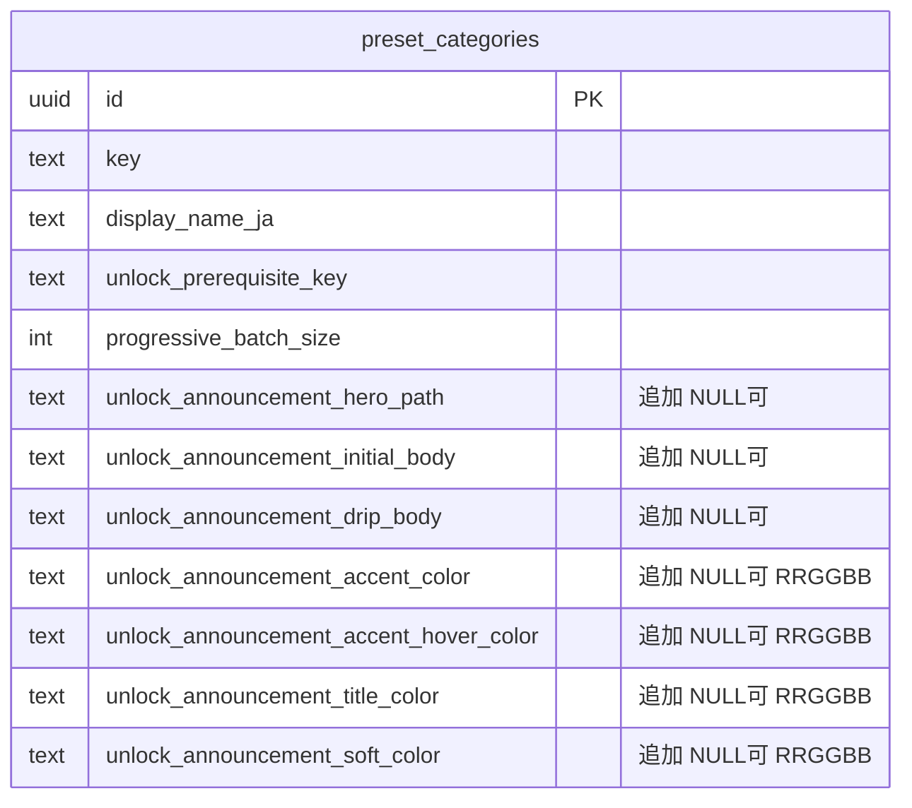
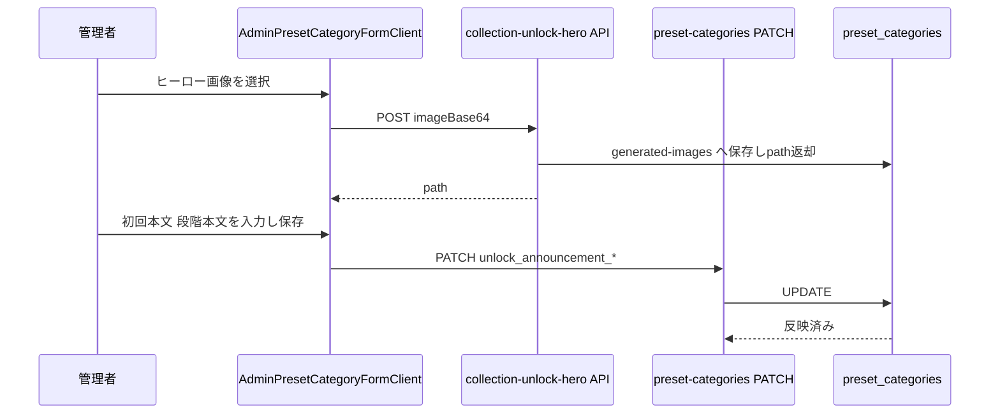
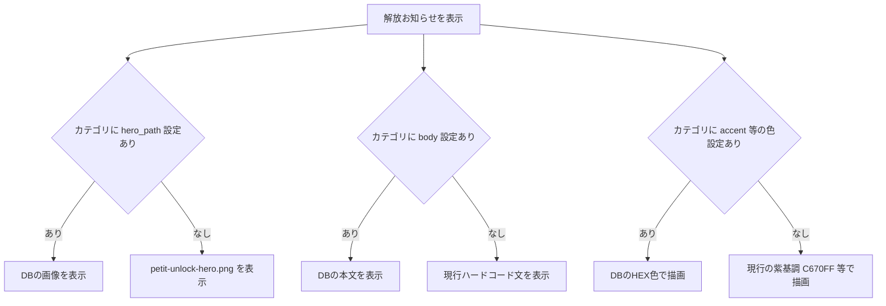
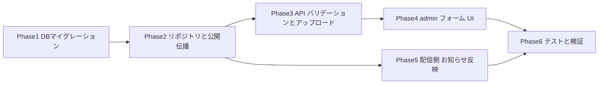

# 解放お知らせ（ぷち神）admin 設定化 実装計画書

> ぷち神等「解放ゲート付きカテゴリ」の解放お知らせモーダル（初回 `InitialUnlockModal` / 段階 `UnlockDripModal`）の
> **ヒーロー画像** と **本文** を、`preset_categories`（プリセットカテゴリ）単位で admin から編集可能にする。
>
> - **スコープ**: ヒーロー画像 ＋ 初回本文 ＋ 段階本文 ＋ **アクセント色（4色）**（カテゴリ単位）
> - **固定のまま**: タイトル接尾辞「〜が解放されました！」「新たに N体 解放！」、CTA 文言（「つくりに行く」→`/style`、「あとで」）、NEW ピルの文字、本文テキスト色、レイアウト
> - **色設計**: 進捗モーダル（`progress_modal_*_color` の4色）と同等に、`#RRGGBB` HEX 列を 4 つ追加。null なら現行の紫基調にフォールバック
> - **方式**: `progress_modal_*` 列と同じ「DB設定あればDB駆動、無ければ現行ハードコードにフォールバック」（厳密な後方互換 / 既存カテゴリ no-op）
> - 作成日: 2026-06-17

---

## コードベース調査結果

調査により、本機能は **既存の `progress_modal_*`（進捗モーダル DB 駆動化, PR #340/#341）と完全に同型** であることを確認した。新規パターンの導入は不要で、既存配線をなぞる。

### 現状のデータフロー（解放お知らせ）

```
listPublishedStylePresets()                       ← features/style-presets/lib/style-preset-repository.ts
  └ category embed select (L76) → mapCategoryRefStrict (L146) → StylePresetCategoryRef
        │
        ▼
resolveCollectionUnlockContext()                  ← features/collections/lib/collection-unlock-server.ts
buildCollectionUnlockAnnouncements()              ← features/collections/lib/collection-unlock-announcement.ts
  └ CollectionUnlockAnnouncement[]（categoryDisplayName 等を category から流し込み）
        │
        ▼
PetitUnlockAnnouncer (client)                     ← features/collections/components/PetitUnlockAnnouncer.tsx
  └ InitialUnlockModal / UnlockDripModal          ← features/collections/components/UnlockModals.tsx
        └ ★ ここでヒーロー画像 `/collections/petit-unlock-hero.png` と本文がハードコード
```

### 既存の DB 駆動化パターン（踏襲対象）

| 観点 | 参考実装（既存） | ファイル |
|------|------------------|----------|
| マイグレーション書式（列追加+CHECK+COMMENT+DOWN コメント） | `add_progress_modal_config` | `supabase/migrations/20260616120000_add_progress_modal_config.sql` |
| リポジトリ Row/Admin/Insert/Update + mapRow + create/update payload | `progress_modal_frame_path` 等 | `features/style-presets/lib/preset-category-repository.ts` |
| API バリデーション | `progress_modal_frame_path`（非空文字列 or null） | `app/api/admin/preset-categories/collection-settings-payload.ts` |
| 公開側 category 伝播（embed select + ref 型 + mapCategoryRefStrict） | `unlock_prerequisite_key` | `features/style-presets/lib/{schema.ts,style-preset-repository.ts}` |
| admin フォーム（画像アップロード + path 反映） | `handleModalFrameUpload` / `collectionCharacterPath` | `features/preset-categories/components/AdminPresetCategoryFormClient.tsx` |
| 画像アップロード API（base64→generated-images→path 返却） | `collection-progress-modal-frame` / `collection-character` | `app/api/admin/collection-progress-modal-frame/route.ts` |
| public バケット URL 生成 | `characterPublicUrl()`（generated-images） | `AdminPresetCategoryFormClient.tsx` L170 |

### 重要な発見（見落とし注意点）

1. **公開 embed select に新列を必ず追加** — `style-preset-repository.ts` L76 の `category:preset_categories!...(...)` は **明示列指定**。ここに新3列を足さないと、`progress_modal_*` 同様 `StylePresetPublicSummary.category` に値が乗らず、お知らせに反映されない。
2. **本文は ja のみ**（現行モーダルは locale 非依存・日本語固定）。`userGuidanceJa/En` のような ja/en 二重化は **今回は行わない**（ADR-002 参照）。
3. ヒーロー画像は `generated-images`（public バケット）に保存し path を DB 格納。配信側は `characterPublicUrl()` 相当で公開 URL 化。`/public/collections/petit-unlock-hero.png` は **未設定時のフォールバック**として残す。
4. **色は Tailwind の arbitrary class でハードコード**（`bg-[#C670FF] hover:bg-[#B14DF0]` 等）。動的な DB 色は Tailwind クラスでは表現できない（JIT が拾えない）ため、対象箇所を **インライン `style` または CSS 変数**方式へ置換する必要がある（進捗モーダルが `ringColor` 等を `stroke={...}` / inline style で渡しているのと同じ方針）。hover はクラスで動的化できないため、CSS 変数 + `:hover` か `onMouseEnter/Leave` で実現する。
5. **Supabase 接続**: マイグレーション適用は Phase 1 完了後に `supabase db push`（または migration up）で行う。CLAUDE.md の許可範囲内。差分は適用前にユーザーへ提示する。

---

## 1. 概要図

### データモデル（追加分のみ）



### 設定反映シーケンス



### 配信フォールバック判定



---

## 2. EARS 要件定義

- **R-01 (Optional)**: Where `unlock_announcement_hero_path` が設定されている, the system shall 初回解放モーダルのヒーロー画像にそのパスの画像を表示する。 / When the hero path is set, display that image in the initial unlock modal.
- **R-02 (Event)**: When `unlock_announcement_hero_path` が未設定, the system shall 現行のフォールバック画像 `/collections/petit-unlock-hero.png` を表示する。
- **R-03 (Optional)**: Where `unlock_announcement_initial_body` が設定されている, the system shall 初回モーダル本文にその文言を表示する。未設定なら現行ハードコード文を表示する。
- **R-04 (Optional)**: Where `unlock_announcement_drip_body` が設定されている, the system shall 段階解放モーダル本文にその文言を表示する。未設定なら現行ハードコード文（`{title}の続きが登場しました。`）を表示する。
- **R-05 (State)**: While 管理者がカテゴリ編集フォームを操作している, the system shall ヒーロー画像のアップロードと本文入力を提供し、保存時に `preset_categories` へ反映する。
- **R-06 (Authorization)**: While admin 以外がアップロード/更新 API を呼ぶ, the system shall `requireAdmin()` 相当で 401/403 を返す（既存 `collection-progress-modal-frame` と同じ認可）。
- **R-07 (Error)**: If 画像アップロードに失敗した, then the system shall フォーム上にエラーメッセージを表示し path を更新しない（既存 `handleModalFrameUpload` と同挙動）。
- **R-08 (Optional)**: Where 色設定列（`unlock_announcement_accent_color` 等）が設定されている, the system shall その HEX 色でボタン／見出し／淡い面を描画する。未設定の列は現行の紫基調（`#C670FF`/`#8B3DC9`/`#F3E0FF` 等）にフォールバックする。
- **R-09 (Error)**: If 色設定が `#RRGGBB` 形式でない, then the system shall API バリデーションで拒否する（DB CHECK と多層防御。`progress_modal_*_color` と同じ `^#[0-9A-Fa-f]{6}$`）。
- **R-10 (Invariant)**: 既存の解放ゲート無しカテゴリ・新列未設定カテゴリは、本変更後も表示・挙動が一切変わらない（厳密 no-op）。

---

## 3. ADR

### ADR-001: 専用列追加（JSON 集約や別テーブルにしない）
- **Context**: 解放お知らせの設定項目は「画像 path・初回本文・段階本文」の3つで、カテゴリ 1:1。
- **Decision**: `preset_categories` に nullable な 3 列を追加する。
- **Reason**: `progress_modal_*` / `collection_character_path` と完全に同じ粒度・ライフサイクル。別テーブルや JSONB 集約は既存パターンから逸脱し、embed select・mapRow の一貫性を損なう。
- **Consequence**: 列が増えるが、既存の追加列群（既に 20+ 列）と整合し、配線が機械的で安全。

### ADR-002: 本文は ja 単一列（ja/en 二重化しない）
- **Context**: 現行 `UnlockModals` は locale 非依存で日本語固定。`userGuidance*` は ja/en 両対応だが、お知らせモーダルは未対応。
- **Decision**: 今回は `*_body`（ja 相当）の単一列のみ追加。en 対応は将来課題。
- **Reason**: 現行挙動（ja 固定）を変えずスコープを限定。en 化は別 PR で locale 配線とセットで行うのが安全。
- **Consequence**: en ロケールでも日本語本文が出る（＝現状維持）。将来 en 列追加時は後方互換で拡張可能。

### ADR-004: 色は HEX 4 列（accent / accent_hover / title / soft）に限定
- **Context**: 解放モーダルの紫基調は `#C670FF`(ボタン)・`#B14DF0`(hover)・`#8B3DC9`(見出し)・`#F3E0FF`(淡い面)・`#F8EEFF→白`(パネル地)・`#7A5A93`(本文)で構成。全色を admin 化すると列が過多。
- **Decision**: 世界観を決める主要 4 色（`accent_color` / `accent_hover_color` / `title_color` / `soft_color`）のみ HEX 列で admin 化する。パネルのグラデ地色・本文テキスト色は固定のまま。
- **Reason**: 進捗モーダルの「色は4色まで」という前例と粒度を揃える。hover は accent から自動導出も可能だが、紫以外の色相に変えたとき破綻するため明示列にする。本文/地色まで開けると入力負荷とデザイン崩れリスクが上がる。
- **Consequence**: パネルの淡い地色は紫固定のままなので、accent を大きく別色相に変えると地色とわずかに不調和になり得る。必要なら後続 PR で `panel_color` を追加可能（後方互換）。

### ADR-003: ヒーロー画像は generated-images（public）に保存し path を DB 格納
- **Context**: 既存のカテゴリ画像（キャラ画像・モーダルフレーム・台紙テンプレ）はすべて generated-images バケットに保存し path を列に持つ。
- **Decision**: 同方式。新規アップロード API `/api/admin/collection-unlock-hero` を `collection-progress-modal-frame` の写経で追加。
- **Reason**: バケット・URL 生成・認可の既存資産をそのまま再利用でき、配信側も `characterPublicUrl()` 相当で済む。
- **Consequence**: アップロード route が 1 本増えるが、既存と同型で保守容易。

---

## 4. 実装計画（フェーズ + TODO）

### フェーズ間の依存関係



### Phase 1: DB マイグレーション
**目的**: `preset_categories` に nullable 3 列を追加。既存行は全 NULL で挙動不変。
**ビルド確認**: マイグレーション適用後 `supabase db diff` が空 / 既存テストが緑。

- [ ] `supabase/migrations/20260617HHMMSS_add_unlock_announcement_config.sql` 作成
  - `unlock_announcement_hero_path TEXT`
  - `unlock_announcement_initial_body TEXT`
  - `unlock_announcement_drip_body TEXT`
  - `unlock_announcement_accent_color TEXT`
  - `unlock_announcement_accent_hover_color TEXT`
  - `unlock_announcement_title_color TEXT`
  - `unlock_announcement_soft_color TEXT`
  - 色 4 列に `#RRGGBB` の CHECK 制約（`progress_modal_*_color` の制約を踏襲。`~* '^#[0-9A-Fa-f]{6}$'` or NULL）
  - `COMMENT ON COLUMN` を 7 列に付与（progress_modal の書式踏襲）
  - `-- DOWN:` コメントブロックを付与（DROP CONSTRAINT + DROP COLUMN）
  - 本文 2 列に文字列長 CHECK（例: `char_length(...) <= 200`）。本文の暴走入力防止に推奨
- [ ] ローカル/ステージングで適用 → `supabase db diff` で確認 → ユーザーに差分提示

### Phase 2: リポジトリと公開側伝播
**目的**: admin 取得経路（PresetCategory*）と公開取得経路（StylePresetCategoryRef）の両方に新3フィールドを通す。
**ビルド確認**: `npm run typecheck` 緑。

> 新フィールドは計 7 つ: `hero_path` / `initial_body` / `drip_body` / `accent_color` / `accent_hover_color` / `title_color` / `soft_color`。以下すべてこの 7 つを通す。

- [ ] `features/style-presets/lib/preset-category-repository.ts`
  - `PresetCategoryRow` に snake 7 列
  - `PresetCategoryAdmin` に camel 7 フィールド（`unlockAnnouncementHeroPath` / `...InitialBody` / `...DripBody` / `...AccentColor` / `...AccentHoverColor` / `...TitleColor` / `...SoftColor`）
  - `PresetCategoryInsert` / `PresetCategoryUpdate` に追加
  - `mapRow` に `?? null` 付与
  - `createPresetCategory` insert ペイロード / `updatePresetCategory` の `if (input.x !== undefined)` ブロック追加
- [ ] `features/style-presets/lib/schema.ts`
  - `StylePresetCategoryRef` に 7 フィールド（`string | null`）
- [ ] `features/style-presets/lib/style-preset-repository.ts`
  - `StylePresetCategoryRow` 型に snake 7 列追加
  - **L76 の embed select 文字列に新 7 列を追加**（最重要・忘れると反映されない）
  - `mapCategoryRefStrict`（embedded あり / fallback の両方）に追加

### Phase 3: API バリデーションとアップロード
**目的**: PATCH/POST で新3フィールドを受理。ヒーロー画像アップロード API を追加。
**ビルド確認**: `npm run typecheck` 緑 / payload テスト緑。

- [ ] `app/api/admin/preset-categories/collection-settings-payload.ts`
  - `CollectionSettingsPayload` に 7 フィールド
  - `unlock_announcement_hero_path`: 非空文字列 or null（`progress_modal_frame_path` と同型）
  - `unlock_announcement_initial_body` / `_drip_body`: 文字列 or null（trim、空文字は null 正規化、length 上限チェック）
  - `unlock_announcement_accent_color` / `_accent_hover_color` / `_title_color` / `_soft_color`: `HEX_COLOR_RE`（既存 `^#[0-9A-Fa-f]{6}$`）or null（`progress_modal_ring_color` の検証を流用）
- [ ] `app/api/admin/preset-categories/route.ts`（POST）/ `[id]/route.ts`（PATCH）で payload が新フィールドを反映することを確認（既存 spread 経路なら配線追加不要か確認）
- [ ] `app/api/admin/collection-unlock-hero/route.ts` 新規
  - `app/api/admin/collection-progress-modal-frame/route.ts` を写経
  - `requireAdmin()` 認可・base64 受領・generated-images へ保存・`{ path, width, height }` 返却

### Phase 4: admin フォーム UI
**目的**: カテゴリ編集フォームに「解放お知らせ」セクションを追加。
**ビルド確認**: `npm run lint` / `typecheck` 緑、フォームから保存可能。

- [ ] `features/preset-categories/components/AdminPresetCategoryFormClient.tsx`
  - form state に 7 フィールド（`initial?.* ?? null`）
  - `handleUnlockHeroUpload`（`handleModalFrameUpload` 写経 / `/api/admin/collection-unlock-hero` 呼び出し）
  - 「解放お知らせ」セクション UI:
    - ヒーロー画像アップロード + プレビュー（`characterPublicUrl`）
    - 初回本文 textarea + 段階本文 textarea
    - 色入力 4 つ（`<input type="color">` + HEX テキスト併用。既存の進捗モーダル色入力 UI を踏襲。null クリア手段も用意）
  - 解放ゲート（`unlockPrerequisiteKey`）が設定されたカテゴリでのみ表示する条件分岐（任意・UX 配慮）
  - 送信 body（POST/PATCH 両方）に 7 フィールドを追加

### Phase 5: 配信側 お知らせ反映
**目的**: モーダルが DB 値を使い、未設定時は現行ハードコードにフォールバック。
**ビルド確認**: `npm run typecheck` 緑、プレビュー（`?petitUnlockPreview=initial|drip`）で確認。

- [ ] `features/collections/lib/collection-unlock-announcement.ts`
  - `CollectionUnlockAnnouncement` に `heroImagePath` / `initialBody` / `dripBody` / `accentColor` / `accentHoverColor` / `titleColor` / `softColor`（すべて `string | null`）
  - `buildCollectionUnlockAnnouncements` で `items[0].category.unlockAnnouncement*` を流し込み
- [ ] `features/collections/components/UnlockModals.tsx`
  - 現行ハードコード値を定数化（`DEFAULT_INITIAL_BODY` / `DEFAULT_DRIP_BODY` / `ACCENT`=`#C670FF` / `ACCENT_HOVER`=`#B14DF0` / `ACCENT_TEXT`=`#8B3DC9` / `ACCENT_SOFT_BG`=`#F3E0FF`）
  - 色は Tailwind arbitrary class（`bg-[#C670FF]` 等）でハードコードされている箇所を style/CSS 変数方式へ置換し、props 由来の色を注入できるようにする（注意点参照）
  - `InitialUnlockModal` / `UnlockDripModal` に `heroImageUrl?` / `body?` / `colors?`（accent/hover/title/soft）props を追加。未指定はデフォルト定数 + `/collections/petit-unlock-hero.png`
- [ ] `features/collections/components/PetitUnlockAnnouncer.tsx`
  - `announcement.heroImagePath` を public URL 化、`initialBody`/`dripBody`/色 4 値を各モーダルへ受け渡し
- [ ] `features/home/components/HomePetitUnlockPreview.tsx` がプレビューでも新フィールドを通すことを確認（実プリセット由来なので自然に流れるはず）

### Phase 6: テストと検証
**目的**: 回帰防止と実機確認。
**ビルド確認**: `npm run lint && npm run typecheck && npm run test && npm run build -- --webpack` 全緑。

- [ ] payload バリデーション単体テスト追加（`tests/unit/.../collection-settings-payload.test.ts`）
- [ ] `collection-unlock-announcement.test.ts` に「hero/body が category から載る」「未設定で null」のケース追加
- [ ] `UnlockModals` のフォールバック（props 無し=現行表示）スナップショット/挙動テスト
- [ ] 実機: `?petitUnlockPreview=initial|drip` で DB 設定あり/なし両方を確認
- [ ] 既存カテゴリ（解放ゲート無し）で no-op を確認

---

## 5. 修正対象ファイル一覧

| ファイル | 操作 | 変更内容 |
|----------|------|----------|
| `supabase/migrations/20260617_add_unlock_announcement_config.sql` | 新規 | 3 列追加 + COMMENT + DOWN |
| `features/style-presets/lib/preset-category-repository.ts` | 修正 | Row/Admin/Insert/Update/mapRow/create/update に 3 フィールド |
| `features/style-presets/lib/schema.ts` | 修正 | `StylePresetCategoryRef` に 3 フィールド |
| `features/style-presets/lib/style-preset-repository.ts` | 修正 | embed select 文字列 + Row 型 + mapCategoryRefStrict |
| `app/api/admin/preset-categories/collection-settings-payload.ts` | 修正 | 3 フィールドのバリデーション |
| `app/api/admin/preset-categories/route.ts` / `[id]/route.ts` | 修正 | 新フィールド配線（必要時） |
| `app/api/admin/collection-unlock-hero/route.ts` | 新規 | ヒーロー画像アップロード（modal-frame 写経） |
| `features/preset-categories/components/AdminPresetCategoryFormClient.tsx` | 修正 | 解放お知らせセクション + アップロードハンドラ + 送信 body |
| `features/collections/lib/collection-unlock-announcement.ts` | 修正 | announcement に hero/body を追加 |
| `features/collections/components/UnlockModals.tsx` | 修正 | props 化 + デフォルト定数フォールバック |
| `features/collections/components/PetitUnlockAnnouncer.tsx` | 修正 | hero/body の受け渡し |
| `features/home/components/HomePetitUnlockPreview.tsx` | 修正 | プレビュー伝播確認（必要時） |
| `tests/unit/.../collection-settings-payload.test.ts` | 修正 | バリデーションテスト追加 |
| `tests/unit/.../collection-unlock-announcement.test.ts` | 修正 | hero/body 反映テスト追加 |

---

## 6. 品質・テスト観点

### 品質チェックリスト
- [ ] **エラーハンドリング**: アップロード失敗時に path を更新せずエラー表示（既存 `handleModalFrameUpload` 同等）
- [ ] **権限制御**: アップロード/更新 API が `requireAdmin()` 認可済み
- [ ] **データ整合性**: 全列 nullable、未設定で現行挙動を厳密維持（no-op）
- [ ] **セキュリティ**: 本文 length 上限（DB CHECK + API バリデーション多層防御）、画像は admin のみアップロード可
- [ ] **i18n**: 今回は ja 固定（ADR-002）。en は将来課題として明記

### テスト観点
| カテゴリ | 内容 |
|----------|------|
| 正常系 | DB 設定あり → 画像/本文が反映される |
| フォールバック | DB 未設定 → 現行ハードコード（画像/文/紫基調の色）が出る |
| 色 | accent/title/soft を設定 → ボタン・見出し・淡い面に反映。不正 HEX は拒否 |
| 異常系 | アップロード失敗時にフォームエラー、path 不変 |
| 権限 | 非 admin のアップロード/更新が拒否される |
| no-op | 解放ゲート無しカテゴリで一切変化なし |
| 実機 | `?petitUnlockPreview=initial\|drip` で両系統を目視確認 |

---

## 7. ロールバック方針

- **DB**: マイグレーションに DOWN（DROP CONSTRAINT + DROP COLUMN）をコメントで用意。7 列とも nullable・参照は全てフォールバック付きなので、列が残ったままコードを revert しても無害。
- **コード**: Phase ごとにコミット。配信側（Phase 5）を revert すれば即ハードコードに戻る。
- **段階導入**: admin で値を入れない限り全カテゴリで現行表示のまま（＝設定が事実上の機能フラグ）。go-live は「ぷち神カテゴリに値を入れる」運用操作だけで完結。

---

## 8. 使用スキル

| スキル | 用途 | フェーズ |
|--------|------|----------|
| `/project-database-context` | DB 設計の参照 | Phase 1 |
| `/spec-extract` `/spec-write` | EARS 精査 | テスト |
| `/test-flow` `/test-generate` | テスト生成 | テスト |
| `/git-create-branch` | ブランチ作成 | 実装開始時 |
| `/git-create-pr` | PR 作成（日本語必須） | 実装完了時 |

---

## 前提・未確定事項

- `app/api/admin/preset-categories/route.ts` / `[id]/route.ts` が payload を spread で反映しているか未読。Phase 3 着手時に確認し、必要なら明示配線を足す。
- 本文 length 上限値（例 200 文字）は要確認。モーダル枠に収まる現実的な上限をユーザーと合意してから CHECK に入れる。
- ヒーロー画像の推奨実寸（現行 600×600）をフォームのヘルプ文に明記する。
- **色 4 列で十分か**（accent / accent_hover / title / soft）。パネルのグラデ地色（`#F8EEFF`）・本文テキスト色（`#7A5A93`）は今回固定の方針（ADR-004）。accent を大きく別色相にしたとき地色との不調和が気になるなら `panel_color` 追加を実装前に判断。
- hover 色の扱い: 明示列（`accent_hover_color`）か accent からの自動暗化か。計画では明示列としたが、入力負荷軽減のため「未設定なら accent と同色／自動暗化」フォールバックも可。
