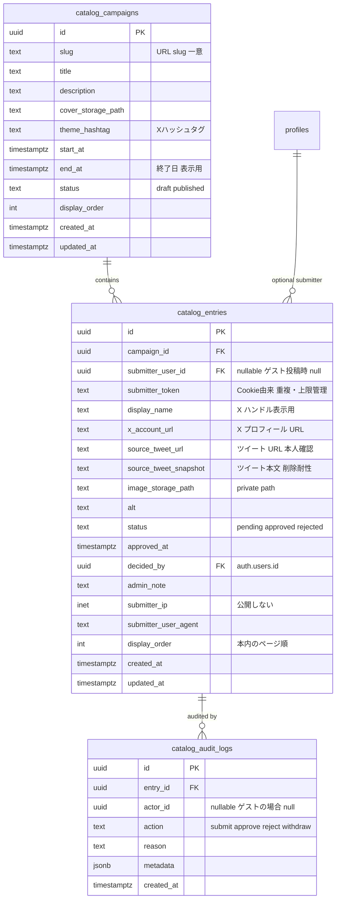
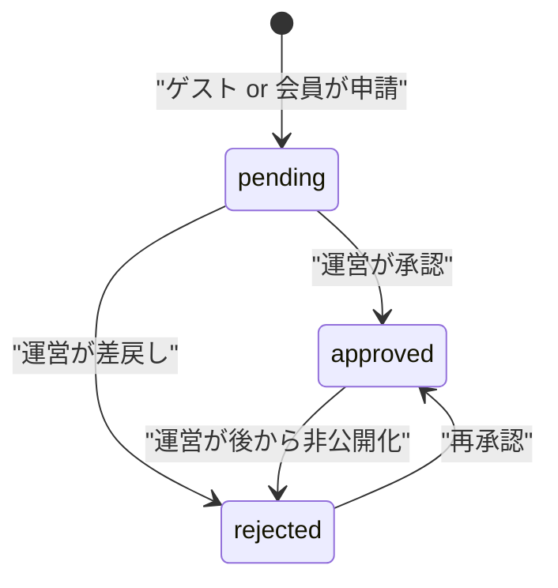
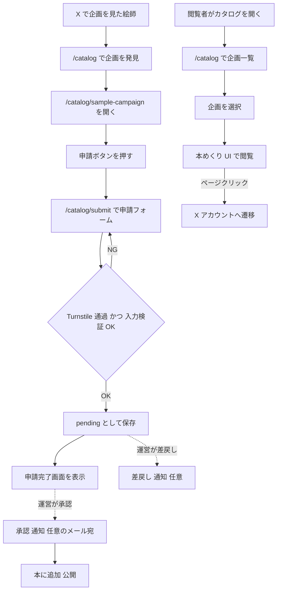
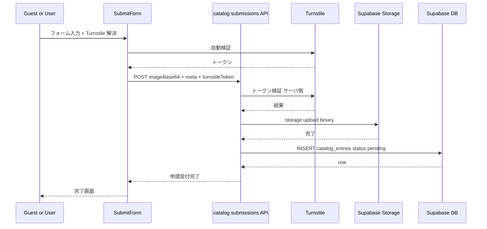
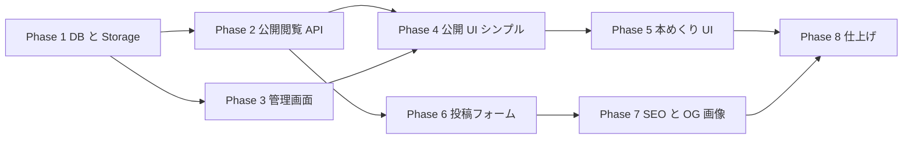

# 絵師カタログ（User Catalog）実装計画

## 目的

X 上で AI イラストを投稿しているクリエイターを Pelsta に取り込み、運営者が承認した作品を「企画ごとの本」として公開・展示する。閲覧者は本をめくる UI で楽しみ、絵師は X アカウントへの流入を得る。

**この機能は既存の Inspire（着せ替えテンプレート）とは**:
- 目的が異なる：Inspire は「着せ替え素材」、Catalog は「絵師の作品ショーケース」
- 投稿のハードルが異なる：Catalog は未ログイン投稿可、認証なし、運営承認のみ
- データを分離する：誤って Inspire テンプレに混入しない安全性

---

## コードベース調査結果（Phase B サマリ）

詳細は調査レポート参照。主要な参考ファイル:

| 種別 | 既存パス（参考にする） | 行番号 | 流用ポイント |
|---|---|---|---|
| DB スキーマ | `supabase/migrations/20260502124531_add_user_style_templates.sql` | 1-155 | テーブル + RLS + トリガ + インデックス |
| Storage バケット | `supabase/migrations/20260502124557_add_style_templates_storage_bucket.sql` | 1-34 | 10MB / private / RLS（uid prefix） |
| RPC | `supabase/migrations/20260502124719_add_promote_user_style_template_draft_rpc.sql` | 1-68 | 状態遷移 RPC |
| Repository | `features/inspire/lib/repository.ts` | 1-242 | service-role 経由のサーバ操作 + 署名 URL |
| 申請フォーム | `features/inspire/components/UserStyleTemplateSubmissionForm.tsx` | 1-650 | 画像アップロード（ただし AI プレビュー部分は本計画では不要） |
| 管理画面 | `app/(app)/admin/style-templates/AdminStyleTemplatesClient.tsx` | 1-250 | タブ・アクション・lightbox |
| Admin Nav | `app/(app)/admin/admin-nav-items.ts` | 22-131 | サイドバー項目追加 |
| Admin Auth | `lib/auth.ts:requireAdmin` | 59-78 | API 用 admin 認証 |
| i18n | `messages/ja.ts`（`inspirePage` 等） | 1599+ | キー設計 |
| Cache | `features/generation/components/CachedGeneratedImageGallery.tsx` | - | `"use cache"` + `cacheTag` パターン |
| 公開ページ SSR | `app/(app)/inspire/[templateId]/page.tsx` | 1-162 | `generateMetadata` + SSR |
| 通知連携 | `supabase/migrations/20260502120400_extend_notifications_for_style_template.sql` | 1-57 | type / entity_type の CHECK 拡張 |

**注意点**:

- **Bot 対策が現リポジトリに存在しない**。Turnstile / reCAPTCHA は新規導入が必要。
- Inspire は申請時に**プレビュー生成（OpenAI + Gemini）**が走るが、**Catalog はこの工程が不要**。投稿フォームは Inspire より大幅にシンプル。
- 既存の `react-pageflip` / `framer-motion` / `@react-three/fiber` は package.json になし。**本めくり UI 用に新規導入が必要**。
- Inspire の詳細ページは `requireAuth()` だが、**Catalog は未ログイン閲覧可**にする。

---

## 1. 概要図

### データモデル

### 状態遷移

### ユーザー操作フロー

### API 通信シーケンス（投稿フロー）

### フェーズ間の依存関係

---

## 2. EARS（要件定義）

### 企画の管理（CR-1）
- **CR-1.1**: When 運営者が管理画面から新規企画を作成したとき、the system shall `catalog_campaigns` に `status='draft'` で保存する。
- **CR-1.2**: When 運営者が draft を公開したとき、the system shall `status='published'` に遷移させ、公開 URL `/catalog/[slug]` で閲覧可能にする。
- **CR-1.3**: While `status='published'` の状態、the system shall `end_at` を超えても閲覧を継続させる（表示メタとしての参考のみ）。
- **CR-1.4**: If `slug` に重複があれば、then the system shall 一意制約違反として 400 を返す。

### 投稿フロー（CR-2）
- **CR-2.1**: When ゲスト/会員が `/catalog/submit?campaign=<slug>` で画像 + メタ + ツイート URL を送信し、Turnstile 検証が成功したとき、the system shall `status='pending'` で `catalog_entries` に保存する。
- **CR-2.2**: While 同一 `submitter_token` + 同一 `campaign_id` の `pending+approved` 行が 3 件以上ある状態、the system shall 新規投稿を 429 で拒否する。
- **CR-2.3**: When 投稿者が任意のメールアドレスを入力したとき、the system shall `submitter_email` を記録する（公開しない）。
- **CR-2.4**: If Turnstile 検証が失敗したら、then the system shall 400 を返し DB には書かない。
- **CR-2.5**: If 画像 MIME が許可外、またはサイズが 10MB 超なら、then the system shall 400 を返す。
- **CR-2.6**: If 同じ `source_tweet_url` が既に承認済みなら、then the system shall 409 を返す（重複防止）。

### 審査フロー（CR-3）
- **CR-3.1**: While 運営者が管理画面 `/admin/user-catalog` を見ている状態、the system shall pending タブで未審査エントリーを一覧する。
- **CR-3.2**: When 運営者が「承認」を押したとき、the system shall `status='approved'`、`approved_at=now()`、`decided_by=admin_id` に更新する。
- **CR-3.3**: When 運営者が「差戻し」を押したとき、the system shall `status='rejected'`、`admin_note` に理由を記録する。
- **CR-3.4**: When 承認/差戻しがあったとき、`submitter_email` が記録されていれば the system shall Resend 経由で結果を通知する（任意フィールドが空なら通知しない）。

### 公開閲覧（CR-4）
- **CR-4.1**: While 未ログインユーザーが `/catalog` にアクセスした状態、the system shall `status='published'` の企画一覧を表示する。
- **CR-4.2**: While 未ログインユーザーが `/catalog/[slug]` にアクセスした状態、the system shall その企画の `status='approved'` エントリーのみを `display_order` 順で表示する。
- **CR-4.3**: When ユーザーが本のページをクリックしたとき、the system shall 該当 entry の `x_account_url` を新規タブで開く（rel="noopener noreferrer"）。
- **CR-4.4**: Where SSR で OG 画像を要求された場合、the system shall 各 entry の画像 + 表示名で OG 画像を返す。

### 個別共有 URL（CR-5）
- **CR-5.1**: When `/catalog/[slug]/p/[entry-id]` にアクセスしたとき、the system shall 該当ページから本を開いた状態で表示する（直リンク対応）。
- **CR-5.2**: While entry が `status='approved'` でないとき、the system shall 404 を返す。

### 管理（CR-6 - 通知）
- **CR-6.1**: When admin が承認したとき、the system shall `submitter_user_id` が存在すれば `notifications` に `catalog_entry_approved` を作成する。
- **CR-6.2**: When admin が差戻したとき、the system shall 同様に `catalog_entry_rejected` を作成する（会員投稿者のみ）。

---

## 3. ADR（設計判断記録）

### ADR-001: Inspire テンプレートとは別テーブル・別 UI として実装する

- **Context**: 既存の Inspire 機能（`user_style_templates`）と新規 Catalog は「ユーザー投稿 + 運営承認 + 公開」という構造が似ているため、同一テーブル + フラグ運用も検討対象になる。
- **Decision**: **別テーブル `catalog_campaigns` + `catalog_entries` として実装する**。
- **Reason**:
  - 用途が違う（Inspire = 着せ替え生成のテンプレ素材 / Catalog = 絵師の作品ショーケース）。
  - Inspire はプレビュー生成・利用回数カウント・着せ替えジョブとの紐付けなど重い列を持つが、Catalog には不要。
  - 「Catalog 行が誤って Inspire テンプレとして使われる」事故を構造的に排除する。
  - 将来「Catalog → Inspire 昇格」が必要になった場合は `catalog_entries.promoted_to_inspire_template_id` で参照を残せばよい。
- **Consequence**: テーブル数が増えるが、各機能の責務が明確になり保守性が高い。

### ADR-002: ゲスト投稿を許可し、ツイート URL を本人確認の代替にする

- **Context**: 心理的ハードルを最小化したい。会員登録もメール認証も負担。
- **Decision**: **完全ゲスト投稿可（認証なし）。代わりにツイート URL を必須入力とし、運営が承認時に目視確認する**。
- **Reason**:
  - X アカウントのオーナーしか自分のアカウントから投稿できないので、ツイート URL は実質的な所有証明になる。
  - 運営の承認時にツイートを 1 クリックで開けば「画像 + 投稿者」が同時に確認でき、運営負荷は最小。
  - メール認証ゼロ・OAuth ゼロで実装でき、X ユーザーは「フォーム書いて出すだけ」で済む。
- **Consequence**: なりすまし完全防止は構造的に不可能だが、「他人の作品で他人のハンドル名」を装うのは事実上極めて難しい。承認フローで吸収する。スパム/ボット対策は別途必須（ADR-005）。

### ADR-003: 本めくり UI は `react-pageflip` を採用

- **Context**: 3D アニメーション付き見開き UI のニーズ。自作は工数が大きい。
- **Decision**: **PC は `react-pageflip` で見開き 2 ページ + 3D めくり、モバイルは Swiper か Embla で 1 ページ + スワイプの 2 系統切替**。
- **Reason**:
  - `react-pageflip` は React で広く使われ、3D めくりアニメーションが組み込み済み。
  - モバイルで見開き 2 ページは画面が窮屈なので分岐させる。
  - 同じデータソース（entries 配列）から両方の UI を駆動できる。
- **Consequence**: 新規依存が 1〜2 個増える。`react-pageflip` のメンテ状況をウォッチする必要あり。代替候補は `turn.js`（jQuery 系のため React 統合がやや煩雑）。

### ADR-004: Bot 対策に Cloudflare Turnstile を採用

- **Context**: 既存リポジトリには Bot 対策が存在しない。ゲスト投稿のため何かしらの対策が必要。
- **Decision**: **Cloudflare Turnstile を採用**。
- **Reason**:
  - 無料、PII 追跡なし、ユーザーには見えない（チェックボックスのみ、CAPTCHA 不要）。
  - サーバ側検証 API があり実装が単純。
  - Pelsta のドメインで sitekey/secret 発行のみで開始できる。
- **Consequence**: Cloudflare アカウントとサイトキー管理が運用に加わる。代替案は reCAPTCHA v3（Google 依存で PII 懸念）。

### ADR-005: 公開閲覧は `"use cache"` + `cacheTag` で per-campaign キャッシュ

- **Context**: `/catalog` と `/catalog/[slug]` は未ログインで頻繁にアクセスされる。
- **Decision**: 各企画ページの entry 一覧取得を `"use cache"` でラップし、`cacheTag(`catalog-${slug}`)` を付与。承認/非承認時に `revalidateTag` で即時失効。
- **Reason**:
  - SSR + cache で安定した SEO スコアと配信速度。
  - 承認イベントは頻度が低いので、revalidate コストは小さい。
- **Consequence**: 既存の Inspire パターンを踏襲できるため学習コストは低い。

### ADR-006: MVP は ja のみ、他言語ファイルにはフォールバック値を入れる

- **Context**: Pelsta は 16 言語対応だが、Catalog の MVP は ja のみ提供。
- **Decision**: `messages/ja.ts` に Catalog のキーを追加。**他 15 言語ファイルには ja の値をそのまま入れる**（後で正式翻訳）。
- **Reason**:
  - `DeepReplaceStrings<typeof jaMessages>` の型整合を保つ必要がある（キーが欠けるとビルドが通らない）。
  - 全 16 言語に同じ ja 文字列を入れることで型を満たし、ja 以外の locale でも崩れずに表示できる。
  - 後日、`/catalog` を多言語化する際は ja を上書き翻訳していくだけで済む。
- **Consequence**: 一時的に英語/中国語等のロケールで日本語が表示される。コミットメッセージに明示し、Phase 2 で本翻訳タスクを起票する。

### ADR-007: 画像は base64 ではなく multipart アップロードを採用

- **Context**: Inspire の投稿フォームは「base64 でインライン送信 → 同期で OpenAI/Gemini を叩く」設計だが、Catalog はプレビュー生成不要。
- **Decision**: **multipart/form-data（FormData）で素直にアップロード**。
- **Reason**:
  - Catalog は単純な画像保存だけなので base64 のオーバーヘッドは無駄。
  - FormData の方が標準的でブラウザ実装が安定。
  - サーバ側で `formData.get('image')` から File を取り、`supabase.storage.from('catalog-images').upload()` で素直に保存。
- **Consequence**: Inspire と書き味が違うが、責務が違うので問題ない。コードは独立して読める。

---

## 4. 実装計画（フェーズ + TODO）

### Phase 1: DB スキーマと Storage の構築

**目的**: テーブル・RLS・Storage バケット・RPC を整備し、Phase 2 以降の API/UI 実装の土台を作る。
**ビルド確認**: マイグレーション適用後にエラーなく `npm run build -- --webpack` が通ること。

- [ ] **マイグレーション**: `supabase/migrations/{date}_add_catalog_campaigns.sql`
  - `catalog_campaigns` テーブル作成（ER 図準拠）
  - インデックス: `(status, display_order)`, `(slug)` 一意
  - RLS: SELECT は誰でも、UPDATE/INSERT/DELETE は admin のみ（service_role 経由 or admin RPC）
- [ ] **マイグレーション**: `supabase/migrations/{date}_add_catalog_entries.sql`
  - `catalog_entries` テーブル作成
  - インデックス: `(campaign_id, status, display_order)`, `(submitter_token, campaign_id)`, `(source_tweet_url)` 一意（partial: where status='approved'）
  - RLS:
    - SELECT: `status='approved'` の行は誰でも、その他は `submitter_user_id = auth.uid()` か admin
    - INSERT: 誰でも可能（ゲスト含む）。ただし API 経由でのみ受け付ける（直接 SQL injection を防ぐため `WITH CHECK status='pending'` 等で制限）
    - UPDATE/DELETE: admin のみ
- [ ] **マイグレーション**: `supabase/migrations/{date}_add_catalog_audit_logs.sql`
  - 監査ログテーブル。Inspire の `style_template_audit_logs` 準拠。
- [ ] **マイグレーション**: `supabase/migrations/{date}_add_catalog_images_storage_bucket.sql`
  - バケット名: `catalog-images`
  - private、10MB 上限、PNG/JPEG/WebP/HEIC 許可
  - RLS: INSERT は service_role のみ（API 経由でしか書けない）、SELECT は signed URL 必須
  - 参考: `supabase/migrations/20260502124557_add_style_templates_storage_bucket.sql`
- [ ] **マイグレーション**: `supabase/migrations/{date}_add_catalog_rpcs.sql`
  - `apply_catalog_entry_decision(entry_id uuid, action text, reason text, admin_id uuid)`: pending/approved → approved/rejected。Inspire の `apply_user_style_template_decision` パターン。
  - `assert_catalog_submission_cap(p_token text, p_campaign_id uuid)`: トリガではなく明示 RPC として作り、API から呼ぶ（3 件まで）。
- [ ] **マイグレーション**: `supabase/migrations/{date}_extend_notifications_for_catalog.sql`
  - `notifications.type` の CHECK に `catalog_entry_approved`, `catalog_entry_rejected` を追加。
  - `entity_type` に `catalog_entry` を追加。
  - 参考: `supabase/migrations/20260502120400_extend_notifications_for_style_template.sql`
- [ ] **`.cursor/rules/database-design.mdc` の更新**: 新規テーブル定義を追記。
- [ ] **型定義の更新**: `lib/supabase/types.ts`（もしあれば）に新規テーブル型を追加 or 必要に応じて手書き型を追加。

### Phase 2: 公開閲覧 API

**目的**: 未ログインで閲覧可能な公開 API を実装。
**ビルド確認**: API ハンドラのユニット/統合テストが通ること、build エラーなし。

- [ ] **`features/catalog/lib/repository.ts`**: service-role ベースの DB アクセス層。
  - `getPublishedCampaigns()`
  - `getCampaignBySlug(slug)`
  - `getApprovedEntriesByCampaign(campaignId)`
  - `createCatalogSignedUrl(storagePath, ttl)`（一括 batch 版も）
  - 参考: `features/inspire/lib/repository.ts`
- [ ] **`app/api/catalog/campaigns/route.ts`**: GET 公開企画一覧。
  - `"use cache"` + `cacheLife("hours")` + `cacheTag("catalog-campaigns")`
- [ ] **`app/api/catalog/campaigns/[slug]/route.ts`**: GET 個別企画 + エントリー一覧。
  - `"use cache"` + `cacheTag(\`catalog-campaign-\${slug}\`)`
- [ ] **`app/api/catalog/entries/[id]/route.ts`**: GET 個別エントリー（共有 URL 用）。
- [ ] **`features/catalog/lib/route-copy.ts`**: API エラーメッセージの locale 解決。

### Phase 3: 管理画面（審査キュー + 企画 CRUD）

**目的**: 運営者が企画を作成・公開し、申請を承認/差戻しできるようにする。
**ビルド確認**: 管理画面が表示され、承認・差戻し・企画作成のサニタリーテストが通る。

- [ ] **`features/catalog/lib/admin-repository.ts`**: 管理者向けの DB アクセス層。
  - `listCampaignsAdmin()`, `createCampaign()`, `updateCampaign()`, `publishCampaign()`
  - `listEntriesAdmin(status, campaignId)`
  - `decideEntry(entryId, action, reason)`（RPC 呼び出し）
- [ ] **`app/api/admin/catalog/campaigns/route.ts`**: GET (admin 一覧), POST (新規作成)。
  - `requireAdmin()` を呼ぶ。
- [ ] **`app/api/admin/catalog/campaigns/[id]/route.ts`**: PATCH (更新), DELETE。
- [ ] **`app/api/admin/catalog/campaigns/[id]/publish/route.ts`**: POST (公開遷移)。
- [ ] **`app/api/admin/catalog/entries/route.ts`**: GET (admin 一覧、status filter)。
- [ ] **`app/api/admin/catalog/entries/[id]/decision/route.ts`**: POST (承認/差戻し)。
  - 参考: `app/api/admin/style-templates/[id]/decision/route.ts`
- [ ] **`app/api/admin/catalog/entries/[id]/order/route.ts`**: PATCH (display_order 変更、drag-drop 用)。
- [ ] **`app/(app)/admin/catalog/campaigns/page.tsx`** + Client コンポーネント: 企画 CRUD UI。
- [ ] **`app/(app)/admin/catalog/entries/page.tsx`** + `AdminCatalogEntriesClient.tsx`: 審査キュー UI。
  - 参考: `app/(app)/admin/style-templates/AdminStyleTemplatesClient.tsx`
  - タブ: pending / approved / rejected
  - 各行: 画像 + 表示名 + X リンク + **ツイートを開くボタン** + 承認/差戻し
- [ ] **`app/(app)/admin/admin-nav-items.ts`**: メニュー追加（"カタログ管理" 1 項目で、内部にサブナビは持たない or 別ページに分ける判断）。

### Phase 4: 公開 UI（シンプル版・本めくり前段階）

**目的**: 本めくり UI なしで、まずグリッドのインデックスと簡易な閲覧画面を出す。Phase 1〜3 で作ったデータが見えることを確認するためのフォールバック。
**ビルド確認**: `/catalog` および `/catalog/[slug]` がブラウザで表示される。

- [ ] **`app/(app)/catalog/page.tsx`**: 企画一覧（カバー画像のグリッド）。
- [ ] **`app/(app)/catalog/[slug]/page.tsx`**: 個別企画ページ（最初はシンプルなグリッド表示）。
- [ ] **`features/catalog/components/CampaignCard.tsx`**, **`CatalogEntryCard.tsx`**: 表示用コンポーネント。
- [ ] **`messages/ja.ts`** + 他 15 言語: `catalogPage`, `catalogSubmission` 等のキー追加（他言語は ADR-006 に従い ja 値をコピー）。

### Phase 5: 本めくり UI

**目的**: 3D アニメーション付き本めくり UI で個別企画を閲覧できるようにする。
**ビルド確認**: PC・モバイル両方で本めくりが動作。

- [ ] **依存追加**: `npm install react-pageflip` （+ 必要なら `react-swipeable` などの併用ライブラリ）。
- [ ] **`features/catalog/components/CatalogBookView.tsx`**:
  - PC: `react-pageflip` で見開き 2 ページ + 3D めくり。
  - モバイル: 1 ページずつのスワイプ表示（CSS scroll-snap or Embla）。
  - `useMediaQuery` で切替（lg 以上で PC モード）。
- [ ] **`features/catalog/components/CatalogPage.tsx`**: 1 ページ分のコンテンツ（画像 + 表示名 + X リンク）。
- [ ] **`app/(app)/catalog/[slug]/page.tsx`** を更新し、`CatalogBookView` を採用。
- [ ] **`app/(app)/catalog/[slug]/p/[entryId]/page.tsx`**: 直リンクで本を該当ページから開く。
- [ ] **画像プリロード**: 30 枚程度なら全件、それ以上は前後 N 枚を先読みする戦略。

### Phase 6: 投稿フォーム（ゲスト対応 + Turnstile）

**目的**: ゲストでも投稿できるフォームを実装し、Bot 対策を施す。
**ビルド確認**: フォームから申請して pending として DB に保存される。

- [ ] **環境変数**: `.env.local.example` に `NEXT_PUBLIC_TURNSTILE_SITE_KEY`, `TURNSTILE_SECRET_KEY` を追加。
- [ ] **依存追加**: `npm install @marsidev/react-turnstile`（軽量で広く使われる React ラッパー）。
- [ ] **`features/catalog/components/CatalogSubmissionForm.tsx`**:
  - 入力: 画像 / 表示名 / X アカウント URL / **ツイート URL** / 任意のコンタクト先（メール or X DM 可否）/ 著作権同意チェック / Turnstile widget
  - クライアント側バリデーション: MIME、サイズ、URL 形式、必須項目
  - ファイル: FormData で multipart 送信（ADR-007）
- [ ] **`app/api/catalog/submissions/route.ts`**: POST 申請受付。
  - 1. multipart の解析（File + メタ）
  - 2. Turnstile トークンをサーバ側で検証（`https://challenges.cloudflare.com/turnstile/v0/siteverify`）
  - 3. レート制限チェック（同 IP/同トークン 24h 5 件まで、同 token+campaign の `pending+approved` 3 件まで）
  - 4. ツイート URL 正規化 + 重複検査
  - 5. service-role で `catalog-images` バケットに upload
  - 6. `catalog_entries` に INSERT `status='pending'`
  - 7. 完了レスポンス
- [ ] **`app/(app)/catalog/submit/page.tsx`**: 申請ページ。
- [ ] **`app/(app)/catalog/submit/thanks/page.tsx`**: 申請完了画面（任意メール入力時は「結果は連絡します」）。
- [ ] **メール通知（Resend）**: 承認/差戻し時に `submitter_email` 宛に Resend で通知する Server Action / Edge Function（Phase 3 の `decide_entry` API から呼び出し）。
- [ ] **submitter_token 発行**: 訪問時にクッキー（HttpOnly でなく JS 読取可、 SameSite=Lax）で UUID を発行。

### Phase 7: SEO + OG 画像 + サイトマップ

**目的**: X 共有時にカード表示されるよう、各ページに OG 画像を生成・配信する。
**ビルド確認**: `/catalog/...` のページが OG タグを返す。

- [ ] **`app/(app)/catalog/page.tsx`** に `generateMetadata`。
- [ ] **`app/(app)/catalog/[slug]/page.tsx`** に `generateMetadata`（企画タイトル + カバー画像）。
- [ ] **`app/(app)/catalog/[slug]/p/[entryId]/page.tsx`** に `generateMetadata`（entry の画像 + 表示名）。
- [ ] **OG 画像動的生成**: `next/og` で `app/catalog/og/[slug]/route.tsx` 等を作成（必要なら）。または事前に画像を Storage にコピーして使う簡易版でも可。
- [ ] **`app/sitemap.xml/route.ts`** に catalog の URL を追加。

### Phase 8: 仕上げ・テスト・実機確認

**目的**: 全体の品質を仕上げる。
**ビルド確認**: lint / typecheck / test / build がすべて通る。

- [ ] **統合テスト**: 投稿 API、承認 API、公開 API の Jest テスト。
- [ ] **ユニットテスト**: Repository、Turnstile 検証ヘルパ、ツイート URL 正規化ヘルパ。
- [ ] **E2E**（Playwright）: 「ゲストが投稿 → admin が承認 → 公開ページに表示」フロー 1 本。
- [ ] **アクセシビリティ**: 本めくり UI のキーボード操作（←→ で前後ページ）、スクリーンリーダー対応（alt テキスト・aria-label）。
- [ ] **エラーメッセージの整備**: 429/409/400 の文言を `route-copy.ts` で網羅。
- [ ] **管理画面の検索/フィルタ**: 企画名 + status での絞り込み。
- [ ] **多言語フォローアップタスク起票**: messages/* の ja 以外を本翻訳する Issue を作成（ADR-006）。

---

## 5. 修正対象ファイル一覧

| ファイル | 操作 | 変更内容 |
|---|---|---|
| `supabase/migrations/{date}_add_catalog_campaigns.sql` | 新規 | 企画テーブル |
| `supabase/migrations/{date}_add_catalog_entries.sql` | 新規 | 投稿エントリーテーブル |
| `supabase/migrations/{date}_add_catalog_audit_logs.sql` | 新規 | 監査ログ |
| `supabase/migrations/{date}_add_catalog_images_storage_bucket.sql` | 新規 | Storage バケット |
| `supabase/migrations/{date}_add_catalog_rpcs.sql` | 新規 | 状態遷移 RPC |
| `supabase/migrations/{date}_extend_notifications_for_catalog.sql` | 新規 | 通知タイプ拡張 |
| `features/catalog/lib/repository.ts` | 新規 | 公開向け DB アクセス |
| `features/catalog/lib/admin-repository.ts` | 新規 | 管理向け DB アクセス |
| `features/catalog/lib/route-copy.ts` | 新規 | i18n |
| `features/catalog/lib/turnstile.ts` | 新規 | Turnstile 検証ヘルパ |
| `features/catalog/lib/tweet-url.ts` | 新規 | ツイート URL 正規化 |
| `features/catalog/components/CampaignCard.tsx` | 新規 | 企画カバーカード |
| `features/catalog/components/CatalogEntryCard.tsx` | 新規 | エントリーカード（grid 用） |
| `features/catalog/components/CatalogBookView.tsx` | 新規 | 本めくり UI |
| `features/catalog/components/CatalogPage.tsx` | 新規 | 本の 1 ページ |
| `features/catalog/components/CatalogSubmissionForm.tsx` | 新規 | 申請フォーム |
| `app/api/catalog/campaigns/route.ts` | 新規 | 公開企画一覧 API |
| `app/api/catalog/campaigns/[slug]/route.ts` | 新規 | 個別企画 API |
| `app/api/catalog/entries/[id]/route.ts` | 新規 | 個別エントリー API |
| `app/api/catalog/submissions/route.ts` | 新規 | 投稿受付 API |
| `app/api/admin/catalog/campaigns/route.ts` | 新規 | admin 企画一覧 |
| `app/api/admin/catalog/campaigns/[id]/route.ts` | 新規 | admin 企画更新 |
| `app/api/admin/catalog/campaigns/[id]/publish/route.ts` | 新規 | 企画公開 |
| `app/api/admin/catalog/entries/route.ts` | 新規 | admin 申請一覧 |
| `app/api/admin/catalog/entries/[id]/decision/route.ts` | 新規 | 承認/差戻し |
| `app/api/admin/catalog/entries/[id]/order/route.ts` | 新規 | 順序変更 |
| `app/(app)/catalog/page.tsx` | 新規 | 企画一覧 |
| `app/(app)/catalog/[slug]/page.tsx` | 新規 | 個別企画（本めくり） |
| `app/(app)/catalog/[slug]/p/[entryId]/page.tsx` | 新規 | 個別エントリー直リンク |
| `app/(app)/catalog/submit/page.tsx` | 新規 | 申請フォームページ |
| `app/(app)/catalog/submit/thanks/page.tsx` | 新規 | 申請完了 |
| `app/(app)/admin/catalog/campaigns/page.tsx` | 新規 | 管理 - 企画 |
| `app/(app)/admin/catalog/entries/page.tsx` | 新規 | 管理 - 審査 |
| `app/(app)/admin/admin-nav-items.ts` | 修正 | カタログ管理メニュー追加 |
| `messages/ja.ts` | 修正 | catalog* キー追加 |
| `messages/en.ts`〜`messages/ar.ts` | 修正 | ja 値をフォールバック追加（15 ファイル） |
| `app/sitemap.xml/route.ts` | 修正 | catalog URL 追加 |
| `.env.local.example` | 修正 | Turnstile キー |
| `.cursor/rules/database-design.mdc` | 修正 | 新規テーブル定義追記 |
| `package.json` | 修正 | `react-pageflip`, `@marsidev/react-turnstile` 追加 |

---

## 6. 品質・テスト観点

### 品質チェックリスト
- [ ] **エラーハンドリング**: 投稿 API・承認 API・Turnstile 検証・Storage upload で各種失敗パスを網羅。
- [ ] **権限制御**: 公開 API は誰でも、管理 API は admin のみ、申請 API はゲスト OK だが Turnstile 必須。
- [ ] **データ整合性**: `source_tweet_url` 一意制約、`(submitter_token, campaign_id)` ペアの 3 件制限。
- [ ] **セキュリティ**:
  - RLS 適用（特に `catalog_entries.submitter_email` などの PII を未認証 SELECT から守る）
  - 投稿 API は service_role でのみ書き込み（直接 INSERT を RLS で禁止）
  - 入力サニタイズ（特に `display_name`, `alt`, `admin_note` の XSS）
  - X URL のドメイン制限（`x.com`, `twitter.com`, `mobile.twitter.com` のみ許可）
- [ ] **パフォーマンス**: 本めくり UI で 30 枚以上のエントリーを扱う際の画像プリロード戦略。
- [ ] **i18n**: MVP は ja のみ実値、他言語はフォールバック。型エラーが出ないこと。

### テスト観点

| カテゴリ | テスト内容 |
|---|---|
| 正常系（投稿） | ゲスト/会員が画像を投稿して pending 行が作られる |
| 正常系（承認） | admin が承認すると `status='approved'` になり公開ページに表示される |
| 異常系（Turnstile） | トークン失敗時に 400、DB に書かれない |
| 異常系（レート） | 24h 5 件超 / 3 件 cap で 429 |
| 異常系（重複） | 同じツイート URL で 409 |
| 権限テスト | 公開 API が未ログインで成功、管理 API が未認証で 401 / 一般ユーザーで 403 |
| アクセシビリティ | 本めくり UI のキーボード操作、alt テキスト |
| 実機確認 | iOS Safari / Android Chrome / PC Chrome での本めくり、レスポンシブ表示 |

### テスト実装手順

1. `/test-flow Catalog` — 依存とスペック状態を確認
2. `/spec-extract Catalog` — EARS 抽出
3. `/spec-write Catalog` — 対話的に精査
4. `/test-generate Catalog` — テストコード生成
5. `/test-reviewing Catalog` — レビュー
6. `/spec-verify Catalog` — カバレッジ確認

---

## 7. ロールバック方針

- **DB マイグレーション**: 各マイグレーションは `IF NOT EXISTS` で冪等に書き、down マイグレーションは「テーブル DROP + バケット DELETE」を別ファイルで用意する。ただし**本番では DROP を運用判断**（運営者承認なしには実行しない）。
- **機能フラグ**: `NEXT_PUBLIC_CATALOG_ENABLED` で `/catalog` 系ルートを 404 にする緊急停止スイッチを用意（Phase 8 で `lib/env.ts` に追加）。
- **段階的ロールアウト**: Phase 1〜6 を別 PR に分割し、各フェーズ単位で `revert` 可能にする。特に Phase 5（本めくり UI）は単独 PR にする。
- **外部サービス**: Turnstile は失敗時もページ自体は閲覧可能（公開閲覧は無影響）。Resend 通知失敗は申請自体を妨げない（best-effort）。

---

## 8. 使用スキル

| スキル | 用途 | フェーズ |
|---|---|---|
| `/project-database-context` | DB 設計の参照 | Phase 1 |
| `/supabase-sync` | Supabase スキーマ確認/適用 | Phase 1 |
| `/spec-extract` | EARS 仕様抽出 | テスト時 |
| `/spec-write` | 仕様精査 | テスト時 |
| `/test-flow` | テストワークフロー | テスト時 |
| `/test-generate` | テストコード生成 | テスト時 |
| `/git-create-branch` | ブランチ作成 | 各 Phase 実装開始時 |
| `/git-create-pr` | PR 作成 | 各 Phase 完了時 |
| `/resolve-gemini-review` | PR レビュー対応 | 各 PR レビュー時 |

---

## 9. オープン論点（実装前に決めるべき小項目）

これらは個別の Phase で扱う細部です。実装時に都度判断します。

1. **企画のカバー画像**: 別途アップロード or 申請第 1 号 entry の画像を流用？ → 推奨: 管理画面でアップロード（最初の entry 申請までカバーが空になる事故を防ぐ）。
2. **submitter_token の Cookie 寿命**: 1 年 or 3 ヶ月？ → 推奨: 1 年（同じ絵師の重複申請を長期で追える）。
3. **企画ごとの最大 entry 件数**: 上限なし or 50 件等？ → MVP は上限なし。
4. **連絡先入力欄**: メールのみ or X DM 可否トグル？ → MVP はメール任意のみ、X DM 連絡は Phase 2 候補。
5. **「申請者の Pelsta 会員アカウントを紐付ける」オプション**: MVP 後の Phase 2 候補。
