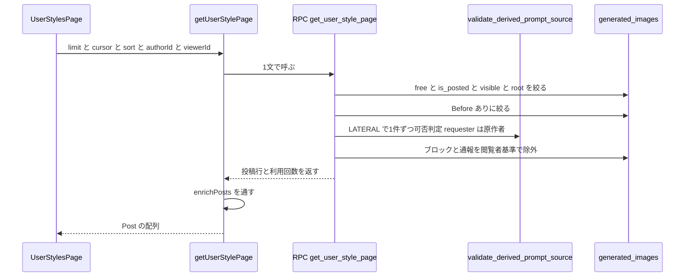
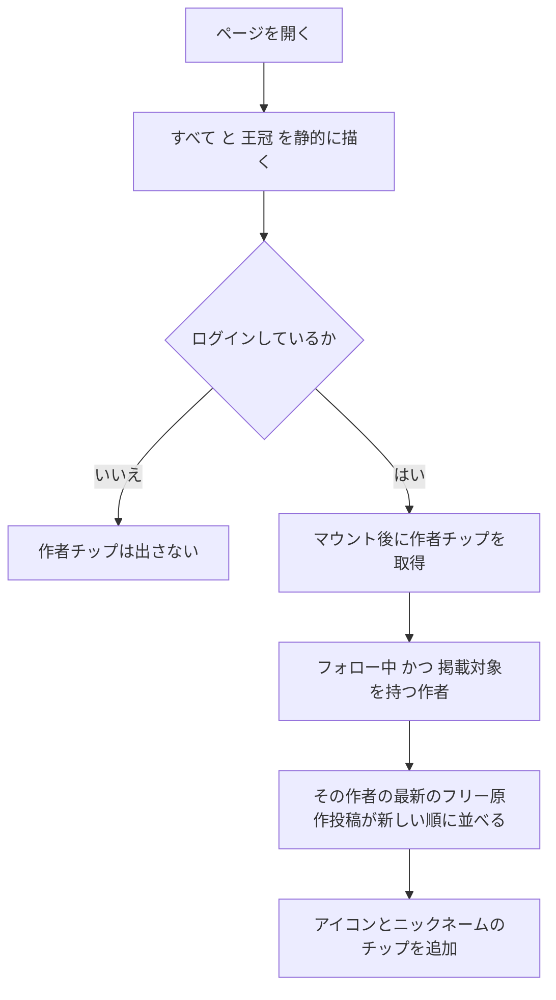
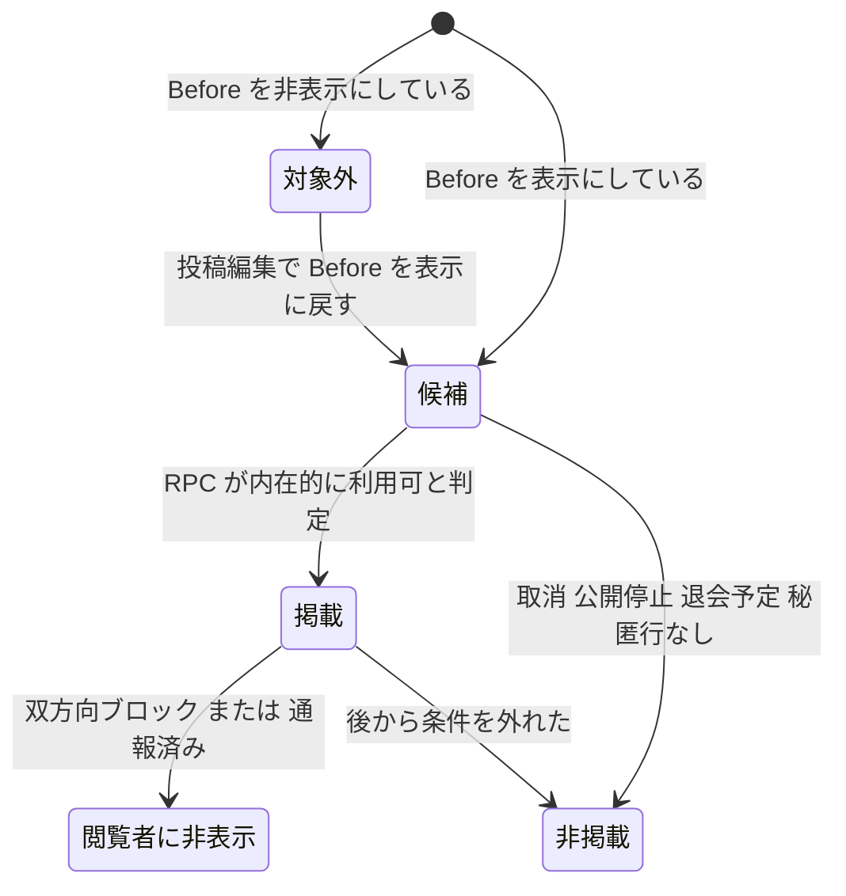
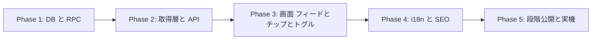

# User ORIGINAL（`/user-styles`）実装計画

`/styles`（Persta.AI ORIGINAL＝ワンタップスタイルのカタログ）に対する、
**ユーザーが Free Style で作った原作の一覧** `/user-styles` を新設する。
2つを「Persta.AI ORIGINAL ⇄ User ORIGINAL」のセグメントトグルで行き来できるようにし、
ワンタップスタイルと同じ「選んで、うちの子で生成する」遊び方を、
ユーザー発のプロンプトでも成立させる。

- 作成日: 2026-09-18
- 関連: `docs/planning/free-prompt-private-mode-implementation-plan.md`（プロンプト公開/非公開）、
  `docs/planning/popular-prompts-tab-implementation-plan.md`（PICK UP!! タブ）

---

## 0. ユーザーが決めたこと（前提・変更禁止）

| 論点 | 決定 |
|---|---|
| URL | **`/user-styles`** |
| **一覧の見せ方** | **ホームのフィードとまったく同じ仕様**（1列・`PostFeedCard`） |
| 他人のプロンプト利用の**フォロー必須** | **現状維持**。ルールは変えない |
| プロンプトの公開/非公開 | **絞らない**（両方載せる） |
| **Before/After の有無** | **掲載の基礎条件**（チップではない）。ADR-009 |
| 掲載条件の明示 | **画面に記載する**（REQ-015） |
| チップ | `すべて` / `👑 よく使われている` / **フォロー中の作者（アイコン＋ニックネーム）** |
| 👑 の定義 | **累計3回以上**を利用回数の降順（同数は新着順） |
| 作者チップの並び | **その作者の最新のフリー原作投稿が新しい順** |
| 未ログイン公開・SEO | **`/styles` と全く同じ扱い**（未ログイン可＋sitemap＋JSON-LD） |

---

## 1. コードベース調査結果

### 1-1. 実データの規模（2026-09-18 本番実測）

| 指標 | 値 |
|---|---|
| フリー原作・投稿済み・公開中・root・作者あり | 263 件 |
| └ **Before 表示ON ＝ 掲載対象** | **161 件（作者 13 人）** |
| └ 作者が Before を**非表示にした** | 104 件（掲載対象外。**投稿編集で復帰可能**） |
| └ **Before の元画像が保存されていない** | **0 件** |
| 掲載対象のうち 直近30日の投稿 | **141 件（88%）** |
| （参考）プロンプト公開 / 非公開 | 68 / 195 |
| 実際に作られた派生投稿 | 231 件 |
| フォロー関係 | 234 本 / フォローしている人 36 人 |

👑 チップの候補になる件数（掲載対象161件のうち。**`get_prompt_usage_count` の定義で再計測**）:

| 定義 | 件数 | 採否 |
|---|---|---|
| **累計3回以上** | **33 件** | **採用**（ADR-007） |
| 累計5回以上 | 18 件 | 不採用 |
| 累計1回以上 | 98 件 | 不採用 |

**最大利用回数は 8 回**（総利用イベント 253）。`usageCountBucket` は 3,4→「3回以上」/
5〜9→「5回以上」に丸めるので、**現時点で画面に出る数字は2種類しかない**。

> ⚠️ **2026-09-18 訂正**: 当初この表を「投稿された派生投稿の数」で出していたが、
> それは**アプリの数え方ではない**。正本は `get_prompt_usage_count`
> （`20260811100000_change_prompt_usage_count_to_total.sql`）で、
> **`prompt_usage_events` の生成イベント数・原作者自身の生成は除外**。投稿されたかは問わない。
> `.cursor/rules/database-design.mdc` が `prompt_usage_events` について
> 「`generated_images` を数える案は**所有者が書き換えられるため採らない**」と明記している。
> **利用数を自前で数え直さないこと。**

読み取れること:

- 掲載対象は 161 件で、ワンタップの約 70 件の **2倍以上**。一覧として十分成立する。
- **88% が直近30日**。この母数は今後ハイペースで増える。
  「全件取って画面で絞る」（`/styles` の作り）は通用しない。**最初からページングで作る。**
- **Before の元画像が保存されていない投稿は 0 件**。
  Before 必須にしても**永久に載れない投稿は存在しない**（ADR-009）。

### 1-2. 既存の資産

**ホームのフィードと同じ仕様にする決定により、画面側はほぼ既存部品の組み合わせになる。**

| ファイル | 何が使えるか |
|---|---|
| `features/posts/components/PostFeedCard.tsx` | **一覧カードそのもの**。Before/After・引用元カード・CTA・フォロー分岐・いいね・コメントを内蔵 |
| `features/posts/hooks/useFeedPromptActions.ts` | `useFeedPromptActions(postIds, enabled)`。CTA用サマリをバッチ解決する**汎用フック** |
| `app/api/users/follow-status/batch/route.ts` + `useFeedFollowStatus` | 表示中の作者のフォロー状態をまとめて1回引く |
| `features/posts/lib/popular-prompts-api.ts` | **データ層の原型**。RPC 1文 → `enrichPosts` → `Post[]` の形 |
| `features/credits/lib/get-usable-prompt-showcase.ts` | 可否判定の呼び方と **Before 必須の絞り込み**（同じ理由で既に採用されている） |
| `features/style-presets/components/StylesGalleryClient.tsx` | チップ列＋横スクロールインジケーターの意匠 |
| `components/GenerationModeTabs.tsx` | **別ルート間を滑らかに切り替えるピルトグル**。今回のトグルの原型 |
| `features/posts/lib/utils.ts:getPostBeforeImageUrl` | Before の有無判定の正本 |
| `app/styles/page.tsx` | 静的シェル＋JSON-LD＋Suspense の構造 |

**`PostList` は再利用しない。** ホームのタブ・並び順の記憶（`home-sort-preference`）・
インプレッション計測・中間タブの取り直しを内蔵していて、汎用の一覧ではない。
**`PostFeedCard` と上記フック群を直接組む。**

### 1-3. 可否判定の正本

`public.validate_derived_prompt_source(p_source_post_id, p_requester_id)`
（最新定義: `supabase/migrations/20260731110000_allow_own_unposted_origin.sql:26-135`）

順に見ている条件:

1. 行が実在する
2. 派生 ID なら root へ解決
3. `user_id` が非 NULL / 投稿済み（本人は未投稿でも可）/ `moderation_status = 'visible'` /
   `generation_type = 'free'` / `prompt_visibility IN ('public','private')` / `source_post_id IS NULL`
4. `generated_image_prompt_secrets` に行がある
5. 原作者が退会予定でない
6. 双方向いずれのブロックもない
7. **本人、またはフォロワーだけが使える**（`20260731110000...:120-131`）

バッチ版 `validate_derived_prompt_sources(uuid[], uuid[])` が
`20260819120000_add_batch_prompt_action_rpcs.sql` にあり、**単体版を LATERAL で呼ぶだけの
ラッパー**になっている。今回もこの作法を踏襲し、条件を新しい SQL へ書き写さない。

### 1-4. 「requester に原作者自身を渡す」手

`getUsablePromptShowcase` が使っている手（同ファイル冒頭のコメントが正本）:

> requester に**原作者自身の ID** を渡す。フォロー条件は「フォロー済み または 本人」、
> ブロックは双方向検査なので、requester = 原作者にすると**閲覧者依存の条件だけが外れ**、
> 内在的な可否（実在・投稿済み・visible・free・root・secret あり・作者が利用可）が残る。

今回もこれを使う。結果として**一覧の中身は閲覧者に依存しなくなり、キャッシュでき、
SEO 向けに静的プリレンダできる**。フォロー有無はカード側（`PostFeedCard` の CTA 分岐）が
既に解決している。

### 1-5. Before/After まわりの実装

- 列は 2 つ。`pre_generation_storage_path`（元画像のパス）と
  `show_before_image`（**NOT NULL・DB既定 `true`**）。
- 判定の正本は `getPostBeforeImageUrl`（`features/posts/lib/utils.ts:132`）。
  `show_before_image === false` なら Before 無しとして扱う。
- 投稿フォームに**ラベルとヒント付きのチェックボックス**がある
  （`PostModal.tsx:393-414`、初期値 `useState(true)`）。
- **投稿後も変更できる**。`EditPostModal.tsx:106` → `app/api/posts/update/route.ts:27`。
- したがって「Before 非表示の 104 件」は**作者が自分でチェックを外した**もので、
  戻せばいつでも掲載対象になる。
- `PostFeedCard` は Before があれば `BeforeAfterFrame` で 1:1 に並べてラベルを出す
  （`PostFeedCard.tsx:359-366`）。掲載対象は全件 Before を持つので、**全カードが Before 付きで並ぶ**。

### 1-6. SEO まわりの既存状況

- `app/robots.ts` は `/api/`・`/dashboard/`・`/i2i/` 以外を全許可。
- `app/sitemap.ts:fetchPostPages` が **`/posts/[id]` を最大1000件 sitemap に載せている**。
- したがって**ユーザーの生成物はすでに検索エンジンの対象**。今回増えるのは
  「入口の一覧ページ」だけで、新たに晒すものはない。
- `app/styles/page.tsx` は **静的シェル＋JSON-LD を初期 HTML に載せ、認証が要る部分だけを
  `<Suspense>` の中で動的にする**構造（同ファイル冒頭のコメントが明示）。同じ構造を踏襲する。

### 1-7. 影響範囲

新規が大半で、既存への変更は小さい。

- `app/sitemap.ts` — フラグが立っているときだけ `/user-styles` を出す（無条件追加は不可）
- `app/styles/page.tsx` — トグルを差し込む（既存の見出し・JSON-LD は触らない）
- `i18n/page-copy.ts` — `stylesCopy` に対になるコピーを追加（**15ロケール**）
- `lib/env.ts` — 段階公開フラグ
- `PostFeedCard` / `useFeedPromptActions` / `useFeedFollowStatus` は**読むだけ。変更しない**

---

## 2. 概要図

### 2-1. 画面遷移

```mermaid
flowchart TD
    A["/styles を開く"] --> B["トグル: Persta.AI ORIGINAL が選択中"]
    B -->|"User ORIGINAL を押す"| C["/user-styles へ遷移"]
    C --> D["ホームと同じ1列フィード Before付きのみ"]
    D --> E["カードの このプロンプトで生成する"]
    E --> F{"使えるか"}
    F -->|"本人 または フォロー済み"| G["生成シートが開く"]
    F -->|"未フォロー"| H["フォローすると使えます とフォローボタン"]
    F -->|"未ログイン"| I["ログインすると使えます"]
    H -->|"フォローした"| G
    D -->|"カード地をタップ"| J["/posts/id"]
```

### 2-2. データ取得

### 2-3. チップ列の組み立て

### 2-4. 掲載資格

---

## 3. EARS 要件

### 一覧の表示

- **REQ-001** When a visitor opens `/user-styles`, the system shall list free-style origin posts that
  have a visible before image and that `validate_derived_prompt_source` reports as intrinsically
  available, newest first.
  訪問者が `/user-styles` を開いたとき、**Before 画像が表示される**フリー原作のうち、
  `validate_derived_prompt_source` が内在的に利用可と判定したものを、新しい順に一覧表示すること。

- **REQ-002** If the origin post's `show_before_image` is false, then the system shall exclude it from
  the list regardless of every other condition.

- **REQ-003** When rendering the list, the system shall use the same card and single-column layout as
  the home feed.
  一覧はホームのフィードと同じカード・同じ1列レイアウトで描画すること。

- **REQ-004** Where the origin post's `prompt_visibility` is `private`, the system shall still list it
  and shall never render the prompt body.

- **REQ-005** While the viewer is not signed in, the system shall render the same list as for signed-in
  viewers, minus viewer-dependent exclusions.

- **REQ-006** When the viewer is signed in, the system shall exclude origins whose author has a block
  relationship with the viewer, and origins the viewer has reported.

- **REQ-007** When the list has more items than one page, the system shall load the next page using a
  keyset cursor over a total order that includes a unique tie-breaker, and shall neither repeat nor
  skip an item across page boundaries.
  次ページは**一意のタイブレーカーを含む全順序**に対する keyset cursor で取得し、
  ページ境界で項目を重複させても飛ばしてもいけない（ADR-002）。

- **REQ-008** While rendering this list, the system shall not record post impressions.
  この一覧ではインプレッションを記録しないこと（ホーム専用の指標を汚さない）。

### チップ

- **REQ-009** When the page renders, the system shall show a 「すべて」 chip and a 「👑 よく使われている」
  chip.

- **REQ-010** When the 「👑 よく使われている」 chip is selected, the system shall list only origins whose
  cumulative usage count is 3 or more, ordered by usage count descending, ties by newest.
  👑 チップは**累計利用回数が3回以上**の原作だけを、利用回数の降順（同数は新着順）で並べること。

- **REQ-011** While the viewer is signed in, the system shall show one chip per followed author who has
  at least one origin that survives the same viewer-scoped exclusions as the list itself, each showing
  the author's avatar and nickname.
  ログイン済みのとき、**一覧と同じ閲覧者基準の除外（ブロック・通報）を通したうえで**
  掲載対象を1件以上持つフォロー中の作者ごとに、アイコンとニックネームのチップを1つずつ出すこと。
  **押して空になるチップを出してはならない。**

- **REQ-012** When ordering author chips, the system shall order them by each author's most recent
  listed origin, newest first.
  作者チップは、その作者の**最新の掲載対象投稿が新しい順**に並べること。

- **REQ-013** If the viewer is not signed in or follows no qualifying author, then the system shall show
  no author chips.

- **REQ-014** When an author chip is selected, the system shall list only that author's origins, newest
  first.

### 表示の作法

- **REQ-015** When rendering the page, the system shall state the listing condition in the page copy:
  Free Style で投稿され、**Before / After が載っている**作品を新しい順に。
  （ADR-009 の Consequence。運営が見繕っているように見せないため）

- **REQ-016** Where the usage count is below the display threshold, the system shall not render a usage
  count at all.（`usageCountBucket`）

### トグル

- **REQ-017** When the viewer is on `/styles` or `/user-styles`, the system shall show a two-segment
  toggle labeled `Persta.AI ORIGINAL` and `User ORIGINAL`, with the current page selected.

- **REQ-018** Where the feature flag is off and the viewer is not an admin, the system shall not render
  the toggle and shall return 404 for `/user-styles`.

### SEO

- **REQ-019** When a crawler requests `/user-styles`, the system shall include the first page of cards
  and an `ItemList` JSON-LD in the initial HTML.

- **REQ-020** When the sitemap is generated, the system shall include `/user-styles` for every locale.

---

## 4. ADR

### ADR-001: クエリパラメータではなく別ルート `/user-styles` にする

- **Context**: 「1画面のトグル」に見せたいが、`/styles` は静的プリレンダで JSON-LD を
  初期 HTML に載せる設計。`app/styles/page.tsx` 冒頭のコメントが
  「`getLocale` はリクエスト依存の動的 API のため PPR の静的シェルから外れてしまう」と明示している。
  `searchParams` を読むと同じ理由で静的シェルが崩れる。
- **Decision**: 別ルート `/user-styles` を新設し、トグルは 2 つのルートを結ぶリンクにする。
- **Reason**:
  - `GenerationModeTabs` が `/style`・`/free`・`/coordinate` で**まさにこれをやっていて**、
    `prefetch` ＋ ピルのスライドで「1画面の切替」に見えている。実績のある手。
  - 両方が独立して静的プリレンダでき、canonical・JSON-LD・sitemap がそれぞれ素直に書ける。
  - `/styles/users` にしないのは、`style_presets.slug` が admin の自由入力で
    （実例: `2-3`, `style-preset-68`）名前空間が衝突するため。ルートファイルが優先されるので
    事故は起きないが、`users` という slug のプリセットが永久に到達不能になる。
- **Consequence**: 「プロンプト」という検索語が URL に乗らない。
  検索の入口語は `indexDescription` 側で担保する（Phase 4）。

### ADR-002: 一覧は専用 RPC 1文で返す（取得後に絞らない）

- **Context**: 掲載対象 161 件・直近30日で 141 件という増え方なので、全件取得は将来通らない。
- **Decision**: `get_user_style_page(p_viewer_id, p_limit, p_sort, p_author_id, p_cursor_posted_at, p_cursor_id)` を新設し、
  **絞り込み・除外・並び・ページング・投稿本体の射影まで 1 文で**行う。
- **Reason**: `popular-prompts-api.ts` 冒頭に記録された2つの失敗を繰り返さないため。
  - 取得後に絞ると、20件取って数件落とした時点で `hasMore=false` になり穴が空く。
  - ID だけ受け取って別文で本体を引くと、2文の間の投稿取消・モデレーション・ブロック・通報で
    除外が効かず、件数が `limit` を下回って無限スクロールが途中で止まる。
- **`docs/architecture/data.ja.md` の方針との関係**: あちらは
  「単純な CRUD は route handler、**原子的・冪等であるべき処理**は SQL 関数」と書いており、
  これは**書き込み**の話。今回は読み取りなので、その根拠では正当化できない。
  正当化は上の**ページングの整合性**であり、先例は `get_popular_prompt_page`（同じ理由で読み取りRPC）。
  **単純な読み取りをRPCにしてよい、という一般則にはしないこと。**
- **ページングは offset ではなく keyset cursor にする**（レビュー#2 を受けて改訂）。
  `get_popular_prompt_page` は `OFFSET` を使っている（`20260903100000...:81`）が、
  **あちらが安全なのは順位が事前計算テーブルで固定されているから**で、
  同じ理屈はこの一覧には効かない。
  - `'newest'`: `posted_at DESC` **単独ではタイブレーカーが無く**、同時刻の行で順序が不定になる。
    `(posted_at, id)` の keyset cursor にして、ページ境界を値で決める。
    これで「1ページ目の表示中に新規投稿が入る」ケースでもズレない
  - `'usage'`: 利用回数はライブに動くので、どんな cursor でも順序の固定は保証できない。
    **現在33件・`p_limit` 上限40なので1ページで返し切り、ページングしない。**
    ⭐ **件数が上限に近づいたら、事前計算スナップショット方式へ移すこと**
    （`popular_prompt_rankings` と同じ発想）。これがこの設計のトリップワイヤ。
- **Consequence**: SQL が1本増える。ただし判定は書き写さない（ADR-003）。

### ADR-003: 可否判定は既存関数を LATERAL で呼ぶだけにする

- **Context**: 一覧と投稿詳細で可否がずれると「一覧には出るのに詳細では作れない」が起きる。
  過去にこの型の事故が実際に起きている（`source-prompt-reference.ts` のコメント）。
- **Decision**: 新 RPC は `validate_derived_prompt_source` を LATERAL で呼ぶだけにし、
  `moderation_status` や secret 行の有無を新しい SQL へ写さない。
- **Reason**: 正本を1つに保つ。`validate_derived_prompt_sources`（バッチ版）が既に同じ作法。
- **Consequence**: 1件ずつ LATERAL で回るぶん DB 側の仕事が増える。
  `p_limit` の上限を 40 に制限し、**先に安い列条件（Before・free・root・visible）で絞ってから**
  LATERAL に渡す。

### ADR-004: 一覧の可否は「内在的な可否」だけを見る（requester＝原作者）

- **Context**: 未ログインでも見えるページで、フォロー有無は人によって違う。
- **Decision**: RPC の可否判定には**原作者自身の ID** を requester として渡す。
  フォロー判定はカード側（`PostFeedCard` の CTA 分岐）に任せる。
- **Reason**: `getUsablePromptShowcase` と同じ手。閲覧者依存の条件が外れるので
  一覧の中身が閲覧者に依存せず、キャッシュでき、SEO 向けに静的化できる。
- **Consequence**: ブロック・通報だけは閲覧者依存なので、これらは `p_viewer_id` を使って
  RPC 側で除外する（ADR-006）。

### ADR-005: 静的シェル＋Suspense の中だけ動的、という `/styles` の構造を踏襲する

- **Context**: SEO（初期 HTML に JSON-LD）と、ログイン済みの除外（ブロック・通報）を両立したい。
- **Decision**: 見出し・説明・掲載条件の注記・JSON-LD はページ本体で静的に描き、
  一覧本体は `<Suspense>` の中で `getUser()` を待つ。
- **Reason**: `app/styles/page.tsx` の `StylesGallerySection` がまさにこの形で、
  コメントに「認証を待つのはこの穴だけにして、見出し・JSON-LD は静的なまま残す」とある。
- **Consequence**: JSON-LD 用に「閲覧者非依存の1ページ目」をもう一度引く。
  `"use cache"` で同一キーになるので追加の DB 往復は発生しない。

### ADR-006: ブロック・通報の除外は RPC に閲覧者を渡して行う

- **Context**: `get_popular_prompt_page` が既に同じ除外を実装している
  （`20260903100000_return_posts_from_popular_prompt_page.sql:63,73` の `user_blocks` / `post_reports`）。
- **Decision**: 同じ除外条件を `get_user_style_page` にも入れる。
- **Reason**: クライアント側で後から隠すと、隠したぶん1ページの件数が減って穴が空く。
- **Consequence**: ログイン済みの一覧はキャッシュできない。これは `/styles` と同じ割り切り。

### ADR-007: 👑 は「累計3回以上」を利用回数順にする（`/styles` とは定義を変える）

- **Context**: `/styles` の 👑人気 は「直近30日に1回以上使われたものを回数順」で、
  画面に「直近30日の利用回数順」と注記が出る。ただし**`/styles` のカードは利用回数を出さない**
  （数字は試着モーダルの中だけ）。
  なお利用回数の正本は `get_prompt_usage_count` ＝ `prompt_usage_events` の生成イベント数
  （原作者自身は除外・投稿されたかは問わない）。**派生投稿の件数ではない**（1-1 の訂正欄）。
- **Decision**: User ORIGINAL では **累計3回以上**（＝`usageCountBucket` の表示下限）に絞り、
  利用回数の降順（同数は新着順）にする。
- **Reason**:
  - こちらのカードは**利用回数を表示する**。`/styles` と同じ定義（30日で1回以上）にすると
    **70件中50件が「数字が出ていないのに上位にいるカード」**になり、並びの根拠が画面から読めない。
  - 常設カタログなので、`/styles` の「いま何が流行っているか」を見せる30日窓より、
    窓なしの累計のほうが向いている。
  - 実測で該当は **33 件**。全カードに「◯回以上」が出る一貫した棚になる。
- **Consequence**:
  - 注記は `/styles` の「直近30日の利用回数順」を流用できない。専用の文言を用意する。
  - **最大利用回数が 8 回**なので、当面 `usageCountBucket` の出力は「3回以上」「5回以上」の
    2種類しかない。数字で差がつかないことを前提に、並び順そのものが情報になるようにする。
  - 母数が増えたら定義を見直す。**見直すときは注記の文言も必ず一緒に直すこと。**

### ADR-008: プロンプトの公開/非公開では絞らない

- **Context**: 掲載対象のうち多数はプロンプト非公開。作者は「一覧に並べる」と意思表示していない。
- **Decision**: `prompt_visibility` では絞らない。専用の opt-out フラグも作らない。
- **Reason**:
  - 非公開プロンプトは**もともと他人が使える**仕様（本文が見えないだけ）で、
    `/use-prompts` の訴求軸そのもの。一覧に載せても「誰が何を使えるか」は1ミリも変わらない。
  - 投稿自体は既に公開され、`/posts/[id]` として sitemap に載っている。増えるのは入口だけ。
  - **ADR-009 の Before 条件が、同意の論点を部分的に引き受ける。**
    Before を非表示にした 104 件は「見せたくない」と**明示的に操作した**人たちで、
    その意思は自動的に尊重される。
- **Consequence**: 変わるのは**発見されやすさ**。公開前にお知らせで周知すること（運用タスク）。
  将来 opt-out が必要になったとき、`prompt_visibility` は本文の可視性を指す別概念なので
  流用してはならない。新しい列が要る。

### ADR-009: Before/After があることを**掲載の基礎条件**にする（チップにしない）

- **Context**: 使う側は「そのプロンプトで**どう変わるのか**」が分からないと選べない。
  しかもユーザーの作品は運営のプリセットより信用の土台が薄い。After 1枚だけでは、
  プロンプトの効果と元のうちの子の魅力が区別できない。
- **Decision**: `pre_generation_storage_path` があり `show_before_image = true` であることを
  **一覧に載る資格そのもの**にする。絞り込みチップにはしない。
- **Reason**:
  - **`/use-prompts` のショーケースが、同じ条件を同じ理由で既に採用している。**
    「After だけの作品を並べると、ただの画像置き場に見えて、何が起きるのかが運ばれない」
    （`get-usable-prompt-showcase.ts` 冒頭）。判断が既存と一致している。
  - **実測で「Before の元画像が保存されていない投稿」は 0 件**。
    落ちる 104 件はすべて作者が自分でチェックを外したもので、
    投稿編集で戻せばいつでも載る（1-5）。**永久に排除される投稿は存在しない。**
  - 副次効果として、ADR-008 の同意の論点が部分的に解ける。
  - `PostFeedCard` は Before があれば自動で 1:1 に並べる。**全カードが Before 付きで揃う。**
- **Consequence**:
  - 掲載対象が 263 → **161 件**。ワンタップの約70件に対してなお2倍以上ある。
  - **判定を書き写さない。** RPC 側は
    `pre_generation_storage_path IS NOT NULL AND show_before_image IS TRUE` とする。
    `show_before_image` は NOT NULL・既定 true なので、この2条件で TS 側
    （`getPostBeforeImageUrl`）と一致する。
  - **掲載条件をページ本文に必ず書く**（REQ-015）。
    `/use-prompts` に残された注意がそのまま当てはまる:
    「運営が見繕っているように見えると、投稿者は『勝手に使われている』と受け取る。
    並び順の根拠を書けるのは、機械的な条件であるうちだけ」。
  - 161 件側は「既定 ON のまま投稿した」人が大半で、**積極的な同意ではない**。そこは過大評価しない。

### ADR-010: ホームのフィードと同じカード・同じ1列レイアウトにする

- **Context**: ユーザーの指示。加えて `PostFeedCard` は
  「Before/After」「プロンプト作成者の引用元カード」「このプロンプトで生成する CTA」
  「フォロー分岐」をすべて内蔵している。
- **Decision**: `PostFeedCard` をそのまま使い、CTA・フォロー・生成シートは**一切作らない**。
  データ層は `Post[]` を返す（`getPopularPrompts` と同形）。
- **Reason**:
  - 独自カード＋独自の確認モーダル＋独自の生成導線を作ると、
    可否の3分岐（利用不可 / 未ログイン / 未フォロー）と生成シートの機構を二重に持つことになる。
    `PromptLockedGenerationSheet` のコメントが「二重に持つと片方だけ直す事故が起きる」と
    明示的に警告している。
  - 掲載対象は全件がフリーの root なので、引用元カードは必ず `variant="root"` になり、
    **「プロンプト作成者」＋ CTA が最初から正しく出る**（`PostFeedCard.tsx:400-416`）。
- **Consequence**:
  - **`/styles`（2〜4列グリッド）から切り替えた瞬間に1列フィードへ変わる。**
    「同じ棚を切り替えている」感覚は途切れる。ユーザーの明示的な指示による選択であり、
    戻す場合は Phase 3 のカード部分だけの差し替えで済む。
  - いいね・コメント・三点メニュー・拡大ビューも付いてくる。「まったく同じ仕様」なので受け入れる。
  - **インプレッション計測は OFF**（`trackImpressions={false}`）。
    ホーム専用の指標なので、混ぜると既存の数字の意味が変わる（REQ-008）。
  - `PostList` は使わない（1-2 のとおりホーム固有の機構を内蔵しているため）。

### ADR-011: 作者チップは「フォロー中」だけにする（閲覧者依存を受け入れる）

- **Context**: 他人のプロンプトを使うにはフォローが必須。
- **Decision**: チップに出す作者は**閲覧者がフォローしている作者**に限る。
  順序は**その作者の最新の掲載対象投稿が新しい順**。
- **Reason**:
  - フォロー必須なので、この集合は「**いますぐ使えるプロンプトの作者**」と一致する。
    ただのカテゴリ分けではなく、押せば全部使える列になる。
  - 最新投稿順にすることで、更新している人が手前に来る（YouTube の登録チャンネル列と同じ発想）。
- **Consequence**:
  - **チップ列が閲覧者依存になる**ので、静的シェルには載せられない。
    `すべて`・`👑` だけを先に描き、**作者チップはマウント後にクライアントで足す**
    （`StylesGalleryClient` がお気に入りチップで同じことをしている）。
    チップ列の高さを先に確保し、レイアウトシフトを防ぐ。
  - 未ログイン・誰もフォローしていない人には作者チップが1つも出ない。
    これは「フォローするとここに並ぶ」という動機付けにもなるが、
    **初見の人にはチップが2つしかない**ことを受け入れる。
  - **掲載対象を1件も持たない作者はチップに出さない**（押して空になるのを防ぐ）。
    そのため専用 RPC で「フォロー中 かつ 掲載対象あり」を判定する。
  - ⭐ **その判定には一覧と同じ `p_viewer_id` 基準の除外を通すこと**（レビュー#3）。
    `validate_derived_prompt_source` は **`post_reports` を見ておらず**（実測: 出現0回）、
    ブロックも requester＝原作者では自分対自分になって効かない。
    可否関数を通すだけでは「チップはあるのに中身が0件」が起きる。

---

## 5. 実装計画

### Phase 1: DB と RPC

**目的**: 一覧1ページと作者チップを、それぞれ1文で返せるようにする。
**ビルド確認**: SQL のみ。アプリ側は無変更なのでビルドは通る。

- [ ] `supabase/migrations/<ts>_add_user_style_page_rpc.sql`
  - **`get_user_style_page(p_viewer_id uuid, p_limit int, p_sort text, p_author_id uuid,
    p_cursor_posted_at timestamptz, p_cursor_id uuid)`**
    — **offset ではなく keyset cursor**（レビュー#2）
  - 返す列: `post jsonb`（`to_jsonb(g)`）, `usage_count int`
  - **`get_popular_prompt_page` を参考**（`20260903100000_return_posts_from_popular_prompt_page.sql`）に、
    `user_blocks` / `post_reports` の除外条件をそのまま揃える
  - **Before 条件**: `g.pre_generation_storage_path IS NOT NULL AND g.show_before_image IS TRUE`
    （ADR-009。TS 側 `getPostBeforeImageUrl` と同じ意味になることをコメントで明示）
  - 可否は `validate_derived_prompt_source(g.id, g.user_id)` を LATERAL で呼ぶ（ADR-003/004）
  - 利用数は `get_prompt_usage_counts` と**同じ数え方**にする。別の集計 SQL を書かない
  - `p_sort`:
    - `'newest'`（既定）— **`posted_at DESC, id DESC`**。`p_cursor_*` が非 NULL なら
      `(g.posted_at, g.id) < (p_cursor_posted_at, p_cursor_id)` で続きを取る。
      **タイブレーカー無しの `posted_at DESC` 単独にしない**（同時刻の行で順序が不定になり、
      ページ境界で重複・欠落が出る ─ ADR-002）
    - `'usage'` — **`usage_count >= 3` に絞り**、`usage_count DESC, posted_at DESC, id DESC`（ADR-007）。
      **ページングしない。1回で返し切る**（現在33件・`p_limit` 上限40。ADR-002 の後段）。
      `usage_count` は `get_prompt_usage_count` を LATERAL で呼んで得る。
      **`generated_images` を数える集計を自分で書かない**（所有者が書き換えられる。
      `database-design.mdc` の `prompt_usage_events` の項）
  - `p_author_id` が非 NULL なら `g.user_id = p_author_id` で絞る（`'newest'` 固定・cursor も同じ）
  - `p_limit` は 1..40 に制限し、範囲外は `RAISE EXCEPTION`
  - `SECURITY DEFINER` + `SET search_path = public, pg_temp`
  - **権限**: `REVOKE ALL FROM PUBLIC, anon, authenticated` → `GRANT EXECUTE TO service_role`
    （`persta-rpc-anon-execute-exposure` の教訓。`auth.uid()` は service_role の代わりにならない）
  - **末尾に `NOTIFY pgrst, 'reload schema';`**（レビュー#1）。
    DDL の event trigger による自動 reload は即時とは限らず、
    **過去に実際に `PGRST202`（function not found）を踏んでいる**
    （`20260730200100_add_derived_generation_rpcs.sql:649-654` の記録）。
    これが無いと適用直後の一覧取得が fail closed で空表示になる
- [ ] `supabase/migrations/<ts>_add_user_style_authors_rpc.sql`
  - **`get_user_style_followed_authors(p_viewer_id uuid, p_limit int)`**
  - 返す列: `author_id uuid`, `nickname text`, `avatar_url text`, `latest_posted_at timestamptz`
  - 条件: 閲覧者がフォローしている、かつ **掲載対象の原作を1件以上持つ**（ADR-011）
  - 並び: `latest_posted_at desc`（REQ-012）
  - 可否判定は一覧と同じ関数を通す
  - ⭐ **一覧と同じ `p_viewer_id` 基準の `user_blocks` / `post_reports` 除外を、
    EXISTS と最新日時を出す**前に**適用する**（レビュー#3）。
    `validate_derived_prompt_source` は **`post_reports` を一切見ておらず**（実測: 出現0回）、
    ブロック判定も requester＝原作者にすると自分対自分になって無効化される。
    これを入れないと「フォロー中の作者の唯一の掲載投稿を閲覧者が通報した」ときに
    **チップは出るのに押すと空**になり、REQ-011 と品質チェックの
    「チップと中身が一致」が満たせない
  - 権限は上と同じ。**末尾に `NOTIFY pgrst, 'reload schema';`**（レビュー#1）
- [ ] `supabase/migrations/<ts>_add_user_styles_usage_event_types.sql`（**計測**・整合性チェック#4）
  - `style_usage_events.event_type` の CHECK に `user_styles_visit` と `user_styles_chip` を足す
  - **既存の `visit` を流用しない。** `/style` の訪問数に混ざって過去と比較できなくなる
  - **`category_key` も流用しない。** 企画別訪問カードに `/user-styles` が「企画」として現れる
    （`persta-collection-visit-guest-measurement` の設計）
  - CHECK の差し替えだけなので既存行への影響なし（関数を作らないので NOTIFY は不要）
- [ ] 部分インデックス2本
  - `idx_generated_images_user_style_feed` — `(posted_at DESC, id DESC)`
  - `idx_generated_images_user_style_by_author` — `(user_id, posted_at DESC, id DESC)`
  - 部分条件はどちらも
    `generation_type='free' AND is_posted AND source_post_id IS NULL
     AND pre_generation_storage_path IS NOT NULL AND show_before_image`
  - ⚠️ **`moderation_status` は部分条件に入れない。** 後から変わる（公開停止）ので、
    入れると状態変化のたびに索引から出入りする
  - ⚠️ **訂正（2026-09-18・実装時）: `CONCURRENTLY` は使えない。**
    当初この計画は「`concurrently` を使い `BEGIN` で囲まない」と書いていたが、
    supabase CLI のパイプライン実行では `25001 (cannot be executed within a pipeline)`
    で失敗する（`20260729170000_add_search_indexes.sql` に同じ記録がある）。
    `generated_images` は約6,000行・17MB と小さく通常の `CREATE INDEX` で一瞬なので、
    **`BEGIN` + `SET LOCAL lock_timeout = '5s'` で囲む**
- [ ] **`.cursor/rules/database-design.mdc` を更新する**（レビュー#6）。
  この台帳は関数・index・`event_type` の正本で、`style_usage_events` の許可 `event_type`
  （`:344-349`）と主要 RPC（`:549-562`）が注釈付きで列挙されている。
  追加する RPC 2本・部分index 2本・`event_type` 2値をここに書かないと、
  **次の実装者が古い情報を見て同じ調査を繰り返す**
- [ ] `supabase db push --dry-run` で差分を提示（`db diff` は Docker 必須で動かない）
- [ ] 適用後に `scripts/check-rpc-grants.mjs` を実行（本番の `pg_proc` を見るので push 後のみ）
- [ ] **適用直後に RPC を1回呼んで `PGRST202` が出ないことを確認する**（レビュー#1）

### Phase 2: 取得層と API

**目的**: サーバーから1ページと作者チップが取れるようにする。
**ビルド確認**: 新規ファイルのみ。既存の import を壊さない。

- [ ] `features/user-styles/lib/get-user-style-page.ts`
  - **`getPopularPrompts`（`popular-prompts-api.ts`）を下敷きにする。**
    RPC → `row.post` を順序どおり取り出す → `enrichPosts` → `Post[]`
  - **取得後に絞らない・ID だけ受け取って別文で引かない**（ADR-002）
  - fail closed。読めなければ空配列を返し、呼び出し側は空状態を出す
- [ ] `features/user-styles/lib/get-followed-authors.ts`
  - `get_user_style_followed_authors` を呼ぶだけ。fail closed（チップを出さない）
- [ ] `app/api/user-styles/route.ts` — 2ページ目以降・チップ切替後の取り直し
  - `limit` 1..40 のバリデーションは `app/api/posts/route.ts` に揃える
  - **ページングは cursor**（`cursorPostedAt` / `cursorId`）。`offset` は受け取らない（ADR-002）。
    両方揃っているか両方無いかのみ許可し、片方だけなら 400
  - `sort` は `newest` / `usage` のみ許可。未知の値は `newest` へ倒す。
    **`usage` は cursor を受け付けない**（1ページで返し切るため）
  - `author` は UUID として検証する
  - **`p_viewer_id` は必ずサーバーの `getUser()` から解決する。**
    クライアントのボディ・クエリから受け取らない
  - フラグ無効かつ非運営なら 404（REQ-018。UI を閉じるだけでは足りない）
- [ ] `app/api/user-styles/authors/route.ts` — 作者チップ（ログイン必須）
  - 未ログインは空配列を返す（エラーにしない）
- [ ] **`app/api/user-styles/events/route.ts` — 計測の送信経路**（レビュー#4）
  - ⭐ **クライアントから既存の経路では送れない。**
    `recordStyleUsageEvent` は `features/style/lib/style-usage-events.ts:1` が
    `import "server-only"` で、型 `StyleUsageEventType` にも新しい2値が無い。
    既存のブラウザ向け route（`app/(app)/style/events/handler.ts:16-22`）は
    許可集合が `visit/download/generate/signup_click/wardrobe_save_click` の**固定5値**で、
    未知の値は 400 になる
  - **`/style/events` の許可集合は広げない。** あちらは `/style` 用で役割が違う。
    `user_styles_visit` / `user_styles_chip` **だけ**を許可する専用 route を新設する
  - `auth_state` と `viewer_key` は**サーバーで解決**する
    （`resolveStyleUsageViewerKey` を再利用。クライアントから受け取らない）
  - `features/style/lib/style-usage-events.ts` の `StyleUsageEventType` に2値を追加する
    （型を足すだけ。既存の呼び出しには影響しない）
- [ ] `features/user-styles/types.ts` / `lib/route-copy.ts`（15ロケール）/ `lib/validation.ts`
- [ ] ⚠️ **`lib/env.ts` のフラグはここで入れる（計画では Phase 5 だったが前倒し）。**
  route が最初から 404 を返せないと、存在した瞬間だけ公開前の一覧が読める。
  Phase 5 に残るのは Vercel への登録と公開確認だけ
- [ ] ユニットテスト: 取得層の正常系・空・RPC エラー時の fail closed・
      `usage` で nextCursor を出さないこと・**cursor は RPC の生の行から作ること**・
      **cursor の片方だけで 400**・**フラグ無効で 404（本文なし）**・
      **閲覧者をクエリから受け取らないこと**・**events route が既存の event_type を 400 にする**

### Phase 3: 画面（フィードとチップとトグル）

**目的**: 画面が出て、カードから生成に入れる。
**ビルド確認**: `/styles` と `/user-styles` の両方が描画される。

- [ ] `features/style-presets/components/OriginalKindTabs.tsx`（トグル）
  - `GenerationModeTabs` を下敷きに、2セグメント版を作る
  - ラベル: `Persta.AI ORIGINAL` / `User ORIGINAL`（**フィードの引用元カードと同じ語彙**。
    `messages/ja.ts:152-153` の `feedQuoteDerivedTitle` / `feedQuoteStyleTitle` と揃える）
  - 両ルートを `prefetch`
  - **`GenerationModeTabs` を書き換えない。** あちらは生成モードの3タブで役割が違う
- [ ] `app/user-styles/page.tsx` + `app/[locale]/user-styles/page.tsx`（re-export）
  - 構造は `app/styles/page.tsx` を写す: 静的な見出し＋**掲載条件の注記**＋JSON-LD、
    一覧は `<Suspense>` の中（ADR-005）
- [ ] `features/user-styles/components/UserStylesFeedClient.tsx`
  - **`PostFeedCard` をそのまま並べる。`PostList` は使わない**（ADR-010）
  - `useFeedPromptActions(postIds, true)` で CTA を解決
  - `useFeedFollowStatus` でフォロー状態を解決（投稿者＝原作者なので両方に同じ値が入る）
  - `trackImpressions={false}`（REQ-008）
  - 無限スクロール。**表示済みの並びは崩さない**（REQ-007）
- [ ] `features/user-styles/components/UserStyleChips.tsx`
  - `すべて` / `👑 よく使われている` は最初から描く
  - **作者チップはマウント後に `/api/user-styles/authors` から足す**（ADR-011）。
    **チップ列の高さを先に確保し、レイアウトシフトを起こさない**
  - 作者チップはアイコン（丸）＋ニックネーム。長い名前は truncate
  - **タッチターゲットは最低 44x44px**（`project-conventions.ja.md` の Mobile-first ルール）。
    既存の `/styles` のチップは `px-3.5 py-1.5` で高さが足りていないので、**写さずに padding を足す**
  - 横スクロールインジケーターは `useHorizontalScrollIndicator` を再利用
  - チップ切替は**サーバーから取り直す**（`/styles` のようなクライアント側の配列絞り込みにしない。
    ページングと両立しないため）
  - 👑 選択中は専用の注記を出す（`/styles` の「直近30日の利用回数順」は流用しない ─ ADR-007）
- [ ] **計測を入れる**（整合性チェック#4）
  - ⭐ **測る目的は「訪問とチップ選択の把握」に限定する**（レビュー#7）。
    **「ここから生成に至ったか」は測れないし、今回は測らない。**
    成功生成の記録 `prompt_usage_events` の列は
    `image_job_id / origin_post_id / origin_author_id / user_id` **だけ**で、
    入口ページも選択チップも保存されない
    （`20260730200100_add_derived_generation_rpcs.sql:276-288`）。
    測れるようにするには CTA で確定した入口を改ざん不能な形で job へ引き継ぐ必要があり、
    **`PostFeedCard` / `PromptLockedGenerationSheet` / 生成系 RPC に手を入れることになる**。
    今回の「既存を変えない」方針と引き換えにはしない
  - 訪問時に `user_styles_visit`、チップ選択時に `user_styles_chip` を
    **`/api/user-styles/events` へ送る**（Phase 2。既存の `/style/events` は使えない）
  - どのチップかは `category_key` の形式制約 `^[a-z][a-z0-9_]{1,49}$` に合う値で
    （例: `all` / `usage` / `author`）
  - **公開と同時に入れる。** あとから足すと初期の期間が構造的に欠け、
    「0」と「未計測」が区別できなくなる（`persta-collection-kpi-instrumentation-dates`）
- [ ] ⚠️ **`i18n/config.ts` の `PUBLIC_PATH_PATTERNS` に `/user-styles` を追加する（実装時に判明）。**
  ここに無いと `localizePublicPath` がロケールを付けずに返し、トグルを押した瞬間に
  言語が既定へ戻る。`app/[locale]/user-styles/` の re-export とセットで必須
- [ ] ⚠️ **定数は `features/user-styles/lib/constants.ts` に分ける（実装時に判明）。**
  クライアントのフィードが1ページの件数を知る必要があるが、取得層は
  `createAdminClient` 経由で `next/server` を引くのでクライアントから import できない。
  取得層2本には `import "server-only"` を付けて再発を防ぐ
- [ ] `app/styles/page.tsx` にトグルを差し込む
  - ⚠️ 判定は **`isUserStylesPubliclyEnabled()`**（運営を含まない方）にする。
    `isUserStylesAvailable` は閲覧者が要るので、呼ぶと `/styles` の静的シェルが崩れる。
    そのため**公開前は運営にも `/styles` にトグルが出ない**（`/user-styles` を直接開く）
- [ ] `UserStylesFeedSkeleton` — チップ列とカードの高さを本物と揃える
- [ ] テスト
  - フィードが1列で `PostFeedCard` を使っていること
  - **掲載条件の注記が出ていること**（REQ-015）
  - 👑 で3回未満が出ないこと・回数順であること
  - 未ログインで作者チップが出ないこと
  - 作者チップが最新投稿順に並ぶこと
  - チップ切替でサーバーから取り直すこと

### Phase 4: SEO（JSON-LD と sitemap）

**目的**: 検索エンジンから入れる。
**ビルド確認**: `npm run build -- --webpack` が通る。

> ⚠️ **i18n は Phase 3 で完了済み（実装時に前倒し）。** 文字列が無いと画面が描けないため。
> `messages/*.ts` の `userStyles` 名前空間（15ロケール）と `i18n/page-copy.ts` の
> `userStylesCopy`（15ロケール）は Phase 3 で入っている。ここに残るのは JSON-LD と sitemap。

- [ ] ~~`i18n/page-copy.ts` に `userStylesCopy` を追加~~（Phase 3 で完了。**15ロケール**。
  `stylesCopy` と同じ形: `indexTitle` / `indexDescription` / `indexHeading` / `indexIntro`
  ＋ 掲載条件の注記 `listingNote`）
  - `indexDescription` に**「プロンプト」を必ず残す**
    （`/use-prompts` に記録された判断: 検索でこのページに来る人はまずこの語で探す。
    URL からは落ちたので、ここで担保する ─ ADR-001 の Consequence）
- [ ] `messages/*.ts` にチップ・空状態・注記の文言を追加（15ロケール）
  - `Persta.AI ORIGINAL` / `User ORIGINAL` は**全ロケール同一**にする
    （`feedQuoteStyleTitle` / `feedQuoteDerivedTitle` と同じ扱い）
- [ ] `ItemList` JSON-LD（`/styles` と同じ形。**閲覧者に依らない公開分だけ**で組む）
  - ⚠️ **1ページ目を2回引かないこと（実装時に判明）。** JSON-LD と一覧で同じものが要る。
    `"use cache"` の `getPublicUserStyleFirstPage()` を作り、
    **JSON-LD と「未ログインの一覧」で共有**する。
    ログイン済みには**絶対に使わない**（ブロック・通報の除外は閲覧者ごとに違うので、
    キャッシュを共有すると他人の除外結果を見せることになる）
  - 作品のキャプションは JSON-LD に入れない。URL の関係を伝えるだけで目的は足りる
- [ ] `app/sitemap.ts` — **フラグが立っているときだけ** `/user-styles` を出す（レビュー#5）
  - ⭐ **静的配列に足すだけでは段階公開が壊れる。**
    `app/sitemap.ts:132-138` は `LOCALIZED_PUBLIC_PATHS` を**無条件に全ロケール展開**するので、
    配列に入れた時点で公開前の URL が sitemap に載り、検索エンジンが 404 へ誘導される
  - **`isUserStylesPubliclyEnabled()`（admin を含まない純粋なフラグ判定）を新設し、
    sitemap はそれだけを見る。**`isUserStylesAvailable()` は `isAdminViewer` を含むが、
    sitemap には閲覧者がいないので使ってはならない
  - `changeFrequencyFor` / `priorityFor` は `/styles` に揃えて `daily` / `0.8`
  - **フラグ true / false の両方をテストする**
  - 実装は `lib/sitemap-paths.ts` の `isSitemapPathEnabled()` に切り出した
    （`app/sitemap.ts` は route ファイルなので、テストしたい判定を外に出す）
- [ ] canonical / hreflang が `/styles` と同じ形で出ることを確認

### Phase 5: 段階公開と実機

**目的**: 運営だけで確認してから開ける。
**ビルド確認**: フラグ無効時に既存挙動が一切変わらない。

- [ ] `lib/env.ts` に **2つ**追加する
  - `isUserStylesPubliclyEnabled()` — 純粋なフラグ判定。**sitemap はこちらだけを見る**（レビュー#5）
  - `isUserStylesAvailable(userId)` — 上記 or `isAdminViewer`。画面と API の認可はこちら
  （`isPopularPromptsAvailable`（`lib/env.ts:483-487`）と同じ形: 公開フラグ or `isAdminViewer`）
- [ ] **ゲートはサーバー側に置く**（`persta-free-plan-model-lock-ui-only` の教訓。
  UI を閉じるだけでは API を直接叩ける）
- [ ] フラグ無効時: トグルを出さない・`/user-styles` は 404・sitemap に載せない
- [ ] 本番で運営アカウントのみ実機確認
  - **ローカル dev サーバーの LAN 実機では生成系 mutation が 403**
    （`nextUrl.host` が localhost 固定）。実機確認は本番か USB 接続で
- [ ] 公開前チェック
  - [ ] 未ログインで一覧が見える／CTA が「ログインすると使えます」になる
  - [ ] 未フォローの相手のカードでフォロー → そのまま生成に入れる（再読込不要）
  - [ ] 2ページ目を読んでも並びが崩れない・重複しない
  - [ ] **Before を非表示にした投稿が一覧に出ない**
  - [ ] **投稿編集で Before を表示に戻すと一覧に出る**
  - [ ] 👑 に3回未満が出ない
  - [ ] 作者チップがフォロー中だけ・最新投稿順
  - [ ] 投稿を取り消した原作が一覧から消える／ブロックした相手の原作が出ない
  - [ ] **ホームのインプレッション数が増えていない**（計測が漏れていないこと）
  - [ ] **フラグ無効のあいだ sitemap に `/user-styles` が出ない**（レビュー#5）
  - [ ] **migration 適用直後に RPC が `PGRST202` を出さない**（レビュー#1）
  - [ ] **フォロー中の作者の唯一の投稿を通報すると、その作者チップが消える**（レビュー#3）
  - [ ] モバイル（Web モバイル版が正本）で崩れない
- [ ] お知らせで周知（ADR-008 / ADR-009）してから `NEXT_PUBLIC_USER_STYLES_ENABLED=true`
  - 周知に**「Before / After を表示にすると一覧に載ります」を必ず含める**。
    104 件の作者にとって、これが唯一の復帰導線になる

---

## 6. 修正対象ファイル一覧

| ファイル | 操作 | 変更内容 |
|---|---|---|
| `supabase/migrations/<ts>_add_user_style_page_rpc.sql` | 新規 | `get_user_style_page` と部分インデックス |
| `supabase/migrations/<ts>_add_user_style_authors_rpc.sql` | 新規 | `get_user_style_followed_authors` |
| `supabase/migrations/<ts>_add_user_styles_usage_event_types.sql` | 新規 | 計測用の event_type を CHECK に追加 |
| `features/user-styles/lib/get-user-style-page.ts` | 新規 | 1ページ取得（`getPopularPrompts` を下敷き） |
| `features/user-styles/lib/get-followed-authors.ts` | 新規 | 作者チップの取得 |
| `app/api/user-styles/route.ts` | 新規 | 2ページ目以降。viewer はサーバー解決 |
| `app/api/user-styles/authors/route.ts` | 新規 | 作者チップ（ログイン必須） |
| `app/api/user-styles/events/route.ts` | 新規 | 計測の送信経路（この2値だけ許可） |
| `features/user-styles/types.ts` | 新規 | `UserStyleSort` / `UserStyleCursor` / `UserStyleAuthor` |
| `features/user-styles/lib/route-copy.ts` | 新規 | route のエラー文言（15ロケール） |
| `features/user-styles/lib/validation.ts` | 新規 | UUID の形（RPC で 22P02 にしない） |
| `features/style/lib/style-usage-events.ts` | 修正 | `StyleUsageEventType` に2値を追加 |
| `.cursor/rules/database-design.mdc` | 修正 | RPC 2本・部分index 2本・event_type 2値を台帳へ |
| `app/user-styles/page.tsx` | 新規 | 一覧ページ（静的シェル＋注記＋JSON-LD＋Suspense） |
| `app/[locale]/user-styles/page.tsx` | 新規 | re-export |
| `features/user-styles/components/UserStylesFeedClient.tsx` | 新規 | `PostFeedCard` の1列フィード＋無限スクロール |
| `features/user-styles/components/UserStyleChips.tsx` | 新規 | チップ列（作者チップはマウント後） |
| `features/user-styles/components/UserStylesFeedSkeleton.tsx` | 新規 | 一覧の骨組み（高さを本物と揃える） |
| `features/user-styles/lib/constants.ts` | 新規 | 件数の定数（サーバー・クライアント共有） |
| `features/user-styles/lib/track-event.ts` | 新規 | 計測の送信（クライアント） |
| `i18n/config.ts` | 修正 | `PUBLIC_PATH_PATTERNS` に `/user-styles` |
| `i18n/page-copy.ts` | 修正 | `userStylesCopy`（15ロケール・Phase 3 で実施） |
| `messages/*.ts`（15ファイル） | 修正 | `userStyles` 名前空間（Phase 3 で実施） |
| `features/style-presets/components/OriginalKindTabs.tsx` | 新規 | 2セグメントトグル |
| `app/styles/page.tsx` | 修正 | トグルを差し込む |
| `i18n/page-copy.ts` | 修正 | `userStylesCopy`（15ロケール） |
| `messages/*.ts`（15ファイル） | 修正 | チップ・空状態・注記の文言 |
| `app/sitemap.ts` | 修正 | `/user-styles` をフラグ付きで追加 |
| `lib/sitemap-paths.ts` | 新規 | `isSitemapPathEnabled()`（段階公開の判定） |
| `features/user-styles/lib/get-public-user-style-page.ts` | 新規 | 閲覧者非依存の1ページ目（`"use cache"`） |
| `lib/env.ts` | 修正 | `isUserStylesPubliclyEnabled()` と `isUserStylesAvailable()` |
| `tests/unit/features/user-styles/*.test.ts(x)` | 新規 | 取得層・フィード・チップ |

**変更しないもの**: `PostFeedCard` / `useFeedPromptActions` / `useFeedFollowStatus` /
`PromptLockedGenerationSheet` / `SourcePromptReferenceCard` / `GenerationModeTabs` / `PostList` /
**`app/(app)/style/events/handler.ts`**（許可集合を広げない）。読むだけで、手を入れない。

---

## 7. 品質・テスト観点

### 品質チェックリスト

- [ ] **プロンプト本文が一切漏れない**（契約 `PROMPT-SECRECY-001`）
- [ ] **RPC の権限**: `anon` / `authenticated` から EXECUTE を剥がしてある（2本とも）
- [ ] **viewer はサーバー解決**: `p_viewer_id` にクライアント由来の値が流れる経路がない
- [ ] **フラグはサーバー側で効く**: `/api/user-styles` を直接叩いても 404
- [ ] **Before 条件が RPC と TS で一致している**: 片方だけ変えられない形になっている
- [ ] **インプレッションを記録していない**（ホームの指標を汚さない）
- [ ] **掲載条件がページに書いてある**（REQ-015）
- [ ] **👑 の注記が定義と一致している**（ADR-007。定義を変えたら文言も直す）
- [ ] **チップと中身が一致している**: 作者チップを押して 0 件にならない
- [ ] **i18n**: 15ロケールすべてにキーが揃っている
- [ ] **ページングの穴**: 取得後に絞る処理が1箇所も無い

### テスト観点

| カテゴリ | 内容 |
|---|---|
| 正常系 | 新着順で返る／2ページ目が重複しない／`PostFeedCard` で1列に並ぶ |
| 掲載条件 | Before 非表示が出ない／表示に戻すと出る |
| チップ | 👑 に3回未満が出ない／作者チップがフォロー中だけ・最新投稿順／未ログインで出ない |
| 異常系 | RPC エラーで空配列（fail closed）／作者チップの取得失敗でチップだけ出ない |
| 権限 | 未ログインで一覧は見えるが生成に進めない／ブロック相手が出ない／フラグ無効で 404 |
| 秘匿 | 非公開原作のレスポンスに本文が含まれない |
| 実機 | モバイル表示／フォロー→生成の一連／チップ追加時にレイアウトシフトしない |

---

## 8. ロールバック方針

- **フラグ**: `NEXT_PUBLIC_USER_STYLES_ENABLED` を Vercel から削除して再デプロイすれば、
  トグルが消え `/user-styles` が 404 に戻る。**マイグレーションは残してよい**
  （`persta-home-recommend-ranking-plan` と同じ運用）
- **DB**: 追加するのは RPC 2本とインデックス2本だけ。既存テーブル・既存関数を変更しない。
  したがって**ロールバックは「新しい RPC を呼ばない」だけで足りる**
- **Git**: フェーズごとにコミットし、Phase 単位で revert 可能にする
- **既存への影響**: フラグ無効時、`/styles` は現状と 1 バイトも変わらない
  （トグルを描画しない）。これを Phase 5 で確認する

---

## 9. 使用スキル

| スキル | 用途 | フェーズ |
|---|---|---|
| `/git-create-branch` | ブランチ作成 | 実装開始時 |
| `/project-database-context` | RPC 設計の参照 | Phase 1 |
| `/test-flow` → `/test-generate` | テスト実装 | 各 Phase |
| `/git-create-pr` | PR 作成 | Phase ごと |

---

## 10. 残っている確認事項

1. **公開前のお知らせ**（ADR-008 / ADR-009）。とくに
   **「Before / After を表示にすると一覧に載ります」**を伝えるかどうか。
   Before を非表示にしている 104 件にとって、これが唯一の復帰導線になる。
2. **`/styles`（グリッド）→ `/user-styles`（1列フィード）の見た目の落差**（ADR-010 の Consequence）。
   実機で見て違和感があれば、Phase 3 のカード部分だけ差し替えればグリッドに戻せる。

---

## 11. 次のタスク（今回のスコープ外）: プロンプトのお気に入り

2026-09-18 に仕様だけ決めて、**この計画からは外した**。実装は別タスク。

| 論点 | 決定 |
|---|---|
| 出す場所 | **ホームのフィード＋投稿詳細＋`/user-styles`** |
| 置き場所 | **引用元ブロックの「このプロンプトで生成する」CTA の横** |

調査済みの事実:

- **投稿に対するお気に入り／ブックマークのテーブルは存在しない**
  （favorites 系は `style_preset_favorites` の1本だけ。いいねは別物）。**新テーブルが要る。**
- 雛形はそのまま使える:
  `supabase/migrations/20260717120000_add_style_preset_favorites.sql`（複合PK・RLS本人行のみ）と
  `features/style/hooks/useStyleFavorites.ts`（楽観更新・ロールバック・ゲストトースト・連打対策）
- **CTA の横に置く理由**: 対象が「画像」ではなく**「プロンプト」**であることが位置で伝わる。
  画像の右上だと「画像を保存する」と誤解される。加えて引用元ブロックは
  **使える原作があるときだけ出る**ので、出る条件が自然に絞られる。
- **`PostFeedCard` はホームと共有**しているので、手を入れるときは回帰に注意。

実装時に決めること:

- **お気に入りの対象 ID は「原作(root)の投稿ID」にすべき。**
  派生投稿からお気に入りしたときに保存されるのが「そのプロンプト」になって一貫する。
  投稿IDそのままにすると、同じプロンプトの派生が何件も別々に貯まる。
- `/user-styles` に 🔖 チップを足す（閲覧者依存なので作者チップと同じくマウント後）
- 保存した一覧をどこで見せるか（🔖チップだけで足りるか、マイページにも要るか）

---

## 12. 整合性チェック（implementation-planning Phase C）

2026-09-18 実施。6項目中 **5項目が整合、1項目に欠落**があったので計画を直した。

| # | 観点 | 結果 |
|---|---|---|
| 1 | 図とスキーマの整合性 | ✅（図に双方向ブロック・通報を明示して補強） |
| 2 | 認証モデルの一貫性 | ✅ |
| 3 | データフェッチの整合性 | ✅ |
| 4 | **イベント網羅性** | ❌ **計測が1つも無かった** → Phase 1/3 に追加 |
| 5 | APIパラメータのソース安全性 | ✅ |
| 6 | ビジネスルールのDB層での強制 | ✅ |

### #2 認証モデルの内訳（矛盾が無いことの確認）

| 経路 | 未ログイン | フラグ無効（非運営） |
|---|---|---|
| `/user-styles` ページ | 見える | 404 |
| `/api/user-styles`（一覧） | 見える（viewer=null） | 404 |
| `/api/user-styles/authors`（作者チップ） | **空配列**（エラーにしない） | 404 |
| RPC 2本 | 呼べない（service_role のみ） | — |

ページが公開なので一覧APIも公開で整合。作者チップだけ閲覧者依存なのでログイン必須だが、
**未ログインを 401 にせず空配列にする**（チップが出ないだけでページは成立する）。

### #4 の中身（見つかった欠落）

`/style` は `style_usage_events` の `visit` で訪問を計測しているのに、
**`/user-styles` の計画には計測が1つも入っていなかった。**
このまま出すと、公開後に「この画面が効いたのか」「どのチップが使われたか」
「ここから生成に至ったか」のどれも答えられない。
しかも**あとから足すと初期の期間が構造的に欠ける**
（`persta-collection-kpi-instrumentation-dates`: 0 と未計測は別物）。

→ `user_styles_visit` / `user_styles_chip` を `event_type` の CHECK に追加し、
公開と同時に記録する。既存の `visit` や `category_key` は**流用しない**（混ざると過去と比較できない）。

### レビュー #638 の指摘（2026-09-18・Codex / GPT-5）

Critical 0 / Warning 5 / Info 2。**7件すべて実コードで裏を取り、すべて妥当と判断して反映済み**。

| # | 指摘 | 反映先 |
|---|---|---|
| 1 | 新規RPCに `NOTIFY pgrst, 'reload schema'` が無い | Phase 1（両 RPC の末尾）/ Phase 5 の検証 |
| 2 | offset ページングでは重複・欠落を防げない | ADR-002 / Phase 1 / Phase 2 / REQ-007 |
| 3 | 作者チップに閲覧者基準の通報・ブロック除外が無い | Phase 1 / ADR-011 / REQ-011 / Phase 5 の検証 |
| 4 | 計測イベントを送れる経路と型定義が無い | Phase 2（専用 route 新設）/ Phase 3 / ファイル一覧 |
| 5 | フラグ無効時に sitemap から外す実装が無い | Phase 4 / Phase 5 / 影響範囲 / ファイル一覧 |
| 6 | DBスキーマ台帳の更新が対象外 | Phase 1 / ファイル一覧 |
| 7 | visit/chip だけでは生成到達を測れない | Phase 3（**目的を「訪問とチップ選択の把握」に限定**） |

#7 は「入口を job へ引き継いで測る」案もあったが、
**`PostFeedCard` / `PromptLockedGenerationSheet` / 生成系 RPC に手を入れることになる**ため見送り、
測定の目的そのものを狭めた。今回の「既存を変えない」方針を優先している。

### #6 補足: フラグを DB 層で強制しない理由

段階公開フラグは環境変数なので DB は知らない。ただし **RPC の EXECUTE は service_role のみ**で、
API を通らないと呼べないため実質2重になっている。既存の `isPopularPromptsAvailable` と同じ形。

---

## 13. 参照ドキュメントの確認結果（implementation-planning Phase B-4）

| ドキュメント | 計画に効いた内容 |
|---|---|
| `.cursor/rules/database-design.mdc` | **`prompt_usage_events`: 「`generated_images` を数える案は所有者が書き換えられるため採らない」** → 当初の集計が誤りと判明し、👑 の件数を 21→**33** に訂正（§1-1）。`style_usage_events` の `event_type` が CHECK 制約であることも確認 |
| `docs/architecture/data.ja.md` | 「単純な CRUD は route handler、原子的・冪等な処理は SQL 関数」は**書き込み**の方針。今回の読み取り RPC はこの根拠では正当化できないので、ADR-002 に「根拠はページング整合性・先例は `get_popular_prompt_page`」と明記した |
| `docs/development/project-conventions.ja.md` | `features/[name]/{components,lib,types.ts}` の構成は計画どおり ✅。**タッチターゲット 44x44px** の規定があり、`/styles` のチップ（`px-3.5 py-1.5`）は高さが足りないので**写さずに padding を足す**ことにした（Phase 3） |
